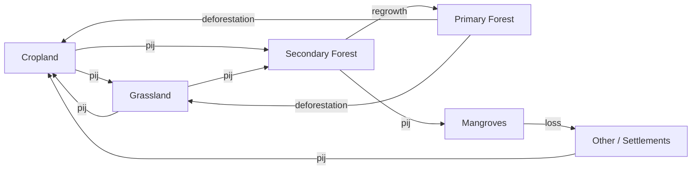

# AFOLU: Agriculture, Forestry & Land Use

<SectorCard sector="afolu" />

Welcome to Part III. AFOLU is the largest and most intricate of SISEPUEDE's four emission sectors — it couples a discrete-time Markov land-use model with responsive agricultural and livestock demand, soil carbon dynamics with multi-year lags, and a web of biogenic CH₄ and N₂O flows. Internally the sector is represented by the `AFOLU` class in `sisepuede/models/afolu.py`, a ~5,500-line module that orchestrates six subsectors.

## The Six AFOLU Subsectors

SISEPUEDE decomposes AFOLU into six tightly-coupled subsectors. Each has its own `_initialize_subsector_vars_*` routine and its own attribute table, but they are projected together because demand, area, and biomass flows cross subsector boundaries within each time step.

| Code | Name | Covers |
|---|---|---|
| **AGRC** | Agriculture | Crop production, residues, rice cultivation (CH₄), fertilizer-driven N₂O, crop combustion factors |
| **LVST** | Livestock | Animal populations, enteric fermentation (CH₄), grazing demand, livestock-derived trade |
| **LNDU** | Land Use | Markov transition matrices between land-use classes, LURF reallocation, land-use change emissions |
| **FRST** | Forestry | Biomass carbon stocks per forest class (primary, secondary, mangroves), sequestration and deforestation fluxes |
| **LSMM** | Livestock Manure Management | Manure CH₄ and N₂O by management system, biogas recovery |
| **SOIL** | Soil Management | Soil organic carbon (SOC) pools, direct/indirect N₂O from managed soils |

There is no separate "agriculture/livestock waste" subsector; waste-side flows are split between **AGRC** (crop residues burned or left on-field) and **LSMM** (manure). The Livestock Manure Management subsector plays that role.

## The Markov Land-Use Model

LNDU is the structural backbone of AFOLU. Land is partitioned into a small set of categories (cropland, grassland, primary forest, secondary forest, mangroves, wetlands, settlements, other). Between consecutive time periods, area moves between categories according to an annual **transition probability matrix** `pij`, where entry `(i, j)` is the probability that a hectare currently in class `i` will be in class `j` next year.

SISEPUEDE uses two flavors of this matrix:

1. **Unadjusted transition matrix** — the exogenous matrix read from the input template (`lndu_prob_transition_X_to_Y` fields). This encodes the "natural" or scenario-level land-use trajectory before any endogenous response.
2. **Adjusted transition matrix** — the matrix actually applied in each time step, after rescaling rows so that the realized area in cropland and grassland matches endogenous demand from AGRC and LVST.

Mathematically, if `x_t` is the vector of land areas across categories at time `t`, then:

$$ x_{t+1} = x_t^\top \cdot P_t $$

where `P_t` is the (possibly time-varying) transition matrix for that year. The code implements this in `AFOLU.project_land_use()` (line 4566) and integrates it with demand in `AFOLU.project_integrated_land_use()` (line 4124).

## LURF — the Land Use Reallocation Factor

The Markov matrix is exogenous, but **crop demand and livestock demand are endogenous** — they respond to GDP, GDP per capita, population, and trade within the same time step. This creates a consistency problem: the exogenous `pij` matrix may send (say) 2 Mha into cropland, but endogenous demand may only require 1.5 Mha. Which signal wins?

SISEPUEDE's answer is the **Land Use Reallocation Factor**, denoted η and constrained to the unit interval η ∈ [0, 1]. It is stored as the variable field `lndu_reallocation_factor` and is applied per time step.

Conceptually:

- **η = 0** → the exogenous transition matrix is binding. Land moves exactly as `pij` prescribes, and any excess or shortfall relative to endogenous demand is absorbed by yield changes, imports, or unsatisfied demand. This is the "scenario-dominant" regime.
- **η = 1** → endogenous demand is binding. The transition matrix is rescaled row-by-row so that the realized cropland and grassland areas exactly match the areas required to satisfy domestic crop and livestock demand at prevailing yields. This is the "demand-dominant" regime.
- **0 < η < 1** → a convex combination. The adjusted matrix is η-weighted between the unadjusted exogenous matrix and the fully-demand-reconciled matrix.

LURF is the single most important knob in AFOLU for reconciling top-down scenario narratives (e.g. "reforestation of 3 Mha by 2050") with bottom-up commodity demand. Setting η too high can make reforestation targets mathematically unreachable; setting η too low can lead to implausible yield or import swings. In practice, country calibrations often use η ≈ 0.5–0.8.

The implementation lives inside the integrated projection loop and is propagated through all downstream area-dependent calculations (biomass stocks, soil carbon, residues).

## Responsive Crop and Livestock Demand

Demand in AFOLU is not a fixed trajectory. The method `project_agrc_lvst_integrated_demands()` (line 3763) and its helper `project_per_capita_demand()` (line 4075) compute domestic demand for each crop class and each livestock class as a function of:

- **Population** — a straightforward multiplier on per-capita demand.
- **GDP and GDP per capita** — elasticity-driven scaling. Income-elastic commodities (meat, dairy) scale faster than staples (cereals, tubers).
- **Trade** — net imports and exports per commodity, which drive a wedge between production and consumption.

Livestock populations `lvst_pop_*` are then back-solved from meat/milk/egg demand and productivity factors. These populations feed directly into LSMM (manure) and enteric fermentation calculations.

## Enteric Fermentation, Manure, Rice, Residues, Fertilizer

AFOLU emission pathways follow the 2006 IPCC Guidelines + 2019 Refinement:

- **Enteric fermentation (CH₄)** — per-head emission factors by livestock class, applied to LVST populations. Cattle dominate.
- **Manure management (CH₄ + N₂O)** — LSMM splits manure across management systems (pasture, solid storage, liquid slurry, anaerobic digesters). Biogas recovery is tracked via `lsmm_recovered_biogas` and `lsmm_rf_biogas`.
- **Rice cultivation (CH₄)** — `agrc_yf_yield_rice` feeds into flooded-paddy CH₄ with water-management and organic-amendment scaling factors.
- **Crop residues** — AGRC computes residue mass per crop from yields and harvest indices, then partitions it across burned / left-on-field / removed. Combustion uses `modvar_agrc_combustion_factor`.
- **Fertilizer and managed-soil N₂O** — SOIL computes direct N₂O from synthetic + organic N inputs and indirect N₂O from volatilization and leaching, per IPCC Tier 1 defaults unless overridden.

## Soil Organic Carbon with Time Lags

SOC is not instantaneous. When land transitions between classes, or when management changes (e.g. conventional tillage → no-till), the soil carbon stock moves to a new steady state **over 20 years** by IPCC convention. SISEPUEDE represents this with lagged pools that span LNDU, AGRC, and LVST: each hectare-year carries a memory of its prior state, and emissions/removals are released linearly over the transition horizon.

This is why AFOLU outputs in early years of a simulation can look "sticky" — the SOC response to a land-use change scenario only fully materializes ~two decades in.

## Forestry: Primary, Secondary, Mangroves

FRST tracks biomass carbon by forest class: `$CAT-FOREST$` typically includes `primary`, `secondary`, and `mangroves`. Each class has its own:

- Biomass density (above + below ground)
- Sequestration rate (net annual carbon uptake per hectare)
- Harvest / deforestation emission factor

Transitions **into** secondary forest (from cropland or grassland abandonment) are the main reforestation lever. Transitions **out of** primary forest are deforestation, with the full biomass stock released as CO₂ (plus pulse CH₄/N₂O from burning if applicable). Mangroves are modeled separately because of their outsized per-hectare carbon density and distinct loss drivers. Harvested wood products are accounted for in `project_harvested_wood_products()` (line 4650).

## Key `AFOLU` Methods

| Method | Line | Role |
|---|---|---|
| `project()` | 5180 | Top-level entry point called by `SISEPUEDEModels`. Runs the full AFOLU pipeline for all time periods. |
| `project_integrated_land_use()` | 4124 | Couples Markov land-use to endogenous AGRC/LVST demand via LURF. |
| `project_land_use()` | 4566 | Applies the (adjusted) transition matrix to produce next-period area vectors. |
| `project_agrc_lvst_integrated_demands()` | 3763 | Solves domestic crop and livestock demand given GDP, population, trade. |
| `project_per_capita_demand()` | 4075 | Elasticity-driven per-capita demand scaling. |
| `project_harvested_wood_products()` | 4650 | HWP carbon pool accounting per IPCC Tier 1. |

All of these take the wide-format input DataFrame produced in Phase 5 of the execution pipeline and return arrays that are eventually stitched into `MODEL_OUTPUT`.

<Quiz>
  <Question q="What does the Land Use Reallocation Factor (LURF) η ∈ [0,1] control?">
    - [ ] The share of cropland that can be irrigated.
    - [x] The balance between the exogenous Markov transition matrix and endogenous crop/livestock demand when setting realized land areas.
    - [ ] The fraction of forest biomass released as CO₂ upon deforestation.
    - [ ] The elasticity of livestock demand to GDP per capita.
  </Question>
  <Question q="Which of the following is NOT one of SISEPUEDE's six AFOLU subsectors?">
    - [ ] AGRC
    - [ ] LSMM
    - [ ] SOIL
    - [x] WASO (solid waste)
  </Question>
  <Question q="Why do soil organic carbon (SOC) responses to a land-use change appear 'sticky' in the first years of a simulation?">
    - [ ] Because SOC is computed only every 10 years.
    - [x] Because IPCC methodology spreads SOC transitions over a ~20-year horizon, so stock changes accumulate slowly in lagged pools shared across LNDU, AGRC, and LVST.
    - [ ] Because the Julia solver caches SOC between runs.
    - [ ] Because SOC is treated as exogenous until 2050.
  </Question>
</Quiz>
