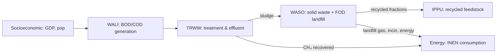

<SectorCard sector="ce" />

# Circular Economy: Waste & Wastewater

The **Circular Economy** sector in SISEPUEDE is a compact but consequential emissions domain: it captures methane and nitrous oxide releases from the way societies dispose of what they no longer want. Despite representing a smaller share of total emissions than AFOLU or Energy in most countries, waste and wastewater are disproportionately impactful because CH₄ has a GWP100 of ~27–30 (AR6 WG1 Ch.7, Table 7.SM.7) and landfill emissions persist for decades after deposition. The sector is implemented in `sisepuede/models/circular_economy.py` as the `CircularEconomy` class, and it follows the **IPCC 2006 Guidelines Volume 5 (Waste)** with the 2019 Refinement.

This module walks through the three subsectors — **Liquid Waste (WALI)**, **Wastewater Treatment (TRWW)**, and **Solid Waste (WASO)** — explains the execution order, introduces the First-Order Decay (FOD) landfill model, and shows how recycling flows feed back into IPPU.

---

## Subsectors at a glance

| Subsector | Code | Scope | Primary gases |
|---|---|---|---|
| Liquid Waste | `wali` | Domestic & industrial wastewater generation (BOD/COD loads) | CH₄, N₂O |
| Wastewater Treatment | `trww` | Treatment pathways (aerobic, anaerobic, septic, latrine, untreated) | CH₄, N₂O |
| Solid Waste | `waso` | MSW + ISW disposal: landfill, open dump, compost, anaerobic digestion, incineration, recycling | CH₄, N₂O, CO₂ |
| Industrial Energy (overlap) | `inen` | Energy recovered from landfill gas / incineration routed to Energy sector | — |

INEN is not a Circular Economy subsector proper — it lives in Energy Consumption — but CircularEconomy **emits variables consumed by INEN**, notably `Fraction of Landfill Gas Recovered for Energy` (`modvar_waso_frac_landfill_gas_ch4_to_energy`) and the incineration energy-recovery fractions for MSW and ISW. These close the loop by turning waste-sector byproducts into an INEN fuel input.

---

## Execution order: WALI → TRWW → WASO (→ INEN)

`CircularEconomy.project(df_ce_trajectories)` (line 2204) executes the subsectors in a fixed order dictated by physical dependencies:

In code, `project()` calls:

1. `model_socioeconomic.project()` — pulls GDP and population scalars that drive per-capita BOD and per-GDP COD loads.
2. `project_waste_liquid(...)` (line 981) — runs **WALI and TRWW jointly**. It computes total organic waste (TOW) from domestic BOD and industrial COD, distributes it across treatment pathways, and applies the CH₄/N₂O emission factors. Sludge produced during treatment is a side-output.
3. Extracts `modvar_trww_sludge_produced` via `get_optional_or_integrated_standard_variable()` and concatenates it to the input frame for WASO.
4. `project_waste_solid(...)` (line 1573) — runs WASO with sludge as an additional waste stream, then applies the FOD landfill model.
5. `merge_output_df_list(...)` and `add_subsector_emissions_aggregates(...)` assemble the wide-format output.

Note a small asymmetry compared to the AFOLU docstring shorthand: WALI and TRWW are **implemented inside the same method** (`project_waste_liquid`) because the organic load (WALI) and the treatment routing (TRWW) are numerically inseparable — TRWW emission factors multiply the WALI-generated TOW directly. The course says `project_wali()` / `project_trww()` conceptually; in practice they are one Python function.

---

## WALI: Liquid Waste generation

WALI computes two parallel streams:

- **Domestic wastewater** — driven by per-capita BOD load (`modvar_wali_bod_per_capita`), a correction factor for industrial discharges (`modvar_wali_bod_correction`), and population. BOD (Biochemical Oxygen Demand) is the IPCC default proxy for domestic organic load.
- **Industrial wastewater** — driven by COD per unit of GDP (`modvar_wali_cod_per_gdp`) disaggregated by industrial category. COD (Chemical Oxygen Demand) is the IPCC default for industrial streams because it better captures non-biodegradable organics.

The maximum CH₄-producing capacity of each stream is set by `modvar_wali_max_bod_capac` and `modvar_wali_max_cod_capac` (Bo in IPCC notation; default ~0.6 kg CH₄/kg BOD, 0.25 kg CH₄/kg COD). Phosphorous co-emission parameters (`modvar_wali_param_p_per_bod`, `..._p_per_cod`) are tracked for eutrophication accounting though they do not contribute to GHG totals.

---

## TRWW: Wastewater Treatment

Treatment takes the WALI-generated TOW and allocates it across pathways — aerobic activated sludge, anaerobic lagoon, septic tank, latrine, open sewer, untreated discharge. Each pathway has a **Methane Correction Factor** (MCF, `modvar_trww_mcf`) ∈ [0,1] per IPCC 2006 Vol 5 Ch.6 Table 6.3: 0 for well-managed aerobic plants, up to 0.8 for anaerobic lagoons.

CH₄ per pathway:

$$
E_{CH_4} = (TOW - S) \cdot B_o \cdot MCF - R
$$

where `S` is sludge removed and `R` is recovered methane routed to energy. N₂O is computed separately from the **effluent nitrogen load** using `modvar_trww_ef_n2o_wastewater_treatment` and an effluent factor (IPCC default 0.005 kg N₂O-N / kg N for effluent). The code exposes `modvar_trww_emissions_n2o_treatment` (plant-internal) and `modvar_trww_emissions_n2o_effluent` (downstream receiving water) separately — a useful distinction that many national inventories collapse.

Sludge produced (`modvar_trww_sludge_produced`) exits TRWW and enters WASO as an additional waste category, honoring the mass-balance principle that wastewater solids ultimately land either in a landfill, a compost pile, or an incinerator.

---

## WASO: Solid Waste and the First-Order Decay model

WASO is the largest of the three subsectors and where most of the CE sector's emissions originate. `project_waste_solid()` handles:

1. **Waste generation** — per-capita MSW (Municipal Solid Waste) and per-GDP ISW (Industrial Solid Waste) by waste category (food, paper, wood, textiles, plastics, metals, glass, rubber, other).
2. **Pathway allocation** — recycled, composted, anaerobically digested, incinerated, landfilled, open-dumped. Recycled fractions are specified per material, e.g. `waso_frac_recycled_paper`, `waso_frac_recycled_metal`. The non-recycled residual is split among incineration / landfill / open dump via `modvars_waso_frac_non_recyled_pathways`.
3. **Emissions**:
   - Composting: CH₄ and N₂O (`modvar_waso_ef_n2o_compost`, with flared-CH₄ capture `modvar_waso_frac_ch4_flared_composting`).
   - Anaerobic digestion: CH₄ with biogas recovery (`modvar_waso_frac_biogas`).
   - Incineration: fossil-CO₂ (from plastics/rubber/textiles) + N₂O (`modvar_waso_ef_n2o_incineration`); energy recovery fractions split MSW vs ISW.
   - Landfill: **First-Order Decay** (see below).
   - Open dump: FOD applied with `modvar_waso_mcf_open_dumping_average` (typically 0.4–0.8 depending on depth).

### The FOD model

Landfills do not emit the year waste is deposited — they emit over decades as organic carbon decomposes anaerobically. The `CircularEconomy.fod()` method (line 562) implements the IPCC 2006 Vol 5 Ch.3 First-Order Decay:

$$
DDOCm_{decomposed,t} = DDOCm_{accumulated,t-1} \cdot (1 - e^{-k})
$$

where:
- `DDOCm` = Decomposable Degradable Organic Carbon mass = waste × DOC × DOCf (the `vec_ddocm_factors` argument, line 578).
- `k` = decay rate per waste category (slow for wood ~0.03 yr⁻¹, fast for food ~0.185 yr⁻¹ in wet tropical climates).
- `MCF` (`vec_mcf`) weights emissions by landfill management quality, time-varying to represent transitions from open dumps to engineered landfills.

CH₄ emitted equals `DDOCm_decomposed · F · 16/12`, where `F` is the CH₄ fraction of landfill gas (default 0.5). The `FODError` exception class (line 19) guards against shape mismatches between the waste-by-time array, per-category factors, and the time-varying MCF vector.

Recovered landfill gas (`modvar_waso_frac_landfill_gas_ch4_to_energy`) is subtracted from the net emission and exported as a fuel source to INEN.

---

## Inter-sector coupling

The CircularEconomy → IPPU feedback is one of SISEPUEDE's clearest cross-sector links. IPPU's virgin-material production (cement, steel, aluminum, plastics, glass, paper) is reduced by the recycled fraction produced in WASO. In `SISEPUEDEModels` (`sisepuede/manager/sisepuede_models.py`), IPPU runs **after** CircularEconomy specifically so it can read `modvar_waso_waste_total_recycled` and the per-material recycled fractions, scaling down the virgin-production emission factors accordingly.

This means: a transformer that increases `waso_frac_recycled_paper` reduces IPPU pulp-and-paper process emissions without any explicit IPPU-side lever. Keep this in mind when composing strategies — double-counting is easy to introduce by pairing WASO recycling transformers with IPPU virgin-reduction transformers that assume the baseline recycling rate.

---

## Key methods summary

| Method | File line | Role |
|---|---|---|
| `CircularEconomy.project()` | 2204 | Orchestrates WALI+TRWW then WASO; adds subsector totals |
| `project_waste_liquid()` | 981 | Joint WALI + TRWW; returns TOW, treatment emissions, sludge |
| `project_waste_solid()` | 1573 | WASO including FOD landfill model |
| `fod()` | 562 | IPCC FOD kernel (DDOCm decay, per-category k, time-varying MCF) |
| `project_protein_consumption()` | 865 | Feeds domestic N load for wastewater N₂O |

---

<Quiz>
  <Question prompt="Why does SISEPUEDE run CircularEconomy before IPPU in SISEPUEDEModels?">
    <Choice correct>IPPU reads recycled-material fractions from WASO output to scale down virgin production emission factors.</Choice>
    <Choice>IPPU depends on wastewater N₂O for fertilizer production accounting.</Choice>
    <Choice>Ordering is arbitrary; either order produces the same output.</Choice>
    <Choice>IPPU needs landfill methane as a process input.</Choice>
  </Question>
  <Question prompt="In the FOD landfill model, what does the MCF (Methane Correction Factor) represent?">
    <Choice>The fraction of landfill gas that is CH₄ versus CO₂.</Choice>
    <Choice correct>The degree to which the disposal site promotes anaerobic conditions — 1.0 for managed anaerobic landfills, lower for shallow open dumps.</Choice>
    <Choice>The decay rate constant k for each waste category.</Choice>
    <Choice>The mass of decomposable organic carbon per tonne of waste.</Choice>
  </Question>
  <Question prompt="Why are WALI and TRWW implemented in a single method, `project_waste_liquid()`, rather than separately?">
    <Choice>Historical accident; they will be split in a future refactor.</Choice>
    <Choice>WALI emissions occur only inside treatment plants.</Choice>
    <Choice correct>WALI-generated TOW is numerically inseparable from TRWW pathway allocation and MCF-based emission factors; splitting them would duplicate the allocation arrays.</Choice>
    <Choice>TRWW does not produce emissions of its own.</Choice>
  </Question>
</Quiz>
