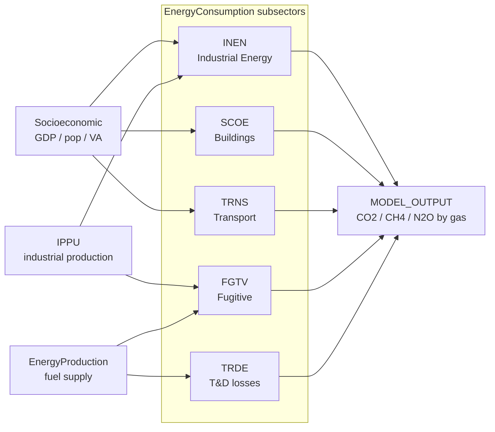

<SectorCard sector="energy" />

# Energy Consumption: Demand-Side Subsectors

The `EnergyConsumption` class (`sisepuede/models/energy_consumption.py`) is the demand-side half of SISEPUEDE's energy system. Where `EnergyProduction` (Module 10) solves a Julia/NeMo-Mod linear program for the electricity and fuel supply mix, `EnergyConsumption` computes **how much useful energy each sector needs**, **which fuels deliver it**, and the **direct combustion emissions** that result.

It runs five subsector pipelines orchestrated by `EnergyConsumption.project()`, which dispatches in turn to:

- `project_fugitive_emissions()` — **FGTV**
- `project_industrial_energy()` — **INEN**
- `project_scoe()` — **SCOE**
- `project_transportation()` + `project_transportation_demand()` — **TRNS / TRDE**
- `project_ccsq()` — carbon capture energy (auxiliary, not one of the five demand subsectors)

All five share a common structural pattern: an **activity driver** (pulled from `Socioeconomic`, `AFOLU`, `IPPU`, or `CircularEconomy`) is multiplied by an **energy intensity**, then disaggregated across fuels by a **simplex fuel-mix vector**, and finally converted to emissions via `enfu`-indexed combustion factors.

## The five subsectors at a glance



## Fuel mix as a simplex

The most important structural idea in `EnergyConsumption` is that **fuel mixes are simplex variables**: for any energy-using category `c`, the fractions of demand met by each fuel `f` must satisfy

$$\sum_{f \in \mathrm{enfu}} \mathrm{frac\_fuel\_consumed}_{c,f} = 1, \quad \mathrm{frac} \in [0,1].$$

Each of these fraction families is declared as a single `variable_trajectory_group` in the template file so that **`SamplingUnit`** (Module 7) perturbs them jointly on the simplex — never independently. Examples:

- `inen_frac_fuel_consumed_cement_natural_gas`, `inen_frac_fuel_consumed_cement_coal`, `inen_frac_fuel_consumed_cement_electricity`, … → sum to 1 across `enfu` for the `cement` industry.
- `scoe_frac_heat_en_residential_electricity`, `scoe_frac_heat_en_residential_natural_gas`, … → residential heating fuel mix.
- `trns_fuel_fraction_road_light_electricity`, `trns_fuel_fraction_road_light_gasoline`, `trns_fuel_fraction_road_light_diesel`, … → light-duty road fuel mix.

When you build a transformer like `tx_trns_electrify_road_light`, you are **shifting mass on this simplex** — increasing the electricity fraction while proportionally decreasing the others. The helper `_baselib_energy` contains the renormalization routines used by the transformer library so that no matter how many fractions you perturb, the simplex constraint is preserved before the DataFrame ever reaches `EnergyConsumption.project()`.

## INEN — Industrial Energy

`project_industrial_energy()` (line 2757) computes energy demand for each industrial category in `$CAT-INDUSTRY$` (cement, chemicals, iron_steel, paper, glass, food, textiles, …). Two regimes exist:

1. **IPPU-linked industries** (cement, iron_steel, chemicals, paper, …): physical production tonnage comes directly from the `IPPU` model output — typically `ippu_produced_tonne_cement`, `ippu_produced_tonne_iron_steel`, etc. INEN multiplies this by `inen_en_prod_intensity_factor_{industry}_{fuel}` to obtain fuel-specific energy demand (TJ/tonne of product).
2. **Value-added industries** (other_industry, mining, construction): demand scales with the industry's value added from `Socioeconomic` (`econ_va_{industry}_mmm_usd`) multiplied by `inen_energy_demand_intensity_factor_{industry}`.

In both regimes, the resulting per-category energy demand is split across fuels by the `inen_frac_fuel_consumed_{industry}_{fuel}` simplex, then multiplied by combustion emission factors (`enfu_ef_combustion_stationary_co2`, `_ch4`, `_n2o`) from the fuel attribute table. INEN also **reports fuel demand back** to `EnergyProduction` so that downstream fuel supply adequacy is checked.

## SCOE — Stationary Combustion & Other Energy (Buildings)

`project_scoe()` (line 3149) covers commercial and residential buildings. The activity drivers come from `Socioeconomic`:

- Residential: `gnrl_occupancy_{cat}` × occupied-floorspace-per-capita × population.
- Commercial: sectoral value added × commercial-floorspace-per-MMM-USD.

Four end-use services are modelled explicitly: **heating**, **cooking**, **lighting**, and **appliances/other**. Each has its own intensity (`scoe_consumpinit_energy_per_hh_heat`, `scoe_consumpinit_energy_per_hh_cook`, …) and its own fuel-mix simplex. Heating and cooking are the dominant direct-emissions services (natural gas, LPG, biomass); lighting and appliances are effectively pure electricity and so their emissions are attributed upstream to `EnergyProduction`.

The subsector also enforces **efficiency drifts** via `scoe_eff_heat_en_{cat}_{fuel}` — e.g. a condensing-boiler transformer increases the efficiency coefficient on `natural_gas` for residential heating, reducing the TJ per household without changing the fuel-mix fraction.

## TRNS — Transportation

`project_transportation()` (line 3543) is the most structurally complex subsector, organised as a **mode × vehicle-technology × fuel** tensor.

- **Modes** (`$CAT-TRANSPORTATION$`): `road_light`, `road_heavy_freight`, `road_heavy_passenger`, `rail_freight`, `rail_passenger`, `aviation`, `water_borne`, `public`.
- **Vehicle techs** (`$CAT-TRANSPORTATION-DEMAND$` / vehicle registry): fleet composition per mode.
- **Fuels** (`enfu`): gasoline, diesel, electricity, hydrogen, natural_gas, biofuels, kerosene, fuel_oil.

Demand (`project_transportation_demand()`, line 4134) is computed first in service units — passenger-km (`trns_vehdist_pkm_lightduty`, `trns_vehdist_pkm_public`) and tonne-km (`trns_vehdist_tkm_road_heavy_freight`, `trns_vehdist_tkm_rail_freight`) — driven by population, GDP/capita elasticities, and freight intensity of GDP.

Service demand is then converted to energy through:

1. A **modal split** simplex (what share of pkm goes to light road vs. public vs. rail).
2. A **fuel-mix** simplex per mode (`trns_fuel_fraction_road_light_{fuel}`).
3. A **specific fuel consumption** `trns_average_vehicle_energy_consumption_{mode}_{fuel}` in MJ/vkm — the efficiency coefficient.

The efficiency term is what electrification transformers exploit: an electric drivetrain has roughly one-third the MJ/vkm of an internal-combustion equivalent, so shifting simplex mass toward electricity reduces final energy demand **and** cuts direct tail-pipe CO₂/CH₄/N₂O from `enfu_ef_combustion_mobile_*` to zero for that fraction.

## FGTV — Fugitive Emissions

`project_fugitive_emissions()` (line 2408) handles emissions that escape *before* combustion: oil and gas venting/flaring/leakage, and coal-mining methane. Activity is **supply-side**: it pulls fuel production volumes from the `enfu` production estimates (computed by `project_enfu_production_and_demands()` at line 1959, which reconciles INEN + SCOE + TRNS + power-sector fuel demand with domestic production and imports).

Core variable fields:

- `entc_ef_fugitive_fuel_ch4_{fuel}`, `entc_ef_fugitive_fuel_co2_{fuel}` — per-unit fugitive factors for natural_gas, oil, coal.
- `entc_frac_{fuel}_flared`, `entc_frac_{fuel}_vented` — flaring vs. venting split for oil & gas associated gas.

This is exactly where the `TFR:FGTV:INC_GAS_RECOVERY` transformer intervenes — it reduces the vented-gas fraction and redirects captured methane into the `natural_gas` supply stream. Coal-mining methane is handled by a separate branch driven by `enfu_production_frac_coal_surface` vs. underground, with the underground CH4 factor roughly an order of magnitude larger.

## TRDE — Transmission & Distribution

TRDE is the thinnest subsector: electricity and gas network losses, modelled as a fractional overhead on delivered energy. `trde_loss_frac_electricity_transmission` and `trde_loss_frac_natural_gas_distribution` are applied during `project_enfu_production_and_demands()` so that the fuel demand passed to `EnergyProduction` is grossed-up for losses. The direct emissions attributable to TRDE (SF6 from switchgear, fugitive CH4 from distribution mains) are then added back in from small EF tables.

## The orchestrator

`EnergyConsumption.project()` (line 4299) runs the subsectors in the order:

```python
# 1. resolve demand drivers from upstream models (Socioeconomic, IPPU)
# 2. INEN, SCOE, TRNS → final fuel demand per fuel
# 3. project_enfu_production_and_demands() → reconcile demand vs. supply
# 4. FGTV (needs supply), TRDE (needs delivered volumes)
# 5. CCSQ (carbon capture energy), concatenate outputs
```

Because step 3 reconciles demand and supply, running `EnergyConsumption` standalone will report imports/exports as residuals; running it inside `SISEPUEDEModels.project()` (Module 5) passes the reconciled fuel demand through to the NeMo-Mod LP, which resolves the electricity mix that serves it.

<Quiz>
  <Question>
    What constraint must every `inen_frac_fuel_consumed_{industry}_{fuel}` family of variables satisfy, and why is this enforced at the `SamplingUnit` level rather than at each fraction individually?
    <Answer correct>
      They must sum to 1 across all fuels for each industry (simplex constraint). Perturbing each fraction independently under LHS would break the constraint, so all fractions in the mix share a `variable_trajectory_group` and are perturbed jointly.
    </Answer>
    <Answer>
      They must each be less than 0.5; the cap prevents any single fuel from dominating.
    </Answer>
    <Answer>
      No constraint — each fraction is sampled independently and then normalised after the model runs.
    </Answer>
  </Question>
  <Question>
    Which upstream model provides the physical production tonnage that INEN uses to compute cement-industry energy demand?
    <Answer>
      `Socioeconomic`, via value added.
    </Answer>
    <Answer correct>
      `IPPU`, via `ippu_produced_tonne_cement`.
    </Answer>
    <Answer>
      `EnergyProduction`, via the NeMo-Mod LP output.
    </Answer>
  </Question>
  <Question>
    Why must `project_fugitive_emissions()` run *after* `project_enfu_production_and_demands()` inside `EnergyConsumption.project()`?
    <Answer>
      Because FGTV emissions depend on GDP, which is computed in that step.
    </Answer>
    <Answer correct>
      Because FGTV is driven by fuel production and supply volumes, which are only reconciled (demand + T&D losses + imports/exports) inside `project_enfu_production_and_demands()`.
    </Answer>
    <Answer>
      It does not — FGTV runs first so that flared gas can enter the supply stream.
    </Answer>
  </Question>
</Quiz>
