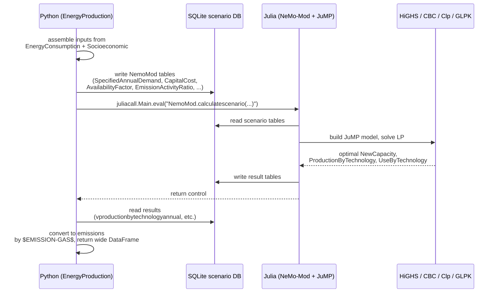

<SectorCard sector="energy" />

# Energy Production: the Julia/NeMo-Mod Linear Program

Every other sectoral model in SISEPUEDE is, at its core, an accounting engine: multiply an activity by an emission factor, apply a 2006 IPCC Guidelines refinement, sum across categories. `EnergyProduction` is different. Electricity generation — unlike cement kilns, enteric fermentation, or landfill methane — is not a quantity you can read off a spreadsheet. It is the *outcome of a dispatch decision* made against a portfolio of power plants, each with its own fuel cost, efficiency, ramp constraints, and availability factor. You cannot derive generation mix from activity × factor; you have to **solve for it**.

That is why `EnergyProduction` (`sisepuede/models/energy_production.py`) is a thin Python wrapper around a full-blown **Linear Program** written in Julia. The LP is solved by [**NeMo-Mod**](https://sei-international.github.io/NemoMod.jl/stable/) (Next-generation Energy Modeling system for Optimization), an open-source capacity-expansion and dispatch model developed by the Stockholm Environment Institute, which in turn builds on the OSeMOSYS reference formulation and the JuMP algebraic modeling language.

---

## Why electricity needs an LP, not a factor table

Consider what the dispatcher must decide every hour of every year of the projection horizon:

- **Which plants run** (unit commitment at an aggregate level)
- **How much each plant generates** (subject to availability factors, fuel bounds)
- **Whether to build new capacity** (capacity expansion — endogenous investment)
- **How much to import/export** across regional interconnections
- **How much storage to charge/discharge**

All of these are coupled. Build more solar and you shift thermal dispatch; retire coal and you may need gas peakers; add a carbon price and the merit order reorders itself. No IPCC Tier-1/2/3 approach can capture this — the emissions depend on the *solution of an optimization problem* whose objective is minimum discounted system cost subject to demand-balance, capacity, and policy constraints.

NeMo-Mod handles **capacity expansion and dispatch in the same LP**. The decision variables include `NewCapacity[technology, year]`, `TotalCapacityAnnual[technology, year]`, and `RateOfActivity[region, time_slice, technology, mode, year]`, all subject to demand-balance equations keyed on SISEPUEDE's electricity demand projection.

---

## The technology portfolio

Inputs to NeMo-Mod describe each technology in the attribute tables under `$CAT-TECHNOLOGY$`. The portfolio spans:

| Class | Technologies |
|---|---|
| **Thermal fossil** | Coal (pulverized, supercritical), natural gas combined cycle (NGCC), gas turbine peakers, oil/diesel, biomass combustion |
| **Thermal with CCS** | Coal+CCS, gas+CCS, biomass+CCS (BECCS, net-negative) |
| **Renewable** | Solar PV (utility, distributed), concentrating solar, onshore wind, offshore wind, run-of-river and reservoir hydro, geothermal, tidal, wave |
| **Nuclear** | Conventional LWR, SMR variants |
| **Storage / flexibility** | Pumped hydro, battery storage, hydrogen turbines |
| **Fuel production** | Coal mining, oil refining, gas processing, LNG, ammonia, hydrogen electrolysis — each with their own fugitive/process emissions |

Note the last row. `EnergyProduction` covers **more than the power sector**: it also computes emissions from **fuel production** (coal mining fugitives, refinery combustion, NG processing, hydrogen production pathways). This is why the class docstring reads: *"calculate emissions from electricity generation and fuel production."*

---

## The SQLite handshake

Python and Julia are different runtimes with different memory spaces. SISEPUEDE avoids shoveling DataFrames across the FFI boundary by using **SQLite as the exchange medium**:



Each scenario gets a fresh SQLite database populated with the full NeMo-Mod schema: `REGION`, `TECHNOLOGY`, `FUEL`, `EMISSION`, `YEAR`, `TIMESLICE`, plus the parameter tables (`CapitalCost`, `VariableCost`, `FixedCost`, `OperationalLife`, `AvailabilityFactor`, `CapacityFactor`, `EmissionActivityRatio`, `SpecifiedAnnualDemand`, `SpecifiedDemandProfile`, `ReserveMarginTagTechnology`, and so on). After `NemoMod.calculatescenario(...)` returns, the Python side queries result tables beginning with `v` (for *variable*), such as `vproductionbytechnologyannual` and `vnewcapacity`, and folds them back into SISEPUEDE's canonical wide-format output schema.

---

## PyJulia / juliacall: one Julia process per run

SISEPUEDE uses **juliacall** (from the `PythonCall.jl` / `juliapkg` ecosystem) rather than the older PyJulia. The bridge is initialized once, near the top of `EnergyProduction.__init__`:

```python
import juliapkg
juliapkg.require_julia("1.10.4")
# ...resolve environment at sisepuede/julia/pyjuliapkg/...
from juliacall import Main as julia_main
```

Two properties matter:

1. **The Julia runtime persists for the life of the Python process.** Starting Julia costs several seconds of JIT warm-up — you pay it once, then every subsequent `NemoMod.calculatescenario` call re-uses the compiled methods. This is critical inside `SISEPUEDEExperimentalManager`, which may call the LP hundreds of times for different `primary_id` values.
2. **The Julia environment is pinned.** `sisepuede/julia/Project.toml` lists the dependency set — NemoMod 2.2, JuMP 1.27, HiGHS, CBC, Clp, GLPK, Ipopt, SQLite, PythonCall 0.9.25 — and `Manifest.toml` locks exact versions. `juliapkg` reproduces this environment on first import, so every SISEPUEDE user solves the identical LP.

The default solver is **HiGHS** (open-source, fast simplex/interior point), with CBC/Clp/GLPK as fallbacks; Ipopt ships for the occasional nonlinear extension. A user-tunable `_SOLVER_OPTION_HIGHS_USER_BOUND_SCALE` can be passed through for numerically stiff problems.

---

## Transmission losses loop back to Energy Consumption

`EnergyProduction` does not model demand — demand comes **in** from `EnergyConsumption` (SCOE, INEN, TRNS, TRDE, FGTV) and from the `Socioeconomic` drivers. But once the LP is solved, the *losses* incurred in generation and transmission need to be booked somewhere. SISEPUEDE routes transmission & distribution losses back into the **TRDE (Transmission, Distribution, and Exchange)** subsector of Energy Consumption. This closes the loop: EnergyConsumption demands electricity → EnergyProduction dispatches plants → implied T&D losses flow back into TRDE's accounting. The effective demand the LP sees on the next iteration of sensitivity analysis is therefore the gross demand including own-use and losses.

---

## `EnergyProduction.project()` in the execution pipeline

Inside `SISEPUEDEModels.project()` (see `sisepuede/manager/sisepuede_models.py`), Energy Production is called **fourth**, after Socioeconomic, AFOLU, and CircularEconomy, and **before** EnergyConsumption finishes:

1. `Socioeconomic.project()` — GDP, population, value added
2. `AFOLU.project()` — biomass supply, bioenergy potentials
3. `CircularEconomy.project()` — MSW-to-energy contributions
4. **`EnergyProduction.project()`** — solves the LP, returns generation mix and emissions
5. `EnergyConsumption.project()` — finalizes end-use emissions and TRDE
6. `IPPU.project()` — industrial processes, drawing recycled fractions from CircularEconomy

The `project()` method itself (line 10641 of `energy_production.py`) accepts the wide-format DataFrame, writes the scenario SQLite, invokes Julia, reads results, and returns the emissions DataFrame keyed by `$EMISSION-GAS$` × `$CAT-TECHNOLOGY$`.

---

## Files worth knowing

| Path | Role |
|---|---|
| `sisepuede/models/energy_production.py` | Python wrapper: input assembly, SQLite write, Julia invocation, result harvest |
| `sisepuede/julia/Project.toml` | Julia package manifest (NemoMod, JuMP, HiGHS, ...) |
| `sisepuede/julia/Manifest.toml` | Locked dependency versions |
| `sisepuede/julia/call_nemomod.jl` | Entry point called from Python — wraps `NemoMod.calculatescenario` |
| `sisepuede/julia/setup_analysis.jl` | Scenario-level Julia setup |
| `sisepuede/julia/setup_runs.jl` | Per-run Julia configuration |
| `sisepuede/julia/support_functions.jl` | Helpers: solver selection, logging, result extraction |
| `sisepuede/julia/pyjuliapkg/meta.json` | juliapkg environment metadata |

---

## Quiz

<Quiz>

**1. Why does SISEPUEDE use a linear program for electricity generation instead of emission factors?**

- [ ] Because IPCC 2019 Refinement mandates optimization for power sector
- [x] Because generation mix is the outcome of a dispatch + capacity-expansion decision, not a fixed activity × factor product
- [ ] Because Python is too slow to multiply matrices
- [ ] Because emissions factors for power plants are not published

**2. How do Python and Julia exchange scenario data in SISEPUEDE?**

- [ ] Via a REST API over localhost
- [ ] Via shared NumPy memory buffers
- [x] Via a SQLite database — Python writes NeMo-Mod input tables, Julia reads them, solves, and writes `v*` result tables back
- [ ] Via pickled pandas DataFrames piped through stdout

**3. What does `juliacall` (from PythonCall.jl) buy SISEPUEDE compared to spawning a fresh `julia` subprocess per scenario?**

- [ ] Lower memory use
- [ ] Access to GPU solvers
- [x] The Julia runtime stays hot for the life of the Python process, so JIT warm-up is paid once and NemoMod compiled methods are reused across hundreds of `primary_id` runs
- [ ] Automatic translation of Python exceptions to Julia

</Quiz>
