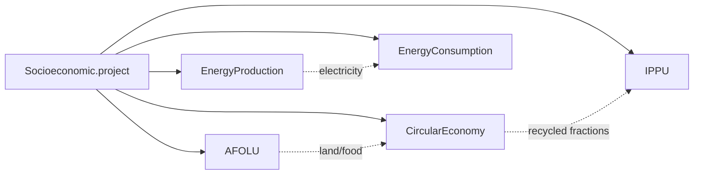

# Socioeconomic: GDP, Population & Drivers

<SectorCard sector="socio" />

The Socioeconomic model is the smallest module in SISEPUEDE — its primary class, `Socioeconomic` in `sisepuede/models/socioeconomic.py`, is well under 500 lines and emits **zero greenhouse gases**. And yet, every other model in the framework depends on it. Socioeconomic is the *driver* layer: it produces the demographic and macroeconomic trajectories that the four emission sectors convert into food demand, waste generation, vehicle fleets, building floorspace, and industrial output.

If AFOLU, Circular Economy, Energy, and IPPU are the engines of SISEPUEDE's emissions accounting, Socioeconomic is the throttle.

## Not an Emission Sector — A Driver Model

Open `sisepuede/models/socioeconomic.py` and you will find no `emissions_*` arrays, no GWP multipliers, no IPCC factor lookups. The class only declares two subsectors, both flagged as **non-emission**:

| Code | Subsector | Purpose |
|---|---|---|
| **ECON** | Economic | GDP (real, by aggregate or sector) and GDP per capita |
| **GNRL** | General | Population (by subgroup), households, occupancy rate, area of region, climate-change scalars, optional emission caps |

The module docstring is explicit:

> *"Use Socioeconomic to calculate key drivers of emissions that are shared across SISEPUEDE emissions models and sectors/subsectors. Includes model variables for the following model subsectors (non-emission): Economic (ECON), General (GNRL)."*

Because Socioeconomic produces no emissions of its own, it does not appear in the per-sector totals of `MODEL_OUTPUT`. But its outputs are written into the same wide-format DataFrame that is then handed to AFOLU, CE, Energy, and IPPU — which is why it has to run **first**.

## Why It Runs First

Recall the fixed execution order from `SISEPUEDEModels.project()`:



Every downstream sector reads at least one of: `gnrl_pop_total`, `econ_gdp`, `econ_gdp_per_capita`, `gnrl_num_hh`, or `gnrl_occ_rate`. If Socioeconomic has not yet written these columns into the trajectory DataFrame, the very first variable extraction in AFOLU will raise a `KeyError` from `check_df_fields`. Running Socioeconomic first is not a stylistic choice — it is a hard data dependency.

## What `project()` Actually Computes

The `Socioeconomic.project()` method (line 282 of `socioeconomic.py`) is short and reads almost like pseudocode. Given an input DataFrame `df_se_trajectories` containing exogenous **GDP** and **subpopulation** trajectories, it computes:

### 1. Total population

```python
vec_pop = np.sum(
    self.model_attributes.extract_model_variable(
        df_se_trajectories,
        self.modvar_gnrl_subpop,
        return_type = "array_base",
    ),
    axis = 1,
)
```

`gnrl_subpop` may be disaggregated by age, sex, urban/rural, or other categories defined in the `$CAT-GNRL$` attribute table — Socioeconomic just sums across the subpopulation axis to produce a single `gnrl_pop_total` series.

### 2. GDP per capita

```python
vec_gdp_per_capita = np.nan_to_num(vec_gdp / vec_pop, nan=0.0, posinf=0.0)
vec_gdp_per_capita *= self.model_attributes.get_variable_unit_conversion_factor(
    self.modvar_econ_gdp,
    self.modvar_econ_gdp_per_capita,
    "monetary",
)
```

The unit-conversion call is critical: `econ_gdp` may be expressed in millions of constant USD while `econ_gdp_per_capita` is per-capita constant USD; `ModelAttributes` resolves the scaling so downstream elasticities see the right magnitudes.

### 3. Annual growth rates

```python
vec_rates_gdp           = vec_gdp[1:]/vec_gdp[0:-1] - 1
vec_rates_gdp_per_capita = vec_gdp_per_capita[1:]/vec_gdp_per_capita[0:-1] - 1
```

These rate vectors are *not* written into the public output DataFrame. They are returned in a second DataFrame, `df_se_internal_shared_variables`, that `SISEPUEDEModels` keeps in scope and feeds to elasticity-driven projections in AFOLU and Circular Economy.

### 4. Household occupancy and household count

```python
vec_gnrl_growth_occrate = sf.project_growth_scalar_from_elasticity(
    vec_rates_gdp_per_capita,
    vec_gnrl_elast_occrate_to_gdppc,
    False, "standard",
)
vec_gnrl_occrate = vec_gnrl_init_occrate[0] * vec_gnrl_growth_occrate
vec_gnrl_num_hh   = np.round(vec_pop / vec_gnrl_occrate).astype(int)
```

The number of households is endogenous: it depends on the initial occupancy rate, an elasticity to GDP per capita, and the population trajectory. As economies grow, households shrink (lower occupancy), so household counts grow faster than population — exactly the pattern that drives residential floorspace and per-household waste in the Energy and CE sectors.

## How Each Downstream Sector Uses These Drivers

| Sector | Drivers consumed | Effect |
|---|---|---|
| **AFOLU** | `econ_gdp_per_capita`, `gnrl_pop_total`, growth rates | Per-capita food demand (calories, protein, red meat fraction); livestock and crop demand scale with population × per-capita demand; trade balances responsive to GDP |
| **Circular Economy** | `gnrl_pop_total`, `gnrl_num_hh`, `econ_gdp_per_capita` | Per-capita MSW generation, wastewater volumes, and per-household waste composition |
| **Energy** | `econ_gdp` (sectoral), `gnrl_num_hh`, `econ_gdp_per_capita` | Industrial output drives INEN energy demand; floorspace scales with households; vehicle ownership and km-travelled in TRNS scale with GDP per capita |
| **IPPU** | `econ_gdp` (industrial), `gnrl_pop_total` | Cement, steel, chemicals, and HFC-bearing product demand all scale with sectoral GDP and population |

## Trade Adjustments

SISEPUEDE does not solve a global trade equilibrium, but it *does* let each region's net imports of crops, livestock products, and industrial goods respond to domestic demand. The mechanism is an **elasticity of net imports to GDP per capita**, encoded in sector-specific variables (e.g. `agrc_elast_*_imports_to_gdppc`, `lvst_elast_*_imports_to_gdppc`). These elasticities live in the AFOLU and IPPU attribute tables, but they are *evaluated* against `vec_rates_gdp_per_capita` which Socioeconomic produces. Without Socioeconomic, there is no trade response.

## Optional Inputs Worth Noting

A few `gnrl_*` model variables are declared but only used if populated:

- `gnrl_emission_limit_ch4`, `gnrl_emission_limit_co2`, `gnrl_emission_limit_n2o` — annual emission caps that downstream reporting can compare against.
- `gnrl_climate_change_hydropower_availability` — a climate-change scalar applied to hydro capacity factors in EnergyProduction.
- `gnrl_frac_eating_red_meat` — overrides the AFOLU livestock demand split when present.
- `gnrl_area_of_region` — the denominator for area-normalised reporting; not the same as land-use areas, which are tracked endogenously by LNDU.

## The Two-DataFrame Return Convention

When called with `project_for_internal=True` (the default inside `SISEPUEDEModels`), `project()` returns a tuple:

```
(df_se_trajectories, df_se_internal_shared_variables)
```

The first is the augmented trajectory table that gets passed to all downstream sectors. The second carries the per-period growth rates whose final row is `NaN` (rates are defined between consecutive periods, so a `T`-period input yields `T-1` rate rows). Treat the internal frame as private to the integrated pipeline — it is not a column of `MODEL_OUTPUT`.

<Quiz>
  <Question q="Why does Socioeconomic always run first in SISEPUEDE's integrated pipeline?">
    - [ ] Because it is the most computationally expensive sector and benefits from running on a cold cache.
    - [x] Because every downstream sector reads population, GDP, GDP per capita, or household counts from the trajectory DataFrame, and those columns must exist before AFOLU/CE/Energy/IPPU run.
    - [ ] Because the Julia solver requires socioeconomic outputs to initialize NeMo-Mod.
    - [ ] Because IPCC methodology mandates a fixed sector order.
  </Question>
  <Question q="How is the household count `gnrl_num_hh` produced inside `Socioeconomic.project()`?">
    - [ ] Read directly from the input template as an exogenous trajectory.
    - [ ] Estimated from a regression on per-capita waste generation.
    - [x] Computed endogenously as `population / occupancy_rate`, where the occupancy rate evolves from an initial value via an elasticity to GDP per capita.
    - [ ] Set equal to `population / 4` as a global default.
  </Question>
  <Question q="Which two model subsectors does the `Socioeconomic` class own?">
    - [ ] ENRG and TRNS
    - [ ] AGRC and LVST
    - [x] ECON (Economic) and GNRL (General) — both flagged as non-emission.
    - [ ] ECON and IPPU
  </Question>
</Quiz>
