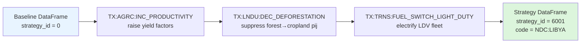

# Strategies: Composing Transformations

In Module 13 we saw that a **transformation** is a single, parameterized policy lever — a callable that takes a baseline input DataFrame and returns a modified DataFrame. A real decarbonization pathway, however, is almost never a single lever. It is a *bundle*: improve crop productivity **and** stop deforestation **and** electrify light-duty transport **and** switch industrial low-heat to renewables. SISEPUEDE captures that bundling concept with the **`Strategy`** class.

A **strategy** is an ordered set of transformations applied to the baseline input database. It is identified by an integer `strategy_id` and a human-readable `strategy_code`. Strategy `0` is reserved for the **baseline** (the `BASE` code) — no transformations applied, the unaltered input template flowing straight into the sectoral models.

## Where Strategies Live in the Code

Three files form the strategy machinery, all under `sisepuede/transformers/`:

| File | Role |
|---|---|
| `transformations.py` | `Transformations` registry — loads every transformation YAML/CSV and exposes them by code |
| `strategies.py` | `Strategy` class (composes transformations) and `Strategies` collection |
| `transformers.py` | The library of underlying transformer functions that transformations parameterize |

The strategy registry itself is an attribute table. The two relevant files in `sisepuede/attributes/` are:

- **`attribute_dim_strategy_id.csv`** — the canonical `strategy_id → strategy_code` map, with descriptions and the `baseline_strategy_id` pointer.
- **`attribute_strategy_code.csv`** — a wide *membership matrix*: one row per strategy, one column per `TX:*` transformation code, with `1`/`0` flags showing which transformations belong to each strategy.

A trimmed view of `attribute_dim_strategy_id.csv`:

```csv
strategy_id,strategy,strategy_code,baseline_strategy_id,Description
0,Baseline NDP,BASE,1,Base assumptions to which all transformations are applied
1001,AGRC: All transformations,AGRC:ALL,0,All agricultural transformations
1005,AGRC: Improve crop productivity,AGRC:INC_PRODUCTIVITY,0,Increase crop yield factors by 20%
...
```

Strategy IDs are deliberately sparse (1001, 1002, 1003, …) so that sectoral or thematic blocks of strategies are easy to scan visually.

## How `Strategy` Composes Transformations

The `Strategy` class (`sisepuede/transformers/strategies.py`, line 61) is constructed from three things: a `strategy_id`, a list of transformation codes, and a reference to the `Transformations` registry. Internally, `_initialize_function()` resolves each code into its underlying callable and wraps them into a single composite function:

```python
def function_out(**kwargs):
    out = kwargs.get("df_input")
    for f in func:                  # func = [t.function for t in transformations]
        out = f(df_input = out, strat = self.id_num)
    return out
```

That is the entire composition rule. Each transformation receives the **output** of the previous transformation as its input. There is no merging, no diffing, no conflict resolution — the strategy is literally `f_n ∘ … ∘ f_2 ∘ f_1(df_baseline)`.

### Order Matters

Because transformations chain sequentially, ordering is semantically meaningful whenever two transformations touch the **same variable field**. A few examples:

- `TX:LNDU:DEC_DEFORESTATION` followed by `TX:LNDU:INC_REFORESTATION` will reforest *on top of* an already-reduced deforestation matrix — the reforestation transformation sees a `pij` matrix where forest→cropland flows have already been suppressed.
- `TX:AGRC:INC_PRODUCTIVITY` followed by `TX:AGRC:DEC_EXPORTS` lowers exports against a higher-yield baseline, so the absolute hectarage saved differs from the reverse order.
- For non-overlapping transformations (e.g., `TX:WASO:INC_RECYCLING` and `TX:TRNS:FUEL_SWITCH_LIGHT_DUTY`) the order is irrelevant — they touch disjoint variable fields.

In practice the order in `attribute_strategy_code.csv` follows the column order of that table (alphabetical by transformation code). For the great majority of strategies that is benign because most transformations target disjoint fields. When it is *not* benign, you should define the strategy explicitly in code and pin the order.

## The Composition Pipeline



The output DataFrame has the same shape as the baseline — same regions, same time periods, same variable fields — but with selected columns rewritten by the chained transformations.

## Common Strategy Patterns

Looking at `attribute_strategy_code.csv` (the membership matrix), four broad families of strategies recur in every country implementation:

1. **`BASE`** — `strategy_id = 0`. No transformations. Always present.
2. **Single-lever strategies** — one `1` in the row. Used for marginal abatement curves and tornado-style sensitivity analysis. E.g. `AGRC:DEC_CH4_RICE`, `LNDU:INC_REFORESTATION`, `FGTV:INC_GAS_RECOVERY`.
3. **Sectoral bundles** — every transformation in a sector toggled on. Examples already in the repo: `AF:ALL` (all AFOLU), `EN:ALL` (all energy), `CE:ALL` (all circular economy), `IPPU:ALL`. These are the building blocks for `EN:BUNDLE_EFFICIENCY`, `EN:BUNDLE_FUEL_SWITCH`, etc.
4. **Pathway strategies** — full cross-sector decarbonization narratives. Country-specific NDC and Net-Zero strategies are built here, typically by stacking the sectoral bundles and overlaying a small number of country-specific levers.

The `_PLUR` suffix on many strategy codes (e.g. `AGRC:ALL_PLUR`) indicates the strategy also activates `TX:LNDU:PLUR` — *Partial Land Use Reallocation* — which lets the Markov land-use model absorb endogenous cropland demand changes by re-balancing the `pij` matrix instead of holding it fixed.

## Registering a New Strategy

Suppose you want to register a Libya-flavored "stop flaring + recover gas" strategy. Two edits are required:

**1. Add a row to `attribute_dim_strategy_id.csv`:**

```csv
6020,FGTV: Stop flaring and recover gas,FGTV:STOP_FLARE_RECOVER,0,Combined flaring reduction and gas recovery
```

**2. Add a row to `attribute_strategy_code.csv`** with `1` in the `TX:FGTV:DEC_LEAKS`, `TX:FGTV:INC_FLARE`, and `TX:FGTV:INC_GAS_RECOVERY` columns and `0` everywhere else. The header order of the matrix file dictates the call order at runtime.

The `Strategies` collection class auto-discovers the new row at instantiation, builds the composite function, and the strategy becomes addressable by `strategy_id = 6020` everywhere downstream. No Python edit is required for a strategy that reuses existing transformations — only when you also need a *new* transformation does `transformations.py` change.

## How Strategies Plug Into the Experimental Design

Strategies are one of the three axes of the SISEPUEDE experimental design (Phase 4 in the codebase map):

```
primary_id  ↔  (design_id, strategy_id, future_id)
```

`OrderedDirectProductTable` (in `sisepuede/data_management/ordered_direct_product_table.py`) encodes the cartesian product of designs × strategies × futures into a single integer `primary_id`. For each `primary_id`, `generate_scenario_database_from_primary_key()` (in `sisepuede/manager/sisepuede.py`, line 1581) decodes the strategy back to its `Strategy` object, calls its composite function on the perturbed baseline, and feeds the result into `SISEPUEDEModels.project()`.

This means a typical 5-strategy × 1000-future run produces 5,000 `primary_id`s per region — every strategy is evaluated against the same Latin Hypercube sample of uncertainty futures, which is exactly what makes SISEPUEDE a DMDU framework rather than a deterministic projection tool.

In the next module we will look at the experimental design layer in detail: how LHS samples for **levers** (L) and **exogenous uncertainties** (X) are generated, how they combine with strategies to form `primary_id`, and how the four canonical designs (baseline, X-only, L-only, full) carve up the analysis space.

<Quiz>
  <Question prompt="Strategy 0 in SISEPUEDE always corresponds to:">
    <Choice correct>The baseline (no transformations applied)</Choice>
    <Choice>The Net-Zero strategy</Choice>
    <Choice>The first registered NDC strategy</Choice>
    <Choice>An invalid placeholder that must be skipped</Choice>
  </Question>
  <Question prompt="Why does the order of transformations within a strategy sometimes matter?">
    <Choice>Because SISEPUEDE caches transformations and only the first is applied</Choice>
    <Choice correct>Because each transformation operates on the output of the previous one, so two transformations touching the same variable field can produce different results depending on order</Choice>
    <Choice>Because the Markov chain is non-commutative only for AFOLU strategies</Choice>
    <Choice>Order never matters; transformations are always merged additively</Choice>
  </Question>
  <Question prompt="Which two attribute files together register a new strategy?">
    <Choice>attribute_cat_strategy.csv and strategy_yaml.csv</Choice>
    <Choice>strategy_definitions.csv and primary_id_map.csv</Choice>
    <Choice correct>attribute_dim_strategy_id.csv (id/code/description) and attribute_strategy_code.csv (membership matrix of transformations)</Choice>
    <Choice>Only attribute_dim_strategy_id.csv — the membership matrix is generated automatically</Choice>
  </Question>
</Quiz>
