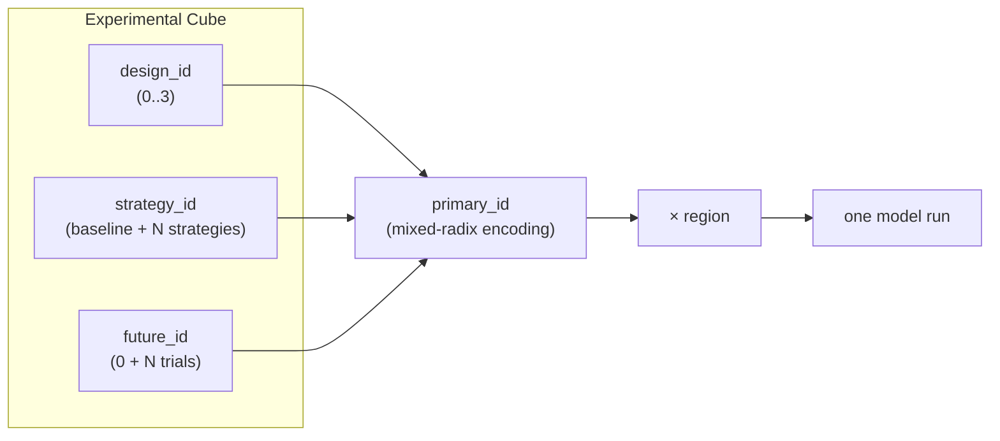
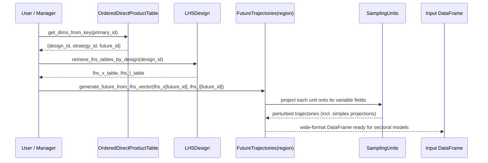

# Module 15 — Experimental Design: LHS, Strategies & Futures

Welcome to **Part V — Decision Making under Deep Uncertainty (DMDU)**. The previous modules taught you what SISEPUEDE *computes* — the variable schema, the sectoral models, and the transformers that compose policy strategies. This module teaches you what SISEPUEDE *runs*: a structured experimental design that combines policy choices with thousands of plausible futures so that decisions can be stress-tested rather than optimized for a single forecast.

## 1. Why DMDU?

Climate, energy and land-use planning over a 30–50 year horizon faces **deep uncertainty** — a regime in which decision-makers cannot agree on, and analysts cannot credibly estimate, the probability distributions of key parameters (technology costs, GDP growth, climate sensitivity, land productivity). Traditional cost-benefit analysis collapses these uncertainties into point estimates and produces a single "optimal" policy. DMDU instead asks: **which decisions perform acceptably across the widest range of plausible futures?**

The methodological lineage SISEPUEDE inherits from RAND — Robust Decision Making (RDM), Scenario Discovery, Many-Objective Robust Decision Making — all share one operational requirement: a **large ensemble** of model runs that cross-multiplies *what we choose* (strategies, levers) with *what we don't control* (exogenous uncertainties). SISEPUEDE's experimental design machinery exists to generate, index, and reproduce that ensemble efficiently.

## 2. The 3-Dimensional Design

Every SISEPUEDE run is uniquely identified by a tuple along three orthogonal axes, evaluated for each region:



- **`design_id`** — selects *which* uncertainties are perturbed (see §4).
- **`strategy_id`** — selects *which* policy bundle of transformers is applied. Defined in `ATTRIBUTE_STRATEGY`. `strategy_id = 0` is the baseline.
- **`future_id`** — selects *which* row of the LHS sample is used to perturb inputs. `future_id = 0` is the deterministic baseline (no perturbation).
- **`region`** — country/region; kept *outside* `primary_id` because the same (design, strategy, future) is meaningful across regions.

The cardinality is multiplicative: 4 designs × 5 strategies × 1,000 futures × 33 regions = **660,000 runs**. Without a compact index, this combinatorics becomes unmanageable.

## 3. `primary_id` and `OrderedDirectProductTable`

File: `sisepuede/data_management/ordered_direct_product_table.py`.

Rather than materializing a 660k-row index DataFrame, SISEPUEDE encodes the (design × strategy × future) product as a **mixed-radix integer**. Each axis becomes a "digit" with its own base equal to the cardinality of that dimension. The encoding is exactly analogous to how a clock encodes (hours, minutes, seconds) into total seconds, except the bases are arbitrary.

Two methods power all lookups in O(n_dims):

- `get_key_value(design_id=..., strategy_id=..., future_id=...) -> primary_id`
- `get_dims_from_key(primary_id) -> dict`

Region is excluded from this product. Output rows are addressed in the database as `(region, primary_id)`. This means the LHS samples are **shared across regions** — `future_id = 47` perturbs the same factors by the same amounts in every country, which is essential for cross-country robustness analysis.

## 4. The Four-Design Convention

The `ATTRIBUTE_DESIGN` table contains exactly four rows by convention:

| `design_id` | `vary_x` | `vary_l` | Meaning |
|---:|:---:|:---:|---|
| 0 | 0 | 0 | **Baseline** — no perturbation; equivalent to running deterministic strategies |
| 1 | 1 | 0 | **X-only** — vary exogenous uncertainties, hold lever effects at design intent |
| 2 | 0 | 1 | **L-only** — vary lever effectiveness, hold exogenous world fixed |
| 3 | 1 | 1 | **Full uncertainty** — both perturbed (typical robustness experiment) |

This factorial split is what makes SISEPUEDE's outputs *diagnosable*. By comparing design 1 vs 3 you isolate how much of the spread in emissions comes from policy uncertainty (L); by comparing 2 vs 3 you isolate exogenous uncertainty (X). Each row also carries linear transform parameters `(m, b, inf, sup)` applied to the raw [0,1] LHS draws (see §6).

## 5. LHS via pyDOE2 — Two Separate Samples

File: `sisepuede/data_management/lhs_design.py`.

The class `LHSDesign` owns the sampling. At initialization it knows `n_factors_x`, `n_factors_l`, and `n_trials`. When `generate_lhs()` is called it invokes `pyDOE2.lhs()` **twice**:

```python
arr_lhs_x = pyd.lhs(n_factors_x, samples=n_trials, ...)  # exogenous
arr_lhs_l = pyd.lhs(n_factors_l, samples=n_trials, ...)  # lever effects
```

Both arrays have shape `(n_trials, n_factors)` with values in `[0, 1]`. The two samples are independent — Latin Hypercube guarantees stratified marginal coverage of each factor's unit interval, but X and L are sampled separately so that a "future" (X draw) and a "lever realization" (L draw) can be combined or held fixed independently per design.

`future_id = 0` is reserved as the deterministic baseline and is *not* drawn from the sample — it corresponds to all factors at their nominal value (no perturbation applied).

Random seeds increment by one for each LHS table generated, ensuring reproducibility while keeping X and L draws decorrelated.

## 6. Linear Scaling per Design

The raw LHS draws live in `[0, 1]`. To turn them into model-meaningful perturbations the design row applies a **clipped linear transform** factor-by-factor:

$$
y = \max\bigl(\min(m \cdot x + b,\ \text{sup}),\ \text{inf}\bigr)
$$

The four parameters come from `ATTRIBUTE_DESIGN` columns `linear_transform_l_m`, `linear_transform_l_b`, `linear_transform_l_inf`, `linear_transform_l_sup` (and analogous fields for X). When a design has `vary_l = 0`, the L draws are collapsed to a constant (typically 1.0) regardless of the underlying LHS row — this is how design 1 ("X-only") suppresses lever-effect variation while still consuming a `future_id`.

`LHSDesign.retrieve_lhs_tables_by_design(design_id)` returns the post-transform L and X tables as `pd.DataFrame`s indexed by `future_id`, ready to be consumed downstream.

## 7. `SamplingUnit` — X vs L Classification

File: `sisepuede/data_management/sampling_unit.py`.

A **`SamplingUnit`** is the atomic perturbation target: one variable trajectory (or one constrained group, like a fuel-mix simplex). Each unit declares:

- `variable_trajectory_group_type` — which classifies the unit as **L** (lever effect) or **X** (exogenous uncertainty).
- `variable_trajectory_group` — an integer that ties together variables that **must move in concert**. The canonical case is a simplex: a vector of fractions (e.g., share of electricity from solar/wind/gas/...) that must sum to 1 at every time step. All members of a simplex share the same group integer and consume a *single* LHS factor; the unit's internal logic projects the scalar draw onto the constrained surface.
- `field_trajgroup_no_vary_q` — a flag that excludes the unit from sampling entirely (degenerate or unsupported variables).

The classification matters because it determines whether the unit reads its perturbation magnitude from `arr_lhs_x` or `arr_lhs_l`, and therefore which `vary_*` flag in the design controls it.

## 8. `FutureTrajectories` and Input Materialization

One `FutureTrajectories` object is built **per region**. It owns all the `SamplingUnit`s for that region, tied to their position in `arr_lhs_x` / `arr_lhs_l`. Its core method is:

```python
df_input = future_trajectories.generate_future_from_lhs_vector(
    lhs_x = vec_x,   # one row of the X table
    lhs_l = vec_l,   # one row of the L table
)
```

This produces the wide-format input DataFrame (rows = time periods, columns = variable fields) that the sectoral models consume. The materialization is *lazy*: input DataFrames are generated on demand from the LHS row vectors rather than stored — this is what keeps a 660k-run experiment tractable on disk.

The orchestration entry point is `SISEPUEDE.generate_scenario_database_from_primary_key(primary_id, region)` in `sisepuede/manager/sisepuede.py` (around line 1581):



The same `primary_id` always reproduces the same input DataFrame — given the same baseline templates and the same random seed.

## 9. Putting It Together

A typical robustness experiment for a country team looks like this:

1. Define strategies in `ATTRIBUTE_STRATEGY` — each strategy is a composition of transformers (Module 14).
2. Choose `n_trials` (commonly 1,000 for production, 50–100 for prototyping).
3. Use the standard 4 design rows so X-only and L-only diagnostics are available.
4. Run the experiment manager; SISEPUEDE iterates `(region, primary_id)` and writes results to `MODEL_OUTPUT`.
5. Post-process: scenario discovery on the resulting ensemble identifies the futures in which a given strategy fails (or succeeds) — the foundation of subsequent DMDU modules.

The next module unpacks the `SISEPUEDEExperimentalManager` end-to-end, including parallelization, primary-id chunking, and database write semantics.

<Quiz>
  <Question
    question="In SISEPUEDE's 4-design convention, which design isolates exogenous uncertainty by holding lever effects fixed?"
    options={[
      "design_id = 0 (baseline)",
      "design_id = 1 (X-only)",
      "design_id = 2 (L-only)",
      "design_id = 3 (full uncertainty)"
    ]}
    correctIndex={1}
    explanation="design_id = 1 has vary_x = 1 and vary_l = 0: exogenous uncertainties are perturbed via arr_lhs_x while lever effects are held at their nominal value."
  />
  <Question
    question="Why are arr_lhs_x and arr_lhs_l generated as TWO separate pyDOE2.lhs() calls instead of one combined sample?"
    options={[
      "pyDOE2 cannot generate samples with more than 50 factors at once.",
      "So that exogenous and lever-effect draws can be independently included or suppressed by each design row's vary_x / vary_l flags.",
      "To halve the memory footprint of the LHS matrix.",
      "Because Latin Hypercube Sampling does not support more than one variable type."
    ]}
    correctIndex={1}
    explanation="Independent X and L samples allow design rows to factorially toggle which uncertainty source is active — enabling diagnostic designs like X-only (1) and L-only (2)."
  />
  <Question
    question="How does primary_id encode (design_id, strategy_id, future_id)?"
    options={[
      "As a SHA-256 hash of the three IDs.",
      "As a comma-separated string stored in the output database.",
      "As a mixed-radix integer where each axis uses its own cardinality as the base.",
      "As a UUID assigned randomly at run time."
    ]}
    correctIndex={2}
    explanation="OrderedDirectProductTable encodes the cube as a mixed-radix integer so that lookups in either direction (key → dims, dims → key) are O(n_dims) without materializing the full product table."
  />
  <Question
    question="What does it mean when several SamplingUnits share the same variable_trajectory_group integer?"
    options={[
      "They are duplicates and one is ignored at runtime.",
      "They form a constrained set (e.g., a simplex of fuel-mix fractions) and consume a single LHS factor that is projected onto the constraint surface.",
      "They belong to the same sectoral model.",
      "They share a random seed but are otherwise independent."
    ]}
    correctIndex={1}
    explanation="Shared group integers mark variables that must move in concert under a constraint. The canonical case is a simplex (fractions summing to 1); the group consumes one LHS factor and the unit projects the scalar draw onto the constrained surface."
  />
</Quiz>
