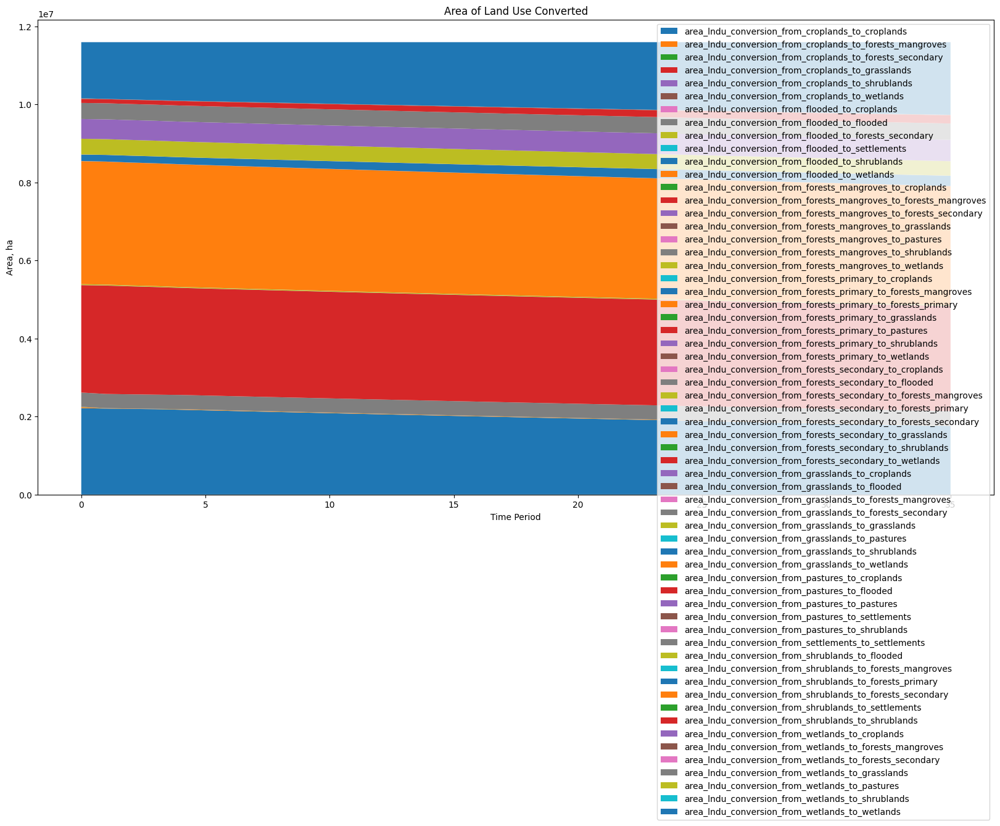
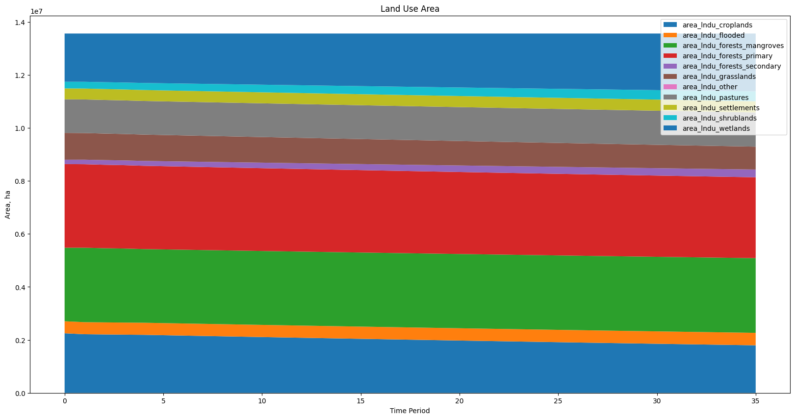
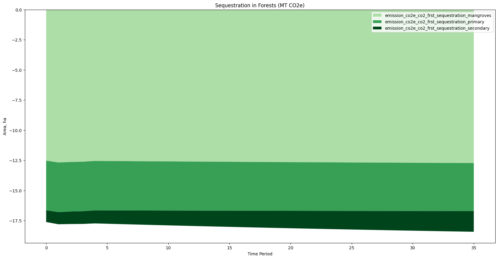
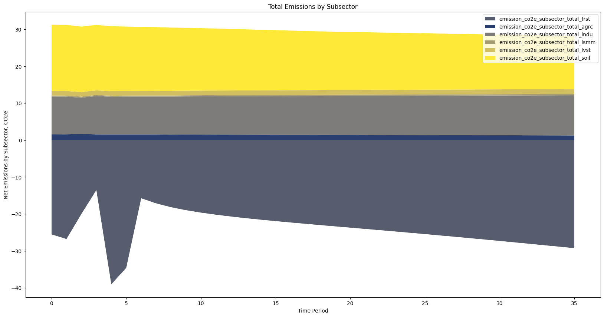
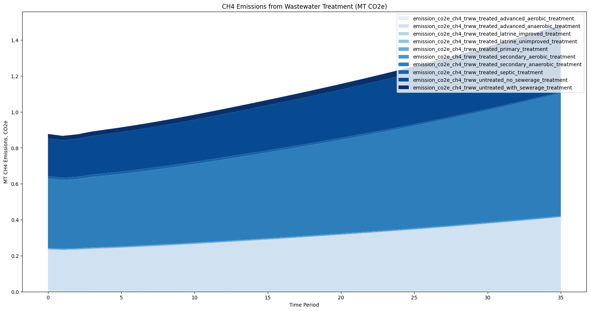
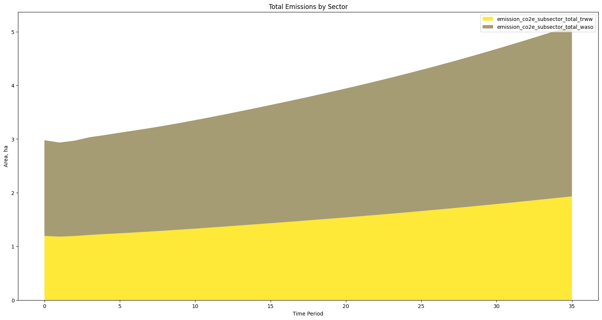
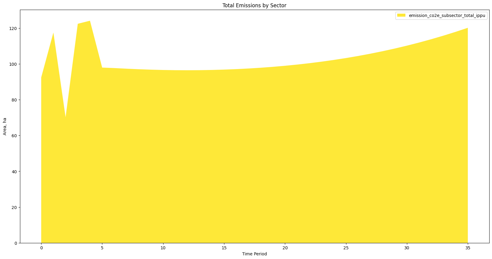
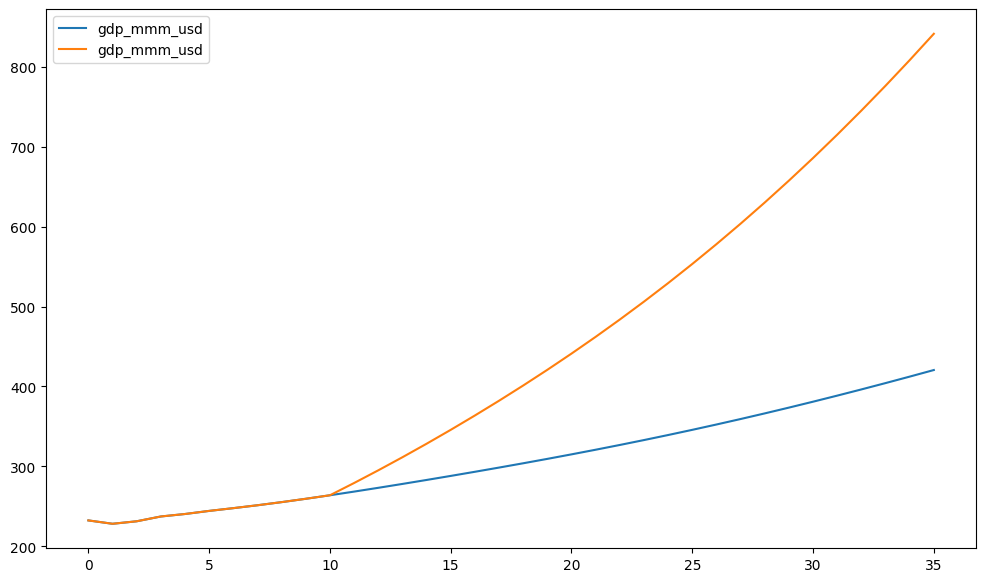
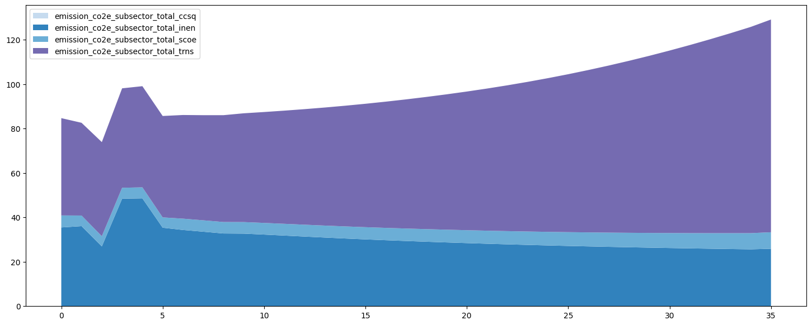
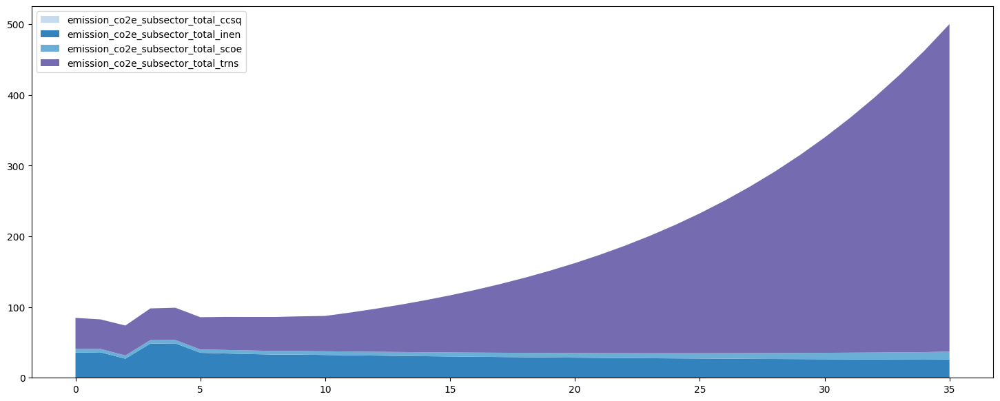

# SISEPUEDE Tutorial #1 - Sector Models

Welcome to the **SImulation of SEctoral Pathways with Uncertainty Exploration for DEcarbonization (SISEPUEDE)** tutorials! This tutorial--_Sector Models_--walks users of the model through how to setup an individual sector model, run each model, and extract and plot output. Then, the tutorial walkks through running the integrated model (the DAG). By the end of the tutorial, users should be able to:

- Instantiate `AFOLU`, `CircularEconomy`, `EnergyConsumption`, `EnergyProduction`, `IPPU`, and `Socioeconomic` models
- **Project** each of the models using an input data frame and look through output
- Run the models in an integrated setup

This is a key tutorial for users that anticipate running the SISEPUEDE integrated emissions model.


##  Key Terminology

### Project

The term *project* is used to refere to running SISEPUEDE forward from its initial state. This choice of nomenclature keeps with its use in "projecting" future states (using simple assumptions about socioeconomics etc.) and its design as a simulation model.


### Sectors

SISEPUEDE is divided into 5 key sectors for accounting. These sectors are largely self contained--where inputs can be defined separately. This was purposely implemented to allow sectoral teams to focus on developing and maintaining relevant input data for their sector, but then allowing straightforward integration of models by teams in a uniform modeling system. The sectors are based on volumes of the IPCC Guidelines for National Greenhouse Gas Inventories. 

In general, each sector corresopnds with a sector model, though energy is divided into `EnergyConsumption` and `EnergyProduction`. This simplifies energy (e.g., SISEPUEDE does not capture how electric vehicles could act as generators in certain situations).


### Subsectors

Each sector is associated with multiple subsectors. Subsectors are designed around two key themes: the IPPC guidelines and modeling functionality. Most subsectors are defined as emissions subectors--e.g., Agriculture, Land Use, Solid Waste, Transportation, IPPU, etc.--but some are modeling subsectors that allow for the integration of new categories. For example `Liquid Waste` is a modeling subsector that allows quantification of liquid waste in different populations, but it does not generate emissions. Emissions are handled in the `Wastewater Treatement` subsector. Some models allow individual subsector models to run independently--this is largely true in `EnergyConsumption`--but some, like `AFOLU` are too integrated to allow for individiaul subsector runs because of high degrees of interdependency.

## More information is available on the [SISEPUEDE ReadTheDocs](https://sisepuede.readthedocs.io/en/latest/)


```python
import warnings
warnings.filterwarnings("ignore")

import sys
path = "/Users/usuario/git/sisepuede"
if path not in sys.path:
    sys.path.append(path)

import importlib
import matplotlib.pyplot as plt
import numpy as np
import os, os.path
import pandas as pd
import pathlib
import sisepuede.plotting.plots as spl
import sisepuede.utilities._plotting as sup
import sys
from sisepuede.manager.sisepuede_examples import SISEPUEDEExamples
from sisepuede.manager.sisepuede_file_structure import SISEPUEDEFileStructure


```

# First, we access the file structure to get the `ModelAttributes` object

- The `sisepuede_file_structure.SISEPUEDEFileStructure` object stores relevant paths and the general file structure of the entire system It's a key piece of the `SISEPUEDE` object; however, we can use it to look at the most important object in the ecosystem, the `ModelAttributes` object.

- Each subsector model relies on the `ModelAttributes` object to manage variables, categories, units (and associated conversions), and cross-sector interactions (see Tutorial 2 for a deeper diver on the `ModelAttributes` object).

- Time periods are stored in the ModelAttributes object and are derived from the `attribute_dim_time_period.csv` attribue file. The default range runs from 0-35 (2015 to 2050), but this can easily be modified for different runs.


See the **`tutorial-2`** notebook for more on these objects.


```python
# initialize a file structure and model attributes
file_struct = SISEPUEDEFileStructure()
model_attributes = file_struct.model_attributes
```


```python


```

# We can instantiate an object that stores all models at once, but let's explore them one by one

- Every model object is callable and has a `project` method.
- Every model takes a DataFrame as input and returns a DataFrame as output.
- Use the `SISEPUEDEExamples` object to grab a tutorial data frame
- Note: the model objects take inputs for:
    - **One** region
    - **One** scenario
    


```python
# start with some example data
examples = SISEPUEDEExamples()
df_input = examples("input_data_frame")
```


```python

```


```python

```

##  Start with AFOLU
- Detailed sector information is available at the [SISEPUEDE Read the Docs (AFOLU)](https://sisepuede.readthedocs.io/en/latest/afolu.html)
- You can explore the arguments and keyword arguments using `?AFOLU` or `help(AFOLU)`


```python
from sisepuede.models.afolu import AFOLU
?AFOLU
```


    Init signature:
    AFOLU(
        attributes: sisepuede.core.model_attributes.ModelAttributes,
        logger: Optional[logging.Logger] = None,
        min_diag_qadj: float = 0.98,
        npp_curve: Union[str, sisepuede.utilities._npp_curves.NPPCurve, NoneType] = None,
        npp_include_primary_forest: bool = False,
        npp_integration_windows: Union[list, tuple, numpy.ndarray] = [20, 480, 1000],
        **kwargs,
    ) -> None
    Docstring:     
    Use AFOLU to calculate emissions from Agriculture, Forestry, and Land Use 
        in SISEPUEDE. Includes emissions from the following subsectors:
    
        * Agriculture (AGRC)
        * Forestry (FRST)
        * Land Use (LNDU)
        * Livestock (LVST)
        * Livestock Manure Management (LSMM)
        * Soil Management (SOIL)
    
    For additional information, see the SISEPUEDE readthedocs at:
    
        https://sisepuede.readthedocs.io/en/latest/afolu.html
    
    
    Intialization Arguments
    -----------------------
    model_attributes : ModelAttributes
        ModelAttributes object used in SISEPUEDE to manage variables and 
        categories
    
    Optional Arguments
    ------------------
    logger : Union[logging.Logger, None]
        optional logger object to use for event logging
    min_diag_qadj : float
        Optional specification of minimum diagonal constraint to adhere to when
        adjusting transition matrices. If None, defaults to config (IN 
        PROCESSS). Note that this threshold will not modify unadjusted diagonal
        transitions that begin below this constraint.
    npp_curve : Union[str, npp.NPPCurve, None] 
        Optional specification of an NPP curve to use for dynamic forest 
        sequestration. In dynamic forest sequestration, forest sequestration 
        factors are used to fit NPP (net primary productivity) curves, which 
        vary over time. In general, young secondary forests sequester much more 
        than older secondary forests, with much of the annual growth 
        concentrated in the first 5-50 years. 
            * None or invalid entry: dynamic NPP is not used
            * "gamma": use the gamma function
            * "sem": use the SEM function 
    
    npp_include_primary_forest : bool
        Include primary forest sequestration factor in integration target for
        Net Primary Productivity (NPP) curve? If False, uses secondary forest 
        (non-young) sequestration factor as long term integration target. Only
        applies if `npp_curve` is specified as a valid curve.
    
    npp_integration_windows : arraylike
        Used for NPP curve fitting--to fit, integration is performed (or 
        estimated) in the windows specified here, and the average value by time
        period is compared to average annual sequestration factors that are 
        read from data. Only applies if `npp_curve` is specified as a valid 
        curve.
    File:           ~/git/sisepuede/sisepuede/models/afolu.py
    Type:           type
    Subclasses:     


```python
# initialize using only the model_attributes argument
model_afolu = AFOLU(model_attributes, )


```

##  You can project the model simply by calling it on the input data frame
- Runs all subsector models at the same time


```python
df_out_afolu = model_afolu(df_input)

```


```python

```


```python

```


```python

```


```python

```

####  You can also see the subsectors associated with the sector using the `model_attributes.get_sector_subsectors`


```python
model_attributes.get_sector_subsectors("AFOLU")
```


    ['Agriculture',
     'Forest',
     'Land Use',
     'Livestock Manure Management',
     'Livestock',
     'Soil Management']


###  You can see all variables associated with a subsector using the `model_attributes.get_subsector_variables` method
- Abstract variables are stored as `ModelVariable` objects
- Each `ModelVariable` is associated with a field schema, categories, and differet characteristics, such as gas and units
- Use `model_attributes.get_subsector_variables()` to list all (input and output) variables associated with a subsector


```python
model_attributes.get_subsector_variables("Land Use")
```


    [':math:\\text{CO}_2 Land Use Conversion Emission Factor',
     'Fraction of Increasing Net Exports Met',
     'Fraction of Increasing Net Imports Met',
     'Fraction of Pastures Improved',
     'Fraction of Soils Mineral',
     'Initial Land Use Area Proportion',
     'Land Use Biomass Sequestration Factor',
     'Land Use BOC :math:\\text{CH}_4 Emission Factor',
     'Land Use Fraction Dry',
     'Land Use Fraction Fertilized',
     'Land Use Fraction Temperate',
     'Land Use Fraction Tropical',
     'Land Use Fraction Wet',
     'Land Use Yield Reallocation Factor',
     'Maximum Area',
     'Maximum Pasture Dry Matter Yield Factor',
     'Maximum Soil Carbon Land Input Factor Without Manure',
     'Maximum Soil Carbon Land Management Factor',
     'Minimum Area',
     'Soil Carbon Land Use Factor',
     'Unadjusted Land Use Transition Probability',
     'Unimproved Soil Carbon Land Management Factor',
     'Utilization Rate',
     'Vegetarian Diet Exchange Scalar',
     ':math:\\text{CH}_4 Emissions from Wetlands',
     ':math:\\text{CO}_2 Emissions from Conversion Away from Land Use Type',
     ':math:\\text{CO}_2 Emissions from Land Use Biomass Sequestration',
     ':math:\\text{CO}_2 Emissions from Land Use Conversion',
     'Area of Improved Land',
     'Area of Land Use Converted',
     'Area of Land Use Converted Away from Type',
     'Area of Land Use Converted to Type',
     'Land Use Area']


```python
model_attributes.get_variable("Land Use Biomass Sequestration Factor")
```


    ModelVariable: Land Use Biomass Sequestration Factor
    Fields:
    	ef_lndu_sequestration_grasslands_kt_co2_ha
    	ef_lndu_sequestration_other_kt_co2_ha
    	ef_lndu_sequestration_pastures_kt_co2_ha
    	ef_lndu_sequestration_settlements_kt_co2_ha
    	ef_lndu_sequestration_shrublands_kt_co2_ha
    	ef_lndu_sequestration_wetlands_kt_co2_ha


###  You can also restrict variables to input or output using the `var_type` keyword argument
- set to "input" to see input variables only or "output" to see output variables only


```python
model_attributes.get_subsector_variables(
    "Land Use",
    var_type = "output",
)

```


    [':math:\\text{CH}_4 Emissions from Wetlands',
     ':math:\\text{CO}_2 Emissions from Conversion Away from Land Use Type',
     ':math:\\text{CO}_2 Emissions from Land Use Biomass Sequestration',
     ':math:\\text{CO}_2 Emissions from Land Use Conversion',
     'Area of Improved Land',
     'Area of Land Use Converted',
     'Area of Land Use Converted Away from Type',
     'Area of Land Use Converted to Type',
     'Land Use Area']


```python
# retrieve ModelVariable for Land Use Area
modvar = model_attributes.get_variable("Area of Land Use Converted")
fields = [
    x for x in modvar.fields if df_out_afolu[x].max() > 0
]
# format the figure
fig, ax = plt.subplots(figsize = (20, 10))

ax.set_xlabel("Time Period")
ax.set_ylabel("Area, ha")
ax.set_title(modvar.name)


sup.plot_stack(
    df_out_afolu,
    fields,
    #model_attributes,
    figtuple = (fig, ax, ),
)

ax.legend(loc = "upper right")


```


    <matplotlib.legend.Legend at 0x126c48e90>


    

    


###  Visualize some output--e.g., start with **`Land Use Area`**

**NOTE**: The name of a variable--such as `Land Use Area` can be retrieved from the attribute tables on [Read the Docs](https://sisepuede.readthedocs.io)


```python
# retrieve ModelVariable for Land Use Area
modvar = model_attributes.get_variable("Land Use Area")

# format the figure
fig, ax = plt.subplots(figsize = (20, 10))

ax.set_xlabel("Time Period")
ax.set_ylabel("Area, ha")
ax.set_title(modvar.name)


spl.plot_variable_stack(
    df_out_afolu,
    modvar,
    model_attributes,
    figtuple = (fig, ax, ),
)

ax.legend(loc = "upper right")


```


    <matplotlib.legend.Legend at 0x12bf8d950>


    

    


###  Look at **`CO2 Emissions from Forest Biomass Sequestration`**


```python
# retrieve ModelVariable for Forest Sequestration
modvar = model_attributes.get_variable(":math:\\text{CO}_2 Emissions from Forest Biomass Sequestration")
fields = modvar.fields

# setup figure
fig, ax = plt.subplots(figsize = (20, 10))
ax.set_xlabel("Time Period")
ax.set_ylabel("Area, ha")
ax.set_title("Sequestration in Forests (MT CO2e)")

# optional info on setting colors
cmap = plt.colormaps["Greens"]#tab10
colors = [cmap(x/len(fields)) for x in range(1, len(fields) + 1)]
dict_format = dict((x, {"color": colors[i] }) for i, x in enumerate(fields)),


spl.plot_variable_stack(
    df_out_afolu,
    modvar,
    model_attributes,
    dict_formatting = dict((x, {"color": colors[i] }) for i, x in enumerate(fields)),
    figtuple = (fig, ax, ),
)

# set the legend
ax.legend(loc = "upper right")


```


    <matplotlib.legend.Legend at 0x11ebaa010>


    

    


```python

```

##  Subsector total emissions for a single subsector can be accessed using `ModelAttributes.get_subsector_emission_total_field()`


```python
# e.g., look at livestock aggregate CO2e emissions
model_attributes.get_subsector_emission_total_field("Livestock")
```


    'emission_co2e_subsector_total_lvst'


##  Get all emission total fields associated with a sector using `model_attributes.get_sector_emission_total_fields()`


```python
fields_subsector_total = model_attributes.get_sector_emission_total_fields("AFOLU")
fields_subsector_total
```


    ['emission_co2e_subsector_total_agrc',
     'emission_co2e_subsector_total_frst',
     'emission_co2e_subsector_total_lndu',
     'emission_co2e_subsector_total_lsmm',
     'emission_co2e_subsector_total_lvst',
     'emission_co2e_subsector_total_soil']


###   Note that historical data is a part of runs, so non-smooth shapes can show up as year-to-year changes are often not smooth

- Note below total sequestration from forests


```python
# setup figure
fig, ax = plt.subplots(figsize = (20, 10))
ax.set_xlabel("Time Period")
ax.set_ylabel("Net Emissions by Subsector, CO2e")
ax.set_title("Total Emissions by Subsector")


# can format 
cmap = plt.colormaps["cividis"]
colors = [cmap(x/len(fields_subsector_total)) for x in range(1, len(fields_subsector_total) + 1)]
dict_format = dict((x, {"color": colors[i] }) for i, x in enumerate(fields_subsector_total)),


sup.plot_stack(
    df_out_afolu,
    fields_subsector_total,
    dict_formatting = dict((x, {"color": colors[i] }) for i, x in enumerate(fields_subsector_total)),
    figtuple = (fig, ax),
)
ax.legend(loc = "upper right")
```


    <matplotlib.legend.Legend at 0x126bd3890>


    

    


# Take a look at `CircularEconomy`

- Detailed sector information is available at the [SISEPUEDE Read the Docs (CircularEconomy)](https://sisepuede.readthedocs.io/en/latest/https://sisepuede.readthedocs.io/en/latest/circular_economy.html)
- **`CircularEconomy`** is dependent on **`AFOLU`** in the SISEPUEDE DAG, meaning that inputs depend on outputs from AFOLU when running integrated.
- However, we can run it independently without issue (for demonstration purposes)


```python
from sisepuede.models.circular_economy import CircularEconomy

```

### Setup the model object


```python
model_circecon = CircularEconomy(model_attributes, )
```

###  Run the `CircularEconomy` model
- Runs all subsectors at the same time


```python
df_out_circecon = model_circecon(df_input)
```

###  See the subsectors contained in `CircularEconomy`


```python
model_attributes.get_sector_subsectors("Circular Economy")

```


    ['Liquid Waste', 'Solid Waste', 'Wastewater Treatment']


###  Once again, see which variables are available for access


```python
model_attributes.get_subsector_variables(
    "Wastewater Treatment", 
    var_type = "output"
)
```


    [':math:\\text{CH}_4 Emissions from Wastewater Treatment',
     ':math:\\text{N}_2\\text{O} Emissions from Wastewater Effluent',
     ':math:\\text{N}_2\\text{O} Emissions from Wastewater Treatment',
     'Biogas Recovered from Wastewater Treatment Plants',
     'Mass of Sludge Produced',
     'Total BOD Organic Waste in Effluent',
     'Total BOD Removed in Treatment',
     'Total COD Organic Waste in Effluent',
     'Total COD Removed in Treatment',
     'Total Nitrogen Removed in Treatment',
     'Total Nitrogen in Effluent',
     'Total Phosphorous Removed in Treatment',
     'Total Phosphorous in Effluent',
     'Volume of Wastewater Treated']


###  Take a look at `:math:\\text{CH}_4 Emissions from Wastewater Treatment`


```python

# get forest biomass sequestration
modvar = model_attributes.get_variable(":math:\\text{CH}_4 Emissions from Wastewater Treatment")
fields = modvar.fields

# setup figure
fig, ax = plt.subplots(figsize = (20, 10))
ax.set_xlabel("Time Period")
ax.set_ylabel("MT CH4 Emissions, CO2e")
ax.set_title("CH4 Emissions from Wastewater Treatment (MT CO2e)")

# optional info on setting colors
cmap = plt.colormaps["Blues"]#tab10
colors = [cmap(x/len(fields)) for x in range(1, len(fields) + 1)]
dict_format = dict((x, {"color": colors[i] }) for i, x in enumerate(fields)),


spl.plot_variable_stack(
    df_out_circecon,
    modvar,
    model_attributes,
    dict_formatting = dict((x, {"color": colors[i] }) for i, x in enumerate(fields)),
    figtuple = (fig, ax, ),
)

# set the legend
ax.legend(loc = "upper right")


```


    <matplotlib.legend.Legend at 0x127f3b210>


    

    


```python

```

###  Take a look at aggregate emissions

Note: these emissions will be slightly different when integrated with AFOLU; for example, sludge from circular economy can be passed to AFOLU and waste from AFOLU is passed to Circular Economy.


```python
fields_subsector_total = model_attributes.get_sector_emission_total_fields("Circular Economy")

# setup figure
fig, ax = plt.subplots(figsize = (20, 10))
ax.set_xlabel("Time Period")
ax.set_ylabel("Area, ha")
ax.set_title("Total Emissions by Sector")


# can format 
cmap = plt.colormaps["cividis"]
colors = [cmap(x/len(fields_subsector_total)) for x in range(1, len(fields_subsector_total) + 1)]
dict_format = dict((x, {"color": colors[i] }) for i, x in enumerate(fields_subsector_total)),


sup.plot_stack(
    df_out_circecon,
    fields_subsector_total,
    dict_formatting = dict((x, {"color": colors[i] }) for i, x in enumerate(fields_subsector_total)),
    figtuple = (fig, ax),
)
ax.legend(loc = "upper right")
```


    <matplotlib.legend.Legend at 0x127ed99d0>


    

    


# Try exploring the `IPPU` model

- Instantiate the IPPU model as `model_ippu` using `IPPU` class
- You can check required arguments using `?IPPU` or `help(IPPU)`--like `AFOLU` and `CircularEconomy`, it requires the `ModelAttributes` object to initialize


```python
from sisepuede.models.ippu import IPPU
```


```python
# instantiate model_ippu here
model_ippu = IPPU(model_attributes, )
```


```python
# try running the model here
df_out_ippu = model_ippu(df_input)
```


```python
fields_subsector_total = model_attributes.get_sector_emission_total_fields("IPPU")

# setup figure
fig, ax = plt.subplots(figsize = (20, 10))
ax.set_xlabel("Time Period")
ax.set_ylabel("Area, ha")
ax.set_title("Total Emissions by Sector")


# can format 
cmap = plt.colormaps["cividis"]
colors = [cmap(x/len(fields_subsector_total)) for x in range(1, len(fields_subsector_total) + 1)]
dict_format = dict((x, {"color": colors[i] }) for i, x in enumerate(fields_subsector_total)),


sup.plot_stack(
    df_out_ippu,
    fields_subsector_total,
    dict_formatting = dict((x, {"color": colors[i] }) for i, x in enumerate(fields_subsector_total)),
    figtuple = (fig, ax),
)
ax.legend(loc = "upper right")
```


    <matplotlib.legend.Legend at 0x126a69b90>


    

    


```python
file_struct = SISEPUEDEFileStructure()
model_attributes = file_struct.model_attributes

# start with some example dataexamples = SISEPUEDEExamples()
df_input = examples("input_data_frame")

import sisepuede.models.ippu as ippu
model_ippu = ippu.IPPU(model_attributes, )
model_ippu(df_input)


```


<div>
<style scoped>
    .dataframe tbody tr th:only-of-type {
        vertical-align: middle;
    }

    .dataframe tbody tr th {
        vertical-align: top;
    }

    .dataframe thead th {
        text-align: right;
    }
</style>
<table border="1" class="dataframe">
  <thead>
    <tr style="text-align: right;">
      <th></th>
      <th>time_period</th>
      <th>dem_ippu_harvested_wood_tonne_paper</th>
      <th>dem_ippu_harvested_wood_tonne_wood</th>
      <th>emission_co2e_c2f6_ippu_product_use_product_use_ods_other</th>
      <th>emission_co2e_c2f6_ippu_production_chemicals</th>
      <th>emission_co2e_c2f6_ippu_production_electronics</th>
      <th>emission_co2e_c2f6_ippu_production_metals</th>
      <th>emission_co2e_c2h3f3_ippu_product_use_product_use_ods_refrigeration</th>
      <th>emission_co2e_c2h3f3_ippu_production_chemicals</th>
      <th>emission_co2e_c2hf5_ippu_product_use_product_use_ods_other</th>
      <th>...</th>
      <th>prod_ippu_textiles_tonne</th>
      <th>prod_ippu_wood_tonne</th>
      <th>qty_ippu_recycled_glass_used_in_production_tonne</th>
      <th>qty_ippu_recycled_metals_used_in_production_tonne</th>
      <th>qty_ippu_recycled_paper_used_in_production_tonne</th>
      <th>qty_ippu_recycled_plastic_used_in_production_tonne</th>
      <th>qty_ippu_recycled_rubber_and_leather_used_in_production_tonne</th>
      <th>qty_ippu_recycled_textiles_used_in_production_tonne</th>
      <th>qty_ippu_recycled_wood_used_in_production_tonne</th>
      <th>emission_co2e_subsector_total_ippu</th>
    </tr>
  </thead>
  <tbody>
    <tr>
      <th>0</th>
      <td>0</td>
      <td>1.708834e+07</td>
      <td>1.929814e+07</td>
      <td>0.021341</td>
      <td>0.0</td>
      <td>0.000818</td>
      <td>0.0</td>
      <td>0.562002</td>
      <td>0.0</td>
      <td>0.360359</td>
      <td>...</td>
      <td>3843.476940</td>
      <td>1.833323e+07</td>
      <td>0.0</td>
      <td>0.0</td>
      <td>0.0</td>
      <td>0.0</td>
      <td>0.0</td>
      <td>0.0</td>
      <td>0.0</td>
      <td>92.441352</td>
    </tr>
    <tr>
      <th>1</th>
      <td>1</td>
      <td>1.467957e+07</td>
      <td>1.912359e+07</td>
      <td>0.018621</td>
      <td>0.0</td>
      <td>0.000837</td>
      <td>0.0</td>
      <td>0.554690</td>
      <td>0.0</td>
      <td>0.376124</td>
      <td>...</td>
      <td>2878.522579</td>
      <td>1.816741e+07</td>
      <td>0.0</td>
      <td>0.0</td>
      <td>0.0</td>
      <td>0.0</td>
      <td>0.0</td>
      <td>0.0</td>
      <td>0.0</td>
      <td>117.517691</td>
    </tr>
    <tr>
      <th>2</th>
      <td>2</td>
      <td>1.085469e+07</td>
      <td>1.925429e+07</td>
      <td>0.018008</td>
      <td>0.0</td>
      <td>0.000188</td>
      <td>0.0</td>
      <td>0.547990</td>
      <td>0.0</td>
      <td>0.400431</td>
      <td>...</td>
      <td>929.022413</td>
      <td>1.829158e+07</td>
      <td>0.0</td>
      <td>0.0</td>
      <td>0.0</td>
      <td>0.0</td>
      <td>0.0</td>
      <td>0.0</td>
      <td>0.0</td>
      <td>70.192742</td>
    </tr>
    <tr>
      <th>3</th>
      <td>3</td>
      <td>2.531218e+07</td>
      <td>1.950390e+07</td>
      <td>0.017384</td>
      <td>0.0</td>
      <td>0.000357</td>
      <td>0.0</td>
      <td>0.546293</td>
      <td>0.0</td>
      <td>0.433311</td>
      <td>...</td>
      <td>1751.404751</td>
      <td>1.852871e+07</td>
      <td>0.0</td>
      <td>0.0</td>
      <td>0.0</td>
      <td>0.0</td>
      <td>0.0</td>
      <td>0.0</td>
      <td>0.0</td>
      <td>122.413085</td>
    </tr>
    <tr>
      <th>4</th>
      <td>4</td>
      <td>2.633328e+07</td>
      <td>1.963138e+07</td>
      <td>0.016715</td>
      <td>0.0</td>
      <td>0.000334</td>
      <td>0.0</td>
      <td>0.544395</td>
      <td>0.0</td>
      <td>0.431805</td>
      <td>...</td>
      <td>1789.487863</td>
      <td>1.864981e+07</td>
      <td>0.0</td>
      <td>0.0</td>
      <td>0.0</td>
      <td>0.0</td>
      <td>0.0</td>
      <td>0.0</td>
      <td>0.0</td>
      <td>124.129075</td>
    </tr>
    <tr>
      <th>5</th>
      <td>5</td>
      <td>1.752970e+07</td>
      <td>1.978943e+07</td>
      <td>0.016713</td>
      <td>0.0</td>
      <td>0.000385</td>
      <td>0.0</td>
      <td>0.544323</td>
      <td>0.0</td>
      <td>0.431749</td>
      <td>...</td>
      <td>2254.420543</td>
      <td>1.879996e+07</td>
      <td>0.0</td>
      <td>0.0</td>
      <td>0.0</td>
      <td>0.0</td>
      <td>0.0</td>
      <td>0.0</td>
      <td>0.0</td>
      <td>97.945119</td>
    </tr>
    <tr>
      <th>6</th>
      <td>6</td>
      <td>1.747492e+07</td>
      <td>1.992910e+07</td>
      <td>0.018752</td>
      <td>0.0</td>
      <td>0.000450</td>
      <td>0.0</td>
      <td>0.565851</td>
      <td>0.0</td>
      <td>0.428937</td>
      <td>...</td>
      <td>2286.760723</td>
      <td>1.893264e+07</td>
      <td>0.0</td>
      <td>0.0</td>
      <td>0.0</td>
      <td>0.0</td>
      <td>0.0</td>
      <td>0.0</td>
      <td>0.0</td>
      <td>97.667117</td>
    </tr>
    <tr>
      <th>7</th>
      <td>7</td>
      <td>1.742880e+07</td>
      <td>2.007467e+07</td>
      <td>0.019027</td>
      <td>0.0</td>
      <td>0.000447</td>
      <td>0.0</td>
      <td>0.574161</td>
      <td>0.0</td>
      <td>0.435236</td>
      <td>...</td>
      <td>2320.693867</td>
      <td>1.907093e+07</td>
      <td>0.0</td>
      <td>0.0</td>
      <td>0.0</td>
      <td>0.0</td>
      <td>0.0</td>
      <td>0.0</td>
      <td>0.0</td>
      <td>97.320781</td>
    </tr>
    <tr>
      <th>8</th>
      <td>8</td>
      <td>1.739089e+07</td>
      <td>2.023069e+07</td>
      <td>0.019325</td>
      <td>0.0</td>
      <td>0.000444</td>
      <td>0.0</td>
      <td>0.583135</td>
      <td>0.0</td>
      <td>0.442040</td>
      <td>...</td>
      <td>2357.315377</td>
      <td>1.921915e+07</td>
      <td>0.0</td>
      <td>0.0</td>
      <td>0.0</td>
      <td>0.0</td>
      <td>0.0</td>
      <td>0.0</td>
      <td>0.0</td>
      <td>97.021300</td>
    </tr>
    <tr>
      <th>9</th>
      <td>9</td>
      <td>1.736260e+07</td>
      <td>2.039649e+07</td>
      <td>0.019644</td>
      <td>0.0</td>
      <td>0.000441</td>
      <td>0.0</td>
      <td>0.592750</td>
      <td>0.0</td>
      <td>0.449328</td>
      <td>...</td>
      <td>2396.520767</td>
      <td>1.937666e+07</td>
      <td>0.0</td>
      <td>0.0</td>
      <td>0.0</td>
      <td>0.0</td>
      <td>0.0</td>
      <td>0.0</td>
      <td>0.0</td>
      <td>96.777557</td>
    </tr>
    <tr>
      <th>10</th>
      <td>10</td>
      <td>1.734535e+07</td>
      <td>2.056960e+07</td>
      <td>0.019979</td>
      <td>0.0</td>
      <td>0.000439</td>
      <td>0.0</td>
      <td>0.602874</td>
      <td>0.0</td>
      <td>0.457002</td>
      <td>...</td>
      <td>2437.774795</td>
      <td>1.954112e+07</td>
      <td>0.0</td>
      <td>0.0</td>
      <td>0.0</td>
      <td>0.0</td>
      <td>0.0</td>
      <td>0.0</td>
      <td>0.0</td>
      <td>96.599050</td>
    </tr>
    <tr>
      <th>11</th>
      <td>11</td>
      <td>1.733998e+07</td>
      <td>2.074816e+07</td>
      <td>0.020328</td>
      <td>0.0</td>
      <td>0.000437</td>
      <td>0.0</td>
      <td>0.613407</td>
      <td>0.0</td>
      <td>0.464986</td>
      <td>...</td>
      <td>2480.673600</td>
      <td>1.971075e+07</td>
      <td>0.0</td>
      <td>0.0</td>
      <td>0.0</td>
      <td>0.0</td>
      <td>0.0</td>
      <td>0.0</td>
      <td>0.0</td>
      <td>96.491398</td>
    </tr>
    <tr>
      <th>12</th>
      <td>12</td>
      <td>1.734698e+07</td>
      <td>2.093095e+07</td>
      <td>0.020689</td>
      <td>0.0</td>
      <td>0.000436</td>
      <td>0.0</td>
      <td>0.624285</td>
      <td>0.0</td>
      <td>0.473232</td>
      <td>...</td>
      <td>2524.953931</td>
      <td>1.988440e+07</td>
      <td>0.0</td>
      <td>0.0</td>
      <td>0.0</td>
      <td>0.0</td>
      <td>0.0</td>
      <td>0.0</td>
      <td>0.0</td>
      <td>96.457622</td>
    </tr>
    <tr>
      <th>13</th>
      <td>13</td>
      <td>1.736659e+07</td>
      <td>2.111695e+07</td>
      <td>0.021059</td>
      <td>0.0</td>
      <td>0.000435</td>
      <td>0.0</td>
      <td>0.635453</td>
      <td>0.0</td>
      <td>0.481698</td>
      <td>...</td>
      <td>2570.390095</td>
      <td>2.006111e+07</td>
      <td>0.0</td>
      <td>0.0</td>
      <td>0.0</td>
      <td>0.0</td>
      <td>0.0</td>
      <td>0.0</td>
      <td>0.0</td>
      <td>96.499256</td>
    </tr>
    <tr>
      <th>14</th>
      <td>14</td>
      <td>1.739894e+07</td>
      <td>2.130551e+07</td>
      <td>0.021437</td>
      <td>0.0</td>
      <td>0.000434</td>
      <td>0.0</td>
      <td>0.646876</td>
      <td>0.0</td>
      <td>0.490358</td>
      <td>...</td>
      <td>2616.840697</td>
      <td>2.024023e+07</td>
      <td>0.0</td>
      <td>0.0</td>
      <td>0.0</td>
      <td>0.0</td>
      <td>0.0</td>
      <td>0.0</td>
      <td>0.0</td>
      <td>96.616888</td>
    </tr>
    <tr>
      <th>15</th>
      <td>15</td>
      <td>1.744410e+07</td>
      <td>2.149613e+07</td>
      <td>0.021823</td>
      <td>0.0</td>
      <td>0.000433</td>
      <td>0.0</td>
      <td>0.658530</td>
      <td>0.0</td>
      <td>0.499192</td>
      <td>...</td>
      <td>2664.201813</td>
      <td>2.042132e+07</td>
      <td>0.0</td>
      <td>0.0</td>
      <td>0.0</td>
      <td>0.0</td>
      <td>0.0</td>
      <td>0.0</td>
      <td>0.0</td>
      <td>96.810618</td>
    </tr>
    <tr>
      <th>16</th>
      <td>16</td>
      <td>1.750214e+07</td>
      <td>2.168866e+07</td>
      <td>0.022217</td>
      <td>0.0</td>
      <td>0.000433</td>
      <td>0.0</td>
      <td>0.670407</td>
      <td>0.0</td>
      <td>0.508195</td>
      <td>...</td>
      <td>2712.444344</td>
      <td>2.060423e+07</td>
      <td>0.0</td>
      <td>0.0</td>
      <td>0.0</td>
      <td>0.0</td>
      <td>0.0</td>
      <td>0.0</td>
      <td>0.0</td>
      <td>97.080571</td>
    </tr>
    <tr>
      <th>17</th>
      <td>17</td>
      <td>1.757330e+07</td>
      <td>2.188334e+07</td>
      <td>0.022619</td>
      <td>0.0</td>
      <td>0.000434</td>
      <td>0.0</td>
      <td>0.682527</td>
      <td>0.0</td>
      <td>0.517382</td>
      <td>...</td>
      <td>2761.641972</td>
      <td>2.078918e+07</td>
      <td>0.0</td>
      <td>0.0</td>
      <td>0.0</td>
      <td>0.0</td>
      <td>0.0</td>
      <td>0.0</td>
      <td>0.0</td>
      <td>97.427576</td>
    </tr>
    <tr>
      <th>18</th>
      <td>18</td>
      <td>1.765789e+07</td>
      <td>2.208049e+07</td>
      <td>0.023029</td>
      <td>0.0</td>
      <td>0.000435</td>
      <td>0.0</td>
      <td>0.694911</td>
      <td>0.0</td>
      <td>0.526770</td>
      <td>...</td>
      <td>2811.886964</td>
      <td>2.097646e+07</td>
      <td>0.0</td>
      <td>0.0</td>
      <td>0.0</td>
      <td>0.0</td>
      <td>0.0</td>
      <td>0.0</td>
      <td>0.0</td>
      <td>97.853040</td>
    </tr>
    <tr>
      <th>19</th>
      <td>19</td>
      <td>1.775640e+07</td>
      <td>2.228054e+07</td>
      <td>0.023449</td>
      <td>0.0</td>
      <td>0.000436</td>
      <td>0.0</td>
      <td>0.707593</td>
      <td>0.0</td>
      <td>0.536384</td>
      <td>...</td>
      <td>2863.308822</td>
      <td>2.116651e+07</td>
      <td>0.0</td>
      <td>0.0</td>
      <td>0.0</td>
      <td>0.0</td>
      <td>0.0</td>
      <td>0.0</td>
      <td>0.0</td>
      <td>98.359219</td>
    </tr>
    <tr>
      <th>20</th>
      <td>20</td>
      <td>1.786933e+07</td>
      <td>2.248377e+07</td>
      <td>0.023880</td>
      <td>0.0</td>
      <td>0.000437</td>
      <td>0.0</td>
      <td>0.720596</td>
      <td>0.0</td>
      <td>0.546240</td>
      <td>...</td>
      <td>2915.999545</td>
      <td>2.135958e+07</td>
      <td>0.0</td>
      <td>0.0</td>
      <td>0.0</td>
      <td>0.0</td>
      <td>0.0</td>
      <td>0.0</td>
      <td>0.0</td>
      <td>98.948559</td>
    </tr>
    <tr>
      <th>21</th>
      <td>21</td>
      <td>1.799728e+07</td>
      <td>2.269054e+07</td>
      <td>0.024323</td>
      <td>0.0</td>
      <td>0.000439</td>
      <td>0.0</td>
      <td>0.733948</td>
      <td>0.0</td>
      <td>0.556361</td>
      <td>...</td>
      <td>2970.069661</td>
      <td>2.155601e+07</td>
      <td>0.0</td>
      <td>0.0</td>
      <td>0.0</td>
      <td>0.0</td>
      <td>0.0</td>
      <td>0.0</td>
      <td>0.0</td>
      <td>99.624179</td>
    </tr>
    <tr>
      <th>22</th>
      <td>22</td>
      <td>1.814096e+07</td>
      <td>2.290117e+07</td>
      <td>0.024778</td>
      <td>0.0</td>
      <td>0.000442</td>
      <td>0.0</td>
      <td>0.747676</td>
      <td>0.0</td>
      <td>0.566768</td>
      <td>...</td>
      <td>3025.629539</td>
      <td>2.175611e+07</td>
      <td>0.0</td>
      <td>0.0</td>
      <td>0.0</td>
      <td>0.0</td>
      <td>0.0</td>
      <td>0.0</td>
      <td>0.0</td>
      <td>100.389708</td>
    </tr>
    <tr>
      <th>23</th>
      <td>23</td>
      <td>1.830108e+07</td>
      <td>2.311587e+07</td>
      <td>0.025246</td>
      <td>0.0</td>
      <td>0.000445</td>
      <td>0.0</td>
      <td>0.761802</td>
      <td>0.0</td>
      <td>0.577476</td>
      <td>...</td>
      <td>3082.761406</td>
      <td>2.196008e+07</td>
      <td>0.0</td>
      <td>0.0</td>
      <td>0.0</td>
      <td>0.0</td>
      <td>0.0</td>
      <td>0.0</td>
      <td>0.0</td>
      <td>101.248853</td>
    </tr>
    <tr>
      <th>24</th>
      <td>24</td>
      <td>1.847833e+07</td>
      <td>2.333474e+07</td>
      <td>0.025728</td>
      <td>0.0</td>
      <td>0.000448</td>
      <td>0.0</td>
      <td>0.776339</td>
      <td>0.0</td>
      <td>0.588495</td>
      <td>...</td>
      <td>3141.519384</td>
      <td>2.216800e+07</td>
      <td>0.0</td>
      <td>0.0</td>
      <td>0.0</td>
      <td>0.0</td>
      <td>0.0</td>
      <td>0.0</td>
      <td>0.0</td>
      <td>102.205268</td>
    </tr>
    <tr>
      <th>25</th>
      <td>25</td>
      <td>1.867340e+07</td>
      <td>2.355780e+07</td>
      <td>0.026223</td>
      <td>0.0</td>
      <td>0.000452</td>
      <td>0.0</td>
      <td>0.791297</td>
      <td>0.0</td>
      <td>0.599834</td>
      <td>...</td>
      <td>3201.938843</td>
      <td>2.237991e+07</td>
      <td>0.0</td>
      <td>0.0</td>
      <td>0.0</td>
      <td>0.0</td>
      <td>0.0</td>
      <td>0.0</td>
      <td>0.0</td>
      <td>103.262591</td>
    </tr>
    <tr>
      <th>26</th>
      <td>26</td>
      <td>1.888694e+07</td>
      <td>2.378500e+07</td>
      <td>0.026733</td>
      <td>0.0</td>
      <td>0.000456</td>
      <td>0.0</td>
      <td>0.806680</td>
      <td>0.0</td>
      <td>0.611495</td>
      <td>...</td>
      <td>3264.036424</td>
      <td>2.259575e+07</td>
      <td>0.0</td>
      <td>0.0</td>
      <td>0.0</td>
      <td>0.0</td>
      <td>0.0</td>
      <td>0.0</td>
      <td>0.0</td>
      <td>104.424375</td>
    </tr>
    <tr>
      <th>27</th>
      <td>27</td>
      <td>1.911975e+07</td>
      <td>2.401637e+07</td>
      <td>0.027257</td>
      <td>0.0</td>
      <td>0.000461</td>
      <td>0.0</td>
      <td>0.822498</td>
      <td>0.0</td>
      <td>0.623486</td>
      <td>...</td>
      <td>3327.847298</td>
      <td>2.281555e+07</td>
      <td>0.0</td>
      <td>0.0</td>
      <td>0.0</td>
      <td>0.0</td>
      <td>0.0</td>
      <td>0.0</td>
      <td>0.0</td>
      <td>105.694763</td>
    </tr>
    <tr>
      <th>28</th>
      <td>28</td>
      <td>1.937249e+07</td>
      <td>2.425177e+07</td>
      <td>0.027796</td>
      <td>0.0</td>
      <td>0.000467</td>
      <td>0.0</td>
      <td>0.838751</td>
      <td>0.0</td>
      <td>0.635806</td>
      <td>...</td>
      <td>3393.369311</td>
      <td>2.303918e+07</td>
      <td>0.0</td>
      <td>0.0</td>
      <td>0.0</td>
      <td>0.0</td>
      <td>0.0</td>
      <td>0.0</td>
      <td>0.0</td>
      <td>107.077415</td>
    </tr>
    <tr>
      <th>29</th>
      <td>29</td>
      <td>1.964580e+07</td>
      <td>2.449104e+07</td>
      <td>0.028349</td>
      <td>0.0</td>
      <td>0.000473</td>
      <td>0.0</td>
      <td>0.855435</td>
      <td>0.0</td>
      <td>0.648453</td>
      <td>...</td>
      <td>3460.581646</td>
      <td>2.326649e+07</td>
      <td>0.0</td>
      <td>0.0</td>
      <td>0.0</td>
      <td>0.0</td>
      <td>0.0</td>
      <td>0.0</td>
      <td>0.0</td>
      <td>108.575775</td>
    </tr>
    <tr>
      <th>30</th>
      <td>30</td>
      <td>1.994025e+07</td>
      <td>2.473389e+07</td>
      <td>0.028916</td>
      <td>0.0</td>
      <td>0.000479</td>
      <td>0.0</td>
      <td>0.872537</td>
      <td>0.0</td>
      <td>0.661417</td>
      <td>...</td>
      <td>3529.435564</td>
      <td>2.349720e+07</td>
      <td>0.0</td>
      <td>0.0</td>
      <td>0.0</td>
      <td>0.0</td>
      <td>0.0</td>
      <td>0.0</td>
      <td>0.0</td>
      <td>110.192793</td>
    </tr>
    <tr>
      <th>31</th>
      <td>31</td>
      <td>2.025633e+07</td>
      <td>2.498003e+07</td>
      <td>0.029496</td>
      <td>0.0</td>
      <td>0.000486</td>
      <td>0.0</td>
      <td>0.890044</td>
      <td>0.0</td>
      <td>0.674688</td>
      <td>...</td>
      <td>3599.873035</td>
      <td>2.373103e+07</td>
      <td>0.0</td>
      <td>0.0</td>
      <td>0.0</td>
      <td>0.0</td>
      <td>0.0</td>
      <td>0.0</td>
      <td>0.0</td>
      <td>111.931272</td>
    </tr>
    <tr>
      <th>32</th>
      <td>32</td>
      <td>2.059489e+07</td>
      <td>2.522940e+07</td>
      <td>0.030089</td>
      <td>0.0</td>
      <td>0.000494</td>
      <td>0.0</td>
      <td>0.907959</td>
      <td>0.0</td>
      <td>0.688269</td>
      <td>...</td>
      <td>3671.901044</td>
      <td>2.396793e+07</td>
      <td>0.0</td>
      <td>0.0</td>
      <td>0.0</td>
      <td>0.0</td>
      <td>0.0</td>
      <td>0.0</td>
      <td>0.0</td>
      <td>113.795773</td>
    </tr>
    <tr>
      <th>33</th>
      <td>33</td>
      <td>2.095649e+07</td>
      <td>2.548170e+07</td>
      <td>0.030696</td>
      <td>0.0</td>
      <td>0.000502</td>
      <td>0.0</td>
      <td>0.926267</td>
      <td>0.0</td>
      <td>0.702147</td>
      <td>...</td>
      <td>3745.461543</td>
      <td>2.420762e+07</td>
      <td>0.0</td>
      <td>0.0</td>
      <td>0.0</td>
      <td>0.0</td>
      <td>0.0</td>
      <td>0.0</td>
      <td>0.0</td>
      <td>115.789417</td>
    </tr>
    <tr>
      <th>34</th>
      <td>34</td>
      <td>2.134187e+07</td>
      <td>2.573676e+07</td>
      <td>0.031316</td>
      <td>0.0</td>
      <td>0.000511</td>
      <td>0.0</td>
      <td>0.944962</td>
      <td>0.0</td>
      <td>0.716318</td>
      <td>...</td>
      <td>3820.524336</td>
      <td>2.444993e+07</td>
      <td>0.0</td>
      <td>0.0</td>
      <td>0.0</td>
      <td>0.0</td>
      <td>0.0</td>
      <td>0.0</td>
      <td>0.0</td>
      <td>117.916217</td>
    </tr>
    <tr>
      <th>35</th>
      <td>35</td>
      <td>2.175152e+07</td>
      <td>2.599425e+07</td>
      <td>0.031947</td>
      <td>0.0</td>
      <td>0.000521</td>
      <td>0.0</td>
      <td>0.964025</td>
      <td>0.0</td>
      <td>0.730769</td>
      <td>...</td>
      <td>3897.012865</td>
      <td>2.469454e+07</td>
      <td>0.0</td>
      <td>0.0</td>
      <td>0.0</td>
      <td>0.0</td>
      <td>0.0</td>
      <td>0.0</td>
      <td>0.0</td>
      <td>120.179043</td>
    </tr>
  </tbody>
</table>
<p>36 rows × 128 columns</p>
</div>


```python
# list the subsectors in IPPU
```


```python
# list output variables here associated with one of the subsectors (your choice)
```


```python
# plot an output variable
```

# Try exploring the `EnergyConsumption` model

- Instantiate the energy consumption model as `model_enercons` using `EnergyConsumption`
- You can check required arguments using `?EnergyConsumption` or `help(EnergyConsumption)`--like `AFOLU` and `CircularEconomy`, it requires the `ModelAttributes` object to initialize


```python
from sisepuede.models.energy_consumption import EnergyConsumption

```


```python
# instantiate model_enercons here
model_enercons = EnergyConsumption(model_attributes, )
```


```python
df_input_ec = pd.merge(
    df_input,
    df_out_afolu,
)
df_input_ec = pd.merge(
    df_input_ec,
    df_out_ippu,
)


df_input_ec3 = pd.merge(
    df_input2,
    df_out_afolu,
)
df_input_ec3 = pd.merge(
    df_input_ec3,
    df_out_ippu,
)


# try running the model here
df_out_enercons = model_enercons(df_input_ec)
df_out_enercons2 = model_enercons(df_input_ec3)
```


```python
import sisepuede.utilities._toolbox as sf

```


    array([0.  , 0.  , 0.  , 0.  , 0.  , 0.  , 0.  , 0.  , 0.  , 0.  , 0.  ,
           0.04, 0.08, 0.12, 0.16, 0.2 , 0.24, 0.28, 0.32, 0.36, 0.4 , 0.44,
           0.48, 0.52, 0.56, 0.6 , 0.64, 0.68, 0.72, 0.76, 0.8 , 0.84, 0.88,
           0.92, 0.96, 1.  ])


```python

mv_gdp = model_attributes.get_variable("GDP")

df_input2 = df_input.copy()
vec_gdp = df_input2["gdp_mmm_usd"].to_numpy()
vec_gdp2 = 2*vec_gdp
vec_ramp = sf.ramp_vector(r_0 = 10, n = df_input.shape[0])

vec_gdp_new = (1 - vec_ramp)*vec_gdp + vec_ramp*vec_gdp2
df_input2["gdp_mmm_usd"] = vec_gdp_new

fig, ax = plt.subplots(figsize = (12, 7))
mv_gdp.get_from_dataframe(df_input).plot(ax = ax)
mv_gdp.get_from_dataframe(df_input2).plot(ax = ax)


```


    <Axes: >


    

    


```python
import sisepuede.plotting.plots as spp


#[x for x in df_out_enercons.columns if "emission_co2e" in x]
model_attributes.get_subsector_variables("Transportation", var_type = "output", )
modvar = model_attributes.get_variable("Vehicle Distance Traveled from Gasoline")
modvar.get_from_dataframe(df_out_enercons)


```


```python
fig, ax = plt.subplots(figsize = (18, 7))
spp.plot_emissions_stack(
    df_out_enercons,
    model_attributes,
    figtuple = (fig, ax, )
)
ax.legend()
```


    <matplotlib.legend.Legend at 0x137bd99d0>


    

    


```python
fig, ax = plt.subplots(figsize = (18, 7))
spp.plot_emissions_stack(
    df_out_enercons2,
    model_attributes,
    figtuple = (fig, ax, )
)
ax.legend()
```


    <matplotlib.legend.Legend at 0x13790ab90>


    

    


```python

```


```python

```


```python
# list the subsectors in EnergyConsumption
```


```python
# list output variables here associated with one of the subsectors (your choice)
```


```python
# plot an output variable
```

# A note on `EnergyProduction`

- The energy production model can be run independently, but it requires adding a number of inputs manually that are not currently available in the examnple dataset
- In general, it should be run as part of the integrated model to ensure assumptions about energy demands are passed appropriately
- A separate `EnergyProduction` model tutorial is under development


```python

```

# Now that we've looked at each sector independently, let's look at initializing the DAG

- Use the `SISEPUEDEModels` class to store all models at once
- Callable
- Can project the models in order using this method
- Can initialize the `EnergyProduction` model (Julia) or not
- Note that, to use this, we also need the `SISEPUEDEFileStructure` object to point to directories storing NEMO input files
- In the next tutorial, we'll look at the self-contained `SISEPUEDE` object, which stores the model, database system, and sampling system


```python
from sisepuede.manager.sisepuede_models import SISEPUEDEModels
```

##  First, we can initialize a model DAG **without** fuel production
- Can run all subsectors except for **ENTC**, **ENST**, and **FGTV**
- Often useful when validating, calibrating, or exploring other sectors/subsectors 


```python
models_noenerprod = SISEPUEDEModels(
    model_attributes,
    allow_electricity_run = False, 
)
```

###  Run the models without Energy Production

This will produce a lot of fields.


```python
df_out_noenerprod = models_noenerprod(df_input, )

```


```python
df_out_noenerprod.head()
```


<div>
<style scoped>
    .dataframe tbody tr th:only-of-type {
        vertical-align: middle;
    }

    .dataframe tbody tr th {
        vertical-align: top;
    }

    .dataframe thead th {
        text-align: right;
    }
</style>
<table border="1" class="dataframe">
  <thead>
    <tr style="text-align: right;">
      <th></th>
      <th>time_period</th>
      <th>area_agrc_crops_bevs_and_spices</th>
      <th>area_agrc_crops_cereals</th>
      <th>area_agrc_crops_fibers</th>
      <th>area_agrc_crops_fruits</th>
      <th>area_agrc_crops_herbs_and_other_perennial_crops</th>
      <th>area_agrc_crops_nuts</th>
      <th>area_agrc_crops_other_annual</th>
      <th>area_agrc_crops_other_woody_perennial</th>
      <th>area_agrc_crops_pulses</th>
      <th>...</th>
      <th>yield_agrc_fruits_tonne</th>
      <th>yield_agrc_herbs_and_other_perennial_crops_tonne</th>
      <th>yield_agrc_nuts_tonne</th>
      <th>yield_agrc_other_annual_tonne</th>
      <th>yield_agrc_other_woody_perennial_tonne</th>
      <th>yield_agrc_pulses_tonne</th>
      <th>yield_agrc_rice_tonne</th>
      <th>yield_agrc_sugar_cane_tonne</th>
      <th>yield_agrc_tubers_tonne</th>
      <th>yield_agrc_vegetables_and_vines_tonne</th>
    </tr>
  </thead>
  <tbody>
    <tr>
      <th>0</th>
      <td>0</td>
      <td>0.0</td>
      <td>367983.831774</td>
      <td>68239.857458</td>
      <td>80.234375</td>
      <td>79198.541655</td>
      <td>6714.566582</td>
      <td>1.154590e+06</td>
      <td>0.0</td>
      <td>357.684133</td>
      <td>...</td>
      <td>1607.703461</td>
      <td>955073.693482</td>
      <td>19786.484805</td>
      <td>7.132381e+06</td>
      <td>0.0</td>
      <td>985.642069</td>
      <td>2.422231e+06</td>
      <td>2.104457e+07</td>
      <td>166526.651285</td>
      <td>147.841681</td>
    </tr>
    <tr>
      <th>1</th>
      <td>1</td>
      <td>0.0</td>
      <td>362096.267342</td>
      <td>67148.052539</td>
      <td>78.950664</td>
      <td>77931.403057</td>
      <td>6607.136744</td>
      <td>1.136117e+06</td>
      <td>0.0</td>
      <td>351.961359</td>
      <td>...</td>
      <td>1616.909034</td>
      <td>977244.208052</td>
      <td>22830.850901</td>
      <td>8.141189e+06</td>
      <td>0.0</td>
      <td>1147.287929</td>
      <td>2.270951e+06</td>
      <td>2.014820e+07</td>
      <td>170203.458526</td>
      <td>150.239733</td>
    </tr>
    <tr>
      <th>2</th>
      <td>2</td>
      <td>0.0</td>
      <td>360603.256374</td>
      <td>66871.184789</td>
      <td>78.625131</td>
      <td>77610.072930</td>
      <td>6579.893913</td>
      <td>1.131433e+06</td>
      <td>0.0</td>
      <td>350.510137</td>
      <td>...</td>
      <td>1572.095458</td>
      <td>943834.205917</td>
      <td>20014.830969</td>
      <td>1.258079e+07</td>
      <td>0.0</td>
      <td>1387.559377</td>
      <td>2.281962e+06</td>
      <td>2.522074e+07</td>
      <td>170020.494166</td>
      <td>144.369498</td>
    </tr>
    <tr>
      <th>3</th>
      <td>3</td>
      <td>0.0</td>
      <td>359180.755369</td>
      <td>66607.392585</td>
      <td>78.314972</td>
      <td>77303.918161</td>
      <td>6553.937670</td>
      <td>1.126969e+06</td>
      <td>0.0</td>
      <td>349.127451</td>
      <td>...</td>
      <td>1483.984815</td>
      <td>950000.734264</td>
      <td>22121.396585</td>
      <td>6.126346e+06</td>
      <td>0.0</td>
      <td>1454.827115</td>
      <td>2.421785e+06</td>
      <td>2.532944e+07</td>
      <td>161700.601978</td>
      <td>147.613979</td>
    </tr>
    <tr>
      <th>4</th>
      <td>4</td>
      <td>0.0</td>
      <td>358002.730124</td>
      <td>66388.936588</td>
      <td>78.058118</td>
      <td>77050.380170</td>
      <td>6532.442353</td>
      <td>1.123273e+06</td>
      <td>0.0</td>
      <td>347.982398</td>
      <td>...</td>
      <td>1579.787589</td>
      <td>950624.475419</td>
      <td>19546.265136</td>
      <td>6.938924e+06</td>
      <td>0.0</td>
      <td>1122.623719</td>
      <td>2.150882e+06</td>
      <td>2.351716e+07</td>
      <td>166345.161971</td>
      <td>163.535551</td>
    </tr>
  </tbody>
</table>
<p>5 rows × 1305 columns</p>
</div>


## Now, let's try it with the full energy model--`EnergyConsumption` and `EnergyProduction`
- The first time you run this, Julia will be installed in the environment--this can take a few minutes
- On each initialization, it will take a few seconds to setup the julia call environment, but this is a one-time connection per each session


```python

```


```python
models_all = SISEPUEDEModels(
    model_attributes,
    allow_electricity_run = True,
    fp_julia = file_struct.dir_jl,
    fp_nemomod_reference_files = file_struct.dir_ref_nemo,
    fp_nemomod_temp_sqlite_db = file_struct.fp_sqlite_tmp_nemomod_intermediate,
)
```

    [juliapkg] Found dependencies: /Users/usuario/git/sisepuede/sisepuede/julia/pyjuliapkg/juliapkg.json
    [juliapkg] Found dependencies: /opt/miniconda3/envs/amber_is_your_energy/lib/python3.11/site-packages/juliapkg/juliapkg.json
    [juliapkg] Found dependencies: /opt/miniconda3/envs/amber_is_your_energy/lib/python3.11/site-packages/juliacall/juliapkg.json
    [juliapkg] Locating Julia ^1.11.5
    [juliapkg] Using Julia 1.11.5 at /Users/usuario/.julia/juliaup/julia-1.11.5+0.aarch64.apple.darwin14/bin/julia
    [juliapkg] Using Julia project at /Users/usuario/git/sisepuede/sisepuede/julia
    [juliapkg] Writing Project.toml:
                 [deps]
                 Cbc = "9961bab8-2fa3-5c5a-9d89-47fab24efd76"
                 Clp = "e2554f3b-3117-50c0-817c-e040a3ddf72d"
                 DataFrames = "a93c6f00-e57d-5684-b7b6-d8193f3e46c0"
                 GLPK = "60bf3e95-4087-53dc-ae20-288a0d20c6a6"
                 HiGHS = "87dc4568-4c63-4d18-b0c0-bb2238e4078b"
                 Ipopt = "b6b21f68-93f8-5de0-b562-5493be1d77c9"
                 JuMP = "4076af6c-e467-56ae-b986-b466b2749572"
                 NemoMod = "a3c327a0-d2f0-11e8-37fd-d12fd35c3c72"
                 SQLite = "0aa819cd-b072-5ff4-a722-6bc24af294d9"
                 PythonCall = "6099a3de-0909-46bc-b1f4-468b9a2dfc0d"
                 OpenSSL_jll = "458c3c95-2e84-50aa-8efc-19380b2a3a95"
                 [compat]
                 Cbc = "^1.2"
                 Clp = "^1.2.2"
                 DataFrames = "^1.7"
                 GLPK = "^1.2.1"
                 HiGHS = "^1.17"
                 Ipopt = "^1.10.6"
                 JuMP = "^1.26"
                 NemoMod = "^2"
                 SQLite = "^1.6.1"
                 PythonCall = "=0.9.25"
                 OpenSSL_jll = "3.0.0 - 3.4"
    [juliapkg] Installing packages:
                 import Pkg
                 Pkg.Registry.update()
                 Pkg.add([
                   Pkg.PackageSpec(name="Cbc", uuid="9961bab8-2fa3-5c5a-9d89-47fab24efd76"),
                   Pkg.PackageSpec(name="Clp", uuid="e2554f3b-3117-50c0-817c-e040a3ddf72d"),
                   Pkg.PackageSpec(name="DataFrames", uuid="a93c6f00-e57d-5684-b7b6-d8193f3e46c0"),
                   Pkg.PackageSpec(name="GLPK", uuid="60bf3e95-4087-53dc-ae20-288a0d20c6a6"),
                   Pkg.PackageSpec(name="HiGHS", uuid="87dc4568-4c63-4d18-b0c0-bb2238e4078b"),
                   Pkg.PackageSpec(name="Ipopt", uuid="b6b21f68-93f8-5de0-b562-5493be1d77c9"),
                   Pkg.PackageSpec(name="JuMP", uuid="4076af6c-e467-56ae-b986-b466b2749572"),
                   Pkg.PackageSpec(name="NemoMod", uuid="a3c327a0-d2f0-11e8-37fd-d12fd35c3c72", url=raw"https://github.com/sei-international/NemoMod.jl.git", rev=raw"61e63e0"),
                   Pkg.PackageSpec(name="SQLite", uuid="0aa819cd-b072-5ff4-a722-6bc24af294d9"),
                   Pkg.PackageSpec(name="PythonCall", uuid="6099a3de-0909-46bc-b1f4-468b9a2dfc0d"),
                   Pkg.PackageSpec(name="OpenSSL_jll", uuid="458c3c95-2e84-50aa-8efc-19380b2a3a95"),
                 ])
                 Pkg.resolve()
                 Pkg.precompile()


        Updating registry at `~/.julia/registries/General.toml`
       Resolving package versions...
        Updating `~/git/sisepuede/sisepuede/julia/Project.toml`
      [9961bab8] + Cbc v1.2.0
      [e2554f3b] + Clp v1.2.2
      [a93c6f00] + DataFrames v1.7.0
      [60bf3e95] + GLPK v1.2.1
      [87dc4568] + HiGHS v1.18.1
      [b6b21f68] + Ipopt v1.10.6
      [4076af6c] + JuMP v1.26.0
      [a3c327a0] + NemoMod v2.0.0 `https://github.com/sei-international/NemoMod.jl.git#61e63e0`
      [6099a3de] + PythonCall v0.9.25
      [0aa819cd] + SQLite v1.6.1
    ⌅ [458c3c95] + OpenSSL_jll v3.0.16+0
        Updating `~/git/sisepuede/sisepuede/julia/Manifest.toml`
      [6e4b80f9] + BenchmarkTools v1.6.0
      [9961bab8] + Cbc v1.2.0
      [e2554f3b] + Clp v1.2.2
      [523fee87] + CodecBzip2 v0.8.5
      [944b1d66] + CodecZlib v0.7.8
      [bbf7d656] + CommonSubexpressions v0.3.1
      [34da2185] + Compat v4.16.0
      [992eb4ea] + CondaPkg v0.2.29
      [88353bc9] + ConfParser v0.1.2
      [a8cc5b0e] + Crayons v4.1.1
      [a10d1c49] + DBInterface v2.6.1
      [9a962f9c] + DataAPI v1.16.0
      [a93c6f00] + DataFrames v1.7.0
      [864edb3b] + DataStructures v0.18.22
      [e2d170a0] + DataValueInterfaces v1.0.0
      [163ba53b] + DiffResults v1.1.0
      [b552c78f] + DiffRules v1.15.1
      [ffbed154] + DocStringExtensions v0.9.5
      [f6369f11] + ForwardDiff v1.0.1
      [60bf3e95] + GLPK v1.2.1
      [87dc4568] + HiGHS v1.18.1
      [842dd82b] + InlineStrings v1.4.4
      [41ab1584] + InvertedIndices v1.3.1
      [b6b21f68] + Ipopt v1.10.6
      [92d709cd] + IrrationalConstants v0.2.4
      [82899510] + IteratorInterfaceExtensions v1.0.0
      [692b3bcd] + JLLWrappers v1.7.0
      [682c06a0] + JSON v0.21.4
      [0f8b85d8] + JSON3 v1.14.3
      [4076af6c] + JuMP v1.26.0
      [b964fa9f] + LaTeXStrings v1.4.0
      [2ab3a3ac] + LogExpFunctions v0.3.29
      [1914dd2f] + MacroTools v0.5.16
      [b8f27783] + MathOptInterface v1.41.0
      [0b3b1443] + MicroMamba v0.1.14
      [e1d29d7a] + Missings v1.2.0
      [d8a4904e] + MutableArithmetics v1.6.4
      [77ba4419] + NaNMath v1.1.3
      [a3c327a0] + NemoMod v2.0.0 `https://github.com/sei-international/NemoMod.jl.git#61e63e0`
      [bac558e1] + OrderedCollections v1.8.1
      [69de0a69] + Parsers v2.8.3
      [fa939f87] + Pidfile v1.3.0
      [2dfb63ee] + PooledArrays v1.4.3
    ⌅ [aea7be01] + PrecompileTools v1.2.1
      [21216c6a] + Preferences v1.4.3
      [08abe8d2] + PrettyTables v2.4.0
      [6099a3de] + PythonCall v0.9.25
      [189a3867] + Reexport v1.2.2
      [ae029012] + Requires v1.3.1
      [0aa819cd] + SQLite v1.6.1
      [6c6a2e73] + Scratch v1.3.0
      [91c51154] + SentinelArrays v1.4.8
      [a2af1166] + SortingAlgorithms v1.2.1
      [276daf66] + SpecialFunctions v2.5.1
      [1e83bf80] + StaticArraysCore v1.4.3
      [10745b16] + Statistics v1.11.1
      [892a3eda] + StringManipulation v0.4.1
      [856f2bd8] + StructTypes v1.11.0
      [3783bdb8] + TableTraits v1.0.1
      [bd369af6] + Tables v1.12.1
      [3bb67fe8] + TranscodingStreams v0.11.3
      [e17b2a0c] + UnsafePointers v1.0.0
      [ea10d353] + WeakRefStrings v1.4.2
      [ae81ac8f] + ASL_jll v0.1.3+0
      [6e34b625] + Bzip2_jll v1.0.9+0
      [38041ee0] + Cbc_jll v200.1000.800+0
      [3830e938] + Cgl_jll v0.6000.600+0
    ⌅ [06985876] + Clp_jll v100.1700.700+1
    ⌅ [be027038] + CoinUtils_jll v200.1100.600+0
      [e8aa6df9] + GLPK_jll v5.0.1+1
      [8fd58aa0] + HiGHS_jll v1.11.0+1
      [e33a78d0] + Hwloc_jll v2.12.1+0
      [9cc047cb] + Ipopt_jll v300.1400.1701+0
      [d00139f3] + METIS_jll v5.1.3+0
      [d7ed1dd3] + MUMPS_seq_jll v500.800.0+0
      [656ef2d0] + OpenBLAS32_jll v0.3.29+0
    ⌅ [458c3c95] + OpenSSL_jll v3.0.16+0
      [efe28fd5] + OpenSpecFun_jll v0.5.6+0
    ⌅ [7da25872] + Osi_jll v0.10800.700+0
      [319450e9] + SPRAL_jll v2025.5.20+0
      [76ed43ae] + SQLite_jll v3.48.0+0
      [f8abcde7] + micromamba_jll v1.5.8+0
      [4d7b5844] + pixi_jll v0.41.3+0
      [0dad84c5] + ArgTools v1.1.2
      [56f22d72] + Artifacts v1.11.0
      [2a0f44e3] + Base64 v1.11.0
      [ade2ca70] + Dates v1.11.0
      [f43a241f] + Downloads v1.6.0
      [7b1f6079] + FileWatching v1.11.0
      [9fa8497b] + Future v1.11.0
      [b77e0a4c] + InteractiveUtils v1.11.0
      [4af54fe1] + LazyArtifacts v1.11.0
      [b27032c2] + LibCURL v0.6.4
      [76f85450] + LibGit2 v1.11.0
      [8f399da3] + Libdl v1.11.0
      [37e2e46d] + LinearAlgebra v1.11.0
      [56ddb016] + Logging v1.11.0
      [d6f4376e] + Markdown v1.11.0
      [a63ad114] + Mmap v1.11.0
      [ca575930] + NetworkOptions v1.2.0
      [44cfe95a] + Pkg v1.11.0
      [de0858da] + Printf v1.11.0
      [9abbd945] + Profile v1.11.0
      [9a3f8284] + Random v1.11.0
      [ea8e919c] + SHA v0.7.0
      [9e88b42a] + Serialization v1.11.0
      [2f01184e] + SparseArrays v1.11.0
      [fa267f1f] + TOML v1.0.3
      [a4e569a6] + Tar v1.10.0
      [8dfed614] + Test v1.11.0
      [cf7118a7] + UUIDs v1.11.0
      [4ec0a83e] + Unicode v1.11.0
      [e66e0078] + CompilerSupportLibraries_jll v1.1.1+0
      [781609d7] + GMP_jll v6.3.0+0
      [deac9b47] + LibCURL_jll v8.6.0+0
      [e37daf67] + LibGit2_jll v1.7.2+0
      [29816b5a] + LibSSH2_jll v1.11.0+1
      [c8ffd9c3] + MbedTLS_jll v2.28.6+0
      [14a3606d] + MozillaCACerts_jll v2023.12.12
      [4536629a] + OpenBLAS_jll v0.3.27+1
      [05823500] + OpenLibm_jll v0.8.5+0
      [bea87d4a] + SuiteSparse_jll v7.7.0+0
      [83775a58] + Zlib_jll v1.2.13+1
      [8e850b90] + libblastrampoline_jll v5.11.0+0
      [8e850ede] + nghttp2_jll v1.59.0+0
      [3f19e933] + p7zip_jll v17.4.0+2
            Info Packages marked with ⌅ have new versions available but compatibility constraints restrict them from upgrading. To see why use `status --outdated -m`
    Precompiling project...
       1183.5 ms  ? NemoMod
      No Changes to `~/git/sisepuede/sisepuede/julia/Project.toml`
      No Changes to `~/git/sisepuede/sisepuede/julia/Manifest.toml`
    Precompiling project...
       1148.1 ms  ? NemoMod


    Detected IPython. Loading juliacall extension. See https://juliapy.github.io/PythonCall.jl/stable/compat/#IPython


    Precompiling NemoMod...
    Info Given NemoMod was explicitly requested, output will be shown live 
    WARNING: Method definition parse_line(String) in module ConfParser at /Users/usuario/.julia/packages/ConfParser/b2fge/src/ConfParser.jl:95 overwritten in module NemoMod at /Users/usuario/.julia/packages/NemoMod/p49Bn/src/other_functions.jl:35.
    ERROR: Method overwriting is not permitted during Module precompilation. Use `__precompile__(false)` to opt-out of precompilation.
       1156.6 ms  ? NemoMod
    [ Info: Precompiling NemoMod [a3c327a0-d2f0-11e8-37fd-d12fd35c3c72] 
    WARNING: Method definition parse_line(String) in module ConfParser at /Users/usuario/.julia/packages/ConfParser/b2fge/src/ConfParser.jl:95 overwritten in module NemoMod at /Users/usuario/.julia/packages/NemoMod/p49Bn/src/other_functions.jl:35.
    ERROR: Method overwriting is not permitted during Module precompilation. Use `__precompile__(false)` to opt-out of precompilation.
    ┌ Info: Skipping precompilation due to precompilable error. Importing NemoMod [a3c327a0-d2f0-11e8-37fd-d12fd35c3c72].
    └   exception = Error when precompiling module, potentially caused by a __precompile__(false) declaration in the module.


##  Now, we can run the full DAG, including the EnergyProduction model


```python
#warnings.filterwarnings("ignore")
df_input2 = pd.read_csv("/Users/usuario/git/sisepuede_region_nbs/mongolia/data/mongolia_data_latest_20250620.csv")
models_all.model_ippu(df_input2, )
```


<div>
<style scoped>
    .dataframe tbody tr th:only-of-type {
        vertical-align: middle;
    }

    .dataframe tbody tr th {
        vertical-align: top;
    }

    .dataframe thead th {
        text-align: right;
    }
</style>
<table border="1" class="dataframe">
  <thead>
    <tr style="text-align: right;">
      <th></th>
      <th>time_period</th>
      <th>dem_ippu_harvested_wood_tonne_paper</th>
      <th>dem_ippu_harvested_wood_tonne_wood</th>
      <th>emission_co2e_c2f6_ippu_product_use_product_use_ods_other</th>
      <th>emission_co2e_c2f6_ippu_production_chemicals</th>
      <th>emission_co2e_c2f6_ippu_production_electronics</th>
      <th>emission_co2e_c2f6_ippu_production_metals</th>
      <th>emission_co2e_c2h3f3_ippu_product_use_product_use_ods_refrigeration</th>
      <th>emission_co2e_c2h3f3_ippu_production_chemicals</th>
      <th>emission_co2e_c2hf5_ippu_product_use_product_use_ods_other</th>
      <th>...</th>
      <th>prod_ippu_textiles_tonne</th>
      <th>prod_ippu_wood_tonne</th>
      <th>qty_ippu_recycled_glass_used_in_production_tonne</th>
      <th>qty_ippu_recycled_metals_used_in_production_tonne</th>
      <th>qty_ippu_recycled_paper_used_in_production_tonne</th>
      <th>qty_ippu_recycled_plastic_used_in_production_tonne</th>
      <th>qty_ippu_recycled_rubber_and_leather_used_in_production_tonne</th>
      <th>qty_ippu_recycled_textiles_used_in_production_tonne</th>
      <th>qty_ippu_recycled_wood_used_in_production_tonne</th>
      <th>emission_co2e_subsector_total_ippu</th>
    </tr>
  </thead>
  <tbody>
    <tr>
      <th>0</th>
      <td>0</td>
      <td>79672.948427</td>
      <td>1.499843e+06</td>
      <td>0.0</td>
      <td>0.0</td>
      <td>0.0</td>
      <td>0.0</td>
      <td>0.0</td>
      <td>0.0</td>
      <td>0.0</td>
      <td>...</td>
      <td>16092.921184</td>
      <td>1.424851e+06</td>
      <td>0.0</td>
      <td>0.0</td>
      <td>0.0</td>
      <td>0.0</td>
      <td>0.0</td>
      <td>0.0</td>
      <td>0.0</td>
      <td>1.695784</td>
    </tr>
    <tr>
      <th>1</th>
      <td>1</td>
      <td>79797.321853</td>
      <td>1.510975e+06</td>
      <td>0.0</td>
      <td>0.0</td>
      <td>0.0</td>
      <td>0.0</td>
      <td>0.0</td>
      <td>0.0</td>
      <td>0.0</td>
      <td>...</td>
      <td>16096.376000</td>
      <td>1.435426e+06</td>
      <td>0.0</td>
      <td>0.0</td>
      <td>0.0</td>
      <td>0.0</td>
      <td>0.0</td>
      <td>0.0</td>
      <td>0.0</td>
      <td>1.752882</td>
    </tr>
    <tr>
      <th>2</th>
      <td>2</td>
      <td>80270.768959</td>
      <td>1.553598e+06</td>
      <td>0.0</td>
      <td>0.0</td>
      <td>0.0</td>
      <td>0.0</td>
      <td>0.0</td>
      <td>0.0</td>
      <td>0.0</td>
      <td>...</td>
      <td>16109.509625</td>
      <td>1.475918e+06</td>
      <td>0.0</td>
      <td>0.0</td>
      <td>0.0</td>
      <td>0.0</td>
      <td>0.0</td>
      <td>0.0</td>
      <td>0.0</td>
      <td>1.759458</td>
    </tr>
    <tr>
      <th>3</th>
      <td>3</td>
      <td>80924.341168</td>
      <td>1.613740e+06</td>
      <td>0.0</td>
      <td>0.0</td>
      <td>0.0</td>
      <td>0.0</td>
      <td>0.0</td>
      <td>0.0</td>
      <td>0.0</td>
      <td>...</td>
      <td>16127.547769</td>
      <td>1.533053e+06</td>
      <td>0.0</td>
      <td>0.0</td>
      <td>0.0</td>
      <td>0.0</td>
      <td>0.0</td>
      <td>0.0</td>
      <td>0.0</td>
      <td>1.772852</td>
    </tr>
    <tr>
      <th>4</th>
      <td>4</td>
      <td>81401.971934</td>
      <td>1.659024e+06</td>
      <td>0.0</td>
      <td>0.0</td>
      <td>0.0</td>
      <td>0.0</td>
      <td>0.0</td>
      <td>0.0</td>
      <td>0.0</td>
      <td>...</td>
      <td>16140.638226</td>
      <td>1.576073e+06</td>
      <td>0.0</td>
      <td>0.0</td>
      <td>0.0</td>
      <td>0.0</td>
      <td>0.0</td>
      <td>0.0</td>
      <td>0.0</td>
      <td>1.778388</td>
    </tr>
    <tr>
      <th>5</th>
      <td>5</td>
      <td>81010.827394</td>
      <td>1.621123e+06</td>
      <td>0.0</td>
      <td>0.0</td>
      <td>0.0</td>
      <td>0.0</td>
      <td>0.0</td>
      <td>0.0</td>
      <td>0.0</td>
      <td>...</td>
      <td>16129.972353</td>
      <td>1.540067e+06</td>
      <td>0.0</td>
      <td>0.0</td>
      <td>0.0</td>
      <td>0.0</td>
      <td>0.0</td>
      <td>0.0</td>
      <td>0.0</td>
      <td>1.774666</td>
    </tr>
    <tr>
      <th>6</th>
      <td>6</td>
      <td>81150.489757</td>
      <td>1.634411e+06</td>
      <td>0.0</td>
      <td>0.0</td>
      <td>0.0</td>
      <td>0.0</td>
      <td>0.0</td>
      <td>0.0</td>
      <td>0.0</td>
      <td>...</td>
      <td>16133.796577</td>
      <td>1.552690e+06</td>
      <td>0.0</td>
      <td>0.0</td>
      <td>0.0</td>
      <td>0.0</td>
      <td>0.0</td>
      <td>0.0</td>
      <td>0.0</td>
      <td>1.776977</td>
    </tr>
    <tr>
      <th>7</th>
      <td>7</td>
      <td>81580.908610</td>
      <td>1.675627e+06</td>
      <td>0.0</td>
      <td>0.0</td>
      <td>0.0</td>
      <td>0.0</td>
      <td>0.0</td>
      <td>0.0</td>
      <td>0.0</td>
      <td>...</td>
      <td>16145.564778</td>
      <td>1.591845e+06</td>
      <td>0.0</td>
      <td>0.0</td>
      <td>0.0</td>
      <td>0.0</td>
      <td>0.0</td>
      <td>0.0</td>
      <td>0.0</td>
      <td>1.777196</td>
    </tr>
    <tr>
      <th>8</th>
      <td>8</td>
      <td>82183.436785</td>
      <td>1.734466e+06</td>
      <td>0.0</td>
      <td>0.0</td>
      <td>0.0</td>
      <td>0.0</td>
      <td>0.0</td>
      <td>0.0</td>
      <td>0.0</td>
      <td>...</td>
      <td>16161.963704</td>
      <td>1.647743e+06</td>
      <td>0.0</td>
      <td>0.0</td>
      <td>0.0</td>
      <td>0.0</td>
      <td>0.0</td>
      <td>0.0</td>
      <td>0.0</td>
      <td>1.787965</td>
    </tr>
    <tr>
      <th>9</th>
      <td>9</td>
      <td>82748.324976</td>
      <td>1.791149e+06</td>
      <td>0.0</td>
      <td>0.0</td>
      <td>0.0</td>
      <td>0.0</td>
      <td>0.0</td>
      <td>0.0</td>
      <td>0.0</td>
      <td>...</td>
      <td>16177.240972</td>
      <td>1.701591e+06</td>
      <td>0.0</td>
      <td>0.0</td>
      <td>0.0</td>
      <td>0.0</td>
      <td>0.0</td>
      <td>0.0</td>
      <td>0.0</td>
      <td>1.798243</td>
    </tr>
    <tr>
      <th>10</th>
      <td>10</td>
      <td>83266.971682</td>
      <td>1.844525e+06</td>
      <td>0.0</td>
      <td>0.0</td>
      <td>0.0</td>
      <td>0.0</td>
      <td>0.0</td>
      <td>0.0</td>
      <td>0.0</td>
      <td>...</td>
      <td>16191.185063</td>
      <td>1.752299e+06</td>
      <td>0.0</td>
      <td>0.0</td>
      <td>0.0</td>
      <td>0.0</td>
      <td>0.0</td>
      <td>0.0</td>
      <td>0.0</td>
      <td>1.807848</td>
    </tr>
    <tr>
      <th>11</th>
      <td>11</td>
      <td>83746.837132</td>
      <td>1.895065e+06</td>
      <td>0.0</td>
      <td>0.0</td>
      <td>0.0</td>
      <td>0.0</td>
      <td>0.0</td>
      <td>0.0</td>
      <td>0.0</td>
      <td>...</td>
      <td>16204.017192</td>
      <td>1.800311e+06</td>
      <td>0.0</td>
      <td>0.0</td>
      <td>0.0</td>
      <td>0.0</td>
      <td>0.0</td>
      <td>0.0</td>
      <td>0.0</td>
      <td>1.816885</td>
    </tr>
    <tr>
      <th>12</th>
      <td>12</td>
      <td>84220.132473</td>
      <td>1.945985e+06</td>
      <td>0.0</td>
      <td>0.0</td>
      <td>0.0</td>
      <td>0.0</td>
      <td>0.0</td>
      <td>0.0</td>
      <td>0.0</td>
      <td>...</td>
      <td>16216.611082</td>
      <td>1.848686e+06</td>
      <td>0.0</td>
      <td>0.0</td>
      <td>0.0</td>
      <td>0.0</td>
      <td>0.0</td>
      <td>0.0</td>
      <td>0.0</td>
      <td>1.825943</td>
    </tr>
    <tr>
      <th>13</th>
      <td>13</td>
      <td>84678.034553</td>
      <td>1.996289e+06</td>
      <td>0.0</td>
      <td>0.0</td>
      <td>0.0</td>
      <td>0.0</td>
      <td>0.0</td>
      <td>0.0</td>
      <td>0.0</td>
      <td>...</td>
      <td>16228.736316</td>
      <td>1.896474e+06</td>
      <td>0.0</td>
      <td>0.0</td>
      <td>0.0</td>
      <td>0.0</td>
      <td>0.0</td>
      <td>0.0</td>
      <td>0.0</td>
      <td>1.834850</td>
    </tr>
    <tr>
      <th>14</th>
      <td>14</td>
      <td>85138.515283</td>
      <td>2.047903e+06</td>
      <td>0.0</td>
      <td>0.0</td>
      <td>0.0</td>
      <td>0.0</td>
      <td>0.0</td>
      <td>0.0</td>
      <td>0.0</td>
      <td>...</td>
      <td>16240.872964</td>
      <td>1.945508e+06</td>
      <td>0.0</td>
      <td>0.0</td>
      <td>0.0</td>
      <td>0.0</td>
      <td>0.0</td>
      <td>0.0</td>
      <td>0.0</td>
      <td>1.843955</td>
    </tr>
    <tr>
      <th>15</th>
      <td>15</td>
      <td>85583.829187</td>
      <td>2.098830e+06</td>
      <td>0.0</td>
      <td>0.0</td>
      <td>0.0</td>
      <td>0.0</td>
      <td>0.0</td>
      <td>0.0</td>
      <td>0.0</td>
      <td>...</td>
      <td>16252.555118</td>
      <td>1.993889e+06</td>
      <td>0.0</td>
      <td>0.0</td>
      <td>0.0</td>
      <td>0.0</td>
      <td>0.0</td>
      <td>0.0</td>
      <td>0.0</td>
      <td>1.852908</td>
    </tr>
    <tr>
      <th>16</th>
      <td>16</td>
      <td>86013.708933</td>
      <td>2.148953e+06</td>
      <td>0.0</td>
      <td>0.0</td>
      <td>0.0</td>
      <td>0.0</td>
      <td>0.0</td>
      <td>0.0</td>
      <td>0.0</td>
      <td>...</td>
      <td>16263.781770</td>
      <td>2.041506e+06</td>
      <td>0.0</td>
      <td>0.0</td>
      <td>0.0</td>
      <td>0.0</td>
      <td>0.0</td>
      <td>0.0</td>
      <td>0.0</td>
      <td>1.861697</td>
    </tr>
    <tr>
      <th>17</th>
      <td>17</td>
      <td>86427.895348</td>
      <td>2.198153e+06</td>
      <td>0.0</td>
      <td>0.0</td>
      <td>0.0</td>
      <td>0.0</td>
      <td>0.0</td>
      <td>0.0</td>
      <td>0.0</td>
      <td>...</td>
      <td>16274.551953</td>
      <td>2.088245e+06</td>
      <td>0.0</td>
      <td>0.0</td>
      <td>0.0</td>
      <td>0.0</td>
      <td>0.0</td>
      <td>0.0</td>
      <td>0.0</td>
      <td>1.870306</td>
    </tr>
    <tr>
      <th>18</th>
      <td>18</td>
      <td>86826.137670</td>
      <td>2.246309e+06</td>
      <td>0.0</td>
      <td>0.0</td>
      <td>0.0</td>
      <td>0.0</td>
      <td>0.0</td>
      <td>0.0</td>
      <td>0.0</td>
      <td>...</td>
      <td>16284.864736</td>
      <td>2.133994e+06</td>
      <td>0.0</td>
      <td>0.0</td>
      <td>0.0</td>
      <td>0.0</td>
      <td>0.0</td>
      <td>0.0</td>
      <td>0.0</td>
      <td>1.878719</td>
    </tr>
    <tr>
      <th>19</th>
      <td>19</td>
      <td>87208.193810</td>
      <td>2.293304e+06</td>
      <td>0.0</td>
      <td>0.0</td>
      <td>0.0</td>
      <td>0.0</td>
      <td>0.0</td>
      <td>0.0</td>
      <td>0.0</td>
      <td>...</td>
      <td>16294.719228</td>
      <td>2.178639e+06</td>
      <td>0.0</td>
      <td>0.0</td>
      <td>0.0</td>
      <td>0.0</td>
      <td>0.0</td>
      <td>0.0</td>
      <td>0.0</td>
      <td>1.886921</td>
    </tr>
    <tr>
      <th>20</th>
      <td>20</td>
      <td>87573.830590</td>
      <td>2.339019e+06</td>
      <td>0.0</td>
      <td>0.0</td>
      <td>0.0</td>
      <td>0.0</td>
      <td>0.0</td>
      <td>0.0</td>
      <td>0.0</td>
      <td>...</td>
      <td>16304.114575</td>
      <td>2.222068e+06</td>
      <td>0.0</td>
      <td>0.0</td>
      <td>0.0</td>
      <td>0.0</td>
      <td>0.0</td>
      <td>0.0</td>
      <td>0.0</td>
      <td>1.894893</td>
    </tr>
    <tr>
      <th>21</th>
      <td>21</td>
      <td>87922.823981</td>
      <td>2.383337e+06</td>
      <td>0.0</td>
      <td>0.0</td>
      <td>0.0</td>
      <td>0.0</td>
      <td>0.0</td>
      <td>0.0</td>
      <td>0.0</td>
      <td>...</td>
      <td>16313.049963</td>
      <td>2.264170e+06</td>
      <td>0.0</td>
      <td>0.0</td>
      <td>0.0</td>
      <td>0.0</td>
      <td>0.0</td>
      <td>0.0</td>
      <td>0.0</td>
      <td>1.902621</td>
    </tr>
    <tr>
      <th>22</th>
      <td>22</td>
      <td>88254.959331</td>
      <td>2.426143e+06</td>
      <td>0.0</td>
      <td>0.0</td>
      <td>0.0</td>
      <td>0.0</td>
      <td>0.0</td>
      <td>0.0</td>
      <td>0.0</td>
      <td>...</td>
      <td>16321.524617</td>
      <td>2.304836e+06</td>
      <td>0.0</td>
      <td>0.0</td>
      <td>0.0</td>
      <td>0.0</td>
      <td>0.0</td>
      <td>0.0</td>
      <td>0.0</td>
      <td>1.910085</td>
    </tr>
    <tr>
      <th>23</th>
      <td>23</td>
      <td>88570.031586</td>
      <td>2.467323e+06</td>
      <td>0.0</td>
      <td>0.0</td>
      <td>0.0</td>
      <td>0.0</td>
      <td>0.0</td>
      <td>0.0</td>
      <td>0.0</td>
      <td>...</td>
      <td>16329.537802</td>
      <td>2.343957e+06</td>
      <td>0.0</td>
      <td>0.0</td>
      <td>0.0</td>
      <td>0.0</td>
      <td>0.0</td>
      <td>0.0</td>
      <td>0.0</td>
      <td>1.917268</td>
    </tr>
    <tr>
      <th>24</th>
      <td>24</td>
      <td>88867.845500</td>
      <td>2.506768e+06</td>
      <td>0.0</td>
      <td>0.0</td>
      <td>0.0</td>
      <td>0.0</td>
      <td>0.0</td>
      <td>0.0</td>
      <td>0.0</td>
      <td>...</td>
      <td>16337.088818</td>
      <td>2.381430e+06</td>
      <td>0.0</td>
      <td>0.0</td>
      <td>0.0</td>
      <td>0.0</td>
      <td>0.0</td>
      <td>0.0</td>
      <td>0.0</td>
      <td>1.924152</td>
    </tr>
    <tr>
      <th>25</th>
      <td>25</td>
      <td>89148.215835</td>
      <td>2.544370e+06</td>
      <td>0.0</td>
      <td>0.0</td>
      <td>0.0</td>
      <td>0.0</td>
      <td>0.0</td>
      <td>0.0</td>
      <td>0.0</td>
      <td>...</td>
      <td>16344.177010</td>
      <td>2.417151e+06</td>
      <td>0.0</td>
      <td>0.0</td>
      <td>0.0</td>
      <td>0.0</td>
      <td>0.0</td>
      <td>0.0</td>
      <td>0.0</td>
      <td>1.930719</td>
    </tr>
    <tr>
      <th>26</th>
      <td>26</td>
      <td>89429.470713</td>
      <td>2.582535e+06</td>
      <td>0.0</td>
      <td>0.0</td>
      <td>0.0</td>
      <td>0.0</td>
      <td>0.0</td>
      <td>0.0</td>
      <td>0.0</td>
      <td>...</td>
      <td>16351.268277</td>
      <td>2.453408e+06</td>
      <td>0.0</td>
      <td>0.0</td>
      <td>0.0</td>
      <td>0.0</td>
      <td>0.0</td>
      <td>0.0</td>
      <td>0.0</td>
      <td>1.937392</td>
    </tr>
    <tr>
      <th>27</th>
      <td>27</td>
      <td>89711.612926</td>
      <td>2.621273e+06</td>
      <td>0.0</td>
      <td>0.0</td>
      <td>0.0</td>
      <td>0.0</td>
      <td>0.0</td>
      <td>0.0</td>
      <td>0.0</td>
      <td>...</td>
      <td>16358.362620</td>
      <td>2.490209e+06</td>
      <td>0.0</td>
      <td>0.0</td>
      <td>0.0</td>
      <td>0.0</td>
      <td>0.0</td>
      <td>0.0</td>
      <td>0.0</td>
      <td>1.944171</td>
    </tr>
    <tr>
      <th>28</th>
      <td>28</td>
      <td>89994.645273</td>
      <td>2.660592e+06</td>
      <td>0.0</td>
      <td>0.0</td>
      <td>0.0</td>
      <td>0.0</td>
      <td>0.0</td>
      <td>0.0</td>
      <td>0.0</td>
      <td>...</td>
      <td>16365.460042</td>
      <td>2.527563e+06</td>
      <td>0.0</td>
      <td>0.0</td>
      <td>0.0</td>
      <td>0.0</td>
      <td>0.0</td>
      <td>0.0</td>
      <td>0.0</td>
      <td>1.951062</td>
    </tr>
    <tr>
      <th>29</th>
      <td>29</td>
      <td>90278.570563</td>
      <td>2.700501e+06</td>
      <td>0.0</td>
      <td>0.0</td>
      <td>0.0</td>
      <td>0.0</td>
      <td>0.0</td>
      <td>0.0</td>
      <td>0.0</td>
      <td>...</td>
      <td>16372.560543</td>
      <td>2.565476e+06</td>
      <td>0.0</td>
      <td>0.0</td>
      <td>0.0</td>
      <td>0.0</td>
      <td>0.0</td>
      <td>0.0</td>
      <td>0.0</td>
      <td>1.958067</td>
    </tr>
    <tr>
      <th>30</th>
      <td>30</td>
      <td>90563.391612</td>
      <td>2.741009e+06</td>
      <td>0.0</td>
      <td>0.0</td>
      <td>0.0</td>
      <td>0.0</td>
      <td>0.0</td>
      <td>0.0</td>
      <td>0.0</td>
      <td>...</td>
      <td>16379.664124</td>
      <td>2.603958e+06</td>
      <td>0.0</td>
      <td>0.0</td>
      <td>0.0</td>
      <td>0.0</td>
      <td>0.0</td>
      <td>0.0</td>
      <td>0.0</td>
      <td>1.965188</td>
    </tr>
    <tr>
      <th>31</th>
      <td>31</td>
      <td>90849.111247</td>
      <td>2.782124e+06</td>
      <td>0.0</td>
      <td>0.0</td>
      <td>0.0</td>
      <td>0.0</td>
      <td>0.0</td>
      <td>0.0</td>
      <td>0.0</td>
      <td>...</td>
      <td>16386.770788</td>
      <td>2.643018e+06</td>
      <td>0.0</td>
      <td>0.0</td>
      <td>0.0</td>
      <td>0.0</td>
      <td>0.0</td>
      <td>0.0</td>
      <td>0.0</td>
      <td>1.972430</td>
    </tr>
    <tr>
      <th>32</th>
      <td>32</td>
      <td>91135.732302</td>
      <td>2.823856e+06</td>
      <td>0.0</td>
      <td>0.0</td>
      <td>0.0</td>
      <td>0.0</td>
      <td>0.0</td>
      <td>0.0</td>
      <td>0.0</td>
      <td>...</td>
      <td>16393.880535</td>
      <td>2.682663e+06</td>
      <td>0.0</td>
      <td>0.0</td>
      <td>0.0</td>
      <td>0.0</td>
      <td>0.0</td>
      <td>0.0</td>
      <td>0.0</td>
      <td>1.979796</td>
    </tr>
    <tr>
      <th>33</th>
      <td>33</td>
      <td>91423.257622</td>
      <td>2.866213e+06</td>
      <td>0.0</td>
      <td>0.0</td>
      <td>0.0</td>
      <td>0.0</td>
      <td>0.0</td>
      <td>0.0</td>
      <td>0.0</td>
      <td>...</td>
      <td>16400.993367</td>
      <td>2.722903e+06</td>
      <td>0.0</td>
      <td>0.0</td>
      <td>0.0</td>
      <td>0.0</td>
      <td>0.0</td>
      <td>0.0</td>
      <td>0.0</td>
      <td>1.987290</td>
    </tr>
    <tr>
      <th>34</th>
      <td>34</td>
      <td>91711.690060</td>
      <td>2.909207e+06</td>
      <td>0.0</td>
      <td>0.0</td>
      <td>0.0</td>
      <td>0.0</td>
      <td>0.0</td>
      <td>0.0</td>
      <td>0.0</td>
      <td>...</td>
      <td>16408.109284</td>
      <td>2.763746e+06</td>
      <td>0.0</td>
      <td>0.0</td>
      <td>0.0</td>
      <td>0.0</td>
      <td>0.0</td>
      <td>0.0</td>
      <td>0.0</td>
      <td>1.994914</td>
    </tr>
    <tr>
      <th>35</th>
      <td>35</td>
      <td>91999.961868</td>
      <td>2.952683e+06</td>
      <td>0.0</td>
      <td>0.0</td>
      <td>0.0</td>
      <td>0.0</td>
      <td>0.0</td>
      <td>0.0</td>
      <td>0.0</td>
      <td>...</td>
      <td>16415.201948</td>
      <td>2.805049e+06</td>
      <td>0.0</td>
      <td>0.0</td>
      <td>0.0</td>
      <td>0.0</td>
      <td>0.0</td>
      <td>0.0</td>
      <td>0.0</td>
      <td>2.002644</td>
    </tr>
  </tbody>
</table>
<p>36 rows × 128 columns</p>
</div>


```python
#df_input["nemomod_entc_reserve_margin"] = 1.15
df_out_all = models_all(df_input, )

```

    2025-29-Jun 16:07:33.132 Opened SQLite database at /Users/usuario/git/sisepuede/sisepuede/tmp/nemomod_intermediate_database.sqlite.
    2025-29-Jun 16:07:33.270 Added NEMO structure to SQLite database at /Users/usuario/git/sisepuede/sisepuede/tmp/nemomod_intermediate_database.sqlite.
    2025-29-Jun 16:07:40.224 Started modeling scenario. NEMO version = 2.0.0, solver = HiGHS.


    ┌ Warning: Model period emission limits (ModelPeriodEmissionLimit parameter) are not enforced when modeling selected years.
    └ @ NemoMod ~/.julia/packages/NemoMod/p49Bn/src/scenario_calculation.jl:6112


    2025-29-Jun 16:09:08.748 Finished modeling scenario.


```python
df_out_all[[x for x in df_out_all.columns if "emission_co2e_subsector" in x]].tail()


```


<div>
<style scoped>
    .dataframe tbody tr th:only-of-type {
        vertical-align: middle;
    }

    .dataframe tbody tr th {
        vertical-align: top;
    }

    .dataframe thead th {
        text-align: right;
    }
</style>
<table border="1" class="dataframe">
  <thead>
    <tr style="text-align: right;">
      <th></th>
      <th>emission_co2e_subsector_total_agrc</th>
      <th>emission_co2e_subsector_total_ccsq</th>
      <th>emission_co2e_subsector_total_entc</th>
      <th>emission_co2e_subsector_total_fgtv</th>
      <th>emission_co2e_subsector_total_frst</th>
      <th>emission_co2e_subsector_total_inen</th>
      <th>emission_co2e_subsector_total_ippu</th>
      <th>emission_co2e_subsector_total_lndu</th>
      <th>emission_co2e_subsector_total_lsmm</th>
      <th>emission_co2e_subsector_total_lvst</th>
      <th>emission_co2e_subsector_total_scoe</th>
      <th>emission_co2e_subsector_total_soil</th>
      <th>emission_co2e_subsector_total_trns</th>
      <th>emission_co2e_subsector_total_trww</th>
      <th>emission_co2e_subsector_total_waso</th>
    </tr>
  </thead>
  <tbody>
    <tr>
      <th>31</th>
      <td>1.295932</td>
      <td>0.0</td>
      <td>30.092954</td>
      <td>9.015662</td>
      <td>-27.697272</td>
      <td>25.595030</td>
      <td>111.786446</td>
      <td>10.802519</td>
      <td>0.337017</td>
      <td>1.328089</td>
      <td>6.864168</td>
      <td>14.782890</td>
      <td>84.684656</td>
      <td>1.887544</td>
      <td>2.966099</td>
    </tr>
    <tr>
      <th>32</th>
      <td>1.287262</td>
      <td>0.0</td>
      <td>30.700587</td>
      <td>9.177193</td>
      <td>-28.084968</td>
      <td>25.448042</td>
      <td>113.649990</td>
      <td>10.822109</td>
      <td>0.338933</td>
      <td>1.330951</td>
      <td>6.996489</td>
      <td>14.704829</td>
      <td>87.305024</td>
      <td>1.918281</td>
      <td>3.023404</td>
    </tr>
    <tr>
      <th>33</th>
      <td>1.278656</td>
      <td>0.0</td>
      <td>31.331651</td>
      <td>9.345266</td>
      <td>-28.475958</td>
      <td>25.307490</td>
      <td>115.642667</td>
      <td>10.841528</td>
      <td>0.340856</td>
      <td>1.333821</td>
      <td>7.135796</td>
      <td>14.627410</td>
      <td>90.027626</td>
      <td>1.949525</td>
      <td>3.081941</td>
    </tr>
    <tr>
      <th>34</th>
      <td>1.270115</td>
      <td>0.0</td>
      <td>31.986260</td>
      <td>9.519928</td>
      <td>-28.869531</td>
      <td>25.174989</td>
      <td>117.768492</td>
      <td>10.860779</td>
      <td>0.342782</td>
      <td>1.336688</td>
      <td>7.282134</td>
      <td>14.550626</td>
      <td>92.852356</td>
      <td>1.981274</td>
      <td>3.141688</td>
    </tr>
    <tr>
      <th>35</th>
      <td>1.261637</td>
      <td>0.0</td>
      <td>32.636442</td>
      <td>9.692963</td>
      <td>-29.265498</td>
      <td>25.433976</td>
      <td>120.030333</td>
      <td>10.879861</td>
      <td>0.344715</td>
      <td>1.339564</td>
      <td>7.435750</td>
      <td>14.474471</td>
      <td>95.776588</td>
      <td>2.013509</td>
      <td>3.202589</td>
    </tr>
  </tbody>
</table>
</div>


```python
models_all.model_enerprod.julia_main.seval("using Pkg;")

```


```python
jm = models_all.model_enerprod.julia_main


```


```python
fp = "/Users/usuario/git/sisepuede/sisepuede/tmp/nemomod_intermediate_database.sqlite"
```


```python
jm.HiGHS
```


    HiGHS


```python
jm.NemoMod.calculatescenario(
    fp,r
    #optimizer = "HiGHS",
)
```


```python
# look for a variable you want to plot
df_out_all[[x for x in df_out_all.columns if "emission_co2e_subsector" in x]]
```


<div>
<style scoped>
    .dataframe tbody tr th:only-of-type {
        vertical-align: middle;
    }

    .dataframe tbody tr th {
        vertical-align: top;
    }

    .dataframe thead th {
        text-align: right;
    }
</style>
<table border="1" class="dataframe">
  <thead>
    <tr style="text-align: right;">
      <th></th>
      <th>emission_co2e_subsector_total_agrc</th>
      <th>emission_co2e_subsector_total_ccsq</th>
      <th>emission_co2e_subsector_total_entc</th>
      <th>emission_co2e_subsector_total_frst</th>
      <th>emission_co2e_subsector_total_inen</th>
      <th>emission_co2e_subsector_total_ippu</th>
      <th>emission_co2e_subsector_total_lndu</th>
      <th>emission_co2e_subsector_total_lsmm</th>
      <th>emission_co2e_subsector_total_lvst</th>
      <th>emission_co2e_subsector_total_scoe</th>
      <th>emission_co2e_subsector_total_soil</th>
      <th>emission_co2e_subsector_total_trns</th>
      <th>emission_co2e_subsector_total_trww</th>
      <th>emission_co2e_subsector_total_waso</th>
    </tr>
  </thead>
  <tbody>
    <tr>
      <th>0</th>
      <td>1.584478</td>
      <td>0.0</td>
      <td>0.0</td>
      <td>-25.538740</td>
      <td>34.955562</td>
      <td>92.323613</td>
      <td>10.232454</td>
      <td>0.284571</td>
      <td>1.240654</td>
      <td>5.408010</td>
      <td>17.917017</td>
      <td>43.813502</td>
      <td>1.194832</td>
      <td>1.799645</td>
    </tr>
    <tr>
      <th>1</th>
      <td>1.572591</td>
      <td>0.0</td>
      <td>0.0</td>
      <td>-26.783584</td>
      <td>35.550963</td>
      <td>117.400000</td>
      <td>10.189879</td>
      <td>0.284090</td>
      <td>1.243502</td>
      <td>4.777919</td>
      <td>17.925521</td>
      <td>41.755424</td>
      <td>1.181569</td>
      <td>1.769777</td>
    </tr>
    <tr>
      <th>2</th>
      <td>1.665478</td>
      <td>0.0</td>
      <td>0.0</td>
      <td>-19.986328</td>
      <td>26.430140</td>
      <td>70.076960</td>
      <td>9.833807</td>
      <td>0.285389</td>
      <td>1.246277</td>
      <td>4.587107</td>
      <td>17.721314</td>
      <td>42.378982</td>
      <td>1.193562</td>
      <td>1.793225</td>
    </tr>
    <tr>
      <th>3</th>
      <td>1.554525</td>
      <td>0.0</td>
      <td>0.0</td>
      <td>-13.536215</td>
      <td>47.899635</td>
      <td>122.294593</td>
      <td>10.373137</td>
      <td>0.287317</td>
      <td>1.249005</td>
      <td>4.909771</td>
      <td>17.745855</td>
      <td>44.782787</td>
      <td>1.215421</td>
      <td>1.837838</td>
    </tr>
    <tr>
      <th>4</th>
      <td>1.535587</td>
      <td>0.0</td>
      <td>0.0</td>
      <td>-39.054588</td>
      <td>48.044472</td>
      <td>124.008505</td>
      <td>10.205386</td>
      <td>0.289048</td>
      <td>1.251816</td>
      <td>4.955352</td>
      <td>17.557830</td>
      <td>45.549952</td>
      <td>1.234366</td>
      <td>1.862077</td>
    </tr>
    <tr>
      <th>5</th>
      <td>1.535521</td>
      <td>0.0</td>
      <td>0.0</td>
      <td>-34.596052</td>
      <td>34.838017</td>
      <td>97.824882</td>
      <td>10.229412</td>
      <td>0.290675</td>
      <td>1.254600</td>
      <td>4.638844</td>
      <td>17.457973</td>
      <td>45.659023</td>
      <td>1.251805</td>
      <td>1.891577</td>
    </tr>
    <tr>
      <th>6</th>
      <td>1.536231</td>
      <td>0.0</td>
      <td>0.0</td>
      <td>-15.745217</td>
      <td>33.832981</td>
      <td>97.545957</td>
      <td>10.253864</td>
      <td>0.292199</td>
      <td>1.257390</td>
      <td>5.084611</td>
      <td>17.355884</td>
      <td>46.673433</td>
      <td>1.269835</td>
      <td>1.917773</td>
    </tr>
    <tr>
      <th>7</th>
      <td>1.518798</td>
      <td>0.0</td>
      <td>0.0</td>
      <td>-17.131690</td>
      <td>33.056731</td>
      <td>97.198690</td>
      <td>10.278112</td>
      <td>0.293756</td>
      <td>1.260185</td>
      <td>5.121714</td>
      <td>17.250693</td>
      <td>47.336955</td>
      <td>1.288461</td>
      <td>1.945185</td>
    </tr>
    <tr>
      <th>8</th>
      <td>1.485179</td>
      <td>0.0</td>
      <td>0.0</td>
      <td>-18.169750</td>
      <td>32.252899</td>
      <td>96.898262</td>
      <td>10.302159</td>
      <td>0.295369</td>
      <td>1.262983</td>
      <td>5.160421</td>
      <td>17.141281</td>
      <td>48.105886</td>
      <td>1.308068</td>
      <td>1.974810</td>
    </tr>
    <tr>
      <th>9</th>
      <td>1.504057</td>
      <td>0.0</td>
      <td>0.0</td>
      <td>-18.980276</td>
      <td>32.188789</td>
      <td>96.653559</td>
      <td>10.326005</td>
      <td>0.297038</td>
      <td>1.265781</td>
      <td>5.201003</td>
      <td>17.028348</td>
      <td>48.977602</td>
      <td>1.328608</td>
      <td>2.006359</td>
    </tr>
    <tr>
      <th>10</th>
      <td>1.493834</td>
      <td>0.0</td>
      <td>0.0</td>
      <td>-19.641167</td>
      <td>31.762761</td>
      <td>96.474084</td>
      <td>10.349651</td>
      <td>0.298743</td>
      <td>1.268585</td>
      <td>5.243634</td>
      <td>16.911752</td>
      <td>49.931974</td>
      <td>1.349876</td>
      <td>2.039508</td>
    </tr>
    <tr>
      <th>11</th>
      <td>1.483687</td>
      <td>0.0</td>
      <td>0.0</td>
      <td>-20.201550</td>
      <td>31.318797</td>
      <td>96.365459</td>
      <td>10.373100</td>
      <td>0.300475</td>
      <td>1.271386</td>
      <td>5.288391</td>
      <td>16.791508</td>
      <td>50.953297</td>
      <td>1.371728</td>
      <td>2.073932</td>
    </tr>
    <tr>
      <th>12</th>
      <td>1.473616</td>
      <td>0.0</td>
      <td>0.0</td>
      <td>-20.693669</td>
      <td>30.868136</td>
      <td>96.330707</td>
      <td>10.396352</td>
      <td>0.302229</td>
      <td>1.274193</td>
      <td>5.335469</td>
      <td>16.668594</td>
      <td>52.033205</td>
      <td>1.394048</td>
      <td>2.109424</td>
    </tr>
    <tr>
      <th>13</th>
      <td>1.463621</td>
      <td>0.0</td>
      <td>0.0</td>
      <td>-21.139017</td>
      <td>30.425985</td>
      <td>96.371367</td>
      <td>10.419409</td>
      <td>0.303994</td>
      <td>1.277002</td>
      <td>5.384799</td>
      <td>16.543777</td>
      <td>53.164126</td>
      <td>1.416741</td>
      <td>2.145811</td>
    </tr>
    <tr>
      <th>14</th>
      <td>1.453700</td>
      <td>0.0</td>
      <td>0.0</td>
      <td>-21.551521</td>
      <td>30.003830</td>
      <td>96.488029</td>
      <td>10.442272</td>
      <td>0.305768</td>
      <td>1.279813</td>
      <td>5.436351</td>
      <td>16.417441</td>
      <td>54.341791</td>
      <td>1.439744</td>
      <td>2.182981</td>
    </tr>
    <tr>
      <th>15</th>
      <td>1.443853</td>
      <td>0.0</td>
      <td>0.0</td>
      <td>-21.940593</td>
      <td>29.607455</td>
      <td>96.680794</td>
      <td>10.464942</td>
      <td>0.307545</td>
      <td>1.282628</td>
      <td>5.490289</td>
      <td>16.289759</td>
      <td>55.563330</td>
      <td>1.463011</td>
      <td>2.220855</td>
    </tr>
    <tr>
      <th>16</th>
      <td>1.434079</td>
      <td>0.0</td>
      <td>0.0</td>
      <td>-22.312494</td>
      <td>29.236779</td>
      <td>96.949789</td>
      <td>10.487421</td>
      <td>0.309329</td>
      <td>1.285451</td>
      <td>5.546635</td>
      <td>16.160911</td>
      <td>56.828892</td>
      <td>1.486522</td>
      <td>2.259411</td>
    </tr>
    <tr>
      <th>17</th>
      <td>1.424379</td>
      <td>0.0</td>
      <td>0.0</td>
      <td>-22.671870</td>
      <td>28.888339</td>
      <td>97.295843</td>
      <td>10.509710</td>
      <td>0.311114</td>
      <td>1.288272</td>
      <td>5.605579</td>
      <td>16.031159</td>
      <td>58.142922</td>
      <td>1.510298</td>
      <td>2.298707</td>
    </tr>
    <tr>
      <th>18</th>
      <td>1.414751</td>
      <td>0.0</td>
      <td>0.0</td>
      <td>-23.022836</td>
      <td>28.558077</td>
      <td>97.720362</td>
      <td>10.531810</td>
      <td>0.312906</td>
      <td>1.291100</td>
      <td>5.667286</td>
      <td>15.900798</td>
      <td>59.510662</td>
      <td>1.534364</td>
      <td>2.338817</td>
    </tr>
    <tr>
      <th>19</th>
      <td>1.405195</td>
      <td>0.0</td>
      <td>0.0</td>
      <td>-23.368635</td>
      <td>28.243591</td>
      <td>98.225602</td>
      <td>10.553723</td>
      <td>0.314701</td>
      <td>1.293927</td>
      <td>5.732156</td>
      <td>15.770093</td>
      <td>60.939035</td>
      <td>1.558767</td>
      <td>2.379843</td>
    </tr>
    <tr>
      <th>20</th>
      <td>1.395710</td>
      <td>0.0</td>
      <td>0.0</td>
      <td>-23.712170</td>
      <td>27.943606</td>
      <td>98.814005</td>
      <td>10.575450</td>
      <td>0.316506</td>
      <td>1.296758</td>
      <td>5.800411</td>
      <td>15.740846</td>
      <td>62.433533</td>
      <td>1.583535</td>
      <td>2.421859</td>
    </tr>
    <tr>
      <th>21</th>
      <td>1.386296</td>
      <td>0.0</td>
      <td>0.0</td>
      <td>-24.055403</td>
      <td>27.658135</td>
      <td>99.488694</td>
      <td>10.596992</td>
      <td>0.318317</td>
      <td>1.299593</td>
      <td>5.872399</td>
      <td>15.639120</td>
      <td>64.000566</td>
      <td>1.608706</td>
      <td>2.464953</td>
    </tr>
    <tr>
      <th>22</th>
      <td>1.376952</td>
      <td>0.0</td>
      <td>0.0</td>
      <td>-24.400144</td>
      <td>27.387772</td>
      <td>100.253294</td>
      <td>10.618351</td>
      <td>0.320140</td>
      <td>1.302429</td>
      <td>5.948396</td>
      <td>15.537566</td>
      <td>65.646726</td>
      <td>1.634320</td>
      <td>2.509214</td>
    </tr>
    <tr>
      <th>23</th>
      <td>1.367678</td>
      <td>0.0</td>
      <td>0.0</td>
      <td>-24.747933</td>
      <td>27.133693</td>
      <td>101.111511</td>
      <td>10.639527</td>
      <td>0.321976</td>
      <td>1.305272</td>
      <td>6.028708</td>
      <td>15.431280</td>
      <td>67.377621</td>
      <td>1.660406</td>
      <td>2.554709</td>
    </tr>
    <tr>
      <th>24</th>
      <td>1.358473</td>
      <td>0.0</td>
      <td>0.0</td>
      <td>-25.099785</td>
      <td>26.895272</td>
      <td>102.066999</td>
      <td>10.660522</td>
      <td>0.323821</td>
      <td>1.308115</td>
      <td>6.113764</td>
      <td>15.347846</td>
      <td>69.197711</td>
      <td>1.686981</td>
      <td>2.601482</td>
    </tr>
    <tr>
      <th>25</th>
      <td>1.349336</td>
      <td>0.0</td>
      <td>0.0</td>
      <td>-25.456257</td>
      <td>26.671686</td>
      <td>103.123394</td>
      <td>10.681337</td>
      <td>0.325677</td>
      <td>1.310960</td>
      <td>6.203679</td>
      <td>15.265106</td>
      <td>71.110748</td>
      <td>1.714062</td>
      <td>2.649563</td>
    </tr>
    <tr>
      <th>26</th>
      <td>1.340268</td>
      <td>0.0</td>
      <td>0.0</td>
      <td>-25.817617</td>
      <td>26.467257</td>
      <td>104.284249</td>
      <td>10.701974</td>
      <td>0.327543</td>
      <td>1.313808</td>
      <td>6.298992</td>
      <td>15.183053</td>
      <td>73.119678</td>
      <td>1.741655</td>
      <td>2.698968</td>
    </tr>
    <tr>
      <th>27</th>
      <td>1.331268</td>
      <td>0.0</td>
      <td>0.0</td>
      <td>-26.183880</td>
      <td>26.271198</td>
      <td>105.553705</td>
      <td>10.722433</td>
      <td>0.329421</td>
      <td>1.316659</td>
      <td>6.399892</td>
      <td>15.101683</td>
      <td>75.228322</td>
      <td>1.769778</td>
      <td>2.749728</td>
    </tr>
    <tr>
      <th>28</th>
      <td>1.322334</td>
      <td>0.0</td>
      <td>0.0</td>
      <td>-26.555317</td>
      <td>26.086983</td>
      <td>106.935423</td>
      <td>10.742716</td>
      <td>0.331308</td>
      <td>1.319514</td>
      <td>6.506591</td>
      <td>15.020988</td>
      <td>77.438807</td>
      <td>1.798431</td>
      <td>2.801844</td>
    </tr>
    <tr>
      <th>29</th>
      <td>1.313467</td>
      <td>0.0</td>
      <td>0.0</td>
      <td>-26.931698</td>
      <td>25.913427</td>
      <td>108.432844</td>
      <td>10.762823</td>
      <td>0.333201</td>
      <td>1.322368</td>
      <td>6.619369</td>
      <td>14.940963</td>
      <td>79.752150</td>
      <td>1.827616</td>
      <td>2.855302</td>
    </tr>
    <tr>
      <th>30</th>
      <td>1.304667</td>
      <td>0.0</td>
      <td>0.0</td>
      <td>-27.312595</td>
      <td>25.749839</td>
      <td>110.048917</td>
      <td>10.782757</td>
      <td>0.335106</td>
      <td>1.325228</td>
      <td>6.738534</td>
      <td>14.861599</td>
      <td>82.167838</td>
      <td>1.857324</td>
      <td>2.910068</td>
    </tr>
    <tr>
      <th>31</th>
      <td>1.295932</td>
      <td>0.0</td>
      <td>0.0</td>
      <td>-27.697272</td>
      <td>25.595030</td>
      <td>111.786446</td>
      <td>10.802519</td>
      <td>0.337017</td>
      <td>1.328089</td>
      <td>6.864168</td>
      <td>14.782890</td>
      <td>84.684656</td>
      <td>1.887544</td>
      <td>2.966099</td>
    </tr>
    <tr>
      <th>32</th>
      <td>1.287262</td>
      <td>0.0</td>
      <td>0.0</td>
      <td>-28.084968</td>
      <td>25.448042</td>
      <td>113.649990</td>
      <td>10.822109</td>
      <td>0.338933</td>
      <td>1.330951</td>
      <td>6.996489</td>
      <td>14.704829</td>
      <td>87.305024</td>
      <td>1.918281</td>
      <td>3.023404</td>
    </tr>
    <tr>
      <th>33</th>
      <td>1.278656</td>
      <td>0.0</td>
      <td>0.0</td>
      <td>-28.475958</td>
      <td>25.307490</td>
      <td>115.642667</td>
      <td>10.841528</td>
      <td>0.340856</td>
      <td>1.333821</td>
      <td>7.135796</td>
      <td>14.627410</td>
      <td>90.027626</td>
      <td>1.949525</td>
      <td>3.081941</td>
    </tr>
    <tr>
      <th>34</th>
      <td>1.270115</td>
      <td>0.0</td>
      <td>0.0</td>
      <td>-28.869531</td>
      <td>25.174989</td>
      <td>117.768492</td>
      <td>10.860779</td>
      <td>0.342782</td>
      <td>1.336688</td>
      <td>7.282134</td>
      <td>14.550626</td>
      <td>92.852356</td>
      <td>1.981274</td>
      <td>3.141688</td>
    </tr>
    <tr>
      <th>35</th>
      <td>1.261637</td>
      <td>0.0</td>
      <td>0.0</td>
      <td>-29.265498</td>
      <td>25.433976</td>
      <td>120.030333</td>
      <td>10.879861</td>
      <td>0.344715</td>
      <td>1.339564</td>
      <td>7.435750</td>
      <td>14.474471</td>
      <td>95.776588</td>
      <td>2.013509</td>
      <td>3.202589</td>
    </tr>
  </tbody>
</table>
</div>


```python
# plot it
```


```python
# information about variables
model_attributes.build_variable_dataframe_by_sector(
    None,
    include_model_variable = True,
    include_model_variable_attributes = True,
    include_simplex_group_as_trajgroup = False,
    include_time_periods = False,
)
```


<div>
<style scoped>
    .dataframe tbody tr th:only-of-type {
        vertical-align: middle;
    }

    .dataframe tbody tr th {
        vertical-align: top;
    }

    .dataframe thead th {
        text-align: right;
    }
</style>
<table border="1" class="dataframe">
  <thead>
    <tr style="text-align: right;">
      <th></th>
      <th>subsector</th>
      <th>variable_field</th>
      <th>variable</th>
      <th>area</th>
      <th>energy</th>
      <th>length</th>
      <th>mass</th>
      <th>monetary</th>
      <th>power</th>
      <th>volume</th>
      <th>emission_gas</th>
    </tr>
  </thead>
  <tbody>
    <tr>
      <th>0</th>
      <td>Agriculture</td>
      <td>ef_agrc_anaerobicdom_rice_kg_ch4_ha</td>
      <td>:math:\text{CH}_4 Crop Anaerobic Decomposition...</td>
      <td>ha</td>
      <td>None</td>
      <td>None</td>
      <td>kg</td>
      <td>None</td>
      <td>None</td>
      <td>None</td>
      <td>ch4</td>
    </tr>
    <tr>
      <th>1</th>
      <td>Agriculture</td>
      <td>ef_agrc_biomass_bevs_and_spices_tonne_co2_ha</td>
      <td>:math:\text{CO}_2 Crop Biomass Emission Factor</td>
      <td>ha</td>
      <td>None</td>
      <td>None</td>
      <td>tonne</td>
      <td>None</td>
      <td>None</td>
      <td>None</td>
      <td>co2</td>
    </tr>
    <tr>
      <th>2</th>
      <td>Agriculture</td>
      <td>ef_agrc_biomass_burning_ch4</td>
      <td>:math:\text{CH}_4 Crop Biomass Burning Emissio...</td>
      <td>None</td>
      <td>None</td>
      <td>None</td>
      <td>None</td>
      <td>None</td>
      <td>None</td>
      <td>None</td>
      <td>ch4</td>
    </tr>
    <tr>
      <th>3</th>
      <td>Agriculture</td>
      <td>ef_agrc_biomass_burning_n2o</td>
      <td>:math:\text{N}_2\text{O} Crop Biomass Burning ...</td>
      <td>None</td>
      <td>None</td>
      <td>None</td>
      <td>None</td>
      <td>None</td>
      <td>None</td>
      <td>None</td>
      <td>n2o</td>
    </tr>
    <tr>
      <th>4</th>
      <td>Agriculture</td>
      <td>ef_agrc_biomass_fruits_tonne_co2_ha</td>
      <td>:math:\text{CO}_2 Crop Biomass Emission Factor</td>
      <td>ha</td>
      <td>None</td>
      <td>None</td>
      <td>tonne</td>
      <td>None</td>
      <td>None</td>
      <td>None</td>
      <td>co2</td>
    </tr>
    <tr>
      <th>...</th>
      <td>...</td>
      <td>...</td>
      <td>...</td>
      <td>...</td>
      <td>...</td>
      <td>...</td>
      <td>...</td>
      <td>...</td>
      <td>...</td>
      <td>...</td>
      <td>...</td>
    </tr>
    <tr>
      <th>2372</th>
      <td>Wastewater Treatment</td>
      <td>mcf_trww_treated_septic</td>
      <td>Wastewater Treatment Methane Correction Factor</td>
      <td>None</td>
      <td>None</td>
      <td>None</td>
      <td>None</td>
      <td>None</td>
      <td>None</td>
      <td>None</td>
      <td>None</td>
    </tr>
    <tr>
      <th>2373</th>
      <td>Wastewater Treatment</td>
      <td>mcf_trww_untreated_no_sewerage</td>
      <td>Wastewater Treatment Methane Correction Factor</td>
      <td>None</td>
      <td>None</td>
      <td>None</td>
      <td>None</td>
      <td>None</td>
      <td>None</td>
      <td>None</td>
      <td>None</td>
    </tr>
    <tr>
      <th>2374</th>
      <td>Wastewater Treatment</td>
      <td>mcf_trww_untreated_with_sewerage</td>
      <td>Wastewater Treatment Methane Correction Factor</td>
      <td>None</td>
      <td>None</td>
      <td>None</td>
      <td>None</td>
      <td>None</td>
      <td>None</td>
      <td>None</td>
      <td>None</td>
    </tr>
    <tr>
      <th>2375</th>
      <td>Wastewater Treatment</td>
      <td>physparam_krem_sludge_factor_treated_advanced_...</td>
      <td>:math:\text{K}_{REM} Sludge Factor</td>
      <td>None</td>
      <td>None</td>
      <td>None</td>
      <td>None</td>
      <td>None</td>
      <td>None</td>
      <td>None</td>
      <td>None</td>
    </tr>
    <tr>
      <th>2376</th>
      <td>Wastewater Treatment</td>
      <td>physparam_krem_sludge_factor_treated_secondary...</td>
      <td>:math:\text{K}_{REM} Sludge Factor</td>
      <td>None</td>
      <td>None</td>
      <td>None</td>
      <td>None</td>
      <td>None</td>
      <td>None</td>
      <td>None</td>
      <td>None</td>
    </tr>
  </tbody>
</table>
<p>2377 rows × 11 columns</p>
</div>


```python

```


```python

```


```python

```


```python

```


```python

```
