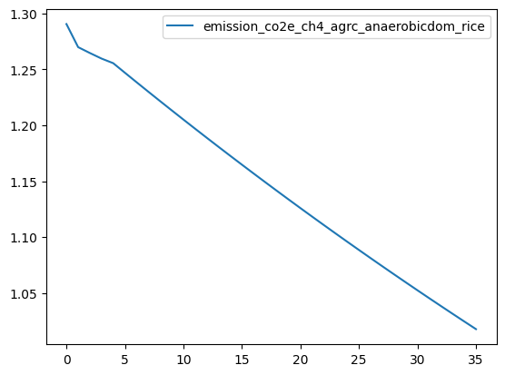
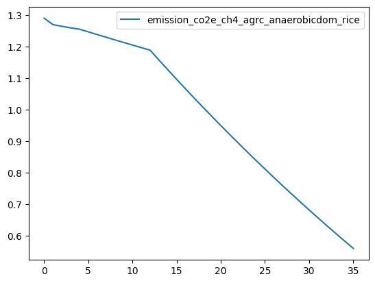
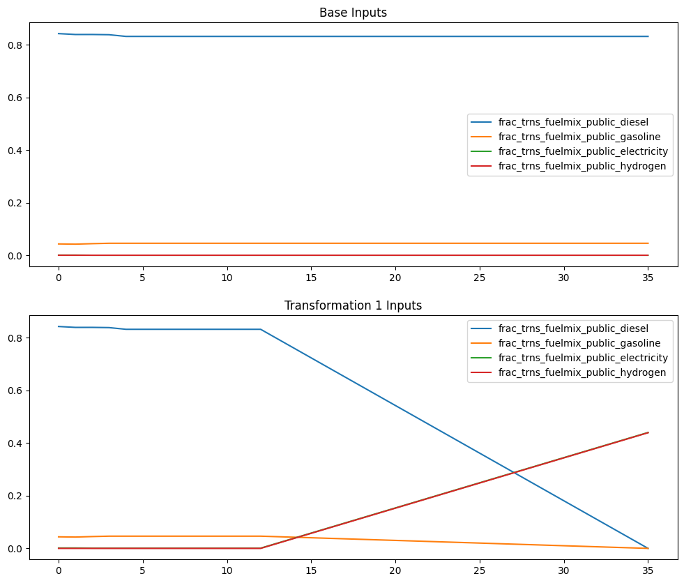
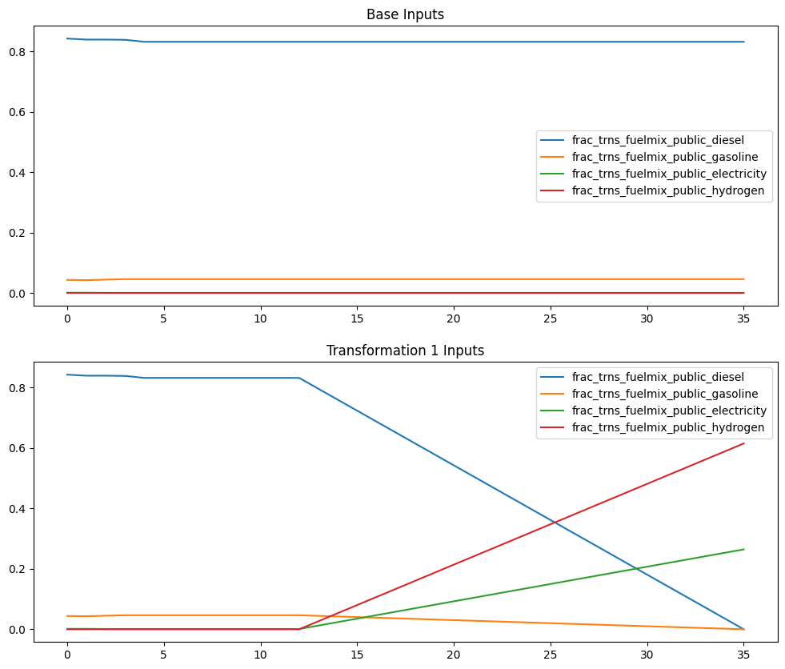
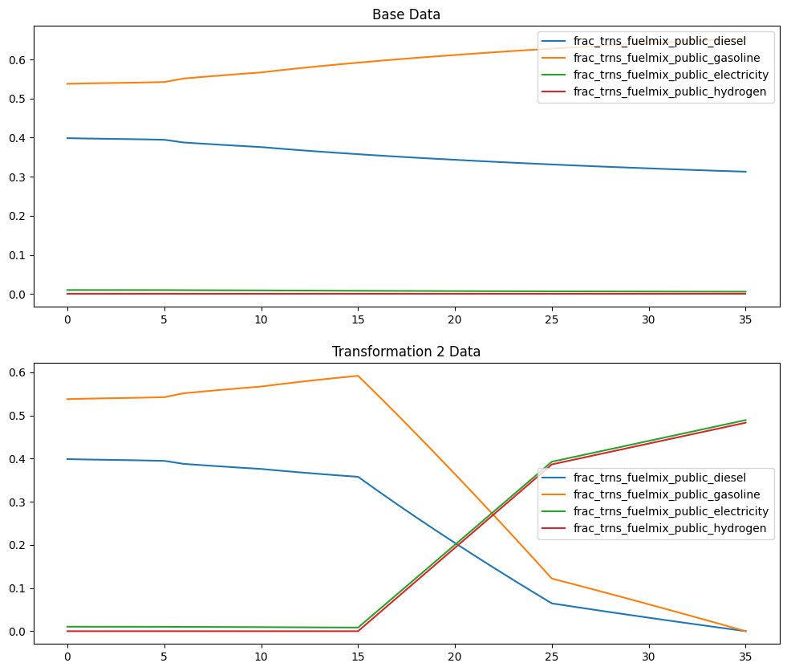
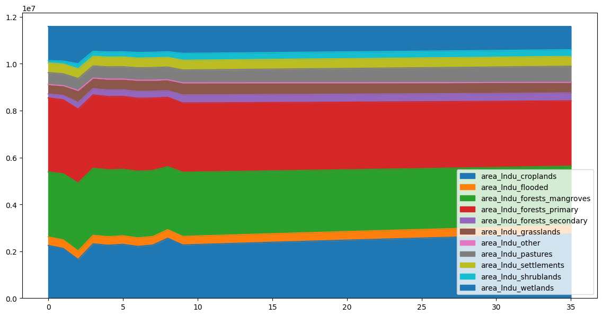
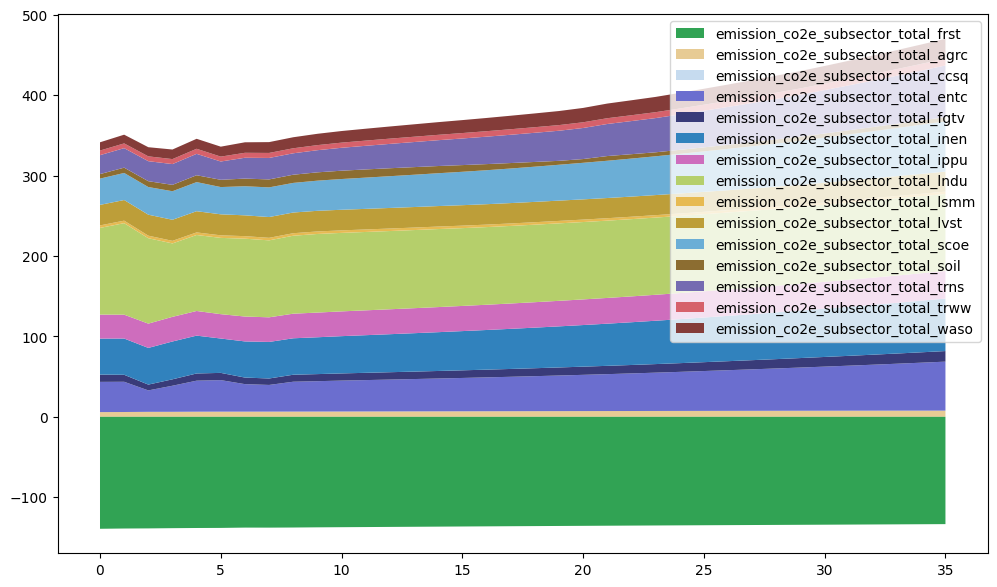
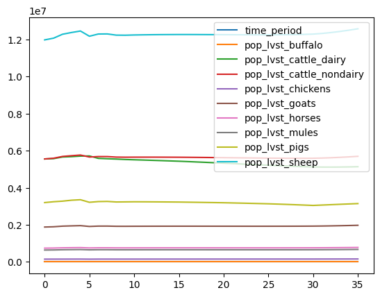
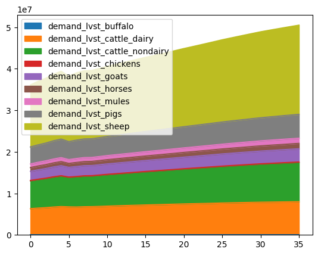

# SISEPUEDE Tutorial #3 - Working with transformations

Welcome to the **SImulation of SEctoral Pathways with Uncertainty Exploration for DEcarbonization (SISEPUEDE)** tutorials! This tutorial walks users through the construction and analysis of transformations using the `Transformer`/`Transformers`, `Transformation`/`Transformations`, and `Strategy`/`Strategies` classes. By the end of this tutorial, users should be able to:

1. Access and use base `Transformer` and `Transformers` objects
2. Construct and evaluate transformations using the `Transformation` and `Transformations` classes
3. Build portfolios of policy transformations using the `Strategy` class
4. Construct and run sets of portfolios both within a notebook and using configuration (.yaml) files using the `Strategies` class


```python
import warnings
warnings.filterwarnings("ignore")

import sys
path = "/Users/usuario/git/sisepuede"
if path not in sys.path:
    sys.path.append(path)

import copy
import datetime as dt
import importlib # needed so that we can reload packages
import ipywidgets as wdg
import matplotlib.pyplot as plt
import os, os.path
import numpy as np
import pandas as pd
import pathlib
import sisepuede.core.support_classes as sc
import sisepuede.transformers as trf
import sisepuede.utilities._toolbox as sf
import time
from sisepuede.manager.sisepuede_examples import SISEPUEDEExamples
from typing import Union


```

# Two different things: *Transformer* vs. *Transformation*


# Transformations: what are they?

Transformations are well-defined in the SISEPUEDE ecosystem. A ``Transformation`` is a parameterization of a``Transformer``. Both are classes in SISEPUEDE, with ``Transformations`` and ``Transformers`` acting as collections of these classes, respectively. Each ``Transformer`` class is a function that modifies trajectories to reflect policy outcomes; documentation for each of the 60+ functions is available on readthedocs. 

``Transformation`` objects allow users to define parameterizations of ``Transformer`` objects using configuration files in a directory. This directory contains a configuration for:

1. All transformations
1. General configuraiton and information on the baseline
1. The strategy definition file, which combines transformations


See sisepuede.readthedocs.io for more information on transformations, transformers, and strategies.


# Let's explore the objects that underly all transformations: ``Transformers``


```python
help(trf.Transformers)
```

    Help on class Transformers in module sisepuede.transformers.transformers:
    
    class Transformers(builtins.object)
     |  Transformers(dict_config: Dict, attr_time_period: Union[str, pathlib.Path, pandas.core.frame.DataFrame, sisepuede.core.attribute_table.AttributeTable, NoneType] = None, code_baseline: str = 'TFR:BASE', df_input: Optional[pandas.core.frame.DataFrame] = None, field_region: Optional[str] = None, logger: Optional[logging.Logger] = None, regex_code_structure: re.Pattern = re.compile('TFR:(\\D*):(.*$)'), regex_template_prepend: str = 'sisepuede_run', **kwargs)
     |  
     |  Build collection of Transformers that are used to define transformations.
     |  
     |  Includes some information on
     |  
     |  Initialization Arguments
     |  ------------------------
     |  dict_config : Dict
     |      Configuration dictionary used to pass parameters to transformations. See 
     |      ?TransformerEnergy._initialize_parameters() for more information on 
     |      requirements.
     |  
     |  Optional Arguments
     |  ------------------
     |  attr_time_period : Union[str, pathlib.Path, pd.DataFrame, AttributeTable, None]
     |      Optional time period attribute table to pass to model attributes for
     |      overwriting default. 
     |  df_input : Union[pd.DataFrame, None]
     |      Optional input DataFrame to use for applying transformations; if True,
     |      pre-builds transofmations using this DataFrame, and, when 
     |      transformations are called without arguments, applies transformations to
     |      this DataFrame by default.
     |  logger : Union[logging.Logger, None]
     |      Optional logger object
     |  regex_code_structure : re.Pattern
     |      Regular expression defining the code structure of transformer codes
     |  regex_template_prepend : str
     |      Passed to SISEPUEDEFileStructure()
     |  **kwargs
     |  
     |  Methods defined here:
     |  
     |  __init__(self, dict_config: Dict, attr_time_period: Union[str, pathlib.Path, pandas.core.frame.DataFrame, sisepuede.core.attribute_table.AttributeTable, NoneType] = None, code_baseline: str = 'TFR:BASE', df_input: Optional[pandas.core.frame.DataFrame] = None, field_region: Optional[str] = None, logger: Optional[logging.Logger] = None, regex_code_structure: re.Pattern = re.compile('TFR:(\\D*):(.*$)'), regex_template_prepend: str = 'sisepuede_run', **kwargs)
     |      Initialize self.  See help(type(self)) for accurate signature.
     |  
     |  bounded_real_magnitude(self, magnitude: Union[float, int], default: Union[float, int], bounds: Tuple = (0.0, 1.0)) -> float
     |      Shortcut function to clean up a common operation; bounds magnitude
     |          if specify as a float, otherwise reverts to default
     |  
     |  build_implementation_ramp_vector(self, alpha_logistic: Optional[float] = 0.0, d: Union[float, int, NoneType] = 0, n_tp_ramp: Optional[int] = None, tp_0_ramp: Optional[int] = None, window_logistic: Optional[tuple] = (-8, 8), **kwargs) -> numpy.ndarray
     |      Build the implementation ramp vector
     |      
     |      Function Arguments
     |      ------------------
     |      
     |      Keyword Arguments
     |      -----------------
     |      - n_tp_ramp: number of years to go from 0 to 1
     |      - tp_0_ramp: last time period without change from baseline
     |      - alpha_logistic: fraction of the ramp that is logistic 
     |          (1 - alpha_logistic is linear)
     |      - d: centroid for the logit 
     |      - window_logistic: window for the standard logit function
     |      **kwargs: passed to sisepuede.utilities._toolbox.ramp_vector()
     |  
     |  build_msp_cap_vector(self, vec_ramp: numpy.ndarray) -> numpy.ndarray
     |      Build the cap vector for MSP adjustments. Derived from 
     |          vec_implementation_ramp
     |      
     |      Function Arguments
     |              ------------------
     |      - vec_ramp: implementation ramp vector to use. Will set cap at first 
     |          non-zero period
     |      
     |      Keyword Arguments
     |              -----------------
     |  
     |  check_implementation_ramp(self, vec_implementation_ramp: Union[numpy.ndarray, Dict[str, int], NoneType], df_input: Optional[pandas.core.frame.DataFrame] = None) -> Optional[numpy.ndarray]
     |      Check that vector `vec_implementation_ramp` ramp is the same length as 
     |          `df_input` and that it meets specifications for an implementation
     |          vector. If `df_input` is not specified, use `self.baseline_inputs`. 
     |      
     |      If anything fails, return `self.vec_implementation_ramp`.
     |  
     |  check_trns_fuel_switch_allocation_dict(self, dict_check: dict, dict_alternate: dict, input_keys_as_fuels: bool = True) -> bool
     |      Check to ensure that the fuel switching dictionary is specified 
     |          correctly
     |  
     |  check_trns_tech_allocation_dict(self, dict_check: dict, dict_alternate: dict, sum_check: Optional[str] = 'eq') -> bool
     |      Check to ensure that the fuel switching dictionary is specified 
     |          correctly
     |      
     |      Keyword Arguments
     |      -----------------
     |      - sum_check: "eq" to force values to sum to to 1, "leq" to force leq 
     |          than 1. By default, always must be geq 0
     |  
     |  get_entc_cats_max_investment_ramp(self, cats_entc_max_investment_ramp: Optional[List[str]] = None) -> List[str]
     |      Set categories to which a cap on maximum investment is applied in the 
     |          renewables target shift.  If dict_config is None, uses self.config.
     |      
     |      Keyword Arguments
     |      -----------------
     |      - cats_entc_max_investment_ramp: list of categories to apply a maximum
     |          investment capacity to
     |  
     |  get_entc_cats_renewable(self, cats_renewable: Optional[List[str]] = None, key_renewable_default: str = 'renewable_default') -> List[str]
     |  
     |  get_entc_dict_renewable_target_msp(self, cats_renewable: Optional[List[str]], dict_entc_renewable_target_msp: dict) -> List[str]
     |      Set any targets for renewable energy categories. Relies on 
     |          cats_renewable to verify keys in renewable_target_entc
     |      
     |      Keyword Arguments
     |      -----------------
     |      - dict_config: dictionary mapping input configuration arguments to key 
     |          values. Must include the following keys:
     |      
     |          * dict_entc_renewable_target_msp: dictionary of renewable energy
     |              categories mapped to MSP targets under the renewable target
     |              transformation
     |  
     |  get_inen_parameters(self, dict_cats_inen_high_heat_to_frac: Optional[List[str]] = None) -> List[str]
     |      Get INEN parameters for the implementation of transformations. Returns a 
     |          tuple with the following elements (dictionary keys, if present, are 
     |          shown within after comments; otherwise, calculated internally):
     |      
     |          (
     |              dict_cats_inen_high_heat_to_frac, # key "categories_inen_high_heat",
     |              cats_inen_not_high_heat,
     |          )
     |      
     |      If dict_config is None, uses self.config.
     |      
     |      NOTE: Requires keys in dict_config to set. If not found, will set the 
     |          following defaults:
     |              * dict_cats_inen_high_heat_to_frac: {
     |                  "cement": 0.88,
     |                  "chemicals": 0.5, 
     |                  "glass": 0.88, 
     |                  "lime_and_carbonite": 0.88, 
     |                  "metals": 0.92,
     |                  "paper": 0.18, 
     |              }
     |              * cats_inen_not_high_heat: derived from INEN Fuel Fraction 
     |                  variables and cats_inen_high_heat (complement)
     |              * frac_inen_high_temp_elec_hydg: (electrification and hydrogen
     |                  potential fractionation of industrial energy demand, 
     |                  targeted at high temperature demands: 50% of 1/2 of 90% of 
     |                  total INEN energy demand for each fuel)
     |              * frac_inen_low_temp_elec: 0.95*0.45 (electrification potential 
     |                  fractionation of industrial energy demand, targeted at low 
     |                  temperature demands: 95% of 1/2 of 90% of total INEN energy 
     |                  demand)
     |          
     |          The value of `frac_inen_shift_denom` is 
     |              frac_inen_low_temp_elec + 2*frac_inen_high_temp_elec_hydg
     |      
     |      
     |      Keyword Arguments
     |      -----------------
     |      - cats_inen_high_heat: optional specification of INEN categories that 
     |          include high heat
     |  
     |  get_ramp_characteristics(self, n_tp_ramp: Optional[int] = None, tp_0_ramp: Optional[int] = None) -> List[str]
     |      Get parameters for the implementation of transformations. Returns a 
     |          tuple with the following elements:
     |      
     |          (
     |              n_tp_ramp,
     |              tp_0_ramp, 
     |              vir_renewable_cap_delta_frac,
     |              vir_renewable_cap_max_frac,
     |          )
     |      
     |      If dict_config is None, uses self.config.
     |      
     |      NOTE: Requires those keys in dict_config to set. If not found, will set
     |          the following defaults:
     |              * tp_0_ramp: current year (computational run time) + 2
     |              * n_tp_ramp: n_tp - t0_ramp - 1 (ramps to 1 at final time 
     |                  period)
     |      
     |      Keyword Arguments
     |      -----------------
     |      - n_tp_ramp: number of time periods to increase to full implementation. 
     |          If None, defaults to final time period
     |      - tp_0_ramp: first time period of ramp (last == 0)
     |  
     |  get_transformer(self, transformer: Union[int, str, NoneType], return_code: bool = False) -> None
     |      Get `transformer` based on transformer code, id, or name
     |      
     |      If strat is None or an invalid valid of strat is entered, returns None; 
     |          otherwise, returns the Transformer object. 
     |      
     |          
     |      Function Arguments
     |      ------------------
     |      - transformer: transformer_id, transformer name, or transformer code to 
     |          use to retrieve sc.Trasnformation object
     |          
     |      Keyword Arguments
     |      ------------------
     |      - return_code: set to True to return the transformer code only
     |  
     |  get_transformer_codes_by_sector(self, key_other: str = 'other') -> dict
     |      Map transformers to the sector they are associated with (by code). If
     |          not associated with any sector, adds to `key_other` key
     |  
     |  get_transformer_variable_fields(self, error_thresh: float = 0.001, field_sample_group: str = 'sample_group', field_transformer_code: str = 'transformer_code', field_variable: str = 'variable', field_variable_field: str = 'variable_field', include_all_variable_fields_by_modvar: bool = False, include_sample_group: bool = True) -> pandas.core.frame.DataFrame
     |      Map transformer code to variable fields and variable that are 
     |          modified by the transformer. Creates a DataFrame map with the 
     |          following columns:
     |      
     |          field_sample_group:         Optional field storing a sample group.
     |                                      Sample groups are defined by all 
     |                                      variable fields that share transformer 
     |                                      codes. In general, a variable is only 
     |                                      affected by one transformer, but there 
     |                                      are some cases of overlap. 
     |          field_transformer_code:     Field storing the transformer code.
     |          field_variable:             Field storing the SISEPUEDE variable 
     |                                      name associated with the variable field 
     |                                      that responds to the transformer
     |          field_variable_field:       Field storing the variable field that 
     |                                      responds to the transformer specified in 
     |                                      field_transformer_code.
     |      
     |      Keyword Arguments
     |      -----------------
     |      error_thresh : float
     |          Threshold for determining equality; values with a normalized error 
     |          less than this (i.e., eps < |1 - x_0/x_i| for x_0 baseline and x_i 
     |          transformed) will be considered equal
     |      field_sample_group : str
     |          Field storing the sample group
     |      field_transformer_code : str
     |          Field storing the transformer code
     |      field_variable : str
     |          Field name for SISEPUEDE variable
     |      field_variable_field : str
     |          Field name for SISEPUEDE variable field
     |      include_all_variable_fields_by_modvar : bool
     |          * true:     include all the variable fields associated with model 
     |                      variables
     |          * false:    include onlny the variable fields that vary
     |      include_sample_group : bool
     |  
     |  get_vectors_for_ramp_and_cap(self, categories_entc_max_investment_ramp: Optional[List[str]] = None, vec_implementation_ramp: Union[numpy.ndarray, Dict[str, int], NoneType] = None, **kwargs) -> Tuple
     |      Get ramp vector and associated vectors for capping, including (in order)
     |      
     |          * dict_entc_renewable_target_cats_max_investment
     |          * vec_implementation_ramp
     |          * vec_implementation_ramp_renewable_cap
     |          * vec_msp_resolution_cap
     |      
     |      Keyword Arguments
     |      -----------------
     |      - categories_entc_max_investment_ramp: categories to cap investments in
     |      - vec_implementation_ramp: optional vector specifying the implementation
     |          scalar ramp for the transformation. If None, defaults to a uniform 
     |          ramp that starts at the time specified in the configuration.
     |  
     |  get_vir_max_capacity(self, vec_implementation_ramp: numpy.ndarray, delta_frac: Optional[float] = None, dict_values_to_inds: Optional[Dict] = None, max_frac: Optional[float] = None) -> numpy.ndarray
     |      Buil a new value for the max_capacity based on vec_implementation_ramp.
     |          Starts with max_frac of a technicology's maximum residual capacity
     |          in the first period when vec_implementation_ramp != 0, then declines
     |          by delta_frac the specified number of time periods. Ramp down a cap 
     |          based on the renewable energy target.
     |      
     |      Function Arguments
     |      ------------------
     |      - vec_implementation_ramp: vector of lever implementation ramp to use as
     |          reference
     |      
     |      Keyword Arguments
     |      -----------------
     |      - delta_frac: delta to apply at each time period after the first time
     |          non-0 vec_implementation_ramp time_period. Defaults to 
     |          self.vir_renewable_cap_delta_frac if unspecified
     |      - dict_values_to_inds: optional dictionary mapping a value to row 
     |          indicies to pass the value to. Can be used, for example, to provide 
     |          a cap on new investments in early time periods. 
     |       - max_frac: fraction of maximum residual capacity to use as cap in 
     |          first time period where vec_implementation_ramp > 0. Defaults to
     |          self.vir_renewable_cap_max_frac if unspecified
     |  
     |  ----------------------------------------------------------------------
     |  Data descriptors defined here:
     |  
     |  __dict__
     |      dictionary for instance variables
     |  
     |  __weakref__
     |      list of weak references to the object
    


##  To get available `Transformer` classes, we need to start with a base dataset

- `Transformer` objects for SISEPUEDE are stored in the `Transformers` object
- `Transformers` requires an input data frame to transform; this data frame should be a set of raw SISEPUEDE inputs
    - Use `SISEPUEDEExamples()` to pull example data; examples are listed in `SISEPUEDEExamples.all_examples`


```python
examples = SISEPUEDEExamples()
df_input = examples("input_data_frame")
# note to james -- make this a fake country name (or example_country e.g.)

```


```python
Transformer: "Kernel", basic function of the transformation f(x)
Transformation: parameterization of a transformer f(x; a, b...)
Strategy: collection of transformations (f_1(f_2(f_3...))


                                         
                                         
```


```python
"""fp_peru = pathlib.Path(
    "/Users/usuario/git/sisepuede_region_nbs/article_6_tanzania_sri_lanka_peru/data/sisepuede_raw_global_inputs_peru.csv"
)
df_input = pd.read_csv(fp_peru)


"""
```


    'fp_peru = pathlib.Path(\n    "/Users/usuario/git/sisepuede_region_nbs/article_6_tanzania_sri_lanka_peru/data/sisepuede_raw_global_inputs_peru.csv"\n)\ndf_input = pd.read_csv(fp_peru)\n\n\n'


##  We can build the `Transformers` class now


```python
import sisepuede.transformers.transformers as trfs
importlib.reload(trfs)
transformers = trfs.Transformers(
    {},
    df_input = df_input,  # examples("input_data_frame"),
)

# set some shortcuts
mat = transformers.model_attributes
time_periods = sc.TimePeriods(mat);
file_struct = transformers.file_struct


```


```python

```

###  `Transformers` allows you to access all `Transformer` objects
- A `Transformer` is akin to a lever in the XLRM framework
- Each `Transformer` is associated with a variable (or set of variables) that represent a feasible, literature-based change in outcome due to at least one intervention(s)
- The list of available `Transformer` classes is available in `Transformers.all_transformers`
- Get a transformer using `Transformers.get_transformer`


```python
import sisepuede.manager.sisepuede_models as sm
models = sm.SISEPUEDEModels(
    mat,
    allow_electricity_run = True,
    fp_julia = file_struct.dir_jl,
    fp_nemomod_reference_files = file_struct.dir_ref_nemo,
)
```

    Detected IPython. Loading juliacall extension. See https://juliapy.github.io/PythonCall.jl/stable/compat/#IPython


    Precompiling NemoMod...
    Info Given NemoMod was explicitly requested, output will be shown live 
    WARNING: Method definition parse_line(String) in module ConfParser at /Users/usuario/.julia/packages/ConfParser/b2fge/src/ConfParser.jl:95 overwritten in module NemoMod at /Users/usuario/.julia/packages/NemoMod/p49Bn/src/other_functions.jl:35.
    ERROR: Method overwriting is not permitted during Module precompilation. Use `__precompile__(false)` to opt-out of precompilation.
       4357.7 ms  ? NemoMod
    [ Info: Precompiling NemoMod [a3c327a0-d2f0-11e8-37fd-d12fd35c3c72] 
    WARNING: Method definition parse_line(String) in module ConfParser at /Users/usuario/.julia/packages/ConfParser/b2fge/src/ConfParser.jl:95 overwritten in module NemoMod at /Users/usuario/.julia/packages/NemoMod/p49Bn/src/other_functions.jl:35.
    ERROR: Method overwriting is not permitted during Module precompilation. Use `__precompile__(false)` to opt-out of precompilation.
    ┌ Info: Skipping precompilation due to precompilable error. Importing NemoMod [a3c327a0-d2f0-11e8-37fd-d12fd35c3c72].
    └   exception = Error when precompiling module, potentially caused by a __precompile__(false) declaration in the module.


###  A `Transformer` is callable
- When you get it, you can call it
- When called, it will generate a dataframe that is transformed under default parameters associated with each Transformer


```python
transformers.all_transformers


        

```


    ['TFR:AGRC:DEC_CH4_RICE',
     'TFR:AGRC:DEC_EXPORTS',
     'TFR:AGRC:DEC_LOSSES_SUPPLY_CHAIN',
     'TFR:AGRC:INC_CONSERVATION_AGRICULTURE',
     'TFR:AGRC:INC_PRODUCTIVITY',
     'TFR:BASE',
     'TFR:CCSQ:INC_CAPTURE',
     'TFR:ENFU:ADJ_EXPORTS',
     'TFR:ENTC:DEC_LOSSES',
     'TFR:ENTC:LEAST_COST_SOLUTION',
     'TFR:ENTC:TARGET_CLEAN_HYDROGEN',
     'TFR:ENTC:TARGET_RENEWABLE_ELEC',
     'TFR:FGTV:DEC_LEAKS',
     'TFR:FGTV:INC_FLARE',
     'TFR:INEN:INC_EFFICIENCY_ENERGY',
     'TFR:INEN:INC_EFFICIENCY_PRODUCTION',
     'TFR:INEN:SHIFT_FUEL_HEAT',
     'TFR:IPPU:DEC_CLINKER',
     'TFR:IPPU:DEC_DEMAND',
     'TFR:IPPU:DEC_HFCS',
     'TFR:IPPU:DEC_N2O',
     'TFR:IPPU:DEC_OTHER_FCS',
     'TFR:IPPU:DEC_PFCS',
     'TFR:LNDU:BOUND_CLASSES',
     'TFR:LNDU:DEC_DEFORESTATION',
     'TFR:LNDU:DEC_SOC_LOSS_PASTURES',
     'TFR:LNDU:INC_REFORESTATION',
     'TFR:LNDU:INC_SILVOPASTURE',
     'TFR:LNDU:PLUR',
     'TFR:LSMM:INC_CAPTURE_BIOGAS',
     'TFR:LSMM:INC_MANAGEMENT_CATTLE_PIGS',
     'TFR:LSMM:INC_MANAGEMENT_OTHER',
     'TFR:LSMM:INC_MANAGEMENT_POULTRY',
     'TFR:LVST:DEC_ENTERIC_FERMENTATION',
     'TFR:LVST:DEC_EXPORTS',
     'TFR:LVST:INC_PRODUCTIVITY',
     'TFR:PFLO:INC_HEALTHIER_DIETS',
     'TFR:PFLO:INC_IND_CCS',
     'TFR:SCOE:DEC_DEMAND_HEAT',
     'TFR:SCOE:INC_EFFICIENCY_APPLIANCE',
     'TFR:SCOE:SHIFT_FUEL_HEAT',
     'TFR:SOIL:DEC_LIME_APPLIED',
     'TFR:SOIL:DEC_N_APPLIED',
     'TFR:TRDE:DEC_DEMAND',
     'TFR:TRNS:INC_EFFICIENCY_ELECTRIC',
     'TFR:TRNS:INC_EFFICIENCY_NON_ELECTRIC',
     'TFR:TRNS:INC_OCCUPANCY_LIGHT_DUTY',
     'TFR:TRNS:SHIFT_FUEL_LIGHT_DUTY',
     'TFR:TRNS:SHIFT_FUEL_MARITIME',
     'TFR:TRNS:SHIFT_FUEL_MEDIUM_DUTY',
     'TFR:TRNS:SHIFT_FUEL_RAIL',
     'TFR:TRNS:SHIFT_MODE_FREIGHT',
     'TFR:TRNS:SHIFT_MODE_PASSENGER',
     'TFR:TRNS:SHIFT_MODE_REGIONAL',
     'TFR:TRWW:INC_CAPTURE_BIOGAS',
     'TFR:TRWW:INC_COMPLIANCE_SEPTIC',
     'TFR:WALI:INC_TREATMENT_INDUSTRIAL',
     'TFR:WALI:INC_TREATMENT_RURAL',
     'TFR:WALI:INC_TREATMENT_URBAN',
     'TFR:WASO:DEC_CONSUMER_FOOD_WASTE',
     'TFR:WASO:INC_ANAEROBIC_AND_COMPOST',
     'TFR:WASO:INC_CAPTURE_BIOGAS',
     'TFR:WASO:INC_ENERGY_FROM_BIOGAS',
     'TFR:WASO:INC_ENERGY_FROM_INCINERATION',
     'TFR:WASO:INC_LANDFILLING',
     'TFR:WASO:INC_RECYCLING']


# Use the `get_transformer` method to get a transformer based on its code


```python
transformers.get_transformer("TFR:AGRC:DEC_CH4_RICE")
```


    <sisepuede.transformers.transformers.Transformer at 0x14786bb50>


```python
#tr_reduce_rice_methane.attribute_transformer_code
tr_reduce_rice_methane.description
```


    ---------------------------------------------------------------------------

    NameError                                 Traceback (most recent call last)

    Cell In[8], line 2
          1 #tr_reduce_rice_methane.attribute_transformer_code
    ----> 2 tr_reduce_rice_methane.description


    NameError: name 'tr_reduce_rice_methane' is not defined


```python
tr_reduce_rice_methane = transformers.get_transformer("TFR:AGRC:DEC_CH4_RICE")

# you can call it 
df_input_reduce_rice = tr_reduce_rice_methane()
df_input_reduce_rice

```


<div>
<style scoped>
    .dataframe tbody tr th:only-of-type {
        vertical-align: middle;
    }

    .dataframe tbody tr th {
        vertical-align: top;
    }

    .dataframe thead th {
        text-align: right;
    }
</style>
<table border="1" class="dataframe">
  <thead>
    <tr style="text-align: right;">
      <th></th>
      <th>region</th>
      <th>time_period</th>
      <th>avgload_trns_freight_tonne_per_vehicle_aviation</th>
      <th>avgload_trns_freight_tonne_per_vehicle_rail_freight</th>
      <th>avgload_trns_freight_tonne_per_vehicle_road_heavy_freight</th>
      <th>avgload_trns_freight_tonne_per_vehicle_water_borne</th>
      <th>avgmass_lvst_animal_buffalo_kg</th>
      <th>avgmass_lvst_animal_cattle_dairy_kg</th>
      <th>avgmass_lvst_animal_cattle_nondairy_kg</th>
      <th>avgmass_lvst_animal_chickens_kg</th>
      <th>...</th>
      <th>ef_lndu_conv_wetlands_to_forests_primary_gg_co2_ha</th>
      <th>ef_lndu_conv_wetlands_to_forests_secondary_gg_co2_ha</th>
      <th>ef_lndu_conv_wetlands_to_grasslands_gg_co2_ha</th>
      <th>ef_lndu_conv_wetlands_to_other_gg_co2_ha</th>
      <th>ef_lndu_conv_wetlands_to_pastures_gg_co2_ha</th>
      <th>ef_lndu_conv_wetlands_to_settlements_gg_co2_ha</th>
      <th>ef_lndu_conv_wetlands_to_shrublands_gg_co2_ha</th>
      <th>ef_lndu_conv_wetlands_to_wetlands_gg_co2_ha</th>
      <th>gasrf_lsmm_biogas_anaerobic_lagoon</th>
      <th>energydensity_gravimetric_enfu_gj_per_tonne_fuel_natural_gas</th>
    </tr>
  </thead>
  <tbody>
    <tr>
      <th>0</th>
      <td>costa_rica</td>
      <td>0</td>
      <td>70.0</td>
      <td>2923.0</td>
      <td>31.751466</td>
      <td>6468.0</td>
      <td>322.900664</td>
      <td>520.741388</td>
      <td>310.599686</td>
      <td>1.12759</td>
      <td>...</td>
      <td>0.0</td>
      <td>0.0</td>
      <td>0.0</td>
      <td>0.003030</td>
      <td>0.0</td>
      <td>0.003030</td>
      <td>0.0</td>
      <td>0.0</td>
      <td>0.0</td>
      <td>47.9</td>
    </tr>
    <tr>
      <th>1</th>
      <td>costa_rica</td>
      <td>1</td>
      <td>70.0</td>
      <td>2923.0</td>
      <td>31.751466</td>
      <td>6468.0</td>
      <td>322.900664</td>
      <td>520.741388</td>
      <td>310.599686</td>
      <td>1.12759</td>
      <td>...</td>
      <td>0.0</td>
      <td>0.0</td>
      <td>0.0</td>
      <td>0.003010</td>
      <td>0.0</td>
      <td>0.003010</td>
      <td>0.0</td>
      <td>0.0</td>
      <td>0.0</td>
      <td>47.9</td>
    </tr>
    <tr>
      <th>2</th>
      <td>costa_rica</td>
      <td>2</td>
      <td>70.0</td>
      <td>2923.0</td>
      <td>31.751466</td>
      <td>6468.0</td>
      <td>322.900664</td>
      <td>520.741388</td>
      <td>310.599686</td>
      <td>1.12759</td>
      <td>...</td>
      <td>0.0</td>
      <td>0.0</td>
      <td>0.0</td>
      <td>0.002960</td>
      <td>0.0</td>
      <td>0.002960</td>
      <td>0.0</td>
      <td>0.0</td>
      <td>0.0</td>
      <td>47.9</td>
    </tr>
    <tr>
      <th>3</th>
      <td>costa_rica</td>
      <td>3</td>
      <td>70.0</td>
      <td>2923.0</td>
      <td>31.751466</td>
      <td>6468.0</td>
      <td>322.900664</td>
      <td>520.741388</td>
      <td>310.599686</td>
      <td>1.12759</td>
      <td>...</td>
      <td>0.0</td>
      <td>0.0</td>
      <td>0.0</td>
      <td>0.002949</td>
      <td>0.0</td>
      <td>0.002949</td>
      <td>0.0</td>
      <td>0.0</td>
      <td>0.0</td>
      <td>47.9</td>
    </tr>
    <tr>
      <th>4</th>
      <td>costa_rica</td>
      <td>4</td>
      <td>70.0</td>
      <td>2923.0</td>
      <td>31.751466</td>
      <td>6468.0</td>
      <td>322.900664</td>
      <td>520.741388</td>
      <td>310.599686</td>
      <td>1.12759</td>
      <td>...</td>
      <td>0.0</td>
      <td>0.0</td>
      <td>0.0</td>
      <td>0.002949</td>
      <td>0.0</td>
      <td>0.002949</td>
      <td>0.0</td>
      <td>0.0</td>
      <td>0.0</td>
      <td>47.9</td>
    </tr>
    <tr>
      <th>5</th>
      <td>costa_rica</td>
      <td>5</td>
      <td>70.0</td>
      <td>2923.0</td>
      <td>31.751466</td>
      <td>6468.0</td>
      <td>322.900664</td>
      <td>520.741388</td>
      <td>310.599686</td>
      <td>1.12759</td>
      <td>...</td>
      <td>0.0</td>
      <td>0.0</td>
      <td>0.0</td>
      <td>0.002980</td>
      <td>0.0</td>
      <td>0.002980</td>
      <td>0.0</td>
      <td>0.0</td>
      <td>0.0</td>
      <td>47.9</td>
    </tr>
    <tr>
      <th>6</th>
      <td>costa_rica</td>
      <td>6</td>
      <td>70.0</td>
      <td>4082.0</td>
      <td>31.751466</td>
      <td>6468.0</td>
      <td>322.900664</td>
      <td>520.741388</td>
      <td>310.599686</td>
      <td>1.12759</td>
      <td>...</td>
      <td>0.0</td>
      <td>0.0</td>
      <td>0.0</td>
      <td>0.002980</td>
      <td>0.0</td>
      <td>0.002980</td>
      <td>0.0</td>
      <td>0.0</td>
      <td>0.0</td>
      <td>47.9</td>
    </tr>
    <tr>
      <th>7</th>
      <td>costa_rica</td>
      <td>7</td>
      <td>70.0</td>
      <td>4082.0</td>
      <td>31.751466</td>
      <td>6468.0</td>
      <td>322.900664</td>
      <td>520.741388</td>
      <td>310.599686</td>
      <td>1.12759</td>
      <td>...</td>
      <td>0.0</td>
      <td>0.0</td>
      <td>0.0</td>
      <td>0.002980</td>
      <td>0.0</td>
      <td>0.002980</td>
      <td>0.0</td>
      <td>0.0</td>
      <td>0.0</td>
      <td>47.9</td>
    </tr>
    <tr>
      <th>8</th>
      <td>costa_rica</td>
      <td>8</td>
      <td>70.0</td>
      <td>4082.0</td>
      <td>31.751466</td>
      <td>6468.0</td>
      <td>322.900664</td>
      <td>520.741388</td>
      <td>310.599686</td>
      <td>1.12759</td>
      <td>...</td>
      <td>0.0</td>
      <td>0.0</td>
      <td>0.0</td>
      <td>0.002980</td>
      <td>0.0</td>
      <td>0.002980</td>
      <td>0.0</td>
      <td>0.0</td>
      <td>0.0</td>
      <td>47.9</td>
    </tr>
    <tr>
      <th>9</th>
      <td>costa_rica</td>
      <td>9</td>
      <td>70.0</td>
      <td>4082.0</td>
      <td>31.751466</td>
      <td>6468.0</td>
      <td>322.900664</td>
      <td>520.741388</td>
      <td>310.599686</td>
      <td>1.12759</td>
      <td>...</td>
      <td>0.0</td>
      <td>0.0</td>
      <td>0.0</td>
      <td>0.002980</td>
      <td>0.0</td>
      <td>0.002980</td>
      <td>0.0</td>
      <td>0.0</td>
      <td>0.0</td>
      <td>47.9</td>
    </tr>
    <tr>
      <th>10</th>
      <td>costa_rica</td>
      <td>10</td>
      <td>70.0</td>
      <td>4082.0</td>
      <td>31.751466</td>
      <td>6468.0</td>
      <td>322.900664</td>
      <td>520.741388</td>
      <td>310.599686</td>
      <td>1.12759</td>
      <td>...</td>
      <td>0.0</td>
      <td>0.0</td>
      <td>0.0</td>
      <td>0.002980</td>
      <td>0.0</td>
      <td>0.002980</td>
      <td>0.0</td>
      <td>0.0</td>
      <td>0.0</td>
      <td>47.9</td>
    </tr>
    <tr>
      <th>11</th>
      <td>costa_rica</td>
      <td>11</td>
      <td>70.0</td>
      <td>4082.0</td>
      <td>31.751466</td>
      <td>6468.0</td>
      <td>322.900664</td>
      <td>520.741388</td>
      <td>310.599686</td>
      <td>1.12759</td>
      <td>...</td>
      <td>0.0</td>
      <td>0.0</td>
      <td>0.0</td>
      <td>0.002980</td>
      <td>0.0</td>
      <td>0.002980</td>
      <td>0.0</td>
      <td>0.0</td>
      <td>0.0</td>
      <td>47.9</td>
    </tr>
    <tr>
      <th>12</th>
      <td>costa_rica</td>
      <td>12</td>
      <td>70.0</td>
      <td>4082.0</td>
      <td>31.751466</td>
      <td>6468.0</td>
      <td>322.900664</td>
      <td>520.741388</td>
      <td>310.599686</td>
      <td>1.12759</td>
      <td>...</td>
      <td>0.0</td>
      <td>0.0</td>
      <td>0.0</td>
      <td>0.002980</td>
      <td>0.0</td>
      <td>0.002980</td>
      <td>0.0</td>
      <td>0.0</td>
      <td>0.0</td>
      <td>47.9</td>
    </tr>
    <tr>
      <th>13</th>
      <td>costa_rica</td>
      <td>13</td>
      <td>70.0</td>
      <td>4082.0</td>
      <td>31.751466</td>
      <td>6468.0</td>
      <td>322.900664</td>
      <td>520.741388</td>
      <td>310.599686</td>
      <td>1.12759</td>
      <td>...</td>
      <td>0.0</td>
      <td>0.0</td>
      <td>0.0</td>
      <td>0.002980</td>
      <td>0.0</td>
      <td>0.002980</td>
      <td>0.0</td>
      <td>0.0</td>
      <td>0.0</td>
      <td>47.9</td>
    </tr>
    <tr>
      <th>14</th>
      <td>costa_rica</td>
      <td>14</td>
      <td>70.0</td>
      <td>4082.0</td>
      <td>31.751466</td>
      <td>6468.0</td>
      <td>322.900664</td>
      <td>520.741388</td>
      <td>310.599686</td>
      <td>1.12759</td>
      <td>...</td>
      <td>0.0</td>
      <td>0.0</td>
      <td>0.0</td>
      <td>0.002980</td>
      <td>0.0</td>
      <td>0.002980</td>
      <td>0.0</td>
      <td>0.0</td>
      <td>0.0</td>
      <td>47.9</td>
    </tr>
    <tr>
      <th>15</th>
      <td>costa_rica</td>
      <td>15</td>
      <td>70.0</td>
      <td>4082.0</td>
      <td>31.751466</td>
      <td>6468.0</td>
      <td>322.900664</td>
      <td>520.741388</td>
      <td>310.599686</td>
      <td>1.12759</td>
      <td>...</td>
      <td>0.0</td>
      <td>0.0</td>
      <td>0.0</td>
      <td>0.002980</td>
      <td>0.0</td>
      <td>0.002980</td>
      <td>0.0</td>
      <td>0.0</td>
      <td>0.0</td>
      <td>47.9</td>
    </tr>
    <tr>
      <th>16</th>
      <td>costa_rica</td>
      <td>16</td>
      <td>70.0</td>
      <td>4082.0</td>
      <td>31.751466</td>
      <td>6468.0</td>
      <td>322.900664</td>
      <td>520.741388</td>
      <td>310.599686</td>
      <td>1.12759</td>
      <td>...</td>
      <td>0.0</td>
      <td>0.0</td>
      <td>0.0</td>
      <td>0.002980</td>
      <td>0.0</td>
      <td>0.002980</td>
      <td>0.0</td>
      <td>0.0</td>
      <td>0.0</td>
      <td>47.9</td>
    </tr>
    <tr>
      <th>17</th>
      <td>costa_rica</td>
      <td>17</td>
      <td>70.0</td>
      <td>4082.0</td>
      <td>31.751466</td>
      <td>6468.0</td>
      <td>322.900664</td>
      <td>520.741388</td>
      <td>310.599686</td>
      <td>1.12759</td>
      <td>...</td>
      <td>0.0</td>
      <td>0.0</td>
      <td>0.0</td>
      <td>0.002980</td>
      <td>0.0</td>
      <td>0.002980</td>
      <td>0.0</td>
      <td>0.0</td>
      <td>0.0</td>
      <td>47.9</td>
    </tr>
    <tr>
      <th>18</th>
      <td>costa_rica</td>
      <td>18</td>
      <td>70.0</td>
      <td>4082.0</td>
      <td>31.751466</td>
      <td>6468.0</td>
      <td>322.900664</td>
      <td>520.741388</td>
      <td>310.599686</td>
      <td>1.12759</td>
      <td>...</td>
      <td>0.0</td>
      <td>0.0</td>
      <td>0.0</td>
      <td>0.002980</td>
      <td>0.0</td>
      <td>0.002980</td>
      <td>0.0</td>
      <td>0.0</td>
      <td>0.0</td>
      <td>47.9</td>
    </tr>
    <tr>
      <th>19</th>
      <td>costa_rica</td>
      <td>19</td>
      <td>70.0</td>
      <td>4082.0</td>
      <td>31.751466</td>
      <td>6468.0</td>
      <td>322.900664</td>
      <td>520.741388</td>
      <td>310.599686</td>
      <td>1.12759</td>
      <td>...</td>
      <td>0.0</td>
      <td>0.0</td>
      <td>0.0</td>
      <td>0.002980</td>
      <td>0.0</td>
      <td>0.002980</td>
      <td>0.0</td>
      <td>0.0</td>
      <td>0.0</td>
      <td>47.9</td>
    </tr>
    <tr>
      <th>20</th>
      <td>costa_rica</td>
      <td>20</td>
      <td>70.0</td>
      <td>4082.0</td>
      <td>31.751466</td>
      <td>6468.0</td>
      <td>322.900664</td>
      <td>520.741388</td>
      <td>310.599686</td>
      <td>1.12759</td>
      <td>...</td>
      <td>0.0</td>
      <td>0.0</td>
      <td>0.0</td>
      <td>0.002980</td>
      <td>0.0</td>
      <td>0.002980</td>
      <td>0.0</td>
      <td>0.0</td>
      <td>0.0</td>
      <td>47.9</td>
    </tr>
    <tr>
      <th>21</th>
      <td>costa_rica</td>
      <td>21</td>
      <td>70.0</td>
      <td>4082.0</td>
      <td>31.751466</td>
      <td>6468.0</td>
      <td>322.900664</td>
      <td>520.741388</td>
      <td>310.599686</td>
      <td>1.12759</td>
      <td>...</td>
      <td>0.0</td>
      <td>0.0</td>
      <td>0.0</td>
      <td>0.002980</td>
      <td>0.0</td>
      <td>0.002980</td>
      <td>0.0</td>
      <td>0.0</td>
      <td>0.0</td>
      <td>47.9</td>
    </tr>
    <tr>
      <th>22</th>
      <td>costa_rica</td>
      <td>22</td>
      <td>70.0</td>
      <td>4082.0</td>
      <td>31.751466</td>
      <td>6468.0</td>
      <td>322.900664</td>
      <td>520.741388</td>
      <td>310.599686</td>
      <td>1.12759</td>
      <td>...</td>
      <td>0.0</td>
      <td>0.0</td>
      <td>0.0</td>
      <td>0.002980</td>
      <td>0.0</td>
      <td>0.002980</td>
      <td>0.0</td>
      <td>0.0</td>
      <td>0.0</td>
      <td>47.9</td>
    </tr>
    <tr>
      <th>23</th>
      <td>costa_rica</td>
      <td>23</td>
      <td>70.0</td>
      <td>4082.0</td>
      <td>31.751466</td>
      <td>6468.0</td>
      <td>322.900664</td>
      <td>520.741388</td>
      <td>310.599686</td>
      <td>1.12759</td>
      <td>...</td>
      <td>0.0</td>
      <td>0.0</td>
      <td>0.0</td>
      <td>0.002980</td>
      <td>0.0</td>
      <td>0.002980</td>
      <td>0.0</td>
      <td>0.0</td>
      <td>0.0</td>
      <td>47.9</td>
    </tr>
    <tr>
      <th>24</th>
      <td>costa_rica</td>
      <td>24</td>
      <td>70.0</td>
      <td>4082.0</td>
      <td>31.751466</td>
      <td>6468.0</td>
      <td>322.900664</td>
      <td>520.741388</td>
      <td>310.599686</td>
      <td>1.12759</td>
      <td>...</td>
      <td>0.0</td>
      <td>0.0</td>
      <td>0.0</td>
      <td>0.002980</td>
      <td>0.0</td>
      <td>0.002980</td>
      <td>0.0</td>
      <td>0.0</td>
      <td>0.0</td>
      <td>47.9</td>
    </tr>
    <tr>
      <th>25</th>
      <td>costa_rica</td>
      <td>25</td>
      <td>70.0</td>
      <td>4082.0</td>
      <td>31.751466</td>
      <td>6468.0</td>
      <td>322.900664</td>
      <td>520.741388</td>
      <td>310.599686</td>
      <td>1.12759</td>
      <td>...</td>
      <td>0.0</td>
      <td>0.0</td>
      <td>0.0</td>
      <td>0.002980</td>
      <td>0.0</td>
      <td>0.002980</td>
      <td>0.0</td>
      <td>0.0</td>
      <td>0.0</td>
      <td>47.9</td>
    </tr>
    <tr>
      <th>26</th>
      <td>costa_rica</td>
      <td>26</td>
      <td>70.0</td>
      <td>4082.0</td>
      <td>31.751466</td>
      <td>6468.0</td>
      <td>322.900664</td>
      <td>520.741388</td>
      <td>310.599686</td>
      <td>1.12759</td>
      <td>...</td>
      <td>0.0</td>
      <td>0.0</td>
      <td>0.0</td>
      <td>0.002980</td>
      <td>0.0</td>
      <td>0.002980</td>
      <td>0.0</td>
      <td>0.0</td>
      <td>0.0</td>
      <td>47.9</td>
    </tr>
    <tr>
      <th>27</th>
      <td>costa_rica</td>
      <td>27</td>
      <td>70.0</td>
      <td>4082.0</td>
      <td>31.751466</td>
      <td>6468.0</td>
      <td>322.900664</td>
      <td>520.741388</td>
      <td>310.599686</td>
      <td>1.12759</td>
      <td>...</td>
      <td>0.0</td>
      <td>0.0</td>
      <td>0.0</td>
      <td>0.002980</td>
      <td>0.0</td>
      <td>0.002980</td>
      <td>0.0</td>
      <td>0.0</td>
      <td>0.0</td>
      <td>47.9</td>
    </tr>
    <tr>
      <th>28</th>
      <td>costa_rica</td>
      <td>28</td>
      <td>70.0</td>
      <td>4082.0</td>
      <td>31.751466</td>
      <td>6468.0</td>
      <td>322.900664</td>
      <td>520.741388</td>
      <td>310.599686</td>
      <td>1.12759</td>
      <td>...</td>
      <td>0.0</td>
      <td>0.0</td>
      <td>0.0</td>
      <td>0.002980</td>
      <td>0.0</td>
      <td>0.002980</td>
      <td>0.0</td>
      <td>0.0</td>
      <td>0.0</td>
      <td>47.9</td>
    </tr>
    <tr>
      <th>29</th>
      <td>costa_rica</td>
      <td>29</td>
      <td>70.0</td>
      <td>4082.0</td>
      <td>31.751466</td>
      <td>6468.0</td>
      <td>322.900664</td>
      <td>520.741388</td>
      <td>310.599686</td>
      <td>1.12759</td>
      <td>...</td>
      <td>0.0</td>
      <td>0.0</td>
      <td>0.0</td>
      <td>0.002980</td>
      <td>0.0</td>
      <td>0.002980</td>
      <td>0.0</td>
      <td>0.0</td>
      <td>0.0</td>
      <td>47.9</td>
    </tr>
    <tr>
      <th>30</th>
      <td>costa_rica</td>
      <td>30</td>
      <td>70.0</td>
      <td>4082.0</td>
      <td>31.751466</td>
      <td>6468.0</td>
      <td>322.900664</td>
      <td>520.741388</td>
      <td>310.599686</td>
      <td>1.12759</td>
      <td>...</td>
      <td>0.0</td>
      <td>0.0</td>
      <td>0.0</td>
      <td>0.002980</td>
      <td>0.0</td>
      <td>0.002980</td>
      <td>0.0</td>
      <td>0.0</td>
      <td>0.0</td>
      <td>47.9</td>
    </tr>
    <tr>
      <th>31</th>
      <td>costa_rica</td>
      <td>31</td>
      <td>70.0</td>
      <td>4082.0</td>
      <td>31.751466</td>
      <td>6468.0</td>
      <td>322.900664</td>
      <td>520.741388</td>
      <td>310.599686</td>
      <td>1.12759</td>
      <td>...</td>
      <td>0.0</td>
      <td>0.0</td>
      <td>0.0</td>
      <td>0.002980</td>
      <td>0.0</td>
      <td>0.002980</td>
      <td>0.0</td>
      <td>0.0</td>
      <td>0.0</td>
      <td>47.9</td>
    </tr>
    <tr>
      <th>32</th>
      <td>costa_rica</td>
      <td>32</td>
      <td>70.0</td>
      <td>4082.0</td>
      <td>31.751466</td>
      <td>6468.0</td>
      <td>322.900664</td>
      <td>520.741388</td>
      <td>310.599686</td>
      <td>1.12759</td>
      <td>...</td>
      <td>0.0</td>
      <td>0.0</td>
      <td>0.0</td>
      <td>0.002980</td>
      <td>0.0</td>
      <td>0.002980</td>
      <td>0.0</td>
      <td>0.0</td>
      <td>0.0</td>
      <td>47.9</td>
    </tr>
    <tr>
      <th>33</th>
      <td>costa_rica</td>
      <td>33</td>
      <td>70.0</td>
      <td>4082.0</td>
      <td>31.751466</td>
      <td>6468.0</td>
      <td>322.900664</td>
      <td>520.741388</td>
      <td>310.599686</td>
      <td>1.12759</td>
      <td>...</td>
      <td>0.0</td>
      <td>0.0</td>
      <td>0.0</td>
      <td>0.002980</td>
      <td>0.0</td>
      <td>0.002980</td>
      <td>0.0</td>
      <td>0.0</td>
      <td>0.0</td>
      <td>47.9</td>
    </tr>
    <tr>
      <th>34</th>
      <td>costa_rica</td>
      <td>34</td>
      <td>70.0</td>
      <td>4082.0</td>
      <td>31.751466</td>
      <td>6468.0</td>
      <td>322.900664</td>
      <td>520.741388</td>
      <td>310.599686</td>
      <td>1.12759</td>
      <td>...</td>
      <td>0.0</td>
      <td>0.0</td>
      <td>0.0</td>
      <td>0.002980</td>
      <td>0.0</td>
      <td>0.002980</td>
      <td>0.0</td>
      <td>0.0</td>
      <td>0.0</td>
      <td>47.9</td>
    </tr>
    <tr>
      <th>35</th>
      <td>costa_rica</td>
      <td>35</td>
      <td>70.0</td>
      <td>4082.0</td>
      <td>31.751466</td>
      <td>6468.0</td>
      <td>322.900664</td>
      <td>520.741388</td>
      <td>310.599686</td>
      <td>1.12759</td>
      <td>...</td>
      <td>0.0</td>
      <td>0.0</td>
      <td>0.0</td>
      <td>0.002980</td>
      <td>0.0</td>
      <td>0.002980</td>
      <td>0.0</td>
      <td>0.0</td>
      <td>0.0</td>
      <td>47.9</td>
    </tr>
  </tbody>
</table>
<p>36 rows × 2381 columns</p>
</div>


```python
import sisepuede.models.afolu as mafl
model_afolu = mafl.AFOLU(mat, )


```


```python
tr_baseline = transformers.get_transformer("TFR:BASE")
df_baseline = tr_baseline()

df_emissions_untransformed = model_afolu(df_baseline, )
df_emissions_transformed = model_afolu(df_input_reduce_rice)
```


```python
df_emissions_untransformed[[x for x in df_emissions_untransformed.columns if "ch4" in x and "rice" in x]].plot()
```


    <Axes: >


    

    


```python
?tr_reduce_rice_methane
```


    Signature:       tr_reduce_rice_methane(*args, **kwargs) -> Any
    Type:            Transformer
    String form:     <sisepuede.transformers.transformers.Transformer object at 0x12e775f90>
    File:            ~/git/sisepuede/sisepuede/transformers/transformers.py
    Docstring:      
    Implement the "Improve Rice Management" AGRC transformer on input DataFrame df_input. 
    
    Transformation Code : 
            TFR:AGRC:DEC_CH4_RICE
    
    Parameters
    ----------
    df_input : pd.DataFrame
        Optional data frame containing trajectories to modify
    magnitude : float
        Minimum target fraction of rice production under improved management.
    strat : int
        Optional strategy value to specify for the transformation
    vec_implementation_ramp : Union[np.ndarray, Dict[str, int], None]
        Optional vector or dictionary specifying the implementation scalar ramp for the transformation. If None, defaults to a uniform ramp that starts at the time specified in the configuration.
    Class docstring:
    Create a Transformation class to support construction in sectoral 
        transformations. 
    
    Initialization Arguments
    ------------------------
    code : str
        Transformer code used to map the transformer to the attribute table. 
        Must be defined in attr_transfomers.table[attr_transfomers.key]
    func : Callable
        The function associated with the transformation OR an ordered list of         functions representing compositional order, e.g., 
    
        [f1, f2, f3, ... , fn] -> fn(f{n-1}(...(f2(f1(x))))))
    
    attr_transformers : AttributeTable 
        AttributeTable used to define transformers from ModelAttributes
    
    Keyword Arguments
    -----------------
    code_baseline : str
        Transformer code that stores the baseline code, which is applied to raw 
        data.
    include_code_in_docstr: bool
        Include the Transformer code in the docstring if overwriting?
    overwrite_docstr : bool
        overwrite the docstring if there's only one function?


```python
df_input_reduce_rice = tr_reduce_rice_methane()#magnitude = 0.45)
df_emissions_transformed = model_afolu(df_input_reduce_rice)
df_emissions_transformed[[x for x in df_emissions_transformed.columns if "ch4" in x and "rice" in x]].plot()
```


    <Axes: >


    

    


```python

```


```python
[x for x in dir(transformers.model_enercons) if "modvar_trns" in x]

modvar = transformers.model_enercons.modvar_trns_fuel_fraction_electricity
modvar = mat.get_variable(modvar)
modvar.get_from_dataframe(df).tail()


```


<div>
<style scoped>
    .dataframe tbody tr th:only-of-type {
        vertical-align: middle;
    }

    .dataframe tbody tr th {
        vertical-align: top;
    }

    .dataframe thead th {
        text-align: right;
    }
</style>
<table border="1" class="dataframe">
  <thead>
    <tr style="text-align: right;">
      <th></th>
      <th>frac_trns_fuelmix_aviation_electricity</th>
      <th>frac_trns_fuelmix_powered_bikes_electricity</th>
      <th>frac_trns_fuelmix_public_electricity</th>
      <th>frac_trns_fuelmix_rail_freight_electricity</th>
      <th>frac_trns_fuelmix_rail_passenger_electricity</th>
      <th>frac_trns_fuelmix_road_heavy_freight_electricity</th>
      <th>frac_trns_fuelmix_road_heavy_regional_electricity</th>
      <th>frac_trns_fuelmix_road_light_electricity</th>
      <th>frac_trns_fuelmix_water_borne_electricity</th>
    </tr>
  </thead>
  <tbody>
    <tr>
      <th>31</th>
      <td>0.0</td>
      <td>0.549988</td>
      <td>0.564754</td>
      <td>0.0</td>
      <td>0.522293</td>
      <td>0.564754</td>
      <td>0.564754</td>
      <td>0.006473</td>
      <td>0.0</td>
    </tr>
    <tr>
      <th>32</th>
      <td>0.0</td>
      <td>0.549988</td>
      <td>0.594128</td>
      <td>0.0</td>
      <td>0.522293</td>
      <td>0.594128</td>
      <td>0.594128</td>
      <td>0.006380</td>
      <td>0.0</td>
    </tr>
    <tr>
      <th>33</th>
      <td>0.0</td>
      <td>0.549988</td>
      <td>0.623511</td>
      <td>0.0</td>
      <td>0.522293</td>
      <td>0.623511</td>
      <td>0.623511</td>
      <td>0.006290</td>
      <td>0.0</td>
    </tr>
    <tr>
      <th>34</th>
      <td>0.0</td>
      <td>0.549988</td>
      <td>0.652901</td>
      <td>0.0</td>
      <td>0.522293</td>
      <td>0.652901</td>
      <td>0.652901</td>
      <td>0.006203</td>
      <td>0.0</td>
    </tr>
    <tr>
      <th>35</th>
      <td>0.0</td>
      <td>0.549988</td>
      <td>0.682299</td>
      <td>0.0</td>
      <td>0.522293</td>
      <td>0.682299</td>
      <td>0.682299</td>
      <td>0.006120</td>
      <td>0.0</td>
    </tr>
  </tbody>
</table>
</div>


```python
modvar.get_from_dataframe(df_input).tail()
```


<div>
<style scoped>
    .dataframe tbody tr th:only-of-type {
        vertical-align: middle;
    }

    .dataframe tbody tr th {
        vertical-align: top;
    }

    .dataframe thead th {
        text-align: right;
    }
</style>
<table border="1" class="dataframe">
  <thead>
    <tr style="text-align: right;">
      <th></th>
      <th>frac_trns_fuelmix_aviation_electricity</th>
      <th>frac_trns_fuelmix_powered_bikes_electricity</th>
      <th>frac_trns_fuelmix_public_electricity</th>
      <th>frac_trns_fuelmix_rail_freight_electricity</th>
      <th>frac_trns_fuelmix_rail_passenger_electricity</th>
      <th>frac_trns_fuelmix_road_heavy_freight_electricity</th>
      <th>frac_trns_fuelmix_road_heavy_regional_electricity</th>
      <th>frac_trns_fuelmix_road_light_electricity</th>
      <th>frac_trns_fuelmix_water_borne_electricity</th>
    </tr>
  </thead>
  <tbody>
    <tr>
      <th>31</th>
      <td>0.0</td>
      <td>0.549988</td>
      <td>0.006414</td>
      <td>0.0</td>
      <td>0.522293</td>
      <td>0.006414</td>
      <td>0.006414</td>
      <td>0.006473</td>
      <td>0.0</td>
    </tr>
    <tr>
      <th>32</th>
      <td>0.0</td>
      <td>0.549988</td>
      <td>0.006323</td>
      <td>0.0</td>
      <td>0.522293</td>
      <td>0.006323</td>
      <td>0.006323</td>
      <td>0.006380</td>
      <td>0.0</td>
    </tr>
    <tr>
      <th>33</th>
      <td>0.0</td>
      <td>0.549988</td>
      <td>0.006234</td>
      <td>0.0</td>
      <td>0.522293</td>
      <td>0.006234</td>
      <td>0.006234</td>
      <td>0.006290</td>
      <td>0.0</td>
    </tr>
    <tr>
      <th>34</th>
      <td>0.0</td>
      <td>0.549988</td>
      <td>0.006150</td>
      <td>0.0</td>
      <td>0.522293</td>
      <td>0.006150</td>
      <td>0.006150</td>
      <td>0.006203</td>
      <td>0.0</td>
    </tr>
    <tr>
      <th>35</th>
      <td>0.0</td>
      <td>0.549988</td>
      <td>0.006068</td>
      <td>0.0</td>
      <td>0.522293</td>
      <td>0.006068</td>
      <td>0.006068</td>
      <td>0.006120</td>
      <td>0.0</td>
    </tr>
  </tbody>
</table>
</div>


```python
df_input[[x for x in df_input.columns if x.startswith("frac_trns_fuelmix_public_")]].tail()
```


<div>
<style scoped>
    .dataframe tbody tr th:only-of-type {
        vertical-align: middle;
    }

    .dataframe tbody tr th {
        vertical-align: top;
    }

    .dataframe thead th {
        text-align: right;
    }
</style>
<table border="1" class="dataframe">
  <thead>
    <tr style="text-align: right;">
      <th></th>
      <th>frac_trns_fuelmix_public_diesel</th>
      <th>frac_trns_fuelmix_public_natural_gas</th>
      <th>frac_trns_fuelmix_public_electricity</th>
      <th>frac_trns_fuelmix_public_gasoline</th>
      <th>frac_trns_fuelmix_public_biofuels</th>
      <th>frac_trns_fuelmix_public_hydrogen</th>
      <th>frac_trns_fuelmix_public_hydrocarbon_gas_liquids</th>
    </tr>
  </thead>
  <tbody>
    <tr>
      <th>31</th>
      <td>0.319624</td>
      <td>0.009144</td>
      <td>0.006414</td>
      <td>0.643903</td>
      <td>0.020915</td>
      <td>0.0</td>
      <td>0.0</td>
    </tr>
    <tr>
      <th>32</th>
      <td>0.317855</td>
      <td>0.008970</td>
      <td>0.006323</td>
      <td>0.646339</td>
      <td>0.020513</td>
      <td>0.0</td>
      <td>0.0</td>
    </tr>
    <tr>
      <th>33</th>
      <td>0.316155</td>
      <td>0.008803</td>
      <td>0.006234</td>
      <td>0.648679</td>
      <td>0.020128</td>
      <td>0.0</td>
      <td>0.0</td>
    </tr>
    <tr>
      <th>34</th>
      <td>0.314522</td>
      <td>0.008642</td>
      <td>0.006150</td>
      <td>0.650929</td>
      <td>0.019757</td>
      <td>0.0</td>
      <td>0.0</td>
    </tr>
    <tr>
      <th>35</th>
      <td>0.312950</td>
      <td>0.008488</td>
      <td>0.006068</td>
      <td>0.653093</td>
      <td>0.019400</td>
      <td>0.0</td>
      <td>0.0</td>
    </tr>
  </tbody>
</table>
</div>


```python

```


```python

```

###  A `Transfomer` is parameterized using keyword arguments
- No need to pass `df_input` unless you want to apply it to a data frame not used to instantiation the `Transformers` collection
- However, other arguments can be varied
- Full documentation of all `Transformer` functions is available at the [SISEPUEDE readthedocs](https://sisepuede.readthedocs.io/en/latest/transformers.html)
- Let's look at the doc string of `tr_medium_duty.function`, the base function in the transformer that we called (can also use `?tr_medium_duty`, but it will not show the signature)
    - `categories` can be varied to any TRNS category
    - `dict_allocation_fuels_target` is used to allocate the magnitude of the fuel shift across target fuels; 
        - `dict_allocation_fuels_target = {"fuel_electricity": 1.0}` means that 100% of the magnitude will be shifted away from `fuels_source`to electricity
    - `fuels_source` give fuels that are shifted away from. By default, this `Transformer` only shifts away from diesel and gas
    - `magnitude`: fraction of source fuel mix that is shifted to fuels specified in `dict_allocation_fuels_target`
    - `vec_implementation_ramp`: the implementation ramp vector. See discussion below for more information on how this can be specified


```python
?tr_medium_duty.function


```


    Signature:
    tr_medium_duty.function(
        categories: List[str] = ['road_heavy_freight', 'road_heavy_regional', 'public'],
        dict_allocation_fuels_target: Optional[dict] = None,
        df_input: Optional[pandas.core.frame.DataFrame] = None,
        fuels_source: List[str] = ['fuel_diesel', 'fuel_gasoline'],
        magnitude: float = 0.7,
        strat: Optional[int] = None,
        vec_implementation_ramp: Optional[numpy.ndarray] = None,
    ) -> pandas.core.frame.DataFrame
    Docstring:
    Implement the "Fuel-Switch Medium Duty" TRNS transformer on input DataFrame df_input. By default, transfers mangitude to electricity from gasoline and diesel; e.g., with magnitude = 0.7, then 70% of diesel and gas demand are transfered to fuels in fuels_target. The rest of the fuel demand is then transferred to hydrogen. 
    
    Parameters
    ----------
    categories : List[str]
        Transportation categories to include; defaults to 
        [
            "road_heavy_freight", 
            "road_heavy_regional", 
            "public"
        ]
    dict_allocation_fuels_target : Union[dict, None]
        Optional dictionary allocating target fuels. If None, defaults to
        {
            "fuel_electricity": 1.0,
        }
    
    df_input : pd.DataFrame
        Optional data frame containing trajectories to modify
    fuels_source : List[str]
        Fuels to transfer out; for F the percentage of TRNS demand met by fuels in fuels source, M*F (M = magtnitude) is transferred to fuels defined in dict_allocation_fuels_target
    magnitude : float
        Fraction of fuels_source (gas and diesel, e.g.) that shifted to target fuels fuels_target (hydrogen is default, can include ammonia). Note, remaining is shifted to electricity
    strat : int
        Optional strategy value to specify for the transformation
    vec_implementation_ramp : Union[np.ndarray, Dict[str, int], None]
        Optional vector or dictionary specifying the implementation scalar ramp for the transformation. If None, defaults to a uniform ramp that starts at the time specified in the configuration.
    File:      ~/git/sisepuede/sisepuede/transformers/transformers.py
    Type:      method


# Now, let's examine `Transformation` classes

- A `Transformation` is a parameterization of a `Transformer`
- Let's look at fuel shifting medium-duty
- A `Transformation` can be defined using a dictionary or a configuration file. 
    - **NOTE**: A value of `None` can be passed in a YAML configuration using `null`


-----

#### For this example, we'll walk through a dictionary. 

The following keys are required in a dictionary/yaml file:

- `citations`: list of bibtex citations to call. These bibtex citations can be in the default SISEPUEDE library `sisepuede/docs/source/citations.bib` or provided in a Transformation definition directory in `citations.bib`
- `description`: optional description to provide. 
    - **NOTE**: Descriptions can be include citations as \\cite{CITEKEY}
- `identifiers` (**required**): 
    - `transformation_code` (**required**): specify a transformation code. These codes are used to define strategies. **NOTE: CANNOT CONTAIN "|" CHARACTER**
    - `transformation_name` (optional): optional name for the transformation, but it is recommended to provide one. This name is used in building automated reports and display tables.
- `parameters` (**required**): Parameters--or keyword arguments to the function--are passed as a dictionary associated with this key. 
    - Parameters included in here *must* be keyword arguments to the `Transformer` that will be parameterized
- `transformer` (**required**): The `Transformer` code that this transformation will parameterize. 
        


```python
# Default setup
dict_setup = {
    "citations": ["autho_123", "xbm"],
    "identifiers": {
        "transformation_code": "TX:TRNS:SHIFT_FUEL_MEDIUM_DUTY",
        "transformation_name": "Shift fuel for medium duty vehicles"
    },
    "description": "This came from this paper and that came from that paper",
    "parameters": {
        "categories": [
            "road_heavy_freight",
            "road_heavy_regional",
            "public"
        ],
        "dict_allocation_fuels_target": None,
        "fuels_source": [
            "fuel_diesel", 
            "fuel_gasoline"
        ],
        "magnitude": 0.5,
        "vec_implementation_ramp": {
            "alpha_logistic": 0,
            "n_tp_ramp": None,
            "tp_0_ramp": None,
            "window_logistic": [-8, 8]
        }
    },
    "transformer": "TFR:TRNS:SHIFT_FUEL_MEDIUM_DUTY"
}


# built the Transformation using dict_setup
transformation_1 = trf.Transformation(
    dict_setup,
    transformers,
)


# Default setup
dict_setup_2 = {
    "citations": ["autho_123", "xbm"],
    "identifiers": {
        "transformation_code": "TX:TRNS:SHIFT_FUEL_MEDIUM_DUTY_LOW",
        "transformation_name": "Shift fuel for medium duty vehicles at a lower intensity"
    },
    "description": "This came from this paper and that came from that paper",
    "parameters": {
        "categories": [
            "road_heavy_freight",
            "road_heavy_regional",
            "public"
        ],
        "dict_allocation_fuels_target": None,
        "fuels_source": [
            "fuel_diesel", 
            "fuel_gasoline"
        ],
        "magnitude": 0.3,
        "vec_implementation_ramp": {
            "alpha_logistic": 0,
            "n_tp_ramp": None,
            "tp_0_ramp": None,
            "window_logistic": [-8, 8]
        }
    },
    "transformer": "TFR:TRNS:SHIFT_FUEL_MEDIUM_DUTY"
}


# built the Transformation using dict_setup
transformation_1 = trf.Transformation(
    dict_setup,
    transformers,
)

transformation_2 = trf.Transformation(
    dict_setup_2,
    transformers,
)
```

# Look at the transformed variables for one of the categories

The transformation shifts fuel sources for three categories--`road_heavy_freight`, `road_heavy_regional`, and `public`--into electricity and hydrogen. Let's look at fuel fractions under two conditions--without the tranformation + with the transformation-for only the `public` transportation category.


```python
# First, let's build the fields
cats = ["public"]
fields = []

for fuel_name in ["Diesel", "Gasoline", "Electricity", "Hydrogen"]:
    fields += mat.build_variable_fields(
        f"Transportation Mode Fuel Fraction {fuel_name}",
        restrict_to_category_values = cats,
    )


# execute the transformation (can also use transformation_1.function())
df_input_transformation_1 = transformation_1()

# build a plot
fig, ax = plt.subplots(2, 1, figsize = (12, 10))

# base
ax[0].set_title("Base Inputs")
df_input[fields].plot(ax = ax[0])

# transformed
ax[1].set_title("Transformation 1 Inputs")
df_input_transformation_1[fields].plot(ax = ax[1])
```


    <Axes: title={'center': 'Transformation 1 Inputs'}>


    

    


```python
# First, let's build the fields
cats = ["public"]
fields = []

for fuel_name in ["Diesel", "Gasoline", "Electricity", "Hydrogen"]:
    fields += mat.build_variable_fields(
        f"Transportation Mode Fuel Fraction {fuel_name}",
        restrict_to_category_values = cats,
    )


# execute the transformation (can also use transformation_1.function())
df_input_transformation_2 = transformation_2()

# build a plot
fig, ax = plt.subplots(2, 1, figsize = (12, 10))

# base
ax[0].set_title("Base Inputs")
df_input[fields].plot(ax = ax[0])

# transformed
ax[1].set_title("Transformation 1 Inputs")
df_input_transformation_2[fields].plot(ax = ax[1])
```


    <Axes: title={'center': 'Transformation 1 Inputs'}>


    

    


##  There are 2 approaches available to change the timing or shape of the implementation ramp

The `implementation_ramp` is commonly specified using `vec_implementation_ramp` across SISEPUEDE. 

- The implementation ramp represents what fraction of the magnitude of a transformation is implemented across time. It takes values in [0, 1] and must have the same length as the original data
- If not specified, it defaults to start at the current year + 2 and end at the final time period
- **IMPORTANT NOTE**: When building Transformation directories, you can specify a default `vec_implementation_ramp` in the general config (under the `general` key); one for the baseline (under the `baseline` key in config_general); and, if desired, a unique one for any of the Transformations in the directory. In these configuration files--as with setup dictionaries--`vec_implementation` can be specified as a dictionary or a vector of values.

----


###  Approach 1: set the implementation ramp using a dictionary (preferred approach)
 

Let's demonstrate one approach to setting the implementation ramp. First, we can build one using parameters in a dictionary. The key parameters are:

- `alpha` (mix fraction): fraction of the ramp that is logistic. For all linear, set to 0.0; for completely logistic, set to 1.0
- `tp_0_ramp`: final time period == 0 in the ramp
- `window_logistic`: $(w_0, w_1)$ the window of the standard logit function [ $f(x) = (1 + e^{-x})^{-1}$ ] used to create the shape. In general, the min and max should be symmetric:
     - if $|w_0| < |w_1|$ and $w_0 < 0, w_1 > 0$, then the ramp will grow quickly and reach near-full implementation early; 
     - if $|w_0| > |w_1|$ and $w_0 < 0, w_1 > 0$, then the ramp will grow slowly and reach near-full implementation late; 
- `d` (not in interactive): value where logit == 0.5. For advanced use.

```
{
    "vec_implementation_ramp": {
        "alpha_logistic": alpha,
        "n_tp_ramp": len(time_periods.all_time_periods),
        "tp_0_ramp": tp_0_ramp,
        "window_logistic": (window_min, window_max)
    }
}
```

----

##  Now, we can interact with a widget to explore how these shape parameters change the implementation ramp


```python
def interactive_df_plot(
    df: pd.DataFrame,
    fields_plot: list,
) -> wdg.interactive:
    """
    Build an interactive ipywidget time seris plot for df. Will ignore fields specified
        in `fields_ignore`.
    """
    
    # build some widgets
    slider_alpha = wdg.FloatSlider(
        description = "$\\alpha$",
        min = 0.0, 
        max = 1.0, 
        step = 0.01,
        value = 0.0,
    )
    slider_tp_0 = wdg.IntSlider(
        description = "$t_0^{(ramp)}$",
        min = min(time_periods.all_time_periods), 
        max = max(time_periods.all_time_periods),
        value = (dt.datetime.now().year + 2 - time_periods.all_years[0]) # default
    )
    slider_window_max = wdg.FloatSlider(
        description = "$w_{max}$",
        max = 10.0,
        min = 0.0, 
        value = 8.0,
    )
    slider_window_min = wdg.FloatSlider(
        description = "$w_{min}$",
        max = 0.0,
        min = -10.0, 
        value = -8.0,
    )
        

    # placeholder for other actions
    df_plot = df

    # function to allow interaction
    def show_transformation(
        alpha: float,
        tp_0_ramp: int,
        window_max: float,
        window_min: float,
    ) -> 'plt.plot()':
        """
        Plot output fields from the model run on the df_model_data data frame
        """
        

        # update
        dict_setup_cur = copy.deepcopy(dict_setup)
        (
            dict_setup_cur
            .get("parameters")
            .update(
                {
                    "vec_implementation_ramp": {
                        "alpha_logistic": alpha,
                        "n_tp_ramp": len(time_periods.all_time_periods),
                        "tp_0_ramp": tp_0_ramp,
                        "window_logistic": (window_min, window_max)
                    }
                }
            )
        )


        # build a new transformation with the implementation ramp
        transformation_cur = trf.Transformation(
            dict_setup_cur,
            transformers,
        )

        # execute the transformation and plot (can also use transformation_1.function())
        df_input_transformation_cur = transformation_cur()
        
        # initialize plot
        fig, ax = plt.subplots(1, 1, figsize = (12, 6))
        ax.set_title("Transformation with modified vec_implementation_ramp")
        df_input_transformation_cur[fields_plot].plot(ax = ax, )
        
        plt.show()

        return None
    
    

    out = wdg.interactive(
        show_transformation,
        alpha = slider_alpha,
        tp_0_ramp = slider_tp_0,
        window_max = slider_window_max,
        window_min = slider_window_min,
    )

    return out


interactive_df_plot(
    df_input,
    fields,
)
```


    interactive(children=(FloatSlider(value=0.0, description='$\\alpha$', max=1.0, step=0.01), IntSlider(value=12,…


###  We can read more about the parameters in the `_toolbox` function `ramp_vector`


```python
# check the characteristics of ramp vector
?sf.ramp_vector
```


    Signature:
    sf.ramp_vector(
        n: int,
        alpha_logistic: float = 0.0,
        d: Union[float, int] = 0,
        r_0: int = 0,
        r_1: Optional[int] = None,
        window_logistic: Tuple[int, int] = (-8, 8),
    ) -> float
    Docstring:
    Build a ramp vector for n time periods. Allows for the specifcation of a 
        linear vector, sigmoid, window within sigmoid, or some mix of the two.
        
    
    Function Arguments
    ------------------
    n : int
        Number of time periods (total)
    
    Keyword Arguments
    -----------------
    alpha_logistic : float
        Fraction of ramp function that is associated with the logistic. 
        (1 - alpha_logistic) gives the fraction that is linear.
    d : Union[float, int]
        Centroid for logistic function in window
    r_0 : int
        Last period == 0; e.g., if r_0 = 4 and n = 10, then in a linear 
        function, we have
    r_1 : Union[int, None]
        First period == 1. If None, defaults to n
    window_logistic : 
        Window in standard logistic function (i.e., 1/(1 + e^(-x)) that is 
        shifted and stretched to create the sigmoid component. By default, use 
        -8 to 8.
        * NOTE: The window can be asymmetric around 0 to modify the timing of
            the ramp. 
            * If |w_1| > |w_0|, then the ramp will increase more in early time
                periods
            * If |w_1| < |w_0|, then the ramp will increse more in later time
                periods
    File:      ~/git/sisepuede/sisepuede/utilities/_toolbox.py
    Type:      function


###  Approach 2: directly set the implementation ramp

Another approach to setting the implementation ramp is to to build one from scratch. It must take values in [0, 1], start with 0, and end with 1. This approach can be useful for non-traditional curves, or for a symmetric benchmarks that must be met over time. 

The time periods in the example range from 0-35 (2015 to 2050); let's suppose we have a transformation that begins in 2030 (the last value == 0 in this case) with 80% implemenation by 2040 and 100% by 2050. 

``vec_implementation_ramp = np.concatenate([np.zeros(16), np.arange(1, 11)*0.08, np.arange(1, 11)*0.02 + 0.8])``

**NOTE**: the toolbox (`sisepuede.utilities._toolbox`) includes the `ramp_vector` function, which is extremely useful for building vectors from scratch.


```python

```


```python
# set the vector--should be a numpy array
vec_implementation_ramp = np.concatenate(
    [
        np.zeros(16),
        np.arange(1, 11)*0.08,
        np.arange(1, 11)*0.02 + 0.8
    ]
)

# update
dict_setup_2 = copy.deepcopy(dict_setup)
dict_setup_2.get("parameters").update({"vec_implementation_ramp": vec_implementation_ramp})


# build a new transformation with the implementation ramp
transformation_2 = trf.Transformation(
    dict_setup_2,
    transformers,
)

# execute the transformation (can also use transformation_1.function())
df_input_transformation_2 = transformation_2()

fig, ax = plt.subplots(2, 1, figsize = (12, 10))

# base
ax[0].set_title("Base Data")
df_input[fields].plot(ax = ax[0])

# transformed
ax[1].set_title("Transformation 2 Data")
df_input_transformation_2[fields].plot(ax = ax[1])
```


    <Axes: title={'center': 'Transformation 2 Data'}>


    

    


```python

```

# How do we define a `Transformations` object (which are required to build `Strategies`)?
- `Transformations` are collections of `Transformation` objects
- They are defined in collections of configuration files stored in a _Strategy Directory_
    - The _Strategy Directory_ contains information about transformations, strategic combinations, and even citations
- The easiest way to begin is to instantiate a default strategy directory;
    - It will export one `Transformation` YAML configuration file for each `Transformer` object and prepopulate with defaults. From there, you can modify parameters or duplicate as needed. 
    - Each Transformation **must** have a unique Transformation code to be counted
    - Note that there can be multiple `Transformation` files associated with a single `Transformer`
    - A default strategy definition file is also created that includes:
        - Base case (required)
        - All singleton strategies (1:1 mapping with `Transformation` objects that are defined)
        - Sectoral combinations (the instantation chooses one `Transformation` per `Transformer` to include)
        - All (using the same one `Transformation` per `Transformer`)


```python
trf.Transformation(
    config = {
        "parameters": {
            "vec_implementation_ramp": {
                "tp_0_ramp": 5,
            }
        }
    },
    transformers,
)
```


      Cell In[61], line 2
        config = {
        ^
    IndentationError: unexpected indent


```python

```


```python
# set an ouput path and instantiate
dir_transformations_out = "/Users/usuario/Desktop/transformations_default"
if True:#not os.path.exists(dir_transformations_out):
    trf.instantiate_default_strategy_directory(
        transformers,
        dir_transformations_out,
    )

```


```python
# then, you can load this back in after modifying (play around with it)
transformations = trf.Transformations(
    dir_transformations_out,
    df_input = df_input,
    #transformers = transformers,
)
transformers = transformations.transformers
tab = transformations.attribute_transformation.table
tab

```


<div>
<style scoped>
    .dataframe tbody tr th:only-of-type {
        vertical-align: middle;
    }

    .dataframe tbody tr th {
        vertical-align: top;
    }

    .dataframe thead th {
        text-align: right;
    }
</style>
<table border="1" class="dataframe">
  <thead>
    <tr style="text-align: right;">
      <th></th>
      <th>transformation_id</th>
      <th>transformation_code</th>
      <th>transformation_name</th>
      <th>description</th>
      <th>citations</th>
      <th>path</th>
    </tr>
  </thead>
  <tbody>
    <tr>
      <th>0</th>
      <td>0</td>
      <td>TX:BASE</td>
      <td>None</td>
      <td>None</td>
      <td>None</td>
      <td>None</td>
    </tr>
    <tr>
      <th>1</th>
      <td>1</td>
      <td>TX:AGRC:DEC_CH4_RICE</td>
      <td>Default Value - AGRC: Improve rice management</td>
      <td>Reduce :math:`\text{CH}_4` emissions from rice...</td>
      <td>None</td>
      <td>/Users/usuario/Desktop/transformations_default...</td>
    </tr>
    <tr>
      <th>2</th>
      <td>2</td>
      <td>TX:AGRC:DEC_EXPORTS</td>
      <td>Default Value - AGRC: Decrease Exports</td>
      <td>Decrease agricultural exports by 50% (relative...</td>
      <td>None</td>
      <td>/Users/usuario/Desktop/transformations_default...</td>
    </tr>
    <tr>
      <th>3</th>
      <td>3</td>
      <td>TX:AGRC:DEC_LOSSES_SUPPLY_CHAIN</td>
      <td>Default Value - AGRC: Reduce supply chain losses</td>
      <td>Reduce waste food waste in the agricultural (c...</td>
      <td>None</td>
      <td>/Users/usuario/Desktop/transformations_default...</td>
    </tr>
    <tr>
      <th>4</th>
      <td>4</td>
      <td>TX:AGRC:INC_CONSERVATION_AGRICULTURE</td>
      <td>Default Value - AGRC: Expand conservation agri...</td>
      <td>| Decrease soil organic carbon loss in cropla...</td>
      <td>None</td>
      <td>/Users/usuario/Desktop/transformations_default...</td>
    </tr>
    <tr>
      <th>...</th>
      <td>...</td>
      <td>...</td>
      <td>...</td>
      <td>...</td>
      <td>...</td>
      <td>...</td>
    </tr>
    <tr>
      <th>63</th>
      <td>63</td>
      <td>TX:WASO:INC_CAPTURE_BIOGAS</td>
      <td>Default Value - WASO: Increase biogas capture</td>
      <td>Increase fraction of biogas captured from land...</td>
      <td>None</td>
      <td>/Users/usuario/Desktop/transformations_default...</td>
    </tr>
    <tr>
      <th>64</th>
      <td>64</td>
      <td>TX:WASO:INC_ENERGY_FROM_BIOGAS</td>
      <td>Default Value - WASO: Biogas for energy produc...</td>
      <td>Increase the fraction of biogas that is collec...</td>
      <td>None</td>
      <td>/Users/usuario/Desktop/transformations_default...</td>
    </tr>
    <tr>
      <th>65</th>
      <td>65</td>
      <td>TX:WASO:INC_ENERGY_FROM_INCINERATION</td>
      <td>Default Value - WASO: Incineration for energy ...</td>
      <td>None</td>
      <td>None</td>
      <td>/Users/usuario/Desktop/transformations_default...</td>
    </tr>
    <tr>
      <th>66</th>
      <td>66</td>
      <td>TX:WASO:INC_LANDFILLING</td>
      <td>Default Value - WASO: Increase landfilling</td>
      <td>Increase fraction of waste that is otherwise u...</td>
      <td>None</td>
      <td>/Users/usuario/Desktop/transformations_default...</td>
    </tr>
    <tr>
      <th>67</th>
      <td>67</td>
      <td>TX:WASO:INC_RECYCLING</td>
      <td>Default Value - WASO: Increase recycling</td>
      <td>None</td>
      <td>None</td>
      <td>/Users/usuario/Desktop/transformations_default...</td>
    </tr>
  </tbody>
</table>
<p>68 rows × 6 columns</p>
</div>


```python

```


```python

```


```python

```


```python
# look at all codes that were accepts
transformations.all_transformation_codes
```


    ['TX:AGRC:DEC_CH4_RICE',
     'TX:AGRC:DEC_EXPORTS',
     'TX:AGRC:DEC_LOSSES_SUPPLY_CHAIN',
     'TX:AGRC:INC_CONSERVATION_AGRICULTURE',
     'TX:AGRC:INC_PRODUCTIVITY',
     'TX:BASE',
     'TX:CCSQ:INC_CAPTURE',
     'TX:ENFU:ADJ_EXPORTS',
     'TX:ENTC:DEC_LOSSES',
     'TX:ENTC:LEAST_COST_SOLUTION',
     'TX:ENTC:TARGET_CLEAN_HYDROGEN',
     'TX:ENTC:TARGET_RENEWABLE_ELEC',
     'TX:FGTV:DEC_LEAKS',
     'TX:FGTV:INC_FLARE',
     'TX:INEN:INC_EFFICIENCY_ENERGY',
     'TX:INEN:INC_EFFICIENCY_PRODUCTION',
     'TX:INEN:SHIFT_FUEL_HEAT',
     'TX:IPPU:DEC_CLINKER',
     'TX:IPPU:DEC_DEMAND',
     'TX:IPPU:DEC_HFCS',
     'TX:IPPU:DEC_N2O',
     'TX:IPPU:DEC_OTHER_FCS',
     'TX:IPPU:DEC_PFCS',
     'TX:LNDU:BOUND_CLASSES',
     'TX:LNDU:DEC_DEFORESTATION',
     'TX:LNDU:DEC_DEFORESTATION_LIGHT',
     'TX:LNDU:DEC_SOC_LOSS_PASTURES',
     'TX:LNDU:INC_REFORESTATION',
     'TX:LNDU:INC_SILVOPASTURE',
     'TX:LNDU:PLUR',
     'TX:LSMM:INC_CAPTURE_BIOGAS',
     'TX:LSMM:INC_MANAGEMENT_CATTLE_PIGS',
     'TX:LSMM:INC_MANAGEMENT_OTHER',
     'TX:LSMM:INC_MANAGEMENT_POULTRY',
     'TX:LVST:DEC_ENTERIC_FERMENTATION',
     'TX:LVST:DEC_EXPORTS',
     'TX:LVST:INC_PRODUCTIVITY',
     'TX:PFLO:INC_HEALTHIER_DIETS',
     'TX:PFLO:INC_IND_CCS',
     'TX:SCOE:DEC_DEMAND_HEAT',
     'TX:SCOE:INC_EFFICIENCY_APPLIANCE',
     'TX:SCOE:SHIFT_FUEL_HEAT',
     'TX:SOIL:DEC_LIME_APPLIED',
     'TX:SOIL:DEC_N_APPLIED',
     'TX:TRDE:DEC_DEMAND',
     'TX:TRNS:INC_EFFICIENCY_ELECTRIC',
     'TX:TRNS:INC_EFFICIENCY_NON_ELECTRIC',
     'TX:TRNS:INC_OCCUPANCY_LIGHT_DUTY',
     'TX:TRNS:SHIFT_FUEL_LIGHT_DUTY',
     'TX:TRNS:SHIFT_FUEL_MARITIME',
     'TX:TRNS:SHIFT_FUEL_MEDIUM_DUTY',
     'TX:TRNS:SHIFT_FUEL_MEDIUM_DUTY_RED',
     'TX:TRNS:SHIFT_FUEL_RAIL',
     'TX:TRNS:SHIFT_MODE_FREIGHT',
     'TX:TRNS:SHIFT_MODE_PASSENGER',
     'TX:TRNS:SHIFT_MODE_REGIONAL',
     'TX:TRWW:INC_CAPTURE_BIOGAS',
     'TX:TRWW:INC_COMPLIANCE_SEPTIC',
     'TX:WALI:INC_TREATMENT_INDUSTRIAL',
     'TX:WALI:INC_TREATMENT_RURAL',
     'TX:WALI:INC_TREATMENT_URBAN',
     'TX:WASO:DEC_CONSUMER_FOOD_WASTE',
     'TX:WASO:INC_ANAEROBIC_AND_COMPOST',
     'TX:WASO:INC_CAPTURE_BIOGAS',
     'TX:WASO:INC_ENERGY_FROM_BIOGAS',
     'TX:WASO:INC_ENERGY_FROM_INCINERATION',
     'TX:WASO:INC_LANDFILLING',
     'TX:WASO:INC_RECYCLING']


```python
# explore transformations
tr_dec_deforestation = transformations.get_transformation("TX:LNDU:DEC_DEFORESTATION")
df_dec_deforestation = tr_dec_deforestation()
df_dec_deforestation["lndu_reallocation_factor"] = 1
df_out_dec_deforestation = model_afolu(df_dec_deforestation)

tr_dec_deforestation_light = transformations.get_transformation("TX:LNDU:DEC_DEFORESTATION_LIGHT")
df_dec_deforestation_light = tr_dec_deforestation_light()
df_dec_deforestation_light["lndu_reallocation_factor"] = 1
df_out_dec_deforestation_light = model_afolu(df_dec_deforestation_light)

```


```python
modvar = mat.get_variable("Land Use Area")

fig, ax = plt.subplots(figsize = (14, 7))
modvar.get_from_dataframe(df_out_dec_deforestation).plot.area(ax = ax)

```


    <Axes: >


    

    


```python
modvar = mat.get_variable("Land Use Area")

fig, ax = plt.subplots(figsize = (14, 7))
modvar.get_from_dataframe(df_out_dec_deforestation_light).plot.area(ax = ax)


```


    <Axes: >


    

    


```python

```


```python

```


```python

```


```python

```

# Next, let's build some individual strategies
- A `Strategy` is a combination of `Transformations`; this approach allows for extensive variation in parameterization--including timing, magnitude, and categorization--of `Transformers`.
- A `Strategy` requires the following to be instatiated:
    - `strategy_id`
    - `transformation_specification`: If None or "", returns baseline strategy. Otherwise, can be a list of `Transformation` codes OR a pipe (i.e., "|") -delimited string
    - `Transformations` object used to combine `Transformation` functions
- Similar to a `Transformation`, a `Strategy` is callable


```python
# a baseline strategy can be instantiated without 
strat = trf.Strategy(
    0,
    None,
    transformations,
)


strat1 = trf.Strategy(
    1,
    ["TX:LSMM:INC_MANAGEMENT_CATTLE_PIGS", "TX:LSMM:INC_CAPTURE_BIOGAS"],
    transformations,
)

strat2 = trf.Strategy(
    2,
    "TX:TRNS:SHIFT_FUEL_MEDIUM_DUTY|ENTC:TARGET_RENEWABLE_ELEC",
    transformations
)

```


```python

```


```python

```


```python

```


```python
df = strat2()
df[[x for x in df.columns if x.startswith("frac_trns_fuelmix_road_heavy_freight")]].tail()
```


<div>
<style scoped>
    .dataframe tbody tr th:only-of-type {
        vertical-align: middle;
    }

    .dataframe tbody tr th {
        vertical-align: top;
    }

    .dataframe thead th {
        text-align: right;
    }
</style>
<table border="1" class="dataframe">
  <thead>
    <tr style="text-align: right;">
      <th></th>
      <th>frac_trns_fuelmix_road_heavy_freight_hydrocarbon_gas_liquids</th>
      <th>frac_trns_fuelmix_road_heavy_freight_biofuels</th>
      <th>frac_trns_fuelmix_road_heavy_freight_diesel</th>
      <th>frac_trns_fuelmix_road_heavy_freight_electricity</th>
      <th>frac_trns_fuelmix_road_heavy_freight_gasoline</th>
      <th>frac_trns_fuelmix_road_heavy_freight_hydrogen</th>
      <th>frac_trns_fuelmix_road_heavy_freight_natural_gas</th>
    </tr>
  </thead>
  <tbody>
    <tr>
      <th>31</th>
      <td>0.0</td>
      <td>0.0</td>
      <td>0.155856</td>
      <td>0.576335</td>
      <td>0.017478</td>
      <td>0.247001</td>
      <td>0.003331</td>
    </tr>
    <tr>
      <th>32</th>
      <td>0.0</td>
      <td>0.0</td>
      <td>0.116892</td>
      <td>0.606668</td>
      <td>0.013109</td>
      <td>0.260001</td>
      <td>0.003331</td>
    </tr>
    <tr>
      <th>33</th>
      <td>0.0</td>
      <td>0.0</td>
      <td>0.077928</td>
      <td>0.637002</td>
      <td>0.008739</td>
      <td>0.273001</td>
      <td>0.003331</td>
    </tr>
    <tr>
      <th>34</th>
      <td>0.0</td>
      <td>0.0</td>
      <td>0.038964</td>
      <td>0.667335</td>
      <td>0.004370</td>
      <td>0.286001</td>
      <td>0.003331</td>
    </tr>
    <tr>
      <th>35</th>
      <td>0.0</td>
      <td>0.0</td>
      <td>0.000000</td>
      <td>0.697668</td>
      <td>0.000000</td>
      <td>0.299001</td>
      <td>0.003331</td>
    </tr>
  </tbody>
</table>
</div>


##  Similar to a `Transformation` and `Transformer`, a `Strategy` is callable
- Note that it is pre-populated with the `strategy_id` (the field associated with `model_attributes.dim_strategy_id`)


```python
strat1()
```


<div>
<style scoped>
    .dataframe tbody tr th:only-of-type {
        vertical-align: middle;
    }

    .dataframe tbody tr th {
        vertical-align: top;
    }

    .dataframe thead th {
        text-align: right;
    }
</style>
<table border="1" class="dataframe">
  <thead>
    <tr style="text-align: right;">
      <th></th>
      <th>strategy_id</th>
      <th>region</th>
      <th>time_period</th>
      <th>avgload_trns_freight_tonne_per_vehicle_aviation</th>
      <th>avgload_trns_freight_tonne_per_vehicle_rail_freight</th>
      <th>avgload_trns_freight_tonne_per_vehicle_road_heavy_freight</th>
      <th>avgload_trns_freight_tonne_per_vehicle_water_borne</th>
      <th>avgmass_lvst_animal_buffalo_kg</th>
      <th>avgmass_lvst_animal_cattle_dairy_kg</th>
      <th>avgmass_lvst_animal_cattle_nondairy_kg</th>
      <th>...</th>
      <th>ef_lndu_conv_wetlands_to_forests_primary_gg_co2_ha</th>
      <th>ef_lndu_conv_wetlands_to_forests_secondary_gg_co2_ha</th>
      <th>ef_lndu_conv_wetlands_to_grasslands_gg_co2_ha</th>
      <th>ef_lndu_conv_wetlands_to_other_gg_co2_ha</th>
      <th>ef_lndu_conv_wetlands_to_pastures_gg_co2_ha</th>
      <th>ef_lndu_conv_wetlands_to_settlements_gg_co2_ha</th>
      <th>ef_lndu_conv_wetlands_to_shrublands_gg_co2_ha</th>
      <th>ef_lndu_conv_wetlands_to_wetlands_gg_co2_ha</th>
      <th>gasrf_lsmm_biogas_anaerobic_lagoon</th>
      <th>energydensity_gravimetric_enfu_gj_per_tonne_fuel_natural_gas</th>
    </tr>
  </thead>
  <tbody>
    <tr>
      <th>0</th>
      <td>1</td>
      <td>costa_rica</td>
      <td>0</td>
      <td>70.0</td>
      <td>2923.0</td>
      <td>31.751466</td>
      <td>6468.0</td>
      <td>322.900664</td>
      <td>520.741388</td>
      <td>310.599686</td>
      <td>...</td>
      <td>0.0</td>
      <td>0.0</td>
      <td>0.0</td>
      <td>0.003030</td>
      <td>0.0</td>
      <td>0.003030</td>
      <td>0.0</td>
      <td>0.0</td>
      <td>0.000000</td>
      <td>47.9</td>
    </tr>
    <tr>
      <th>1</th>
      <td>1</td>
      <td>costa_rica</td>
      <td>1</td>
      <td>70.0</td>
      <td>2923.0</td>
      <td>31.751466</td>
      <td>6468.0</td>
      <td>322.900664</td>
      <td>520.741388</td>
      <td>310.599686</td>
      <td>...</td>
      <td>0.0</td>
      <td>0.0</td>
      <td>0.0</td>
      <td>0.003010</td>
      <td>0.0</td>
      <td>0.003010</td>
      <td>0.0</td>
      <td>0.0</td>
      <td>0.000000</td>
      <td>47.9</td>
    </tr>
    <tr>
      <th>2</th>
      <td>1</td>
      <td>costa_rica</td>
      <td>2</td>
      <td>70.0</td>
      <td>2923.0</td>
      <td>31.751466</td>
      <td>6468.0</td>
      <td>322.900664</td>
      <td>520.741388</td>
      <td>310.599686</td>
      <td>...</td>
      <td>0.0</td>
      <td>0.0</td>
      <td>0.0</td>
      <td>0.002960</td>
      <td>0.0</td>
      <td>0.002960</td>
      <td>0.0</td>
      <td>0.0</td>
      <td>0.000000</td>
      <td>47.9</td>
    </tr>
    <tr>
      <th>3</th>
      <td>1</td>
      <td>costa_rica</td>
      <td>3</td>
      <td>70.0</td>
      <td>2923.0</td>
      <td>31.751466</td>
      <td>6468.0</td>
      <td>322.900664</td>
      <td>520.741388</td>
      <td>310.599686</td>
      <td>...</td>
      <td>0.0</td>
      <td>0.0</td>
      <td>0.0</td>
      <td>0.002949</td>
      <td>0.0</td>
      <td>0.002949</td>
      <td>0.0</td>
      <td>0.0</td>
      <td>0.000000</td>
      <td>47.9</td>
    </tr>
    <tr>
      <th>4</th>
      <td>1</td>
      <td>costa_rica</td>
      <td>4</td>
      <td>70.0</td>
      <td>2923.0</td>
      <td>31.751466</td>
      <td>6468.0</td>
      <td>322.900664</td>
      <td>520.741388</td>
      <td>310.599686</td>
      <td>...</td>
      <td>0.0</td>
      <td>0.0</td>
      <td>0.0</td>
      <td>0.002949</td>
      <td>0.0</td>
      <td>0.002949</td>
      <td>0.0</td>
      <td>0.0</td>
      <td>0.000000</td>
      <td>47.9</td>
    </tr>
    <tr>
      <th>5</th>
      <td>1</td>
      <td>costa_rica</td>
      <td>5</td>
      <td>70.0</td>
      <td>2923.0</td>
      <td>31.751466</td>
      <td>6468.0</td>
      <td>322.900664</td>
      <td>520.741388</td>
      <td>310.599686</td>
      <td>...</td>
      <td>0.0</td>
      <td>0.0</td>
      <td>0.0</td>
      <td>0.002980</td>
      <td>0.0</td>
      <td>0.002980</td>
      <td>0.0</td>
      <td>0.0</td>
      <td>0.000000</td>
      <td>47.9</td>
    </tr>
    <tr>
      <th>6</th>
      <td>1</td>
      <td>costa_rica</td>
      <td>6</td>
      <td>70.0</td>
      <td>4082.0</td>
      <td>31.751466</td>
      <td>6468.0</td>
      <td>322.900664</td>
      <td>520.741388</td>
      <td>310.599686</td>
      <td>...</td>
      <td>0.0</td>
      <td>0.0</td>
      <td>0.0</td>
      <td>0.002980</td>
      <td>0.0</td>
      <td>0.002980</td>
      <td>0.0</td>
      <td>0.0</td>
      <td>0.000000</td>
      <td>47.9</td>
    </tr>
    <tr>
      <th>7</th>
      <td>1</td>
      <td>costa_rica</td>
      <td>7</td>
      <td>70.0</td>
      <td>4082.0</td>
      <td>31.751466</td>
      <td>6468.0</td>
      <td>322.900664</td>
      <td>520.741388</td>
      <td>310.599686</td>
      <td>...</td>
      <td>0.0</td>
      <td>0.0</td>
      <td>0.0</td>
      <td>0.002980</td>
      <td>0.0</td>
      <td>0.002980</td>
      <td>0.0</td>
      <td>0.0</td>
      <td>0.000000</td>
      <td>47.9</td>
    </tr>
    <tr>
      <th>8</th>
      <td>1</td>
      <td>costa_rica</td>
      <td>8</td>
      <td>70.0</td>
      <td>4082.0</td>
      <td>31.751466</td>
      <td>6468.0</td>
      <td>322.900664</td>
      <td>520.741388</td>
      <td>310.599686</td>
      <td>...</td>
      <td>0.0</td>
      <td>0.0</td>
      <td>0.0</td>
      <td>0.002980</td>
      <td>0.0</td>
      <td>0.002980</td>
      <td>0.0</td>
      <td>0.0</td>
      <td>0.000000</td>
      <td>47.9</td>
    </tr>
    <tr>
      <th>9</th>
      <td>1</td>
      <td>costa_rica</td>
      <td>9</td>
      <td>70.0</td>
      <td>4082.0</td>
      <td>31.751466</td>
      <td>6468.0</td>
      <td>322.900664</td>
      <td>520.741388</td>
      <td>310.599686</td>
      <td>...</td>
      <td>0.0</td>
      <td>0.0</td>
      <td>0.0</td>
      <td>0.002980</td>
      <td>0.0</td>
      <td>0.002980</td>
      <td>0.0</td>
      <td>0.0</td>
      <td>0.000000</td>
      <td>47.9</td>
    </tr>
    <tr>
      <th>10</th>
      <td>1</td>
      <td>costa_rica</td>
      <td>10</td>
      <td>70.0</td>
      <td>4082.0</td>
      <td>31.751466</td>
      <td>6468.0</td>
      <td>322.900664</td>
      <td>520.741388</td>
      <td>310.599686</td>
      <td>...</td>
      <td>0.0</td>
      <td>0.0</td>
      <td>0.0</td>
      <td>0.002980</td>
      <td>0.0</td>
      <td>0.002980</td>
      <td>0.0</td>
      <td>0.0</td>
      <td>0.000000</td>
      <td>47.9</td>
    </tr>
    <tr>
      <th>11</th>
      <td>1</td>
      <td>costa_rica</td>
      <td>11</td>
      <td>70.0</td>
      <td>4082.0</td>
      <td>31.751466</td>
      <td>6468.0</td>
      <td>322.900664</td>
      <td>520.741388</td>
      <td>310.599686</td>
      <td>...</td>
      <td>0.0</td>
      <td>0.0</td>
      <td>0.0</td>
      <td>0.002980</td>
      <td>0.0</td>
      <td>0.002980</td>
      <td>0.0</td>
      <td>0.0</td>
      <td>0.000000</td>
      <td>47.9</td>
    </tr>
    <tr>
      <th>12</th>
      <td>1</td>
      <td>costa_rica</td>
      <td>12</td>
      <td>70.0</td>
      <td>4082.0</td>
      <td>31.751466</td>
      <td>6468.0</td>
      <td>322.900664</td>
      <td>520.741388</td>
      <td>310.599686</td>
      <td>...</td>
      <td>0.0</td>
      <td>0.0</td>
      <td>0.0</td>
      <td>0.002980</td>
      <td>0.0</td>
      <td>0.002980</td>
      <td>0.0</td>
      <td>0.0</td>
      <td>0.000000</td>
      <td>47.9</td>
    </tr>
    <tr>
      <th>13</th>
      <td>1</td>
      <td>costa_rica</td>
      <td>13</td>
      <td>70.0</td>
      <td>4082.0</td>
      <td>31.751466</td>
      <td>6468.0</td>
      <td>322.900664</td>
      <td>520.741388</td>
      <td>310.599686</td>
      <td>...</td>
      <td>0.0</td>
      <td>0.0</td>
      <td>0.0</td>
      <td>0.002980</td>
      <td>0.0</td>
      <td>0.002980</td>
      <td>0.0</td>
      <td>0.0</td>
      <td>0.039130</td>
      <td>47.9</td>
    </tr>
    <tr>
      <th>14</th>
      <td>1</td>
      <td>costa_rica</td>
      <td>14</td>
      <td>70.0</td>
      <td>4082.0</td>
      <td>31.751466</td>
      <td>6468.0</td>
      <td>322.900664</td>
      <td>520.741388</td>
      <td>310.599686</td>
      <td>...</td>
      <td>0.0</td>
      <td>0.0</td>
      <td>0.0</td>
      <td>0.002980</td>
      <td>0.0</td>
      <td>0.002980</td>
      <td>0.0</td>
      <td>0.0</td>
      <td>0.078261</td>
      <td>47.9</td>
    </tr>
    <tr>
      <th>15</th>
      <td>1</td>
      <td>costa_rica</td>
      <td>15</td>
      <td>70.0</td>
      <td>4082.0</td>
      <td>31.751466</td>
      <td>6468.0</td>
      <td>322.900664</td>
      <td>520.741388</td>
      <td>310.599686</td>
      <td>...</td>
      <td>0.0</td>
      <td>0.0</td>
      <td>0.0</td>
      <td>0.002980</td>
      <td>0.0</td>
      <td>0.002980</td>
      <td>0.0</td>
      <td>0.0</td>
      <td>0.117391</td>
      <td>47.9</td>
    </tr>
    <tr>
      <th>16</th>
      <td>1</td>
      <td>costa_rica</td>
      <td>16</td>
      <td>70.0</td>
      <td>4082.0</td>
      <td>31.751466</td>
      <td>6468.0</td>
      <td>322.900664</td>
      <td>520.741388</td>
      <td>310.599686</td>
      <td>...</td>
      <td>0.0</td>
      <td>0.0</td>
      <td>0.0</td>
      <td>0.002980</td>
      <td>0.0</td>
      <td>0.002980</td>
      <td>0.0</td>
      <td>0.0</td>
      <td>0.156522</td>
      <td>47.9</td>
    </tr>
    <tr>
      <th>17</th>
      <td>1</td>
      <td>costa_rica</td>
      <td>17</td>
      <td>70.0</td>
      <td>4082.0</td>
      <td>31.751466</td>
      <td>6468.0</td>
      <td>322.900664</td>
      <td>520.741388</td>
      <td>310.599686</td>
      <td>...</td>
      <td>0.0</td>
      <td>0.0</td>
      <td>0.0</td>
      <td>0.002980</td>
      <td>0.0</td>
      <td>0.002980</td>
      <td>0.0</td>
      <td>0.0</td>
      <td>0.195652</td>
      <td>47.9</td>
    </tr>
    <tr>
      <th>18</th>
      <td>1</td>
      <td>costa_rica</td>
      <td>18</td>
      <td>70.0</td>
      <td>4082.0</td>
      <td>31.751466</td>
      <td>6468.0</td>
      <td>322.900664</td>
      <td>520.741388</td>
      <td>310.599686</td>
      <td>...</td>
      <td>0.0</td>
      <td>0.0</td>
      <td>0.0</td>
      <td>0.002980</td>
      <td>0.0</td>
      <td>0.002980</td>
      <td>0.0</td>
      <td>0.0</td>
      <td>0.234783</td>
      <td>47.9</td>
    </tr>
    <tr>
      <th>19</th>
      <td>1</td>
      <td>costa_rica</td>
      <td>19</td>
      <td>70.0</td>
      <td>4082.0</td>
      <td>31.751466</td>
      <td>6468.0</td>
      <td>322.900664</td>
      <td>520.741388</td>
      <td>310.599686</td>
      <td>...</td>
      <td>0.0</td>
      <td>0.0</td>
      <td>0.0</td>
      <td>0.002980</td>
      <td>0.0</td>
      <td>0.002980</td>
      <td>0.0</td>
      <td>0.0</td>
      <td>0.273913</td>
      <td>47.9</td>
    </tr>
    <tr>
      <th>20</th>
      <td>1</td>
      <td>costa_rica</td>
      <td>20</td>
      <td>70.0</td>
      <td>4082.0</td>
      <td>31.751466</td>
      <td>6468.0</td>
      <td>322.900664</td>
      <td>520.741388</td>
      <td>310.599686</td>
      <td>...</td>
      <td>0.0</td>
      <td>0.0</td>
      <td>0.0</td>
      <td>0.002980</td>
      <td>0.0</td>
      <td>0.002980</td>
      <td>0.0</td>
      <td>0.0</td>
      <td>0.313043</td>
      <td>47.9</td>
    </tr>
    <tr>
      <th>21</th>
      <td>1</td>
      <td>costa_rica</td>
      <td>21</td>
      <td>70.0</td>
      <td>4082.0</td>
      <td>31.751466</td>
      <td>6468.0</td>
      <td>322.900664</td>
      <td>520.741388</td>
      <td>310.599686</td>
      <td>...</td>
      <td>0.0</td>
      <td>0.0</td>
      <td>0.0</td>
      <td>0.002980</td>
      <td>0.0</td>
      <td>0.002980</td>
      <td>0.0</td>
      <td>0.0</td>
      <td>0.352174</td>
      <td>47.9</td>
    </tr>
    <tr>
      <th>22</th>
      <td>1</td>
      <td>costa_rica</td>
      <td>22</td>
      <td>70.0</td>
      <td>4082.0</td>
      <td>31.751466</td>
      <td>6468.0</td>
      <td>322.900664</td>
      <td>520.741388</td>
      <td>310.599686</td>
      <td>...</td>
      <td>0.0</td>
      <td>0.0</td>
      <td>0.0</td>
      <td>0.002980</td>
      <td>0.0</td>
      <td>0.002980</td>
      <td>0.0</td>
      <td>0.0</td>
      <td>0.391304</td>
      <td>47.9</td>
    </tr>
    <tr>
      <th>23</th>
      <td>1</td>
      <td>costa_rica</td>
      <td>23</td>
      <td>70.0</td>
      <td>4082.0</td>
      <td>31.751466</td>
      <td>6468.0</td>
      <td>322.900664</td>
      <td>520.741388</td>
      <td>310.599686</td>
      <td>...</td>
      <td>0.0</td>
      <td>0.0</td>
      <td>0.0</td>
      <td>0.002980</td>
      <td>0.0</td>
      <td>0.002980</td>
      <td>0.0</td>
      <td>0.0</td>
      <td>0.430435</td>
      <td>47.9</td>
    </tr>
    <tr>
      <th>24</th>
      <td>1</td>
      <td>costa_rica</td>
      <td>24</td>
      <td>70.0</td>
      <td>4082.0</td>
      <td>31.751466</td>
      <td>6468.0</td>
      <td>322.900664</td>
      <td>520.741388</td>
      <td>310.599686</td>
      <td>...</td>
      <td>0.0</td>
      <td>0.0</td>
      <td>0.0</td>
      <td>0.002980</td>
      <td>0.0</td>
      <td>0.002980</td>
      <td>0.0</td>
      <td>0.0</td>
      <td>0.469565</td>
      <td>47.9</td>
    </tr>
    <tr>
      <th>25</th>
      <td>1</td>
      <td>costa_rica</td>
      <td>25</td>
      <td>70.0</td>
      <td>4082.0</td>
      <td>31.751466</td>
      <td>6468.0</td>
      <td>322.900664</td>
      <td>520.741388</td>
      <td>310.599686</td>
      <td>...</td>
      <td>0.0</td>
      <td>0.0</td>
      <td>0.0</td>
      <td>0.002980</td>
      <td>0.0</td>
      <td>0.002980</td>
      <td>0.0</td>
      <td>0.0</td>
      <td>0.508696</td>
      <td>47.9</td>
    </tr>
    <tr>
      <th>26</th>
      <td>1</td>
      <td>costa_rica</td>
      <td>26</td>
      <td>70.0</td>
      <td>4082.0</td>
      <td>31.751466</td>
      <td>6468.0</td>
      <td>322.900664</td>
      <td>520.741388</td>
      <td>310.599686</td>
      <td>...</td>
      <td>0.0</td>
      <td>0.0</td>
      <td>0.0</td>
      <td>0.002980</td>
      <td>0.0</td>
      <td>0.002980</td>
      <td>0.0</td>
      <td>0.0</td>
      <td>0.547826</td>
      <td>47.9</td>
    </tr>
    <tr>
      <th>27</th>
      <td>1</td>
      <td>costa_rica</td>
      <td>27</td>
      <td>70.0</td>
      <td>4082.0</td>
      <td>31.751466</td>
      <td>6468.0</td>
      <td>322.900664</td>
      <td>520.741388</td>
      <td>310.599686</td>
      <td>...</td>
      <td>0.0</td>
      <td>0.0</td>
      <td>0.0</td>
      <td>0.002980</td>
      <td>0.0</td>
      <td>0.002980</td>
      <td>0.0</td>
      <td>0.0</td>
      <td>0.586957</td>
      <td>47.9</td>
    </tr>
    <tr>
      <th>28</th>
      <td>1</td>
      <td>costa_rica</td>
      <td>28</td>
      <td>70.0</td>
      <td>4082.0</td>
      <td>31.751466</td>
      <td>6468.0</td>
      <td>322.900664</td>
      <td>520.741388</td>
      <td>310.599686</td>
      <td>...</td>
      <td>0.0</td>
      <td>0.0</td>
      <td>0.0</td>
      <td>0.002980</td>
      <td>0.0</td>
      <td>0.002980</td>
      <td>0.0</td>
      <td>0.0</td>
      <td>0.626087</td>
      <td>47.9</td>
    </tr>
    <tr>
      <th>29</th>
      <td>1</td>
      <td>costa_rica</td>
      <td>29</td>
      <td>70.0</td>
      <td>4082.0</td>
      <td>31.751466</td>
      <td>6468.0</td>
      <td>322.900664</td>
      <td>520.741388</td>
      <td>310.599686</td>
      <td>...</td>
      <td>0.0</td>
      <td>0.0</td>
      <td>0.0</td>
      <td>0.002980</td>
      <td>0.0</td>
      <td>0.002980</td>
      <td>0.0</td>
      <td>0.0</td>
      <td>0.665217</td>
      <td>47.9</td>
    </tr>
    <tr>
      <th>30</th>
      <td>1</td>
      <td>costa_rica</td>
      <td>30</td>
      <td>70.0</td>
      <td>4082.0</td>
      <td>31.751466</td>
      <td>6468.0</td>
      <td>322.900664</td>
      <td>520.741388</td>
      <td>310.599686</td>
      <td>...</td>
      <td>0.0</td>
      <td>0.0</td>
      <td>0.0</td>
      <td>0.002980</td>
      <td>0.0</td>
      <td>0.002980</td>
      <td>0.0</td>
      <td>0.0</td>
      <td>0.704348</td>
      <td>47.9</td>
    </tr>
    <tr>
      <th>31</th>
      <td>1</td>
      <td>costa_rica</td>
      <td>31</td>
      <td>70.0</td>
      <td>4082.0</td>
      <td>31.751466</td>
      <td>6468.0</td>
      <td>322.900664</td>
      <td>520.741388</td>
      <td>310.599686</td>
      <td>...</td>
      <td>0.0</td>
      <td>0.0</td>
      <td>0.0</td>
      <td>0.002980</td>
      <td>0.0</td>
      <td>0.002980</td>
      <td>0.0</td>
      <td>0.0</td>
      <td>0.743478</td>
      <td>47.9</td>
    </tr>
    <tr>
      <th>32</th>
      <td>1</td>
      <td>costa_rica</td>
      <td>32</td>
      <td>70.0</td>
      <td>4082.0</td>
      <td>31.751466</td>
      <td>6468.0</td>
      <td>322.900664</td>
      <td>520.741388</td>
      <td>310.599686</td>
      <td>...</td>
      <td>0.0</td>
      <td>0.0</td>
      <td>0.0</td>
      <td>0.002980</td>
      <td>0.0</td>
      <td>0.002980</td>
      <td>0.0</td>
      <td>0.0</td>
      <td>0.782609</td>
      <td>47.9</td>
    </tr>
    <tr>
      <th>33</th>
      <td>1</td>
      <td>costa_rica</td>
      <td>33</td>
      <td>70.0</td>
      <td>4082.0</td>
      <td>31.751466</td>
      <td>6468.0</td>
      <td>322.900664</td>
      <td>520.741388</td>
      <td>310.599686</td>
      <td>...</td>
      <td>0.0</td>
      <td>0.0</td>
      <td>0.0</td>
      <td>0.002980</td>
      <td>0.0</td>
      <td>0.002980</td>
      <td>0.0</td>
      <td>0.0</td>
      <td>0.821739</td>
      <td>47.9</td>
    </tr>
    <tr>
      <th>34</th>
      <td>1</td>
      <td>costa_rica</td>
      <td>34</td>
      <td>70.0</td>
      <td>4082.0</td>
      <td>31.751466</td>
      <td>6468.0</td>
      <td>322.900664</td>
      <td>520.741388</td>
      <td>310.599686</td>
      <td>...</td>
      <td>0.0</td>
      <td>0.0</td>
      <td>0.0</td>
      <td>0.002980</td>
      <td>0.0</td>
      <td>0.002980</td>
      <td>0.0</td>
      <td>0.0</td>
      <td>0.860870</td>
      <td>47.9</td>
    </tr>
    <tr>
      <th>35</th>
      <td>1</td>
      <td>costa_rica</td>
      <td>35</td>
      <td>70.0</td>
      <td>4082.0</td>
      <td>31.751466</td>
      <td>6468.0</td>
      <td>322.900664</td>
      <td>520.741388</td>
      <td>310.599686</td>
      <td>...</td>
      <td>0.0</td>
      <td>0.0</td>
      <td>0.0</td>
      <td>0.002980</td>
      <td>0.0</td>
      <td>0.002980</td>
      <td>0.0</td>
      <td>0.0</td>
      <td>0.900000</td>
      <td>47.9</td>
    </tr>
  </tbody>
</table>
<p>36 rows × 2382 columns</p>
</div>


##  Strategies can be instantied from a **Strategy Directory -- Skip Point 3**

A **Strategy Directory** is a self-contained definition set for strategies. The directory contains configuration files for the baseline and transformations, an optional citations database, and a strategy definition file. This directory also is the default output location for any Templates that are built using these files.

Below, we can call the `Strategies` object to build strategies. 
- Note the `prebuild` option; setting this to True will build all strategies and store them in a dataframe upon instantiation. 


```python
#HEREHEREHERE
t0 = time.time()
strategies = trf.Strategies(
    transformations,
    export_path = "transformations",
    prebuild = True,
)

t_elapse = sf.get_time_elapsed(t0)
print(f"Strategies defined at {strategies.transformations.dir_init} initialized in {t_elapse} seconds")


```

    Strategies defined at /Users/usuario/Desktop/transformations_default initialized in 2.04 seconds


```python

```


```python
import sisepuede.manager.sisepuede_models as sm
models = sm.SISEPUEDEModels(
    mat,
    allow_electricity_run = True,
)


```


    ---------------------------------------------------------------------------

    KeyError                                  Traceback (most recent call last)

    /var/folders/rv/0qtmbvjn78z0db_b7kvpp2600000gp/T/ipykernel_76139/2037970865.py in ?()
          1 import sisepuede.manager.sisepuede_models as sm
    ----> 2 models_noenerprod = sm.SISEPUEDEModels(
          3     mat,
          4     allow_electricity_run = True,
          5 )


    ~/git/sisepuede/sisepuede/manager/sisepuede_models.py in ?(self, model_attributes, allow_electricity_run, fp_julia, fp_nemomod_reference_files, fp_nemomod_temp_sqlite_db, initialize_julia, logger)
         91         # initialize last--depends on self.allow_electricity_run
         92         self._initialize_path_julia(fp_julia)
         93 
         94         # initialize models
    ---> 95         self._initialize_models(
         96             initialize_julia = initialize_julia,
         97         )
         98 


    ~/git/sisepuede/sisepuede/manager/sisepuede_models.py in ?(self, initialize_julia)
        155         self.model_circecon = CircularEconomy(self.model_attributes)
        156 
        157         self.model_enerprod = None
        158         if self.allow_electricity_run:
    --> 159             self.model_enerprod = EnergyProduction(
        160                 self.model_attributes,
        161                 self.fp_julia,
        162                 self.fp_nemomod_reference_files,


    ~/git/sisepuede/sisepuede/models/energy_production.py in ?(self, model_attributes, dir_jl, nemomod_reference_files, initialize_julia, logger, solver_time_limit)
        112 
        113         # initialize NemoMod properties
        114         self._initialize_dict_tables_required_to_required_fields()
        115         self._initialize_nemomod_output_tables()
    --> 116         self._initialize_nemomod_reference_dict(nemomod_reference_files)
        117 
        118         # finally, initialize models, set integrated variables/field map dictionaries and initialize julia
        119         self._initialize_models()


    ~/git/sisepuede/sisepuede/models/energy_production.py in ?(self, nemomod_reference_files, dict_tables_required_to_required_fields, filter_regions_to_config)
        806 
        807         # check fields in AvailabilityFactor
        808         sf.check_set_values(
        809             [
    --> 810                 x for x in dict_out[self.model_attributes.table_nemomod_availability_factor].columns if (x not in [self.field_nemomod_region, self.field_nemomod_time_slice])
        811             ],
        812             attr_technology.key_values
        813         )


    KeyError: 'AvailabilityFactor'


```python
strat1 = strategies.get_strategy(6003)

df_output1 = models(strat1())

df_output2 = models(strat2())

df_output3 = models(strat3())

```


```python

```


```python

```

##  Before reading into SISEPUEDE, input templates must built

- If you try to instantiate SISEPUEDE using a Strategy directory without templates, an error will occur
- use the `Strategies.build_strategies_to_templates()` method to build outputs
    - Note two important keyword arguments that are passed to `input_template.template_from_inputs()`:
        - df_trajgroup: optional dataframe mapping variable specifications to trajectory groups. The user only has to specify fields for which they want to defined a trajectory group in addition to the group (integer) that they want to assign the field to. (default None)
        - include_simplex_group_as_trajgroup: default to include simplex group from attributes as trajectory group? (default True)
        - see `?strategies.build_strategies_to_templates` for more details on these arguments


```python
?strategies.build_strategies_to_templates
```


    Signature:
    strategies.build_strategies_to_templates(
        df_base_trajectories: Optional[pandas.core.frame.DataFrame] = None,
        df_exogenous_strategies: Optional[pandas.core.frame.DataFrame] = None,
        regions: Optional[List[str]] = None,
        replace_template: bool = False,
        return_q: bool = False,
        sectors: Union[List[str], str] = None,
        strategies: Union[List[str], List[int], NoneType] = None,
        **kwargs,
    ) -> pandas.core.frame.DataFrame
    Docstring:
    Return a long (by model_attributes.dim_strategy_id) concatenated
        DataFrame of transformations.
    
    Function Arguments
    ------------------
    
    Keyword Arguments
    -----------------
    df_base_trajectories : Union[pd.DataFrame, None]
        baseline (untransformed) data frame to use to build strategies. Must 
        contain self.key_region and model_attributes.dim_time_period in 
        columns. If None, defaults to self.baseline_inputs
    df_exogenous_strategies : Union[pd.DataFrame, None]
        Optional exogenous strategies to pass. Must contain self.key_region 
        and model_attributes.dim_time_period in columns. If None, no action 
        is taken. 
    regions : Union[List[str], None]
        Optional list of regions to build strategies for. If None, defaults 
        to all defined.
    replace_template : bool
        Replace template if it exists? If False, tries to overwrite existing 
        sheets.
    return_q : bool
        Return an output dictionary? If True, will return all templates in 
        the form of a dictionary. Otherwise, writes to output path implied 
        by SISEPUEDEFileStructure
    sectors : Union[List[str], str]
        Optional sectors to specify for export. If None, will export all.
    strategies : Union[List[str], List[int], None]
        Strategies to build for. Can be a mixture of strategy_ids and names. 
        If None, runs all available. 
    **kwargs
        Passed to self.input_template.template_from_inputs(). Notable 
        keyword arguments include:
    
        * df_trajgroup: optional dataframe mapping each field variable to 
            trajectory groups. (default None)
            * Must contain field_subsector, field_variable, and 
                field_variable_trajectory_group as fields
            * Overrides include_simplex_group_as_trajgroup if specified and 
                conflicts occur
                * include_simplex_group_as_trajgroup: default to include simplex 
            group from attributes as trajectory group? (default True)
    File:      ~/git/sisepuede/sisepuede/transformers/strategies.py
    Type:      method


```python

```

##  Let's build our templates using `Strategies.build_strategies_to_templates()`
- First, let's specify some variable trajectory groups--these are groups of fields that share an LHC trial when varying in experiments
- We can pull a default example using the `SISEPUEDEExamples.variable_trajectory_group_specification` (see below)


```python
# call the example
df_vargroups = examples("variable_trajectory_group_specification")
df_vargroups


```


<div>
<style scoped>
    .dataframe tbody tr th:only-of-type {
        vertical-align: middle;
    }

    .dataframe tbody tr th {
        vertical-align: top;
    }

    .dataframe thead th {
        text-align: right;
    }
</style>
<table border="1" class="dataframe">
  <thead>
    <tr style="text-align: right;">
      <th></th>
      <th>variable</th>
      <th>variable_trajectory_group</th>
    </tr>
  </thead>
  <tbody>
    <tr>
      <th>0</th>
      <td>ef_lvst_entferm_buffalo_kg_ch4_head</td>
      <td>1</td>
    </tr>
    <tr>
      <th>1</th>
      <td>ef_lvst_entferm_cattle_dairy_kg_ch4_head</td>
      <td>1</td>
    </tr>
    <tr>
      <th>2</th>
      <td>ef_lvst_entferm_cattle_nondairy_kg_ch4_head</td>
      <td>1</td>
    </tr>
    <tr>
      <th>3</th>
      <td>ef_lvst_entferm_goats_kg_ch4_head</td>
      <td>1</td>
    </tr>
    <tr>
      <th>4</th>
      <td>ef_lvst_entferm_sheep_kg_ch4_head</td>
      <td>1</td>
    </tr>
    <tr>
      <th>...</th>
      <td>...</td>
      <td>...</td>
    </tr>
    <tr>
      <th>756</th>
      <td>scalar_lvst_carrying_capacity</td>
      <td>45</td>
    </tr>
    <tr>
      <th>757</th>
      <td>scalar_scoe_appliance_energy_demand_commercial...</td>
      <td>46</td>
    </tr>
    <tr>
      <th>758</th>
      <td>scalar_scoe_appliance_energy_demand_residential</td>
      <td>46</td>
    </tr>
    <tr>
      <th>759</th>
      <td>scalar_scoe_heat_energy_demand_commercial_muni...</td>
      <td>47</td>
    </tr>
    <tr>
      <th>760</th>
      <td>scalar_scoe_heat_energy_demand_residential</td>
      <td>47</td>
    </tr>
  </tbody>
</table>
<p>761 rows × 2 columns</p>
</div>


###   Let's see available strategies and pick some

- Additionally, the strategy attribute table from the default instantiation defines over 60 strategies; building all of these could be time-consuming. We can restrict the strategies we want to build by specifying IDs in the `strategies` keyword argument
- `strategies.attribute_table` is an attribute table; `strategies.attribute_table.table` is a data frame that can be accessed using standard Pandas methods


```python
strategies.attribute_table
```


<div>
<style scoped>
    .dataframe tbody tr th:only-of-type {
        vertical-align: middle;
    }

    .dataframe tbody tr th {
        vertical-align: top;
    }

    .dataframe thead th {
        text-align: right;
    }
</style>
<table border="1" class="dataframe">
  <thead>
    <tr style="text-align: right;">
      <th></th>
      <th>strategy_id</th>
      <th>strategy_code</th>
      <th>strategy</th>
      <th>description</th>
      <th>transformation_specification</th>
      <th>baseline_strategy_id</th>
    </tr>
  </thead>
  <tbody>
    <tr>
      <th>0</th>
      <td>0</td>
      <td>BASE</td>
      <td>Strategy TX:BASE</td>
      <td>NaN</td>
      <td>TX:BASE</td>
      <td>1</td>
    </tr>
    <tr>
      <th>1</th>
      <td>1000</td>
      <td>AGRC:DEC_CH4_RICE</td>
      <td>Singleton - Default Value - AGRC: Improve rice...</td>
      <td>NaN</td>
      <td>TX:AGRC:DEC_CH4_RICE</td>
      <td>0</td>
    </tr>
    <tr>
      <th>2</th>
      <td>1001</td>
      <td>AGRC:DEC_EXPORTS</td>
      <td>Singleton - Default Value - AGRC: Decrease Exp...</td>
      <td>NaN</td>
      <td>TX:AGRC:DEC_EXPORTS</td>
      <td>0</td>
    </tr>
    <tr>
      <th>3</th>
      <td>1002</td>
      <td>AGRC:DEC_LOSSES_SUPPLY_CHAIN</td>
      <td>Singleton - Default Value - AGRC: Reduce suppl...</td>
      <td>NaN</td>
      <td>TX:AGRC:DEC_LOSSES_SUPPLY_CHAIN</td>
      <td>0</td>
    </tr>
    <tr>
      <th>4</th>
      <td>1003</td>
      <td>AGRC:INC_CONSERVATION_AGRICULTURE</td>
      <td>Singleton - Default Value - AGRC: Expand conse...</td>
      <td>NaN</td>
      <td>TX:AGRC:INC_CONSERVATION_AGRICULTURE</td>
      <td>0</td>
    </tr>
    <tr>
      <th>...</th>
      <td>...</td>
      <td>...</td>
      <td>...</td>
      <td>...</td>
      <td>...</td>
      <td>...</td>
    </tr>
    <tr>
      <th>65</th>
      <td>4005</td>
      <td>IPPU:DEC_PFCS</td>
      <td>Singleton - Default Value - IPPU: Reduce use o...</td>
      <td>NaN</td>
      <td>TX:IPPU:DEC_PFCS</td>
      <td>0</td>
    </tr>
    <tr>
      <th>66</th>
      <td>4006</td>
      <td>IP:ALL</td>
      <td>Sectoral Composite - IPPU</td>
      <td>All (unique by transformer) IPPU transformations</td>
      <td>TX:IPPU:DEC_CLINKER|TX:IPPU:DEC_DEMAND|TX:IPPU...</td>
      <td>0</td>
    </tr>
    <tr>
      <th>67</th>
      <td>6000</td>
      <td>PFLO:INC_HEALTHIER_DIETS</td>
      <td>Singleton - Default Value - PFLO: Change diets</td>
      <td>NaN</td>
      <td>TX:PFLO:INC_HEALTHIER_DIETS</td>
      <td>0</td>
    </tr>
    <tr>
      <th>68</th>
      <td>6001</td>
      <td>PFLO:INC_IND_CCS</td>
      <td>Singleton - Default Value - PFLO: Industrial c...</td>
      <td>NaN</td>
      <td>TX:PFLO:INC_IND_CCS</td>
      <td>0</td>
    </tr>
    <tr>
      <th>69</th>
      <td>6002</td>
      <td>PFLO:ALL</td>
      <td>All Actions</td>
      <td>All actions (unique by transformer)</td>
      <td>TX:TRNS:SHIFT_MODE_REGIONAL|TX:LSMM:INC_MANAGE...</td>
      <td>0</td>
    </tr>
  </tbody>
</table>
<p>70 rows × 6 columns</p>
</div>


```python
df_vargroups = examples("variable_trajectory_group_specification")
```

###  Finally, let's build the templates to `transformations.dir_init` directory
- you can specify elements of strategies using any combination of strategy id, name, or code
- The baseline is always included


```python
strategies.build_strategies_to_templates(
    #df_trajgroup = df_vargroups, 
    include_simplex_group_as_trajgroup = True,
    strategies = [0, "AF:ALL", "CE:ALL", "EN:ALL", "IP:ALL", "PFLO:ALL"],
)

```


    0


```python

```


```python
df = examples("input_data_frame")
df["energydensity_gravimetric_enfu_gj_per_tonne_fuel_natural_gas"] = 47.9

df.to_csv(
    pathlib.Path(examples.file_struct.dir_ref_examples).joinpath("input_data_frame.csv"),
    index = None,
    encoding = "UTF-8"
)
```


```python

```


```python

```


```python
import sisepuede as si
ssp = si.SISEPUEDE(
    "calibrated",
    attribute_time_period = att,
    #id_str = "sisepuede_run_2024-11-18T17:49:28.593255",
    initialize_as_dummy = True, # no connection to Julia is initialized if set to True
    regions = ["peru"],
    strategies = strategies,
    try_exogenous_xl_types_in_variable_specification = False,
)
```

    2025-08-01 09:56:27,195 - INFO - Successfully initialized SISEPUEDEFileStructure.
    2025-08-01 09:56:27,197 - WARNING - Missing key dict_dimensional_keys: key time_series not found. Tables that rely on the time_series will not have index checking.
    2025-08-01 09:56:27,197 - INFO - 	Setting export engine to 'sqlite'.
    2025-08-01 09:56:27,204 - WARNING - No index fields defined. Index field values will not be checked when writing to tables.
    2025-08-01 09:56:27,204 - INFO - Successfully instantiated table ANALYSIS_METADATA
    2025-08-01 09:56:27,204 - WARNING - No index fields found in ATTRIBUTE_DESIGN. Initializing index fields.
    2025-08-01 09:56:27,204 - INFO - Successfully instantiated table ATTRIBUTE_DESIGN
    2025-08-01 09:56:27,205 - WARNING - No index fields found in ATTRIBUTE_LHC_SAMPLES_EXOGENOUS_UNCERTAINTIES. Initializing index fields.
    2025-08-01 09:56:27,205 - INFO - Successfully instantiated table ATTRIBUTE_LHC_SAMPLES_EXOGENOUS_UNCERTAINTIES
    2025-08-01 09:56:27,205 - WARNING - No index fields found in ATTRIBUTE_LHC_SAMPLES_LEVER_EFFECTS. Initializing index fields.
    2025-08-01 09:56:27,205 - INFO - Successfully instantiated table ATTRIBUTE_LHC_SAMPLES_LEVER_EFFECTS
    2025-08-01 09:56:27,206 - WARNING - No index fields found in ATTRIBUTE_PRIMARY. Initializing index fields.
    2025-08-01 09:56:27,206 - INFO - Successfully instantiated table ATTRIBUTE_PRIMARY
    2025-08-01 09:56:27,206 - WARNING - No index fields found in ATTRIBUTE_STRATEGY. Initializing index fields.
    2025-08-01 09:56:27,206 - INFO - Successfully instantiated table ATTRIBUTE_STRATEGY
    2025-08-01 09:56:27,206 - WARNING - No index fields found in MODEL_BASE_INPUT_DATABASE. Initializing index fields.
    2025-08-01 09:56:27,207 - INFO - Successfully instantiated table MODEL_BASE_INPUT_DATABASE
    2025-08-01 09:56:27,207 - WARNING - No index fields found in MODEL_INPUT. Initializing index fields.
    2025-08-01 09:56:27,207 - INFO - Successfully instantiated table MODEL_INPUT
    2025-08-01 09:56:27,207 - WARNING - No index fields found in MODEL_OUTPUT. Initializing index fields.
    2025-08-01 09:56:27,208 - INFO - Successfully instantiated table MODEL_OUTPUT
    2025-08-01 09:56:27,208 - INFO - SISEPUEDEOutputDatabase successfully initialized IterativeDatabase.
    2025-08-01 09:56:27,208 - INFO - Successfully initialized database with:
    	type:	sqlite
    	analysis id:	sisepuede_run_2025-08-01T09:56:26.846314
    	fp_base_output:	/Users/usuario/git/sisepuede/sisepuede/out/sisepuede_run_2025-08-01T09;56;26.846314/sisepuede_run_2025-08-01T09;56;26.846314_output_database
    2025-08-01 09:56:27,208 - INFO - Running SISEPUEDE under template data mode 'calibrated'.
    2025-08-01 09:56:27,208 - INFO - Initializing BaseInputDatabase


    yay


    2025-08-01 09:56:27,814 - INFO - Initializing FutureTrajectories
    2025-08-01 09:56:29,895 - INFO - Instantiating 1738 sampling units.
    2025-08-01 09:56:29,905 - INFO - Iteration 0 complete.
    2025-08-01 09:56:32,281 - INFO - Iteration 250 complete.
    2025-08-01 09:56:33,753 - INFO - Iteration 500 complete.
    2025-08-01 09:56:35,305 - INFO - Iteration 750 complete.
    2025-08-01 09:56:36,883 - INFO - Iteration 1000 complete.
    2025-08-01 09:56:38,372 - INFO - Iteration 1250 complete.
    2025-08-01 09:56:39,848 - INFO - Iteration 1500 complete.
    2025-08-01 09:56:41,392 - INFO - 	1738 sampling units complete in 11.5 seconds.
    2025-08-01 09:56:41,396 - INFO - 	FutureTrajectories for 'peru' complete.
    2025-08-01 09:56:41,397 - INFO - Initializing LHSDesign
    2025-08-01 09:56:41,397 - INFO - LHSDesign.fields_factors_l reset successful.
    2025-08-01 09:56:41,397 - INFO - LHSDesign.fields_factors_x reset successful.
    2025-08-01 09:56:41,426 - INFO - 	LHSDesign for region 'peru' complete.
    2025-08-01 09:56:41,427 - INFO - Generating primary keys (values of primary_id)...
    2025-08-01 09:56:41,427 - INFO - Successfully initialized SISEPUEDEExperimentalManager.
    2025-08-01 09:56:41,428 - INFO - Successfully initialized NemoMod temporary database path as /Users/usuario/git/sisepuede/sisepuede/tmp/nemomod_intermediate_database.sqlite.
    2025-08-01 09:56:41,428 - INFO - Set Julia directory for modules and environment to '/Users/usuario/git/sisepuede/sisepuede/julia'.
    2025-08-01 09:56:41,484 - INFO - Successfully initialized SISEPUEDEModels.
    2025-08-01 09:56:41,494 - INFO - Table ANALYSIS_METADATA successfully written to database.
    2025-08-01 09:56:41,497 - INFO - Table ATTRIBUTE_DESIGN successfully written to database.
    2025-08-01 09:56:41,500 - INFO - Table ATTRIBUTE_STRATEGY successfully written to database.
    2025-08-01 09:56:41,617 - INFO - Table MODEL_BASE_INPUT_DATABASE successfully written to database.


```python
#?ssp.project_scenarios#GGTAB
df_out = ssp.read_output(None)
```


```python

```

# Let's test some runs


```python
dict_run = {
    ssp.key_future: [0],
    ssp.key_design: [0],
    ssp.key_strategy: [
        0, 
        strategies.get_strategy_id("EN:ALL"), 
        strategies.get_strategy_id("PFLO:ALL")
    ],
}

# we'll save inputs since we're doing a small set of runs
ssp(
    dict_run,
    save_inputs = True,
)
```

    2025-07-30 09:15:53,103 - INFO - 
    ***	STARTING REGION peru	***
    
    2025-07-30 09:15:54,357 - INFO - Trying run primary_id = 0 in region peru
    2025-07-30 09:15:54,358 - INFO - Running AFOLU model
    2025-07-30 09:15:54,603 - INFO - AFOLU model run successfully completed
    2025-07-30 09:15:54,604 - INFO - Running CircularEconomy model
    2025-07-30 09:15:54,634 - INFO - CircularEconomy model run successfully completed
    2025-07-30 09:15:54,634 - INFO - Running IPPU model
    2025-07-30 09:15:54,680 - INFO - IPPU model run successfully completed
    2025-07-30 09:15:54,681 - INFO - Running Energy model (EnergyConsumption without Fugitive Emissions)
    2025-07-30 09:15:54,693 - DEBUG - Missing elasticity information found in 'project_energy_consumption_by_fuel_from_effvars': using specified future demands.
    2025-07-30 09:15:54,749 - INFO - EnergyConsumption without Fugitive Emissions model run successfully completed
    2025-07-30 09:15:54,750 - INFO - Running Energy (Fugitive Emissions)
    2025-07-30 09:15:54,763 - ERROR - Error running Fugitive Emissions from Energy model: 'NoneType' object has no attribute 'to_numpy'
    2025-07-30 09:15:54,764 - INFO - Appending Socioeconomic outputs
    2025-07-30 09:15:54,768 - INFO - Socioeconomic outputs successfully appended.
    2025-07-30 09:15:54,771 - INFO - Model run for primary_id = 0 successfully completed in 0.41 seconds (n_tries = 1).
    2025-07-30 09:15:54,783 - INFO - Trying run primary_id = 60060 in region peru
    2025-07-30 09:15:54,783 - INFO - Running AFOLU model
    2025-07-30 09:15:55,041 - INFO - AFOLU model run successfully completed
    2025-07-30 09:15:55,042 - INFO - Running CircularEconomy model
    2025-07-30 09:15:55,070 - INFO - CircularEconomy model run successfully completed
    2025-07-30 09:15:55,070 - INFO - Running IPPU model
    2025-07-30 09:15:55,115 - INFO - IPPU model run successfully completed
    2025-07-30 09:15:55,116 - INFO - Running Energy model (EnergyConsumption without Fugitive Emissions)
    2025-07-30 09:15:55,128 - DEBUG - Missing elasticity information found in 'project_energy_consumption_by_fuel_from_effvars': using specified future demands.
    2025-07-30 09:15:55,180 - INFO - EnergyConsumption without Fugitive Emissions model run successfully completed
    2025-07-30 09:15:55,180 - INFO - Running Energy (Fugitive Emissions)
    2025-07-30 09:15:55,193 - ERROR - Error running Fugitive Emissions from Energy model: 'NoneType' object has no attribute 'to_numpy'
    2025-07-30 09:15:55,194 - INFO - Appending Socioeconomic outputs
    2025-07-30 09:15:55,200 - INFO - Socioeconomic outputs successfully appended.
    2025-07-30 09:15:55,202 - INFO - Model run for primary_id = 60060 successfully completed in 0.42 seconds (n_tries = 1).
    2025-07-30 09:15:55,207 - INFO - Trying run primary_id = 70070 in region peru
    2025-07-30 09:15:55,208 - INFO - Running AFOLU model
    2025-07-30 09:15:55,469 - INFO - AFOLU model run successfully completed
    2025-07-30 09:15:55,470 - INFO - Running CircularEconomy model
    2025-07-30 09:15:55,499 - INFO - CircularEconomy model run successfully completed
    2025-07-30 09:15:55,499 - INFO - Running IPPU model
    2025-07-30 09:15:55,548 - INFO - IPPU model run successfully completed
    2025-07-30 09:15:55,548 - INFO - Running Energy model (EnergyConsumption without Fugitive Emissions)
    2025-07-30 09:15:55,561 - DEBUG - Missing elasticity information found in 'project_energy_consumption_by_fuel_from_effvars': using specified future demands.
    2025-07-30 09:15:55,614 - INFO - EnergyConsumption without Fugitive Emissions model run successfully completed
    2025-07-30 09:15:55,615 - INFO - Running Energy (Fugitive Emissions)
    2025-07-30 09:15:55,628 - ERROR - Error running Fugitive Emissions from Energy model: 'NoneType' object has no attribute 'to_numpy'
    2025-07-30 09:15:55,628 - INFO - Appending Socioeconomic outputs
    2025-07-30 09:15:55,634 - INFO - Socioeconomic outputs successfully appended.
    2025-07-30 09:15:55,636 - INFO - Model run for primary_id = 70070 successfully completed in 0.43 seconds (n_tries = 1).
    2025-07-30 09:15:55,638 - INFO - 
    ***	 REGION peru COMPLETE	***
    
    2025-07-30 09:15:55,778 - INFO - Table MODEL_OUTPUT successfully written to database.
    2025-07-30 09:15:55,782 - INFO - Table ATTRIBUTE_PRIMARY successfully written to database.
    2025-07-30 09:15:55,879 - ERROR - Error in _write_to_table trying to write MODEL_INPUT: (sqlite3.OperationalError) too many columns on MODEL_INPUT
    [SQL: 
    CREATE TABLE "MODEL_INPUT" (
    	primary_id BIGINT, 
    	region TEXT, 
    	time_period BIGINT, 
    	area_gnrl_country_ha FLOAT, 
    	area_lndu_infimum_croplands_ha FLOAT, 
    	area_lndu_infimum_flooded_ha FLOAT, 
    	area_lndu_infimum_forests_mangroves_ha FLOAT, 
    	area_lndu_infimum_forests_primary_ha FLOAT, 
    	area_lndu_infimum_forests_secondary_ha FLOAT, 
    	area_lndu_infimum_grasslands_ha FLOAT, 
    	area_lndu_infimum_other_ha FLOAT, 
    	area_lndu_infimum_pastures_ha FLOAT, 
    	area_lndu_infimum_settlements_ha FLOAT, 
    	area_lndu_infimum_shrublands_ha FLOAT, 
    	area_lndu_infimum_wetlands_ha FLOAT, 
    	area_lndu_supremum_croplands_ha FLOAT, 
    	area_lndu_supremum_flooded_ha FLOAT, 
    	area_lndu_supremum_forests_mangroves_ha FLOAT, 
    	area_lndu_supremum_forests_primary_ha FLOAT, 
    	area_lndu_supremum_forests_secondary_ha FLOAT, 
    	area_lndu_supremum_grasslands_ha FLOAT, 
    	area_lndu_supremum_other_ha FLOAT, 
    	area_lndu_supremum_pastures_ha FLOAT, 
    	area_lndu_supremum_settlements_ha FLOAT, 
    	area_lndu_supremum_shrublands_ha FLOAT, 
    	area_lndu_supremum_wetlands_ha FLOAT, 
    	avgload_trns_freight_tonne_per_vehicle_aviation FLOAT, 
    	avgload_trns_freight_tonne_per_vehicle_rail_freight FLOAT, 
    	avgload_trns_freight_tonne_per_vehicle_road_heavy_freight FLOAT, 
    	avgload_trns_freight_tonne_per_vehicle_water_borne FLOAT, 
    	avgmass_lvst_animal_buffalo_kg FLOAT, 
    	avgmass_lvst_animal_cattle_dairy_kg FLOAT, 
    	avgmass_lvst_animal_cattle_nondairy_kg FLOAT, 
    	avgmass_lvst_animal_chickens_kg FLOAT, 
    	avgmass_lvst_animal_goats_kg FLOAT, 
    	avgmass_lvst_animal_horses_kg FLOAT, 
    	avgmass_lvst_animal_mules_kg FLOAT, 
    	avgmass_lvst_animal_pigs_kg FLOAT, 
    	avgmass_lvst_animal_sheep_kg FLOAT, 
    	climate_change_factor_gnrl_hydropower_availability FLOAT, 
    	consumpinit_inen_energy_tj_per_mmm_gdp_other_product_manufacturing FLOAT, 
    	consumpinit_inen_energy_tj_per_tonne_production_cement FLOAT, 
    	consumpinit_inen_energy_tj_per_tonne_production_chemicals FLOAT, 
    	consumpinit_inen_energy_tj_per_tonne_production_electronics FLOAT, 
    	consumpinit_inen_energy_tj_per_tonne_production_glass FLOAT, 
    	consumpinit_inen_energy_tj_per_tonne_production_lime_and_carbonite FLOAT, 
    	consumpinit_inen_energy_tj_per_tonne_production_metals FLOAT, 
    	consumpinit_inen_energy_tj_per_tonne_production_mining FLOAT, 
    	consumpinit_inen_energy_tj_per_tonne_production_paper FLOAT, 
    	consumpinit_inen_energy_tj_per_tonne_production_plastic FLOAT, 
    	consumpinit_inen_energy_tj_per_tonne_production_recycled_glass FLOAT, 
    	consumpinit_inen_energy_tj_per_tonne_production_recycled_metals FLOAT, 
    	consumpinit_inen_energy_tj_per_tonne_production_recycled_paper FLOAT, 
    	consumpinit_inen_energy_tj_per_tonne_production_recycled_plastic FLOAT, 
    	consumpinit_inen_energy_tj_per_tonne_production_recycled_rubber_and_leather FLOAT, 
    	consumpinit_inen_energy_tj_per_tonne_production_recycled_textiles FLOAT, 
    	consumpinit_inen_energy_tj_per_tonne_production_recycled_wood FLOAT, 
    	consumpinit_inen_energy_tj_per_tonne_production_rubber_and_leather FLOAT, 
    	consumpinit_inen_energy_tj_per_tonne_production_textiles FLOAT, 
    	consumpinit_inen_energy_tj_per_tonne_production_wood FLOAT, 
    	consumpinit_inen_energy_total_pj_agriculture_and_livestock FLOAT, 
    	consumpinit_scoe_gj_per_hh_residential_elec_appliances FLOAT, 
    	consumpinit_scoe_gj_per_hh_residential_heat_energy FLOAT, 
    	consumpinit_scoe_tj_per_mmmgdp_commercial_municipal_elec_appliances FLOAT, 
    	consumpinit_scoe_tj_per_mmmgdp_commercial_municipal_heat_energy FLOAT, 
    	consumpinit_scoe_tj_per_mmmgdp_other_se_elec_appliances FLOAT, 
    	consumpinit_scoe_tj_per_mmmgdp_other_se_heat_energy FLOAT, 
    	cost_enfu_fuel_ammonia_usd_per_tonne FLOAT, 
    	cost_enfu_fuel_biofuels_usd_per_m3 FLOAT, 
    	cost_enfu_fuel_biogas_usd_per_mmbtu FLOAT, 
    	cost_enfu_fuel_biomass_usd_per_tonne FLOAT, 
    	cost_enfu_fuel_coal_usd_per_tonne FLOAT, 
    	cost_enfu_fuel_coke_usd_per_tonne FLOAT, 
    	cost_enfu_fuel_crude_usd_per_m3 FLOAT, 
    	cost_enfu_fuel_diesel_usd_per_m3 FLOAT, 
    	cost_enfu_fuel_electricity_usd_per_mmbtu FLOAT, 
    	cost_enfu_fuel_furnace_gas_usd_per_m3 FLOAT, 
    	cost_enfu_fuel_gasoline_usd_per_m3 FLOAT, 
    	cost_enfu_fuel_hydrocarbon_gas_liquids_usd_per_mmbtu FLOAT, 
    	cost_enfu_fuel_hydrogen_usd_per_mmbtu FLOAT, 
    	cost_enfu_fuel_kerosene_usd_per_m3 FLOAT, 
    	cost_enfu_fuel_natural_gas_usd_per_mmbtu FLOAT, 
    	cost_enfu_fuel_nuclear_usd_per_tonne FLOAT, 
    	cost_enfu_fuel_oil_usd_per_m3 FLOAT, 
    	cost_enfu_fuel_waste_usd_per_mmbtu FLOAT, 
    	dem_ippu_average_materials_tonne_per_household_cement FLOAT, 
    	dem_ippu_average_materials_tonne_per_household_wood FLOAT, 
    	deminit_frst_wood_home_use_kg_per_hh FLOAT, 
    	deminit_trde_freight_mt_km FLOAT, 
    	deminit_trde_private_and_public_per_capita_passenger_km FLOAT, 
    	deminit_trde_regional_per_capita_passenger_km FLOAT, 
    	demscalar_ippu_cement FLOAT, 
    	demscalar_ippu_chemicals FLOAT, 
    	demscalar_ippu_construction_and_demolition FLOAT, 
    	demscalar_ippu_electronics FLOAT, 
    	demscalar_ippu_glass FLOAT, 
    	demscalar_ippu_lime_and_carbonite FLOAT, 
    	demscalar_ippu_metals FLOAT, 
    	demscalar_ippu_mining FLOAT, 
    	demscalar_ippu_other_industries FLOAT, 
    	demscalar_ippu_other_product_manufacturing FLOAT, 
    	demscalar_ippu_paper FLOAT, 
    	demscalar_ippu_plastic FLOAT, 
    	demscalar_ippu_product_use_lubricants FLOAT, 
    	demscalar_ippu_product_use_ods_other FLOAT, 
    	demscalar_ippu_product_use_ods_refrigeration FLOAT, 
    	demscalar_ippu_product_use_other FLOAT, 
    	demscalar_ippu_product_use_paraffin_wax FLOAT, 
    	demscalar_ippu_rubber_and_leather FLOAT, 
    	demscalar_ippu_textiles FLOAT, 
    	demscalar_ippu_wood FLOAT, 
    	demscalar_soil_fertilizer_n_per_area FLOAT, 
    	demscalar_soil_liming_per_area FLOAT, 
    	demscalar_trde_freight FLOAT, 
    	demscalar_trde_private_and_public FLOAT, 
    	demscalar_trde_regional FLOAT, 
    	density_wali_kg_n_per_m3_ww_industrial FLOAT, 
    	ef_agrc_anaerobicdom_rice_kg_ch4_ha FLOAT, 
    	ef_agrc_biomass_bevs_and_spices_tonne_co2_ha FLOAT, 
    	ef_agrc_biomass_burning_ch4 FLOAT, 
    	ef_agrc_biomass_burning_n2o FLOAT, 
    	ef_agrc_biomass_fruits_tonne_co2_ha FLOAT, 
    	ef_agrc_biomass_nuts_tonne_co2_ha FLOAT, 
    	ef_agrc_biomass_other_woody_perennial_tonne_co2_ha FLOAT, 
    	ef_enfu_combustion_tonne_co2_per_tj_fuel_ammonia FLOAT, 
    	ef_enfu_combustion_tonne_co2_per_tj_fuel_biofuels FLOAT, 
    	ef_enfu_combustion_tonne_co2_per_tj_fuel_biogas FLOAT, 
    	ef_enfu_combustion_tonne_co2_per_tj_fuel_biomass FLOAT, 
    	ef_enfu_combustion_tonne_co2_per_tj_fuel_coal FLOAT, 
    	ef_enfu_combustion_tonne_co2_per_tj_fuel_coal_deposits FLOAT, 
    	ef_enfu_combustion_tonne_co2_per_tj_fuel_coke FLOAT, 
    	ef_enfu_combustion_tonne_co2_per_tj_fuel_crude FLOAT, 
    	ef_enfu_combustion_tonne_co2_per_tj_fuel_diesel FLOAT, 
    	ef_enfu_combustion_tonne_co2_per_tj_fuel_electricity FLOAT, 
    	ef_enfu_combustion_tonne_co2_per_tj_fuel_furnace_gas FLOAT, 
    	ef_enfu_combustion_tonne_co2_per_tj_fuel_gasoline FLOAT, 
    	ef_enfu_combustion_tonne_co2_per_tj_fuel_geothermal FLOAT, 
    	ef_enfu_combustion_tonne_co2_per_tj_fuel_hydrocarbon_gas_liquids FLOAT, 
    	ef_enfu_combustion_tonne_co2_per_tj_fuel_hydrogen FLOAT, 
    	ef_enfu_combustion_tonne_co2_per_tj_fuel_kerosene FLOAT, 
    	ef_enfu_combustion_tonne_co2_per_tj_fuel_natural_gas FLOAT, 
    	ef_enfu_combustion_tonne_co2_per_tj_fuel_natural_gas_unprocessed FLOAT, 
    	ef_enfu_combustion_tonne_co2_per_tj_fuel_nuclear FLOAT, 
    	ef_enfu_combustion_tonne_co2_per_tj_fuel_ocean FLOAT, 
    	ef_enfu_combustion_tonne_co2_per_tj_fuel_oil FLOAT, 
    	ef_enfu_combustion_tonne_co2_per_tj_fuel_other FLOAT, 
    	ef_enfu_combustion_tonne_co2_per_tj_fuel_solar FLOAT, 
    	ef_enfu_combustion_tonne_co2_per_tj_fuel_waste FLOAT, 
    	ef_enfu_combustion_tonne_co2_per_tj_fuel_water FLOAT, 
    	ef_enfu_combustion_tonne_co2_per_tj_fuel_wind FLOAT, 
    	ef_enfu_stationary_combustion_tonne_ch4_per_tj_fuel_ammonia FLOAT, 
    	ef_enfu_stationary_combustion_tonne_ch4_per_tj_fuel_biofuels FLOAT, 
    	ef_enfu_stationary_combustion_tonne_ch4_per_tj_fuel_biogas FLOAT, 
    	ef_enfu_stationary_combustion_tonne_ch4_per_tj_fuel_biomass FLOAT, 
    	ef_enfu_stationary_combustion_tonne_ch4_per_tj_fuel_coal FLOAT, 
    	ef_enfu_stationary_combustion_tonne_ch4_per_tj_fuel_coal_deposits FLOAT, 
    	ef_enfu_stationary_combustion_tonne_ch4_per_tj_fuel_coke FLOAT, 
    	ef_enfu_stationary_combustion_tonne_ch4_per_tj_fuel_crude FLOAT, 
    	ef_enfu_stationary_combustion_tonne_ch4_per_tj_fuel_diesel FLOAT, 
    	ef_enfu_stationary_combustion_tonne_ch4_per_tj_fuel_electricity FLOAT, 
    	ef_enfu_stationary_combustion_tonne_ch4_per_tj_fuel_furnace_gas FLOAT, 
    	ef_enfu_stationary_combustion_tonne_ch4_per_tj_fuel_gasoline FLOAT, 
    	ef_enfu_stationary_combustion_tonne_ch4_per_tj_fuel_geothermal FLOAT, 
    	ef_enfu_stationary_combustion_tonne_ch4_per_tj_fuel_hydrocarbon_gas_liquids FLOAT, 
    	ef_enfu_stationary_combustion_tonne_ch4_per_tj_fuel_hydrogen FLOAT, 
    	ef_enfu_stationary_combustion_tonne_ch4_per_tj_fuel_kerosene FLOAT, 
    	ef_enfu_stationary_combustion_tonne_ch4_per_tj_fuel_natural_gas FLOAT, 
    	ef_enfu_stationary_combustion_tonne_ch4_per_tj_fuel_natural_gas_unprocessed FLOAT, 
    	ef_enfu_stationary_combustion_tonne_ch4_per_tj_fuel_nuclear FLOAT, 
    	ef_enfu_stationary_combustion_tonne_ch4_per_tj_fuel_ocean FLOAT, 
    	ef_enfu_stationary_combustion_tonne_ch4_per_tj_fuel_oil FLOAT, 
    	ef_enfu_stationary_combustion_tonne_ch4_per_tj_fuel_other FLOAT, 
    	ef_enfu_stationary_combustion_tonne_ch4_per_tj_fuel_solar FLOAT, 
    	ef_enfu_stationary_combustion_tonne_ch4_per_tj_fuel_waste FLOAT, 
    	ef_enfu_stationary_combustion_tonne_ch4_per_tj_fuel_water FLOAT, 
    	ef_enfu_stationary_combustion_tonne_ch4_per_tj_fuel_wind FLOAT, 
    	ef_enfu_stationary_combustion_tonne_n2o_per_tj_fuel_ammonia FLOAT, 
    	ef_enfu_stationary_combustion_tonne_n2o_per_tj_fuel_biofuels FLOAT, 
    	ef_enfu_stationary_combustion_tonne_n2o_per_tj_fuel_biogas FLOAT, 
    	ef_enfu_stationary_combustion_tonne_n2o_per_tj_fuel_biomass FLOAT, 
    	ef_enfu_stationary_combustion_tonne_n2o_per_tj_fuel_coal FLOAT, 
    	ef_enfu_stationary_combustion_tonne_n2o_per_tj_fuel_coal_deposits FLOAT, 
    	ef_enfu_stationary_combustion_tonne_n2o_per_tj_fuel_coke FLOAT, 
    	ef_enfu_stationary_combustion_tonne_n2o_per_tj_fuel_crude FLOAT, 
    	ef_enfu_stationary_combustion_tonne_n2o_per_tj_fuel_diesel FLOAT, 
    	ef_enfu_stationary_combustion_tonne_n2o_per_tj_fuel_electricity FLOAT, 
    	ef_enfu_stationary_combustion_tonne_n2o_per_tj_fuel_furnace_gas FLOAT, 
    	ef_enfu_stationary_combustion_tonne_n2o_per_tj_fuel_gasoline FLOAT, 
    	ef_enfu_stationary_combustion_tonne_n2o_per_tj_fuel_geothermal FLOAT, 
    	ef_enfu_stationary_combustion_tonne_n2o_per_tj_fuel_hydrocarbon_gas_liquids FLOAT, 
    	ef_enfu_stationary_combustion_tonne_n2o_per_tj_fuel_hydrogen FLOAT, 
    	ef_enfu_stationary_combustion_tonne_n2o_per_tj_fuel_kerosene FLOAT, 
    	ef_enfu_stationary_combustion_tonne_n2o_per_tj_fuel_natural_gas FLOAT, 
    	ef_enfu_stationary_combustion_tonne_n2o_per_tj_fuel_natural_gas_unprocessed FLOAT, 
    	ef_enfu_stationary_combustion_tonne_n2o_per_tj_fuel_nuclear FLOAT, 
    	ef_enfu_stationary_combustion_tonne_n2o_per_tj_fuel_ocean FLOAT, 
    	ef_enfu_stationary_combustion_tonne_n2o_per_tj_fuel_oil FLOAT, 
    	ef_enfu_stationary_combustion_tonne_n2o_per_tj_fuel_other FLOAT, 
    	ef_enfu_stationary_combustion_tonne_n2o_per_tj_fuel_solar FLOAT, 
    	ef_enfu_stationary_combustion_tonne_n2o_per_tj_fuel_waste FLOAT, 
    	ef_enfu_stationary_combustion_tonne_n2o_per_tj_fuel_water FLOAT, 
    	ef_enfu_stationary_combustion_tonne_n2o_per_tj_fuel_wind FLOAT, 
    	ef_fgtv_distribution_tonne_ch4_per_m3_fuel_natural_gas FLOAT, 
    	ef_fgtv_distribution_tonne_co2_per_m3_fuel_natural_gas FLOAT, 
    	ef_fgtv_distribution_tonne_nmvoc_per_m3_fuel_natural_gas FLOAT, 
    	ef_fgtv_production_flaring_tonne_ch4_per_m3_fuel_coal FLOAT, 
    	ef_fgtv_production_flaring_tonne_ch4_per_m3_fuel_natural_gas FLOAT, 
    	ef_fgtv_production_flaring_tonne_ch4_per_m3_fuel_oil FLOAT, 
    	ef_fgtv_production_flaring_tonne_co2_per_m3_fuel_coal FLOAT, 
    	ef_fgtv_production_flaring_tonne_co2_per_m3_fuel_natural_gas FLOAT, 
    	ef_fgtv_production_flaring_tonne_co2_per_m3_fuel_oil FLOAT, 
    	ef_fgtv_production_flaring_tonne_n2o_per_m3_fuel_natural_gas FLOAT, 
    	ef_fgtv_production_flaring_tonne_n2o_per_m3_fuel_oil FLOAT, 
    	ef_fgtv_production_flaring_tonne_nmvoc_per_m3_fuel_natural_gas FLOAT, 
    	ef_fgtv_production_flaring_tonne_nmvoc_per_m3_fuel_oil FLOAT, 
    	ef_fgtv_production_fugitive_tonne_ch4_per_m3_fuel_coal FLOAT, 
    	ef_fgtv_production_fugitive_tonne_ch4_per_m3_fuel_natural_gas FLOAT, 
    	ef_fgtv_production_fugitive_tonne_ch4_per_m3_fuel_oil FLOAT, 
    	ef_fgtv_production_fugitive_tonne_co2_per_m3_fuel_coal FLOAT, 
    	ef_fgtv_production_fugitive_tonne_co2_per_m3_fuel_natural_gas FLOAT, 
    	ef_fgtv_production_fugitive_tonne_co2_per_m3_fuel_oil FLOAT, 
    	ef_fgtv_production_fugitive_tonne_n2o_per_m3_fuel_oil FLOAT, 
    	ef_fgtv_production_fugitive_tonne_nmvoc_per_m3_fuel_natural_gas FLOAT, 
    	ef_fgtv_production_fugitive_tonne_nmvoc_per_m3_fuel_oil FLOAT, 
    	ef_fgtv_production_venting_tonne_ch4_per_m3_fuel_coal FLOAT, 
    	ef_fgtv_production_venting_tonne_ch4_per_m3_fuel_oil FLOAT, 
    	ef_fgtv_production_venting_tonne_co2_per_m3_fuel_coal FLOAT, 
    	ef_fgtv_production_venting_tonne_co2_per_m3_fuel_oil FLOAT, 
    	ef_fgtv_production_venting_tonne_n2o_per_m3_fuel_oil FLOAT, 
    	ef_fgtv_production_venting_tonne_nmvoc_per_m3_fuel_oil FLOAT, 
    	ef_fgtv_transmission_tonne_ch4_per_m3_fuel_natural_gas FLOAT, 
    	ef_fgtv_transmission_tonne_ch4_per_m3_fuel_oil FLOAT, 
    	ef_fgtv_transmission_tonne_co2_per_m3_fuel_natural_gas FLOAT, 
    	ef_fgtv_transmission_tonne_co2_per_m3_fuel_oil FLOAT, 
    	ef_fgtv_transmission_tonne_n2o_per_m3_fuel_oil FLOAT, 
    	ef_fgtv_transmission_tonne_nmvoc_per_m3_fuel_natural_gas FLOAT, 
    	ef_fgtv_transmission_tonne_nmvoc_per_m3_fuel_oil FLOAT, 
    	ef_frst_c_per_wood_products FLOAT, 
    	ef_frst_forestfires_mangroves_co2 FLOAT, 
    	ef_frst_forestfires_primary_co2 FLOAT, 
    	ef_frst_forestfires_secondary_co2 FLOAT, 
    	ef_frst_forestmethane_mangroves_kt_ch4_ha FLOAT, 
    	ef_frst_forestmethane_primary_kt_ch4_ha FLOAT, 
    	ef_frst_forestmethane_secondary_kt_ch4_ha FLOAT, 
    	ef_frst_sequestration_mangroves_kt_co2_ha FLOAT, 
    	ef_frst_sequestration_primary_kt_co2_ha FLOAT, 
    	ef_frst_sequestration_secondary_kt_co2_ha FLOAT, 
    	ef_frst_sequestration_young_secondary_kt_co2_ha FLOAT, 
    	ef_ippu_tonne_c2f6_per_mmm_gdp_product_use_ods_other FLOAT, 
    	ef_ippu_tonne_c2f6_per_tonne_production_chemicals FLOAT, 
    	ef_ippu_tonne_c2f6_per_tonne_production_electronics FLOAT, 
    	ef_ippu_tonne_c2f6_per_tonne_production_metals FLOAT, 
    	ef_ippu_tonne_c2h3f3_per_mmm_gdp_product_use_ods_refrigeration FLOAT, 
    	ef_ippu_tonne_c2h3f3_per_tonne_production_chemicals FLOAT, 
    	ef_ippu_tonne_c2hf5_per_mmm_gdp_product_use_ods_other FLOAT, 
    	ef_ippu_tonne_c2hf5_per_mmm_gdp_product_use_ods_refrigeration FLOAT, 
    	ef_ippu_tonne_c2hf5_per_tonne_production_chemicals FLOAT, 
    	ef_ippu_tonne_c3f8_per_tonne_production_chemicals FLOAT, 
    	ef_ippu_tonne_c3f8_per_tonne_production_electronics FLOAT, 
    	ef_ippu_tonne_c3h2f6_per_mmm_gdp_product_use_ods_other FLOAT, 
    	ef_ippu_tonne_c3h2f6_per_mmm_gdp_product_use_ods_refrigeration FLOAT, 
    	ef_ippu_tonne_c3h3f5_per_mmm_gdp_product_use_ods_other FLOAT, 
    	ef_ippu_tonne_c3h3f5_per_mmm_gdp_product_use_ods_refrigeration FLOAT, 
    	ef_ippu_tonne_c3hf7_per_mmm_gdp_product_use_ods_other FLOAT, 
    	ef_ippu_tonne_c3hf7_per_mmm_gdp_product_use_ods_refrigeration FLOAT, 
    	ef_ippu_tonne_c3hf7_per_tonne_production_chemicals FLOAT, 
    	ef_ippu_tonne_c4f10_per_mmm_gdp_product_use_ods_other FLOAT, 
    	ef_ippu_tonne_c4f10_per_tonne_production_chemicals FLOAT, 
    	ef_ippu_tonne_c4f6_per_tonne_production_electronics FLOAT, 
    	ef_ippu_tonne_c4f8o_per_tonne_production_electronics FLOAT, 
    	ef_ippu_tonne_c4h5f5_per_mmm_gdp_product_use_ods_other FLOAT, 
    	ef_ippu_tonne_c4h5f5_per_tonne_production_chemicals FLOAT, 
    	ef_ippu_tonne_c5f12_per_tonne_production_chemicals FLOAT, 
    	ef_ippu_tonne_c5f8_per_tonne_production_electronics FLOAT, 
    	ef_ippu_tonne_c5h2f10_per_mmm_gdp_product_use_ods_other FLOAT, 
    	ef_ippu_tonne_c6f14_per_mmm_gdp_product_use_ods_other FLOAT, 
    	ef_ippu_tonne_c6f14_per_tonne_production_chemicals FLOAT, 
    	ef_ippu_tonne_cc4f8_per_tonne_production_chemicals FLOAT, 
    	ef_ippu_tonne_cc4f8_per_tonne_production_electronics FLOAT, 
    	ef_ippu_tonne_cf4_per_mmm_gdp_product_use_ods_other FLOAT, 
    	ef_ippu_tonne_cf4_per_tonne_production_chemicals FLOAT, 
    	ef_ippu_tonne_cf4_per_tonne_production_electronics FLOAT, 
    	ef_ippu_tonne_cf4_per_tonne_production_metals FLOAT, 
    	ef_ippu_tonne_ch2f2_per_mmm_gdp_product_use_ods_refrigeration FLOAT, 
    	ef_ippu_tonne_ch2f2_per_tonne_production_chemicals FLOAT, 
    	ef_ippu_tonne_ch2f2_per_tonne_production_electronics FLOAT, 
    	ef_ippu_tonne_ch2fchf2_per_mmm_gdp_product_use_ods_refrigeration FLOAT, 
    	ef_ippu_tonne_ch3cci2f_per_mmm_gdp_product_use_ods_refrigeration FLOAT, 
    	ef_ippu_tonne_ch3ccif2_per_mmm_gdp_product_use_ods_refrigeration FLOAT, 
    	ef_ippu_tonne_ch3chf2_per_mmm_gdp_product_use_ods_other FLOAT, 
    	ef_ippu_tonne_ch3chf2_per_mmm_gdp_product_use_ods_refrigeration FLOAT, 
    	ef_ippu_tonne_ch3chf2_per_tonne_production_chemicals FLOAT, 
    	ef_ippu_tonne_ch3f_per_tonne_production_electronics FLOAT, 
    	ef_ippu_tonne_ch4_per_tonne_production_chemicals FLOAT, 
    	ef_ippu_tonne_ch4_per_tonne_production_metals FLOAT, 
    	ef_ippu_tonne_ch4_per_tonne_production_plastic FLOAT, 
    	ef_ippu_tonne_chf2cf3_per_mmm_gdp_product_use_ods_other FLOAT, 
    	ef_ippu_tonne_chf2cf3_per_mmm_gdp_product_use_ods_refrigeration FLOAT, 
    	ef_ippu_tonne_chf2cf3_per_tonne_production_chemicals FLOAT, 
    	ef_ippu_tonne_chf2chf2_per_mmm_gdp_product_use_ods_refrigeration FLOAT, 
    	ef_ippu_tonne_chf3_per_mmm_gdp_product_use_ods_other FLOAT, 
    	ef_ippu_tonne_chf3_per_mmm_gdp_product_use_ods_refrigeration FLOAT, 
    	ef_ippu_tonne_chf3_per_tonne_production_chemicals FLOAT, 
    	ef_ippu_tonne_chf3_per_tonne_production_electronics FLOAT, 
    	ef_ippu_tonne_co2_per_tonne_product_use_product_use_lubricants FLOAT, 
    	ef_ippu_tonne_co2_per_tonne_product_use_product_use_paraffin_wax FLOAT, 
    	ef_ippu_tonne_co2_per_tonne_production_cement_clinker FLOAT, 
    	ef_ippu_tonne_co2_per_tonne_production_chemicals FLOAT, 
    	ef_ippu_tonne_co2_per_tonne_production_glass FLOAT, 
    	ef_ippu_tonne_co2_per_tonne_production_lime_and_carbonite FLOAT, 
    	ef_ippu_tonne_co2_per_tonne_production_metals FLOAT, 
    	ef_ippu_tonne_co2_per_tonne_production_plastic FLOAT, 
    	ef_ippu_tonne_n2o_per_mmm_gdp_other_product_manufacturing FLOAT, 
    	ef_ippu_tonne_n2o_per_tonne_production_chemicals FLOAT, 
    	ef_ippu_tonne_n2o_per_tonne_production_electronics FLOAT, 
    	ef_ippu_tonne_nf3_per_tonne_production_chemicals FLOAT, 
    	ef_ippu_tonne_nf3_per_tonne_production_electronics FLOAT, 
    	ef_ippu_tonne_sf6_per_mmm_gdp_other_product_manufacturing FLOAT, 
    	ef_ippu_tonne_sf6_per_tonne_production_chemicals FLOAT, 
    	ef_ippu_tonne_sf6_per_tonne_production_electronics FLOAT, 
    	ef_ippu_tonne_sf6_per_tonne_production_metals FLOAT, 
    	ef_lndu_boc_wetlands_gg_ch4_ha FLOAT, 
    	ef_lndu_conv_croplands_to_croplands_gg_co2_ha FLOAT, 
    	ef_lndu_conv_croplands_to_flooded_gg_co2_ha FLOAT, 
    	ef_lndu_conv_croplands_to_forests_mangroves_gg_co2_ha FLOAT, 
    	ef_lndu_conv_croplands_to_forests_primary_gg_co2_ha FLOAT, 
    	ef_lndu_conv_croplands_to_forests_secondary_gg_co2_ha FLOAT, 
    	ef_lndu_conv_croplands_to_grasslands_gg_co2_ha FLOAT, 
    	ef_lndu_conv_croplands_to_other_gg_co2_ha FLOAT, 
    	ef_lndu_conv_croplands_to_pastures_gg_co2_ha FLOAT, 
    	ef_lndu_conv_croplands_to_settlements_gg_co2_ha FLOAT, 
    	ef_lndu_conv_croplands_to_shrublands_gg_co2_ha FLOAT, 
    	ef_lndu_conv_croplands_to_wetlands_gg_co2_ha FLOAT, 
    	ef_lndu_conv_flooded_to_croplands_gg_co2_ha FLOAT, 
    	ef_lndu_conv_flooded_to_flooded_gg_co2_ha FLOAT, 
    	ef_lndu_conv_flooded_to_forests_mangroves_gg_co2_ha FLOAT, 
    	ef_lndu_conv_flooded_to_forests_primary_gg_co2_ha FLOAT, 
    	ef_lndu_conv_flooded_to_forests_secondary_gg_co2_ha FLOAT, 
    	ef_lndu_conv_flooded_to_grasslands_gg_co2_ha FLOAT, 
    	ef_lndu_conv_flooded_to_other_gg_co2_ha FLOAT, 
    	ef_lndu_conv_flooded_to_pastures_gg_co2_ha FLOAT, 
    	ef_lndu_conv_flooded_to_settlements_gg_co2_ha FLOAT, 
    	ef_lndu_conv_flooded_to_shrublands_gg_co2_ha FLOAT, 
    	ef_lndu_conv_flooded_to_wetlands_gg_co2_ha FLOAT, 
    	ef_lndu_conv_forests_mangroves_to_croplands_gg_co2_ha FLOAT, 
    	ef_lndu_conv_forests_mangroves_to_flooded_gg_co2_ha FLOAT, 
    	ef_lndu_conv_forests_mangroves_to_forests_mangroves_gg_co2_ha FLOAT, 
    	ef_lndu_conv_forests_mangroves_to_forests_primary_gg_co2_ha FLOAT, 
    	ef_lndu_conv_forests_mangroves_to_forests_secondary_gg_co2_ha FLOAT, 
    	ef_lndu_conv_forests_mangroves_to_grasslands_gg_co2_ha FLOAT, 
    	ef_lndu_conv_forests_mangroves_to_other_gg_co2_ha FLOAT, 
    	ef_lndu_conv_forests_mangroves_to_pastures_gg_co2_ha FLOAT, 
    	ef_lndu_conv_forests_mangroves_to_settlements_gg_co2_ha FLOAT, 
    	ef_lndu_conv_forests_mangroves_to_shrublands_gg_co2_ha FLOAT, 
    	ef_lndu_conv_forests_mangroves_to_wetlands_gg_co2_ha FLOAT, 
    	ef_lndu_conv_forests_primary_to_croplands_gg_co2_ha FLOAT, 
    	ef_lndu_conv_forests_primary_to_flooded_gg_co2_ha FLOAT, 
    	ef_lndu_conv_forests_primary_to_forests_mangroves_gg_co2_ha FLOAT, 
    	ef_lndu_conv_forests_primary_to_forests_primary_gg_co2_ha FLOAT, 
    	ef_lndu_conv_forests_primary_to_forests_secondary_gg_co2_ha FLOAT, 
    	ef_lndu_conv_forests_primary_to_grasslands_gg_co2_ha FLOAT, 
    	ef_lndu_conv_forests_primary_to_other_gg_co2_ha FLOAT, 
    	ef_lndu_conv_forests_primary_to_pastures_gg_co2_ha FLOAT, 
    	ef_lndu_conv_forests_primary_to_settlements_gg_co2_ha FLOAT, 
    	ef_lndu_conv_forests_primary_to_shrublands_gg_co2_ha FLOAT, 
    	ef_lndu_conv_forests_primary_to_wetlands_gg_co2_ha FLOAT, 
    	ef_lndu_conv_forests_secondary_to_croplands_gg_co2_ha FLOAT, 
    	ef_lndu_conv_forests_secondary_to_flooded_gg_co2_ha FLOAT, 
    	ef_lndu_conv_forests_secondary_to_forests_mangroves_gg_co2_ha FLOAT, 
    	ef_lndu_conv_forests_secondary_to_forests_primary_gg_co2_ha FLOAT, 
    	ef_lndu_conv_forests_secondary_to_forests_secondary_gg_co2_ha FLOAT, 
    	ef_lndu_conv_forests_secondary_to_grasslands_gg_co2_ha FLOAT, 
    	ef_lndu_conv_forests_secondary_to_other_gg_co2_ha FLOAT, 
    	ef_lndu_conv_forests_secondary_to_pastures_gg_co2_ha FLOAT, 
    	ef_lndu_conv_forests_secondary_to_settlements_gg_co2_ha FLOAT, 
    	ef_lndu_conv_forests_secondary_to_shrublands_gg_co2_ha FLOAT, 
    	ef_lndu_conv_forests_secondary_to_wetlands_gg_co2_ha FLOAT, 
    	ef_lndu_conv_grasslands_to_croplands_gg_co2_ha FLOAT, 
    	ef_lndu_conv_grasslands_to_flooded_gg_co2_ha FLOAT, 
    	ef_lndu_conv_grasslands_to_forests_mangroves_gg_co2_ha FLOAT, 
    	ef_lndu_conv_grasslands_to_forests_primary_gg_co2_ha FLOAT, 
    	ef_lndu_conv_grasslands_to_forests_secondary_gg_co2_ha FLOAT, 
    	ef_lndu_conv_grasslands_to_grasslands_gg_co2_ha FLOAT, 
    	ef_lndu_conv_grasslands_to_other_gg_co2_ha FLOAT, 
    	ef_lndu_conv_grasslands_to_pastures_gg_co2_ha FLOAT, 
    	ef_lndu_conv_grasslands_to_settlements_gg_co2_ha FLOAT, 
    	ef_lndu_conv_grasslands_to_shrublands_gg_co2_ha FLOAT, 
    	ef_lndu_conv_grasslands_to_wetlands_gg_co2_ha FLOAT, 
    	ef_lndu_conv_other_to_croplands_gg_co2_ha FLOAT, 
    	ef_lndu_conv_other_to_flooded_gg_co2_ha FLOAT, 
    	ef_lndu_conv_other_to_forests_mangroves_gg_co2_ha FLOAT, 
    	ef_lndu_conv_other_to_forests_primary_gg_co2_ha FLOAT, 
    	ef_lndu_conv_other_to_forests_secondary_gg_co2_ha FLOAT, 
    	ef_lndu_conv_other_to_grasslands_gg_co2_ha FLOAT, 
    	ef_lndu_conv_other_to_other_gg_co2_ha FLOAT, 
    	ef_lndu_conv_other_to_pastures_gg_co2_ha FLOAT, 
    	ef_lndu_conv_other_to_settlements_gg_co2_ha FLOAT, 
    	ef_lndu_conv_other_to_shrublands_gg_co2_ha FLOAT, 
    	ef_lndu_conv_other_to_wetlands_gg_co2_ha FLOAT, 
    	ef_lndu_conv_pastures_to_croplands_gg_co2_ha FLOAT, 
    	ef_lndu_conv_pastures_to_flooded_gg_co2_ha FLOAT, 
    	ef_lndu_conv_pastures_to_forests_mangroves_gg_co2_ha FLOAT, 
    	ef_lndu_conv_pastures_to_forests_primary_gg_co2_ha FLOAT, 
    	ef_lndu_conv_pastures_to_forests_secondary_gg_co2_ha FLOAT, 
    	ef_lndu_conv_pastures_to_grasslands_gg_co2_ha FLOAT, 
    	ef_lndu_conv_pastures_to_other_gg_co2_ha FLOAT, 
    	ef_lndu_conv_pastures_to_pastures_gg_co2_ha FLOAT, 
    	ef_lndu_conv_pastures_to_settlements_gg_co2_ha FLOAT, 
    	ef_lndu_conv_pastures_to_shrublands_gg_co2_ha FLOAT, 
    	ef_lndu_conv_pastures_to_wetlands_gg_co2_ha FLOAT, 
    	ef_lndu_conv_settlements_to_croplands_gg_co2_ha FLOAT, 
    	ef_lndu_conv_settlements_to_flooded_gg_co2_ha FLOAT, 
    	ef_lndu_conv_settlements_to_forests_mangroves_gg_co2_ha FLOAT, 
    	ef_lndu_conv_settlements_to_forests_primary_gg_co2_ha FLOAT, 
    	ef_lndu_conv_settlements_to_forests_secondary_gg_co2_ha FLOAT, 
    	ef_lndu_conv_settlements_to_grasslands_gg_co2_ha FLOAT, 
    	ef_lndu_conv_settlements_to_other_gg_co2_ha FLOAT, 
    	ef_lndu_conv_settlements_to_pastures_gg_co2_ha FLOAT, 
    	ef_lndu_conv_settlements_to_settlements_gg_co2_ha FLOAT, 
    	ef_lndu_conv_settlements_to_shrublands_gg_co2_ha FLOAT, 
    	ef_lndu_conv_settlements_to_wetlands_gg_co2_ha FLOAT, 
    	ef_lndu_conv_shrublands_to_croplands_gg_co2_ha FLOAT, 
    	ef_lndu_conv_shrublands_to_flooded_gg_co2_ha FLOAT, 
    	ef_lndu_conv_shrublands_to_forests_mangroves_gg_co2_ha FLOAT, 
    	ef_lndu_conv_shrublands_to_forests_primary_gg_co2_ha FLOAT, 
    	ef_lndu_conv_shrublands_to_forests_secondary_gg_co2_ha FLOAT, 
    	ef_lndu_conv_shrublands_to_grasslands_gg_co2_ha FLOAT, 
    	ef_lndu_conv_shrublands_to_other_gg_co2_ha FLOAT, 
    	ef_lndu_conv_shrublands_to_pastures_gg_co2_ha FLOAT, 
    	ef_lndu_conv_shrublands_to_settlements_gg_co2_ha FLOAT, 
    	ef_lndu_conv_shrublands_to_shrublands_gg_co2_ha FLOAT, 
    	ef_lndu_conv_shrublands_to_wetlands_gg_co2_ha FLOAT, 
    	ef_lndu_conv_wetlands_to_croplands_gg_co2_ha FLOAT, 
    	ef_lndu_conv_wetlands_to_flooded_gg_co2_ha FLOAT, 
    	ef_lndu_conv_wetlands_to_forests_mangroves_gg_co2_ha FLOAT, 
    	ef_lndu_conv_wetlands_to_forests_primary_gg_co2_ha FLOAT, 
    	ef_lndu_conv_wetlands_to_forests_secondary_gg_co2_ha FLOAT, 
    	ef_lndu_conv_wetlands_to_grasslands_gg_co2_ha FLOAT, 
    	ef_lndu_conv_wetlands_to_other_gg_co2_ha FLOAT, 
    	ef_lndu_conv_wetlands_to_pastures_gg_co2_ha FLOAT, 
    	ef_lndu_conv_wetlands_to_settlements_gg_co2_ha FLOAT, 
    	ef_lndu_conv_wetlands_to_shrublands_gg_co2_ha FLOAT, 
    	ef_lndu_conv_wetlands_to_wetlands_gg_co2_ha FLOAT, 
    	ef_lndu_sequestration_grasslands_kt_co2_ha FLOAT, 
    	ef_lndu_sequestration_other_kt_co2_ha FLOAT, 
    	ef_lndu_sequestration_pastures_kt_co2_ha FLOAT, 
    	ef_lndu_sequestration_settlements_kt_co2_ha FLOAT, 
    	ef_lndu_sequestration_shrublands_kt_co2_ha FLOAT, 
    	ef_lndu_sequestration_wetlands_kt_co2_ha FLOAT, 
    	ef_lsmm_direct_management_anaerobic_digester_n2o_per_n FLOAT, 
    	ef_lsmm_direct_management_anaerobic_lagoon_n2o_per_n FLOAT, 
    	ef_lsmm_direct_management_composting_n2o_per_n FLOAT, 
    	ef_lsmm_direct_management_daily_spread_n2o_per_n FLOAT, 
    	ef_lsmm_direct_management_deep_bedding_n2o_per_n FLOAT, 
    	ef_lsmm_direct_management_dry_lot_n2o_per_n FLOAT, 
    	ef_lsmm_direct_management_incineration_n2o_per_n FLOAT, 
    	ef_lsmm_direct_management_liquid_slurry_n2o_per_n FLOAT, 
    	ef_lsmm_direct_management_paddock_pasture_range_n2o_per_n FLOAT, 
    	ef_lsmm_direct_management_poultry_manure_n2o_per_n FLOAT, 
    	ef_lsmm_direct_management_storage_solid_n2o_per_n FLOAT, 
    	ef_lvst_entferm_buffalo_kg_ch4_head FLOAT, 
    	ef_lvst_entferm_cattle_dairy_kg_ch4_head FLOAT, 
    	ef_lvst_entferm_cattle_nondairy_kg_ch4_head FLOAT, 
    	ef_lvst_entferm_chickens_kg_ch4_head FLOAT, 
    	ef_lvst_entferm_goats_kg_ch4_head FLOAT, 
    	ef_lvst_entferm_horses_kg_ch4_head FLOAT, 
    	ef_lvst_entferm_mules_kg_ch4_head FLOAT, 
    	ef_lvst_entferm_pigs_kg_ch4_head FLOAT, 
    	ef_lvst_entferm_sheep_kg_ch4_head FLOAT, 
    	ef_soil_c_cultivated_organic_temperate_crop_grass_tonne_per_ha FLOAT, 
    	ef_soil_c_cultivated_organic_tropical_crop_grass_tonne_per_ha FLOAT, 
    	ef_soil_c_liming_dolomite FLOAT, 
    	ef_soil_c_liming_limestone FLOAT, 
    	ef_soil_c_urea FLOAT, 
    	ef_soil_ef1_n_organic_amerndments_fertilizer_n2o_dry_climate FLOAT, 
    	ef_soil_ef1_n_organic_amerndments_fertilizer_n2o_wet_climate FLOAT, 
    	ef_soil_ef1_n_rice_fields_n2o FLOAT, 
    	ef_soil_ef1_n_synthetic_fertilizer_n2o_dry_climate FLOAT, 
    	ef_soil_ef1_n_synthetic_fertilizer_n2o_wet_climate FLOAT, 
    	ef_soil_ef2_n_drained_managed_soils_n2o_temperate_crop_grass_kg_n2on_ha FLOAT, 
    	ef_soil_ef2_n_drained_managed_soils_n2o_temperate_forest_nutrient_poor_kg_n2on_ha FLOAT, 
    	ef_soil_ef2_n_drained_managed_soils_n2o_temperate_forest_nutrient_rich_kg_n2on_ha FLOAT, 
    	ef_soil_ef2_n_drained_managed_soils_n2o_tropical_crop_grass_kg_n2on_ha FLOAT, 
    	ef_soil_ef2_n_drained_managed_soils_n2o_tropical_forest_kg_n2on_ha FLOAT, 
    	ef_soil_ef3_pasture_n2o_dry_climate FLOAT, 
    	ef_soil_ef3_pasture_n2o_wet_climate FLOAT, 
    	ef_soil_ef4_n_volatilisation_n2o_dry_climate FLOAT, 
    	ef_soil_ef4_n_volatilisation_n2o_wet_climate FLOAT, 
    	ef_soil_ef5_n_leaching_n2o FLOAT, 
    	ef_trns_mobile_combustion_aviation_kg_ch4_per_tj_kerosene FLOAT, 
    	ef_trns_mobile_combustion_aviation_kg_n2o_per_tj_kerosene FLOAT, 
    	ef_trns_mobile_combustion_powered_bikes_kg_ch4_per_tj_gasoline FLOAT, 
    	ef_trns_mobile_combustion_powered_bikes_kg_n2o_per_tj_gasoline FLOAT, 
    	ef_trns_mobile_combustion_public_kg_ch4_per_tj_biofuels FLOAT, 
    	ef_trns_mobile_combustion_public_kg_ch4_per_tj_diesel FLOAT, 
    	ef_trns_mobile_combustion_public_kg_ch4_per_tj_gasoline FLOAT, 
    	ef_trns_mobile_combustion_public_kg_ch4_per_tj_hydrocarbon_gas_liquids FLOAT, 
    	ef_trns_mobile_combustion_public_kg_ch4_per_tj_natural_gas FLOAT, 
    	ef_trns_mobile_combustion_public_kg_n2o_per_tj_biofuels FLOAT, 
    	ef_trns_mobile_combustion_public_kg_n2o_per_tj_diesel FLOAT, 
    	ef_trns_mobile_combustion_public_kg_n2o_per_tj_gasoline FLOAT, 
    	ef_trns_mobile_combustion_public_kg_n2o_per_tj_hydrocarbon_gas_liquids FLOAT, 
    	ef_trns_mobile_combustion_public_kg_n2o_per_tj_natural_gas FLOAT, 
    	ef_trns_mobile_combustion_rail_freight_kg_ch4_per_tj_diesel FLOAT, 
    	ef_trns_mobile_combustion_rail_freight_kg_ch4_per_tj_natural_gas FLOAT, 
    	ef_trns_mobile_combustion_rail_freight_kg_n2o_per_tj_diesel FLOAT, 
    	ef_trns_mobile_combustion_rail_freight_kg_n2o_per_tj_natural_gas FLOAT, 
    	ef_trns_mobile_combustion_rail_passenger_kg_ch4_per_tj_diesel FLOAT, 
    	ef_trns_mobile_combustion_rail_passenger_kg_ch4_per_tj_natural_gas FLOAT, 
    	ef_trns_mobile_combustion_rail_passenger_kg_n2o_per_tj_diesel FLOAT, 
    	ef_trns_mobile_combustion_rail_passenger_kg_n2o_per_tj_natural_gas FLOAT, 
    	ef_trns_mobile_combustion_road_heavy_freight_kg_ch4_per_tj_biofuels FLOAT, 
    	ef_trns_mobile_combustion_road_heavy_freight_kg_ch4_per_tj_diesel FLOAT, 
    	ef_trns_mobile_combustion_road_heavy_freight_kg_ch4_per_tj_gasoline FLOAT, 
    	ef_trns_mobile_combustion_road_heavy_freight_kg_ch4_per_tj_hydrocarbon_gas_liquids FLOAT, 
    	ef_trns_mobile_combustion_road_heavy_freight_kg_ch4_per_tj_natural_gas FLOAT, 
    	ef_trns_mobile_combustion_road_heavy_freight_kg_n2o_per_tj_biofuels FLOAT, 
    	ef_trns_mobile_combustion_road_heavy_freight_kg_n2o_per_tj_diesel FLOAT, 
    	ef_trns_mobile_combustion_road_heavy_freight_kg_n2o_per_tj_gasoline FLOAT, 
    	ef_trns_mobile_combustion_road_heavy_freight_kg_n2o_per_tj_hydrocarbon_gas_liquids FLOAT, 
    	ef_trns_mobile_combustion_road_heavy_freight_kg_n2o_per_tj_natural_gas FLOAT, 
    	ef_trns_mobile_combustion_road_heavy_regional_kg_ch4_per_tj_biofuels FLOAT, 
    	ef_trns_mobile_combustion_road_heavy_regional_kg_ch4_per_tj_diesel FLOAT, 
    	ef_trns_mobile_combustion_road_heavy_regional_kg_ch4_per_tj_gasoline FLOAT, 
    	ef_trns_mobile_combustion_road_heavy_regional_kg_ch4_per_tj_hydrocarbon_gas_liquids FLOAT, 
    	ef_trns_mobile_combustion_road_heavy_regional_kg_ch4_per_tj_natural_gas FLOAT, 
    	ef_trns_mobile_combustion_road_heavy_regional_kg_n2o_per_tj_biofuels FLOAT, 
    	ef_trns_mobile_combustion_road_heavy_regional_kg_n2o_per_tj_diesel FLOAT, 
    	ef_trns_mobile_combustion_road_heavy_regional_kg_n2o_per_tj_gasoline FLOAT, 
    	ef_trns_mobile_combustion_road_heavy_regional_kg_n2o_per_tj_hydrocarbon_gas_liquids FLOAT, 
    	ef_trns_mobile_combustion_road_heavy_regional_kg_n2o_per_tj_natural_gas FLOAT, 
    	ef_trns_mobile_combustion_road_light_kg_ch4_per_tj_biofuels FLOAT, 
    	ef_trns_mobile_combustion_road_light_kg_ch4_per_tj_diesel FLOAT, 
    	ef_trns_mobile_combustion_road_light_kg_ch4_per_tj_gasoline FLOAT, 
    	ef_trns_mobile_combustion_road_light_kg_ch4_per_tj_hydrocarbon_gas_liquids FLOAT, 
    	ef_trns_mobile_combustion_road_light_kg_n2o_per_tj_biofuels FLOAT, 
    	ef_trns_mobile_combustion_road_light_kg_n2o_per_tj_diesel FLOAT, 
    	ef_trns_mobile_combustion_road_light_kg_n2o_per_tj_gasoline FLOAT, 
    	ef_trns_mobile_combustion_road_light_kg_n2o_per_tj_hydrocarbon_gas_liquids FLOAT, 
    	ef_trns_mobile_combustion_water_borne_kg_ch4_per_tj_diesel FLOAT, 
    	ef_trns_mobile_combustion_water_borne_kg_ch4_per_tj_natural_gas FLOAT, 
    	ef_trns_mobile_combustion_water_borne_kg_n2o_per_tj_ammonia FLOAT, 
    	ef_trns_mobile_combustion_water_borne_kg_n2o_per_tj_diesel FLOAT, 
    	ef_trns_mobile_combustion_water_borne_kg_n2o_per_tj_natural_gas FLOAT, 
    	ef_trww_treated_advanced_aerobic_g_n2o_per_g_n FLOAT, 
    	ef_trww_treated_advanced_anaerobic_g_n2o_per_g_n FLOAT, 
    	ef_trww_treated_latrine_improved_g_n2o_per_g_n FLOAT, 
    	ef_trww_treated_latrine_unimproved_g_n2o_per_g_n FLOAT, 
    	ef_trww_treated_primary_g_n2o_per_g_n FLOAT, 
    	ef_trww_treated_secondary_aerobic_g_n2o_per_g_n FLOAT, 
    	ef_trww_treated_secondary_anaerobic_g_n2o_per_g_n FLOAT, 
    	ef_trww_treated_septic_g_n2o_per_g_n FLOAT, 
    	ef_trww_untreated_no_sewerage_g_n2o_per_g_n FLOAT, 
    	ef_trww_untreated_with_sewerage_g_n2o_per_g_n FLOAT, 
    	ef_waso_biogas_kg_ch4_per_kg_food FLOAT, 
    	ef_waso_biogas_kg_ch4_per_kg_sludge FLOAT, 
    	ef_waso_biogas_kg_ch4_per_kg_yard FLOAT, 
    	ef_waso_compost_kg_ch4_per_kg_food FLOAT, 
    	ef_waso_compost_kg_ch4_per_kg_sludge FLOAT, 
    	ef_waso_compost_kg_ch4_per_kg_yard FLOAT, 
    	ef_waso_compost_kg_n2o_per_kg_food FLOAT, 
    	ef_waso_compost_kg_n2o_per_kg_sludge FLOAT, 
    	ef_waso_compost_kg_n2o_per_kg_yard FLOAT, 
    	ef_waso_incineration_kg_ch4_per_kg_isw FLOAT, 
    	ef_waso_incineration_kg_ch4_per_kg_msw FLOAT, 
    	ef_waso_incineration_tonne_n2o_per_tonne_chemical_industrial FLOAT, 
    	ef_waso_incineration_tonne_n2o_per_tonne_food FLOAT, 
    	ef_waso_incineration_tonne_n2o_per_tonne_glass FLOAT, 
    	ef_waso_incineration_tonne_n2o_per_tonne_metal FLOAT, 
    	ef_waso_incineration_tonne_n2o_per_tonne_nappies FLOAT, 
    	ef_waso_incineration_tonne_n2o_per_tonne_other FLOAT, 
    	ef_waso_incineration_tonne_n2o_per_tonne_paper FLOAT, 
    	ef_waso_incineration_tonne_n2o_per_tonne_plastic FLOAT, 
    	ef_waso_incineration_tonne_n2o_per_tonne_rubber_leather FLOAT, 
    	ef_waso_incineration_tonne_n2o_per_tonne_sludge FLOAT, 
    	ef_waso_incineration_tonne_n2o_per_tonne_textiles FLOAT, 
    	ef_waso_incineration_tonne_n2o_per_tonne_wood FLOAT, 
    	ef_waso_incineration_tonne_n2o_per_tonne_yard FLOAT, 
    	efficfactor_ccsq_heat_energy_direct_air_capture_geothermal FLOAT, 
    	efficfactor_ccsq_heat_energy_direct_air_capture_hydrogen FLOAT, 
    	efficfactor_ccsq_heat_energy_direct_air_capture_natural_gas FLOAT, 
    	efficfactor_enfu_industrial_energy_fuel_biomass FLOAT, 
    	efficfactor_enfu_industrial_energy_fuel_coal FLOAT, 
    	efficfactor_enfu_industrial_energy_fuel_coke FLOAT, 
    	efficfactor_enfu_industrial_energy_fuel_diesel FLOAT, 
    	efficfactor_enfu_industrial_energy_fuel_electricity FLOAT, 
    	efficfactor_enfu_industrial_energy_fuel_furnace_gas FLOAT, 
    	efficfactor_enfu_industrial_energy_fuel_gasoline FLOAT, 
    	efficfactor_enfu_industrial_energy_fuel_hydrocarbon_gas_liquids FLOAT, 
    	efficfactor_enfu_industrial_energy_fuel_hydrogen FLOAT, 
    	efficfactor_enfu_industrial_energy_fuel_kerosene FLOAT, 
    	efficfactor_enfu_industrial_energy_fuel_natural_gas FLOAT, 
    	efficfactor_enfu_industrial_energy_fuel_oil FLOAT, 
    	efficfactor_enfu_industrial_energy_fuel_solar FLOAT, 
    	efficfactor_entc_technology_fuel_use_pp_biogas FLOAT, 
    	efficfactor_entc_technology_fuel_use_pp_biomass FLOAT, 
    	efficfactor_entc_technology_fuel_use_pp_coal FLOAT, 
    	efficfactor_entc_technology_fuel_use_pp_coal_ccs FLOAT, 
    	efficfactor_entc_technology_fuel_use_pp_gas FLOAT, 
    	efficfactor_entc_technology_fuel_use_pp_gas_ccs FLOAT, 
    	efficfactor_entc_technology_fuel_use_pp_geothermal FLOAT, 
    	efficfactor_entc_technology_fuel_use_pp_hydropower FLOAT, 
    	efficfactor_entc_technology_fuel_use_pp_nuclear FLOAT, 
    	efficfactor_entc_technology_fuel_use_pp_ocean FLOAT, 
    	efficfactor_entc_technology_fuel_use_pp_oil FLOAT, 
    	efficfactor_entc_technology_fuel_use_pp_solar FLOAT, 
    	efficfactor_entc_technology_fuel_use_pp_waste_incineration FLOAT, 
    	efficfactor_entc_technology_fuel_use_pp_wind FLOAT, 
    	efficfactor_entc_technology_fuel_use_st_batteries FLOAT, 
    	efficfactor_entc_technology_fuel_use_st_compressed_air FLOAT, 
    	efficfactor_entc_technology_fuel_use_st_flywheels FLOAT, 
    	efficfactor_entc_technology_fuel_use_st_pumped_hydro FLOAT, 
    	efficfactor_scoe_heat_energy_commercial_municipal_coal FLOAT, 
    	efficfactor_scoe_heat_energy_commercial_municipal_diesel FLOAT, 
    	efficfactor_scoe_heat_energy_commercial_municipal_electricity FLOAT, 
    	efficfactor_scoe_heat_energy_commercial_municipal_gasoline FLOAT, 
    	efficfactor_scoe_heat_energy_commercial_municipal_hydrocarbon_gas_liquids FLOAT, 
    	efficfactor_scoe_heat_energy_commercial_municipal_hydrogen FLOAT, 
    	efficfactor_scoe_heat_energy_commercial_municipal_kerosene FLOAT, 
    	efficfactor_scoe_heat_energy_commercial_municipal_natural_gas FLOAT, 
    	efficfactor_scoe_heat_energy_commercial_municipal_solid_biomass FLOAT, 
    	efficfactor_scoe_heat_energy_other_se_coal FLOAT, 
    	efficfactor_scoe_heat_energy_other_se_diesel FLOAT, 
    	efficfactor_scoe_heat_energy_other_se_electricity FLOAT, 
    	efficfactor_scoe_heat_energy_other_se_gasoline FLOAT, 
    	efficfactor_scoe_heat_energy_other_se_hydrocarbon_gas_liquids FLOAT, 
    	efficfactor_scoe_heat_energy_other_se_hydrogen FLOAT, 
    	efficfactor_scoe_heat_energy_other_se_kerosene FLOAT, 
    	efficfactor_scoe_heat_energy_other_se_natural_gas FLOAT, 
    	efficfactor_scoe_heat_energy_other_se_solid_biomass FLOAT, 
    	efficfactor_scoe_heat_energy_residential_coal FLOAT, 
    	efficfactor_scoe_heat_energy_residential_diesel FLOAT, 
    	efficfactor_scoe_heat_energy_residential_electricity FLOAT, 
    	efficfactor_scoe_heat_energy_residential_gasoline FLOAT, 
    	efficfactor_scoe_heat_energy_residential_hydrocarbon_gas_liquids FLOAT, 
    	efficfactor_scoe_heat_energy_residential_hydrogen FLOAT, 
    	efficfactor_scoe_heat_energy_residential_kerosene FLOAT, 
    	efficfactor_scoe_heat_energy_residential_natural_gas FLOAT, 
    	efficfactor_scoe_heat_energy_residential_solid_biomass FLOAT, 
    	elasticity_agrc_bevs_and_spices_demand_to_income FLOAT, 
    	elasticity_agrc_cereals_demand_to_income FLOAT, 
    	elasticity_agrc_fibers_demand_to_income FLOAT, 
    	elasticity_agrc_fruits_demand_to_income FLOAT, 
    	elasticity_agrc_herbs_and_other_perennial_crops_demand_to_income FLOAT, 
    	elasticity_agrc_nuts_demand_to_income FLOAT, 
    	elasticity_agrc_other_annual_demand_to_income FLOAT, 
    	elasticity_agrc_other_woody_perennial_demand_to_income FLOAT, 
    	elasticity_agrc_pulses_demand_to_income FLOAT, 
    	elasticity_agrc_rice_demand_to_income FLOAT, 
    	elasticity_agrc_sugar_cane_demand_to_income FLOAT, 
    	elasticity_agrc_tubers_demand_to_income FLOAT, 
    	elasticity_agrc_vegetables_and_vines_demand_to_income FLOAT, 
    	elasticity_gnrl_rate_occupancy_to_gdppc FLOAT, 
    	elasticity_ippu_cement_production_to_gdp FLOAT, 
    	elasticity_ippu_chemicals_production_to_gdp FLOAT, 
    	elasticity_ippu_electronics_production_to_gdp FLOAT, 
    	elasticity_ippu_glass_production_to_gdp FLOAT, 
    	elasticity_ippu_lime_and_carbonite_production_to_gdp FLOAT, 
    	elasticity_ippu_metals_production_to_gdp FLOAT, 
    	elasticity_ippu_mining_production_to_gdp FLOAT, 
    	elasticity_ippu_paper_production_to_gdp FLOAT, 
    	elasticity_ippu_plastic_production_to_gdp FLOAT, 
    	elasticity_ippu_product_use_lubricants_product_use_rate_to_gdppc FLOAT, 
    	elasticity_ippu_product_use_ods_other_product_use_rate_to_gdppc FLOAT, 
    	elasticity_ippu_product_use_ods_refrigeration_product_use_rate_to_gdppc FLOAT, 
    	elasticity_ippu_product_use_paraffin_wax_product_use_rate_to_gdppc FLOAT, 
    	elasticity_ippu_rubber_and_leather_production_to_gdp FLOAT, 
    	elasticity_ippu_textiles_production_to_gdp FLOAT, 
    	elasticity_ippu_wood_production_to_gdp FLOAT, 
    	elasticity_lvst_buffalo_demand_to_gdppc FLOAT, 
    	elasticity_lvst_cattle_dairy_demand_to_gdppc FLOAT, 
    	elasticity_lvst_cattle_nondairy_demand_to_gdppc FLOAT, 
    	elasticity_lvst_chickens_demand_to_gdppc FLOAT, 
    	elasticity_lvst_goats_demand_to_gdppc FLOAT, 
    	elasticity_lvst_horses_demand_to_gdppc FLOAT, 
    	elasticity_lvst_mules_demand_to_gdppc FLOAT, 
    	elasticity_lvst_pigs_demand_to_gdppc FLOAT, 
    	elasticity_lvst_sheep_demand_to_gdppc FLOAT, 
    	elasticity_protein_in_diet_to_gdppc FLOAT, 
    	elasticity_scoe_enerdem_per_hh_residential_elec_appliances_to_gdppc FLOAT, 
    	elasticity_scoe_enerdem_per_hh_residential_heat_energy_to_gdppc FLOAT, 
    	elasticity_scoe_enerdem_per_mmmgdp_commercial_municipal_elec_appliances_to_gdppc FLOAT, 
    	elasticity_scoe_enerdem_per_mmmgdp_commercial_municipal_heat_energy_to_gdppc FLOAT, 
    	elasticity_scoe_enerdem_per_mmmgdp_other_se_elec_appliances_to_gdppc FLOAT, 
    	elasticity_scoe_enerdem_per_mmmgdp_other_se_heat_energy_to_gdppc FLOAT, 
    	elasticity_trde_mtkm_to_gdp_freight FLOAT, 
    	elasticity_trde_pkm_to_gdppc_private_and_public FLOAT, 
    	elasticity_trde_pkm_to_gdppc_regional FLOAT, 
    	elasticity_waso_msw_to_gdppc_chemical_industrial FLOAT, 
    	elasticity_waso_msw_to_gdppc_food FLOAT, 
    	elasticity_waso_msw_to_gdppc_glass FLOAT, 
    	elasticity_waso_msw_to_gdppc_metal FLOAT, 
    	elasticity_waso_msw_to_gdppc_nappies FLOAT, 
    	elasticity_waso_msw_to_gdppc_other FLOAT, 
    	elasticity_waso_msw_to_gdppc_paper FLOAT, 
    	elasticity_waso_msw_to_gdppc_plastic FLOAT, 
    	elasticity_waso_msw_to_gdppc_rubber_leather FLOAT, 
    	elasticity_waso_msw_to_gdppc_sludge FLOAT, 
    	elasticity_waso_msw_to_gdppc_textiles FLOAT, 
    	elasticity_waso_msw_to_gdppc_wood FLOAT, 
    	elasticity_waso_msw_to_gdppc_yard FLOAT, 
    	elecfuelefficiency_trns_aviation_km_per_kwh FLOAT, 
    	elecfuelefficiency_trns_powered_bikes_km_per_kwh FLOAT, 
    	elecfuelefficiency_trns_public_km_per_kwh FLOAT, 
    	elecfuelefficiency_trns_rail_freight_km_per_kwh FLOAT, 
    	elecfuelefficiency_trns_rail_passenger_km_per_kwh FLOAT, 
    	elecfuelefficiency_trns_road_heavy_freight_km_per_kwh FLOAT, 
    	elecfuelefficiency_trns_road_heavy_regional_km_per_kwh FLOAT, 
    	elecfuelefficiency_trns_road_light_km_per_kwh FLOAT, 
    	elecfuelefficiency_trns_water_borne_km_per_kwh FLOAT, 
    	emitinit_ippu_product_use_other_kt_co2 FLOAT, 
    	energy_intensity_ccsq_direct_air_capture_gj_per_tonne_co2 FLOAT, 
    	energydensity_enfu_mj_per_litre_fuel_biofuels FLOAT, 
    	energydensity_enfu_mj_per_litre_fuel_biogas FLOAT, 
    	energydensity_enfu_mj_per_litre_fuel_biomass FLOAT, 
    	energydensity_enfu_mj_per_litre_fuel_coal FLOAT, 
    	energydensity_enfu_mj_per_litre_fuel_coke FLOAT, 
    	energydensity_enfu_mj_per_litre_fuel_crude FLOAT, 
    	energydensity_enfu_mj_per_litre_fuel_diesel FLOAT, 
    	energydensity_enfu_mj_per_litre_fuel_furnace_gas FLOAT, 
    	energydensity_enfu_mj_per_litre_fuel_gasoline FLOAT, 
    	energydensity_enfu_mj_per_litre_fuel_hydrocarbon_gas_liquids FLOAT, 
    	energydensity_enfu_mj_per_litre_fuel_hydrogen FLOAT, 
    	energydensity_enfu_mj_per_litre_fuel_kerosene FLOAT, 
    	energydensity_enfu_mj_per_litre_fuel_natural_gas FLOAT, 
    	energydensity_enfu_mj_per_litre_fuel_oil FLOAT, 
    	energydensity_gravimetric_enfu_gj_per_tonne_fuel_ammonia FLOAT, 
    	energydensity_gravimetric_enfu_gj_per_tonne_fuel_biogas FLOAT, 
    	energydensity_gravimetric_enfu_gj_per_tonne_fuel_biomass FLOAT, 
    	energydensity_gravimetric_enfu_gj_per_tonne_fuel_coal FLOAT, 
    	energydensity_gravimetric_enfu_gj_per_tonne_fuel_coke FLOAT, 
    	energydensity_gravimetric_enfu_gj_per_tonne_fuel_hydrocarbon_gas_liquids FLOAT, 
    	energydensity_gravimetric_enfu_gj_per_tonne_fuel_hydrogen FLOAT, 
    	energydensity_gravimetric_enfu_gj_per_tonne_fuel_nuclear FLOAT, 
    	energydensity_gravimetric_enfu_gj_per_tonne_fuel_waste FLOAT, 
    	energydensity_gravimetric_enfu_gj_per_tonne_fuel_water FLOAT, 
    	exports_agrc_bevs_and_spices_tonne FLOAT, 
    	exports_agrc_cereals_tonne FLOAT, 
    	exports_agrc_fibers_tonne FLOAT, 
    	exports_agrc_fruits_tonne FLOAT, 
    	exports_agrc_herbs_and_other_perennial_crops_tonne FLOAT, 
    	exports_agrc_nuts_tonne FLOAT, 
    	exports_agrc_other_annual_tonne FLOAT, 
    	exports_agrc_other_woody_perennial_tonne FLOAT, 
    	exports_agrc_pulses_tonne FLOAT, 
    	exports_agrc_rice_tonne FLOAT, 
    	exports_agrc_sugar_cane_tonne FLOAT, 
    	exports_agrc_tubers_tonne FLOAT, 
    	exports_agrc_vegetables_and_vines_tonne FLOAT, 
    	exports_enfu_pj_fuel_ammonia FLOAT, 
    	exports_enfu_pj_fuel_coal FLOAT, 
    	exports_enfu_pj_fuel_crude FLOAT, 
    	exports_enfu_pj_fuel_diesel FLOAT, 
    	exports_enfu_pj_fuel_electricity FLOAT, 
    	exports_enfu_pj_fuel_gasoline FLOAT, 
    	exports_enfu_pj_fuel_hydrocarbon_gas_liquids FLOAT, 
    	exports_enfu_pj_fuel_hydrogen FLOAT, 
    	exports_enfu_pj_fuel_kerosene FLOAT, 
    	exports_enfu_pj_fuel_natural_gas FLOAT, 
    	exports_enfu_pj_fuel_oil FLOAT, 
    	exports_lvst_buffalo FLOAT, 
    	exports_lvst_cattle_dairy FLOAT, 
    	exports_lvst_cattle_nondairy FLOAT, 
    	exports_lvst_chickens FLOAT, 
    	exports_lvst_goats FLOAT, 
    	exports_lvst_horses FLOAT, 
    	exports_lvst_mules FLOAT, 
    	exports_lvst_pigs FLOAT, 
    	exports_lvst_sheep FLOAT, 
    	factor_lndu_soil_carbon_croplands FLOAT, 
    	factor_lndu_soil_carbon_flooded FLOAT, 
    	factor_lndu_soil_carbon_forests_mangroves FLOAT, 
    	factor_lndu_soil_carbon_forests_primary FLOAT, 
    	factor_lndu_soil_carbon_forests_secondary FLOAT, 
    	factor_lndu_soil_carbon_grasslands FLOAT, 
    	factor_lndu_soil_carbon_other FLOAT, 
    	factor_lndu_soil_carbon_pastures FLOAT, 
    	factor_lndu_soil_carbon_settlements FLOAT, 
    	factor_lndu_soil_carbon_shrublands FLOAT, 
    	factor_lndu_soil_carbon_wetlands FLOAT, 
    	factor_lndu_soil_inputs_supremum_without_manure_croplands FLOAT, 
    	factor_lndu_soil_management_supremum_croplands FLOAT, 
    	factor_lndu_soil_management_supremum_pastures FLOAT, 
    	factor_lndu_soil_management_unimproved_croplands FLOAT, 
    	factor_lndu_soil_management_unimproved_pastures FLOAT, 
    	factor_lsmm_n_from_codigestates_anaerobic_digester FLOAT, 
    	factor_waso_waste_per_capita_scalar_chemical_industrial FLOAT, 
    	factor_waso_waste_per_capita_scalar_food FLOAT, 
    	factor_waso_waste_per_capita_scalar_glass FLOAT, 
    	factor_waso_waste_per_capita_scalar_metal FLOAT, 
    	factor_waso_waste_per_capita_scalar_nappies FLOAT, 
    	factor_waso_waste_per_capita_scalar_other FLOAT, 
    	factor_waso_waste_per_capita_scalar_paper FLOAT, 
    	factor_waso_waste_per_capita_scalar_plastic FLOAT, 
    	factor_waso_waste_per_capita_scalar_rubber_leather FLOAT, 
    	factor_waso_waste_per_capita_scalar_sludge FLOAT, 
    	factor_waso_waste_per_capita_scalar_textiles FLOAT, 
    	factor_waso_waste_per_capita_scalar_wood FLOAT, 
    	factor_waso_waste_per_capita_scalar_yard FLOAT, 
    	frac_agrc_agriculture_production_lost FLOAT, 
    	frac_agrc_bevs_and_spices_cl1_temperate FLOAT, 
    	frac_agrc_bevs_and_spices_cl1_tropical FLOAT, 
    	frac_agrc_bevs_and_spices_cl2_dry FLOAT, 
    	frac_agrc_bevs_and_spices_cl2_wet FLOAT, 
    	frac_agrc_cereals_cl1_temperate FLOAT, 
    	frac_agrc_cereals_cl1_tropical FLOAT, 
    	frac_agrc_cereals_cl2_dry FLOAT, 
    	frac_agrc_cereals_cl2_wet FLOAT, 
    	frac_agrc_combustion_factor_cereals FLOAT, 
    	frac_agrc_combustion_factor_other_annual FLOAT, 
    	frac_agrc_combustion_factor_pulses FLOAT, 
    	frac_agrc_combustion_factor_rice FLOAT, 
    	frac_agrc_combustion_factor_tubers FLOAT, 
    	frac_agrc_crop_demand_imported_bevs_and_spices FLOAT, 
    	frac_agrc_crop_demand_imported_cereals FLOAT, 
    	frac_agrc_crop_demand_imported_fibers FLOAT, 
    	frac_agrc_crop_demand_imported_fruits FLOAT, 
    	frac_agrc_crop_demand_imported_herbs_and_other_perennial_crops FLOAT, 
    	frac_agrc_crop_demand_imported_nuts FLOAT, 
    	frac_agrc_crop_demand_imported_other_annual FLOAT, 
    	frac_agrc_crop_demand_imported_other_woody_perennial FLOAT, 
    	frac_agrc_crop_demand_imported_pulses FLOAT, 
    	frac_agrc_crop_demand_imported_rice FLOAT, 
    	frac_agrc_crop_demand_imported_sugar_cane FLOAT, 
    	frac_agrc_crop_demand_imported_tubers FLOAT, 
    	frac_agrc_crop_demand_imported_vegetables_and_vines FLOAT, 
    	frac_agrc_crop_residues_burned FLOAT, 
    	frac_agrc_crop_residues_removed FLOAT, 
    	frac_agrc_dry_matter_of_harvest_cereals FLOAT, 
    	frac_agrc_dry_matter_of_harvest_other_annual FLOAT, 
    	frac_agrc_dry_matter_of_harvest_pulses FLOAT, 
    	frac_agrc_dry_matter_of_harvest_rice FLOAT, 
    	frac_agrc_dry_matter_of_harvest_tubers FLOAT, 
    	frac_agrc_fibers_cl1_temperate FLOAT, 
    	frac_agrc_fibers_cl1_tropical FLOAT, 
    	frac_agrc_fibers_cl2_dry FLOAT, 
    	frac_agrc_fibers_cl2_wet FLOAT, 
    	frac_agrc_fruits_cl1_temperate FLOAT, 
    	frac_agrc_fruits_cl1_tropical FLOAT, 
    	frac_agrc_fruits_cl2_dry FLOAT, 
    	frac_agrc_fruits_cl2_wet FLOAT, 
    	frac_agrc_herbs_and_other_perennial_crops_cl1_temperate FLOAT, 
    	frac_agrc_herbs_and_other_perennial_crops_cl1_tropical FLOAT, 
    	frac_agrc_herbs_and_other_perennial_crops_cl2_dry FLOAT, 
    	frac_agrc_herbs_and_other_perennial_crops_cl2_wet FLOAT, 
    	frac_agrc_initial_area_cropland_bevs_and_spices FLOAT, 
    	frac_agrc_initial_area_cropland_cereals FLOAT, 
    	frac_agrc_initial_area_cropland_fibers FLOAT, 
    	frac_agrc_initial_area_cropland_fruits FLOAT, 
    	frac_agrc_initial_area_cropland_herbs_and_other_perennial_crops FLOAT, 
    	frac_agrc_initial_area_cropland_nuts FLOAT, 
    	frac_agrc_initial_area_cropland_other_annual FLOAT, 
    	frac_agrc_initial_area_cropland_other_woody_perennial FLOAT, 
    	frac_agrc_initial_area_cropland_pulses FLOAT, 
    	frac_agrc_initial_area_cropland_rice FLOAT, 
    	frac_agrc_initial_area_cropland_sugar_cane FLOAT, 
    	frac_agrc_initial_area_cropland_tubers FLOAT, 
    	frac_agrc_initial_area_cropland_vegetables_and_vines FLOAT, 
    	frac_agrc_initial_yield_feed_bevs_and_spices FLOAT, 
    	frac_agrc_initial_yield_feed_cereals FLOAT, 
    	frac_agrc_initial_yield_feed_fibers FLOAT, 
    	frac_agrc_initial_yield_feed_fruits FLOAT, 
    	frac_agrc_initial_yield_feed_herbs_and_other_perennial_crops FLOAT, 
    	frac_agrc_initial_yield_feed_nuts FLOAT, 
    	frac_agrc_initial_yield_feed_other_annual FLOAT, 
    	frac_agrc_initial_yield_feed_other_woody_perennial FLOAT, 
    	frac_agrc_initial_yield_feed_pulses FLOAT, 
    	frac_agrc_initial_yield_feed_rice FLOAT, 
    	frac_agrc_initial_yield_feed_sugar_cane FLOAT, 
    	frac_agrc_initial_yield_feed_tubers FLOAT, 
    	frac_agrc_initial_yield_feed_vegetables_and_vines FLOAT, 
    	frac_agrc_n_in_above_ground_residue_cereals FLOAT, 
    	frac_agrc_n_in_above_ground_residue_other_annual FLOAT, 
    	frac_agrc_n_in_above_ground_residue_pulses FLOAT, 
    	frac_agrc_n_in_above_ground_residue_rice FLOAT, 
    	frac_agrc_n_in_above_ground_residue_tubers FLOAT, 
    	frac_agrc_n_in_below_ground_residue_cereals FLOAT, 
    	frac_agrc_n_in_below_ground_residue_other_annual FLOAT, 
    	frac_agrc_n_in_below_ground_residue_pulses FLOAT, 
    	frac_agrc_n_in_below_ground_residue_rice FLOAT, 
    	frac_agrc_n_in_below_ground_residue_tubers FLOAT, 
    	frac_agrc_no_till_cereals FLOAT, 
    	frac_agrc_no_till_fibers FLOAT, 
    	frac_agrc_no_till_other_annual FLOAT, 
    	frac_agrc_no_till_pulses FLOAT, 
    	frac_agrc_no_till_tubers FLOAT, 
    	frac_agrc_no_till_vegetables_and_vines FLOAT, 
    	frac_agrc_nuts_cl1_temperate FLOAT, 
    	frac_agrc_nuts_cl1_tropical FLOAT, 
    	frac_agrc_nuts_cl2_dry FLOAT, 
    	frac_agrc_nuts_cl2_wet FLOAT, 
    	frac_agrc_other_annual_cl1_temperate FLOAT, 
    	frac_agrc_other_annual_cl1_tropical FLOAT, 
    	frac_agrc_other_annual_cl2_dry FLOAT, 
    	frac_agrc_other_annual_cl2_wet FLOAT, 
    	frac_agrc_other_woody_perennial_cl1_temperate FLOAT, 
    	frac_agrc_other_woody_perennial_cl1_tropical FLOAT, 
    	frac_agrc_other_woody_perennial_cl2_dry FLOAT, 
    	frac_agrc_other_woody_perennial_cl2_wet FLOAT, 
    	frac_agrc_production_lost_sent_to_msw FLOAT, 
    	frac_agrc_pulses_cl1_temperate FLOAT, 
    	frac_agrc_pulses_cl1_tropical FLOAT, 
    	frac_agrc_pulses_cl2_dry FLOAT, 
    	frac_agrc_pulses_cl2_wet FLOAT, 
    	frac_agrc_rice_cl1_temperate FLOAT, 
    	frac_agrc_rice_cl1_tropical FLOAT, 
    	frac_agrc_rice_cl2_dry FLOAT, 
    	frac_agrc_rice_cl2_wet FLOAT, 
    	frac_agrc_sugar_cane_cl1_temperate FLOAT, 
    	frac_agrc_sugar_cane_cl1_tropical FLOAT, 
    	frac_agrc_sugar_cane_cl2_dry FLOAT, 
    	frac_agrc_sugar_cane_cl2_wet FLOAT, 
    	frac_agrc_tubers_cl1_temperate FLOAT, 
    	frac_agrc_tubers_cl1_tropical FLOAT, 
    	frac_agrc_tubers_cl2_dry FLOAT, 
    	frac_agrc_tubers_cl2_wet FLOAT, 
    	frac_agrc_vegetables_and_vines_cl1_temperate FLOAT, 
    	frac_agrc_vegetables_and_vines_cl1_tropical FLOAT, 
    	frac_agrc_vegetables_and_vines_cl2_dry FLOAT, 
    	frac_agrc_vegetables_and_vines_cl2_wet FLOAT, 
    	frac_ccsq_energydem_direct_air_capture_electricity FLOAT, 
    	frac_ccsq_energydem_direct_air_capture_heat FLOAT, 
    	frac_ccsq_heat_energy_direct_air_capture_geothermal FLOAT, 
    	frac_ccsq_heat_energy_direct_air_capture_hydrogen FLOAT, 
    	frac_ccsq_heat_energy_direct_air_capture_natural_gas FLOAT, 
    	frac_enfu_fuel_demand_imported_pj_fuel_ammonia FLOAT, 
    	frac_enfu_fuel_demand_imported_pj_fuel_coal FLOAT, 
    	frac_enfu_fuel_demand_imported_pj_fuel_crude FLOAT, 
    	frac_enfu_fuel_demand_imported_pj_fuel_diesel FLOAT, 
    	frac_enfu_fuel_demand_imported_pj_fuel_electricity FLOAT, 
    	frac_enfu_fuel_demand_imported_pj_fuel_gasoline FLOAT, 
    	frac_enfu_fuel_demand_imported_pj_fuel_hydrocarbon_gas_liquids FLOAT, 
    	frac_enfu_fuel_demand_imported_pj_fuel_hydrogen FLOAT, 
    	frac_enfu_fuel_demand_imported_pj_fuel_kerosene FLOAT, 
    	frac_enfu_fuel_demand_imported_pj_fuel_natural_gas FLOAT, 
    	frac_enfu_fuel_demand_imported_pj_fuel_oil FLOAT, 
    	frac_enfu_minimum_fuel_to_electricity_fuel_biogas FLOAT, 
    	frac_enfu_minimum_fuel_to_electricity_fuel_waste FLOAT, 
    	frac_enfu_transmission_loss_fuel_electricity FLOAT, 
    	frac_entc_ccs_achievement_fp_hydrogen_reformation_ccs FLOAT, 
    	frac_entc_ccs_achievement_pp_coal_ccs FLOAT, 
    	frac_entc_ccs_achievement_pp_gas_ccs FLOAT, 
    	frac_entc_max_elec_production_increase_to_satisfy_msp_pp_biogas FLOAT, 
    	frac_entc_max_elec_production_increase_to_satisfy_msp_pp_biomass FLOAT, 
    	frac_entc_max_elec_production_increase_to_satisfy_msp_pp_coal FLOAT, 
    	frac_entc_max_elec_production_increase_to_satisfy_msp_pp_coal_ccs FLOAT, 
    	frac_entc_max_elec_production_increase_to_satisfy_msp_pp_gas FLOAT, 
    	frac_entc_max_elec_production_increase_to_satisfy_msp_pp_gas_ccs FLOAT, 
    	frac_entc_max_elec_production_increase_to_satisfy_msp_pp_geothermal FLOAT, 
    	frac_entc_max_elec_production_increase_to_satisfy_msp_pp_hydropower FLOAT, 
    	frac_entc_max_elec_production_increase_to_satisfy_msp_pp_nuclear FLOAT, 
    	frac_entc_max_elec_production_increase_to_satisfy_msp_pp_ocean FLOAT, 
    	frac_entc_max_elec_production_increase_to_satisfy_msp_pp_oil FLOAT, 
    	frac_entc_max_elec_production_increase_to_satisfy_msp_pp_solar FLOAT, 
    	frac_entc_max_elec_production_increase_to_satisfy_msp_pp_waste_incineration FLOAT, 
    	frac_entc_max_elec_production_increase_to_satisfy_msp_pp_wind FLOAT, 
    	frac_fgtv_drained_and_waste_ch4_flared_fuel_coal FLOAT, 
    	frac_fgtv_drained_and_waste_ch4_flared_fuel_oil FLOAT, 
    	frac_fgtv_reduction_in_fugitive_leaks FLOAT, 
    	frac_frst_annual_wildfire_fraction_mangroves FLOAT, 
    	frac_frst_annual_wildfire_fraction_primary FLOAT, 
    	frac_frst_annual_wildfire_fraction_secondary FLOAT, 
    	frac_frst_mangroves_cl1_temperate_nutrient_poor FLOAT, 
    	frac_frst_mangroves_cl1_temperate_nutrient_rich FLOAT, 
    	frac_frst_mangroves_cl1_tropical FLOAT, 
    	frac_frst_primary_cl1_temperate_nutrient_poor FLOAT, 
    	frac_frst_primary_cl1_temperate_nutrient_rich FLOAT, 
    	frac_frst_primary_cl1_tropical FLOAT, 
    	frac_frst_secondary_cl1_temperate_nutrient_poor FLOAT, 
    	frac_frst_secondary_cl1_temperate_nutrient_rich FLOAT, 
    	frac_frst_secondary_cl1_tropical FLOAT, 
    	frac_gnrl_eating_red_meat FLOAT, 
    	frac_inen_energy_agriculture_and_livestock_coal FLOAT, 
    	frac_inen_energy_agriculture_and_livestock_coke FLOAT, 
    	frac_inen_energy_agriculture_and_livestock_diesel FLOAT, 
    	frac_inen_energy_agriculture_and_livestock_electricity FLOAT, 
    	frac_inen_energy_agriculture_and_livestock_furnace_gas FLOAT, 
    	frac_inen_energy_agriculture_and_livestock_gasoline FLOAT, 
    	frac_inen_energy_agriculture_and_livestock_hydrocarbon_gas_liquids FLOAT, 
    	frac_inen_energy_agriculture_and_livestock_hydrogen FLOAT, 
    	frac_inen_energy_agriculture_and_livestock_kerosene FLOAT, 
    	frac_inen_energy_agriculture_and_livestock_natural_gas FLOAT, 
    	frac_inen_energy_agriculture_and_livestock_oil FLOAT, 
    	frac_inen_energy_agriculture_and_livestock_solar FLOAT, 
    	frac_inen_energy_agriculture_and_livestock_solid_biomass FLOAT, 
    	frac_inen_energy_cement_coal FLOAT, 
    	frac_inen_energy_cement_coke FLOAT, 
    	frac_inen_energy_cement_diesel FLOAT, 
    	frac_inen_energy_cement_electricity FLOAT, 
    	frac_inen_energy_cement_furnace_gas FLOAT, 
    	frac_inen_energy_cement_gasoline FLOAT, 
    	frac_inen_energy_cement_hydrocarbon_gas_liquids FLOAT, 
    	frac_inen_energy_cement_hydrogen FLOAT, 
    	frac_inen_energy_cement_kerosene FLOAT, 
    	frac_inen_energy_cement_natural_gas FLOAT, 
    	frac_inen_energy_cement_oil FLOAT, 
    	frac_inen_energy_cement_solar FLOAT, 
    	frac_inen_energy_cement_solid_biomass FLOAT, 
    	frac_inen_energy_chemicals_coal FLOAT, 
    	frac_inen_energy_chemicals_coke FLOAT, 
    	frac_inen_energy_chemicals_diesel FLOAT, 
    	frac_inen_energy_chemicals_electricity FLOAT, 
    	frac_inen_energy_chemicals_furnace_gas FLOAT, 
    	frac_inen_energy_chemicals_gasoline FLOAT, 
    	frac_inen_energy_chemicals_hydrocarbon_gas_liquids FLOAT, 
    	frac_inen_energy_chemicals_hydrogen FLOAT, 
    	frac_inen_energy_chemicals_kerosene FLOAT, 
    	frac_inen_energy_chemicals_natural_gas FLOAT, 
    	frac_inen_energy_chemicals_oil FLOAT, 
    	frac_inen_energy_chemicals_solar FLOAT, 
    	frac_inen_energy_chemicals_solid_biomass FLOAT, 
    	frac_inen_energy_electronics_coal FLOAT, 
    	frac_inen_energy_electronics_coke FLOAT, 
    	frac_inen_energy_electronics_diesel FLOAT, 
    	frac_inen_energy_electronics_electricity FLOAT, 
    	frac_inen_energy_electronics_furnace_gas FLOAT, 
    	frac_inen_energy_electronics_gasoline FLOAT, 
    	frac_inen_energy_electronics_hydrocarbon_gas_liquids FLOAT, 
    	frac_inen_energy_electronics_hydrogen FLOAT, 
    	frac_inen_energy_electronics_kerosene FLOAT, 
    	frac_inen_energy_electronics_natural_gas FLOAT, 
    	frac_inen_energy_electronics_oil FLOAT, 
    	frac_inen_energy_electronics_solar FLOAT, 
    	frac_inen_energy_electronics_solid_biomass FLOAT, 
    	frac_inen_energy_glass_coal FLOAT, 
    	frac_inen_energy_glass_coke FLOAT, 
    	frac_inen_energy_glass_diesel FLOAT, 
    	frac_inen_energy_glass_electricity FLOAT, 
    	frac_inen_energy_glass_furnace_gas FLOAT, 
    	frac_inen_energy_glass_gasoline FLOAT, 
    	frac_inen_energy_glass_hydrocarbon_gas_liquids FLOAT, 
    	frac_inen_energy_glass_hydrogen FLOAT, 
    	frac_inen_energy_glass_kerosene FLOAT, 
    	frac_inen_energy_glass_natural_gas FLOAT, 
    	frac_inen_energy_glass_oil FLOAT, 
    	frac_inen_energy_glass_solar FLOAT, 
    	frac_inen_energy_glass_solid_biomass FLOAT, 
    	frac_inen_energy_lime_and_carbonite_coal FLOAT, 
    	frac_inen_energy_lime_and_carbonite_coke FLOAT, 
    	frac_inen_energy_lime_and_carbonite_diesel FLOAT, 
    	frac_inen_energy_lime_and_carbonite_electricity FLOAT, 
    	frac_inen_energy_lime_and_carbonite_furnace_gas FLOAT, 
    	frac_inen_energy_lime_and_carbonite_gasoline FLOAT, 
    	frac_inen_energy_lime_and_carbonite_hydrocarbon_gas_liquids FLOAT, 
    	frac_inen_energy_lime_and_carbonite_hydrogen FLOAT, 
    	frac_inen_energy_lime_and_carbonite_kerosene FLOAT, 
    	frac_inen_energy_lime_and_carbonite_natural_gas FLOAT, 
    	frac_inen_energy_lime_and_carbonite_oil FLOAT, 
    	frac_inen_energy_lime_and_carbonite_solar FLOAT, 
    	frac_inen_energy_lime_and_carbonite_solid_biomass FLOAT, 
    	frac_inen_energy_metals_coal FLOAT, 
    	frac_inen_energy_metals_coke FLOAT, 
    	frac_inen_energy_metals_diesel FLOAT, 
    	frac_inen_energy_metals_electricity FLOAT, 
    	frac_inen_energy_metals_furnace_gas FLOAT, 
    	frac_inen_energy_metals_gasoline FLOAT, 
    	frac_inen_energy_metals_hydrocarbon_gas_liquids FLOAT, 
    	frac_inen_energy_metals_hydrogen FLOAT, 
    	frac_inen_energy_metals_kerosene FLOAT, 
    	frac_inen_energy_metals_natural_gas FLOAT, 
    	frac_inen_energy_metals_oil FLOAT, 
    	frac_inen_energy_metals_solar FLOAT, 
    	frac_inen_energy_metals_solid_biomass FLOAT, 
    	frac_inen_energy_mining_coal FLOAT, 
    	frac_inen_energy_mining_coke FLOAT, 
    	frac_inen_energy_mining_diesel FLOAT, 
    	frac_inen_energy_mining_electricity FLOAT, 
    	frac_inen_energy_mining_furnace_gas FLOAT, 
    	frac_inen_energy_mining_gasoline FLOAT, 
    	frac_inen_energy_mining_geothermal FLOAT, 
    	frac_inen_energy_mining_hydrocarbon_gas_liquids FLOAT, 
    	frac_inen_energy_mining_hydrogen FLOAT, 
    	frac_inen_energy_mining_kerosene FLOAT, 
    	frac_inen_energy_mining_natural_gas FLOAT, 
    	frac_inen_energy_mining_oil FLOAT, 
    	frac_inen_energy_mining_solar FLOAT, 
    	frac_inen_energy_mining_solid_biomass FLOAT, 
    	frac_inen_energy_other_product_manufacturing_coal FLOAT, 
    	frac_inen_energy_other_product_manufacturing_coke FLOAT, 
    	frac_inen_energy_other_product_manufacturing_diesel FLOAT, 
    	frac_inen_energy_other_product_manufacturing_electricity FLOAT, 
    	frac_inen_energy_other_product_manufacturing_furnace_gas FLOAT, 
    	frac_inen_energy_other_product_manufacturing_gasoline FLOAT, 
    	frac_inen_energy_other_product_manufacturing_hydrocarbon_gas_liquids FLOAT, 
    	frac_inen_energy_other_product_manufacturing_hydrogen FLOAT, 
    	frac_inen_energy_other_product_manufacturing_kerosene FLOAT, 
    	frac_inen_energy_other_product_manufacturing_natural_gas FLOAT, 
    	frac_inen_energy_other_product_manufacturing_oil FLOAT, 
    	frac_inen_energy_other_product_manufacturing_solar FLOAT, 
    	frac_inen_energy_other_product_manufacturing_solid_biomass FLOAT, 
    	frac_inen_energy_paper_coal FLOAT, 
    	frac_inen_energy_paper_coke FLOAT, 
    	frac_inen_energy_paper_diesel FLOAT, 
    	frac_inen_energy_paper_electricity FLOAT, 
    	frac_inen_energy_paper_furnace_gas FLOAT, 
    	frac_inen_energy_paper_gasoline FLOAT, 
    	frac_inen_energy_paper_hydrocarbon_gas_liquids FLOAT, 
    	frac_inen_energy_paper_hydrogen FLOAT, 
    	frac_inen_energy_paper_kerosene FLOAT, 
    	frac_inen_energy_paper_natural_gas FLOAT, 
    	frac_inen_energy_paper_oil FLOAT, 
    	frac_inen_energy_paper_solar FLOAT, 
    	frac_inen_energy_paper_solid_biomass FLOAT, 
    	frac_inen_energy_plastic_coal FLOAT, 
    	frac_inen_energy_plastic_coke FLOAT, 
    	frac_inen_energy_plastic_diesel FLOAT, 
    	frac_inen_energy_plastic_electricity FLOAT, 
    	frac_inen_energy_plastic_furnace_gas FLOAT, 
    	frac_inen_energy_plastic_gasoline FLOAT, 
    	frac_inen_energy_plastic_hydrocarbon_gas_liquids FLOAT, 
    	frac_inen_energy_plastic_hydrogen FLOAT, 
    	frac_inen_energy_plastic_kerosene FLOAT, 
    	frac_inen_energy_plastic_natural_gas FLOAT, 
    	frac_inen_energy_plastic_oil FLOAT, 
    	frac_inen_energy_plastic_solar FLOAT, 
    	frac_inen_energy_plastic_solid_biomass FLOAT, 
    	frac_inen_energy_recycled_glass_coal FLOAT, 
    	frac_inen_energy_recycled_glass_coke FLOAT, 
    	frac_inen_energy_recycled_glass_diesel FLOAT, 
    	frac_inen_energy_recycled_glass_electricity FLOAT, 
    	frac_inen_energy_recycled_glass_furnace_gas FLOAT, 
    	frac_inen_energy_recycled_glass_gasoline FLOAT, 
    	frac_inen_energy_recycled_glass_hydrocarbon_gas_liquids FLOAT, 
    	frac_inen_energy_recycled_glass_hydrogen FLOAT, 
    	frac_inen_energy_recycled_glass_kerosene FLOAT, 
    	frac_inen_energy_recycled_glass_natural_gas FLOAT, 
    	frac_inen_energy_recycled_glass_oil FLOAT, 
    	frac_inen_energy_recycled_glass_solar FLOAT, 
    	frac_inen_energy_recycled_glass_solid_biomass FLOAT, 
    	frac_inen_energy_recycled_metals_coal FLOAT, 
    	frac_inen_energy_recycled_metals_coke FLOAT, 
    	frac_inen_energy_recycled_metals_diesel FLOAT, 
    	frac_inen_energy_recycled_metals_electricity FLOAT, 
    	frac_inen_energy_recycled_metals_furnace_gas FLOAT, 
    	frac_inen_energy_recycled_metals_gasoline FLOAT, 
    	frac_inen_energy_recycled_metals_hydrocarbon_gas_liquids FLOAT, 
    	frac_inen_energy_recycled_metals_hydrogen FLOAT, 
    	frac_inen_energy_recycled_metals_kerosene FLOAT, 
    	frac_inen_energy_recycled_metals_natural_gas FLOAT, 
    	frac_inen_energy_recycled_metals_oil FLOAT, 
    	frac_inen_energy_recycled_metals_solar FLOAT, 
    	frac_inen_energy_recycled_metals_solid_biomass FLOAT, 
    	frac_inen_energy_recycled_paper_coal FLOAT, 
    	frac_inen_energy_recycled_paper_coke FLOAT, 
    	frac_inen_energy_recycled_paper_diesel FLOAT, 
    	frac_inen_energy_recycled_paper_electricity FLOAT, 
    	frac_inen_energy_recycled_paper_furnace_gas FLOAT, 
    	frac_inen_energy_recycled_paper_gasoline FLOAT, 
    	frac_inen_energy_recycled_paper_hydrocarbon_gas_liquids FLOAT, 
    	frac_inen_energy_recycled_paper_hydrogen FLOAT, 
    	frac_inen_energy_recycled_paper_kerosene FLOAT, 
    	frac_inen_energy_recycled_paper_natural_gas FLOAT, 
    	frac_inen_energy_recycled_paper_oil FLOAT, 
    	frac_inen_energy_recycled_paper_solar FLOAT, 
    	frac_inen_energy_recycled_paper_solid_biomass FLOAT, 
    	frac_inen_energy_recycled_plastic_coal FLOAT, 
    	frac_inen_energy_recycled_plastic_coke FLOAT, 
    	frac_inen_energy_recycled_plastic_diesel FLOAT, 
    	frac_inen_energy_recycled_plastic_electricity FLOAT, 
    	frac_inen_energy_recycled_plastic_furnace_gas FLOAT, 
    	frac_inen_energy_recycled_plastic_gasoline FLOAT, 
    	frac_inen_energy_recycled_plastic_hydrocarbon_gas_liquids FLOAT, 
    	frac_inen_energy_recycled_plastic_hydrogen FLOAT, 
    	frac_inen_energy_recycled_plastic_kerosene FLOAT, 
    	frac_inen_energy_recycled_plastic_natural_gas FLOAT, 
    	frac_inen_energy_recycled_plastic_oil FLOAT, 
    	frac_inen_energy_recycled_plastic_solar FLOAT, 
    	frac_inen_energy_recycled_plastic_solid_biomass FLOAT, 
    	frac_inen_energy_recycled_rubber_and_leather_coal FLOAT, 
    	frac_inen_energy_recycled_rubber_and_leather_coke FLOAT, 
    	frac_inen_energy_recycled_rubber_and_leather_diesel FLOAT, 
    	frac_inen_energy_recycled_rubber_and_leather_electricity FLOAT, 
    	frac_inen_energy_recycled_rubber_and_leather_furnace_gas FLOAT, 
    	frac_inen_energy_recycled_rubber_and_leather_gasoline FLOAT, 
    	frac_inen_energy_recycled_rubber_and_leather_hydrocarbon_gas_liquids FLOAT, 
    	frac_inen_energy_recycled_rubber_and_leather_hydrogen FLOAT, 
    	frac_inen_energy_recycled_rubber_and_leather_kerosene FLOAT, 
    	frac_inen_energy_recycled_rubber_and_leather_natural_gas FLOAT, 
    	frac_inen_energy_recycled_rubber_and_leather_oil FLOAT, 
    	frac_inen_energy_recycled_rubber_and_leather_solar FLOAT, 
    	frac_inen_energy_recycled_rubber_and_leather_solid_biomass FLOAT, 
    	frac_inen_energy_recycled_textiles_coal FLOAT, 
    	frac_inen_energy_recycled_textiles_coke FLOAT, 
    	frac_inen_energy_recycled_textiles_diesel FLOAT, 
    	frac_inen_energy_recycled_textiles_electricity FLOAT, 
    	frac_inen_energy_recycled_textiles_furnace_gas FLOAT, 
    	frac_inen_energy_recycled_textiles_gasoline FLOAT, 
    	frac_inen_energy_recycled_textiles_hydrocarbon_gas_liquids FLOAT, 
    	frac_inen_energy_recycled_textiles_hydrogen FLOAT, 
    	frac_inen_energy_recycled_textiles_kerosene FLOAT, 
    	frac_inen_energy_recycled_textiles_natural_gas FLOAT, 
    	frac_inen_energy_recycled_textiles_oil FLOAT, 
    	frac_inen_energy_recycled_textiles_solar FLOAT, 
    	frac_inen_energy_recycled_textiles_solid_biomass FLOAT, 
    	frac_inen_energy_recycled_wood_coal FLOAT, 
    	frac_inen_energy_recycled_wood_coke FLOAT, 
    	frac_inen_energy_recycled_wood_diesel FLOAT, 
    	frac_inen_energy_recycled_wood_electricity FLOAT, 
    	frac_inen_energy_recycled_wood_furnace_gas FLOAT, 
    	frac_inen_energy_recycled_wood_gasoline FLOAT, 
    	frac_inen_energy_recycled_wood_hydrocarbon_gas_liquids FLOAT, 
    	frac_inen_energy_recycled_wood_hydrogen FLOAT, 
    	frac_inen_energy_recycled_wood_kerosene FLOAT, 
    	frac_inen_energy_recycled_wood_natural_gas FLOAT, 
    	frac_inen_energy_recycled_wood_oil FLOAT, 
    	frac_inen_energy_recycled_wood_solar FLOAT, 
    	frac_inen_energy_recycled_wood_solid_biomass FLOAT, 
    	frac_inen_energy_rubber_and_leather_coal FLOAT, 
    	frac_inen_energy_rubber_and_leather_coke FLOAT, 
    	frac_inen_energy_rubber_and_leather_diesel FLOAT, 
    	frac_inen_energy_rubber_and_leather_electricity FLOAT, 
    	frac_inen_energy_rubber_and_leather_furnace_gas FLOAT, 
    	frac_inen_energy_rubber_and_leather_gasoline FLOAT, 
    	frac_inen_energy_rubber_and_leather_hydrocarbon_gas_liquids FLOAT, 
    	frac_inen_energy_rubber_and_leather_hydrogen FLOAT, 
    	frac_inen_energy_rubber_and_leather_kerosene FLOAT, 
    	frac_inen_energy_rubber_and_leather_natural_gas FLOAT, 
    	frac_inen_energy_rubber_and_leather_oil FLOAT, 
    	frac_inen_energy_rubber_and_leather_solar FLOAT, 
    	frac_inen_energy_rubber_and_leather_solid_biomass FLOAT, 
    	frac_inen_energy_textiles_coal FLOAT, 
    	frac_inen_energy_textiles_coke FLOAT, 
    	frac_inen_energy_textiles_diesel FLOAT, 
    	frac_inen_energy_textiles_electricity FLOAT, 
    	frac_inen_energy_textiles_furnace_gas FLOAT, 
    	frac_inen_energy_textiles_gasoline FLOAT, 
    	frac_inen_energy_textiles_hydrocarbon_gas_liquids FLOAT, 
    	frac_inen_energy_textiles_hydrogen FLOAT, 
    	frac_inen_energy_textiles_kerosene FLOAT, 
    	frac_inen_energy_textiles_natural_gas FLOAT, 
    	frac_inen_energy_textiles_oil FLOAT, 
    	frac_inen_energy_textiles_solar FLOAT, 
    	frac_inen_energy_textiles_solid_biomass FLOAT, 
    	frac_inen_energy_wood_coal FLOAT, 
    	frac_inen_energy_wood_coke FLOAT, 
    	frac_inen_energy_wood_diesel FLOAT, 
    	frac_inen_energy_wood_electricity FLOAT, 
    	frac_inen_energy_wood_furnace_gas FLOAT, 
    	frac_inen_energy_wood_gasoline FLOAT, 
    	frac_inen_energy_wood_hydrocarbon_gas_liquids FLOAT, 
    	frac_inen_energy_wood_hydrogen FLOAT, 
    	frac_inen_energy_wood_kerosene FLOAT, 
    	frac_inen_energy_wood_natural_gas FLOAT, 
    	frac_inen_energy_wood_oil FLOAT, 
    	frac_inen_energy_wood_solar FLOAT, 
    	frac_inen_energy_wood_solid_biomass FLOAT, 
    	frac_ippu_cement_clinker FLOAT, 
    	frac_ippu_production_with_co2_capture_cement FLOAT, 
    	frac_ippu_production_with_co2_capture_chemicals FLOAT, 
    	frac_ippu_production_with_co2_capture_glass FLOAT, 
    	frac_ippu_production_with_co2_capture_lime_and_carbonite FLOAT, 
    	frac_ippu_production_with_co2_capture_metals FLOAT, 
    	frac_ippu_production_with_co2_capture_plastic FLOAT, 
    	frac_lndu_grasslands_cl1_temperate FLOAT, 
    	frac_lndu_grasslands_cl1_tropical FLOAT, 
    	frac_lndu_grasslands_cl2_dry FLOAT, 
    	frac_lndu_grasslands_cl2_wet FLOAT, 
    	frac_lndu_improved_pastures FLOAT, 
    	frac_lndu_increasing_net_exports_met_croplands FLOAT, 
    	frac_lndu_increasing_net_exports_met_pastures FLOAT, 
    	frac_lndu_increasing_net_imports_met_croplands FLOAT, 
    	frac_lndu_increasing_net_imports_met_pastures FLOAT, 
    	frac_lndu_initial_croplands FLOAT, 
    	frac_lndu_initial_flooded FLOAT, 
    	frac_lndu_initial_forests_mangroves FLOAT, 
    	frac_lndu_initial_forests_primary FLOAT, 
    	frac_lndu_initial_forests_secondary FLOAT, 
    	frac_lndu_initial_grasslands FLOAT, 
    	frac_lndu_initial_other FLOAT, 
    	frac_lndu_initial_pastures FLOAT, 
    	frac_lndu_initial_settlements FLOAT, 
    	frac_lndu_initial_shrublands FLOAT, 
    	frac_lndu_initial_wetlands FLOAT, 
    	frac_lndu_other_cl2_dry FLOAT, 
    	frac_lndu_other_cl2_wet FLOAT, 
    	frac_lndu_pastures_cl1_temperate FLOAT, 
    	frac_lndu_pastures_cl1_tropical FLOAT, 
    	frac_lndu_pastures_cl2_dry FLOAT, 
    	frac_lndu_pastures_cl2_wet FLOAT, 
    	frac_lndu_receiving_fertilizer_croplands FLOAT, 
    	frac_lndu_receiving_fertilizer_pastures FLOAT, 
    	frac_lndu_settlements_cl2_dry FLOAT, 
    	frac_lndu_settlements_cl2_wet FLOAT, 
    	frac_lndu_soil_mineral_croplands FLOAT, 
    	frac_lndu_soil_mineral_flooded FLOAT, 
    	frac_lndu_soil_mineral_forests_mangroves FLOAT, 
    	frac_lndu_soil_mineral_forests_primary FLOAT, 
    	frac_lndu_soil_mineral_forests_secondary FLOAT, 
    	frac_lndu_soil_mineral_grasslands FLOAT, 
    	frac_lndu_soil_mineral_other FLOAT, 
    	frac_lndu_soil_mineral_pastures FLOAT, 
    	frac_lndu_soil_mineral_settlements FLOAT, 
    	frac_lndu_soil_mineral_shrublands FLOAT, 
    	frac_lndu_soil_mineral_wetlands FLOAT, 
    	frac_lndu_utilization_rate_pastures FLOAT, 
    	frac_lsmm_manure_to_fertilizer_anaerobic_lagoon FLOAT, 
    	frac_lsmm_manure_to_fertilizer_daily_spread FLOAT, 
    	frac_lsmm_manure_to_fertilizer_deep_bedding FLOAT, 
    	frac_lsmm_manure_to_fertilizer_dry_lot FLOAT, 
    	frac_lsmm_manure_to_fertilizer_incineration FLOAT, 
    	frac_lsmm_manure_to_fertilizer_liquid_slurry FLOAT, 
    	frac_lsmm_manure_to_fertilizer_poultry_manure FLOAT, 
    	frac_lsmm_manure_to_fertilizer_storage_solid FLOAT, 
    	frac_lsmm_n_loss_leaching_anaerobic_digester FLOAT, 
    	frac_lsmm_n_loss_leaching_anaerobic_lagoon FLOAT, 
    	frac_lsmm_n_loss_leaching_composting FLOAT, 
    	frac_lsmm_n_loss_leaching_daily_spread FLOAT, 
    	frac_lsmm_n_loss_leaching_deep_bedding FLOAT, 
    	frac_lsmm_n_loss_leaching_dry_lot FLOAT, 
    	frac_lsmm_n_loss_leaching_incineration FLOAT, 
    	frac_lsmm_n_loss_leaching_liquid_slurry FLOAT, 
    	frac_lsmm_n_loss_leaching_paddock_pasture_range FLOAT, 
    	frac_lsmm_n_loss_leaching_poultry_manure FLOAT, 
    	frac_lsmm_n_loss_leaching_storage_solid FLOAT, 
    	frac_lsmm_n_loss_volatilisation_anaerobic_digester FLOAT, 
    	frac_lsmm_n_loss_volatilisation_anaerobic_lagoon FLOAT, 
    	frac_lsmm_n_loss_volatilisation_composting FLOAT, 
    	frac_lsmm_n_loss_volatilisation_daily_spread FLOAT, 
    	frac_lsmm_n_loss_volatilisation_deep_bedding FLOAT, 
    	frac_lsmm_n_loss_volatilisation_dry_lot FLOAT, 
    	frac_lsmm_n_loss_volatilisation_incineration FLOAT, 
    	frac_lsmm_n_loss_volatilisation_liquid_slurry FLOAT, 
    	frac_lsmm_n_loss_volatilisation_paddock_pasture_range FLOAT, 
    	frac_lsmm_n_loss_volatilisation_poultry_manure FLOAT, 
    	frac_lsmm_n_loss_volatilisation_storage_solid FLOAT, 
    	frac_lvst_livestock_demand_imported_buffalo FLOAT, 
    	frac_lvst_livestock_demand_imported_cattle_dairy FLOAT, 
    	frac_lvst_livestock_demand_imported_cattle_nondairy FLOAT, 
    	frac_lvst_livestock_demand_imported_chickens FLOAT, 
    	frac_lvst_livestock_demand_imported_goats FLOAT, 
    	frac_lvst_livestock_demand_imported_horses FLOAT, 
    	frac_lvst_livestock_demand_imported_mules FLOAT, 
    	frac_lvst_livestock_demand_imported_pigs FLOAT, 
    	frac_lvst_livestock_demand_imported_sheep FLOAT, 
    	frac_lvst_mm_buffalo_anaerobic_digester FLOAT, 
    	frac_lvst_mm_buffalo_anaerobic_lagoon FLOAT, 
    	frac_lvst_mm_buffalo_composting FLOAT, 
    	frac_lvst_mm_buffalo_daily_spread FLOAT, 
    	frac_lvst_mm_buffalo_deep_bedding FLOAT, 
    	frac_lvst_mm_buffalo_dry_lot FLOAT, 
    	frac_lvst_mm_buffalo_incineration FLOAT, 
    	frac_lvst_mm_buffalo_liquid_slurry FLOAT, 
    	frac_lvst_mm_buffalo_paddock_pasture_range FLOAT, 
    	frac_lvst_mm_buffalo_poultry_manure FLOAT, 
    	frac_lvst_mm_buffalo_solid_storage FLOAT, 
    	frac_lvst_mm_cattle_dairy_anaerobic_digester FLOAT, 
    	frac_lvst_mm_cattle_dairy_anaerobic_lagoon FLOAT, 
    	frac_lvst_mm_cattle_dairy_composting FLOAT, 
    	frac_lvst_mm_cattle_dairy_daily_spread FLOAT, 
    	frac_lvst_mm_cattle_dairy_deep_bedding FLOAT, 
    	frac_lvst_mm_cattle_dairy_dry_lot FLOAT, 
    	frac_lvst_mm_cattle_dairy_incineration FLOAT, 
    	frac_lvst_mm_cattle_dairy_liquid_slurry FLOAT, 
    	frac_lvst_mm_cattle_dairy_paddock_pasture_range FLOAT, 
    	frac_lvst_mm_cattle_dairy_poultry_manure FLOAT, 
    	frac_lvst_mm_cattle_dairy_solid_storage FLOAT, 
    	frac_lvst_mm_cattle_nondairy_anaerobic_digester FLOAT, 
    	frac_lvst_mm_cattle_nondairy_anaerobic_lagoon FLOAT, 
    	frac_lvst_mm_cattle_nondairy_composting FLOAT, 
    	frac_lvst_mm_cattle_nondairy_daily_spread FLOAT, 
    	frac_lvst_mm_cattle_nondairy_deep_bedding FLOAT, 
    	frac_lvst_mm_cattle_nondairy_dry_lot FLOAT, 
    	frac_lvst_mm_cattle_nondairy_incineration FLOAT, 
    	frac_lvst_mm_cattle_nondairy_liquid_slurry FLOAT, 
    	frac_lvst_mm_cattle_nondairy_paddock_pasture_range FLOAT, 
    	frac_lvst_mm_cattle_nondairy_poultry_manure FLOAT, 
    	frac_lvst_mm_cattle_nondairy_solid_storage FLOAT, 
    	frac_lvst_mm_chickens_anaerobic_digester FLOAT, 
    	frac_lvst_mm_chickens_anaerobic_lagoon FLOAT, 
    	frac_lvst_mm_chickens_composting FLOAT, 
    	frac_lvst_mm_chickens_daily_spread FLOAT, 
    	frac_lvst_mm_chickens_deep_bedding FLOAT, 
    	frac_lvst_mm_chickens_dry_lot FLOAT, 
    	frac_lvst_mm_chickens_incineration FLOAT, 
    	frac_lvst_mm_chickens_liquid_slurry FLOAT, 
    	frac_lvst_mm_chickens_paddock_pasture_range FLOAT, 
    	frac_lvst_mm_chickens_poultry_manure FLOAT, 
    	frac_lvst_mm_chickens_solid_storage FLOAT, 
    	frac_lvst_mm_goats_anaerobic_digester FLOAT, 
    	frac_lvst_mm_goats_anaerobic_lagoon FLOAT, 
    	frac_lvst_mm_goats_composting FLOAT, 
    	frac_lvst_mm_goats_daily_spread FLOAT, 
    	frac_lvst_mm_goats_deep_bedding FLOAT, 
    	frac_lvst_mm_goats_dry_lot FLOAT, 
    	frac_lvst_mm_goats_incineration FLOAT, 
    	frac_lvst_mm_goats_liquid_slurry FLOAT, 
    	frac_lvst_mm_goats_paddock_pasture_range FLOAT, 
    	frac_lvst_mm_goats_poultry_manure FLOAT, 
    	frac_lvst_mm_goats_solid_storage FLOAT, 
    	frac_lvst_mm_horses_anaerobic_digester FLOAT, 
    	frac_lvst_mm_horses_anaerobic_lagoon FLOAT, 
    	frac_lvst_mm_horses_composting FLOAT, 
    	frac_lvst_mm_horses_daily_spread FLOAT, 
    	frac_lvst_mm_horses_deep_bedding FLOAT, 
    	frac_lvst_mm_horses_dry_lot FLOAT, 
    	frac_lvst_mm_horses_incineration FLOAT, 
    	frac_lvst_mm_horses_liquid_slurry FLOAT, 
    	frac_lvst_mm_horses_paddock_pasture_range FLOAT, 
    	frac_lvst_mm_horses_poultry_manure FLOAT, 
    	frac_lvst_mm_horses_solid_storage FLOAT, 
    	frac_lvst_mm_mules_anaerobic_digester FLOAT, 
    	frac_lvst_mm_mules_anaerobic_lagoon FLOAT, 
    	frac_lvst_mm_mules_composting FLOAT, 
    	frac_lvst_mm_mules_daily_spread FLOAT, 
    	frac_lvst_mm_mules_deep_bedding FLOAT, 
    	frac_lvst_mm_mules_dry_lot FLOAT, 
    	frac_lvst_mm_mules_incineration FLOAT, 
    	frac_lvst_mm_mules_liquid_slurry FLOAT, 
    	frac_lvst_mm_mules_paddock_pasture_range FLOAT, 
    	frac_lvst_mm_mules_poultry_manure FLOAT, 
    	frac_lvst_mm_mules_solid_storage FLOAT, 
    	frac_lvst_mm_pigs_anaerobic_digester FLOAT, 
    	frac_lvst_mm_pigs_anaerobic_lagoon FLOAT, 
    	frac_lvst_mm_pigs_composting FLOAT, 
    	frac_lvst_mm_pigs_daily_spread FLOAT, 
    	frac_lvst_mm_pigs_deep_bedding FLOAT, 
    	frac_lvst_mm_pigs_dry_lot FLOAT, 
    	frac_lvst_mm_pigs_incineration FLOAT, 
    	frac_lvst_mm_pigs_liquid_slurry FLOAT, 
    	frac_lvst_mm_pigs_paddock_pasture_range FLOAT, 
    	frac_lvst_mm_pigs_poultry_manure FLOAT, 
    	frac_lvst_mm_pigs_solid_storage FLOAT, 
    	frac_lvst_mm_sheep_anaerobic_digester FLOAT, 
    	frac_lvst_mm_sheep_anaerobic_lagoon FLOAT, 
    	frac_lvst_mm_sheep_composting FLOAT, 
    	frac_lvst_mm_sheep_daily_spread FLOAT, 
    	frac_lvst_mm_sheep_deep_bedding FLOAT, 
    	frac_lvst_mm_sheep_dry_lot FLOAT, 
    	frac_lvst_mm_sheep_incineration FLOAT, 
    	frac_lvst_mm_sheep_liquid_slurry FLOAT, 
    	frac_lvst_mm_sheep_paddock_pasture_range FLOAT, 
    	frac_lvst_mm_sheep_poultry_manure FLOAT, 
    	frac_lvst_mm_sheep_solid_storage FLOAT, 
    	frac_lvst_n_in_dung FLOAT, 
    	frac_scoe_heat_energy_commercial_municipal_coal FLOAT, 
    	frac_scoe_heat_energy_commercial_municipal_diesel FLOAT, 
    	frac_scoe_heat_energy_commercial_municipal_electricity FLOAT, 
    	frac_scoe_heat_energy_commercial_municipal_gasoline FLOAT, 
    	frac_scoe_heat_energy_commercial_municipal_hydrocarbon_gas_liquids FLOAT, 
    	frac_scoe_heat_energy_commercial_municipal_hydrogen FLOAT, 
    	frac_scoe_heat_energy_commercial_municipal_kerosene FLOAT, 
    	frac_scoe_heat_energy_commercial_municipal_natural_gas FLOAT, 
    	frac_scoe_heat_energy_commercial_municipal_solid_biomass FLOAT, 
    	frac_scoe_heat_energy_other_se_coal FLOAT, 
    	frac_scoe_heat_energy_other_se_diesel FLOAT, 
    	frac_scoe_heat_energy_other_se_electricity FLOAT, 
    	frac_scoe_heat_energy_other_se_gasoline FLOAT, 
    	frac_scoe_heat_energy_other_se_hydrocarbon_gas_liquids FLOAT, 
    	frac_scoe_heat_energy_other_se_hydrogen FLOAT, 
    	frac_scoe_heat_energy_other_se_kerosene FLOAT, 
    	frac_scoe_heat_energy_other_se_natural_gas FLOAT, 
    	frac_scoe_heat_energy_other_se_solid_biomass FLOAT, 
    	frac_scoe_heat_energy_residential_coal FLOAT, 
    	frac_scoe_heat_energy_residential_diesel FLOAT, 
    	frac_scoe_heat_energy_residential_electricity FLOAT, 
    	frac_scoe_heat_energy_residential_gasoline FLOAT, 
    	frac_scoe_heat_energy_residential_hydrocarbon_gas_liquids FLOAT, 
    	frac_scoe_heat_energy_residential_hydrogen FLOAT, 
    	frac_scoe_heat_energy_residential_kerosene FLOAT, 
    	frac_scoe_heat_energy_residential_natural_gas FLOAT, 
    	frac_scoe_heat_energy_residential_solid_biomass FLOAT, 
    	frac_sludge_compliant_treated_septic FLOAT, 
    	frac_soil_gasf_n_volatilisation_synthetic_fertilizer_non_urea FLOAT, 
    	frac_soil_gasf_n_volatilisation_synthetic_fertilizer_urea FLOAT, 
    	frac_soil_gasm_n_volatilisation_organic_amendments_fertilizer FLOAT, 
    	frac_soil_leachh_n_lost_to_leaching FLOAT, 
    	frac_soil_synthetic_fertilizer_urea FLOAT, 
    	frac_trns_fuelmix_aviation_electricity FLOAT, 
    	frac_trns_fuelmix_aviation_hydrogen FLOAT, 
    	frac_trns_fuelmix_aviation_kerosene FLOAT, 
    	frac_trns_fuelmix_powered_bikes_electricity FLOAT, 
    	frac_trns_fuelmix_powered_bikes_gasoline FLOAT, 
    	frac_trns_fuelmix_public_biofuels FLOAT, 
    	frac_trns_fuelmix_public_diesel FLOAT, 
    	frac_trns_fuelmix_public_electricity FLOAT, 
    	frac_trns_fuelmix_public_gasoline FLOAT, 
    	frac_trns_fuelmix_public_hydrocarbon_gas_liquids FLOAT, 
    	frac_trns_fuelmix_public_hydrogen FLOAT, 
    	frac_trns_fuelmix_public_natural_gas FLOAT, 
    	frac_trns_fuelmix_rail_freight_diesel FLOAT, 
    	frac_trns_fuelmix_rail_freight_electricity FLOAT, 
    	frac_trns_fuelmix_rail_freight_hydrogen FLOAT, 
    	frac_trns_fuelmix_rail_freight_natural_gas FLOAT, 
    	frac_trns_fuelmix_rail_passenger_diesel FLOAT, 
    	frac_trns_fuelmix_rail_passenger_electricity FLOAT, 
    	frac_trns_fuelmix_rail_passenger_hydrogen FLOAT, 
    	frac_trns_fuelmix_rail_passenger_natural_gas FLOAT, 
    	frac_trns_fuelmix_road_heavy_freight_biofuels FLOAT, 
    	frac_trns_fuelmix_road_heavy_freight_diesel FLOAT, 
    	frac_trns_fuelmix_road_heavy_freight_electricity FLOAT, 
    	frac_trns_fuelmix_road_heavy_freight_gasoline FLOAT, 
    	frac_trns_fuelmix_road_heavy_freight_hydrocarbon_gas_liquids FLOAT, 
    	frac_trns_fuelmix_road_heavy_freight_hydrogen FLOAT, 
    	frac_trns_fuelmix_road_heavy_freight_natural_gas FLOAT, 
    	frac_trns_fuelmix_road_heavy_regional_biofuels FLOAT, 
    	frac_trns_fuelmix_road_heavy_regional_diesel FLOAT, 
    	frac_trns_fuelmix_road_heavy_regional_electricity FLOAT, 
    	frac_trns_fuelmix_road_heavy_regional_gasoline FLOAT, 
    	frac_trns_fuelmix_road_heavy_regional_hydrocarbon_gas_liquids FLOAT, 
    	frac_trns_fuelmix_road_heavy_regional_hydrogen FLOAT, 
    	frac_trns_fuelmix_road_heavy_regional_natural_gas FLOAT, 
    	frac_trns_fuelmix_road_light_biofuels FLOAT, 
    	frac_trns_fuelmix_road_light_diesel FLOAT, 
    	frac_trns_fuelmix_road_light_electricity FLOAT, 
    	frac_trns_fuelmix_road_light_gasoline FLOAT, 
    	frac_trns_fuelmix_road_light_hydrocarbon_gas_liquids FLOAT, 
    	frac_trns_fuelmix_road_light_hydrogen FLOAT, 
    	frac_trns_fuelmix_water_borne_ammonia FLOAT, 
    	frac_trns_fuelmix_water_borne_diesel FLOAT, 
    	frac_trns_fuelmix_water_borne_electricity FLOAT, 
    	frac_trns_fuelmix_water_borne_hydrogen FLOAT, 
    	frac_trns_fuelmix_water_borne_natural_gas FLOAT, 
    	frac_trns_mtkm_dem_freight_aviation FLOAT, 
    	frac_trns_mtkm_dem_freight_rail_freight FLOAT, 
    	frac_trns_mtkm_dem_freight_road_heavy_freight FLOAT, 
    	frac_trns_mtkm_dem_freight_water_borne FLOAT, 
    	frac_trns_pkm_dem_private_and_public_human_powered FLOAT, 
    	frac_trns_pkm_dem_private_and_public_powered_bikes FLOAT, 
    	frac_trns_pkm_dem_private_and_public_public FLOAT, 
    	frac_trns_pkm_dem_private_and_public_road_light FLOAT, 
    	frac_trns_pkm_dem_private_and_public_water_borne FLOAT, 
    	frac_trns_pkm_dem_regional_aviation FLOAT, 
    	frac_trns_pkm_dem_regional_rail_passenger FLOAT, 
    	frac_trns_pkm_dem_regional_road_heavy_regional FLOAT, 
    	frac_trns_pkm_dem_regional_road_light FLOAT, 
    	frac_trns_pkm_dem_regional_water_borne FLOAT, 
    	frac_trww_n_removed_treated_advanced_aerobic FLOAT, 
    	frac_trww_n_removed_treated_advanced_anaerobic FLOAT, 
    	frac_trww_n_removed_treated_latrine_improved FLOAT, 
    	frac_trww_n_removed_treated_latrine_unimproved FLOAT, 
    	frac_trww_n_removed_treated_primary FLOAT, 
    	frac_trww_n_removed_treated_secondary_aerobic FLOAT, 
    	frac_trww_n_removed_treated_secondary_anaerobic FLOAT, 
    	frac_trww_n_removed_treated_septic FLOAT, 
    	frac_trww_n_removed_untreated_no_sewerage FLOAT, 
    	frac_trww_n_removed_untreated_with_sewerage FLOAT, 
    	frac_trww_p_removed_treated_advanced_aerobic FLOAT, 
    	frac_trww_p_removed_treated_advanced_anaerobic FLOAT, 
    	frac_trww_p_removed_treated_latrine_improved FLOAT, 
    	frac_trww_p_removed_treated_latrine_unimproved FLOAT, 
    	frac_trww_p_removed_treated_primary FLOAT, 
    	frac_trww_p_removed_treated_secondary_aerobic FLOAT, 
    	frac_trww_p_removed_treated_secondary_anaerobic FLOAT, 
    	frac_trww_p_removed_treated_septic FLOAT, 
    	frac_trww_p_removed_untreated_no_sewerage FLOAT, 
    	frac_trww_p_removed_untreated_with_sewerage FLOAT, 
    	frac_trww_tow_removed_treated_advanced_aerobic FLOAT, 
    	frac_trww_tow_removed_treated_advanced_anaerobic FLOAT, 
    	frac_trww_tow_removed_treated_latrine_improved FLOAT, 
    	frac_trww_tow_removed_treated_latrine_unimproved FLOAT, 
    	frac_trww_tow_removed_treated_primary FLOAT, 
    	frac_trww_tow_removed_treated_secondary_aerobic FLOAT, 
    	frac_trww_tow_removed_treated_secondary_anaerobic FLOAT, 
    	frac_trww_tow_removed_treated_septic FLOAT, 
    	frac_trww_tow_removed_untreated_no_sewerage FLOAT, 
    	frac_trww_tow_removed_untreated_with_sewerage FLOAT, 
    	frac_wali_protein_in_diet_with_red_meat FLOAT, 
    	frac_wali_protein_in_diet_without_red_meat FLOAT, 
    	frac_wali_ww_domestic_rural_treatment_path_advanced_aerobic FLOAT, 
    	frac_wali_ww_domestic_rural_treatment_path_advanced_anaerobic FLOAT, 
    	frac_wali_ww_domestic_rural_treatment_path_latrine_improved FLOAT, 
    	frac_wali_ww_domestic_rural_treatment_path_latrine_unimproved FLOAT, 
    	frac_wali_ww_domestic_rural_treatment_path_primary FLOAT, 
    	frac_wali_ww_domestic_rural_treatment_path_secondary_aerobic FLOAT, 
    	frac_wali_ww_domestic_rural_treatment_path_secondary_anaerobic FLOAT, 
    	frac_wali_ww_domestic_rural_treatment_path_septic FLOAT, 
    	frac_wali_ww_domestic_rural_treatment_path_untreated_no_sewerage FLOAT, 
    	frac_wali_ww_domestic_rural_treatment_path_untreated_with_sewerage FLOAT, 
    	frac_wali_ww_domestic_urban_treatment_path_advanced_aerobic FLOAT, 
    	frac_wali_ww_domestic_urban_treatment_path_advanced_anaerobic FLOAT, 
    	frac_wali_ww_domestic_urban_treatment_path_latrine_improved FLOAT, 
    	frac_wali_ww_domestic_urban_treatment_path_latrine_unimproved FLOAT, 
    	frac_wali_ww_domestic_urban_treatment_path_primary FLOAT, 
    	frac_wali_ww_domestic_urban_treatment_path_secondary_aerobic FLOAT, 
    	frac_wali_ww_domestic_urban_treatment_path_secondary_anaerobic FLOAT, 
    	frac_wali_ww_domestic_urban_treatment_path_septic FLOAT, 
    	frac_wali_ww_domestic_urban_treatment_path_untreated_no_sewerage FLOAT, 
    	frac_wali_ww_domestic_urban_treatment_path_untreated_with_sewerage FLOAT, 
    	frac_wali_ww_industrial_treatment_path_advanced_aerobic FLOAT, 
    	frac_wali_ww_industrial_treatment_path_advanced_anaerobic FLOAT, 
    	frac_wali_ww_industrial_treatment_path_latrine_improved FLOAT, 
    	frac_wali_ww_industrial_treatment_path_latrine_unimproved FLOAT, 
    	frac_wali_ww_industrial_treatment_path_primary FLOAT, 
    	frac_wali_ww_industrial_treatment_path_secondary_aerobic FLOAT, 
    	frac_wali_ww_industrial_treatment_path_secondary_anaerobic FLOAT, 
    	frac_wali_ww_industrial_treatment_path_septic FLOAT, 
    	frac_wali_ww_industrial_treatment_path_untreated_no_sewerage FLOAT, 
    	frac_wali_ww_industrial_treatment_path_untreated_with_sewerage FLOAT, 
    	frac_waso_biogas_food FLOAT, 
    	frac_waso_biogas_sludge FLOAT, 
    	frac_waso_biogas_yard FLOAT, 
    	frac_waso_compost_food FLOAT, 
    	frac_waso_compost_methane_flared FLOAT, 
    	frac_waso_compost_sludge FLOAT, 
    	frac_waso_compost_yard FLOAT, 
    	frac_waso_initial_composition_ind_chemical_industrial FLOAT, 
    	frac_waso_initial_composition_ind_food FLOAT, 
    	frac_waso_initial_composition_ind_glass FLOAT, 
    	frac_waso_initial_composition_ind_metal FLOAT, 
    	frac_waso_initial_composition_ind_nappies FLOAT, 
    	frac_waso_initial_composition_ind_other FLOAT, 
    	frac_waso_initial_composition_ind_paper FLOAT, 
    	frac_waso_initial_composition_ind_plastic FLOAT, 
    	frac_waso_initial_composition_ind_rubber_leather FLOAT, 
    	frac_waso_initial_composition_ind_sludge FLOAT, 
    	frac_waso_initial_composition_ind_textiles FLOAT, 
    	frac_waso_initial_composition_ind_wood FLOAT, 
    	frac_waso_initial_composition_ind_yard FLOAT, 
    	frac_waso_initial_composition_mun_chemical_industrial FLOAT, 
    	frac_waso_initial_composition_mun_food FLOAT, 
    	frac_waso_initial_composition_mun_glass FLOAT, 
    	frac_waso_initial_composition_mun_metal FLOAT, 
    	frac_waso_initial_composition_mun_nappies FLOAT, 
    	frac_waso_initial_composition_mun_other FLOAT, 
    	frac_waso_initial_composition_mun_paper FLOAT, 
    	frac_waso_initial_composition_mun_plastic FLOAT, 
    	frac_waso_initial_composition_mun_rubber_leather FLOAT, 
    	frac_waso_initial_composition_mun_sludge FLOAT, 
    	frac_waso_initial_composition_mun_textiles FLOAT, 
    	frac_waso_initial_composition_mun_wood FLOAT, 
    	frac_waso_initial_composition_mun_yard FLOAT, 
    	frac_waso_isw_incinerated_recovered_for_energy FLOAT, 
    	frac_waso_landfill_gas_recovered FLOAT, 
    	frac_waso_lgc_recovered_for_energy FLOAT, 
    	frac_waso_msw_incinerated_recovered_for_energy FLOAT, 
    	frac_waso_non_recycled_incinerated FLOAT, 
    	frac_waso_non_recycled_landfilled FLOAT, 
    	frac_waso_non_recycled_open_dump FLOAT, 
    	frac_waso_recycled_glass FLOAT, 
    	frac_waso_recycled_metal FLOAT, 
    	frac_waso_recycled_paper FLOAT, 
    	frac_waso_recycled_plastic FLOAT, 
    	frac_waso_recycled_rubber_leather FLOAT, 
    	frac_waso_recycled_textiles FLOAT, 
    	frac_waso_recycled_wood FLOAT, 
    	fuelefficiency_trns_aviation_hydrogen_km_per_litre FLOAT, 
    	fuelefficiency_trns_aviation_kerosene_km_per_litre FLOAT, 
    	fuelefficiency_trns_powered_bikes_gasoline_km_per_litre FLOAT, 
    	fuelefficiency_trns_public_biofuels_km_per_litre FLOAT, 
    	fuelefficiency_trns_public_diesel_km_per_litre FLOAT, 
    	fuelefficiency_trns_public_gasoline_km_per_litre FLOAT, 
    	fuelefficiency_trns_public_hydrocarbon_gas_liquids_km_per_litre FLOAT, 
    	fuelefficiency_trns_public_hydrogen_km_per_litre FLOAT, 
    	fuelefficiency_trns_public_natural_gas_km_per_litre FLOAT, 
    	fuelefficiency_trns_rail_freight_diesel_km_per_litre FLOAT, 
    	fuelefficiency_trns_rail_freight_hydrogen_km_per_litre FLOAT, 
    	fuelefficiency_trns_rail_freight_natural_gas_km_per_litre FLOAT, 
    	fuelefficiency_trns_rail_passenger_diesel_km_per_litre FLOAT, 
    	fuelefficiency_trns_rail_passenger_hydrogen_km_per_litre FLOAT, 
    	fuelefficiency_trns_rail_passenger_natural_gas_km_per_litre FLOAT, 
    	fuelefficiency_trns_road_heavy_freight_biofuels_km_per_litre FLOAT, 
    	fuelefficiency_trns_road_heavy_freight_diesel_km_per_litre FLOAT, 
    	fuelefficiency_trns_road_heavy_freight_gasoline_km_per_litre FLOAT, 
    	fuelefficiency_trns_road_heavy_freight_hydrocarbon_gas_liquids_km_per_litre FLOAT, 
    	fuelefficiency_trns_road_heavy_freight_hydrogen_km_per_litre FLOAT, 
    	fuelefficiency_trns_road_heavy_freight_natural_gas_km_per_litre FLOAT, 
    	fuelefficiency_trns_road_heavy_regional_biofuels_km_per_litre FLOAT, 
    	fuelefficiency_trns_road_heavy_regional_diesel_km_per_litre FLOAT, 
    	fuelefficiency_trns_road_heavy_regional_gasoline_km_per_litre FLOAT, 
    	fuelefficiency_trns_road_heavy_regional_hydrocarbon_gas_liquids_km_per_litre FLOAT, 
    	fuelefficiency_trns_road_heavy_regional_hydrogen_km_per_litre FLOAT, 
    	fuelefficiency_trns_road_heavy_regional_natural_gas_km_per_litre FLOAT, 
    	fuelefficiency_trns_road_light_biofuels_km_per_litre FLOAT, 
    	fuelefficiency_trns_road_light_diesel_km_per_litre FLOAT, 
    	fuelefficiency_trns_road_light_gasoline_km_per_litre FLOAT, 
    	fuelefficiency_trns_road_light_hydrocarbon_gas_liquids_km_per_litre FLOAT, 
    	fuelefficiency_trns_road_light_hydrogen_km_per_litre FLOAT, 
    	fuelefficiency_trns_water_borne_diesel_km_per_litre FLOAT, 
    	fuelefficiency_trns_water_borne_hydrogen_km_per_litre FLOAT, 
    	fuelefficiency_trns_water_borne_natural_gas_km_per_litre FLOAT, 
    	gasrf_ippu_co2_capture_cement FLOAT, 
    	gasrf_ippu_co2_capture_chemicals FLOAT, 
    	gasrf_ippu_co2_capture_glass FLOAT, 
    	gasrf_ippu_co2_capture_lime_and_carbonite FLOAT, 
    	gasrf_ippu_co2_capture_metals FLOAT, 
    	gasrf_ippu_co2_capture_plastic FLOAT, 
    	gasrf_lsmm_biogas_anaerobic_digester FLOAT, 
    	gasrf_lsmm_biogas_anaerobic_lagoon FLOAT, 
    	gasrf_trww_biogas_treated_advanced_aerobic FLOAT, 
    	gasrf_trww_biogas_treated_advanced_anaerobic FLOAT, 
    	gasrf_trww_biogas_treated_secondary_aerobic FLOAT, 
    	gasrf_trww_biogas_treated_secondary_anaerobic FLOAT, 
    	gasrf_waso_biogas FLOAT, 
    	gasrf_waso_landfill_to_ch4 FLOAT, 
    	gdp_mmm_usd FLOAT, 
    	genfactor_lvst_daily_nitrogen_buffalo FLOAT, 
    	genfactor_lvst_daily_nitrogen_cattle_dairy FLOAT, 
    	genfactor_lvst_daily_nitrogen_cattle_nondairy FLOAT, 
    	genfactor_lvst_daily_nitrogen_chickens FLOAT, 
    	genfactor_lvst_daily_nitrogen_goats FLOAT, 
    	genfactor_lvst_daily_nitrogen_horses FLOAT, 
    	genfactor_lvst_daily_nitrogen_mules FLOAT, 
    	genfactor_lvst_daily_nitrogen_pigs FLOAT, 
    	genfactor_lvst_daily_nitrogen_sheep FLOAT, 
    	genfactor_lvst_daily_volatile_solids_buffalo FLOAT, 
    	genfactor_lvst_daily_volatile_solids_cattle_dairy FLOAT, 
    	genfactor_lvst_daily_volatile_solids_cattle_nondairy FLOAT, 
    	genfactor_lvst_daily_volatile_solids_chickens FLOAT, 
    	genfactor_lvst_daily_volatile_solids_goats FLOAT, 
    	genfactor_lvst_daily_volatile_solids_horses FLOAT, 
    	genfactor_lvst_daily_volatile_solids_mules FLOAT, 
    	genfactor_lvst_daily_volatile_solids_pigs FLOAT, 
    	genfactor_lvst_daily_volatile_solids_sheep FLOAT, 
    	historical_back_projection_growth_rate FLOAT, 
    	hl_frst_half_life_hwp_paper_products FLOAT, 
    	hl_frst_half_life_hwp_wood_products FLOAT, 
    	limit_gnrl_annual_emissions_mt_ch4 FLOAT, 
    	limit_gnrl_annual_emissions_mt_co2 FLOAT, 
    	limit_gnrl_annual_emissions_mt_n2o FLOAT, 
    	lndu_reallocation_factor FLOAT, 
    	logelasticity_wali_qty_prod_to_gdp_per_capita FLOAT, 
    	maxfrac_ippu_maximum_recylced_material_ratio_glass FLOAT, 
    	maxfrac_ippu_maximum_recylced_material_ratio_paper FLOAT, 
    	maxfrac_ippu_maximum_recylced_material_ratio_plastic FLOAT, 
    	maxfrac_ippu_maximum_recylced_material_ratio_wood FLOAT, 
    	mcf_lsmm_anaerobic_digester FLOAT, 
    	mcf_lsmm_anaerobic_lagoon FLOAT, 
    	mcf_lsmm_composting FLOAT, 
    	mcf_lsmm_daily_spread FLOAT, 
    	mcf_lsmm_deep_bedding FLOAT, 
    	mcf_lsmm_dry_lot FLOAT, 
    	mcf_lsmm_incineration FLOAT, 
    	mcf_lsmm_liquid_slurry FLOAT, 
    	mcf_lsmm_paddock_pasture_range FLOAT, 
    	mcf_lsmm_poultry_manure FLOAT, 
    	mcf_lsmm_storage_solid FLOAT, 
    	mcf_trww_treated_advanced_aerobic FLOAT, 
    	mcf_trww_treated_advanced_anaerobic FLOAT, 
    	mcf_trww_treated_latrine_improved FLOAT, 
    	mcf_trww_treated_latrine_unimproved FLOAT, 
    	mcf_trww_treated_primary FLOAT, 
    	mcf_trww_treated_secondary_aerobic FLOAT, 
    	mcf_trww_treated_secondary_anaerobic FLOAT, 
    	mcf_trww_treated_septic FLOAT, 
    	mcf_trww_untreated_no_sewerage FLOAT, 
    	mcf_trww_untreated_with_sewerage FLOAT, 
    	mcf_waso_average_landfilled FLOAT, 
    	mcf_waso_average_open_dump FLOAT, 
    	nemomod_enfu_renewable_energy_minimum_production_target_fuel_electricity FLOAT, 
    	nemomod_enst_capital_cost_st_batteries_usd_per_kwh FLOAT, 
    	nemomod_enst_capital_cost_st_compressed_air_usd_per_kwh FLOAT, 
    	nemomod_enst_capital_cost_st_flywheels_usd_per_kwh FLOAT, 
    	nemomod_enst_capital_cost_st_pumped_hydro_usd_per_kwh FLOAT, 
    	nemomod_enst_frac_storage_charged_initial_st_batteries FLOAT, 
    	nemomod_enst_frac_storage_charged_initial_st_compressed_air FLOAT, 
    	nemomod_enst_frac_storage_charged_initial_st_flywheels FLOAT, 
    	nemomod_enst_frac_storage_charged_initial_st_pumped_hydro FLOAT, 
    	nemomod_enst_residual_capacity_st_batteries_gwh FLOAT, 
    	nemomod_enst_residual_capacity_st_compressed_air_gwh FLOAT, 
    	nemomod_enst_residual_capacity_st_flywheels_gwh FLOAT, 
    	nemomod_enst_residual_capacity_st_pumped_hydro_gwh FLOAT, 
    	nemomod_enst_total_annual_max_capacity_investment_st_batteries_pj FLOAT, 
    	nemomod_enst_total_annual_max_capacity_investment_st_compressed_air_pj FLOAT, 
    	nemomod_enst_total_annual_max_capacity_investment_st_flywheels_pj FLOAT, 
    	nemomod_enst_total_annual_max_capacity_investment_st_pumped_hydro_pj FLOAT, 
    	nemomod_enst_total_annual_max_capacity_st_batteries_pj FLOAT, 
    	nemomod_enst_total_annual_max_capacity_st_compressed_air_pj FLOAT, 
    	nemomod_enst_total_annual_max_capacity_st_flywheels_pj FLOAT, 
    	nemomod_enst_total_annual_max_capacity_st_pumped_hydro_pj FLOAT, 
    	nemomod_enst_total_annual_min_capacity_investment_st_batteries_pj FLOAT, 
    	nemomod_enst_total_annual_min_capacity_investment_st_compressed_air_pj FLOAT, 
    	nemomod_enst_total_annual_min_capacity_investment_st_flywheels_pj FLOAT, 
    	nemomod_enst_total_annual_min_capacity_investment_st_pumped_hydro_pj FLOAT, 
    	nemomod_enst_total_annual_min_capacity_st_batteries_pj FLOAT, 
    	nemomod_enst_total_annual_min_capacity_st_compressed_air_pj FLOAT, 
    	nemomod_enst_total_annual_min_capacity_st_flywheels_pj FLOAT, 
    	nemomod_enst_total_annual_min_capacity_st_pumped_hydro_pj FLOAT, 
    	nemomod_entc_capital_cost_fp_ammonia_production_mm_usd_per_gw FLOAT, 
    	nemomod_entc_capital_cost_fp_hydrogen_electrolysis_mm_usd_per_gw FLOAT, 
    	nemomod_entc_capital_cost_fp_hydrogen_gasification_mm_usd_per_gw FLOAT, 
    	nemomod_entc_capital_cost_fp_hydrogen_reformation_ccs_mm_usd_per_gw FLOAT, 
    	nemomod_entc_capital_cost_fp_hydrogen_reformation_mm_usd_per_gw FLOAT, 
    	nemomod_entc_capital_cost_pp_biogas_mm_usd_per_gw FLOAT, 
    	nemomod_entc_capital_cost_pp_biomass_mm_usd_per_gw FLOAT, 
    	nemomod_entc_capital_cost_pp_coal_ccs_mm_usd_per_gw FLOAT, 
    	nemomod_entc_capital_cost_pp_coal_mm_usd_per_gw FLOAT, 
    	nemomod_entc_capital_cost_pp_gas_ccs_mm_usd_per_gw FLOAT, 
    	nemomod_entc_capital_cost_pp_gas_mm_usd_per_gw FLOAT, 
    	nemomod_entc_capital_cost_pp_geothermal_mm_usd_per_gw FLOAT, 
    	nemomod_entc_capital_cost_pp_hydropower_mm_usd_per_gw FLOAT, 
    	nemomod_entc_capital_cost_pp_nuclear_mm_usd_per_gw FLOAT, 
    	nemomod_entc_capital_cost_pp_ocean_mm_usd_per_gw FLOAT, 
    	nemomod_entc_capital_cost_pp_oil_mm_usd_per_gw FLOAT, 
    	nemomod_entc_capital_cost_pp_solar_mm_usd_per_gw FLOAT, 
    	nemomod_entc_capital_cost_pp_waste_incineration_mm_usd_per_gw FLOAT, 
    	nemomod_entc_capital_cost_pp_wind_mm_usd_per_gw FLOAT, 
    	nemomod_entc_emissions_activity_ratio_fuel_production_fp_hydrogen_gasification_tonne_co2_per_tj FLOAT, 
    	nemomod_entc_emissions_activity_ratio_fuel_production_fp_hydrogen_reformation_ccs_tonne_co2_per_tj FLOAT, 
    	nemomod_entc_emissions_activity_ratio_fuel_production_fp_hydrogen_reformation_tonne_co2_per_tj FLOAT, 
    	nemomod_entc_emissions_activity_ratio_fuel_production_fp_natural_gas_tonne_ch4_per_tj FLOAT, 
    	nemomod_entc_emissions_activity_ratio_fuel_production_fp_natural_gas_tonne_co2_per_tj FLOAT, 
    	nemomod_entc_emissions_activity_ratio_fuel_production_fp_natural_gas_tonne_n2o_per_tj FLOAT, 
    	nemomod_entc_emissions_activity_ratio_fuel_production_fp_petroleum_refinement_tonne_ch4_per_tj FLOAT, 
    	nemomod_entc_emissions_activity_ratio_fuel_production_fp_petroleum_refinement_tonne_co2_per_tj FLOAT, 
    	nemomod_entc_emissions_activity_ratio_fuel_production_fp_petroleum_refinement_tonne_n2o_per_tj FLOAT, 
    	nemomod_entc_emissions_activity_ratio_scalar_fp_hydrogen_reformation_ccs_co2 FLOAT, 
    	nemomod_entc_emissions_activity_ratio_scalar_pp_biogas_ch4 FLOAT, 
    	nemomod_entc_emissions_activity_ratio_scalar_pp_biogas_co2 FLOAT, 
    	nemomod_entc_emissions_activity_ratio_scalar_pp_biogas_n2o FLOAT, 
    	nemomod_entc_emissions_activity_ratio_scalar_pp_biomass_ch4 FLOAT, 
    	nemomod_entc_emissions_activity_ratio_scalar_pp_biomass_co2 FLOAT, 
    	nemomod_entc_emissions_activity_ratio_scalar_pp_biomass_n2o FLOAT, 
    	nemomod_entc_emissions_activity_ratio_scalar_pp_coal_ccs_ch4 FLOAT, 
    	nemomod_entc_emissions_activity_ratio_scalar_pp_coal_ccs_co2 FLOAT, 
    	nemomod_entc_emissions_activity_ratio_scalar_pp_coal_ccs_n2o FLOAT, 
    	nemomod_entc_emissions_activity_ratio_scalar_pp_coal_ch4 FLOAT, 
    	nemomod_entc_emissions_activity_ratio_scalar_pp_coal_co2 FLOAT, 
    	nemomod_entc_emissions_activity_ratio_scalar_pp_coal_n2o FLOAT, 
    	nemomod_entc_emissions_activity_ratio_scalar_pp_gas_ccs_ch4 FLOAT, 
    	nemomod_entc_emissions_activity_ratio_scalar_pp_gas_ccs_co2 FLOAT, 
    	nemomod_entc_emissions_activity_ratio_scalar_pp_gas_ccs_n2o FLOAT, 
    	nemomod_entc_emissions_activity_ratio_scalar_pp_gas_ch4 FLOAT, 
    	nemomod_entc_emissions_activity_ratio_scalar_pp_gas_co2 FLOAT, 
    	nemomod_entc_emissions_activity_ratio_scalar_pp_gas_n2o FLOAT, 
    	nemomod_entc_emissions_activity_ratio_scalar_pp_geothermal_ch4 FLOAT, 
    	nemomod_entc_emissions_activity_ratio_scalar_pp_geothermal_co2 FLOAT, 
    	nemomod_entc_emissions_activity_ratio_scalar_pp_geothermal_n2o FLOAT, 
    	nemomod_entc_emissions_activity_ratio_scalar_pp_hydropower_ch4 FLOAT, 
    	nemomod_entc_emissions_activity_ratio_scalar_pp_hydropower_co2 FLOAT, 
    	nemomod_entc_emissions_activity_ratio_scalar_pp_hydropower_n2o FLOAT, 
    	nemomod_entc_emissions_activity_ratio_scalar_pp_nuclear_ch4 FLOAT, 
    	nemomod_entc_emissions_activity_ratio_scalar_pp_nuclear_co2 FLOAT, 
    	nemomod_entc_emissions_activity_ratio_scalar_pp_nuclear_n2o FLOAT, 
    	nemomod_entc_emissions_activity_ratio_scalar_pp_ocean_ch4 FLOAT, 
    	nemomod_entc_emissions_activity_ratio_scalar_pp_ocean_co2 FLOAT, 
    	nemomod_entc_emissions_activity_ratio_scalar_pp_ocean_n2o FLOAT, 
    	nemomod_entc_emissions_activity_ratio_scalar_pp_oil_ch4 FLOAT, 
    	nemomod_entc_emissions_activity_ratio_scalar_pp_oil_co2 FLOAT, 
    	nemomod_entc_emissions_activity_ratio_scalar_pp_oil_n2o FLOAT, 
    	nemomod_entc_emissions_activity_ratio_scalar_pp_solar_ch4 FLOAT, 
    	nemomod_entc_emissions_activity_ratio_scalar_pp_solar_co2 FLOAT, 
    	nemomod_entc_emissions_activity_ratio_scalar_pp_solar_n2o FLOAT, 
    	nemomod_entc_emissions_activity_ratio_scalar_pp_waste_incineration_ch4 FLOAT, 
    	nemomod_entc_emissions_activity_ratio_scalar_pp_waste_incineration_co2 FLOAT, 
    	nemomod_entc_emissions_activity_ratio_scalar_pp_waste_incineration_n2o FLOAT, 
    	nemomod_entc_emissions_activity_ratio_scalar_pp_wind_ch4 FLOAT, 
    	nemomod_entc_emissions_activity_ratio_scalar_pp_wind_co2 FLOAT, 
    	nemomod_entc_emissions_activity_ratio_scalar_pp_wind_n2o FLOAT, 
    	nemomod_entc_fixed_cost_fp_ammonia_production_mm_usd_per_gw FLOAT, 
    	nemomod_entc_fixed_cost_fp_hydrogen_electrolysis_mm_usd_per_gw FLOAT, 
    	nemomod_entc_fixed_cost_fp_hydrogen_gasification_mm_usd_per_gw FLOAT, 
    	nemomod_entc_fixed_cost_fp_hydrogen_reformation_ccs_mm_usd_per_gw FLOAT, 
    	nemomod_entc_fixed_cost_fp_hydrogen_reformation_mm_usd_per_gw FLOAT, 
    	nemomod_entc_fixed_cost_pp_biogas_mm_usd_per_gw FLOAT, 
    	nemomod_entc_fixed_cost_pp_biomass_mm_usd_per_gw FLOAT, 
    	nemomod_entc_fixed_cost_pp_coal_ccs_mm_usd_per_gw FLOAT, 
    	nemomod_entc_fixed_cost_pp_coal_mm_usd_per_gw FLOAT, 
    	nemomod_entc_fixed_cost_pp_gas_ccs_mm_usd_per_gw FLOAT, 
    	nemomod_entc_fixed_cost_pp_gas_mm_usd_per_gw FLOAT, 
    	nemomod_entc_fixed_cost_pp_geothermal_mm_usd_per_gw FLOAT, 
    	nemomod_entc_fixed_cost_pp_hydropower_mm_usd_per_gw FLOAT, 
    	nemomod_entc_fixed_cost_pp_nuclear_mm_usd_per_gw FLOAT, 
    	nemomod_entc_fixed_cost_pp_ocean_mm_usd_per_gw FLOAT, 
    	nemomod_entc_fixed_cost_pp_oil_mm_usd_per_gw FLOAT, 
    	nemomod_entc_fixed_cost_pp_solar_mm_usd_per_gw FLOAT, 
    	nemomod_entc_fixed_cost_pp_waste_incineration_mm_usd_per_gw FLOAT, 
    	nemomod_entc_fixed_cost_pp_wind_mm_usd_per_gw FLOAT, 
    	nemomod_entc_frac_min_share_production_fp_hydrogen_electrolysis FLOAT, 
    	nemomod_entc_frac_min_share_production_fp_hydrogen_gasification FLOAT, 
    	nemomod_entc_frac_min_share_production_fp_hydrogen_reformation FLOAT, 
    	nemomod_entc_frac_min_share_production_fp_hydrogen_reformation_ccs FLOAT, 
    	nemomod_entc_frac_min_share_production_pp_biogas FLOAT, 
    	nemomod_entc_frac_min_share_production_pp_biomass FLOAT, 
    	nemomod_entc_frac_min_share_production_pp_coal FLOAT, 
    	nemomod_entc_frac_min_share_production_pp_coal_ccs FLOAT, 
    	nemomod_entc_frac_min_share_production_pp_gas FLOAT, 
    	nemomod_entc_frac_min_share_production_pp_gas_ccs FLOAT, 
    	nemomod_entc_frac_min_share_production_pp_geothermal FLOAT, 
    	nemomod_entc_frac_min_share_production_pp_hydropower FLOAT, 
    	nemomod_entc_frac_min_share_production_pp_nuclear FLOAT, 
    	nemomod_entc_frac_min_share_production_pp_ocean FLOAT, 
    	nemomod_entc_frac_min_share_production_pp_oil FLOAT, 
    	nemomod_entc_frac_min_share_production_pp_solar FLOAT, 
    	nemomod_entc_frac_min_share_production_pp_waste_incineration FLOAT, 
    	nemomod_entc_frac_min_share_production_pp_wind FLOAT, 
    	nemomod_entc_grid_power_constraint_mmm_usd FLOAT, 
    	nemomod_entc_input_activity_ratio_fuel_production_fp_ammonia_production_electricity FLOAT, 
    	nemomod_entc_input_activity_ratio_fuel_production_fp_ammonia_production_hydrogen FLOAT, 
    	nemomod_entc_input_activity_ratio_fuel_production_fp_hydrogen_electrolysis_electricity FLOAT, 
    	nemomod_entc_input_activity_ratio_fuel_production_fp_hydrogen_electrolysis_water FLOAT, 
    	nemomod_entc_input_activity_ratio_fuel_production_fp_hydrogen_gasification_biomass FLOAT, 
    	nemomod_entc_input_activity_ratio_fuel_production_fp_hydrogen_gasification_coal FLOAT, 
    	nemomod_entc_input_activity_ratio_fuel_production_fp_hydrogen_gasification_electricity FLOAT, 
    	nemomod_entc_input_activity_ratio_fuel_production_fp_hydrogen_reformation_ccs_electricity FLOAT, 
    	nemomod_entc_input_activity_ratio_fuel_production_fp_hydrogen_reformation_ccs_natural_gas FLOAT, 
    	nemomod_entc_input_activity_ratio_fuel_production_fp_hydrogen_reformation_ccs_oil FLOAT, 
    	nemomod_entc_input_activity_ratio_fuel_production_fp_hydrogen_reformation_electricity FLOAT, 
    	nemomod_entc_input_activity_ratio_fuel_production_fp_hydrogen_reformation_natural_gas FLOAT, 
    	nemomod_entc_input_activity_ratio_fuel_production_fp_hydrogen_reformation_oil FLOAT, 
    	nemomod_entc_input_activity_ratio_fuel_production_fp_natural_gas_electricity FLOAT, 
    	nemomod_entc_input_activity_ratio_fuel_production_fp_natural_gas_natural_gas_unprocessed FLOAT, 
    	nemomod_entc_input_activity_ratio_fuel_production_fp_petroleum_refinement_crude FLOAT, 
    	nemomod_entc_input_activity_ratio_fuel_production_fp_petroleum_refinement_electricity FLOAT, 
    	nemomod_entc_input_activity_ratio_fuel_production_me_coal_coal_deposits FLOAT, 
    	nemomod_entc_input_activity_ratio_fuel_production_me_coal_diesel FLOAT, 
    	nemomod_entc_input_activity_ratio_fuel_production_me_coal_electricity FLOAT, 
    	nemomod_entc_input_activity_ratio_fuel_production_me_coal_gasoline FLOAT, 
    	nemomod_entc_input_activity_ratio_fuel_production_me_coal_natural_gas FLOAT, 
    	nemomod_entc_input_activity_ratio_fuel_production_me_coal_oil FLOAT, 
    	nemomod_entc_input_activity_ratio_fuel_production_me_crude_diesel FLOAT, 
    	nemomod_entc_input_activity_ratio_fuel_production_me_crude_electricity FLOAT, 
    	nemomod_entc_input_activity_ratio_fuel_production_me_crude_gasoline FLOAT, 
    	nemomod_entc_input_activity_ratio_fuel_production_me_crude_natural_gas FLOAT, 
    	nemomod_entc_input_activity_ratio_fuel_production_me_crude_oil FLOAT, 
    	nemomod_entc_input_activity_ratio_fuel_production_me_natural_gas_diesel FLOAT, 
    	nemomod_entc_input_activity_ratio_fuel_production_me_natural_gas_electricity FLOAT, 
    	nemomod_entc_input_activity_ratio_fuel_production_me_natural_gas_gasoline FLOAT, 
    	nemomod_entc_input_activity_ratio_fuel_production_me_natural_gas_natural_gas FLOAT, 
    	nemomod_entc_input_activity_ratio_fuel_production_me_natural_gas_oil FLOAT, 
    	nemomod_entc_output_activity_ratio_fuel_production_fp_ammonia_production_ammonia FLOAT, 
    	nemomod_entc_output_activity_ratio_fuel_production_fp_hydrogen_electrolysis_hydrogen FLOAT, 
    	nemomod_entc_output_activity_ratio_fuel_production_fp_hydrogen_gasification_hydrogen FLOAT, 
    	nemomod_entc_output_activity_ratio_fuel_production_fp_hydrogen_reformation_ccs_hydrogen FLOAT, 
    	nemomod_entc_output_activity_ratio_fuel_production_fp_hydrogen_reformation_hydrogen FLOAT, 
    	nemomod_entc_output_activity_ratio_fuel_production_fp_natural_gas_hydrocarbon_gas_liquids FLOAT, 
    	nemomod_entc_output_activity_ratio_fuel_production_fp_natural_gas_natural_gas FLOAT, 
    	nemomod_entc_output_activity_ratio_fuel_production_fp_petroleum_refinement_diesel FLOAT, 
    	nemomod_entc_output_activity_ratio_fuel_production_fp_petroleum_refinement_gasoline FLOAT, 
    	nemomod_entc_output_activity_ratio_fuel_production_fp_petroleum_refinement_hydrocarbon_gas_liquids FLOAT, 
    	nemomod_entc_output_activity_ratio_fuel_production_fp_petroleum_refinement_kerosene FLOAT, 
    	nemomod_entc_output_activity_ratio_fuel_production_fp_petroleum_refinement_oil FLOAT, 
    	nemomod_entc_output_activity_ratio_fuel_production_me_coal_coal FLOAT, 
    	nemomod_entc_output_activity_ratio_fuel_production_me_crude_crude FLOAT, 
    	nemomod_entc_output_activity_ratio_fuel_production_me_natural_gas_natural_gas_unprocessed FLOAT, 
    	nemomod_entc_renewable_energy_tag_pp_biogas FLOAT, 
    	nemomod_entc_renewable_energy_tag_pp_biomass FLOAT, 
    	nemomod_entc_renewable_energy_tag_pp_coal FLOAT, 
    	nemomod_entc_renewable_energy_tag_pp_coal_ccs FLOAT, 
    	nemomod_entc_renewable_energy_tag_pp_gas FLOAT, 
    	nemomod_entc_renewable_energy_tag_pp_gas_ccs FLOAT, 
    	nemomod_entc_renewable_energy_tag_pp_geothermal FLOAT, 
    	nemomod_entc_renewable_energy_tag_pp_hydropower FLOAT, 
    	nemomod_entc_renewable_energy_tag_pp_nuclear FLOAT, 
    	nemomod_entc_renewable_energy_tag_pp_ocean FLOAT, 
    	nemomod_entc_renewable_energy_tag_pp_oil FLOAT, 
    	nemomod_entc_renewable_energy_tag_pp_solar FLOAT, 
    	nemomod_entc_renewable_energy_tag_pp_waste_incineration FLOAT, 
    	nemomod_entc_renewable_energy_tag_pp_wind FLOAT, 
    	nemomod_entc_renewable_energy_tag_st_batteries FLOAT, 
    	nemomod_entc_renewable_energy_tag_st_compressed_air FLOAT, 
    	nemomod_entc_renewable_energy_tag_st_flywheels FLOAT, 
    	nemomod_entc_renewable_energy_tag_st_pumped_hydro FLOAT, 
    	nemomod_entc_reserve_margin FLOAT, 
    	nemomod_entc_reserve_margin_tag_technology_pp_biogas FLOAT, 
    	nemomod_entc_reserve_margin_tag_technology_pp_biomass FLOAT, 
    	nemomod_entc_reserve_margin_tag_technology_pp_coal FLOAT, 
    	nemomod_entc_reserve_margin_tag_technology_pp_coal_ccs FLOAT, 
    	nemomod_entc_reserve_margin_tag_technology_pp_gas FLOAT, 
    	nemomod_entc_reserve_margin_tag_technology_pp_gas_ccs FLOAT, 
    	nemomod_entc_reserve_margin_tag_technology_pp_geothermal FLOAT, 
    	nemomod_entc_reserve_margin_tag_technology_pp_hydropower FLOAT, 
    	nemomod_entc_reserve_margin_tag_technology_pp_nuclear FLOAT, 
    	nemomod_entc_reserve_margin_tag_technology_pp_ocean FLOAT, 
    	nemomod_entc_reserve_margin_tag_technology_pp_oil FLOAT, 
    	nemomod_entc_reserve_margin_tag_technology_pp_solar FLOAT, 
    	nemomod_entc_reserve_margin_tag_technology_pp_waste_incineration FLOAT, 
    	nemomod_entc_reserve_margin_tag_technology_pp_wind FLOAT, 
    	nemomod_entc_reserve_margin_tag_technology_st_batteries FLOAT, 
    	nemomod_entc_reserve_margin_tag_technology_st_compressed_air FLOAT, 
    	nemomod_entc_reserve_margin_tag_technology_st_flywheels FLOAT, 
    	nemomod_entc_reserve_margin_tag_technology_st_pumped_hydro FLOAT, 
    	nemomod_entc_residual_capacity_pp_biogas_gw FLOAT, 
    	nemomod_entc_residual_capacity_pp_biomass_gw FLOAT, 
    	nemomod_entc_residual_capacity_pp_coal_ccs_gw FLOAT, 
    	nemomod_entc_residual_capacity_pp_coal_gw FLOAT, 
    	nemomod_entc_residual_capacity_pp_gas_ccs_gw FLOAT, 
    	nemomod_entc_residual_capacity_pp_gas_gw FLOAT, 
    	nemomod_entc_residual_capacity_pp_geothermal_gw FLOAT, 
    	nemomod_entc_residual_capacity_pp_hydropower_gw FLOAT, 
    	nemomod_entc_residual_capacity_pp_nuclear_gw FLOAT, 
    	nemomod_entc_residual_capacity_pp_ocean_gw FLOAT, 
    	nemomod_entc_residual_capacity_pp_oil_gw FLOAT, 
    	nemomod_entc_residual_capacity_pp_solar_gw FLOAT, 
    	nemomod_entc_residual_capacity_pp_waste_incineration_gw FLOAT, 
    	nemomod_entc_residual_capacity_pp_wind_gw FLOAT, 
    	nemomod_entc_total_annual_max_capacity_investment_pp_biogas_gw FLOAT, 
    	nemomod_entc_total_annual_max_capacity_investment_pp_biomass_gw FLOAT, 
    	nemomod_entc_total_annual_max_capacity_investment_pp_coal_ccs_gw FLOAT, 
    	nemomod_entc_total_annual_max_capacity_investment_pp_coal_gw FLOAT, 
    	nemomod_entc_total_annual_max_capacity_investment_pp_gas_ccs_gw FLOAT, 
    	nemomod_entc_total_annual_max_capacity_investment_pp_gas_gw FLOAT, 
    	nemomod_entc_total_annual_max_capacity_investment_pp_geothermal_gw FLOAT, 
    	nemomod_entc_total_annual_max_capacity_investment_pp_hydropower_gw FLOAT, 
    	nemomod_entc_total_annual_max_capacity_investment_pp_nuclear_gw FLOAT, 
    	nemomod_entc_total_annual_max_capacity_investment_pp_ocean_gw FLOAT, 
    	nemomod_entc_total_annual_max_capacity_investment_pp_oil_gw FLOAT, 
    	nemomod_entc_total_annual_max_capacity_investment_pp_solar_gw FLOAT, 
    	nemomod_entc_total_annual_max_capacity_investment_pp_waste_incineration_gw FLOAT, 
    	nemomod_entc_total_annual_max_capacity_investment_pp_wind_gw FLOAT, 
    	nemomod_entc_total_annual_max_capacity_pp_biogas_gw FLOAT, 
    	nemomod_entc_total_annual_max_capacity_pp_biomass_gw FLOAT, 
    	nemomod_entc_total_annual_max_capacity_pp_coal_ccs_gw FLOAT, 
    	nemomod_entc_total_annual_max_capacity_pp_coal_gw FLOAT, 
    	nemomod_entc_total_annual_max_capacity_pp_gas_ccs_gw FLOAT, 
    	nemomod_entc_total_annual_max_capacity_pp_gas_gw FLOAT, 
    	nemomod_entc_total_annual_max_capacity_pp_geothermal_gw FLOAT, 
    	nemomod_entc_total_annual_max_capacity_pp_hydropower_gw FLOAT, 
    	nemomod_entc_total_annual_max_capacity_pp_nuclear_gw FLOAT, 
    	nemomod_entc_total_annual_max_capacity_pp_ocean_gw FLOAT, 
    	nemomod_entc_total_annual_max_capacity_pp_oil_gw FLOAT, 
    	nemomod_entc_total_annual_max_capacity_pp_solar_gw FLOAT, 
    	nemomod_entc_total_annual_max_capacity_pp_waste_incineration_gw FLOAT, 
    	nemomod_entc_total_annual_max_capacity_pp_wind_gw FLOAT, 
    	nemomod_entc_total_annual_min_capacity_investment_pp_biogas_gw FLOAT, 
    	nemomod_entc_total_annual_min_capacity_investment_pp_biomass_gw FLOAT, 
    	nemomod_entc_total_annual_min_capacity_investment_pp_coal_ccs_gw FLOAT, 
    	nemomod_entc_total_annual_min_capacity_investment_pp_coal_gw FLOAT, 
    	nemomod_entc_total_annual_min_capacity_investment_pp_gas_ccs_gw FLOAT, 
    	nemomod_entc_total_annual_min_capacity_investment_pp_gas_gw FLOAT, 
    	nemomod_entc_total_annual_min_capacity_investment_pp_geothermal_gw FLOAT, 
    	nemomod_entc_total_annual_min_capacity_investment_pp_hydropower_gw FLOAT, 
    	nemomod_entc_total_annual_min_capacity_investment_pp_nuclear_gw FLOAT, 
    	nemomod_entc_total_annual_min_capacity_investment_pp_ocean_gw FLOAT, 
    	nemomod_entc_total_annual_min_capacity_investment_pp_oil_gw FLOAT, 
    	nemomod_entc_total_annual_min_capacity_investment_pp_solar_gw FLOAT, 
    	nemomod_entc_total_annual_min_capacity_investment_pp_waste_incineration_gw FLOAT, 
    	nemomod_entc_total_annual_min_capacity_investment_pp_wind_gw FLOAT, 
    	nemomod_entc_total_annual_min_capacity_pp_biogas_gw FLOAT, 
    	nemomod_entc_total_annual_min_capacity_pp_biomass_gw FLOAT, 
    	nemomod_entc_total_annual_min_capacity_pp_coal_ccs_gw FLOAT, 
    	nemomod_entc_total_annual_min_capacity_pp_coal_gw FLOAT, 
    	nemomod_entc_total_annual_min_capacity_pp_gas_ccs_gw FLOAT, 
    	nemomod_entc_total_annual_min_capacity_pp_gas_gw FLOAT, 
    	nemomod_entc_total_annual_min_capacity_pp_geothermal_gw FLOAT, 
    	nemomod_entc_total_annual_min_capacity_pp_hydropower_gw FLOAT, 
    	nemomod_entc_total_annual_min_capacity_pp_nuclear_gw FLOAT, 
    	nemomod_entc_total_annual_min_capacity_pp_ocean_gw FLOAT, 
    	nemomod_entc_total_annual_min_capacity_pp_oil_gw FLOAT, 
    	nemomod_entc_total_annual_min_capacity_pp_solar_gw FLOAT, 
    	nemomod_entc_total_annual_min_capacity_pp_waste_incineration_gw FLOAT, 
    	nemomod_entc_total_annual_min_capacity_pp_wind_gw FLOAT, 
    	nemomod_entc_variable_cost_pp_biogas_usd_per_mwh FLOAT, 
    	nemomod_entc_variable_cost_pp_biomass_usd_per_mwh FLOAT, 
    	nemomod_entc_variable_cost_pp_coal_ccs_usd_per_mwh FLOAT, 
    	nemomod_entc_variable_cost_pp_coal_usd_per_mwh FLOAT, 
    	nemomod_entc_variable_cost_pp_gas_ccs_usd_per_mwh FLOAT, 
    	nemomod_entc_variable_cost_pp_gas_usd_per_mwh FLOAT, 
    	nemomod_entc_variable_cost_pp_geothermal_usd_per_mwh FLOAT, 
    	nemomod_entc_variable_cost_pp_hydropower_usd_per_mwh FLOAT, 
    	nemomod_entc_variable_cost_pp_nuclear_usd_per_mwh FLOAT, 
    	nemomod_entc_variable_cost_pp_ocean_usd_per_mwh FLOAT, 
    	nemomod_entc_variable_cost_pp_oil_usd_per_mwh FLOAT, 
    	nemomod_entc_variable_cost_pp_solar_usd_per_mwh FLOAT, 
    	nemomod_entc_variable_cost_pp_waste_incineration_usd_per_mwh FLOAT, 
    	nemomod_entc_variable_cost_pp_wind_usd_per_mwh FLOAT, 
    	nemomod_entc_variable_cost_st_batteries_usd_per_mwh FLOAT, 
    	nemomod_entc_variable_cost_st_compressed_air_usd_per_mwh FLOAT, 
    	nemomod_entc_variable_cost_st_flywheels_usd_per_mwh FLOAT, 
    	nemomod_entc_variable_cost_st_pumped_hydro_usd_per_mwh FLOAT, 
    	net_imports_cement_clinker_tonne FLOAT, 
    	occrate_trns_passenger_per_vehicle_aviation FLOAT, 
    	occrate_trns_passenger_per_vehicle_human_powered FLOAT, 
    	occrate_trns_passenger_per_vehicle_powered_bikes FLOAT, 
    	occrate_trns_passenger_per_vehicle_public FLOAT, 
    	occrate_trns_passenger_per_vehicle_rail_passenger FLOAT, 
    	occrate_trns_passenger_per_vehicle_road_heavy_regional FLOAT, 
    	occrate_trns_passenger_per_vehicle_road_light FLOAT, 
    	occrate_trns_passenger_per_vehicle_water_borne FLOAT, 
    	occrateinit_gnrl_occupancy FLOAT, 
    	oxf_waso_average_landfilled FLOAT, 
    	param_wali_f_noncon FLOAT, 
    	param_wali_n_hh_scalar FLOAT, 
    	physparam_krem_sludge_factor_treated_advanced_aerobic FLOAT, 
    	physparam_krem_sludge_factor_treated_secondary_aerobic FLOAT, 
    	physparam_lvst_bo_buffalo_kg_ch4_kg_manure FLOAT, 
    	physparam_lvst_bo_cattle_dairy_kg_ch4_kg_manure FLOAT, 
    	physparam_lvst_bo_cattle_nondairy_kg_ch4_kg_manure FLOAT, 
    	physparam_lvst_bo_chickens_kg_ch4_kg_manure FLOAT, 
    	physparam_lvst_bo_goats_kg_ch4_kg_manure FLOAT, 
    	physparam_lvst_bo_horses_kg_ch4_kg_manure FLOAT, 
    	physparam_lvst_bo_mules_kg_ch4_kg_manure FLOAT, 
    	physparam_lvst_bo_pigs_kg_ch4_kg_manure FLOAT, 
    	physparam_lvst_bo_sheep_kg_ch4_kg_manure FLOAT, 
    	physparam_wali_bo_tonne_ch4_tonne_bod FLOAT, 
    	physparam_wali_bo_tonne_ch4_tonne_cod FLOAT, 
    	physparam_wali_daily_kg_bod_per_capita FLOAT, 
    	physparam_wali_p_per_bod FLOAT, 
    	physparam_wali_p_per_cod FLOAT, 
    	physparam_wali_tonne_cod_per_mmm_gdp FLOAT, 
    	physparam_wali_tow_dom_generation_correction_factor FLOAT, 
    	physparam_waso_k_chemical_industrial FLOAT, 
    	physparam_waso_k_food FLOAT, 
    	physparam_waso_k_glass FLOAT, 
    	physparam_waso_k_metal FLOAT, 
    	physparam_waso_k_nappies FLOAT, 
    	physparam_waso_k_other FLOAT, 
    	physparam_waso_k_paper FLOAT, 
    	physparam_waso_k_plastic FLOAT, 
    	physparam_waso_k_rubber_leather FLOAT, 
    	physparam_waso_k_sludge FLOAT, 
    	physparam_waso_k_textiles FLOAT, 
    	physparam_waso_k_wood FLOAT, 
    	physparam_waso_k_yard FLOAT, 
    	pij_lndu_croplands_to_croplands FLOAT, 
    	pij_lndu_croplands_to_flooded FLOAT, 
    	pij_lndu_croplands_to_forests_mangroves FLOAT, 
    	pij_lndu_croplands_to_forests_primary FLOAT, 
    	pij_lndu_croplands_to_forests_secondary FLOAT, 
    	pij_lndu_croplands_to_grasslands FLOAT, 
    	pij_lndu_croplands_to_other FLOAT, 
    	pij_lndu_croplands_to_pastures FLOAT, 
    	pij_lndu_croplands_to_settlements FLOAT, 
    	pij_lndu_croplands_to_shrublands FLOAT, 
    	pij_lndu_croplands_to_wetlands FLOAT, 
    	pij_lndu_flooded_to_croplands FLOAT, 
    	pij_lndu_flooded_to_flooded FLOAT, 
    	pij_lndu_flooded_to_forests_mangroves FLOAT, 
    	pij_lndu_flooded_to_forests_primary FLOAT, 
    	pij_lndu_flooded_to_forests_secondary FLOAT, 
    	pij_lndu_flooded_to_grasslands FLOAT, 
    	pij_lndu_flooded_to_other FLOAT, 
    	pij_lndu_flooded_to_pastures FLOAT, 
    	pij_lndu_flooded_to_settlements FLOAT, 
    	pij_lndu_flooded_to_shrublands FLOAT, 
    	pij_lndu_flooded_to_wetlands FLOAT, 
    	pij_lndu_forests_mangroves_to_croplands FLOAT, 
    	pij_lndu_forests_mangroves_to_flooded FLOAT, 
    	pij_lndu_forests_mangroves_to_forests_mangroves FLOAT, 
    	pij_lndu_forests_mangroves_to_forests_primary FLOAT, 
    	pij_lndu_forests_mangroves_to_forests_secondary FLOAT, 
    	pij_lndu_forests_mangroves_to_grasslands FLOAT, 
    	pij_lndu_forests_mangroves_to_other FLOAT, 
    	pij_lndu_forests_mangroves_to_pastures FLOAT, 
    	pij_lndu_forests_mangroves_to_settlements FLOAT, 
    	pij_lndu_forests_mangroves_to_shrublands FLOAT, 
    	pij_lndu_forests_mangroves_to_wetlands FLOAT, 
    	pij_lndu_forests_primary_to_croplands FLOAT, 
    	pij_lndu_forests_primary_to_flooded FLOAT, 
    	pij_lndu_forests_primary_to_forests_mangroves FLOAT, 
    	pij_lndu_forests_primary_to_forests_primary FLOAT, 
    	pij_lndu_forests_primary_to_forests_secondary FLOAT, 
    	pij_lndu_forests_primary_to_grasslands FLOAT, 
    	pij_lndu_forests_primary_to_other FLOAT, 
    	pij_lndu_forests_primary_to_pastures FLOAT, 
    	pij_lndu_forests_primary_to_settlements FLOAT, 
    	pij_lndu_forests_primary_to_shrublands FLOAT, 
    	pij_lndu_forests_primary_to_wetlands FLOAT, 
    	pij_lndu_forests_secondary_to_croplands FLOAT, 
    	pij_lndu_forests_secondary_to_flooded FLOAT, 
    	pij_lndu_forests_secondary_to_forests_mangroves FLOAT, 
    	pij_lndu_forests_secondary_to_forests_primary FLOAT, 
    	pij_lndu_forests_secondary_to_forests_secondary FLOAT, 
    	pij_lndu_forests_secondary_to_grasslands FLOAT, 
    	pij_lndu_forests_secondary_to_other FLOAT, 
    	pij_lndu_forests_secondary_to_pastures FLOAT, 
    	pij_lndu_forests_secondary_to_settlements FLOAT, 
    	pij_lndu_forests_secondary_to_shrublands FLOAT, 
    	pij_lndu_forests_secondary_to_wetlands FLOAT, 
    	pij_lndu_grasslands_to_croplands FLOAT, 
    	pij_lndu_grasslands_to_flooded FLOAT, 
    	pij_lndu_grasslands_to_forests_mangroves FLOAT, 
    	pij_lndu_grasslands_to_forests_primary FLOAT, 
    	pij_lndu_grasslands_to_forests_secondary FLOAT, 
    	pij_lndu_grasslands_to_grasslands FLOAT, 
    	pij_lndu_grasslands_to_other FLOAT, 
    	pij_lndu_grasslands_to_pastures FLOAT, 
    	pij_lndu_grasslands_to_settlements FLOAT, 
    	pij_lndu_grasslands_to_shrublands FLOAT, 
    	pij_lndu_grasslands_to_wetlands FLOAT, 
    	pij_lndu_other_to_croplands FLOAT, 
    	pij_lndu_other_to_flooded FLOAT, 
    	pij_lndu_other_to_forests_mangroves FLOAT, 
    	pij_lndu_other_to_forests_primary FLOAT, 
    	pij_lndu_other_to_forests_secondary FLOAT, 
    	pij_lndu_other_to_grasslands FLOAT, 
    	pij_lndu_other_to_other FLOAT, 
    	pij_lndu_other_to_pastures FLOAT, 
    	pij_lndu_other_to_settlements FLOAT, 
    	pij_lndu_other_to_shrublands FLOAT, 
    	pij_lndu_other_to_wetlands FLOAT, 
    	pij_lndu_pastures_to_croplands FLOAT, 
    	pij_lndu_pastures_to_flooded FLOAT, 
    	pij_lndu_pastures_to_forests_mangroves FLOAT, 
    	pij_lndu_pastures_to_forests_primary FLOAT, 
    	pij_lndu_pastures_to_forests_secondary FLOAT, 
    	pij_lndu_pastures_to_grasslands FLOAT, 
    	pij_lndu_pastures_to_other FLOAT, 
    	pij_lndu_pastures_to_pastures FLOAT, 
    	pij_lndu_pastures_to_settlements FLOAT, 
    	pij_lndu_pastures_to_shrublands FLOAT, 
    	pij_lndu_pastures_to_wetlands FLOAT, 
    	pij_lndu_settlements_to_croplands FLOAT, 
    	pij_lndu_settlements_to_flooded FLOAT, 
    	pij_lndu_settlements_to_forests_mangroves FLOAT, 
    	pij_lndu_settlements_to_forests_primary FLOAT, 
    	pij_lndu_settlements_to_forests_secondary FLOAT, 
    	pij_lndu_settlements_to_grasslands FLOAT, 
    	pij_lndu_settlements_to_other FLOAT, 
    	pij_lndu_settlements_to_pastures FLOAT, 
    	pij_lndu_settlements_to_settlements FLOAT, 
    	pij_lndu_settlements_to_shrublands FLOAT, 
    	pij_lndu_settlements_to_wetlands FLOAT, 
    	pij_lndu_shrublands_to_croplands FLOAT, 
    	pij_lndu_shrublands_to_flooded FLOAT, 
    	pij_lndu_shrublands_to_forests_mangroves FLOAT, 
    	pij_lndu_shrublands_to_forests_primary FLOAT, 
    	pij_lndu_shrublands_to_forests_secondary FLOAT, 
    	pij_lndu_shrublands_to_grasslands FLOAT, 
    	pij_lndu_shrublands_to_other FLOAT, 
    	pij_lndu_shrublands_to_pastures FLOAT, 
    	pij_lndu_shrublands_to_settlements FLOAT, 
    	pij_lndu_shrublands_to_shrublands FLOAT, 
    	pij_lndu_shrublands_to_wetlands FLOAT, 
    	pij_lndu_wetlands_to_croplands FLOAT, 
    	pij_lndu_wetlands_to_flooded FLOAT, 
    	pij_lndu_wetlands_to_forests_mangroves FLOAT, 
    	pij_lndu_wetlands_to_forests_primary FLOAT, 
    	pij_lndu_wetlands_to_forests_secondary FLOAT, 
    	pij_lndu_wetlands_to_grasslands FLOAT, 
    	pij_lndu_wetlands_to_other FLOAT, 
    	pij_lndu_wetlands_to_pastures FLOAT, 
    	pij_lndu_wetlands_to_settlements FLOAT, 
    	pij_lndu_wetlands_to_shrublands FLOAT, 
    	pij_lndu_wetlands_to_wetlands FLOAT, 
    	pop_lvst_initial_buffalo FLOAT, 
    	pop_lvst_initial_cattle_dairy FLOAT, 
    	pop_lvst_initial_cattle_nondairy FLOAT, 
    	pop_lvst_initial_chickens FLOAT, 
    	pop_lvst_initial_goats FLOAT, 
    	pop_lvst_initial_horses FLOAT, 
    	pop_lvst_initial_mules FLOAT, 
    	pop_lvst_initial_pigs FLOAT, 
    	pop_lvst_initial_sheep FLOAT, 
    	population_gnrl_rural FLOAT, 
    	population_gnrl_urban FLOAT, 
    	prodinit_ippu_cement_tonne FLOAT, 
    	prodinit_ippu_chemicals_tonne FLOAT, 
    	prodinit_ippu_electronics_tonne FLOAT, 
    	prodinit_ippu_glass_tonne FLOAT, 
    	prodinit_ippu_lime_and_carbonite_tonne FLOAT, 
    	prodinit_ippu_metals_tonne FLOAT, 
    	prodinit_ippu_mining_tonne FLOAT, 
    	prodinit_ippu_paper_tonne FLOAT, 
    	prodinit_ippu_plastic_tonne FLOAT, 
    	prodinit_ippu_recycled_glass_tonne FLOAT, 
    	prodinit_ippu_recycled_metals_tonne FLOAT, 
    	prodinit_ippu_recycled_paper_tonne FLOAT, 
    	prodinit_ippu_recycled_plastic_tonne FLOAT, 
    	prodinit_ippu_recycled_rubber_and_leather_tonne FLOAT, 
    	prodinit_ippu_recycled_textiles_tonne FLOAT, 
    	prodinit_ippu_rubber_and_leather_tonne FLOAT, 
    	prodinit_ippu_textiles_tonne FLOAT, 
    	prodinit_ippu_wood_tonne FLOAT, 
    	qty_ccsq_mt_co2_captured_sequestered_by_direct_air_capture FLOAT, 
    	qty_frst_biomass_consumed_by_fire_temperate_mangroves_tonne_per_ha FLOAT, 
    	qty_frst_biomass_consumed_by_fire_temperate_primary_tonne_per_ha FLOAT, 
    	qty_frst_biomass_consumed_by_fire_temperate_secondary_tonne_per_ha FLOAT, 
    	qty_frst_biomass_consumed_by_fire_tropical_mangroves_tonne_per_ha FLOAT, 
    	qty_frst_biomass_consumed_by_fire_tropical_primary_tonne_per_ha FLOAT, 
    	qty_frst_biomass_consumed_by_fire_tropical_secondary_tonne_per_ha FLOAT, 
    	qty_ippu_cement_tonne_cod_per_m3_ww FLOAT, 
    	qty_ippu_chemicals_tonne_cod_per_m3_ww FLOAT, 
    	qty_ippu_electronics_tonne_cod_per_m3_ww FLOAT, 
    	qty_ippu_glass_tonne_cod_per_m3_ww FLOAT, 
    	qty_ippu_lime_and_carbonite_tonne_cod_per_m3_ww FLOAT, 
    	qty_ippu_metals_tonne_cod_per_m3_ww FLOAT, 
    	qty_ippu_paper_tonne_cod_per_m3_ww FLOAT, 
    	qty_ippu_plastic_tonne_cod_per_m3_ww FLOAT, 
    	qty_ippu_recycled_metals_tonne_cod_per_m3_ww FLOAT, 
    	qty_ippu_recycled_paper_tonne_cod_per_m3_ww FLOAT, 
    	qty_ippu_recycled_plastic_tonne_cod_per_m3_ww FLOAT, 
    	qty_ippu_recycled_rubber_and_leather_tonne_cod_per_m3_ww FLOAT, 
    	qty_ippu_recycled_textiles_tonne_cod_per_m3_ww FLOAT, 
    	qty_ippu_rubber_and_leather_tonne_cod_per_m3_ww FLOAT, 
    	qty_ippu_textiles_tonne_cod_per_m3_ww FLOAT, 
    	qty_ippu_wood_tonne_cod_per_m3_ww FLOAT, 
    	qty_lsmm_nitrogen_in_bedding_kg_per_head_deep_bedding FLOAT, 
    	qty_lsmm_nitrogen_in_bedding_kg_per_head_storage_solid FLOAT, 
    	qty_lvst_daily_dry_matter_consumed_buffalo_kg FLOAT, 
    	qty_lvst_daily_dry_matter_consumed_cattle_dairy_kg FLOAT, 
    	qty_lvst_daily_dry_matter_consumed_cattle_nondairy_kg FLOAT, 
    	qty_lvst_daily_dry_matter_consumed_chickens_kg FLOAT, 
    	qty_lvst_daily_dry_matter_consumed_goats_kg FLOAT, 
    	qty_lvst_daily_dry_matter_consumed_horses_kg FLOAT, 
    	qty_lvst_daily_dry_matter_consumed_mules_kg FLOAT, 
    	qty_lvst_daily_dry_matter_consumed_pigs_kg FLOAT, 
    	qty_lvst_daily_dry_matter_consumed_sheep_kg FLOAT, 
    	qty_protein_per_capita_kg FLOAT, 
    	qty_soil_organic_c_stock_dry_climate_tonne_per_ha FLOAT, 
    	qty_soil_organic_c_stock_temperate_crop_grass_tonne_per_ha FLOAT, 
    	qty_soil_organic_c_stock_temperate_forest_nutrient_poor_tonne_per_ha FLOAT, 
    	qty_soil_organic_c_stock_temperate_forest_nutrient_rich_tonne_per_ha FLOAT, 
    	qty_soil_organic_c_stock_tropical_crop_grass_tonne_per_ha FLOAT, 
    	qty_soil_organic_c_stock_tropical_forest_tonne_per_ha FLOAT, 
    	qty_soil_organic_c_stock_wet_climate_tonne_per_ha FLOAT, 
    	qty_wali_m3_ww_domestic_rural_per_capita FLOAT, 
    	qty_wali_m3_ww_domestic_urban_per_capita FLOAT, 
    	qty_wali_m3_ww_industrial_per_gdp FLOAT, 
    	qty_waso_annual_waste_collected_tonne_per_vehicle FLOAT, 
    	qty_waso_industrial_waste_kt_per_mmm_gdp FLOAT, 
    	qty_waso_initial_municipal_waste_tonne_per_capita FLOAT, 
    	qtyinit_soil_liming_dolomite_applied_to_soils_kt FLOAT, 
    	qtyinit_soil_liming_limestone_applied_to_soils_kt FLOAT, 
    	qtyinit_soil_synthetic_fertilizer_kt FLOAT, 
    	ratio_agrc_above_ground_residue_to_yield_cereals FLOAT, 
    	ratio_agrc_above_ground_residue_to_yield_other_annual FLOAT, 
    	ratio_agrc_above_ground_residue_to_yield_pulses FLOAT, 
    	ratio_agrc_above_ground_residue_to_yield_rice FLOAT, 
    	ratio_agrc_above_ground_residue_to_yield_tubers FLOAT, 
    	ratio_agrc_below_ground_to_above_ground_biomass_cereals FLOAT, 
    	ratio_agrc_below_ground_to_above_ground_biomass_other_annual FLOAT, 
    	ratio_agrc_below_ground_to_above_ground_biomass_pulses FLOAT, 
    	ratio_agrc_below_ground_to_above_ground_biomass_rice FLOAT, 
    	ratio_agrc_below_ground_to_above_ground_biomass_tubers FLOAT, 
    	ratio_ippu_production_to_harvested_wood_demand_paper FLOAT, 
    	ratio_ippu_production_to_harvested_wood_demand_wood FLOAT, 
    	ratio_lsmm_n2_to_n2o FLOAT, 
    	ratio_soil_organic_matter_c_to_n FLOAT, 
    	regressionb_agrc_above_ground_residue_cereals_kg_per_ha FLOAT, 
    	regressionb_agrc_above_ground_residue_other_annual_kg_per_ha FLOAT, 
    	regressionb_agrc_above_ground_residue_pulses_kg_per_ha FLOAT, 
    	regressionb_agrc_above_ground_residue_rice_kg_per_ha FLOAT, 
    	regressionb_agrc_above_ground_residue_tubers_kg_per_ha FLOAT, 
    	regressionm_agrc_above_ground_residue_cereals_kg_per_ha FLOAT, 
    	regressionm_agrc_above_ground_residue_other_annual_kg_per_ha FLOAT, 
    	regressionm_agrc_above_ground_residue_pulses_kg_per_ha FLOAT, 
    	regressionm_agrc_above_ground_residue_rice_kg_per_ha FLOAT, 
    	regressionm_agrc_above_ground_residue_tubers_kg_per_ha FLOAT, 
    	scalar_inen_energy_demand_cement FLOAT, 
    	scalar_inen_energy_demand_chemicals FLOAT, 
    	scalar_inen_energy_demand_electronics FLOAT, 
    	scalar_inen_energy_demand_glass FLOAT, 
    	scalar_inen_energy_demand_lime_and_carbonite FLOAT, 
    	scalar_inen_energy_demand_metals FLOAT, 
    	scalar_inen_energy_demand_mining FLOAT, 
    	scalar_inen_energy_demand_other_product_manufacturing FLOAT, 
    	scalar_inen_energy_demand_paper FLOAT, 
    	scalar_inen_energy_demand_plastic FLOAT, 
    	scalar_inen_energy_demand_recycled_glass FLOAT, 
    	scalar_inen_energy_demand_recycled_metals FLOAT, 
    	scalar_inen_energy_demand_recycled_paper FLOAT, 
    	scalar_inen_energy_demand_recycled_plastic FLOAT, 
    	scalar_inen_energy_demand_recycled_rubber_and_leather FLOAT, 
    	scalar_inen_energy_demand_recycled_textiles FLOAT, 
    	scalar_inen_energy_demand_recycled_wood FLOAT, 
    	scalar_inen_energy_demand_rubber_and_leather FLOAT, 
    	scalar_inen_energy_demand_textiles FLOAT, 
    	scalar_inen_energy_demand_wood FLOAT, 
    	scalar_lndu_vegetarian_dietary_exchange FLOAT, 
    	scalar_lvst_carrying_capacity FLOAT, 
    	scalar_scoe_appliance_energy_demand_commercial_municipal FLOAT, 
    	scalar_scoe_appliance_energy_demand_other_se FLOAT, 
    	scalar_scoe_appliance_energy_demand_residential FLOAT, 
    	scalar_scoe_heat_energy_demand_commercial_municipal FLOAT, 
    	scalar_scoe_heat_energy_demand_other_se FLOAT, 
    	scalar_scoe_heat_energy_demand_residential FLOAT, 
    	timespan_ippu_average_lifetime_of_housing FLOAT, 
    	useinit_ippu_product_use_lubricants_kt FLOAT, 
    	useinit_ippu_product_use_paraffin_wax_kt FLOAT, 
    	vkmt_per_vehicle_waso FLOAT, 
    	vol_ippu_cement_m3_ww_per_tonne_production FLOAT, 
    	vol_ippu_chemicals_m3_ww_per_tonne_production FLOAT, 
    	vol_ippu_electronics_m3_ww_per_tonne_production FLOAT, 
    	vol_ippu_glass_m3_ww_per_tonne_production FLOAT, 
    	vol_ippu_lime_and_carbonite_m3_ww_per_tonne_production FLOAT, 
    	vol_ippu_metals_m3_ww_per_tonne_production FLOAT, 
    	vol_ippu_paper_m3_ww_per_tonne_production FLOAT, 
    	vol_ippu_plastic_m3_ww_per_tonne_production FLOAT, 
    	vol_ippu_recycled_glass_m3_ww_per_tonne_production FLOAT, 
    	vol_ippu_recycled_metals_m3_ww_per_tonne_production FLOAT, 
    	vol_ippu_recycled_paper_m3_ww_per_tonne_production FLOAT, 
    	vol_ippu_recycled_plastic_m3_ww_per_tonne_production FLOAT, 
    	vol_ippu_recycled_rubber_and_leather_m3_ww_per_tonne_production FLOAT, 
    	vol_ippu_recycled_textiles_m3_ww_per_tonne_production FLOAT, 
    	vol_ippu_rubber_and_leather_m3_ww_per_tonne_production FLOAT, 
    	vol_ippu_textiles_m3_ww_per_tonne_production FLOAT, 
    	vol_ippu_wood_m3_ww_per_tonne_production FLOAT, 
    	yf_agrc_bevs_and_spices_tonne_ha FLOAT, 
    	yf_agrc_cereals_tonne_ha FLOAT, 
    	yf_agrc_fibers_tonne_ha FLOAT, 
    	yf_agrc_fruits_tonne_ha FLOAT, 
    	yf_agrc_herbs_and_other_perennial_crops_tonne_ha FLOAT, 
    	yf_agrc_nuts_tonne_ha FLOAT, 
    	yf_agrc_other_annual_tonne_ha FLOAT, 
    	yf_agrc_other_woody_perennial_tonne_ha FLOAT, 
    	yf_agrc_pulses_tonne_ha FLOAT, 
    	yf_agrc_rice_tonne_ha FLOAT, 
    	yf_agrc_sugar_cane_tonne_ha FLOAT, 
    	yf_agrc_tubers_tonne_ha FLOAT, 
    	yf_agrc_vegetables_and_vines_tonne_ha FLOAT, 
    	yf_lndu_supremum_pastures_tonne_per_ha FLOAT
    )
    
    ]
    (Background on this error at: https://sqlalche.me/e/20/e3q8)


    {'peru': [0, 60060, 70070]}


```python
ssp.read_output(None)


```


<div>
<style scoped>
    .dataframe tbody tr th:only-of-type {
        vertical-align: middle;
    }

    .dataframe tbody tr th {
        vertical-align: top;
    }

    .dataframe thead th {
        text-align: right;
    }
</style>
<table border="1" class="dataframe">
  <thead>
    <tr style="text-align: right;">
      <th></th>
      <th>primary_id</th>
      <th>region</th>
      <th>time_period</th>
      <th>area_agrc_crops_bevs_and_spices</th>
      <th>area_agrc_crops_cereals</th>
      <th>area_agrc_crops_fibers</th>
      <th>area_agrc_crops_fruits</th>
      <th>area_agrc_crops_herbs_and_other_perennial_crops</th>
      <th>area_agrc_crops_nuts</th>
      <th>area_agrc_crops_other_annual</th>
      <th>...</th>
      <th>yield_agrc_fruits_tonne</th>
      <th>yield_agrc_herbs_and_other_perennial_crops_tonne</th>
      <th>yield_agrc_nuts_tonne</th>
      <th>yield_agrc_other_annual_tonne</th>
      <th>yield_agrc_other_woody_perennial_tonne</th>
      <th>yield_agrc_pulses_tonne</th>
      <th>yield_agrc_rice_tonne</th>
      <th>yield_agrc_sugar_cane_tonne</th>
      <th>yield_agrc_tubers_tonne</th>
      <th>yield_agrc_vegetables_and_vines_tonne</th>
    </tr>
  </thead>
  <tbody>
    <tr>
      <th>0</th>
      <td>0</td>
      <td>costa_rica</td>
      <td>0</td>
      <td>0.0</td>
      <td>367983.831774</td>
      <td>68239.857458</td>
      <td>80.234375</td>
      <td>79198.541655</td>
      <td>6714.566582</td>
      <td>1.154590e+06</td>
      <td>...</td>
      <td>1607.703461</td>
      <td>955073.693482</td>
      <td>19786.484805</td>
      <td>7.132381e+06</td>
      <td>0.0</td>
      <td>985.642069</td>
      <td>2.422231e+06</td>
      <td>2.104457e+07</td>
      <td>166526.651285</td>
      <td>147.841681</td>
    </tr>
    <tr>
      <th>1</th>
      <td>0</td>
      <td>costa_rica</td>
      <td>1</td>
      <td>0.0</td>
      <td>362385.636787</td>
      <td>67201.713944</td>
      <td>79.013757</td>
      <td>77993.681983</td>
      <td>6612.416842</td>
      <td>1.137025e+06</td>
      <td>...</td>
      <td>1618.201188</td>
      <td>978025.173334</td>
      <td>22849.096189</td>
      <td>8.147695e+06</td>
      <td>0.0</td>
      <td>1148.204785</td>
      <td>2.272766e+06</td>
      <td>2.016430e+07</td>
      <td>170339.476720</td>
      <td>150.359797</td>
    </tr>
    <tr>
      <th>2</th>
      <td>0</td>
      <td>costa_rica</td>
      <td>2</td>
      <td>0.0</td>
      <td>361096.126663</td>
      <td>66962.583908</td>
      <td>78.732596</td>
      <td>77716.149895</td>
      <td>6588.887271</td>
      <td>1.132979e+06</td>
      <td>...</td>
      <td>1574.244188</td>
      <td>945124.232643</td>
      <td>20042.187116</td>
      <td>1.259799e+07</td>
      <td>0.0</td>
      <td>1389.455885</td>
      <td>2.285081e+06</td>
      <td>2.525521e+07</td>
      <td>170252.877121</td>
      <td>144.566821</td>
    </tr>
    <tr>
      <th>3</th>
      <td>0</td>
      <td>costa_rica</td>
      <td>3</td>
      <td>0.0</td>
      <td>359935.747562</td>
      <td>66747.400257</td>
      <td>78.479589</td>
      <td>77466.409758</td>
      <td>6567.713942</td>
      <td>1.129338e+06</td>
      <td>...</td>
      <td>1487.104127</td>
      <td>951997.620585</td>
      <td>22167.895406</td>
      <td>6.139224e+06</td>
      <td>0.0</td>
      <td>1457.885138</td>
      <td>2.426876e+06</td>
      <td>2.538268e+07</td>
      <td>162040.494052</td>
      <td>147.924261</td>
    </tr>
    <tr>
      <th>4</th>
      <td>0</td>
      <td>costa_rica</td>
      <td>4</td>
      <td>0.0</td>
      <td>358773.521179</td>
      <td>66531.874041</td>
      <td>78.226180</td>
      <td>77216.272044</td>
      <td>6546.506906</td>
      <td>1.125692e+06</td>
      <td>...</td>
      <td>1583.188921</td>
      <td>952671.199593</td>
      <td>19588.348855</td>
      <td>6.953864e+06</td>
      <td>0.0</td>
      <td>1125.040763</td>
      <td>2.155513e+06</td>
      <td>2.356779e+07</td>
      <td>166703.308298</td>
      <td>163.887648</td>
    </tr>
    <tr>
      <th>...</th>
      <td>...</td>
      <td>...</td>
      <td>...</td>
      <td>...</td>
      <td>...</td>
      <td>...</td>
      <td>...</td>
      <td>...</td>
      <td>...</td>
      <td>...</td>
      <td>...</td>
      <td>...</td>
      <td>...</td>
      <td>...</td>
      <td>...</td>
      <td>...</td>
      <td>...</td>
      <td>...</td>
      <td>...</td>
      <td>...</td>
      <td>...</td>
    </tr>
    <tr>
      <th>139</th>
      <td>59060</td>
      <td>costa_rica</td>
      <td>31</td>
      <td>0.0</td>
      <td>303163.679345</td>
      <td>56219.443569</td>
      <td>66.101134</td>
      <td>65247.761488</td>
      <td>5531.799320</td>
      <td>9.512095e+05</td>
      <td>...</td>
      <td>1317.328469</td>
      <td>806577.368536</td>
      <td>16774.631244</td>
      <td>6.180917e+06</td>
      <td>0.0</td>
      <td>1034.997359</td>
      <td>2.001065e+06</td>
      <td>2.177273e+07</td>
      <td>150027.680538</td>
      <td>134.287619</td>
    </tr>
    <tr>
      <th>140</th>
      <td>59060</td>
      <td>costa_rica</td>
      <td>32</td>
      <td>0.0</td>
      <td>301300.908477</td>
      <td>55874.006603</td>
      <td>65.694979</td>
      <td>64846.850569</td>
      <td>5497.809514</td>
      <td>9.453649e+05</td>
      <td>...</td>
      <td>1310.613491</td>
      <td>802465.903932</td>
      <td>16689.123882</td>
      <td>6.149410e+06</td>
      <td>0.0</td>
      <td>1029.721542</td>
      <td>1.990865e+06</td>
      <td>2.166175e+07</td>
      <td>149262.926253</td>
      <td>133.603098</td>
    </tr>
    <tr>
      <th>141</th>
      <td>59060</td>
      <td>costa_rica</td>
      <td>33</td>
      <td>0.0</td>
      <td>299451.212856</td>
      <td>55530.994344</td>
      <td>65.291676</td>
      <td>64448.753742</td>
      <td>5464.058291</td>
      <td>9.395612e+05</td>
      <td>...</td>
      <td>1303.938394</td>
      <td>798378.857633</td>
      <td>16604.124356</td>
      <td>6.118090e+06</td>
      <td>0.0</td>
      <td>1024.477058</td>
      <td>1.980725e+06</td>
      <td>2.155142e+07</td>
      <td>148502.713904</td>
      <td>132.922643</td>
    </tr>
    <tr>
      <th>142</th>
      <td>59060</td>
      <td>costa_rica</td>
      <td>34</td>
      <td>0.0</td>
      <td>297614.496293</td>
      <td>55190.388954</td>
      <td>64.891202</td>
      <td>64053.450306</td>
      <td>5430.543895</td>
      <td>9.337983e+05</td>
      <td>...</td>
      <td>1297.302938</td>
      <td>794316.082860</td>
      <td>16519.629611</td>
      <td>6.086957e+06</td>
      <td>0.0</td>
      <td>1019.263719</td>
      <td>1.970646e+06</td>
      <td>2.144175e+07</td>
      <td>147747.016187</td>
      <td>132.246229</td>
    </tr>
    <tr>
      <th>143</th>
      <td>59060</td>
      <td>costa_rica</td>
      <td>35</td>
      <td>0.0</td>
      <td>295790.663331</td>
      <td>54852.172732</td>
      <td>64.493538</td>
      <td>63660.919715</td>
      <td>5397.264586</td>
      <td>9.280759e+05</td>
      <td>...</td>
      <td>1290.706884</td>
      <td>790277.433714</td>
      <td>16435.636615</td>
      <td>6.056008e+06</td>
      <td>0.0</td>
      <td>1014.081338</td>
      <td>1.960626e+06</td>
      <td>2.133273e+07</td>
      <td>146995.805965</td>
      <td>131.573831</td>
    </tr>
  </tbody>
</table>
<p>144 rows × 1165 columns</p>
</div>


```python
ssp.read_input(None)
```


```python
path_runs = "/Users/usuario/Downloads/sisepuede_summary_results_run_sisepuede_run_2025-07-21T13;50;17.070059"
path_runs = pathlib.Path(path_runs)

df_wide = pd.read_csv(path_runs.joinpath("WIDE_INPUTS_OUTPUTS.csv"))
df_primary = pd.read_csv(path_runs.joinpath("ATTRIBUTE_PRIMARY.csv"))
df_strategy = pd.read_csv(path_runs.joinpath("ATTRIBUTE_STRATEGY.csv"))

```


```python
strategies.attribute_table
```


<div>
<style scoped>
    .dataframe tbody tr th:only-of-type {
        vertical-align: middle;
    }

    .dataframe tbody tr th {
        vertical-align: top;
    }

    .dataframe thead th {
        text-align: right;
    }
</style>
<table border="1" class="dataframe">
  <thead>
    <tr style="text-align: right;">
      <th></th>
      <th>strategy_id</th>
      <th>strategy_code</th>
      <th>strategy</th>
      <th>description</th>
      <th>transformation_specification</th>
      <th>baseline_strategy_id</th>
    </tr>
  </thead>
  <tbody>
    <tr>
      <th>0</th>
      <td>0</td>
      <td>BASE</td>
      <td>Strategy TX:BASE</td>
      <td>NaN</td>
      <td>TX:BASE</td>
      <td>1</td>
    </tr>
    <tr>
      <th>1</th>
      <td>1000</td>
      <td>AGRC:DEC_CH4_RICE</td>
      <td>Singleton - Default Value - AGRC: Improve rice...</td>
      <td>NaN</td>
      <td>TX:AGRC:DEC_CH4_RICE</td>
      <td>0</td>
    </tr>
    <tr>
      <th>2</th>
      <td>1001</td>
      <td>AGRC:DEC_EXPORTS</td>
      <td>Singleton - Default Value - AGRC: Decrease Exp...</td>
      <td>NaN</td>
      <td>TX:AGRC:DEC_EXPORTS</td>
      <td>0</td>
    </tr>
    <tr>
      <th>3</th>
      <td>1002</td>
      <td>AGRC:DEC_LOSSES_SUPPLY_CHAIN</td>
      <td>Singleton - Default Value - AGRC: Reduce suppl...</td>
      <td>NaN</td>
      <td>TX:AGRC:DEC_LOSSES_SUPPLY_CHAIN</td>
      <td>0</td>
    </tr>
    <tr>
      <th>4</th>
      <td>1003</td>
      <td>AGRC:INC_CONSERVATION_AGRICULTURE</td>
      <td>Singleton - Default Value - AGRC: Expand conse...</td>
      <td>NaN</td>
      <td>TX:AGRC:INC_CONSERVATION_AGRICULTURE</td>
      <td>0</td>
    </tr>
    <tr>
      <th>...</th>
      <td>...</td>
      <td>...</td>
      <td>...</td>
      <td>...</td>
      <td>...</td>
      <td>...</td>
    </tr>
    <tr>
      <th>66</th>
      <td>4005</td>
      <td>IPPU:DEC_PFCS</td>
      <td>Singleton - Default Value - IPPU: Reduce use o...</td>
      <td>NaN</td>
      <td>TX:IPPU:DEC_PFCS</td>
      <td>0</td>
    </tr>
    <tr>
      <th>67</th>
      <td>4006</td>
      <td>IP:ALL</td>
      <td>Sectoral Composite - IPPU</td>
      <td>All (unique by transformer) IPPU transformations</td>
      <td>TX:IPPU:DEC_CLINKER|TX:IPPU:DEC_DEMAND|TX:IPPU...</td>
      <td>0</td>
    </tr>
    <tr>
      <th>68</th>
      <td>6000</td>
      <td>PFLO:INC_HEALTHIER_DIETS</td>
      <td>Singleton - Default Value - PFLO: Change diets</td>
      <td>NaN</td>
      <td>TX:PFLO:INC_HEALTHIER_DIETS</td>
      <td>0</td>
    </tr>
    <tr>
      <th>69</th>
      <td>6001</td>
      <td>PFLO:INC_IND_CCS</td>
      <td>Singleton - Default Value - PFLO: Industrial c...</td>
      <td>NaN</td>
      <td>TX:PFLO:INC_IND_CCS</td>
      <td>0</td>
    </tr>
    <tr>
      <th>70</th>
      <td>6002</td>
      <td>PFLO:ALL</td>
      <td>All Actions</td>
      <td>All actions (unique by transformer)</td>
      <td>TX:INEN:INC_EFFICIENCY_PRODUCTION|TX:WALI:INC_...</td>
      <td>0</td>
    </tr>
  </tbody>
</table>
<p>71 rows × 6 columns</p>
</div>


```python
ssp.experimental_manager.dict_lhs_design.get("peru").arr_lhs_x
```


    array([[0.78129045, 0.63227201, 0.4724204 , ..., 0.63891253, 0.8053511 ,
            0.06552263],
           [0.14532748, 0.61257756, 0.40143131, ..., 0.13421219, 0.65826793,
            0.56947984],
           [0.39088297, 0.41132412, 0.91164244, ..., 0.12100162, 0.53350901,
            0.05974705],
           ...,
           [0.35469474, 0.84411118, 0.16495735, ..., 0.71406362, 0.40863144,
            0.89150486],
           [0.45270654, 0.95624605, 0.43285771, ..., 0.71685967, 0.93985902,
            0.52046913],
           [0.10001932, 0.63903627, 0.36383782, ..., 0.6714936 , 0.07299654,
            0.48429639]], shape=(1000, 206))


```python
df_strategy[
    df_strategy[ssp.key_strategy].isin(df_primary[ssp.key_strategy].unique())
]
```


<div>
<style scoped>
    .dataframe tbody tr th:only-of-type {
        vertical-align: middle;
    }

    .dataframe tbody tr th {
        vertical-align: top;
    }

    .dataframe thead th {
        text-align: right;
    }
</style>
<table border="1" class="dataframe">
  <thead>
    <tr style="text-align: right;">
      <th></th>
      <th>strategy_id</th>
      <th>strategy_code</th>
      <th>strategy</th>
      <th>description</th>
      <th>transformation_specification</th>
      <th>baseline_strategy_id</th>
    </tr>
  </thead>
  <tbody>
    <tr>
      <th>0</th>
      <td>0</td>
      <td>BASE</td>
      <td>Strategy TX:BASE</td>
      <td>NaN</td>
      <td>TX:BASE</td>
      <td>1</td>
    </tr>
    <tr>
      <th>69</th>
      <td>6002</td>
      <td>PFLO:ALL</td>
      <td>All Actions</td>
      <td>All actions (unique by transformer)</td>
      <td>TX:AGRC:DEC_CH4_RICE|TX:AGRC:DEC_EXPORTS|TX:AG...</td>
      <td>0</td>
    </tr>
    <tr>
      <th>70</th>
      <td>6003</td>
      <td>PFLO:NDC_2020</td>
      <td>NDC (2020  Start)</td>
      <td>NDC with start date of 2020; reflects original...</td>
      <td>TX:AGRC:DEC_CH4_RICE_NDC2020_EST|TX:AGRC:DEC_E...</td>
      <td>0</td>
    </tr>
  </tbody>
</table>
</div>


```python
df_wide = pd.merge(
    df_wide,
    df_primary,
    how = "left"
)
```


```python
df_wide[ssp.key_strategy]
df_base_run = df_wide[df_wide[ssp.key_strategy].isin([0])]


```


```python
matt = ssp.model_attributes
fields_subsector_emission_total = matt.get_all_subsector_emission_total_fields()


```


```python
df_wide[df_wide[ssp.key_strategy].isin([0])][fields_subsector_emission_total]

import sisepuede.plotting.plots as spp

fig, ax = plt.subplots(figsize = (12, 7))
spp.plot_emissions_stack(
    df_base_run,
    matt,
    figtuple = (fig, ax, ),
)
ax.legend(loc = "upper right")
```


    <matplotlib.legend.Legend at 0x342eb0ad0>


    

    


```python
modvar_lvst_pop = matt.get_variable("Livestock Head Count")
df_pop = modvar_lvst_pop.get_from_dataframe(
    df_wide[df_wide[ssp.key_strategy].isin([0])],
    fields_additional = [ssp.key_time_period]
)

df_pop.plot()


```


    <Axes: >


    

    


```python

```


```python
df_base_run_new = df_base_run.copy()
df_base_run_new["frac_gnrl_eating_red_meat"] = 1
#df_base_run["frac_gnrl_eating_red_meat"] = 1

df_out_base = ssp.models.model_afolu(df_base_run_new.drop(columns = ["strategy_id", "primary_id", "future_id", "region"]))
modvar_elast = matt.get_variable("Elasticity of Livestock Demand to GDP per Capita")
modvar_lvst_demand = matt.get_variable("Livestock Demand")

# df_out_base
# modvar_elast.get_from_dataframe(df_base_run, ).plot()
modvar_lvst_demand.get_from_dataframe(df_out_base, ).plot.area()


```


    <Axes: >


    

    


```python

```
