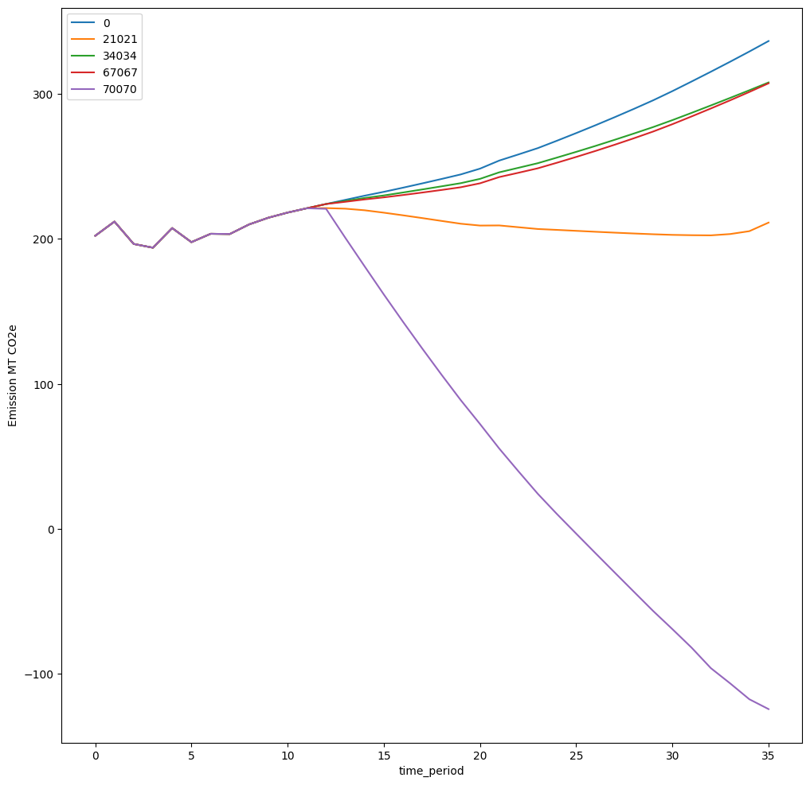
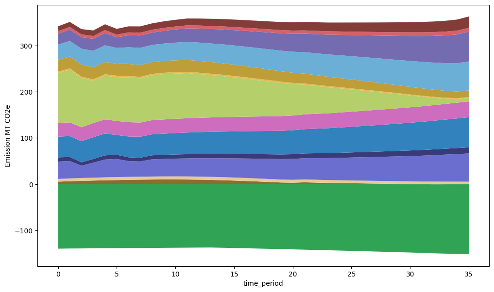
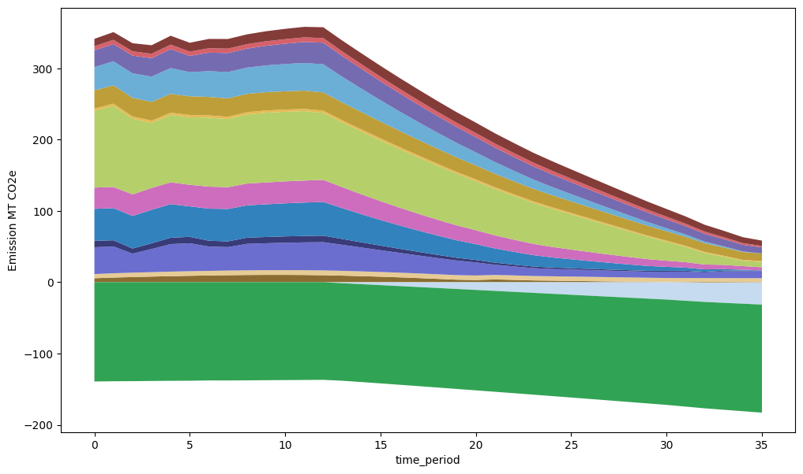
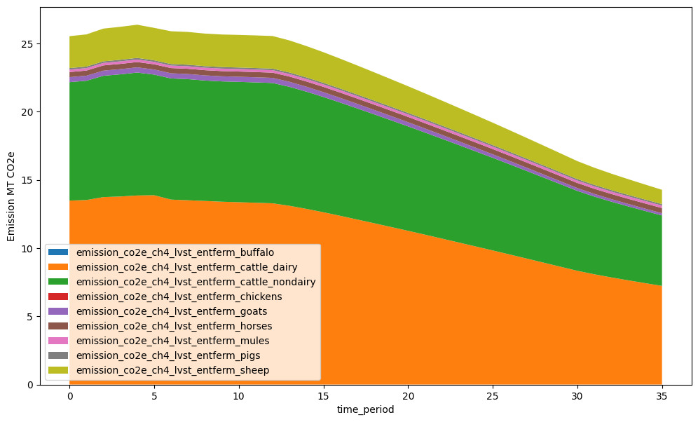
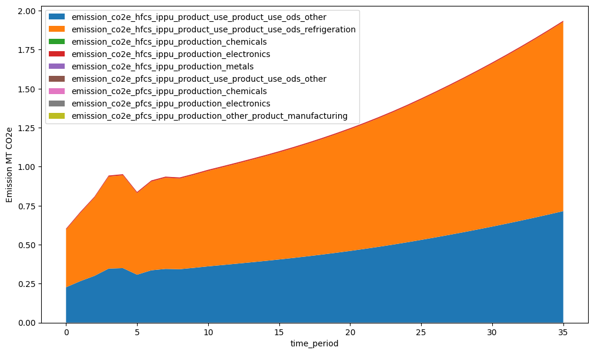
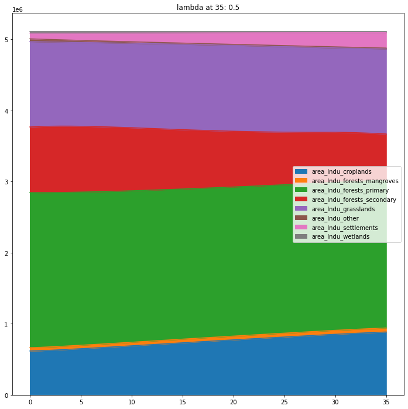
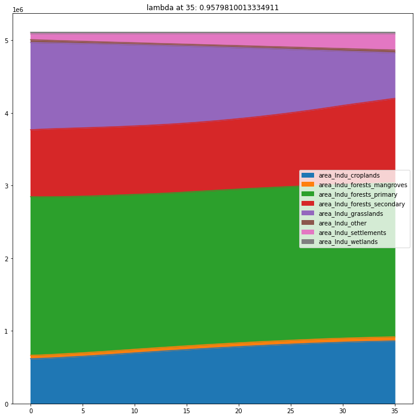

# SISEPUEDE Tutorial #4 - The `SISEPUEDE` Object

Welcome to the **SImulation of SEctoral Pathways with Uncertainty Exploration for DEcarbonization (SISEPUEDE)** tutorials! This tutorial walks users through the `SISEPUEDE` object, which is a centralized management system for models, the database, strategies, and uncertainty exploration. This notebook waslk users through:

1. Instantiating a SISEPUEDE object
2. Running scenarios and understanding dimensions of analysis (strategies, futures, design) 
4. Reading output data
5. Plotting/accessing variables


```python
import warnings
warnings.filterwarnings("ignore")

import logging
import matplotlib.pyplot as plt
import numpy as np
import os, os.path
import pandas as pd
import sisepuede as ssp
import sisepuede.manager.sisepuede_examples as sxl
import sisepuede.plotting.plots as spp
import sisepuede.transformers as trf
import sisepuede.utilities._plotting as sup
from typing import *

log = None

```

##  Initialize the SISEPUEDE class to get started running some models
- see ``?SISEPUEDE`` for more information on initialization arguments
- Once transformations are defined, it's easy to 


```python

path_strategies = # ENTER YOUR PATH HERE FOR OUTPUT STRATEGIES--SEE TUTORIAL 3 FOR MORE INFORMATION ON THIS
examples = sxl.SISEPUEDEExamples()
df_examples = examples("input_data_frame")

##  SET UP TRANSFORMATIONS/STRATEGIES
#
#  NOTE: This is an issue that's being worked out:
#        To instantiate a strategies object, need to build transformers
#        and transformations object with a dataframe. Use df_examples;
#        since we're not building tables, it won't be used, but it just
#        allows the object to instantiate.

transformers = trf.Transformers({}, df_input = df_examples,)
if not path_transformations.is_dir():
    trf.instantiate_default_strategy_directory(
        transformers,
        path_strategies,
    )
    
transformations = trf.Transformations(
    path_strategies,
    transformers = transformers,
)

strategies = trf.Strategies(
    transformations,
    export_path = "transformations",
)


# built SISEPUEDE object
sisepuede = ssp.SISEPUEDE(
    "calibrated",
    db_type = "csv", # include this if you want to save inputs
    logger = log,
    strategies = strategies,
    regions = [_REGION_NAME],
)

log = sisepuede.logger

```

    2025-08-01 14:20:32,962 - INFO - Successfully initialized SISEPUEDEFileStructure.
    2025-08-01 14:20:32,962 - INFO - Successfully initialized SISEPUEDEFileStructure.
    2025-08-01 14:20:32,962 - INFO - Successfully initialized SISEPUEDEFileStructure.
    2025-08-01 14:20:32,965 - WARNING - Missing key dict_dimensional_keys: key time_series not found. Tables that rely on the time_series will not have index checking.
    2025-08-01 14:20:32,965 - WARNING - Missing key dict_dimensional_keys: key time_series not found. Tables that rely on the time_series will not have index checking.
    2025-08-01 14:20:32,965 - WARNING - Missing key dict_dimensional_keys: key time_series not found. Tables that rely on the time_series will not have index checking.
    2025-08-01 14:20:32,966 - INFO - 	Setting export engine to 'sqlite'.
    2025-08-01 14:20:32,966 - INFO - 	Setting export engine to 'sqlite'.
    2025-08-01 14:20:32,966 - INFO - 	Setting export engine to 'sqlite'.
    2025-08-01 14:20:32,967 - WARNING - No index fields defined. Index field values will not be checked when writing to tables.
    2025-08-01 14:20:32,967 - WARNING - No index fields defined. Index field values will not be checked when writing to tables.
    2025-08-01 14:20:32,967 - WARNING - No index fields defined. Index field values will not be checked when writing to tables.
    2025-08-01 14:20:32,968 - INFO - Successfully instantiated table ANALYSIS_METADATA
    2025-08-01 14:20:32,968 - INFO - Successfully instantiated table ANALYSIS_METADATA
    2025-08-01 14:20:32,968 - INFO - Successfully instantiated table ANALYSIS_METADATA
    2025-08-01 14:20:32,969 - WARNING - No index fields found in ATTRIBUTE_DESIGN. Initializing index fields.
    2025-08-01 14:20:32,969 - WARNING - No index fields found in ATTRIBUTE_DESIGN. Initializing index fields.
    2025-08-01 14:20:32,969 - WARNING - No index fields found in ATTRIBUTE_DESIGN. Initializing index fields.
    2025-08-01 14:20:32,970 - INFO - Successfully instantiated table ATTRIBUTE_DESIGN
    2025-08-01 14:20:32,970 - INFO - Successfully instantiated table ATTRIBUTE_DESIGN
    2025-08-01 14:20:32,970 - INFO - Successfully instantiated table ATTRIBUTE_DESIGN
    2025-08-01 14:20:32,970 - WARNING - No index fields found in ATTRIBUTE_LHC_SAMPLES_EXOGENOUS_UNCERTAINTIES. Initializing index fields.
    2025-08-01 14:20:32,970 - WARNING - No index fields found in ATTRIBUTE_LHC_SAMPLES_EXOGENOUS_UNCERTAINTIES. Initializing index fields.
    2025-08-01 14:20:32,970 - WARNING - No index fields found in ATTRIBUTE_LHC_SAMPLES_EXOGENOUS_UNCERTAINTIES. Initializing index fields.
    2025-08-01 14:20:32,971 - INFO - Successfully instantiated table ATTRIBUTE_LHC_SAMPLES_EXOGENOUS_UNCERTAINTIES
    2025-08-01 14:20:32,971 - INFO - Successfully instantiated table ATTRIBUTE_LHC_SAMPLES_EXOGENOUS_UNCERTAINTIES
    2025-08-01 14:20:32,971 - INFO - Successfully instantiated table ATTRIBUTE_LHC_SAMPLES_EXOGENOUS_UNCERTAINTIES
    2025-08-01 14:20:32,972 - WARNING - No index fields found in ATTRIBUTE_LHC_SAMPLES_LEVER_EFFECTS. Initializing index fields.
    2025-08-01 14:20:32,972 - WARNING - No index fields found in ATTRIBUTE_LHC_SAMPLES_LEVER_EFFECTS. Initializing index fields.
    2025-08-01 14:20:32,972 - WARNING - No index fields found in ATTRIBUTE_LHC_SAMPLES_LEVER_EFFECTS. Initializing index fields.
    2025-08-01 14:20:32,972 - INFO - Successfully instantiated table ATTRIBUTE_LHC_SAMPLES_LEVER_EFFECTS
    2025-08-01 14:20:32,972 - INFO - Successfully instantiated table ATTRIBUTE_LHC_SAMPLES_LEVER_EFFECTS
    2025-08-01 14:20:32,972 - INFO - Successfully instantiated table ATTRIBUTE_LHC_SAMPLES_LEVER_EFFECTS
    2025-08-01 14:20:32,973 - WARNING - No index fields found in ATTRIBUTE_PRIMARY. Initializing index fields.
    2025-08-01 14:20:32,973 - WARNING - No index fields found in ATTRIBUTE_PRIMARY. Initializing index fields.
    2025-08-01 14:20:32,973 - WARNING - No index fields found in ATTRIBUTE_PRIMARY. Initializing index fields.
    2025-08-01 14:20:32,974 - INFO - Successfully instantiated table ATTRIBUTE_PRIMARY
    2025-08-01 14:20:32,974 - INFO - Successfully instantiated table ATTRIBUTE_PRIMARY
    2025-08-01 14:20:32,974 - INFO - Successfully instantiated table ATTRIBUTE_PRIMARY
    2025-08-01 14:20:32,974 - WARNING - No index fields found in ATTRIBUTE_STRATEGY. Initializing index fields.
    2025-08-01 14:20:32,974 - WARNING - No index fields found in ATTRIBUTE_STRATEGY. Initializing index fields.
    2025-08-01 14:20:32,974 - WARNING - No index fields found in ATTRIBUTE_STRATEGY. Initializing index fields.
    2025-08-01 14:20:32,975 - INFO - Successfully instantiated table ATTRIBUTE_STRATEGY
    2025-08-01 14:20:32,975 - INFO - Successfully instantiated table ATTRIBUTE_STRATEGY
    2025-08-01 14:20:32,975 - INFO - Successfully instantiated table ATTRIBUTE_STRATEGY
    2025-08-01 14:20:32,976 - WARNING - No index fields found in MODEL_BASE_INPUT_DATABASE. Initializing index fields.
    2025-08-01 14:20:32,976 - WARNING - No index fields found in MODEL_BASE_INPUT_DATABASE. Initializing index fields.
    2025-08-01 14:20:32,976 - WARNING - No index fields found in MODEL_BASE_INPUT_DATABASE. Initializing index fields.
    2025-08-01 14:20:32,976 - INFO - Successfully instantiated table MODEL_BASE_INPUT_DATABASE
    2025-08-01 14:20:32,976 - INFO - Successfully instantiated table MODEL_BASE_INPUT_DATABASE
    2025-08-01 14:20:32,976 - INFO - Successfully instantiated table MODEL_BASE_INPUT_DATABASE
    2025-08-01 14:20:32,977 - WARNING - No index fields found in MODEL_INPUT. Initializing index fields.
    2025-08-01 14:20:32,977 - WARNING - No index fields found in MODEL_INPUT. Initializing index fields.
    2025-08-01 14:20:32,977 - WARNING - No index fields found in MODEL_INPUT. Initializing index fields.
    2025-08-01 14:20:32,978 - INFO - Successfully instantiated table MODEL_INPUT
    2025-08-01 14:20:32,978 - INFO - Successfully instantiated table MODEL_INPUT
    2025-08-01 14:20:32,978 - INFO - Successfully instantiated table MODEL_INPUT
    2025-08-01 14:20:32,979 - WARNING - No index fields found in MODEL_OUTPUT. Initializing index fields.
    2025-08-01 14:20:32,979 - WARNING - No index fields found in MODEL_OUTPUT. Initializing index fields.
    2025-08-01 14:20:32,979 - WARNING - No index fields found in MODEL_OUTPUT. Initializing index fields.
    2025-08-01 14:20:32,979 - INFO - Successfully instantiated table MODEL_OUTPUT
    2025-08-01 14:20:32,979 - INFO - Successfully instantiated table MODEL_OUTPUT
    2025-08-01 14:20:32,979 - INFO - Successfully instantiated table MODEL_OUTPUT
    2025-08-01 14:20:32,980 - INFO - SISEPUEDEOutputDatabase successfully initialized IterativeDatabase.
    2025-08-01 14:20:32,980 - INFO - SISEPUEDEOutputDatabase successfully initialized IterativeDatabase.
    2025-08-01 14:20:32,980 - INFO - SISEPUEDEOutputDatabase successfully initialized IterativeDatabase.
    2025-08-01 14:20:32,980 - INFO - Successfully initialized database with:
    	type:	sqlite
    	analysis id:	sisepuede_run_2025-08-01T14:20:32.610843
    	fp_base_output:	/Users/usuario/git/sisepuede/sisepuede/out/sisepuede_run_2025-08-01T14;20;32.610843/sisepuede_run_2025-08-01T14;20;32.610843_output_database
    2025-08-01 14:20:32,980 - INFO - Successfully initialized database with:
    	type:	sqlite
    	analysis id:	sisepuede_run_2025-08-01T14:20:32.610843
    	fp_base_output:	/Users/usuario/git/sisepuede/sisepuede/out/sisepuede_run_2025-08-01T14;20;32.610843/sisepuede_run_2025-08-01T14;20;32.610843_output_database
    2025-08-01 14:20:32,980 - INFO - Successfully initialized database with:
    	type:	sqlite
    	analysis id:	sisepuede_run_2025-08-01T14:20:32.610843
    	fp_base_output:	/Users/usuario/git/sisepuede/sisepuede/out/sisepuede_run_2025-08-01T14;20;32.610843/sisepuede_run_2025-08-01T14;20;32.610843_output_database
    2025-08-01 14:20:32,981 - INFO - Running SISEPUEDE under template data mode 'calibrated'.
    2025-08-01 14:20:32,981 - INFO - Running SISEPUEDE under template data mode 'calibrated'.
    2025-08-01 14:20:32,981 - INFO - Running SISEPUEDE under template data mode 'calibrated'.
    2025-08-01 14:20:32,982 - INFO - Initializing BaseInputDatabase
    2025-08-01 14:20:32,982 - INFO - Initializing BaseInputDatabase
    2025-08-01 14:20:32,982 - INFO - Initializing BaseInputDatabase


    yay


    2025-08-01 14:20:33,646 - INFO - Initializing FutureTrajectories
    2025-08-01 14:20:33,646 - INFO - Initializing FutureTrajectories
    2025-08-01 14:20:33,646 - INFO - Initializing FutureTrajectories
    2025-08-01 14:20:36,018 - INFO - Instantiating 1738 sampling units.
    2025-08-01 14:20:36,018 - INFO - Instantiating 1738 sampling units.
    2025-08-01 14:20:36,018 - INFO - Instantiating 1738 sampling units.
    2025-08-01 14:20:36,029 - INFO - Iteration 0 complete.
    2025-08-01 14:20:36,029 - INFO - Iteration 0 complete.
    2025-08-01 14:20:36,029 - INFO - Iteration 0 complete.
    2025-08-01 14:20:38,538 - INFO - Iteration 250 complete.
    2025-08-01 14:20:38,538 - INFO - Iteration 250 complete.
    2025-08-01 14:20:38,538 - INFO - Iteration 250 complete.
    2025-08-01 14:20:40,274 - INFO - Iteration 500 complete.
    2025-08-01 14:20:40,274 - INFO - Iteration 500 complete.
    2025-08-01 14:20:40,274 - INFO - Iteration 500 complete.
    2025-08-01 14:20:42,010 - INFO - Iteration 750 complete.
    2025-08-01 14:20:42,010 - INFO - Iteration 750 complete.
    2025-08-01 14:20:42,010 - INFO - Iteration 750 complete.
    2025-08-01 14:20:44,112 - INFO - Iteration 1000 complete.
    2025-08-01 14:20:44,112 - INFO - Iteration 1000 complete.
    2025-08-01 14:20:44,112 - INFO - Iteration 1000 complete.
    2025-08-01 14:20:45,876 - INFO - Iteration 1250 complete.
    2025-08-01 14:20:45,876 - INFO - Iteration 1250 complete.
    2025-08-01 14:20:45,876 - INFO - Iteration 1250 complete.
    2025-08-01 14:20:47,620 - INFO - Iteration 1500 complete.
    2025-08-01 14:20:47,620 - INFO - Iteration 1500 complete.
    2025-08-01 14:20:47,620 - INFO - Iteration 1500 complete.
    2025-08-01 14:20:49,223 - INFO - 	1738 sampling units complete in 13.2 seconds.
    2025-08-01 14:20:49,223 - INFO - 	1738 sampling units complete in 13.2 seconds.
    2025-08-01 14:20:49,223 - INFO - 	1738 sampling units complete in 13.2 seconds.
    2025-08-01 14:20:49,229 - INFO - 	FutureTrajectories for 'peru' complete.
    2025-08-01 14:20:49,229 - INFO - 	FutureTrajectories for 'peru' complete.
    2025-08-01 14:20:49,229 - INFO - 	FutureTrajectories for 'peru' complete.
    2025-08-01 14:20:49,230 - INFO - Initializing LHSDesign
    2025-08-01 14:20:49,230 - INFO - Initializing LHSDesign
    2025-08-01 14:20:49,230 - INFO - Initializing LHSDesign
    2025-08-01 14:20:49,231 - INFO - LHSDesign.fields_factors_l reset successful.
    2025-08-01 14:20:49,231 - INFO - LHSDesign.fields_factors_l reset successful.
    2025-08-01 14:20:49,231 - INFO - LHSDesign.fields_factors_l reset successful.
    2025-08-01 14:20:49,232 - INFO - LHSDesign.fields_factors_x reset successful.
    2025-08-01 14:20:49,232 - INFO - LHSDesign.fields_factors_x reset successful.
    2025-08-01 14:20:49,232 - INFO - LHSDesign.fields_factors_x reset successful.
    2025-08-01 14:20:49,262 - INFO - 	LHSDesign for region 'peru' complete.
    2025-08-01 14:20:49,262 - INFO - 	LHSDesign for region 'peru' complete.
    2025-08-01 14:20:49,262 - INFO - 	LHSDesign for region 'peru' complete.
    2025-08-01 14:20:49,263 - INFO - Generating primary keys (values of primary_id)...
    2025-08-01 14:20:49,263 - INFO - Generating primary keys (values of primary_id)...
    2025-08-01 14:20:49,263 - INFO - Generating primary keys (values of primary_id)...
    2025-08-01 14:20:49,263 - INFO - Successfully initialized SISEPUEDEExperimentalManager.
    2025-08-01 14:20:49,263 - INFO - Successfully initialized SISEPUEDEExperimentalManager.
    2025-08-01 14:20:49,263 - INFO - Successfully initialized SISEPUEDEExperimentalManager.
    2025-08-01 14:20:49,264 - INFO - Successfully initialized NemoMod temporary database path as /Users/usuario/git/sisepuede/sisepuede/tmp/nemomod_intermediate_database.sqlite.
    2025-08-01 14:20:49,264 - INFO - Successfully initialized NemoMod temporary database path as /Users/usuario/git/sisepuede/sisepuede/tmp/nemomod_intermediate_database.sqlite.
    2025-08-01 14:20:49,264 - INFO - Successfully initialized NemoMod temporary database path as /Users/usuario/git/sisepuede/sisepuede/tmp/nemomod_intermediate_database.sqlite.
    2025-08-01 14:20:49,265 - INFO - Set Julia directory for modules and environment to '/Users/usuario/git/sisepuede/sisepuede/julia'.
    2025-08-01 14:20:49,265 - INFO - Set Julia directory for modules and environment to '/Users/usuario/git/sisepuede/sisepuede/julia'.
    2025-08-01 14:20:49,265 - INFO - Set Julia directory for modules and environment to '/Users/usuario/git/sisepuede/sisepuede/julia'.
    2025-08-01 14:20:49,327 - INFO - Successfully read NemoMod input table data from /Users/usuario/git/sisepuede/sisepuede/ref/nemo_mod/AvailabilityFactor.csv
    2025-08-01 14:20:49,327 - INFO - Successfully read NemoMod input table data from /Users/usuario/git/sisepuede/sisepuede/ref/nemo_mod/AvailabilityFactor.csv
    2025-08-01 14:20:49,327 - INFO - Successfully read NemoMod input table data from /Users/usuario/git/sisepuede/sisepuede/ref/nemo_mod/AvailabilityFactor.csv
    2025-08-01 14:20:49,330 - INFO - Successfully read NemoMod input table data from /Users/usuario/git/sisepuede/sisepuede/ref/nemo_mod/SpecifiedDemandProfile.csv
    2025-08-01 14:20:49,330 - INFO - Successfully read NemoMod input table data from /Users/usuario/git/sisepuede/sisepuede/ref/nemo_mod/SpecifiedDemandProfile.csv
    2025-08-01 14:20:49,330 - INFO - Successfully read NemoMod input table data from /Users/usuario/git/sisepuede/sisepuede/ref/nemo_mod/SpecifiedDemandProfile.csv
    2025-08-01 14:20:49,390 - INFO - Importing Julia...
    2025-08-01 14:20:49,390 - INFO - Importing Julia...
    2025-08-01 14:20:49,390 - INFO - Importing Julia...
    WARNING: replacing module SISEPUEDEPJSF.
    2025-08-01 14:20:49,430 - INFO - Successfully initialized JuMP optimizer from solver module HiGHS.
    2025-08-01 14:20:49,430 - INFO - Successfully initialized JuMP optimizer from solver module HiGHS.
    2025-08-01 14:20:49,430 - INFO - Successfully initialized JuMP optimizer from solver module HiGHS.
    2025-08-01 14:20:49,445 - INFO - Successfully initialized SISEPUEDEModels.
    2025-08-01 14:20:49,445 - INFO - Successfully initialized SISEPUEDEModels.
    2025-08-01 14:20:49,445 - INFO - Successfully initialized SISEPUEDEModels.
    2025-08-01 14:20:49,455 - INFO - Table ANALYSIS_METADATA successfully written to database.
    2025-08-01 14:20:49,455 - INFO - Table ANALYSIS_METADATA successfully written to database.
    2025-08-01 14:20:49,455 - INFO - Table ANALYSIS_METADATA successfully written to database.
    2025-08-01 14:20:49,460 - INFO - Table ATTRIBUTE_DESIGN successfully written to database.
    2025-08-01 14:20:49,460 - INFO - Table ATTRIBUTE_DESIGN successfully written to database.
    2025-08-01 14:20:49,460 - INFO - Table ATTRIBUTE_DESIGN successfully written to database.
    2025-08-01 14:20:49,465 - INFO - Table ATTRIBUTE_STRATEGY successfully written to database.
    2025-08-01 14:20:49,465 - INFO - Table ATTRIBUTE_STRATEGY successfully written to database.
    2025-08-01 14:20:49,465 - INFO - Table ATTRIBUTE_STRATEGY successfully written to database.
    2025-08-01 14:20:49,598 - INFO - Table MODEL_BASE_INPUT_DATABASE successfully written to database.
    2025-08-01 14:20:49,598 - INFO - Table MODEL_BASE_INPUT_DATABASE successfully written to database.
    2025-08-01 14:20:49,598 - INFO - Table MODEL_BASE_INPUT_DATABASE successfully written to database.


```python

```

###  Call the .project_scenarios() method (or simply call the SISEPUEDE object) to write outputs directly to a database (prevents significant memory usage)
- This method returns a list of primary keys that were successfully run
- The first positional argument, ``primary_keys``, can be a list of primary keys *or* a dictionary of scenario dimensions
    - e.g., ``sisepuede.project_scenarios([0, 5, 1989])`` uses 3 primary keys
    - ``sisepuede.project_scenarios({"strategy_id": [0], "future_id": [0, 9, 903]})`` specifies a scenario dimensional subset of primary keys
- see ``?sisepuede.project_scenarios`` for more information on inputs


```python
sisepuede.model_attributes.get_dimensional_attribute_table(
    sisepuede.key_strategy,
)
```


<div>
<style scoped>
    .dataframe tbody tr th:only-of-type {
        vertical-align: middle;
    }

    .dataframe tbody tr th {
        vertical-align: top;
    }

    .dataframe thead th {
        text-align: right;
    }
</style>
<table border="1" class="dataframe">
  <thead>
    <tr style="text-align: right;">
      <th></th>
      <th>strategy_id</th>
      <th>strategy_code</th>
      <th>strategy</th>
      <th>description</th>
      <th>transformation_specification</th>
      <th>baseline_strategy_id</th>
    </tr>
  </thead>
  <tbody>
    <tr>
      <th>0</th>
      <td>0</td>
      <td>BASE</td>
      <td>Strategy TX:BASE</td>
      <td>NaN</td>
      <td>TX:BASE</td>
      <td>1</td>
    </tr>
    <tr>
      <th>1</th>
      <td>1000</td>
      <td>AGRC:DEC_CH4_RICE</td>
      <td>Singleton - Default Value - AGRC: Improve rice...</td>
      <td>NaN</td>
      <td>TX:AGRC:DEC_CH4_RICE</td>
      <td>0</td>
    </tr>
    <tr>
      <th>2</th>
      <td>1001</td>
      <td>AGRC:DEC_EXPORTS</td>
      <td>Singleton - Default Value - AGRC: Decrease Exp...</td>
      <td>NaN</td>
      <td>TX:AGRC:DEC_EXPORTS</td>
      <td>0</td>
    </tr>
    <tr>
      <th>3</th>
      <td>1002</td>
      <td>AGRC:DEC_LOSSES_SUPPLY_CHAIN</td>
      <td>Singleton - Default Value - AGRC: Reduce suppl...</td>
      <td>NaN</td>
      <td>TX:AGRC:DEC_LOSSES_SUPPLY_CHAIN</td>
      <td>0</td>
    </tr>
    <tr>
      <th>4</th>
      <td>1003</td>
      <td>AGRC:INC_CONSERVATION_AGRICULTURE</td>
      <td>Singleton - Default Value - AGRC: Expand conse...</td>
      <td>NaN</td>
      <td>TX:AGRC:INC_CONSERVATION_AGRICULTURE</td>
      <td>0</td>
    </tr>
    <tr>
      <th>...</th>
      <td>...</td>
      <td>...</td>
      <td>...</td>
      <td>...</td>
      <td>...</td>
      <td>...</td>
    </tr>
    <tr>
      <th>66</th>
      <td>4005</td>
      <td>IPPU:DEC_PFCS</td>
      <td>Singleton - Default Value - IPPU: Reduce use o...</td>
      <td>NaN</td>
      <td>TX:IPPU:DEC_PFCS</td>
      <td>0</td>
    </tr>
    <tr>
      <th>67</th>
      <td>4006</td>
      <td>IP:ALL</td>
      <td>Sectoral Composite - IPPU</td>
      <td>All (unique by transformer) IPPU transformations</td>
      <td>TX:IPPU:DEC_CLINKER|TX:IPPU:DEC_DEMAND|TX:IPPU...</td>
      <td>0</td>
    </tr>
    <tr>
      <th>68</th>
      <td>6000</td>
      <td>PFLO:INC_HEALTHIER_DIETS</td>
      <td>Singleton - Default Value - PFLO: Change diets</td>
      <td>NaN</td>
      <td>TX:PFLO:INC_HEALTHIER_DIETS</td>
      <td>0</td>
    </tr>
    <tr>
      <th>69</th>
      <td>6001</td>
      <td>PFLO:INC_IND_CCS</td>
      <td>Singleton - Default Value - PFLO: Industrial c...</td>
      <td>NaN</td>
      <td>TX:PFLO:INC_IND_CCS</td>
      <td>0</td>
    </tr>
    <tr>
      <th>70</th>
      <td>6002</td>
      <td>PFLO:ALL</td>
      <td>All Actions</td>
      <td>All actions (unique by transformer)</td>
      <td>TX:SOIL:DEC_N_APPLIED|TX:AGRC:DEC_LOSSES_SUPPL...</td>
      <td>0</td>
    </tr>
  </tbody>
</table>
<p>71 rows × 6 columns</p>
</div>


```python
sisepuede.model_attributes.get_dimensional_attribute_table(
    sisepuede.key_design,
)
```


<div>
<style scoped>
    .dataframe tbody tr th:only-of-type {
        vertical-align: middle;
    }

    .dataframe tbody tr th {
        vertical-align: top;
    }

    .dataframe thead th {
        text-align: right;
    }
</style>
<table border="1" class="dataframe">
  <thead>
    <tr style="text-align: right;">
      <th></th>
      <th>design_id</th>
      <th>vary_l</th>
      <th>vary_x</th>
      <th>linear_transform_l_m</th>
      <th>linear_transform_l_b</th>
      <th>linear_transform_l_inf</th>
      <th>linear_transform_l_sup</th>
      <th>design_name</th>
      <th>include</th>
    </tr>
  </thead>
  <tbody>
    <tr>
      <th>0</th>
      <td>0</td>
      <td>0</td>
      <td>1</td>
      <td>1.00</td>
      <td>0.00</td>
      <td>1.00</td>
      <td>1</td>
      <td>Vary Xs (design 0)</td>
      <td>1</td>
    </tr>
    <tr>
      <th>1</th>
      <td>1</td>
      <td>1</td>
      <td>1</td>
      <td>0.75</td>
      <td>0.25</td>
      <td>0.25</td>
      <td>1</td>
      <td>Vary Xs and Les; Cap LE at 1 (design 1)</td>
      <td>1</td>
    </tr>
    <tr>
      <th>2</th>
      <td>2</td>
      <td>1</td>
      <td>1</td>
      <td>1.25</td>
      <td>0.00</td>
      <td>0.25</td>
      <td>1</td>
      <td>Vary Xs and LEs; Cap LE at 1.1 (design 2, 20% ...</td>
      <td>1</td>
    </tr>
    <tr>
      <th>3</th>
      <td>3</td>
      <td>1</td>
      <td>0</td>
      <td>0.90</td>
      <td>0.10</td>
      <td>0.10</td>
      <td>1</td>
      <td>Vary LEs; (design 3)</td>
      <td>1</td>
    </tr>
  </tbody>
</table>
</div>


```python
# ?sisepuede.project_scenarios
```


```python
# project across 2 futures for 1 design and, notably, *all* strategies (no filtering)
dict_filt = {
    "future_id": [0],
    "design_id": [0],
    "strategy_id": [1020, 2012, 3025, 4006, 5009, 6002] # note that 5009 does not exist in the attribute table. 
}

primary_keys_out = sisepuede(
    dict_filt,
    chunk_size = 2 # how often do we write to the output database
)
```

    2025-08-01 14:23:48,744 - INFO - 
    ***	STARTING REGION peru	***
    
    2025-08-01 14:23:48,744 - INFO - 
    ***	STARTING REGION peru	***
    
    2025-08-01 14:23:48,744 - INFO - 
    ***	STARTING REGION peru	***
    
    2025-08-01 14:23:50,167 - INFO - Trying run primary_id = 21021 in region peru
    2025-08-01 14:23:50,167 - INFO - Trying run primary_id = 21021 in region peru
    2025-08-01 14:23:50,167 - INFO - Trying run primary_id = 21021 in region peru
    2025-08-01 14:23:50,168 - INFO - Running AFOLU model
    2025-08-01 14:23:50,168 - INFO - Running AFOLU model
    2025-08-01 14:23:50,168 - INFO - Running AFOLU model
    2025-08-01 14:23:50,422 - INFO - AFOLU model run successfully completed
    2025-08-01 14:23:50,422 - INFO - AFOLU model run successfully completed
    2025-08-01 14:23:50,422 - INFO - AFOLU model run successfully completed
    2025-08-01 14:23:50,424 - INFO - Running CircularEconomy model
    2025-08-01 14:23:50,424 - INFO - Running CircularEconomy model
    2025-08-01 14:23:50,424 - INFO - Running CircularEconomy model
    2025-08-01 14:23:50,451 - INFO - CircularEconomy model run successfully completed
    2025-08-01 14:23:50,451 - INFO - CircularEconomy model run successfully completed
    2025-08-01 14:23:50,451 - INFO - CircularEconomy model run successfully completed
    2025-08-01 14:23:50,452 - INFO - Running IPPU model
    2025-08-01 14:23:50,452 - INFO - Running IPPU model
    2025-08-01 14:23:50,452 - INFO - Running IPPU model
    2025-08-01 14:23:50,499 - INFO - IPPU model run successfully completed
    2025-08-01 14:23:50,499 - INFO - IPPU model run successfully completed
    2025-08-01 14:23:50,499 - INFO - IPPU model run successfully completed
    2025-08-01 14:23:50,500 - INFO - Running Energy model (EnergyConsumption without Fugitive Emissions)
    2025-08-01 14:23:50,500 - INFO - Running Energy model (EnergyConsumption without Fugitive Emissions)
    2025-08-01 14:23:50,500 - INFO - Running Energy model (EnergyConsumption without Fugitive Emissions)
    2025-08-01 14:23:50,512 - DEBUG - Missing elasticity information found in 'project_energy_consumption_by_fuel_from_effvars': using specified future demands.
    2025-08-01 14:23:50,512 - DEBUG - Missing elasticity information found in 'project_energy_consumption_by_fuel_from_effvars': using specified future demands.
    2025-08-01 14:23:50,512 - DEBUG - Missing elasticity information found in 'project_energy_consumption_by_fuel_from_effvars': using specified future demands.
    2025-08-01 14:23:50,566 - INFO - EnergyConsumption without Fugitive Emissions model run successfully completed
    2025-08-01 14:23:50,566 - INFO - EnergyConsumption without Fugitive Emissions model run successfully completed
    2025-08-01 14:23:50,566 - INFO - EnergyConsumption without Fugitive Emissions model run successfully completed
    2025-08-01 14:23:50,567 - INFO - Running Energy model (Electricity and Fuel Production: trying to call Julia)
    2025-08-01 14:23:50,567 - INFO - Running Energy model (Electricity and Fuel Production: trying to call Julia)
    2025-08-01 14:23:50,567 - INFO - Running Energy model (Electricity and Fuel Production: trying to call Julia)
    2025-08-01 14:23:50,593 - INFO - 	Path to temporary NemoMod database '/Users/usuario/git/sisepuede/sisepuede/tmp/nemomod_intermediate_database.sqlite' not found. Creating...
    2025-08-01 14:23:50,593 - INFO - 	Path to temporary NemoMod database '/Users/usuario/git/sisepuede/sisepuede/tmp/nemomod_intermediate_database.sqlite' not found. Creating...
    2025-08-01 14:23:50,593 - INFO - 	Path to temporary NemoMod database '/Users/usuario/git/sisepuede/sisepuede/tmp/nemomod_intermediate_database.sqlite' not found. Creating...


    2025-01-Aug 14:23:50.597 Opened SQLite database at /Users/usuario/git/sisepuede/sisepuede/tmp/nemomod_intermediate_database.sqlite.
    2025-01-Aug 14:23:50.605 Added NEMO structure to SQLite database at /Users/usuario/git/sisepuede/sisepuede/tmp/nemomod_intermediate_database.sqlite.
    2025-01-Aug 14:23:51.228 Started modeling scenario. NEMO version = 2.0.0, solver = HiGHS.


    ┌ Warning: Model period emission limits (ModelPeriodEmissionLimit parameter) are not enforced when modeling selected years.
    └ @ NemoMod ~/.julia/packages/NemoMod/p49Bn/src/scenario_calculation.jl:6112
    2025-08-01 14:24:17,805 - INFO - NemoMod ran successfully with the following status: OPTIMAL
    2025-08-01 14:24:17,805 - INFO - NemoMod ran successfully with the following status: OPTIMAL
    2025-08-01 14:24:17,805 - INFO - NemoMod ran successfully with the following status: OPTIMAL
    2025-08-01 14:24:17,813 - INFO - EnergyProduction model run successfully completed
    2025-08-01 14:24:17,813 - INFO - EnergyProduction model run successfully completed
    2025-08-01 14:24:17,813 - INFO - EnergyProduction model run successfully completed
    2025-08-01 14:24:17,813 - INFO - Running Energy (Fugitive Emissions)
    2025-08-01 14:24:17,813 - INFO - Running Energy (Fugitive Emissions)
    2025-08-01 14:24:17,813 - INFO - Running Energy (Fugitive Emissions)
    2025-08-01 14:24:17,837 - INFO - Fugitive Emissions from Energy model run successfully completed
    2025-08-01 14:24:17,837 - INFO - Fugitive Emissions from Energy model run successfully completed
    2025-08-01 14:24:17,837 - INFO - Fugitive Emissions from Energy model run successfully completed
    2025-08-01 14:24:17,837 - INFO - Appending Socioeconomic outputs
    2025-08-01 14:24:17,837 - INFO - Appending Socioeconomic outputs
    2025-08-01 14:24:17,837 - INFO - Appending Socioeconomic outputs
    2025-08-01 14:24:17,844 - INFO - Socioeconomic outputs successfully appended.
    2025-08-01 14:24:17,844 - INFO - Socioeconomic outputs successfully appended.
    2025-08-01 14:24:17,844 - INFO - Socioeconomic outputs successfully appended.
    2025-08-01 14:24:17,847 - INFO - Model run for primary_id = 21021 successfully completed in 27.68 seconds (n_tries = 1).
    2025-08-01 14:24:17,847 - INFO - Model run for primary_id = 21021 successfully completed in 27.68 seconds (n_tries = 1).
    2025-08-01 14:24:17,847 - INFO - Model run for primary_id = 21021 successfully completed in 27.68 seconds (n_tries = 1).
    2025-08-01 14:24:17,865 - INFO - Trying run primary_id = 34034 in region peru
    2025-08-01 14:24:17,865 - INFO - Trying run primary_id = 34034 in region peru
    2025-08-01 14:24:17,865 - INFO - Trying run primary_id = 34034 in region peru
    2025-08-01 14:24:17,866 - INFO - Running AFOLU model
    2025-08-01 14:24:17,866 - INFO - Running AFOLU model
    2025-08-01 14:24:17,866 - INFO - Running AFOLU model


    2025-01-Aug 14:24:17.708 Finished modeling scenario.


    2025-08-01 14:24:18,109 - INFO - AFOLU model run successfully completed
    2025-08-01 14:24:18,109 - INFO - AFOLU model run successfully completed
    2025-08-01 14:24:18,109 - INFO - AFOLU model run successfully completed
    2025-08-01 14:24:18,110 - INFO - Running CircularEconomy model
    2025-08-01 14:24:18,110 - INFO - Running CircularEconomy model
    2025-08-01 14:24:18,110 - INFO - Running CircularEconomy model
    2025-08-01 14:24:18,140 - INFO - CircularEconomy model run successfully completed
    2025-08-01 14:24:18,140 - INFO - CircularEconomy model run successfully completed
    2025-08-01 14:24:18,140 - INFO - CircularEconomy model run successfully completed
    2025-08-01 14:24:18,140 - INFO - Running IPPU model
    2025-08-01 14:24:18,140 - INFO - Running IPPU model
    2025-08-01 14:24:18,140 - INFO - Running IPPU model
    2025-08-01 14:24:18,186 - INFO - IPPU model run successfully completed
    2025-08-01 14:24:18,186 - INFO - IPPU model run successfully completed
    2025-08-01 14:24:18,186 - INFO - IPPU model run successfully completed
    2025-08-01 14:24:18,186 - INFO - Running Energy model (EnergyConsumption without Fugitive Emissions)
    2025-08-01 14:24:18,186 - INFO - Running Energy model (EnergyConsumption without Fugitive Emissions)
    2025-08-01 14:24:18,186 - INFO - Running Energy model (EnergyConsumption without Fugitive Emissions)
    2025-08-01 14:24:18,199 - DEBUG - Missing elasticity information found in 'project_energy_consumption_by_fuel_from_effvars': using specified future demands.
    2025-08-01 14:24:18,199 - DEBUG - Missing elasticity information found in 'project_energy_consumption_by_fuel_from_effvars': using specified future demands.
    2025-08-01 14:24:18,199 - DEBUG - Missing elasticity information found in 'project_energy_consumption_by_fuel_from_effvars': using specified future demands.
    2025-08-01 14:24:18,254 - INFO - EnergyConsumption without Fugitive Emissions model run successfully completed
    2025-08-01 14:24:18,254 - INFO - EnergyConsumption without Fugitive Emissions model run successfully completed
    2025-08-01 14:24:18,254 - INFO - EnergyConsumption without Fugitive Emissions model run successfully completed
    2025-08-01 14:24:18,254 - INFO - Running Energy model (Electricity and Fuel Production: trying to call Julia)
    2025-08-01 14:24:18,254 - INFO - Running Energy model (Electricity and Fuel Production: trying to call Julia)
    2025-08-01 14:24:18,254 - INFO - Running Energy model (Electricity and Fuel Production: trying to call Julia)


    2025-01-Aug 14:24:19.318 Started modeling scenario. NEMO version = 2.0.0, solver = HiGHS.


    ┌ Warning: Model period emission limits (ModelPeriodEmissionLimit parameter) are not enforced when modeling selected years.
    └ @ NemoMod ~/.julia/packages/NemoMod/p49Bn/src/scenario_calculation.jl:6112
    2025-08-01 14:24:45,487 - INFO - NemoMod ran successfully with the following status: OPTIMAL
    2025-08-01 14:24:45,487 - INFO - NemoMod ran successfully with the following status: OPTIMAL
    2025-08-01 14:24:45,487 - INFO - NemoMod ran successfully with the following status: OPTIMAL
    2025-08-01 14:24:45,498 - INFO - EnergyProduction model run successfully completed
    2025-08-01 14:24:45,498 - INFO - EnergyProduction model run successfully completed
    2025-08-01 14:24:45,498 - INFO - EnergyProduction model run successfully completed
    2025-08-01 14:24:45,499 - INFO - Running Energy (Fugitive Emissions)
    2025-08-01 14:24:45,499 - INFO - Running Energy (Fugitive Emissions)
    2025-08-01 14:24:45,499 - INFO - Running Energy (Fugitive Emissions)
    2025-08-01 14:24:45,524 - INFO - Fugitive Emissions from Energy model run successfully completed
    2025-08-01 14:24:45,524 - INFO - Fugitive Emissions from Energy model run successfully completed
    2025-08-01 14:24:45,524 - INFO - Fugitive Emissions from Energy model run successfully completed
    2025-08-01 14:24:45,525 - INFO - Appending Socioeconomic outputs
    2025-08-01 14:24:45,525 - INFO - Appending Socioeconomic outputs
    2025-08-01 14:24:45,525 - INFO - Appending Socioeconomic outputs
    2025-08-01 14:24:45,531 - INFO - Socioeconomic outputs successfully appended.
    2025-08-01 14:24:45,531 - INFO - Socioeconomic outputs successfully appended.
    2025-08-01 14:24:45,531 - INFO - Socioeconomic outputs successfully appended.
    2025-08-01 14:24:45,534 - INFO - Model run for primary_id = 34034 successfully completed in 27.67 seconds (n_tries = 1).
    2025-08-01 14:24:45,534 - INFO - Model run for primary_id = 34034 successfully completed in 27.67 seconds (n_tries = 1).
    2025-08-01 14:24:45,534 - INFO - Model run for primary_id = 34034 successfully completed in 27.67 seconds (n_tries = 1).


    2025-01-Aug 14:24:45.385 Finished modeling scenario.


    2025-08-01 14:24:45,695 - INFO - Table MODEL_OUTPUT successfully written to database.
    2025-08-01 14:24:45,695 - INFO - Table MODEL_OUTPUT successfully written to database.
    2025-08-01 14:24:45,695 - INFO - Table MODEL_OUTPUT successfully written to database.
    2025-08-01 14:24:45,701 - INFO - Trying run primary_id = 60060 in region peru
    2025-08-01 14:24:45,701 - INFO - Trying run primary_id = 60060 in region peru
    2025-08-01 14:24:45,701 - INFO - Trying run primary_id = 60060 in region peru
    2025-08-01 14:24:45,702 - INFO - Running AFOLU model
    2025-08-01 14:24:45,702 - INFO - Running AFOLU model
    2025-08-01 14:24:45,702 - INFO - Running AFOLU model
    2025-08-01 14:24:45,942 - INFO - AFOLU model run successfully completed
    2025-08-01 14:24:45,942 - INFO - AFOLU model run successfully completed
    2025-08-01 14:24:45,942 - INFO - AFOLU model run successfully completed
    2025-08-01 14:24:45,942 - INFO - Running CircularEconomy model
    2025-08-01 14:24:45,942 - INFO - Running CircularEconomy model
    2025-08-01 14:24:45,942 - INFO - Running CircularEconomy model
    2025-08-01 14:24:45,970 - INFO - CircularEconomy model run successfully completed
    2025-08-01 14:24:45,970 - INFO - CircularEconomy model run successfully completed
    2025-08-01 14:24:45,970 - INFO - CircularEconomy model run successfully completed
    2025-08-01 14:24:45,971 - INFO - Running IPPU model
    2025-08-01 14:24:45,971 - INFO - Running IPPU model
    2025-08-01 14:24:45,971 - INFO - Running IPPU model
    2025-08-01 14:24:46,017 - INFO - IPPU model run successfully completed
    2025-08-01 14:24:46,017 - INFO - IPPU model run successfully completed
    2025-08-01 14:24:46,017 - INFO - IPPU model run successfully completed
    2025-08-01 14:24:46,018 - INFO - Running Energy model (EnergyConsumption without Fugitive Emissions)
    2025-08-01 14:24:46,018 - INFO - Running Energy model (EnergyConsumption without Fugitive Emissions)
    2025-08-01 14:24:46,018 - INFO - Running Energy model (EnergyConsumption without Fugitive Emissions)
    2025-08-01 14:24:46,029 - DEBUG - Missing elasticity information found in 'project_energy_consumption_by_fuel_from_effvars': using specified future demands.
    2025-08-01 14:24:46,029 - DEBUG - Missing elasticity information found in 'project_energy_consumption_by_fuel_from_effvars': using specified future demands.
    2025-08-01 14:24:46,029 - DEBUG - Missing elasticity information found in 'project_energy_consumption_by_fuel_from_effvars': using specified future demands.
    2025-08-01 14:24:46,083 - INFO - EnergyConsumption without Fugitive Emissions model run successfully completed
    2025-08-01 14:24:46,083 - INFO - EnergyConsumption without Fugitive Emissions model run successfully completed
    2025-08-01 14:24:46,083 - INFO - EnergyConsumption without Fugitive Emissions model run successfully completed
    2025-08-01 14:24:46,084 - INFO - Running Energy model (Electricity and Fuel Production: trying to call Julia)
    2025-08-01 14:24:46,084 - INFO - Running Energy model (Electricity and Fuel Production: trying to call Julia)
    2025-08-01 14:24:46,084 - INFO - Running Energy model (Electricity and Fuel Production: trying to call Julia)


    2025-01-Aug 14:24:46.752 Started modeling scenario. NEMO version = 2.0.0, solver = HiGHS.


    ┌ Warning: Model period emission limits (ModelPeriodEmissionLimit parameter) are not enforced when modeling selected years.
    └ @ NemoMod ~/.julia/packages/NemoMod/p49Bn/src/scenario_calculation.jl:6112
    2025-08-01 14:39:57,751 - INFO - NemoMod run failed with result INFEASIBLE. Populating missing data with value 0.0.
    2025-08-01 14:39:57,751 - INFO - NemoMod run failed with result INFEASIBLE. Populating missing data with value 0.0.
    2025-08-01 14:39:57,751 - INFO - NemoMod run failed with result INFEASIBLE. Populating missing data with value 0.0.
    2025-08-01 14:39:57,754 - INFO - Unable to retrieve energy demand by fuel in ENTC. Skipping adding unused fuel...
    2025-08-01 14:39:57,754 - INFO - Unable to retrieve energy demand by fuel in ENTC. Skipping adding unused fuel...
    2025-08-01 14:39:57,754 - INFO - Unable to retrieve energy demand by fuel in ENTC. Skipping adding unused fuel...
    2025-08-01 14:39:57,777 - INFO - EnergyProduction model run successfully completed
    2025-08-01 14:39:57,777 - INFO - EnergyProduction model run successfully completed
    2025-08-01 14:39:57,777 - INFO - EnergyProduction model run successfully completed
    2025-08-01 14:39:57,777 - INFO - Running Energy (Fugitive Emissions)
    2025-08-01 14:39:57,777 - INFO - Running Energy (Fugitive Emissions)
    2025-08-01 14:39:57,777 - INFO - Running Energy (Fugitive Emissions)
    2025-08-01 14:39:57,796 - ERROR - Error running Fugitive Emissions from Energy model: 'NoneType' object has no attribute 'to_numpy'
    2025-08-01 14:39:57,796 - ERROR - Error running Fugitive Emissions from Energy model: 'NoneType' object has no attribute 'to_numpy'
    2025-08-01 14:39:57,796 - ERROR - Error running Fugitive Emissions from Energy model: 'NoneType' object has no attribute 'to_numpy'
    2025-08-01 14:39:57,797 - INFO - Appending Socioeconomic outputs
    2025-08-01 14:39:57,797 - INFO - Appending Socioeconomic outputs
    2025-08-01 14:39:57,797 - INFO - Appending Socioeconomic outputs
    2025-08-01 14:39:57,805 - INFO - Socioeconomic outputs successfully appended.
    2025-08-01 14:39:57,805 - INFO - Socioeconomic outputs successfully appended.
    2025-08-01 14:39:57,805 - INFO - Socioeconomic outputs successfully appended.
    2025-08-01 14:39:57,810 - INFO - Model run for primary_id = 60060 successfully completed in 912.11 seconds (n_tries = 1).
    2025-08-01 14:39:57,810 - INFO - Model run for primary_id = 60060 successfully completed in 912.11 seconds (n_tries = 1).
    2025-08-01 14:39:57,810 - INFO - Model run for primary_id = 60060 successfully completed in 912.11 seconds (n_tries = 1).
    2025-08-01 14:39:57,838 - INFO - Trying run primary_id = 67067 in region peru
    2025-08-01 14:39:57,838 - INFO - Trying run primary_id = 67067 in region peru
    2025-08-01 14:39:57,838 - INFO - Trying run primary_id = 67067 in region peru
    2025-08-01 14:39:57,839 - INFO - Running AFOLU model
    2025-08-01 14:39:57,839 - INFO - Running AFOLU model
    2025-08-01 14:39:57,839 - INFO - Running AFOLU model
    2025-08-01 14:39:58,103 - INFO - AFOLU model run successfully completed
    2025-08-01 14:39:58,103 - INFO - AFOLU model run successfully completed
    2025-08-01 14:39:58,103 - INFO - AFOLU model run successfully completed
    2025-08-01 14:39:58,104 - INFO - Running CircularEconomy model
    2025-08-01 14:39:58,104 - INFO - Running CircularEconomy model
    2025-08-01 14:39:58,104 - INFO - Running CircularEconomy model
    2025-08-01 14:39:58,134 - INFO - CircularEconomy model run successfully completed
    2025-08-01 14:39:58,134 - INFO - CircularEconomy model run successfully completed
    2025-08-01 14:39:58,134 - INFO - CircularEconomy model run successfully completed
    2025-08-01 14:39:58,135 - INFO - Running IPPU model
    2025-08-01 14:39:58,135 - INFO - Running IPPU model
    2025-08-01 14:39:58,135 - INFO - Running IPPU model
    2025-08-01 14:39:58,184 - INFO - IPPU model run successfully completed
    2025-08-01 14:39:58,184 - INFO - IPPU model run successfully completed
    2025-08-01 14:39:58,184 - INFO - IPPU model run successfully completed
    2025-08-01 14:39:58,185 - INFO - Running Energy model (EnergyConsumption without Fugitive Emissions)
    2025-08-01 14:39:58,185 - INFO - Running Energy model (EnergyConsumption without Fugitive Emissions)
    2025-08-01 14:39:58,185 - INFO - Running Energy model (EnergyConsumption without Fugitive Emissions)
    2025-08-01 14:39:58,202 - DEBUG - Missing elasticity information found in 'project_energy_consumption_by_fuel_from_effvars': using specified future demands.
    2025-08-01 14:39:58,202 - DEBUG - Missing elasticity information found in 'project_energy_consumption_by_fuel_from_effvars': using specified future demands.
    2025-08-01 14:39:58,202 - DEBUG - Missing elasticity information found in 'project_energy_consumption_by_fuel_from_effvars': using specified future demands.
    2025-08-01 14:39:58,258 - INFO - EnergyConsumption without Fugitive Emissions model run successfully completed
    2025-08-01 14:39:58,258 - INFO - EnergyConsumption without Fugitive Emissions model run successfully completed
    2025-08-01 14:39:58,258 - INFO - EnergyConsumption without Fugitive Emissions model run successfully completed
    2025-08-01 14:39:58,259 - INFO - Running Energy model (Electricity and Fuel Production: trying to call Julia)
    2025-08-01 14:39:58,259 - INFO - Running Energy model (Electricity and Fuel Production: trying to call Julia)
    2025-08-01 14:39:58,259 - INFO - Running Energy model (Electricity and Fuel Production: trying to call Julia)
    ┌ Warning: Model period emission limits (ModelPeriodEmissionLimit parameter) are not enforced when modeling selected years.
    └ @ NemoMod ~/.julia/packages/NemoMod/p49Bn/src/scenario_calculation.jl:6112
    2025-08-01 14:40:34,791 - INFO - NemoMod ran successfully with the following status: OPTIMAL
    2025-08-01 14:40:34,791 - INFO - NemoMod ran successfully with the following status: OPTIMAL
    2025-08-01 14:40:34,791 - INFO - NemoMod ran successfully with the following status: OPTIMAL
    2025-08-01 14:40:34,799 - INFO - EnergyProduction model run successfully completed
    2025-08-01 14:40:34,799 - INFO - EnergyProduction model run successfully completed
    2025-08-01 14:40:34,799 - INFO - EnergyProduction model run successfully completed
    2025-08-01 14:40:34,800 - INFO - Running Energy (Fugitive Emissions)
    2025-08-01 14:40:34,800 - INFO - Running Energy (Fugitive Emissions)
    2025-08-01 14:40:34,800 - INFO - Running Energy (Fugitive Emissions)
    2025-08-01 14:40:34,824 - INFO - Fugitive Emissions from Energy model run successfully completed
    2025-08-01 14:40:34,824 - INFO - Fugitive Emissions from Energy model run successfully completed
    2025-08-01 14:40:34,824 - INFO - Fugitive Emissions from Energy model run successfully completed
    2025-08-01 14:40:34,825 - INFO - Appending Socioeconomic outputs
    2025-08-01 14:40:34,825 - INFO - Appending Socioeconomic outputs
    2025-08-01 14:40:34,825 - INFO - Appending Socioeconomic outputs
    2025-08-01 14:40:34,833 - INFO - Socioeconomic outputs successfully appended.
    2025-08-01 14:40:34,833 - INFO - Socioeconomic outputs successfully appended.
    2025-08-01 14:40:34,833 - INFO - Socioeconomic outputs successfully appended.
    2025-08-01 14:40:34,836 - INFO - Model run for primary_id = 67067 successfully completed in 37.0 seconds (n_tries = 1).
    2025-08-01 14:40:34,836 - INFO - Model run for primary_id = 67067 successfully completed in 37.0 seconds (n_tries = 1).
    2025-08-01 14:40:34,836 - INFO - Model run for primary_id = 67067 successfully completed in 37.0 seconds (n_tries = 1).
    2025-08-01 14:40:35,408 - INFO - Table MODEL_OUTPUT successfully appended to database.
    2025-08-01 14:40:35,408 - INFO - Table MODEL_OUTPUT successfully appended to database.
    2025-08-01 14:40:35,408 - INFO - Table MODEL_OUTPUT successfully appended to database.
    2025-08-01 14:40:35,410 - INFO - Trying run primary_id = 70070 in region peru
    2025-08-01 14:40:35,410 - INFO - Trying run primary_id = 70070 in region peru
    2025-08-01 14:40:35,410 - INFO - Trying run primary_id = 70070 in region peru
    2025-08-01 14:40:35,411 - INFO - Running AFOLU model
    2025-08-01 14:40:35,411 - INFO - Running AFOLU model
    2025-08-01 14:40:35,411 - INFO - Running AFOLU model
    2025-08-01 14:40:35,658 - INFO - AFOLU model run successfully completed
    2025-08-01 14:40:35,658 - INFO - AFOLU model run successfully completed
    2025-08-01 14:40:35,658 - INFO - AFOLU model run successfully completed
    2025-08-01 14:40:35,659 - INFO - Running CircularEconomy model
    2025-08-01 14:40:35,659 - INFO - Running CircularEconomy model
    2025-08-01 14:40:35,659 - INFO - Running CircularEconomy model
    2025-08-01 14:40:35,687 - INFO - CircularEconomy model run successfully completed
    2025-08-01 14:40:35,687 - INFO - CircularEconomy model run successfully completed
    2025-08-01 14:40:35,687 - INFO - CircularEconomy model run successfully completed
    2025-08-01 14:40:35,688 - INFO - Running IPPU model
    2025-08-01 14:40:35,688 - INFO - Running IPPU model
    2025-08-01 14:40:35,688 - INFO - Running IPPU model
    2025-08-01 14:40:35,733 - INFO - IPPU model run successfully completed
    2025-08-01 14:40:35,733 - INFO - IPPU model run successfully completed
    2025-08-01 14:40:35,733 - INFO - IPPU model run successfully completed
    2025-08-01 14:40:35,734 - INFO - Running Energy model (EnergyConsumption without Fugitive Emissions)
    2025-08-01 14:40:35,734 - INFO - Running Energy model (EnergyConsumption without Fugitive Emissions)
    2025-08-01 14:40:35,734 - INFO - Running Energy model (EnergyConsumption without Fugitive Emissions)
    2025-08-01 14:40:35,747 - DEBUG - Missing elasticity information found in 'project_energy_consumption_by_fuel_from_effvars': using specified future demands.
    2025-08-01 14:40:35,747 - DEBUG - Missing elasticity information found in 'project_energy_consumption_by_fuel_from_effvars': using specified future demands.
    2025-08-01 14:40:35,747 - DEBUG - Missing elasticity information found in 'project_energy_consumption_by_fuel_from_effvars': using specified future demands.
    2025-08-01 14:40:35,800 - INFO - EnergyConsumption without Fugitive Emissions model run successfully completed
    2025-08-01 14:40:35,800 - INFO - EnergyConsumption without Fugitive Emissions model run successfully completed
    2025-08-01 14:40:35,800 - INFO - EnergyConsumption without Fugitive Emissions model run successfully completed
    2025-08-01 14:40:35,800 - INFO - Running Energy model (Electricity and Fuel Production: trying to call Julia)
    2025-08-01 14:40:35,800 - INFO - Running Energy model (Electricity and Fuel Production: trying to call Julia)
    2025-08-01 14:40:35,800 - INFO - Running Energy model (Electricity and Fuel Production: trying to call Julia)
    ┌ Warning: Model period emission limits (ModelPeriodEmissionLimit parameter) are not enforced when modeling selected years.
    └ @ NemoMod ~/.julia/packages/NemoMod/p49Bn/src/scenario_calculation.jl:6112
    2025-08-01 14:41:06,109 - INFO - NemoMod ran successfully with the following status: OPTIMAL
    2025-08-01 14:41:06,109 - INFO - NemoMod ran successfully with the following status: OPTIMAL
    2025-08-01 14:41:06,109 - INFO - NemoMod ran successfully with the following status: OPTIMAL
    2025-08-01 14:41:06,117 - INFO - EnergyProduction model run successfully completed
    2025-08-01 14:41:06,117 - INFO - EnergyProduction model run successfully completed
    2025-08-01 14:41:06,117 - INFO - EnergyProduction model run successfully completed
    2025-08-01 14:41:06,118 - INFO - Running Energy (Fugitive Emissions)
    2025-08-01 14:41:06,118 - INFO - Running Energy (Fugitive Emissions)
    2025-08-01 14:41:06,118 - INFO - Running Energy (Fugitive Emissions)
    2025-08-01 14:41:06,143 - INFO - Fugitive Emissions from Energy model run successfully completed
    2025-08-01 14:41:06,143 - INFO - Fugitive Emissions from Energy model run successfully completed
    2025-08-01 14:41:06,143 - INFO - Fugitive Emissions from Energy model run successfully completed
    2025-08-01 14:41:06,144 - INFO - Appending Socioeconomic outputs
    2025-08-01 14:41:06,144 - INFO - Appending Socioeconomic outputs
    2025-08-01 14:41:06,144 - INFO - Appending Socioeconomic outputs
    2025-08-01 14:41:06,150 - INFO - Socioeconomic outputs successfully appended.
    2025-08-01 14:41:06,150 - INFO - Socioeconomic outputs successfully appended.
    2025-08-01 14:41:06,150 - INFO - Socioeconomic outputs successfully appended.
    2025-08-01 14:41:06,153 - INFO - Model run for primary_id = 70070 successfully completed in 30.74 seconds (n_tries = 1).
    2025-08-01 14:41:06,153 - INFO - Model run for primary_id = 70070 successfully completed in 30.74 seconds (n_tries = 1).
    2025-08-01 14:41:06,153 - INFO - Model run for primary_id = 70070 successfully completed in 30.74 seconds (n_tries = 1).
    2025-08-01 14:41:06,154 - INFO - 
    ***	 REGION peru COMPLETE	***
    
    2025-08-01 14:41:06,154 - INFO - 
    ***	 REGION peru COMPLETE	***
    
    2025-08-01 14:41:06,154 - INFO - 
    ***	 REGION peru COMPLETE	***
    
    2025-08-01 14:41:06,618 - INFO - Table MODEL_OUTPUT successfully appended to database.
    2025-08-01 14:41:06,618 - INFO - Table MODEL_OUTPUT successfully appended to database.
    2025-08-01 14:41:06,618 - INFO - Table MODEL_OUTPUT successfully appended to database.
    2025-08-01 14:41:06,623 - INFO - Table ATTRIBUTE_PRIMARY successfully written to database.
    2025-08-01 14:41:06,623 - INFO - Table ATTRIBUTE_PRIMARY successfully written to database.
    2025-08-01 14:41:06,623 - INFO - Table ATTRIBUTE_PRIMARY successfully written to database.


    2025-01-Aug 14:39:57.697 Solver did not find a solution for model. No results will be saved to database.


# After running the model, we can see the primary ids that completed successfully


```python
for k, v in primary_keys_out.items():
    print(v)
```

    [21021, 34034, 60060, 67067, 70070]


##  Before we read in the data, a little on primary ids
- Primary ids are stored in a virtual table (indexing mechanism, the `sisepuede.odpt_primary` object)
- You can find the primary id using `sisepuede.odpt_primary.get_key_value`


```python

```


```python
sisepuede.odpt_primary.get_key_value(
    **{
        "design_id": 0,
        "future_id": 0,
        "strategy_id": 1014
    }
)


```


    15015


##  You can quickly see what the dimensions associated with each primary key are by calling:

###  `sisepuede.odpt_primary.get_indexing_dataframe_from_primary_key`


```python
sisepuede.odpt_primary.get_indexing_dataframe_from_primary_key(
    list(primary_keys_out.get(_REGION_NAME))
)
```


<div>
<style scoped>
    .dataframe tbody tr th:only-of-type {
        vertical-align: middle;
    }

    .dataframe tbody tr th {
        vertical-align: top;
    }

    .dataframe thead th {
        text-align: right;
    }
</style>
<table border="1" class="dataframe">
  <thead>
    <tr style="text-align: right;">
      <th></th>
      <th>primary_id</th>
      <th>design_id</th>
      <th>strategy_id</th>
      <th>future_id</th>
    </tr>
  </thead>
  <tbody>
    <tr>
      <th>0</th>
      <td>21021</td>
      <td>0</td>
      <td>1020</td>
      <td>0</td>
    </tr>
    <tr>
      <th>1</th>
      <td>34034</td>
      <td>0</td>
      <td>2012</td>
      <td>0</td>
    </tr>
    <tr>
      <th>2</th>
      <td>60060</td>
      <td>0</td>
      <td>3025</td>
      <td>0</td>
    </tr>
    <tr>
      <th>3</th>
      <td>67067</td>
      <td>0</td>
      <td>4006</td>
      <td>0</td>
    </tr>
    <tr>
      <th>4</th>
      <td>70070</td>
      <td>0</td>
      <td>6002</td>
      <td>0</td>
    </tr>
  </tbody>
</table>
</div>


```python
sisepuede.key_time_period
```


    'time_period'


###  Retrieve outputs using SISEPUEDE.read_output()


```python
df_out = sisepuede.read_output(None)
df_out[
    df_out[sisepuede.key_time_period].isin([35])
][
    [sisepuede.key_primary] + [
        x for x in df_out.columns if x.startswith("emission_co2e_subsector")
    ]
]
```


<div>
<style scoped>
    .dataframe tbody tr th:only-of-type {
        vertical-align: middle;
    }

    .dataframe tbody tr th {
        vertical-align: top;
    }

    .dataframe thead th {
        text-align: right;
    }
</style>
<table border="1" class="dataframe">
  <thead>
    <tr style="text-align: right;">
      <th></th>
      <th>primary_id</th>
      <th>emission_co2e_subsector_total_agrc</th>
      <th>emission_co2e_subsector_total_ccsq</th>
      <th>emission_co2e_subsector_total_entc</th>
      <th>emission_co2e_subsector_total_fgtv</th>
      <th>emission_co2e_subsector_total_frst</th>
      <th>emission_co2e_subsector_total_inen</th>
      <th>emission_co2e_subsector_total_ippu</th>
      <th>emission_co2e_subsector_total_lndu</th>
      <th>emission_co2e_subsector_total_lsmm</th>
      <th>emission_co2e_subsector_total_lvst</th>
      <th>emission_co2e_subsector_total_scoe</th>
      <th>emission_co2e_subsector_total_soil</th>
      <th>emission_co2e_subsector_total_trns</th>
      <th>emission_co2e_subsector_total_trww</th>
      <th>emission_co2e_subsector_total_waso</th>
    </tr>
  </thead>
  <tbody>
    <tr>
      <th>35</th>
      <td>21021</td>
      <td>5.605105</td>
      <td>0.000000</td>
      <td>60.916865</td>
      <td>13.154940</td>
      <td>-151.216087</td>
      <td>65.099635</td>
      <td>34.298301</td>
      <td>7.807897</td>
      <td>1.730212</td>
      <td>14.269085</td>
      <td>62.564264</td>
      <td>-0.026222</td>
      <td>64.173987</td>
      <td>8.495520</td>
      <td>24.426263</td>
    </tr>
    <tr>
      <th>71</th>
      <td>34034</td>
      <td>7.748860</td>
      <td>0.000000</td>
      <td>60.521535</td>
      <td>12.974906</td>
      <td>-133.439535</td>
      <td>62.248210</td>
      <td>32.525146</td>
      <td>95.822258</td>
      <td>2.957754</td>
      <td>24.717112</td>
      <td>62.564264</td>
      <td>5.278067</td>
      <td>64.173987</td>
      <td>2.322382</td>
      <td>7.620479</td>
    </tr>
    <tr>
      <th>107</th>
      <td>60060</td>
      <td>7.748860</td>
      <td>-31.089497</td>
      <td>0.000000</td>
      <td>NaN</td>
      <td>-133.439535</td>
      <td>1.388504</td>
      <td>34.298301</td>
      <td>95.822258</td>
      <td>2.957754</td>
      <td>24.717112</td>
      <td>0.082591</td>
      <td>5.278067</td>
      <td>8.555641</td>
      <td>8.495520</td>
      <td>24.671790</td>
    </tr>
    <tr>
      <th>143</th>
      <td>67067</td>
      <td>7.748860</td>
      <td>0.000000</td>
      <td>59.926615</td>
      <td>12.595426</td>
      <td>-132.253462</td>
      <td>57.272909</td>
      <td>13.472968</td>
      <td>95.822258</td>
      <td>2.957754</td>
      <td>24.717112</td>
      <td>62.564264</td>
      <td>5.278067</td>
      <td>64.173987</td>
      <td>8.495520</td>
      <td>24.671790</td>
    </tr>
    <tr>
      <th>179</th>
      <td>70070</td>
      <td>5.656305</td>
      <td>-31.089497</td>
      <td>10.093525</td>
      <td>0.668741</td>
      <td>-151.547792</td>
      <td>0.292290</td>
      <td>4.254069</td>
      <td>7.483643</td>
      <td>1.275903</td>
      <td>10.544599</td>
      <td>0.082591</td>
      <td>-0.286732</td>
      <td>8.555641</td>
      <td>1.989628</td>
      <td>7.508349</td>
    </tr>
  </tbody>
</table>
</div>


####  Note that SISEPUEDE.read_output() can be used to execute additional filtering queries by using dict_subset = {}
- e.g., if we only care about the final time period, we can set
    ``dict_subset = {"time_period": 35}``


```python
sisepuede.read_output(
    None, 
    dict_subset = {
        sisepuede.key_time_period: [35],
        sisepuede.key_region: [_REGION_NAME]
    }
)
```


<div>
<style scoped>
    .dataframe tbody tr th:only-of-type {
        vertical-align: middle;
    }

    .dataframe tbody tr th {
        vertical-align: top;
    }

    .dataframe thead th {
        text-align: right;
    }
</style>
<table border="1" class="dataframe">
  <thead>
    <tr style="text-align: right;">
      <th></th>
      <th>primary_id</th>
      <th>region</th>
      <th>time_period</th>
      <th>area_agrc_crops_bevs_and_spices</th>
      <th>area_agrc_crops_cereals</th>
      <th>area_agrc_crops_fibers</th>
      <th>area_agrc_crops_fruits</th>
      <th>area_agrc_crops_herbs_and_other_perennial_crops</th>
      <th>area_agrc_crops_nuts</th>
      <th>area_agrc_crops_other_annual</th>
      <th>...</th>
      <th>yield_agrc_fruits_tonne</th>
      <th>yield_agrc_herbs_and_other_perennial_crops_tonne</th>
      <th>yield_agrc_nuts_tonne</th>
      <th>yield_agrc_other_annual_tonne</th>
      <th>yield_agrc_other_woody_perennial_tonne</th>
      <th>yield_agrc_pulses_tonne</th>
      <th>yield_agrc_rice_tonne</th>
      <th>yield_agrc_sugar_cane_tonne</th>
      <th>yield_agrc_tubers_tonne</th>
      <th>yield_agrc_vegetables_and_vines_tonne</th>
    </tr>
  </thead>
  <tbody>
    <tr>
      <th>0</th>
      <td>21021</td>
      <td>peru</td>
      <td>35</td>
      <td>504034.094419</td>
      <td>630653.707204</td>
      <td>36883.213095</td>
      <td>340538.756698</td>
      <td>1336.617584</td>
      <td>3910.152280</td>
      <td>121561.569644</td>
      <td>...</td>
      <td>4.943915e+06</td>
      <td>6684.344438</td>
      <td>15044.702148</td>
      <td>482973.849039</td>
      <td>605978.769222</td>
      <td>436212.701874</td>
      <td>2.738675e+06</td>
      <td>8.055046e+06</td>
      <td>5.503755e+06</td>
      <td>2.334445e+06</td>
    </tr>
    <tr>
      <th>1</th>
      <td>34034</td>
      <td>peru</td>
      <td>35</td>
      <td>623791.054122</td>
      <td>796242.995428</td>
      <td>46419.829576</td>
      <td>423417.049764</td>
      <td>1548.708859</td>
      <td>4647.121032</td>
      <td>152499.107213</td>
      <td>...</td>
      <td>5.122612e+06</td>
      <td>6454.166734</td>
      <td>14900.219070</td>
      <td>504909.294071</td>
      <td>638377.360401</td>
      <td>455865.774649</td>
      <td>2.926815e+06</td>
      <td>8.758686e+06</td>
      <td>5.702571e+06</td>
      <td>2.418559e+06</td>
    </tr>
    <tr>
      <th>2</th>
      <td>60060</td>
      <td>peru</td>
      <td>35</td>
      <td>623791.054122</td>
      <td>796242.995428</td>
      <td>46419.829576</td>
      <td>423417.049764</td>
      <td>1548.708859</td>
      <td>4647.121032</td>
      <td>152499.107213</td>
      <td>...</td>
      <td>5.122612e+06</td>
      <td>6454.166734</td>
      <td>14900.219070</td>
      <td>504909.294071</td>
      <td>638377.360401</td>
      <td>455865.774649</td>
      <td>2.926815e+06</td>
      <td>8.758686e+06</td>
      <td>5.702571e+06</td>
      <td>2.418559e+06</td>
    </tr>
    <tr>
      <th>3</th>
      <td>67067</td>
      <td>peru</td>
      <td>35</td>
      <td>623791.054122</td>
      <td>796242.995428</td>
      <td>46419.829576</td>
      <td>423417.049764</td>
      <td>1548.708859</td>
      <td>4647.121032</td>
      <td>152499.107213</td>
      <td>...</td>
      <td>5.122612e+06</td>
      <td>6454.166734</td>
      <td>14900.219070</td>
      <td>504909.294071</td>
      <td>638377.360401</td>
      <td>455865.774649</td>
      <td>2.926815e+06</td>
      <td>8.758686e+06</td>
      <td>5.702571e+06</td>
      <td>2.418559e+06</td>
    </tr>
    <tr>
      <th>4</th>
      <td>70070</td>
      <td>peru</td>
      <td>35</td>
      <td>503866.895303</td>
      <td>592955.342435</td>
      <td>36870.895997</td>
      <td>352698.373318</td>
      <td>1336.171220</td>
      <td>4049.767539</td>
      <td>125901.342526</td>
      <td>...</td>
      <td>5.120447e+06</td>
      <td>6682.112111</td>
      <td>15581.885614</td>
      <td>500216.106962</td>
      <td>605776.394842</td>
      <td>451785.576287</td>
      <td>2.836408e+06</td>
      <td>8.052329e+06</td>
      <td>5.700277e+06</td>
      <td>2.417801e+06</td>
    </tr>
  </tbody>
</table>
<p>5 rows × 1595 columns</p>
</div>


###  1. We can examine aggregate emissions across scenarios


```python
# could query this, but our dataset is small enough to store in memory
df_out_region = (
    df_out[
        df_out[sisepuede.key_region].isin([_REGION_NAME])
    ]
    .reset_index(drop = True)
)
```


```python
sisepuede.odpt_primary.get_indexing_dataframe_from_primary_key(
    list(primary_keys_out.get(_REGION_NAME))
)
```


<div>
<style scoped>
    .dataframe tbody tr th:only-of-type {
        vertical-align: middle;
    }

    .dataframe tbody tr th {
        vertical-align: top;
    }

    .dataframe thead th {
        text-align: right;
    }
</style>
<table border="1" class="dataframe">
  <thead>
    <tr style="text-align: right;">
      <th></th>
      <th>primary_id</th>
      <th>design_id</th>
      <th>strategy_id</th>
      <th>future_id</th>
    </tr>
  </thead>
  <tbody>
    <tr>
      <th>0</th>
      <td>21021</td>
      <td>0</td>
      <td>1020</td>
      <td>0</td>
    </tr>
    <tr>
      <th>1</th>
      <td>34034</td>
      <td>0</td>
      <td>2012</td>
      <td>0</td>
    </tr>
    <tr>
      <th>2</th>
      <td>60060</td>
      <td>0</td>
      <td>3025</td>
      <td>0</td>
    </tr>
    <tr>
      <th>3</th>
      <td>67067</td>
      <td>0</td>
      <td>4006</td>
      <td>0</td>
    </tr>
    <tr>
      <th>4</th>
      <td>70070</td>
      <td>0</td>
      <td>6002</td>
      <td>0</td>
    </tr>
  </tbody>
</table>
</div>


```python
strategies.get_strategy(1020).name
```


    'Sectoral Composite - AFOLU'


```python
fig, ax = plt.subplots(figsize = (12, 12))
ax.set_xlabel(sisepuede.key_time_period)
ax.set_ylabel("Emission MT CO2e")
# 
all_primaries = sorted(list(df_out_region[sisepuede.key_primary].unique()))
dfg = df_out_region.groupby([sisepuede.key_primary])

for i, df_cur in dfg:

    if i[0] == 60060: continue
    
    y = np.array(df_cur[
        [x for x in df_out.columns if x.startswith("emission_co2e_subsector_")]
    ].sum(axis = 1)) 
    x = np.array(df_cur[sisepuede.key_time_period])
    
    ax.plot(x, y, label = i)
    

ax.legend()

```


    <matplotlib.legend.Legend at 0x395355390>


    

    


##  Oops! Missing baseline
- Baseline strategy is always 0
- We can re-run sisepuede, and if we include and runs that have already been run, the db management system will avoid re-running those


```python
# project across 2 futures for 1 design and, notably, *all* strategies (no filtering)
dict_filt = {
    "future_id": [0],
    "design_id": [0],
    "strategy_id": [0, 1020, 6002] 
}

primary_keys_out_2 = sisepuede(
    dict_filt,
    chunk_size = 2 # how often do we write to the output database
)
```

    2025-08-01 14:53:44,004 - INFO - 
    ***	STARTING REGION peru	***
    
    2025-08-01 14:53:44,004 - INFO - 
    ***	STARTING REGION peru	***
    
    2025-08-01 14:53:44,004 - INFO - 
    ***	STARTING REGION peru	***
    
    2025-08-01 14:53:45,515 - INFO - Trying run primary_id = 0 in region peru
    2025-08-01 14:53:45,515 - INFO - Trying run primary_id = 0 in region peru
    2025-08-01 14:53:45,515 - INFO - Trying run primary_id = 0 in region peru
    2025-08-01 14:53:45,516 - INFO - Running AFOLU model
    2025-08-01 14:53:45,516 - INFO - Running AFOLU model
    2025-08-01 14:53:45,516 - INFO - Running AFOLU model
    2025-08-01 14:53:45,776 - INFO - AFOLU model run successfully completed
    2025-08-01 14:53:45,776 - INFO - AFOLU model run successfully completed
    2025-08-01 14:53:45,776 - INFO - AFOLU model run successfully completed
    2025-08-01 14:53:45,777 - INFO - Running CircularEconomy model
    2025-08-01 14:53:45,777 - INFO - Running CircularEconomy model
    2025-08-01 14:53:45,777 - INFO - Running CircularEconomy model
    2025-08-01 14:53:45,806 - INFO - CircularEconomy model run successfully completed
    2025-08-01 14:53:45,806 - INFO - CircularEconomy model run successfully completed
    2025-08-01 14:53:45,806 - INFO - CircularEconomy model run successfully completed
    2025-08-01 14:53:45,807 - INFO - Running IPPU model
    2025-08-01 14:53:45,807 - INFO - Running IPPU model
    2025-08-01 14:53:45,807 - INFO - Running IPPU model
    2025-08-01 14:53:45,855 - INFO - IPPU model run successfully completed
    2025-08-01 14:53:45,855 - INFO - IPPU model run successfully completed
    2025-08-01 14:53:45,855 - INFO - IPPU model run successfully completed
    2025-08-01 14:53:45,856 - INFO - Running Energy model (EnergyConsumption without Fugitive Emissions)
    2025-08-01 14:53:45,856 - INFO - Running Energy model (EnergyConsumption without Fugitive Emissions)
    2025-08-01 14:53:45,856 - INFO - Running Energy model (EnergyConsumption without Fugitive Emissions)
    2025-08-01 14:53:45,869 - DEBUG - Missing elasticity information found in 'project_energy_consumption_by_fuel_from_effvars': using specified future demands.
    2025-08-01 14:53:45,869 - DEBUG - Missing elasticity information found in 'project_energy_consumption_by_fuel_from_effvars': using specified future demands.
    2025-08-01 14:53:45,869 - DEBUG - Missing elasticity information found in 'project_energy_consumption_by_fuel_from_effvars': using specified future demands.
    2025-08-01 14:53:45,924 - INFO - EnergyConsumption without Fugitive Emissions model run successfully completed
    2025-08-01 14:53:45,924 - INFO - EnergyConsumption without Fugitive Emissions model run successfully completed
    2025-08-01 14:53:45,924 - INFO - EnergyConsumption without Fugitive Emissions model run successfully completed
    2025-08-01 14:53:45,925 - INFO - Running Energy model (Electricity and Fuel Production: trying to call Julia)
    2025-08-01 14:53:45,925 - INFO - Running Energy model (Electricity and Fuel Production: trying to call Julia)
    2025-08-01 14:53:45,925 - INFO - Running Energy model (Electricity and Fuel Production: trying to call Julia)
    ┌ Warning: Model period emission limits (ModelPeriodEmissionLimit parameter) are not enforced when modeling selected years.
    └ @ NemoMod ~/.julia/packages/NemoMod/p49Bn/src/scenario_calculation.jl:6112
    2025-08-01 14:54:14,165 - INFO - NemoMod ran successfully with the following status: OPTIMAL
    2025-08-01 14:54:14,165 - INFO - NemoMod ran successfully with the following status: OPTIMAL
    2025-08-01 14:54:14,165 - INFO - NemoMod ran successfully with the following status: OPTIMAL
    2025-08-01 14:54:14,176 - INFO - EnergyProduction model run successfully completed
    2025-08-01 14:54:14,176 - INFO - EnergyProduction model run successfully completed
    2025-08-01 14:54:14,176 - INFO - EnergyProduction model run successfully completed
    2025-08-01 14:54:14,176 - INFO - Running Energy (Fugitive Emissions)
    2025-08-01 14:54:14,176 - INFO - Running Energy (Fugitive Emissions)
    2025-08-01 14:54:14,176 - INFO - Running Energy (Fugitive Emissions)
    2025-08-01 14:54:14,210 - INFO - Fugitive Emissions from Energy model run successfully completed
    2025-08-01 14:54:14,210 - INFO - Fugitive Emissions from Energy model run successfully completed
    2025-08-01 14:54:14,210 - INFO - Fugitive Emissions from Energy model run successfully completed
    2025-08-01 14:54:14,211 - INFO - Appending Socioeconomic outputs
    2025-08-01 14:54:14,211 - INFO - Appending Socioeconomic outputs
    2025-08-01 14:54:14,211 - INFO - Appending Socioeconomic outputs
    2025-08-01 14:54:14,218 - INFO - Socioeconomic outputs successfully appended.
    2025-08-01 14:54:14,218 - INFO - Socioeconomic outputs successfully appended.
    2025-08-01 14:54:14,218 - INFO - Socioeconomic outputs successfully appended.
    2025-08-01 14:54:14,221 - INFO - Model run for primary_id = 0 successfully completed in 28.71 seconds (n_tries = 1).
    2025-08-01 14:54:14,221 - INFO - Model run for primary_id = 0 successfully completed in 28.71 seconds (n_tries = 1).
    2025-08-01 14:54:14,221 - INFO - Model run for primary_id = 0 successfully completed in 28.71 seconds (n_tries = 1).
    2025-08-01 14:54:14,230 - INFO - 
    ***	 REGION peru COMPLETE	***
    
    2025-08-01 14:54:14,230 - INFO - 
    ***	 REGION peru COMPLETE	***
    
    2025-08-01 14:54:14,230 - INFO - 
    ***	 REGION peru COMPLETE	***
    
    2025-08-01 14:54:14,748 - INFO - Table MODEL_OUTPUT successfully appended to database.
    2025-08-01 14:54:14,748 - INFO - Table MODEL_OUTPUT successfully appended to database.
    2025-08-01 14:54:14,748 - INFO - Table MODEL_OUTPUT successfully appended to database.
    2025-08-01 14:54:14,752 - INFO - Table ATTRIBUTE_PRIMARY successfully appended to database.
    2025-08-01 14:54:14,752 - INFO - Table ATTRIBUTE_PRIMARY successfully appended to database.
    2025-08-01 14:54:14,752 - INFO - Table ATTRIBUTE_PRIMARY successfully appended to database.


##  Have to read the output again


```python
df_out = sisepuede.read_output(None)

# could query this, but our dataset is small enough to store in memory
df_out_region = (
    df_out[
        df_out[sisepuede.key_region].isin([_REGION_NAME])
    ]
    .reset_index(drop = True)
)

df_out_region
```


<div>
<style scoped>
    .dataframe tbody tr th:only-of-type {
        vertical-align: middle;
    }

    .dataframe tbody tr th {
        vertical-align: top;
    }

    .dataframe thead th {
        text-align: right;
    }
</style>
<table border="1" class="dataframe">
  <thead>
    <tr style="text-align: right;">
      <th></th>
      <th>primary_id</th>
      <th>region</th>
      <th>time_period</th>
      <th>area_agrc_crops_bevs_and_spices</th>
      <th>area_agrc_crops_cereals</th>
      <th>area_agrc_crops_fibers</th>
      <th>area_agrc_crops_fruits</th>
      <th>area_agrc_crops_herbs_and_other_perennial_crops</th>
      <th>area_agrc_crops_nuts</th>
      <th>area_agrc_crops_other_annual</th>
      <th>...</th>
      <th>yield_agrc_fruits_tonne</th>
      <th>yield_agrc_herbs_and_other_perennial_crops_tonne</th>
      <th>yield_agrc_nuts_tonne</th>
      <th>yield_agrc_other_annual_tonne</th>
      <th>yield_agrc_other_woody_perennial_tonne</th>
      <th>yield_agrc_pulses_tonne</th>
      <th>yield_agrc_rice_tonne</th>
      <th>yield_agrc_sugar_cane_tonne</th>
      <th>yield_agrc_tubers_tonne</th>
      <th>yield_agrc_vegetables_and_vines_tonne</th>
    </tr>
  </thead>
  <tbody>
    <tr>
      <th>0</th>
      <td>21021</td>
      <td>peru</td>
      <td>0</td>
      <td>369318.579985</td>
      <td>688160.487871</td>
      <td>39882.929854</td>
      <td>316572.871666</td>
      <td>1366.720811</td>
      <td>3728.490914</td>
      <td>130301.410464</td>
      <td>...</td>
      <td>3.731296e+06</td>
      <td>5555.993440</td>
      <td>11355.243362</td>
      <td>378727.564583</td>
      <td>503633.028662</td>
      <td>342059.520501</td>
      <td>2.319395e+06</td>
      <td>7.515753e+06</td>
      <td>4.153821e+06</td>
      <td>1.761864e+06</td>
    </tr>
    <tr>
      <th>1</th>
      <td>21021</td>
      <td>peru</td>
      <td>1</td>
      <td>375963.609292</td>
      <td>699048.055968</td>
      <td>40908.093268</td>
      <td>315394.580799</td>
      <td>1373.371668</td>
      <td>3811.408180</td>
      <td>127746.355708</td>
      <td>...</td>
      <td>3.841742e+06</td>
      <td>5653.209987</td>
      <td>11398.207126</td>
      <td>395965.811671</td>
      <td>486349.939241</td>
      <td>339149.677945</td>
      <td>2.294308e+06</td>
      <td>7.316972e+06</td>
      <td>4.180498e+06</td>
      <td>1.765765e+06</td>
    </tr>
    <tr>
      <th>2</th>
      <td>21021</td>
      <td>peru</td>
      <td>2</td>
      <td>399717.348929</td>
      <td>704397.625509</td>
      <td>40574.983653</td>
      <td>330787.976447</td>
      <td>1402.706856</td>
      <td>3925.092807</td>
      <td>123104.309575</td>
      <td>...</td>
      <td>3.815342e+06</td>
      <td>5798.579740</td>
      <td>11819.631989</td>
      <td>422380.119815</td>
      <td>511651.244522</td>
      <td>359997.743957</td>
      <td>2.345862e+06</td>
      <td>7.944365e+06</td>
      <td>4.362546e+06</td>
      <td>1.838622e+06</td>
    </tr>
    <tr>
      <th>3</th>
      <td>21021</td>
      <td>peru</td>
      <td>3</td>
      <td>452890.712240</td>
      <td>700686.646403</td>
      <td>39479.737886</td>
      <td>328210.609595</td>
      <td>1410.650935</td>
      <td>3983.012721</td>
      <td>122930.418745</td>
      <td>...</td>
      <td>4.003149e+06</td>
      <td>5830.784803</td>
      <td>11916.577092</td>
      <td>402637.090296</td>
      <td>512007.216747</td>
      <td>365696.116515</td>
      <td>2.527799e+06</td>
      <td>7.924647e+06</td>
      <td>4.405954e+06</td>
      <td>1.894865e+06</td>
    </tr>
    <tr>
      <th>4</th>
      <td>21021</td>
      <td>peru</td>
      <td>4</td>
      <td>480625.729684</td>
      <td>708968.471549</td>
      <td>39705.402125</td>
      <td>333333.923557</td>
      <td>1428.870660</td>
      <td>3935.287243</td>
      <td>124045.596903</td>
      <td>...</td>
      <td>4.032763e+06</td>
      <td>5954.747319</td>
      <td>12617.843285</td>
      <td>410702.587260</td>
      <td>502753.949519</td>
      <td>363631.600007</td>
      <td>2.459004e+06</td>
      <td>8.143609e+06</td>
      <td>4.538689e+06</td>
      <td>1.922603e+06</td>
    </tr>
    <tr>
      <th>...</th>
      <td>...</td>
      <td>...</td>
      <td>...</td>
      <td>...</td>
      <td>...</td>
      <td>...</td>
      <td>...</td>
      <td>...</td>
      <td>...</td>
      <td>...</td>
      <td>...</td>
      <td>...</td>
      <td>...</td>
      <td>...</td>
      <td>...</td>
      <td>...</td>
      <td>...</td>
      <td>...</td>
      <td>...</td>
      <td>...</td>
      <td>...</td>
    </tr>
    <tr>
      <th>211</th>
      <td>0</td>
      <td>peru</td>
      <td>31</td>
      <td>614893.820915</td>
      <td>788035.270483</td>
      <td>45876.036864</td>
      <td>417477.636511</td>
      <td>1533.456186</td>
      <td>4586.557411</td>
      <td>150552.539139</td>
      <td>...</td>
      <td>5.050756e+06</td>
      <td>6390.601998</td>
      <td>14706.031956</td>
      <td>498464.403469</td>
      <td>630837.780425</td>
      <td>450050.083741</td>
      <td>2.896571e+06</td>
      <td>8.687332e+06</td>
      <td>5.622582e+06</td>
      <td>2.384639e+06</td>
    </tr>
    <tr>
      <th>212</th>
      <td>0</td>
      <td>peru</td>
      <td>32</td>
      <td>617907.721433</td>
      <td>790387.651631</td>
      <td>46045.677563</td>
      <td>419500.906311</td>
      <td>1537.752230</td>
      <td>4606.561502</td>
      <td>151192.268150</td>
      <td>...</td>
      <td>5.075234e+06</td>
      <td>6408.505541</td>
      <td>14770.171732</td>
      <td>500582.481989</td>
      <td>633199.605404</td>
      <td>451960.899745</td>
      <td>2.905558e+06</td>
      <td>8.704871e+06</td>
      <td>5.649830e+06</td>
      <td>2.396193e+06</td>
    </tr>
    <tr>
      <th>213</th>
      <td>0</td>
      <td>peru</td>
      <td>33</td>
      <td>620462.250995</td>
      <td>792574.961504</td>
      <td>46195.012698</td>
      <td>421192.350872</td>
      <td>1541.748420</td>
      <td>4623.555217</td>
      <td>151735.110257</td>
      <td>...</td>
      <td>5.095697e+06</td>
      <td>6425.159461</td>
      <td>14824.659235</td>
      <td>502379.777577</td>
      <td>635274.183755</td>
      <td>453582.538905</td>
      <td>2.913525e+06</td>
      <td>8.722289e+06</td>
      <td>5.672609e+06</td>
      <td>2.405853e+06</td>
    </tr>
    <tr>
      <th>214</th>
      <td>0</td>
      <td>peru</td>
      <td>34</td>
      <td>622464.863354</td>
      <td>794550.168794</td>
      <td>46321.140201</td>
      <td>422516.857658</td>
      <td>1545.416277</td>
      <td>4637.241171</td>
      <td>152174.891425</td>
      <td>...</td>
      <td>5.111722e+06</td>
      <td>6440.445063</td>
      <td>14868.540954</td>
      <td>503835.848599</td>
      <td>637020.159609</td>
      <td>454896.596509</td>
      <td>2.920592e+06</td>
      <td>8.740065e+06</td>
      <td>5.690447e+06</td>
      <td>2.413417e+06</td>
    </tr>
    <tr>
      <th>215</th>
      <td>0</td>
      <td>peru</td>
      <td>35</td>
      <td>623791.054122</td>
      <td>796242.995428</td>
      <td>46419.829576</td>
      <td>423417.049764</td>
      <td>1548.708859</td>
      <td>4647.121032</td>
      <td>152499.107213</td>
      <td>...</td>
      <td>5.122612e+06</td>
      <td>6454.166734</td>
      <td>14900.219070</td>
      <td>504909.294071</td>
      <td>638377.360401</td>
      <td>455865.774649</td>
      <td>2.926815e+06</td>
      <td>8.758686e+06</td>
      <td>5.702571e+06</td>
      <td>2.418559e+06</td>
    </tr>
  </tbody>
</table>
<p>216 rows × 1595 columns</p>
</div>


###  2. We can also see CO2e by subsector

###  Look at primary ids


```python
primary_keys = primary_keys_out.get(_REGION_NAME)
sisepuede.odpt_primary.get_indexing_dataframe_from_primary_key(
    sorted(df_out[sisepuede.key_primary].unique())
)

```


<div>
<style scoped>
    .dataframe tbody tr th:only-of-type {
        vertical-align: middle;
    }

    .dataframe tbody tr th {
        vertical-align: top;
    }

    .dataframe thead th {
        text-align: right;
    }
</style>
<table border="1" class="dataframe">
  <thead>
    <tr style="text-align: right;">
      <th></th>
      <th>primary_id</th>
      <th>design_id</th>
      <th>strategy_id</th>
      <th>future_id</th>
    </tr>
  </thead>
  <tbody>
    <tr>
      <th>0</th>
      <td>0</td>
      <td>0</td>
      <td>0</td>
      <td>0</td>
    </tr>
    <tr>
      <th>1</th>
      <td>21021</td>
      <td>0</td>
      <td>1020</td>
      <td>0</td>
    </tr>
    <tr>
      <th>2</th>
      <td>34034</td>
      <td>0</td>
      <td>2012</td>
      <td>0</td>
    </tr>
    <tr>
      <th>3</th>
      <td>60060</td>
      <td>0</td>
      <td>3025</td>
      <td>0</td>
    </tr>
    <tr>
      <th>4</th>
      <td>67067</td>
      <td>0</td>
      <td>4006</td>
      <td>0</td>
    </tr>
    <tr>
      <th>5</th>
      <td>70070</td>
      <td>0</td>
      <td>6002</td>
      <td>0</td>
    </tr>
  </tbody>
</table>
</div>


```python
?sisepuede.odpt_primary.get_key_value
```


    Signature: sisepuede.odpt_primary.get_key_value(**kwargs) -> int
    Docstring: Get the key value associated with an input set of dimensional values.
    File:      ~/Documents/Projects/git_jbus/sisepuede/python/ordered_direct_product_table.py
    Type:      method


```python

```


```python

```

###  Examine baseline strategy


```python
fig, ax = plt.subplots(figsize = (12, 7))
ax.set_xlabel(sisepuede.key_time_period)
ax.set_ylabel("Emission MT CO2e")

# get scenario key from dictionary
primary_id = sisepuede.odpt_primary.get_key_value(
    **{
        sisepuede.key_design: 0,
        sisepuede.key_future: 0,
        sisepuede.key_strategy: 1020,
    }
)
df_cur = df_out_region[df_out_region[sisepuede.key_primary].isin([primary_id])]

spp.plot_emissions_stack(
    df_cur,
    sisepuede.model_attributes,
    figtuple = (fig, ax), 
)

#ax.legend()


```


    (<Figure size 1200x700 with 1 Axes>,
     <Axes: xlabel='time_period', ylabel='Emission MT CO2e'>)


    

    


## How about strategy 6002?


```python
strategies.get_strategy(6002).name

```


    'All Actions'


```python
fig, ax = plt.subplots(figsize = (12, 7))
ax.set_xlabel(sisepuede.key_time_period)
ax.set_ylabel("Emission MT CO2e")

# get scenario key from dictionary
primary_id = sisepuede.odpt_primary.get_key_value(
    **{
        sisepuede.key_design: 0,
        sisepuede.key_future: 0,
        sisepuede.key_strategy: 6002,
    }
)
df_cur = df_out_region[df_out_region[sisepuede.key_primary].isin([primary_id])]

spp.plot_emissions_stack(
    df_cur,
    sisepuede.model_attributes,
    figtuple = (fig, ax), 
)


```


    (<Figure size 1200x700 with 1 Axes>,
     <Axes: xlabel='time_period', ylabel='Emission MT CO2e'>)


    

    


###  3a. We can go further down and look at gas within subsector - CH4 emisions from Livestock Enteric Fermentation


```python
# look for baseline
primary_id = sisepuede.odpt_primary.get_key_value(
    **{
        sisepuede.key_design: 0,
        sisepuede.key_future: 0,
        sisepuede.key_strategy: 1020
    }
)
```


```python

```


```python
# variable to examine
modvar = sisepuede.model_attributes.get_variable(
    ":math:\\text{CH}_4 Emissions from Livestock Enteric Fermentation",
    #"Land Use Area"
)


fig, ax = plt.subplots(figsize = (12, 7))
ax.set_xlabel(sisepuede.key_time_period)
ax.set_ylabel("Emission MT CO2e")


df_cur = df_out_region[df_out_region[sisepuede.key_primary].isin([primary_id])]

sup.plot_stack(
    df_cur,
    modvar.fields,
    figtuple = (fig, ax, ),
)

ax.legend()
```


    <matplotlib.legend.Legend at 0x12a081190>


    

    


###  3b. HFCs and PFCs in IPPU


```python
fig, ax = plt.subplots(figsize = (12, 7))
ax.set_xlabel(sisepuede.key_time_period)
ax.set_ylabel("Emission MT CO2e")


fields = [
    x for x in df_cur.columns 
    if x.startswith("emission_co2e_") and ("_ippu_" in x) and (("hfcs" in x) or ("pfcs" in x))
]


sup.plot_stack(
    df_cur,
    fields,
    figtuple = (fig, ax, ),
)

ax.legend()
```


    <matplotlib.legend.Legend at 0x11f847a10>


    

    


###  4. The land use reallocation factor affects land use, imports, and exports


```python
for ind in [0, 4]:
    i = primary_keys_out[ind]
    fig, ax = plt.subplots(figsize = (12, 12))
    
    df_cur = df_out[df_out["primary_id"] == i]
    df_cur = sisepuede.model_attributes.extract_model_variable(df_cur, "Land Use Area", return_type = "data_frame")
    
    val = sisepuede.generate_scenario_database_from_primary_key(i)["DEMO"]["lndu_reallocation_factor"].iloc[-1]
    
    df_cur.plot.area(ax = ax)
    ax.set_title(f"lambda at 35: {val}")
    
    plt.show()
    
    
```


    

    


    

    


###  5. Database functionality streamlines parallelization and analysis


```python

```


```python

```


```python

```

##  Suppose you want to generate a certain future using a primary id


```python
p_id = sisepuede.odpt_primary.get_key_value(
    **{
        "design_id": 0,
        "future_id": 0,
        "strategy_id": 6002
    }
)

print(f"{sisepuede.key_primary} = {p_id}")
```

    primary_id = 70070


```python

```

# You can generate tables on the fly using primary ids
- e.g., say you want to see what the input associated with future_id 145, strategy 6002, design 0 looks like
- You could also feed `generate_scenario_database_from_primary_key` a dictionary of dimensional values


```python

# create a dictionary of runs since different regions will have different dbs
dict_db = sisepuede.generate_scenario_database_from_primary_key(p_id);
df_pid = dict_db.get("peru")

# look at the dataframe
df_pid.head()
```


<div>
<style scoped>
    .dataframe tbody tr th:only-of-type {
        vertical-align: middle;
    }

    .dataframe tbody tr th {
        vertical-align: top;
    }

    .dataframe thead th {
        text-align: right;
    }
</style>
<table border="1" class="dataframe">
  <thead>
    <tr style="text-align: right;">
      <th></th>
      <th>primary_id</th>
      <th>region</th>
      <th>time_period</th>
      <th>area_gnrl_country_ha</th>
      <th>area_lndu_infimum_croplands_ha</th>
      <th>area_lndu_infimum_flooded_ha</th>
      <th>area_lndu_infimum_forests_mangroves_ha</th>
      <th>area_lndu_infimum_forests_primary_ha</th>
      <th>area_lndu_infimum_forests_secondary_ha</th>
      <th>area_lndu_infimum_grasslands_ha</th>
      <th>...</th>
      <th>yf_agrc_herbs_and_other_perennial_crops_tonne_ha</th>
      <th>yf_agrc_nuts_tonne_ha</th>
      <th>yf_agrc_other_annual_tonne_ha</th>
      <th>yf_agrc_other_woody_perennial_tonne_ha</th>
      <th>yf_agrc_pulses_tonne_ha</th>
      <th>yf_agrc_rice_tonne_ha</th>
      <th>yf_agrc_sugar_cane_tonne_ha</th>
      <th>yf_agrc_tubers_tonne_ha</th>
      <th>yf_agrc_vegetables_and_vines_tonne_ha</th>
      <th>yf_lndu_supremum_pastures_tonne_per_ha</th>
    </tr>
  </thead>
  <tbody>
    <tr>
      <th>0</th>
      <td>70070</td>
      <td>peru</td>
      <td>0</td>
      <td>128522000.0</td>
      <td>-999.0</td>
      <td>-999.0</td>
      <td>-999.0</td>
      <td>-999.0</td>
      <td>-999.0</td>
      <td>-999.0</td>
      <td>...</td>
      <td>4.06520</td>
      <td>3.045533</td>
      <td>2.906550</td>
      <td>15.8623</td>
      <td>1.69064</td>
      <td>7.8884</td>
      <td>120.7446</td>
      <td>11.91872</td>
      <td>17.830138</td>
      <td>92.81</td>
    </tr>
    <tr>
      <th>1</th>
      <td>70070</td>
      <td>peru</td>
      <td>1</td>
      <td>128522000.0</td>
      <td>-999.0</td>
      <td>-999.0</td>
      <td>-999.0</td>
      <td>-999.0</td>
      <td>-999.0</td>
      <td>-999.0</td>
      <td>...</td>
      <td>4.11630</td>
      <td>2.990550</td>
      <td>3.099625</td>
      <td>14.4220</td>
      <td>1.62074</td>
      <td>7.5453</td>
      <td>112.1206</td>
      <td>11.76626</td>
      <td>17.452367</td>
      <td>92.81</td>
    </tr>
    <tr>
      <th>2</th>
      <td>70070</td>
      <td>peru</td>
      <td>2</td>
      <td>128522000.0</td>
      <td>-999.0</td>
      <td>-999.0</td>
      <td>-999.0</td>
      <td>-999.0</td>
      <td>-999.0</td>
      <td>-999.0</td>
      <td>...</td>
      <td>4.13385</td>
      <td>3.011300</td>
      <td>3.431075</td>
      <td>14.4531</td>
      <td>1.69168</td>
      <td>7.3091</td>
      <td>121.2463</td>
      <td>12.02988</td>
      <td>17.691529</td>
      <td>92.81</td>
    </tr>
    <tr>
      <th>3</th>
      <td>70070</td>
      <td>peru</td>
      <td>3</td>
      <td>128522000.0</td>
      <td>-999.0</td>
      <td>-999.0</td>
      <td>-999.0</td>
      <td>-999.0</td>
      <td>-999.0</td>
      <td>-999.0</td>
      <td>...</td>
      <td>4.13340</td>
      <td>2.991850</td>
      <td>3.275325</td>
      <td>13.9065</td>
      <td>1.73058</td>
      <td>8.1242</td>
      <td>121.8343</td>
      <td>12.10522</td>
      <td>18.420638</td>
      <td>92.81</td>
    </tr>
    <tr>
      <th>4</th>
      <td>70070</td>
      <td>peru</td>
      <td>4</td>
      <td>128522000.0</td>
      <td>-999.0</td>
      <td>-999.0</td>
      <td>-999.0</td>
      <td>-999.0</td>
      <td>-999.0</td>
      <td>-999.0</td>
      <td>...</td>
      <td>4.16745</td>
      <td>3.206333</td>
      <td>3.310900</td>
      <td>12.4729</td>
      <td>1.67081</td>
      <td>7.7002</td>
      <td>126.0845</td>
      <td>12.41426</td>
      <td>18.582676</td>
      <td>92.81</td>
    </tr>
  </tbody>
</table>
<p>5 rows × 2381 columns</p>
</div>


```python
inds = sisepuede.database.db.dict_iterative_database_tables.get("MODEL_OUTPUT").available_indices
inds
```


    {('peru', 0),
     ('peru', 21021),
     ('peru', 34034),
     ('peru', 60060),
     ('peru', 67067),
     ('peru', 70070)}


```python
sisepuede.odpt_primary.get_indexing_dataframe_from_primary_key([x[1] for x in sorted(list(inds))])

```


<div>
<style scoped>
    .dataframe tbody tr th:only-of-type {
        vertical-align: middle;
    }

    .dataframe tbody tr th {
        vertical-align: top;
    }

    .dataframe thead th {
        text-align: right;
    }
</style>
<table border="1" class="dataframe">
  <thead>
    <tr style="text-align: right;">
      <th></th>
      <th>primary_id</th>
      <th>design_id</th>
      <th>strategy_id</th>
      <th>future_id</th>
    </tr>
  </thead>
  <tbody>
    <tr>
      <th>0</th>
      <td>0</td>
      <td>0</td>
      <td>0</td>
      <td>0</td>
    </tr>
    <tr>
      <th>1</th>
      <td>21021</td>
      <td>0</td>
      <td>1020</td>
      <td>0</td>
    </tr>
    <tr>
      <th>2</th>
      <td>34034</td>
      <td>0</td>
      <td>2012</td>
      <td>0</td>
    </tr>
    <tr>
      <th>3</th>
      <td>60060</td>
      <td>0</td>
      <td>3025</td>
      <td>0</td>
    </tr>
    <tr>
      <th>4</th>
      <td>67067</td>
      <td>0</td>
      <td>4006</td>
      <td>0</td>
    </tr>
    <tr>
      <th>5</th>
      <td>70070</td>
      <td>0</td>
      <td>6002</td>
      <td>0</td>
    </tr>
  </tbody>
</table>
</div>


```python

```


```python

```


```python

```


```python

```
