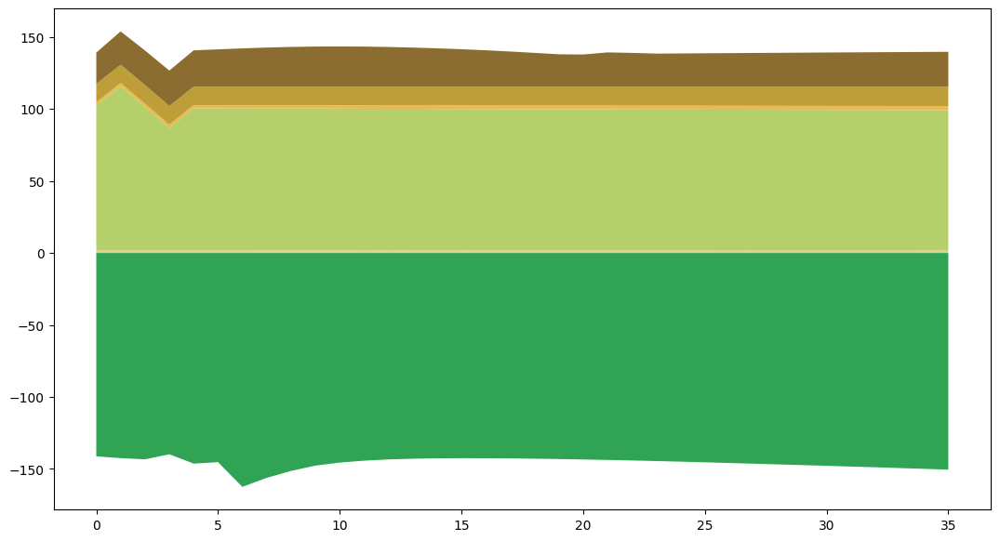

# Peru SISepuede Article 6 – Full Tutorial Notebook

This notebook is designed to help you and other users generate simulations to support Article 6 analysis:

- Understand the overall workflow used to construct, transform, and run SISepuede inputs for Peru
- See how directory paths, data files, and model attributes are configured
- Follow how the Peru input dataframe is built from pipeline output and example data
- Learn how the Transformers / Transformations / Strategies machinery is initialized
- See where helper CSVs (inputs and attributes) are written for cloud/batch use
- Understand how the high-level `SISEPUEDEModels` runner is constructed and used
- Inspect additional exploratory, validation, and debugging cells in context

You can safely run the notebook from top to bottom.  
When turning this into a streamlined workflow later, you can focus on the cells marked as
*core workflow* and consider removing or skipping those marked as primarily *exploratory*.

## How to Adapt This Notebook for New Runs

Because the underlying SISepuede logic does **not** change, adapting this notebook for
new countries, datasets, or scenarios mainly involves adjusting:

---

### A. File Paths and Environment Setup

Update paths in the early setup cells:

- **`path_git`**  
  (location of your SISepuede repositories)

- **Data file paths:**  
  - `path_data_calib`  
  - `path_data_base`  
  - `path_data_built`  
  - Repository paths (if used)

These must point to the correct locations for your machine and your region.

---

### B. Country / Region Configuration

To adapt the workflow for a different country:

- Change ISO codes from `"PER"` to the appropriate ISO-3 (e.g., `"TZA"`).
- Update any hard-coded region identifiers or filters.
- Confirm that the input file contains only the regions you expect.

The rest of the logic stays the same.

---

### C. Reusing the Transformation Pattern

Use the example in **cell 24** (the `transformation_general` example) as a template.

To define new levers, modify:

- **Model variable**  
- **Categories**  
- **Magnitude** and **magnitude_type**  
- **Ramp / implementation vector**  
- **Strategy ID**

The structure does not change — only the contents.

---

### D. Export New Helper Files

To prepare your environment for external runs:

- Reuse the export logic that writes  
  - `attribute_dim_time_period.csv`  
  - `input_data_peru_base.csv`

When adapting to a new country, these files will contain **your region’s attributes and input data**.

---

### E. Run Models and Compare Scenarios

Use the existing examples as patterns:

- **AFOLU runs**  
  to sanity-check sector-specific behavior

- **Full SISepuede runs**  
  to evaluate complete scenarios

For strategy runs:

- Tie together your **strategies** (from the transformations directory)
- Plug in transformed inputs or use a **scenario manager**
- Compare outputs across scenarios to understand impacts

---

By following these steps — adjusting paths, region codes, transformations, exports, and run calls — you can reuse this entire template for **any SISepuede region** or **new Article 6 / policy scenarios**.


## 1. Environment and imports

The next cell sets up the Python environment so that SISepuede, the data pipeline,
and local helper modules can be imported. It also adds the relevant git repository
paths to `sys.path` and suppresses non-critical warnings.


```python
# Tutorial note: Environment and imports for SISepuede and helpers. 
# add path to sispeuede to sys.path in python
import sys
import pathlib
import warnings
warnings.filterwarnings("ignore")

        
import importlib
import matplotlib.pyplot as plt
import numpy as np
import os, os.path
import pandas as pd
import sisepuede.core.support_classes as sc
import sisepuede.manager.sisepuede_examples as sxl
import sisepuede.manager.sisepuede_file_structure as sfs
import sisepuede.manager.sisepuede_models as sm
import sisepuede.transformers as trf
import sisepuede.transformers.strategies as stra
import sisepuede.transformers.transformations as tmts
import sisepuede.utilities._plotting as spu
import sisepuede.utilities._toolbox as sf
import sisepuede.visualization.plots as svp
import time

from copy import deepcopy
from typing import *


```

## 2. Project directories, file paths, and SISepuede metadata

The upcoming cells define:

- Working directories (`data/`, `transformations_peru/`)
- Paths to Peru-specific calibration and pipeline-built input files
- The SISepuede file structure and model attribute objects
- Region and time-period helpers used throughout the workflow


```python
### SETUP DIRECTORIES

path_cur = pathlib.Path(os.getcwd())
path_data = path_cur.joinpath("data")
path_transformations = path_data.joinpath("transformations_peru")


##  SETUP FILES

path_data_built = path_data.joinpath("sisepuede_raw_inputs_latest_PER.csv")

##  SETUP SOME PIPELINE STUFF


file_struct = sfs.SISEPUEDEFileStructure()

# assign some shortcuts
matt = file_struct.model_attributes
regions = sc.Regions(matt)
time_periods = sc.TimePeriods(matt)


##  SOME GLOBALS

_REGION_NAME = "peru"
_REGION_ISO = regions.return_region_or_iso(_REGION_NAME, return_type = "iso", )

```

## 3. Building the Peru input dataframe from pipeline output

The following cells read pipeline-built SISepuede inputs for Peru, attach the
region name, filter to valid time periods, and merge in any fields that appear
in the SISepuede example inputs but are missing from the pipeline output.
The result is a `df_peru` dataframe suitable for running SISepuede models.

## What a new user needs to know (about building `df_peru`)

The end product of this section is a Peru input dataframe (`df_peru` or `df_peru_new`) that is:

- **Filtered to Peru**
- **Harmonized** across older SISepuede inputs and pipeline-built inputs
- **Ready for use** with SISepuede models

If another user wants to repeat this process for a different country:

- They will mainly change:
  - The ISO-3 filter (e.g., `"PER"` → `"TZA"`)
  - The input file paths
- The **pattern of merging, harmonizing, and completing missing fields** is the same regardless of country.


```python

df_peru = pd.read_csv(path_data_built)
df_peru[regions.key] = _REGION_NAME
df_peru = (
    df_peru[
        df_peru[time_periods.field_time_period].isin(
            time_periods.all_time_periods
        )
    ]
    .drop(
        columns = [time_periods.field_year, regions.field_iso], 
    )
    .reset_index(drop = True, )
)


```


```python

```

## 4. AFOLU sector validation (optional but informative)

The next few cells demonstrate how to run the AFOLU model on the Peru inputs
and inspect livestock-related outputs. These cells are primarily for validation
and understanding sector behavior, and are not strictly required for the core
Article 6 workflow.

### What a New User Needs to Know

- These cells are **validation**, not scenario-building.  
- They show how to run and test a **single SISepuede sector model** (e.g., AFOLU) against newly built inputs.
- Only modify these cells if:
  - You want to validate a **different region’s** input dataframe, or  
  - You need to inspect **different variables or sectors**.


```python
# Tutorial note: Run AFOLU sector model for validation and exploration. 
import sisepuede.models.afolu as mafl
model_afolu = mafl.AFOLU(matt, )
df_out = model_afolu(df_peru, )


# plot 
fig, ax = plt.subplots(figsize = (13, 7))
svp.plot_emissions_stack(
    df_out,
    matt,
    figtuple = (fig, ax), 
)
```


    (<Figure size 1300x700 with 1 Axes>, <Axes: >)


    

    


```python
# Tutorial note: Configure project directories, file paths, and SISepuede file structure. 
#df_peru.to_csv(path_data_built, encoding = "UTF-8", index = None, )


```

## 5. Working with generic transformations

The next cells explore and use the `transformation_general` helper to define
policy levers as transformations applied to the Peru input dataframe.


### What This Part Does

This section initializes the SISepuede machinery used to define and manage policy levers:

- Builds a **`transformations_peru`** directory on disk  
- Creates **Transformers**, **Transformations**, and **Strategies** objects  
- Prepares the system for **strategy-based scenario runs**  


### What a New User Needs to Know

- **`path_transformations`** is the directory where:
  - Strategy definitions  
  - Transformation specifications  
  - Helper files  
  are stored.

- This block constructs:
  - **`transformers`** → helper tools + input dataframe context  
  - **`transformations`** → complete set of transformation rules (policy levers)  
  - **`strategies`** → coherent collections of transformations representing scenarios  

- To use SISepuede for another country:
  - Change the **input dataframe**  
  - Optionally use a different transformations directory (e.g., `transformations_tza`)


## 6. Initializing Transformers, Transformations, and Strategies

The following cell(s) set up the Transformers / Transformations / Strategies
machinery used to define and manage policy levers for Peru. If you have already 
constructed the A6 experiments, you may not need to re-build experimental strategies.


### What a New User Needs to Know

- **Transformers**  
  Provide helper vectors and functions that allow transformations to apply smoothly across time, categories, and regions.

- **Transformations**  
  Represent *the rules* used to modify input data (e.g., scaling emissions, ramping fuel use, modifying forestry assumptions).

- **Strategies**  
  Bundle these transformations into a named scenario.  
  For Article 6, this could be:
  - A mitigation strategy  
  - A credit-selling country scenario  
  - An A6 cooperative implementation pathway  

- **This section is essential** if the goal is to run an Article 6 scenario, replicate past analyses, or generate new policy pathways.


### What Might Need Editing

If applying this workflow to another country or scenario:

- **`path_transformations`**  
  Should point to a country-specific directory (e.g., `transformations_chl`).

- **Input dataframe** (`df_peru`)  
  Should be swapped for the regional equivalent.

- **Strategy IDs and transformation specs**  
  May need to be updated depending on how many levers or policies your scenario requires.

This pattern, however, stays the same across all SISepuede regions and use cases.


```python
# initialize a transformations set--will only run if the directory for transformations does not exist
# NOTE: you can always "start anew" with this


def get_transformations(
    path_transformations: pathlib.Path,
    df_inputs: pd.DataFrame,
) -> Tuple:
    """Using the path to transformations, build a transformations and strategies object.

    Returns a tuple of the form:

        (
            transformations,
            transformers,
            strategies
        )

        
    Function Arguments
    ------------------
    path_transformations : pathlib.Path
        Path to transformations directory usd to define transformations and strategies
    df_inputs : pd.DataFrame
        Base data DataFrame to modify with transformations
    """
    if not path_transformations.is_dir():
        print(f"Creating directory and instantiating default transformations at '{path_transformations}'...")

        transformers = trf.Transformers(
            {},
            df_input = df_inputs,
        )
        
        trf.instantiate_default_strategy_directory(
            transformers,
            path_transformations,
        )
    
    
    # read in the transformations and assign
    transformations = tmts.Transformations(
        path_transformations,
        df_input = df_inputs,
    )
    
    transformers = transformations.transformers
    
    # initialize a strategies objet
    strategies = stra.Strategies(
        transformations,
        export_path = "transformations",
        prebuild = True,
    )

    
    out = (
        transformers,
        transformations,
        strategies
    )

    return out


# run the function--we'll use this later, after we build the A6 strategies--to keep it cleaner
(
    transformers,
    transformations,
    strategies
) = get_transformations(
    path_transformations,
    df_peru,
)


```

## 7. Article 6 Transformations

### What This Section Is Doing

This block constructs the **set of transformations** used for an Article 6 (A6) scenario. 


#### **YOU ONLY NEED TO RUN THIS ONCE AFTER INITIALIZING THE BASIC STRATEGIES/TRANSFORMATIONS DIRECTORY**

This block will add rows to the strategy attribute table, which you do not want to do indefinitely. The rows that are added are dependent on the transformations/strategies that you want to evaluate.

We are *defining strategies that are used to conduct A6 analysis*

### Why This Matters for Article 6

Article 6 analysis requires:

- A **baseline** (e.g., business-as-usual or NDC)
- A **counterfactual scenario** modified by levers (representing Article 6 participation)

This block is where the machinery is built to define **those levers** in a modular, transparent way.

That makes this section a **core part of scenario construction**, unlike earlier diagnostics, which were mainly sanity checks.


## First, build some transformations
- We want to test, for example, what happens if we adjust the magnitude of rice CH4 reduction up or down.
- This block creates (and exports to the directory) transformations that will do that


```python
# identify the transformation to stress
transformation_stress = "TX:AGRC:DEC_CH4_RICE_NDC2020_EST"
transformation = transformations.get_transformation(transformation_stress, )
transformer = transformers.get_transformer(transformation.transformer_code)

# this will be overwritten 
dict_transformation = transformation.config.dict_yaml

# update some info
key_cd = transformation.key_transformation_code
key_ds = transformation.key_description
key_id = transformation.key_identifiers
key_pa = transformation.key_parameters

# list of transformation codes that will be "swapped" below
_CODES_TO_EXCHANGE = []

# up the magnitude--NOTE: THIS IS NOT STRAIGHTFORWARD FOR ALL TRANSFORMERS; 
# SOME REQUIRE PATHWAYS (e.g., livestock manure management, wastewater treatment, etc.)
for lev in range(1, 10):
    i = lev*10
    
    # set some properties
    code = f"{transformation_stress}_P{i}"
    descrip = f"Implement {transformation_stress} at {i}%"
    fn_export = f"transformation_agrc_dec_ch4_rice_{i}_perc.yaml"

    _CODES_TO_EXCHANGE.append(code)
    
    # initialize the dictionary and update
    dict_export = deepcopy(dict_transformation)
    
    dict_export.update({key_ds: descrip, })
    dict_export[key_id].update({key_cd: code, })
    dict_export[key_pa].update({"magnitude": float(lev/10), })

    # write output
    path_config_out = transformations.dir_init.joinpath(fn_export)
    sf._write_yaml(dict_export, path_config_out, )

# update
(
    transformers,
    transformations,
    strategies
) = get_transformations(
    path_transformations,
    df_peru,
)
```


```python

```

##  Now, for NDC and BASE, replace with Rice at 10% increments


```python

# SPECIFY TRANSFORMATION CODES THAT ARE TO BE EVALUATED ON/OFF AGAINST A BASELINE (SEE strats_to_build BELOW)

transformations_build = [
    "TX:AGRC:DEC_CH4_RICE"
]

##  INITIALIZE KEY ELEMENTS

# some basic vars
delim = "|"
codes = []
descriptions = []
ids = []
names = []
specs = []

# set the new id number to start at
id_num = max(strategies.attribute_table.key_values) + 1

# initialize new strategies
_DF_ADDITIONAL_STRATEGIES = [strategies.attribute_table.table]

# set a prefix for A6 strategies
_PREFIX_PFLO = "PFLO:"
_PREFIX_PFLO_A6 = f"{_PREFIX_PFLO}A6_"

# reference strategy and associated specifications
dict_strat_builds = {
    #"PFLO:ALL": (1, 0), 
    "PFLO:NDC_2020": (1, 1),
}
dict_strat_pack = {}


#
strats_to_build = list(dict_strat_builds.keys())

for code in strats_to_build:
    # get transformaion information
    strat_ref = strategies.get_strategy(code, )
    all_transformations_ref = strat_ref.get_transformation_list(
        strat_ref.transformation_specification,
        transformations,
    )
    all_transformation_codes_ref = [x.code for x in all_transformations_ref]

    # add to dict
    tup = (strat_ref, all_transformations_ref, all_transformation_codes_ref, )
    dict_strat_pack.update({code: tup, })


# map transformer codes to all transformations
dict_transformer_code_to_transformations = transformations.get_transformation_codes_by_transformer_code()


##  ITERATE OVER TRANSFORMATIONS THAT NEED TO BE ADDED/REMOVED FROM BASE REF

for strat_build, strat_pack in dict_strat_pack.items():

    builds = dict_strat_builds.get(strat_build)
    (strat_ref, all_transformations_ref, all_transformation_codes_ref, ) = strat_pack

    
    for transformation_code in transformations_build:
    
        # check for transformations 
        transformation = transformations.get_transformation(transformation_code)
        if transformation is None:
            raise RuntimeError(f"Transformation code {transformation_code} not found.")
    
    
        # get transformer and check for existing transformation in reference strategy with that code
        all_transformations_with_code = dict_transformer_code_to_transformations.get(
            transformation.transformer_code, 
        )
    
        tfmns_with_trfr_in_strat_ref = set(all_transformations_with_code) & set(all_transformation_codes_ref)
        if len(tfmns_with_trfr_in_strat_ref) == 0: continue
    
        # transformation to replace with current one (for 100%) and remove (for 0%)
        transformation_remove = list(tfmns_with_trfr_in_strat_ref)[0]
    
        ## build transformation WITH x% implementation
        transformation_specification_0 = sorted([x for x in all_transformation_codes_ref if x != transformation_remove])
        transformation_specification_0_str = delim.join(transformation_specification_0)
        
        # now, replace with those identified above
        for code_new in _CODES_TO_EXCHANGE:
            transformation_specification_new = sorted(transformation_specification_0 + [code_new])
            transformation_specification_new_str = delim.join(transformation_specification_new)

            transformation_cur = transformations.get_transformation(code_new, )

            # 
            dict_info = transformation.config.dict_yaml
            name = dict_info[transformation.key_identifiers].get(transformation.key_transformation_name)
            name = f"A6 {strat_build} with {code_new}"

            code_new_strat = code_new.replace(f"{tmts._MODULE_CODE_SIGNATURE}:", "", )
            code_new_strat = f"A6:{code_new_strat}"
            
            # append
            codes.append(code_new_strat)
            descriptions.append(f"{name} for A6")
            ids.append(id_num)
            names.append(name)
            specs.append(transformation_specification_new_str)

            id_num += 1


# build as data frame and append
df_a6 = pd.DataFrame(
    {
        strategies.attribute_table.key: ids,
        strategies.field_baseline_strategy: np.zeros(len(specs)).astype(int),
        strategies.field_description: descriptions,
        strategies.field_strategy_code: codes,
        strategies.field_strategy_name: names,
        strategies.field_transformation_specification: specs,
    }
)
_DF_ADDITIONAL_STRATEGIES.append(df_a6, )

```


```python

```

## Similarly to the cell above, this next cell only needs to be run once (per transformations package)

This cell generates **Whirlpool** and **Tornado** runs.

### Tornado

- Use a strategy (e.g. NDC) as a set Transformations
- Turn on each Transformation in the set one-by-one against the baseline scenario

### Whirlpool 

- Start with a strategy of interest, such as NDC
- **Remove** individual transformations one-by-one from the strategy


```python
_STRATEGY_STRESS = 6003
field_strat_id = strategies.attribute_table.key

# Build tornado and append to new df list
df_tornado = strategies.build_tornado_strategies(
    0,
    strategy_stress = _STRATEGY_STRESS,
    ids = int(df_a6[field_strat_id].max() + 1),
)
_DF_ADDITIONAL_STRATEGIES.append(df_tornado, )

# Build whirlpool and append to new df list
df_whirlpool = strategies.build_whirlpool_strategies(
    _STRATEGY_STRESS,
    ids = df_tornado[field_strat_id].max() + 1,
)
_DF_ADDITIONAL_STRATEGIES.append(df_whirlpool, );
    
attr_strat_out = pd.concat(_DF_ADDITIONAL_STRATEGIES, )
```


```python

```

## IMPORTANT! Export the new strategy attributes file

- This will export a new strategy attributes file
- Careful doing this--it shouldn't harm any strategies you've built otherwise, but it's always good to make a backup (hello GitHub!) before you export in case there are issues
- after exporting, we'll have to reload the transformations object


```python

sf._write_csv(
    attr_strat_out,
    strategies.path_strategy_definition,
)


```


    True


# Now, reinstantiate strategies and transformations to reflect the experimental strategies we just built


```python
# run the function--we'll use this later, after we build the A6 strategies--to keep it cleaner
(
    transformers,
    transformations,
    strategies
) = get_transformations(
    path_transformations,
    df_peru,
)


```

## Now, set the strategies we want to run for our experiment

### Select the strategies that we need to run

- This is an example that focuses on (a) varying rice up and down and (b) the A6 on/off runs defined above
- If you are evaluating the performance of another individual transformation, you'll need to change `AGRC:DEC_CH4_RICE` to identify other strategies

###  setup ids that we want to build
- We will define the strategies that are associated with the A6 analysis
  `strat_ids_a6` is a list of these strategy ids to run in the experiment

###  build to template
- Note: we cannot use a `SISEPUEDE` object successfully to run the strategies unless we rebuild the templates using `strategies.build_strategies_to_templates`


```python
tab = strategies.attribute_table.table

# demonstrate A6 runs
strats_run = ["BASE", "PFLO:ALL", "PFLO:NDC_2020"]
strats_run += [
    x for x in list(tab[strategies.field_strategy_code]) 
    if False 
    or x.startswith("A6")
    or x.startswith("TORNADO")
    or x.startswith("WHIRLPOOL")
]

strat_ids_run = [strategies.get_strategy_id(x) for x in strats_run]

# build templates--trajectory groups are not important right now
strategies.build_strategies_to_templates(
    include_simplex_group_as_trajgroup = False,
    strategies = strat_ids_run,
)

```


    0


```python

```

# Next, build a SISEPUEDE object and load strategies
- This is what we'll use to actually run the analysis


```python
import sisepuede as si

ssp = si.SISEPUEDE(
    "calibrated",
    db_type = "csv",
    initialize_as_dummy = False,
    regions = [_REGION_NAME],
    strategies = strategies,
)


```

    2026-03-07 23:04:07,634 - INFO - Successfully initialized SISEPUEDEFileStructure.
    2026-03-07 23:04:07,635 - WARNING - Missing key dict_dimensional_keys: key time_series not found. Tables that rely on the time_series will not have index checking.
    2026-03-07 23:04:07,636 - INFO - 	Setting export engine to 'csv'.
    2026-03-07 23:04:07,636 - WARNING - No index fields defined. Index field values will not be checked when writing to tables.
    2026-03-07 23:04:07,636 - INFO - Successfully instantiated table ANALYSIS_METADATA
    2026-03-07 23:04:07,637 - WARNING - No index fields found in ATTRIBUTE_DESIGN. Initializing index fields.
    2026-03-07 23:04:07,637 - INFO - Successfully instantiated table ATTRIBUTE_DESIGN
    2026-03-07 23:04:07,637 - WARNING - No index fields found in ATTRIBUTE_LHC_SAMPLES_EXOGENOUS_UNCERTAINTIES. Initializing index fields.
    2026-03-07 23:04:07,638 - INFO - Successfully instantiated table ATTRIBUTE_LHC_SAMPLES_EXOGENOUS_UNCERTAINTIES
    2026-03-07 23:04:07,638 - WARNING - No index fields found in ATTRIBUTE_LHC_SAMPLES_LEVER_EFFECTS. Initializing index fields.
    2026-03-07 23:04:07,638 - INFO - Successfully instantiated table ATTRIBUTE_LHC_SAMPLES_LEVER_EFFECTS
    2026-03-07 23:04:07,638 - WARNING - No index fields found in ATTRIBUTE_PRIMARY. Initializing index fields.
    2026-03-07 23:04:07,639 - INFO - Successfully instantiated table ATTRIBUTE_PRIMARY
    2026-03-07 23:04:07,639 - WARNING - No index fields found in ATTRIBUTE_STRATEGY. Initializing index fields.
    2026-03-07 23:04:07,639 - INFO - Successfully instantiated table ATTRIBUTE_STRATEGY
    2026-03-07 23:04:07,639 - WARNING - No index fields found in ATTRIBUTE_TIME_PERIOD. Initializing index fields.
    2026-03-07 23:04:07,640 - INFO - Successfully instantiated table ATTRIBUTE_TIME_PERIOD
    2026-03-07 23:04:07,640 - WARNING - No index fields found in MODEL_BASE_INPUT_DATABASE. Initializing index fields.
    2026-03-07 23:04:07,640 - INFO - Successfully instantiated table MODEL_BASE_INPUT_DATABASE
    2026-03-07 23:04:07,640 - WARNING - No index fields found in MODEL_INPUT. Initializing index fields.
    2026-03-07 23:04:07,640 - INFO - Successfully instantiated table MODEL_INPUT
    2026-03-07 23:04:07,641 - WARNING - No index fields found in MODEL_OUTPUT. Initializing index fields.
    2026-03-07 23:04:07,641 - INFO - Successfully instantiated table MODEL_OUTPUT
    2026-03-07 23:04:07,641 - INFO - SISEPUEDEOutputDatabase successfully initialized IterativeDatabase.
    2026-03-07 23:04:07,641 - INFO - Successfully initialized database with:
    	type:	csv
    	analysis id:	sisepuede_run_2026-03-07T23:04:07.022202
    	fp_base_output:	/Users/usuario/git/sisepuede/sisepuede/out/sisepuede_run_2026-03-07T23;04;07.022202/sisepuede_run_2026-03-07T23;04;07.022202_output_database
    2026-03-07 23:04:07,642 - INFO - Running SISEPUEDE under template data mode 'calibrated'.
    2026-03-07 23:04:07,642 - INFO - Initializing BaseInputDatabase
    2026-03-07 23:04:13,525 - INFO - Initializing FutureTrajectories
    2026-03-07 23:04:33,803 - INFO - Instantiating 1777 sampling units.
    2026-03-07 23:04:33,816 - INFO - Iteration 0 complete.
    2026-03-07 23:04:37,986 - INFO - Iteration 250 complete.
    2026-03-07 23:04:39,998 - INFO - Iteration 500 complete.
    2026-03-07 23:04:42,015 - INFO - Iteration 750 complete.
    2026-03-07 23:04:44,030 - INFO - Iteration 1000 complete.
    2026-03-07 23:04:46,051 - INFO - Iteration 1250 complete.
    2026-03-07 23:04:48,345 - INFO - Iteration 1500 complete.
    2026-03-07 23:04:50,366 - INFO - Iteration 1750 complete.
    2026-03-07 23:04:50,577 - INFO - 	1777 sampling units complete in 16.77 seconds.
    2026-03-07 23:04:50,586 - INFO - 	FutureTrajectories for 'peru' complete.
    2026-03-07 23:04:50,588 - INFO - Initializing LHSDesign
    2026-03-07 23:04:50,588 - INFO - LHSDesign.fields_factors_l reset successful.
    2026-03-07 23:04:50,588 - INFO - LHSDesign.fields_factors_x reset successful.
    2026-03-07 23:04:50,611 - INFO - 	LHSDesign for region 'peru' complete.
    2026-03-07 23:04:50,611 - INFO - Generating primary keys (values of primary_id)...
    2026-03-07 23:04:50,612 - INFO - Successfully initialized SISEPUEDEExperimentalManager.
    2026-03-07 23:04:50,612 - INFO - Successfully initialized NemoMod temporary database path as /Users/usuario/git/sisepuede/sisepuede/tmp/nemomod_intermediate_database.sqlite.
    2026-03-07 23:04:50,613 - INFO - Set Julia directory for modules and environment to '/Users/usuario/git/sisepuede/sisepuede/julia'.
    2026-03-07 23:04:50,659 - INFO - Successfully read NemoMod input table data from /Users/usuario/git/sisepuede/sisepuede/ref/nemo_mod/SpecifiedDemandProfile.csv
    2026-03-07 23:04:50,663 - INFO - Successfully read NemoMod input table data from /Users/usuario/git/sisepuede/sisepuede/ref/nemo_mod/AvailabilityFactor.csv
    2026-03-07 23:04:50,714 - INFO - Importing Julia...


    [juliapkg] Found dependencies: /Users/usuario/git/sisepuede/sisepuede/julia/pyjuliapkg/juliapkg.json
    [juliapkg] Found dependencies: /opt/miniconda3/envs/sisepuede/lib/python3.11/site-packages/juliapkg/juliapkg.json
    [juliapkg] Found dependencies: /opt/miniconda3/envs/sisepuede/lib/python3.11/site-packages/juliacall/juliapkg.json
    [juliapkg] Locating Julia =1.11.5, =1.11.6
    [juliapkg] Using Julia 1.11.6 at /Users/usuario/.julia/juliaup/julia-1.11.6+0.aarch64.apple.darwin14/bin/julia
    [juliapkg] Using Julia project at /Users/usuario/git/sisepuede/sisepuede/julia
    [juliapkg] Writing Project.toml:
                 [deps]
                 Cbc = "9961bab8-2fa3-5c5a-9d89-47fab24efd76"
                 Clp = "e2554f3b-3117-50c0-817c-e040a3ddf72d"
                 DataFrames = "a93c6f00-e57d-5684-b7b6-d8193f3e46c0"
                 GLPK = "60bf3e95-4087-53dc-ae20-288a0d20c6a6"
                 HiGHS = "87dc4568-4c63-4d18-b0c0-bb2238e4078b"
                 Ipopt = "b6b21f68-93f8-5de0-b562-5493be1d77c9"
                 JuMP = "4076af6c-e467-56ae-b986-b466b2749572"
                 NemoMod = "a3c327a0-d2f0-11e8-37fd-d12fd35c3c72"
                 PythonCall = "6099a3de-0909-46bc-b1f4-468b9a2dfc0d"
                 SQLite = "0aa819cd-b072-5ff4-a722-6bc24af294d9"
                 OpenSSL_jll = "458c3c95-2e84-50aa-8efc-19380b2a3a95"
                 [compat]
                 Cbc = "^1.2"
                 Clp = "^1.2.2"
                 DataFrames = "^1.7"
                 GLPK = "^1.2.1"
                 HiGHS = "^1.19"
                 Ipopt = "^1.10.6"
                 JuMP = "^1.27"
                 NemoMod = "^2.2"
                 PythonCall = "=0.9.25"
                 SQLite = "^1.6.1"
                 OpenSSL_jll = "~3.0"
    [juliapkg] Installing packages:
                 import Pkg
                 Pkg.Registry.update()
                 Pkg.add([
                   Pkg.PackageSpec(name="Cbc", uuid="9961bab8-2fa3-5c5a-9d89-47fab24efd76"),
                   Pkg.PackageSpec(name="Clp", uuid="e2554f3b-3117-50c0-817c-e040a3ddf72d"),
                   Pkg.PackageSpec(name="DataFrames", uuid="a93c6f00-e57d-5684-b7b6-d8193f3e46c0"),
                   Pkg.PackageSpec(name="GLPK", uuid="60bf3e95-4087-53dc-ae20-288a0d20c6a6"),
                   Pkg.PackageSpec(name="HiGHS", uuid="87dc4568-4c63-4d18-b0c0-bb2238e4078b"),
                   Pkg.PackageSpec(name="Ipopt", uuid="b6b21f68-93f8-5de0-b562-5493be1d77c9"),
                   Pkg.PackageSpec(name="JuMP", uuid="4076af6c-e467-56ae-b986-b466b2749572"),
                   Pkg.PackageSpec(name="NemoMod", uuid="a3c327a0-d2f0-11e8-37fd-d12fd35c3c72", url=raw"https://github.com/sei-international/NemoMod.jl.git", rev=raw"4a5a6fa"),
                   Pkg.PackageSpec(name="PythonCall", uuid="6099a3de-0909-46bc-b1f4-468b9a2dfc0d"),
                   Pkg.PackageSpec(name="SQLite", uuid="0aa819cd-b072-5ff4-a722-6bc24af294d9"),
                   Pkg.PackageSpec(name="OpenSSL_jll", uuid="458c3c95-2e84-50aa-8efc-19380b2a3a95"),
                 ])
                 Pkg.resolve()
                 Pkg.precompile()


        Updating registry at `~/.julia/registries/General.toml`
       Resolving package versions...
       Installed Hwloc_jll ────────── v2.13.0+0
       Installed dlfcn_win32_jll ──── v1.4.2+0
       Installed MicroMamba ───────── v0.1.15
       Installed SpecialFunctions ─── v2.7.1
       Installed JSON ─────────────── v1.4.0
       Installed Preferences ──────── v1.5.2
       Installed SQLite ───────────── v1.8.0
       Installed PrettyTables ─────── v3.2.3
       Installed SentinelArrays ───── v1.4.9
       Installed micromamba_jll ───── v2.3.1+0
       Installed ForwardDiff ──────── v1.3.2
       Installed SQLite_jll ───────── v3.51.2+0
       Installed OpenBLAS32_jll ───── v0.3.30+0
       Installed MathOptIIS ───────── v0.1.2
       Installed Ipopt ────────────── v1.14.1
       Installed HiGHS_jll ────────── v1.13.1+0
       Installed HiGHS ────────────── v1.22.0
       Installed CondaPkg ─────────── v0.2.34
       Installed JuMP ─────────────── v1.30.0
       Installed StructUtils ──────── v2.6.3
       Installed StringManipulation ─ v0.4.4
       Installed MathOptInterface ─── v1.49.0
        Updating `~/git/sisepuede/sisepuede/julia/Project.toml`
      [9961bab8] + Cbc v1.3.0
      [e2554f3b] + Clp v1.3.0
      [a93c6f00] + DataFrames v1.8.1
      [60bf3e95] + GLPK v1.2.1
      [87dc4568] + HiGHS v1.22.0
      [b6b21f68] + Ipopt v1.14.1
      [4076af6c] + JuMP v1.30.0
      [a3c327a0] + NemoMod v2.2.0 `https://github.com/sei-international/NemoMod.jl.git#4a5a6fa`
    ⌅ [6099a3de] + PythonCall v0.9.25
      [0aa819cd] + SQLite v1.8.0
    ⌅ [458c3c95] + OpenSSL_jll v3.0.16+0
        Updating `~/git/sisepuede/sisepuede/julia/Manifest.toml`
      [6e4b80f9] + BenchmarkTools v1.6.3
      [9961bab8] + Cbc v1.3.0
      [e2554f3b] + Clp v1.3.0
      [523fee87] + CodecBzip2 v0.8.5
      [944b1d66] + CodecZlib v0.7.8
      [bbf7d656] + CommonSubexpressions v0.3.1
      [34da2185] + Compat v4.18.1
      [992eb4ea] + CondaPkg v0.2.34
      [88353bc9] + ConfParser v0.1.2
      [a8cc5b0e] + Crayons v4.1.1
      [a10d1c49] + DBInterface v2.6.1
      [9a962f9c] + DataAPI v1.16.0
      [a93c6f00] + DataFrames v1.8.1
      [864edb3b] + DataStructures v0.19.3
      [e2d170a0] + DataValueInterfaces v1.0.0
      [163ba53b] + DiffResults v1.1.0
      [b552c78f] + DiffRules v1.15.1
      [ffbed154] + DocStringExtensions v0.9.5
      [f6369f11] + ForwardDiff v1.3.2
      [60bf3e95] + GLPK v1.2.1
      [87dc4568] + HiGHS v1.22.0
      [842dd82b] + InlineStrings v1.4.5
      [41ab1584] + InvertedIndices v1.3.1
      [b6b21f68] + Ipopt v1.14.1
      [92d709cd] + IrrationalConstants v0.2.6
      [82899510] + IteratorInterfaceExtensions v1.0.0
      [692b3bcd] + JLLWrappers v1.7.1
      [682c06a0] + JSON v1.4.0
      [4076af6c] + JuMP v1.30.0
      [b964fa9f] + LaTeXStrings v1.4.0
      [2ab3a3ac] + LogExpFunctions v0.3.29
      [1914dd2f] + MacroTools v0.5.16
      [8c4f8055] + MathOptIIS v0.1.2
      [b8f27783] + MathOptInterface v1.49.0
      [0b3b1443] + MicroMamba v0.1.15
      [e1d29d7a] + Missings v1.2.0
      [d8a4904e] + MutableArithmetics v1.6.7
      [77ba4419] + NaNMath v1.1.3
      [a3c327a0] + NemoMod v2.2.0 `https://github.com/sei-international/NemoMod.jl.git#4a5a6fa`
      [bac558e1] + OrderedCollections v1.8.1
      [69de0a69] + Parsers v2.8.3
      [fa939f87] + Pidfile v1.3.0
      [2dfb63ee] + PooledArrays v1.4.3
    ⌅ [aea7be01] + PrecompileTools v1.2.1
      [21216c6a] + Preferences v1.5.2
      [08abe8d2] + PrettyTables v3.2.3
    ⌅ [6099a3de] + PythonCall v0.9.25
      [189a3867] + Reexport v1.2.2
      [ae029012] + Requires v1.3.1
      [0aa819cd] + SQLite v1.8.0
      [6c6a2e73] + Scratch v1.3.0
      [91c51154] + SentinelArrays v1.4.9
      [a2af1166] + SortingAlgorithms v1.2.2
      [276daf66] + SpecialFunctions v2.7.1
      [1e83bf80] + StaticArraysCore v1.4.4
      [10745b16] + Statistics v1.11.1
      [892a3eda] + StringManipulation v0.4.4
      [ec057cc2] + StructUtils v2.6.3
      [3783bdb8] + TableTraits v1.0.1
      [bd369af6] + Tables v1.12.1
      [3bb67fe8] + TranscodingStreams v0.11.3
      [e17b2a0c] + UnsafePointers v1.0.0
      [ea10d353] + WeakRefStrings v1.4.2
      [ae81ac8f] + ASL_jll v0.1.3+0
      [6e34b625] + Bzip2_jll v1.0.9+0
      [38041ee0] + Cbc_jll v200.1000.1200+0
      [3830e938] + Cgl_jll v0.6000.900+0
    ⌅ [06985876] + Clp_jll v100.1700.1000+1
      [be027038] + CoinUtils_jll v200.1100.1200+0
      [e8aa6df9] + GLPK_jll v5.0.1+1
      [8fd58aa0] + HiGHS_jll v1.13.1+0
      [e33a78d0] + Hwloc_jll v2.13.0+0
    ⌃ [9cc047cb] + Ipopt_jll v300.1400.1900+0
      [94ce4f54] + Libiconv_jll v1.18.0+0
    ⌅ [d00139f3] + METIS_jll v5.1.2+1
    ⌅ [d7ed1dd3] + MUMPS_seq_jll v500.800.100+0
      [656ef2d0] + OpenBLAS32_jll v0.3.30+0
    ⌅ [458c3c95] + OpenSSL_jll v3.0.16+0
      [efe28fd5] + OpenSpecFun_jll v0.5.6+0
      [7da25872] + Osi_jll v0.10800.1100+0
    ⌅ [319450e9] + SPRAL_jll v2025.5.20+0
      [76ed43ae] + SQLite_jll v3.51.2+0
    ⌅ [02c8fc9c] + XML2_jll v2.13.9+0
      [a65dc6b1] + Xorg_libpciaccess_jll v0.18.1+0
      [c4b69c83] + dlfcn_win32_jll v1.4.2+0
      [f8abcde7] + micromamba_jll v2.3.1+0
      [4d7b5844] + pixi_jll v0.41.3+0
      [0dad84c5] + ArgTools v1.1.2
      [56f22d72] + Artifacts v1.11.0
      [2a0f44e3] + Base64 v1.11.0
      [ade2ca70] + Dates v1.11.0
      [f43a241f] + Downloads v1.6.0
      [7b1f6079] + FileWatching v1.11.0
      [9fa8497b] + Future v1.11.0
      [b77e0a4c] + InteractiveUtils v1.11.0
      [4af54fe1] + LazyArtifacts v1.11.0
      [b27032c2] + LibCURL v0.6.4
      [76f85450] + LibGit2 v1.11.0
      [8f399da3] + Libdl v1.11.0
      [37e2e46d] + LinearAlgebra v1.11.0
      [56ddb016] + Logging v1.11.0
      [d6f4376e] + Markdown v1.11.0
      [ca575930] + NetworkOptions v1.2.0
      [44cfe95a] + Pkg v1.11.0
      [de0858da] + Printf v1.11.0
      [9abbd945] + Profile v1.11.0
      [3fa0cd96] + REPL v1.11.0
      [9a3f8284] + Random v1.11.0
      [ea8e919c] + SHA v0.7.0
      [9e88b42a] + Serialization v1.11.0
      [6462fe0b] + Sockets v1.11.0
      [2f01184e] + SparseArrays v1.11.0
      [f489334b] + StyledStrings v1.11.0
      [fa267f1f] + TOML v1.0.3
      [a4e569a6] + Tar v1.10.0
      [8dfed614] + Test v1.11.0
      [cf7118a7] + UUIDs v1.11.0
      [4ec0a83e] + Unicode v1.11.0
      [e66e0078] + CompilerSupportLibraries_jll v1.1.1+0
      [781609d7] + GMP_jll v6.3.0+0
      [deac9b47] + LibCURL_jll v8.6.0+0
      [e37daf67] + LibGit2_jll v1.7.2+0
      [29816b5a] + LibSSH2_jll v1.11.0+1
      [c8ffd9c3] + MbedTLS_jll v2.28.6+0
      [14a3606d] + MozillaCACerts_jll v2023.12.12
      [4536629a] + OpenBLAS_jll v0.3.27+1
      [05823500] + OpenLibm_jll v0.8.5+0
      [bea87d4a] + SuiteSparse_jll v7.7.0+0
      [83775a58] + Zlib_jll v1.2.13+1
      [8e850b90] + libblastrampoline_jll v5.11.0+0
      [8e850ede] + nghttp2_jll v1.59.0+0
      [3f19e933] + p7zip_jll v17.4.0+2
            Info Packages marked with ⌃ and ⌅ have new versions available. Those with ⌃ may be upgradable, but those with ⌅ are restricted by compatibility constraints from upgrading. To see why use `status --outdated -m`
    Precompiling project...
        399.4 ms  ✓ StructUtils
        398.9 ms  ✓ Preferences
        597.5 ms  ✓ SentinelArrays
        926.5 ms  ✓ StructUtils → StructUtilsTablesExt
        907.0 ms  ✓ PrecompileTools
        927.8 ms  ✓ JLLWrappers
        423.5 ms  ✓ dlfcn_win32_jll
        413.8 ms  ✓ Xorg_libpciaccess_jll
        442.7 ms  ✓ ASL_jll
        442.1 ms  ✓ Bzip2_jll
        466.9 ms  ✓ Libiconv_jll
        462.8 ms  ✓ GLPK_jll
        472.0 ms  ✓ OpenSSL_jll
        613.8 ms  ✓ pixi_jll
        623.1 ms  ✓ micromamba_jll
        329.2 ms  ✓ OpenBLAS32_jll
        333.9 ms  ✓ OpenSpecFun_jll
        333.1 ms  ✓ HiGHS_jll
        341.1 ms  ✓ METIS_jll
        324.9 ms  ✓ CoinUtils_jll
        326.4 ms  ✓ SQLite_jll
        480.6 ms  ✓ CodecBzip2
       1022.2 ms  ✓ StringManipulation
        461.0 ms  ✓ XML2_jll
        578.5 ms  ✓ MUMPS_seq_jll
        642.3 ms  ✓ Osi_jll
        649.3 ms  ✓ Hwloc_jll
       1402.7 ms  ✓ SpecialFunctions
        538.0 ms  ✓ SPRAL_jll
        875.8 ms  ✓ Clp_jll
        566.1 ms  ✓ Cgl_jll
        696.1 ms  ✓ Ipopt_jll
       2623.2 ms  ✓ MicroMamba
        514.3 ms  ✓ Cbc_jll
        898.2 ms  ✓ Ipopt
       1777.3 ms  ✓ ForwardDiff
       4183.7 ms  ✓ Parsers
        439.0 ms  ✓ InlineStrings → ParsersExt
        487.4 ms  ✓ WeakRefStrings
       1484.1 ms  ✓ JSON
       1302.6 ms  ✓ SQLite
        781.8 ms  ✓ BenchmarkTools
       1328.8 ms  ✓ CondaPkg
       5354.3 ms  ✓ PythonCall
      12033.9 ms  ✓ PrettyTables
      17587.9 ms  ✓ MathOptInterface
       1478.0 ms  ✓ MathOptIIS
       1724.8 ms  ✓ Cbc
       2457.6 ms  ✓ GLPK
       5261.1 ms  ✓ Clp
      17098.6 ms  ✓ DataFrames
       4945.3 ms  ✓ HiGHS
       8116.5 ms  ✓ Ipopt → IpoptMathOptInterfaceExt
       8188.8 ms  ✓ JuMP
       2508.2 ms  ? NemoMod
      54 dependencies successfully precompiled in 36 seconds. 74 already precompiled.
      1 dependencies failed but may be precompilable after restarting julia
      2 dependencies had output during precompilation:
    ┌ NemoMod
    │  WARNING: Method definition parse_line(String) in module ConfParser at /Users/usuario/.julia/packages/ConfParser/b2fge/src/ConfParser.jl:95 overwritten in module NemoMod at /Users/usuario/.julia/packages/NemoMod/IIHRE/src/config_functions.jl:16.
    │  ERROR: Method overwriting is not permitted during Module precompilation. Use `__precompile__(false)` to opt-out of precompilation.
    └  
    ┌ MicroMamba
    │  Downloading artifact: micromamba
    └  
      No Changes to `~/git/sisepuede/sisepuede/julia/Project.toml`
      No Changes to `~/git/sisepuede/sisepuede/julia/Manifest.toml`
    Precompiling project...
       1334.1 ms  ? NemoMod


    Detected IPython. Loading juliacall extension. See https://juliapy.github.io/PythonCall.jl/stable/compat/#IPython


    Precompiling NemoMod...
    Info Given NemoMod was explicitly requested, output will be shown live 
    WARNING: Method definition parse_line(String) in module ConfParser at /Users/usuario/.julia/packages/ConfParser/b2fge/src/ConfParser.jl:95 overwritten in module NemoMod at /Users/usuario/.julia/packages/NemoMod/IIHRE/src/config_functions.jl:16.
    ERROR: Method overwriting is not permitted during Module precompilation. Use `__precompile__(false)` to opt-out of precompilation.
       1361.1 ms  ? NemoMod
    [ Info: Precompiling NemoMod [a3c327a0-d2f0-11e8-37fd-d12fd35c3c72] 
    WARNING: Method definition parse_line(String) in module ConfParser at /Users/usuario/.julia/packages/ConfParser/b2fge/src/ConfParser.jl:95 overwritten in module NemoMod at /Users/usuario/.julia/packages/NemoMod/IIHRE/src/config_functions.jl:16.
    ERROR: Method overwriting is not permitted during Module precompilation. Use `__precompile__(false)` to opt-out of precompilation.
    ┌ Info: Skipping precompilation due to precompilable error. Importing NemoMod [a3c327a0-d2f0-11e8-37fd-d12fd35c3c72].
    └   exception = Error when precompiling module, potentially caused by a __precompile__(false) declaration in the module.
    2026-03-07 23:05:59,438 - INFO - Successfully initialized JuMP optimizer from solver module HiGHS.
    2026-03-07 23:05:59,452 - INFO - Successfully initialized SISEPUEDEModels.
    2026-03-07 23:05:59,457 - INFO - Table ANALYSIS_METADATA successfully written to /Users/usuario/git/sisepuede/sisepuede/out/sisepuede_run_2026-03-07T23;04;07.022202/sisepuede_run_2026-03-07T23;04;07.022202_output_database/ANALYSIS_METADATA.csv.
    2026-03-07 23:05:59,458 - INFO - Table ATTRIBUTE_DESIGN successfully written to /Users/usuario/git/sisepuede/sisepuede/out/sisepuede_run_2026-03-07T23;04;07.022202/sisepuede_run_2026-03-07T23;04;07.022202_output_database/ATTRIBUTE_DESIGN.csv.
    2026-03-07 23:05:59,460 - INFO - Table ATTRIBUTE_STRATEGY successfully written to /Users/usuario/git/sisepuede/sisepuede/out/sisepuede_run_2026-03-07T23;04;07.022202/sisepuede_run_2026-03-07T23;04;07.022202_output_database/ATTRIBUTE_STRATEGY.csv.
    2026-03-07 23:05:59,461 - INFO - Table ATTRIBUTE_TIME_PERIOD successfully written to /Users/usuario/git/sisepuede/sisepuede/out/sisepuede_run_2026-03-07T23;04;07.022202/sisepuede_run_2026-03-07T23;04;07.022202_output_database/ATTRIBUTE_TIME_PERIOD.csv.
    2026-03-07 23:06:02,090 - INFO - Table MODEL_BASE_INPUT_DATABASE successfully written to /Users/usuario/git/sisepuede/sisepuede/out/sisepuede_run_2026-03-07T23;04;07.022202/sisepuede_run_2026-03-07T23;04;07.022202_output_database/MODEL_BASE_INPUT_DATABASE.csv.


## 8. Running example strategies via a scenario manager (optional)

These cells illustrate how to use a higher-level scenario manager (`ssp`) to
run predefined strategies such as `strat_base()` and `strat_a6()`. They are
useful examples but not strictly required to construct the core Peru inputs.

### What a New User Needs to Know

**`SISEPUEDEModels`** is the top-level **model runner** in SISepuede:

- It **orchestrates all sector models** (energy, AFOLU, industry, transport, waste, etc.).  
- It uses:
  - **Model metadata** (`matt`)  
  - **Reference files** from Julia and NemoMod (via `file_struct`)  

### For Strategy Runs

To run **scenario-based** (rather than baseline) simulations:

- Replace **`df_peru`** with a **transformed input dataframe** created using one or more policy levers or a defined strategy.
- Alternatively, use the **scenario manager approach** shown earlier, such as:
  - `strat_base()`
  - `strat_a6()`

This process allows you to generate, compare, and analyze **multiple scenarios** that all originate from the same base input dataset.


```python

dict_run = {
    ssp.key_future: [0],
    ssp.key_design: [0],
    ssp.key_strategy: strat_ids_run,
}

# we'll save inputs since we're doing a small set of runs 
dict_successful = ssp(
    dict_run, 
    force_overwrite_existing_primary_keys = True,
    save_inputs = True,
)
```

    2026-03-07 23:06:02,146 - INFO - 
    ***	STARTING REGION peru	***
    
    2026-03-07 23:06:03,681 - INFO - Trying run primary_id = 0 in region peru
    2026-03-07 23:06:03,681 - INFO - Running AFOLU model
    2026-03-07 23:06:03,897 - INFO - AFOLU model run successfully completed
    2026-03-07 23:06:03,897 - INFO - Running CircularEconomy model
    2026-03-07 23:06:03,920 - INFO - CircularEconomy model run successfully completed
    2026-03-07 23:06:03,921 - INFO - Running IPPU model
    2026-03-07 23:06:03,959 - INFO - IPPU model run successfully completed
    2026-03-07 23:06:03,959 - INFO - Running Energy model (EnergyConsumption without Fugitive Emissions)
    2026-03-07 23:06:03,969 - DEBUG - Missing elasticity information found in 'project_energy_consumption_by_fuel_from_effvars': using specified future demands.
    2026-03-07 23:06:04,013 - INFO - EnergyConsumption without Fugitive Emissions model run successfully completed
    2026-03-07 23:06:04,013 - INFO - Running Energy model (Electricity and Fuel Production: trying to call Julia)
    2026-03-07 23:06:04,040 - INFO - 	Path to temporary NemoMod database '/Users/usuario/git/sisepuede/sisepuede/tmp/nemomod_intermediate_database.sqlite' not found. Creating...


    2026-07-Mar 23:06:04.419 Opened SQLite database at /Users/usuario/git/sisepuede/sisepuede/tmp/nemomod_intermediate_database.sqlite.
    2026-07-Mar 23:06:04.433 Added NEMO structure to SQLite database at /Users/usuario/git/sisepuede/sisepuede/tmp/nemomod_intermediate_database.sqlite.
    2026-07-Mar 23:06:19.502 Started modeling scenario. NEMO version = 2.2.0, solver = HiGHS.
    2026-07-Mar 23:06:20.003 Started optimizing following years: [1000, 1001, 1002, 1003, 1004, 1005, 1006, 1007, 1008, 1009, 1010, 1011, 1012].
    2026-07-Mar 23:06:39.730 Finished optimizing following years: [1000, 1001, 1002, 1003, 1004, 1005, 1006, 1007, 1008, 1009, 1010, 1011, 1012].
    2026-07-Mar 23:06:39.778 Started optimizing following years: [1013, 1014, 1015, 1016, 1017, 1018, 1019, 1020, 1021, 1022, 1023, 1024, 1025, 1026, 1027, 1028, 1029, 1030, 1031, 1032, 1033, 1034, 1035].


    2026-03-07 23:07:31,351 - INFO - NemoMod ran successfully with the following status: OPTIMAL
    2026-03-07 23:07:31,358 - INFO - EnergyProduction model run successfully completed
    2026-03-07 23:07:31,358 - INFO - Running Energy (Fugitive Emissions)
    2026-03-07 23:07:31,377 - INFO - Fugitive Emissions from Energy model run successfully completed
    2026-03-07 23:07:31,378 - INFO - Appending Socioeconomic outputs
    2026-03-07 23:07:31,382 - INFO - Socioeconomic outputs successfully appended.
    2026-03-07 23:07:31,384 - INFO - Model run for primary_id = 0 successfully completed in 87.7 seconds (n_tries = 1).
    2026-03-07 23:07:31,403 - INFO - Trying run primary_id = 87087 in region peru
    2026-03-07 23:07:31,404 - INFO - Running AFOLU model


    2026-07-Mar 23:07:31.235 Finished optimizing following years: [1013, 1014, 1015, 1016, 1017, 1018, 1019, 1020, 1021, 1022, 1023, 1024, 1025, 1026, 1027, 1028, 1029, 1030, 1031, 1032, 1033, 1034, 1035].
    set ['emission_co2e_co2_entc_bmass_processing_and_refinement_fp_hydrogen_gasification'] = 0 in energy production. FIX WITH NEW fp_hydrogen_gasification_biomass TECH.


    2026-03-07 23:07:31,612 - INFO - AFOLU model run successfully completed
    2026-03-07 23:07:31,613 - INFO - Running CircularEconomy model
    2026-03-07 23:07:31,634 - INFO - CircularEconomy model run successfully completed
    2026-03-07 23:07:31,635 - INFO - Running IPPU model
    2026-03-07 23:07:31,671 - INFO - IPPU model run successfully completed
    2026-03-07 23:07:31,671 - INFO - Running Energy model (EnergyConsumption without Fugitive Emissions)
    2026-03-07 23:07:31,680 - DEBUG - Missing elasticity information found in 'project_energy_consumption_by_fuel_from_effvars': using specified future demands.
    2026-03-07 23:07:31,724 - INFO - EnergyConsumption without Fugitive Emissions model run successfully completed
    2026-03-07 23:07:31,724 - INFO - Running Energy model (Electricity and Fuel Production: trying to call Julia)


    2026-07-Mar 23:07:32.311 Started modeling scenario. NEMO version = 2.2.0, solver = HiGHS.
    2026-07-Mar 23:07:32.359 Started optimizing following years: [1000, 1001, 1002, 1003, 1004, 1005, 1006, 1007, 1008, 1009, 1010, 1011, 1012].


    2026-03-07 23:08:09,294 - INFO - NemoMod ran successfully with the following status: OPTIMAL
    2026-03-07 23:08:09,301 - INFO - EnergyProduction model run successfully completed
    2026-03-07 23:08:09,301 - INFO - Running Energy (Fugitive Emissions)
    2026-03-07 23:08:09,321 - INFO - Fugitive Emissions from Energy model run successfully completed
    2026-03-07 23:08:09,321 - INFO - Appending Socioeconomic outputs
    2026-03-07 23:08:09,326 - INFO - Socioeconomic outputs successfully appended.
    2026-03-07 23:08:09,328 - INFO - Model run for primary_id = 87087 successfully completed in 37.92 seconds (n_tries = 1).
    2026-03-07 23:08:09,331 - INFO - Trying run primary_id = 88088 in region peru
    2026-03-07 23:08:09,331 - INFO - Running AFOLU model


    2026-07-Mar 23:07:43.175 Finished optimizing following years: [1000, 1001, 1002, 1003, 1004, 1005, 1006, 1007, 1008, 1009, 1010, 1011, 1012].
    2026-07-Mar 23:07:43.208 Started optimizing following years: [1013, 1014, 1015, 1016, 1017, 1018, 1019, 1020, 1021, 1022, 1023, 1024, 1025, 1026, 1027, 1028, 1029, 1030, 1031, 1032, 1033, 1034, 1035].
    2026-07-Mar 23:08:09.210 Finished optimizing following years: [1013, 1014, 1015, 1016, 1017, 1018, 1019, 1020, 1021, 1022, 1023, 1024, 1025, 1026, 1027, 1028, 1029, 1030, 1031, 1032, 1033, 1034, 1035].
    set ['emission_co2e_co2_entc_bmass_processing_and_refinement_fp_hydrogen_gasification'] = 0 in energy production. FIX WITH NEW fp_hydrogen_gasification_biomass TECH.


    2026-03-07 23:08:09,539 - INFO - AFOLU model run successfully completed
    2026-03-07 23:08:09,540 - INFO - Running CircularEconomy model
    2026-03-07 23:08:09,562 - INFO - CircularEconomy model run successfully completed
    2026-03-07 23:08:09,562 - INFO - Running IPPU model
    2026-03-07 23:08:09,598 - INFO - IPPU model run successfully completed
    2026-03-07 23:08:09,599 - INFO - Running Energy model (EnergyConsumption without Fugitive Emissions)
    2026-03-07 23:08:09,609 - DEBUG - Missing elasticity information found in 'project_energy_consumption_by_fuel_from_effvars': using specified future demands.
    2026-03-07 23:08:09,653 - INFO - EnergyConsumption without Fugitive Emissions model run successfully completed
    2026-03-07 23:08:09,654 - INFO - Running Energy model (Electricity and Fuel Production: trying to call Julia)


    2026-07-Mar 23:08:10.233 Started modeling scenario. NEMO version = 2.2.0, solver = HiGHS.
    2026-07-Mar 23:08:10.281 Started optimizing following years: [1000, 1001, 1002, 1003, 1004, 1005, 1006, 1007, 1008, 1009, 1010, 1011, 1012].


    2026-03-07 23:09:07,402 - INFO - NemoMod ran successfully with the following status: OPTIMAL
    2026-03-07 23:09:07,409 - INFO - EnergyProduction model run successfully completed
    2026-03-07 23:09:07,409 - INFO - Running Energy (Fugitive Emissions)
    2026-03-07 23:09:07,429 - INFO - Fugitive Emissions from Energy model run successfully completed
    2026-03-07 23:09:07,429 - INFO - Appending Socioeconomic outputs
    2026-03-07 23:09:07,433 - INFO - Socioeconomic outputs successfully appended.
    2026-03-07 23:09:07,435 - INFO - Model run for primary_id = 88088 successfully completed in 58.1 seconds (n_tries = 1).
    2026-03-07 23:09:07,438 - INFO - Trying run primary_id = 89089 in region peru
    2026-03-07 23:09:07,438 - INFO - Running AFOLU model


    2026-07-Mar 23:08:26.704 Finished optimizing following years: [1000, 1001, 1002, 1003, 1004, 1005, 1006, 1007, 1008, 1009, 1010, 1011, 1012].
    2026-07-Mar 23:08:26.738 Started optimizing following years: [1013, 1014, 1015, 1016, 1017, 1018, 1019, 1020, 1021, 1022, 1023, 1024, 1025, 1026, 1027, 1028, 1029, 1030, 1031, 1032, 1033, 1034, 1035].
    2026-07-Mar 23:09:07.313 Finished optimizing following years: [1013, 1014, 1015, 1016, 1017, 1018, 1019, 1020, 1021, 1022, 1023, 1024, 1025, 1026, 1027, 1028, 1029, 1030, 1031, 1032, 1033, 1034, 1035].
    set ['emission_co2e_co2_entc_bmass_processing_and_refinement_fp_hydrogen_gasification'] = 0 in energy production. FIX WITH NEW fp_hydrogen_gasification_biomass TECH.


    2026-03-07 23:09:07,647 - INFO - AFOLU model run successfully completed
    2026-03-07 23:09:07,647 - INFO - Running CircularEconomy model
    2026-03-07 23:09:07,669 - INFO - CircularEconomy model run successfully completed
    2026-03-07 23:09:07,670 - INFO - Running IPPU model
    2026-03-07 23:09:07,705 - INFO - IPPU model run successfully completed
    2026-03-07 23:09:07,706 - INFO - Running Energy model (EnergyConsumption without Fugitive Emissions)
    2026-03-07 23:09:07,715 - DEBUG - Missing elasticity information found in 'project_energy_consumption_by_fuel_from_effvars': using specified future demands.
    2026-03-07 23:09:07,758 - INFO - EnergyConsumption without Fugitive Emissions model run successfully completed
    2026-03-07 23:09:07,759 - INFO - Running Energy model (Electricity and Fuel Production: trying to call Julia)


    2026-07-Mar 23:09:08.344 Started modeling scenario. NEMO version = 2.2.0, solver = HiGHS.
    2026-07-Mar 23:09:08.392 Started optimizing following years: [1000, 1001, 1002, 1003, 1004, 1005, 1006, 1007, 1008, 1009, 1010, 1011, 1012].


    2026-03-07 23:10:05,559 - INFO - NemoMod ran successfully with the following status: OPTIMAL
    2026-03-07 23:10:05,567 - INFO - EnergyProduction model run successfully completed
    2026-03-07 23:10:05,567 - INFO - Running Energy (Fugitive Emissions)
    2026-03-07 23:10:05,588 - INFO - Fugitive Emissions from Energy model run successfully completed
    2026-03-07 23:10:05,588 - INFO - Appending Socioeconomic outputs
    2026-03-07 23:10:05,593 - INFO - Socioeconomic outputs successfully appended.
    2026-03-07 23:10:05,595 - INFO - Model run for primary_id = 89089 successfully completed in 58.16 seconds (n_tries = 1).
    2026-03-07 23:10:05,598 - INFO - Trying run primary_id = 90090 in region peru
    2026-03-07 23:10:05,598 - INFO - Running AFOLU model


    2026-07-Mar 23:09:24.841 Finished optimizing following years: [1000, 1001, 1002, 1003, 1004, 1005, 1006, 1007, 1008, 1009, 1010, 1011, 1012].
    2026-07-Mar 23:09:24.876 Started optimizing following years: [1013, 1014, 1015, 1016, 1017, 1018, 1019, 1020, 1021, 1022, 1023, 1024, 1025, 1026, 1027, 1028, 1029, 1030, 1031, 1032, 1033, 1034, 1035].
    2026-07-Mar 23:10:05.467 Finished optimizing following years: [1013, 1014, 1015, 1016, 1017, 1018, 1019, 1020, 1021, 1022, 1023, 1024, 1025, 1026, 1027, 1028, 1029, 1030, 1031, 1032, 1033, 1034, 1035].
    set ['emission_co2e_co2_entc_bmass_processing_and_refinement_fp_hydrogen_gasification'] = 0 in energy production. FIX WITH NEW fp_hydrogen_gasification_biomass TECH.


    2026-03-07 23:10:05,806 - INFO - AFOLU model run successfully completed
    2026-03-07 23:10:05,807 - INFO - Running CircularEconomy model
    2026-03-07 23:10:05,829 - INFO - CircularEconomy model run successfully completed
    2026-03-07 23:10:05,829 - INFO - Running IPPU model
    2026-03-07 23:10:05,865 - INFO - IPPU model run successfully completed
    2026-03-07 23:10:05,865 - INFO - Running Energy model (EnergyConsumption without Fugitive Emissions)
    2026-03-07 23:10:05,874 - DEBUG - Missing elasticity information found in 'project_energy_consumption_by_fuel_from_effvars': using specified future demands.
    2026-03-07 23:10:05,917 - INFO - EnergyConsumption without Fugitive Emissions model run successfully completed
    2026-03-07 23:10:05,918 - INFO - Running Energy model (Electricity and Fuel Production: trying to call Julia)


    2026-07-Mar 23:10:06.498 Started modeling scenario. NEMO version = 2.2.0, solver = HiGHS.
    2026-07-Mar 23:10:06.546 Started optimizing following years: [1000, 1001, 1002, 1003, 1004, 1005, 1006, 1007, 1008, 1009, 1010, 1011, 1012].


    2026-03-07 23:11:03,780 - INFO - NemoMod ran successfully with the following status: OPTIMAL
    2026-03-07 23:11:03,788 - INFO - EnergyProduction model run successfully completed
    2026-03-07 23:11:03,788 - INFO - Running Energy (Fugitive Emissions)
    2026-03-07 23:11:03,807 - INFO - Fugitive Emissions from Energy model run successfully completed
    2026-03-07 23:11:03,807 - INFO - Appending Socioeconomic outputs
    2026-03-07 23:11:03,811 - INFO - Socioeconomic outputs successfully appended.
    2026-03-07 23:11:03,813 - INFO - Model run for primary_id = 90090 successfully completed in 58.22 seconds (n_tries = 1).
    2026-03-07 23:11:03,816 - INFO - Trying run primary_id = 91091 in region peru
    2026-03-07 23:11:03,816 - INFO - Running AFOLU model


    2026-07-Mar 23:10:23.035 Finished optimizing following years: [1000, 1001, 1002, 1003, 1004, 1005, 1006, 1007, 1008, 1009, 1010, 1011, 1012].
    2026-07-Mar 23:10:23.067 Started optimizing following years: [1013, 1014, 1015, 1016, 1017, 1018, 1019, 1020, 1021, 1022, 1023, 1024, 1025, 1026, 1027, 1028, 1029, 1030, 1031, 1032, 1033, 1034, 1035].
    2026-07-Mar 23:11:03.691 Finished optimizing following years: [1013, 1014, 1015, 1016, 1017, 1018, 1019, 1020, 1021, 1022, 1023, 1024, 1025, 1026, 1027, 1028, 1029, 1030, 1031, 1032, 1033, 1034, 1035].
    set ['emission_co2e_co2_entc_bmass_processing_and_refinement_fp_hydrogen_gasification'] = 0 in energy production. FIX WITH NEW fp_hydrogen_gasification_biomass TECH.


    2026-03-07 23:11:04,024 - INFO - AFOLU model run successfully completed
    2026-03-07 23:11:04,025 - INFO - Running CircularEconomy model
    2026-03-07 23:11:04,046 - INFO - CircularEconomy model run successfully completed
    2026-03-07 23:11:04,047 - INFO - Running IPPU model
    2026-03-07 23:11:04,082 - INFO - IPPU model run successfully completed
    2026-03-07 23:11:04,083 - INFO - Running Energy model (EnergyConsumption without Fugitive Emissions)
    2026-03-07 23:11:04,092 - DEBUG - Missing elasticity information found in 'project_energy_consumption_by_fuel_from_effvars': using specified future demands.
    2026-03-07 23:11:04,135 - INFO - EnergyConsumption without Fugitive Emissions model run successfully completed
    2026-03-07 23:11:04,136 - INFO - Running Energy model (Electricity and Fuel Production: trying to call Julia)


    2026-07-Mar 23:11:04.719 Started modeling scenario. NEMO version = 2.2.0, solver = HiGHS.
    2026-07-Mar 23:11:04.769 Started optimizing following years: [1000, 1001, 1002, 1003, 1004, 1005, 1006, 1007, 1008, 1009, 1010, 1011, 1012].


    2026-03-07 23:12:02,412 - INFO - NemoMod ran successfully with the following status: OPTIMAL
    2026-03-07 23:12:02,418 - INFO - EnergyProduction model run successfully completed
    2026-03-07 23:12:02,418 - INFO - Running Energy (Fugitive Emissions)
    2026-03-07 23:12:02,438 - INFO - Fugitive Emissions from Energy model run successfully completed
    2026-03-07 23:12:02,439 - INFO - Appending Socioeconomic outputs
    2026-03-07 23:12:02,443 - INFO - Socioeconomic outputs successfully appended.
    2026-03-07 23:12:02,445 - INFO - Model run for primary_id = 91091 successfully completed in 58.63 seconds (n_tries = 1).
    2026-03-07 23:12:02,448 - INFO - Trying run primary_id = 92092 in region peru
    2026-03-07 23:12:02,448 - INFO - Running AFOLU model


    2026-07-Mar 23:11:21.256 Finished optimizing following years: [1000, 1001, 1002, 1003, 1004, 1005, 1006, 1007, 1008, 1009, 1010, 1011, 1012].
    2026-07-Mar 23:11:21.288 Started optimizing following years: [1013, 1014, 1015, 1016, 1017, 1018, 1019, 1020, 1021, 1022, 1023, 1024, 1025, 1026, 1027, 1028, 1029, 1030, 1031, 1032, 1033, 1034, 1035].
    2026-07-Mar 23:12:02.322 Finished optimizing following years: [1013, 1014, 1015, 1016, 1017, 1018, 1019, 1020, 1021, 1022, 1023, 1024, 1025, 1026, 1027, 1028, 1029, 1030, 1031, 1032, 1033, 1034, 1035].
    set ['emission_co2e_co2_entc_bmass_processing_and_refinement_fp_hydrogen_gasification'] = 0 in energy production. FIX WITH NEW fp_hydrogen_gasification_biomass TECH.


    2026-03-07 23:12:02,657 - INFO - AFOLU model run successfully completed
    2026-03-07 23:12:02,658 - INFO - Running CircularEconomy model
    2026-03-07 23:12:02,679 - INFO - CircularEconomy model run successfully completed
    2026-03-07 23:12:02,680 - INFO - Running IPPU model
    2026-03-07 23:12:02,717 - INFO - IPPU model run successfully completed
    2026-03-07 23:12:02,717 - INFO - Running Energy model (EnergyConsumption without Fugitive Emissions)
    2026-03-07 23:12:02,727 - DEBUG - Missing elasticity information found in 'project_energy_consumption_by_fuel_from_effvars': using specified future demands.
    2026-03-07 23:12:02,771 - INFO - EnergyConsumption without Fugitive Emissions model run successfully completed
    2026-03-07 23:12:02,771 - INFO - Running Energy model (Electricity and Fuel Production: trying to call Julia)


    2026-07-Mar 23:12:03.766 Started modeling scenario. NEMO version = 2.2.0, solver = HiGHS.
    2026-07-Mar 23:12:03.813 Started optimizing following years: [1000, 1001, 1002, 1003, 1004, 1005, 1006, 1007, 1008, 1009, 1010, 1011, 1012].


    2026-03-07 23:13:00,869 - INFO - NemoMod ran successfully with the following status: OPTIMAL
    2026-03-07 23:13:00,877 - INFO - EnergyProduction model run successfully completed
    2026-03-07 23:13:00,877 - INFO - Running Energy (Fugitive Emissions)
    2026-03-07 23:13:00,897 - INFO - Fugitive Emissions from Energy model run successfully completed
    2026-03-07 23:13:00,898 - INFO - Appending Socioeconomic outputs
    2026-03-07 23:13:00,902 - INFO - Socioeconomic outputs successfully appended.
    2026-03-07 23:13:00,904 - INFO - Model run for primary_id = 92092 successfully completed in 58.46 seconds (n_tries = 1).
    2026-03-07 23:13:00,906 - INFO - Trying run primary_id = 93093 in region peru
    2026-03-07 23:13:00,907 - INFO - Running AFOLU model


    2026-07-Mar 23:12:20.178 Finished optimizing following years: [1000, 1001, 1002, 1003, 1004, 1005, 1006, 1007, 1008, 1009, 1010, 1011, 1012].
    2026-07-Mar 23:12:20.210 Started optimizing following years: [1013, 1014, 1015, 1016, 1017, 1018, 1019, 1020, 1021, 1022, 1023, 1024, 1025, 1026, 1027, 1028, 1029, 1030, 1031, 1032, 1033, 1034, 1035].
    2026-07-Mar 23:13:00.782 Finished optimizing following years: [1013, 1014, 1015, 1016, 1017, 1018, 1019, 1020, 1021, 1022, 1023, 1024, 1025, 1026, 1027, 1028, 1029, 1030, 1031, 1032, 1033, 1034, 1035].
    set ['emission_co2e_co2_entc_bmass_processing_and_refinement_fp_hydrogen_gasification'] = 0 in energy production. FIX WITH NEW fp_hydrogen_gasification_biomass TECH.


    2026-03-07 23:13:01,114 - INFO - AFOLU model run successfully completed
    2026-03-07 23:13:01,114 - INFO - Running CircularEconomy model
    2026-03-07 23:13:01,135 - INFO - CircularEconomy model run successfully completed
    2026-03-07 23:13:01,136 - INFO - Running IPPU model
    2026-03-07 23:13:01,171 - INFO - IPPU model run successfully completed
    2026-03-07 23:13:01,172 - INFO - Running Energy model (EnergyConsumption without Fugitive Emissions)
    2026-03-07 23:13:01,181 - DEBUG - Missing elasticity information found in 'project_energy_consumption_by_fuel_from_effvars': using specified future demands.
    2026-03-07 23:13:01,225 - INFO - EnergyConsumption without Fugitive Emissions model run successfully completed
    2026-03-07 23:13:01,225 - INFO - Running Energy model (Electricity and Fuel Production: trying to call Julia)


    2026-07-Mar 23:13:01.815 Started modeling scenario. NEMO version = 2.2.0, solver = HiGHS.
    2026-07-Mar 23:13:01.862 Started optimizing following years: [1000, 1001, 1002, 1003, 1004, 1005, 1006, 1007, 1008, 1009, 1010, 1011, 1012].
    2026-07-Mar 23:13:18.317 Finished optimizing following years: [1000, 1001, 1002, 1003, 1004, 1005, 1006, 1007, 1008, 1009, 1010, 1011, 1012].
    2026-07-Mar 23:13:18.350 Started optimizing following years: [1013, 1014, 1015, 1016, 1017, 1018, 1019, 1020, 1021, 1022, 1023, 1024, 1025, 1026, 1027, 1028, 1029, 1030, 1031, 1032, 1033, 1034, 1035].


    2026-03-07 23:25:57,245 - INFO - NemoMod ran successfully with the following status: OPTIMAL
    2026-03-07 23:25:57,252 - INFO - EnergyProduction model run successfully completed
    2026-03-07 23:25:57,252 - INFO - Running Energy (Fugitive Emissions)
    2026-03-07 23:25:57,271 - INFO - Fugitive Emissions from Energy model run successfully completed
    2026-03-07 23:25:57,271 - INFO - Appending Socioeconomic outputs
    2026-03-07 23:25:57,275 - INFO - Socioeconomic outputs successfully appended.
    2026-03-07 23:25:57,277 - INFO - Model run for primary_id = 93093 successfully completed in 776.37 seconds (n_tries = 1).
    2026-03-07 23:25:57,280 - INFO - Trying run primary_id = 94094 in region peru
    2026-03-07 23:25:57,280 - INFO - Running AFOLU model


    2026-07-Mar 23:25:57.166 Finished optimizing following years: [1013, 1014, 1015, 1016, 1017, 1018, 1019, 1020, 1021, 1022, 1023, 1024, 1025, 1026, 1027, 1028, 1029, 1030, 1031, 1032, 1033, 1034, 1035].
    set ['emission_co2e_co2_entc_bmass_processing_and_refinement_fp_hydrogen_gasification'] = 0 in energy production. FIX WITH NEW fp_hydrogen_gasification_biomass TECH.


    2026-03-07 23:25:57,475 - INFO - AFOLU model run successfully completed
    2026-03-07 23:25:57,475 - INFO - Running CircularEconomy model
    2026-03-07 23:25:57,496 - INFO - CircularEconomy model run successfully completed
    2026-03-07 23:25:57,496 - INFO - Running IPPU model
    2026-03-07 23:25:57,529 - INFO - IPPU model run successfully completed
    2026-03-07 23:25:57,529 - INFO - Running Energy model (EnergyConsumption without Fugitive Emissions)
    2026-03-07 23:25:57,538 - DEBUG - Missing elasticity information found in 'project_energy_consumption_by_fuel_from_effvars': using specified future demands.
    2026-03-07 23:25:57,577 - INFO - EnergyConsumption without Fugitive Emissions model run successfully completed
    2026-03-07 23:25:57,578 - INFO - Running Energy model (Electricity and Fuel Production: trying to call Julia)


    2026-07-Mar 23:25:58.121 Started modeling scenario. NEMO version = 2.2.0, solver = HiGHS.
    2026-07-Mar 23:25:58.166 Started optimizing following years: [1000, 1001, 1002, 1003, 1004, 1005, 1006, 1007, 1008, 1009, 1010, 1011, 1012].


    2026-03-07 23:38:44,862 - INFO - NemoMod ran successfully with the following status: OPTIMAL
    2026-03-07 23:38:44,874 - INFO - EnergyProduction model run successfully completed
    2026-03-07 23:38:44,874 - INFO - Running Energy (Fugitive Emissions)
    2026-03-07 23:38:44,893 - INFO - Fugitive Emissions from Energy model run successfully completed
    2026-03-07 23:38:44,893 - INFO - Appending Socioeconomic outputs
    2026-03-07 23:38:44,898 - INFO - Socioeconomic outputs successfully appended.
    2026-03-07 23:38:44,900 - INFO - Model run for primary_id = 94094 successfully completed in 767.62 seconds (n_tries = 1).
    2026-03-07 23:38:44,903 - INFO - Trying run primary_id = 95095 in region peru
    2026-03-07 23:38:44,904 - INFO - Running AFOLU model


    2026-07-Mar 23:26:14.010 Finished optimizing following years: [1000, 1001, 1002, 1003, 1004, 1005, 1006, 1007, 1008, 1009, 1010, 1011, 1012].
    2026-07-Mar 23:26:14.042 Started optimizing following years: [1013, 1014, 1015, 1016, 1017, 1018, 1019, 1020, 1021, 1022, 1023, 1024, 1025, 1026, 1027, 1028, 1029, 1030, 1031, 1032, 1033, 1034, 1035].
    2026-07-Mar 23:38:44.780 Finished optimizing following years: [1013, 1014, 1015, 1016, 1017, 1018, 1019, 1020, 1021, 1022, 1023, 1024, 1025, 1026, 1027, 1028, 1029, 1030, 1031, 1032, 1033, 1034, 1035].
    set ['emission_co2e_co2_entc_bmass_processing_and_refinement_fp_hydrogen_gasification'] = 0 in energy production. FIX WITH NEW fp_hydrogen_gasification_biomass TECH.


    2026-03-07 23:38:45,100 - INFO - AFOLU model run successfully completed
    2026-03-07 23:38:45,101 - INFO - Running CircularEconomy model
    2026-03-07 23:38:45,122 - INFO - CircularEconomy model run successfully completed
    2026-03-07 23:38:45,122 - INFO - Running IPPU model
    2026-03-07 23:38:45,156 - INFO - IPPU model run successfully completed
    2026-03-07 23:38:45,156 - INFO - Running Energy model (EnergyConsumption without Fugitive Emissions)
    2026-03-07 23:38:45,165 - DEBUG - Missing elasticity information found in 'project_energy_consumption_by_fuel_from_effvars': using specified future demands.
    2026-03-07 23:38:45,205 - INFO - EnergyConsumption without Fugitive Emissions model run successfully completed
    2026-03-07 23:38:45,205 - INFO - Running Energy model (Electricity and Fuel Production: trying to call Julia)


    2026-07-Mar 23:38:45.765 Started modeling scenario. NEMO version = 2.2.0, solver = HiGHS.
    2026-07-Mar 23:38:45.812 Started optimizing following years: [1000, 1001, 1002, 1003, 1004, 1005, 1006, 1007, 1008, 1009, 1010, 1011, 1012].


    2026-03-07 23:39:40,591 - INFO - NemoMod ran successfully with the following status: OPTIMAL
    2026-03-07 23:39:40,598 - INFO - EnergyProduction model run successfully completed
    2026-03-07 23:39:40,598 - INFO - Running Energy (Fugitive Emissions)
    2026-03-07 23:39:40,620 - INFO - Fugitive Emissions from Energy model run successfully completed
    2026-03-07 23:39:40,620 - INFO - Appending Socioeconomic outputs
    2026-03-07 23:39:40,625 - INFO - Socioeconomic outputs successfully appended.
    2026-03-07 23:39:40,627 - INFO - Model run for primary_id = 95095 successfully completed in 55.72 seconds (n_tries = 1).


    2026-07-Mar 23:39:01.563 Finished optimizing following years: [1000, 1001, 1002, 1003, 1004, 1005, 1006, 1007, 1008, 1009, 1010, 1011, 1012].
    2026-07-Mar 23:39:01.594 Started optimizing following years: [1013, 1014, 1015, 1016, 1017, 1018, 1019, 1020, 1021, 1022, 1023, 1024, 1025, 1026, 1027, 1028, 1029, 1030, 1031, 1032, 1033, 1034, 1035].
    2026-07-Mar 23:39:40.503 Finished optimizing following years: [1013, 1014, 1015, 1016, 1017, 1018, 1019, 1020, 1021, 1022, 1023, 1024, 1025, 1026, 1027, 1028, 1029, 1030, 1031, 1032, 1033, 1034, 1035].
    set ['emission_co2e_co2_entc_bmass_processing_and_refinement_fp_hydrogen_gasification'] = 0 in energy production. FIX WITH NEW fp_hydrogen_gasification_biomass TECH.


    2026-03-07 23:39:40,859 - INFO - Table MODEL_OUTPUT successfully written to /Users/usuario/git/sisepuede/sisepuede/out/sisepuede_run_2026-03-07T23;04;07.022202/sisepuede_run_2026-03-07T23;04;07.022202_output_database/MODEL_OUTPUT.csv.
    2026-03-07 23:39:41,147 - INFO - Table MODEL_INPUT successfully written to /Users/usuario/git/sisepuede/sisepuede/out/sisepuede_run_2026-03-07T23;04;07.022202/sisepuede_run_2026-03-07T23;04;07.022202_output_database/MODEL_INPUT.csv.
    2026-03-07 23:39:41,149 - INFO - Trying run primary_id = 96096 in region peru
    2026-03-07 23:39:41,149 - INFO - Running AFOLU model
    2026-03-07 23:39:41,352 - INFO - AFOLU model run successfully completed
    2026-03-07 23:39:41,352 - INFO - Running CircularEconomy model
    2026-03-07 23:39:41,374 - INFO - CircularEconomy model run successfully completed
    2026-03-07 23:39:41,374 - INFO - Running IPPU model
    2026-03-07 23:39:41,410 - INFO - IPPU model run successfully completed
    2026-03-07 23:39:41,410 - INFO - Running Energy model (EnergyConsumption without Fugitive Emissions)
    2026-03-07 23:39:41,421 - DEBUG - Missing elasticity information found in 'project_energy_consumption_by_fuel_from_effvars': using specified future demands.
    2026-03-07 23:39:41,467 - INFO - EnergyConsumption without Fugitive Emissions model run successfully completed
    2026-03-07 23:39:41,468 - INFO - Running Energy model (Electricity and Fuel Production: trying to call Julia)


    2026-07-Mar 23:39:42.034 Started modeling scenario. NEMO version = 2.2.0, solver = HiGHS.
    2026-07-Mar 23:39:42.081 Started optimizing following years: [1000, 1001, 1002, 1003, 1004, 1005, 1006, 1007, 1008, 1009, 1010, 1011, 1012].
    2026-07-Mar 23:39:58.005 Finished optimizing following years: [1000, 1001, 1002, 1003, 1004, 1005, 1006, 1007, 1008, 1009, 1010, 1011, 1012].
    2026-07-Mar 23:39:58.038 Started optimizing following years: [1013, 1014, 1015, 1016, 1017, 1018, 1019, 1020, 1021, 1022, 1023, 1024, 1025, 1026, 1027, 1028, 1029, 1030, 1031, 1032, 1033, 1034, 1035].


    2026-03-07 23:40:37,809 - INFO - NemoMod ran successfully with the following status: OPTIMAL
    2026-03-07 23:40:37,818 - INFO - EnergyProduction model run successfully completed
    2026-03-07 23:40:37,819 - INFO - Running Energy (Fugitive Emissions)
    2026-03-07 23:40:37,839 - INFO - Fugitive Emissions from Energy model run successfully completed
    2026-03-07 23:40:37,839 - INFO - Appending Socioeconomic outputs
    2026-03-07 23:40:37,844 - INFO - Socioeconomic outputs successfully appended.
    2026-03-07 23:40:37,846 - INFO - Model run for primary_id = 96096 successfully completed in 56.7 seconds (n_tries = 1).
    2026-03-07 23:40:37,848 - INFO - Trying run primary_id = 97097 in region peru
    2026-03-07 23:40:37,849 - INFO - Running AFOLU model


    2026-07-Mar 23:40:37.724 Finished optimizing following years: [1013, 1014, 1015, 1016, 1017, 1018, 1019, 1020, 1021, 1022, 1023, 1024, 1025, 1026, 1027, 1028, 1029, 1030, 1031, 1032, 1033, 1034, 1035].
    set ['emission_co2e_co2_entc_bmass_processing_and_refinement_fp_hydrogen_gasification'] = 0 in energy production. FIX WITH NEW fp_hydrogen_gasification_biomass TECH.


    2026-03-07 23:40:38,054 - INFO - AFOLU model run successfully completed
    2026-03-07 23:40:38,054 - INFO - Running CircularEconomy model
    2026-03-07 23:40:38,076 - INFO - CircularEconomy model run successfully completed
    2026-03-07 23:40:38,076 - INFO - Running IPPU model
    2026-03-07 23:40:38,112 - INFO - IPPU model run successfully completed
    2026-03-07 23:40:38,113 - INFO - Running Energy model (EnergyConsumption without Fugitive Emissions)
    2026-03-07 23:40:38,122 - DEBUG - Missing elasticity information found in 'project_energy_consumption_by_fuel_from_effvars': using specified future demands.
    2026-03-07 23:40:38,166 - INFO - EnergyConsumption without Fugitive Emissions model run successfully completed
    2026-03-07 23:40:38,166 - INFO - Running Energy model (Electricity and Fuel Production: trying to call Julia)


    2026-07-Mar 23:40:38.732 Started modeling scenario. NEMO version = 2.2.0, solver = HiGHS.
    2026-07-Mar 23:40:38.778 Started optimizing following years: [1000, 1001, 1002, 1003, 1004, 1005, 1006, 1007, 1008, 1009, 1010, 1011, 1012].
    2026-07-Mar 23:40:54.817 Finished optimizing following years: [1000, 1001, 1002, 1003, 1004, 1005, 1006, 1007, 1008, 1009, 1010, 1011, 1012].
    2026-07-Mar 23:40:54.851 Started optimizing following years: [1013, 1014, 1015, 1016, 1017, 1018, 1019, 1020, 1021, 1022, 1023, 1024, 1025, 1026, 1027, 1028, 1029, 1030, 1031, 1032, 1033, 1034, 1035].


    2026-03-07 23:41:34,990 - INFO - NemoMod ran successfully with the following status: OPTIMAL
    2026-03-07 23:41:34,998 - INFO - EnergyProduction model run successfully completed
    2026-03-07 23:41:34,998 - INFO - Running Energy (Fugitive Emissions)
    2026-03-07 23:41:35,018 - INFO - Fugitive Emissions from Energy model run successfully completed
    2026-03-07 23:41:35,018 - INFO - Appending Socioeconomic outputs
    2026-03-07 23:41:35,023 - INFO - Socioeconomic outputs successfully appended.
    2026-03-07 23:41:35,024 - INFO - Model run for primary_id = 97097 successfully completed in 57.18 seconds (n_tries = 1).
    2026-03-07 23:41:35,027 - INFO - Trying run primary_id = 98098 in region peru
    2026-03-07 23:41:35,028 - INFO - Running AFOLU model


    2026-07-Mar 23:41:34.908 Finished optimizing following years: [1013, 1014, 1015, 1016, 1017, 1018, 1019, 1020, 1021, 1022, 1023, 1024, 1025, 1026, 1027, 1028, 1029, 1030, 1031, 1032, 1033, 1034, 1035].
    set ['emission_co2e_co2_entc_bmass_processing_and_refinement_fp_hydrogen_gasification'] = 0 in energy production. FIX WITH NEW fp_hydrogen_gasification_biomass TECH.


    2026-03-07 23:41:35,232 - INFO - AFOLU model run successfully completed
    2026-03-07 23:41:35,232 - INFO - Running CircularEconomy model
    2026-03-07 23:41:35,253 - INFO - CircularEconomy model run successfully completed
    2026-03-07 23:41:35,254 - INFO - Running IPPU model
    2026-03-07 23:41:35,289 - INFO - IPPU model run successfully completed
    2026-03-07 23:41:35,289 - INFO - Running Energy model (EnergyConsumption without Fugitive Emissions)
    2026-03-07 23:41:35,298 - DEBUG - Missing elasticity information found in 'project_energy_consumption_by_fuel_from_effvars': using specified future demands.
    2026-03-07 23:41:35,341 - INFO - EnergyConsumption without Fugitive Emissions model run successfully completed
    2026-03-07 23:41:35,342 - INFO - Running Energy model (Electricity and Fuel Production: trying to call Julia)


    2026-07-Mar 23:41:35.913 Started modeling scenario. NEMO version = 2.2.0, solver = HiGHS.
    2026-07-Mar 23:41:35.960 Started optimizing following years: [1000, 1001, 1002, 1003, 1004, 1005, 1006, 1007, 1008, 1009, 1010, 1011, 1012].


    2026-03-07 23:42:38,768 - INFO - NemoMod ran successfully with the following status: OPTIMAL
    2026-03-07 23:42:38,775 - INFO - EnergyProduction model run successfully completed
    2026-03-07 23:42:38,775 - INFO - Running Energy (Fugitive Emissions)
    2026-03-07 23:42:38,793 - INFO - Fugitive Emissions from Energy model run successfully completed
    2026-03-07 23:42:38,794 - INFO - Appending Socioeconomic outputs
    2026-03-07 23:42:38,798 - INFO - Socioeconomic outputs successfully appended.
    2026-03-07 23:42:38,800 - INFO - Model run for primary_id = 98098 successfully completed in 63.77 seconds (n_tries = 1).
    2026-03-07 23:42:38,803 - INFO - Trying run primary_id = 99099 in region peru
    2026-03-07 23:42:38,803 - INFO - Running AFOLU model


    2026-07-Mar 23:41:48.517 Finished optimizing following years: [1000, 1001, 1002, 1003, 1004, 1005, 1006, 1007, 1008, 1009, 1010, 1011, 1012].
    2026-07-Mar 23:41:48.551 Started optimizing following years: [1013, 1014, 1015, 1016, 1017, 1018, 1019, 1020, 1021, 1022, 1023, 1024, 1025, 1026, 1027, 1028, 1029, 1030, 1031, 1032, 1033, 1034, 1035].
    2026-07-Mar 23:42:38.685 Finished optimizing following years: [1013, 1014, 1015, 1016, 1017, 1018, 1019, 1020, 1021, 1022, 1023, 1024, 1025, 1026, 1027, 1028, 1029, 1030, 1031, 1032, 1033, 1034, 1035].
    set ['emission_co2e_co2_entc_bmass_processing_and_refinement_fp_hydrogen_gasification'] = 0 in energy production. FIX WITH NEW fp_hydrogen_gasification_biomass TECH.


    2026-03-07 23:42:39,015 - INFO - AFOLU model run successfully completed
    2026-03-07 23:42:39,015 - INFO - Running CircularEconomy model
    2026-03-07 23:42:39,037 - INFO - CircularEconomy model run successfully completed
    2026-03-07 23:42:39,037 - INFO - Running IPPU model
    2026-03-07 23:42:39,072 - INFO - IPPU model run successfully completed
    2026-03-07 23:42:39,072 - INFO - Running Energy model (EnergyConsumption without Fugitive Emissions)
    2026-03-07 23:42:39,081 - DEBUG - Missing elasticity information found in 'project_energy_consumption_by_fuel_from_effvars': using specified future demands.
    2026-03-07 23:42:39,123 - INFO - EnergyConsumption without Fugitive Emissions model run successfully completed
    2026-03-07 23:42:39,123 - INFO - Running Energy model (Electricity and Fuel Production: trying to call Julia)


    2026-07-Mar 23:42:39.694 Started modeling scenario. NEMO version = 2.2.0, solver = HiGHS.
    2026-07-Mar 23:42:39.740 Started optimizing following years: [1000, 1001, 1002, 1003, 1004, 1005, 1006, 1007, 1008, 1009, 1010, 1011, 1012].


    2026-03-07 23:43:43,060 - INFO - NemoMod ran successfully with the following status: OPTIMAL
    2026-03-07 23:43:43,066 - INFO - EnergyProduction model run successfully completed
    2026-03-07 23:43:43,067 - INFO - Running Energy (Fugitive Emissions)
    2026-03-07 23:43:43,085 - INFO - Fugitive Emissions from Energy model run successfully completed
    2026-03-07 23:43:43,085 - INFO - Appending Socioeconomic outputs
    2026-03-07 23:43:43,089 - INFO - Socioeconomic outputs successfully appended.
    2026-03-07 23:43:43,091 - INFO - Model run for primary_id = 99099 successfully completed in 64.29 seconds (n_tries = 1).
    2026-03-07 23:43:43,093 - INFO - Trying run primary_id = 100100 in region peru
    2026-03-07 23:43:43,094 - INFO - Running AFOLU model


    2026-07-Mar 23:42:52.421 Finished optimizing following years: [1000, 1001, 1002, 1003, 1004, 1005, 1006, 1007, 1008, 1009, 1010, 1011, 1012].
    2026-07-Mar 23:42:52.454 Started optimizing following years: [1013, 1014, 1015, 1016, 1017, 1018, 1019, 1020, 1021, 1022, 1023, 1024, 1025, 1026, 1027, 1028, 1029, 1030, 1031, 1032, 1033, 1034, 1035].
    2026-07-Mar 23:43:42.979 Finished optimizing following years: [1013, 1014, 1015, 1016, 1017, 1018, 1019, 1020, 1021, 1022, 1023, 1024, 1025, 1026, 1027, 1028, 1029, 1030, 1031, 1032, 1033, 1034, 1035].
    set ['emission_co2e_co2_entc_bmass_processing_and_refinement_fp_hydrogen_gasification'] = 0 in energy production. FIX WITH NEW fp_hydrogen_gasification_biomass TECH.


    2026-03-07 23:43:43,300 - INFO - AFOLU model run successfully completed
    2026-03-07 23:43:43,301 - INFO - Running CircularEconomy model
    2026-03-07 23:43:43,323 - INFO - CircularEconomy model run successfully completed
    2026-03-07 23:43:43,323 - INFO - Running IPPU model
    2026-03-07 23:43:43,359 - INFO - IPPU model run successfully completed
    2026-03-07 23:43:43,360 - INFO - Running Energy model (EnergyConsumption without Fugitive Emissions)
    2026-03-07 23:43:43,369 - DEBUG - Missing elasticity information found in 'project_energy_consumption_by_fuel_from_effvars': using specified future demands.
    2026-03-07 23:43:43,412 - INFO - EnergyConsumption without Fugitive Emissions model run successfully completed
    2026-03-07 23:43:43,413 - INFO - Running Energy model (Electricity and Fuel Production: trying to call Julia)


    2026-07-Mar 23:43:44.477 Started modeling scenario. NEMO version = 2.2.0, solver = HiGHS.
    2026-07-Mar 23:43:44.525 Started optimizing following years: [1000, 1001, 1002, 1003, 1004, 1005, 1006, 1007, 1008, 1009, 1010, 1011, 1012].


    2026-03-07 23:44:46,977 - INFO - NemoMod ran successfully with the following status: OPTIMAL
    2026-03-07 23:44:46,984 - INFO - EnergyProduction model run successfully completed
    2026-03-07 23:44:46,984 - INFO - Running Energy (Fugitive Emissions)
    2026-03-07 23:44:47,002 - INFO - Fugitive Emissions from Energy model run successfully completed
    2026-03-07 23:44:47,002 - INFO - Appending Socioeconomic outputs
    2026-03-07 23:44:47,006 - INFO - Socioeconomic outputs successfully appended.
    2026-03-07 23:44:47,008 - INFO - Model run for primary_id = 100100 successfully completed in 63.91 seconds (n_tries = 1).
    2026-03-07 23:44:47,011 - INFO - Trying run primary_id = 101101 in region peru
    2026-03-07 23:44:47,012 - INFO - Running AFOLU model


    2026-07-Mar 23:43:58.648 Finished optimizing following years: [1000, 1001, 1002, 1003, 1004, 1005, 1006, 1007, 1008, 1009, 1010, 1011, 1012].
    2026-07-Mar 23:43:58.680 Started optimizing following years: [1013, 1014, 1015, 1016, 1017, 1018, 1019, 1020, 1021, 1022, 1023, 1024, 1025, 1026, 1027, 1028, 1029, 1030, 1031, 1032, 1033, 1034, 1035].
    2026-07-Mar 23:44:46.896 Finished optimizing following years: [1013, 1014, 1015, 1016, 1017, 1018, 1019, 1020, 1021, 1022, 1023, 1024, 1025, 1026, 1027, 1028, 1029, 1030, 1031, 1032, 1033, 1034, 1035].
    set ['emission_co2e_co2_entc_bmass_processing_and_refinement_fp_hydrogen_gasification'] = 0 in energy production. FIX WITH NEW fp_hydrogen_gasification_biomass TECH.


    2026-03-07 23:44:47,215 - INFO - AFOLU model run successfully completed
    2026-03-07 23:44:47,215 - INFO - Running CircularEconomy model
    2026-03-07 23:44:47,236 - INFO - CircularEconomy model run successfully completed
    2026-03-07 23:44:47,236 - INFO - Running IPPU model
    2026-03-07 23:44:47,271 - INFO - IPPU model run successfully completed
    2026-03-07 23:44:47,272 - INFO - Running Energy model (EnergyConsumption without Fugitive Emissions)
    2026-03-07 23:44:47,280 - DEBUG - Missing elasticity information found in 'project_energy_consumption_by_fuel_from_effvars': using specified future demands.
    2026-03-07 23:44:47,322 - INFO - EnergyConsumption without Fugitive Emissions model run successfully completed
    2026-03-07 23:44:47,323 - INFO - Running Energy model (Electricity and Fuel Production: trying to call Julia)


    2026-07-Mar 23:44:47.897 Started modeling scenario. NEMO version = 2.2.0, solver = HiGHS.
    2026-07-Mar 23:44:47.943 Started optimizing following years: [1000, 1001, 1002, 1003, 1004, 1005, 1006, 1007, 1008, 1009, 1010, 1011, 1012].


    2026-03-07 23:45:51,699 - INFO - NemoMod ran successfully with the following status: OPTIMAL
    2026-03-07 23:45:51,705 - INFO - EnergyProduction model run successfully completed
    2026-03-07 23:45:51,705 - INFO - Running Energy (Fugitive Emissions)
    2026-03-07 23:45:51,722 - INFO - Fugitive Emissions from Energy model run successfully completed
    2026-03-07 23:45:51,723 - INFO - Appending Socioeconomic outputs
    2026-03-07 23:45:51,727 - INFO - Socioeconomic outputs successfully appended.
    2026-03-07 23:45:51,728 - INFO - Model run for primary_id = 101101 successfully completed in 64.72 seconds (n_tries = 1).
    2026-03-07 23:45:51,730 - INFO - Trying run primary_id = 102102 in region peru
    2026-03-07 23:45:51,731 - INFO - Running AFOLU model


    2026-07-Mar 23:45:00.610 Finished optimizing following years: [1000, 1001, 1002, 1003, 1004, 1005, 1006, 1007, 1008, 1009, 1010, 1011, 1012].
    2026-07-Mar 23:45:00.642 Started optimizing following years: [1013, 1014, 1015, 1016, 1017, 1018, 1019, 1020, 1021, 1022, 1023, 1024, 1025, 1026, 1027, 1028, 1029, 1030, 1031, 1032, 1033, 1034, 1035].
    2026-07-Mar 23:45:51.617 Finished optimizing following years: [1013, 1014, 1015, 1016, 1017, 1018, 1019, 1020, 1021, 1022, 1023, 1024, 1025, 1026, 1027, 1028, 1029, 1030, 1031, 1032, 1033, 1034, 1035].
    set ['emission_co2e_co2_entc_bmass_processing_and_refinement_fp_hydrogen_gasification'] = 0 in energy production. FIX WITH NEW fp_hydrogen_gasification_biomass TECH.


    2026-03-07 23:45:51,934 - INFO - AFOLU model run successfully completed
    2026-03-07 23:45:51,934 - INFO - Running CircularEconomy model
    2026-03-07 23:45:51,955 - INFO - CircularEconomy model run successfully completed
    2026-03-07 23:45:51,955 - INFO - Running IPPU model
    2026-03-07 23:45:51,990 - INFO - IPPU model run successfully completed
    2026-03-07 23:45:51,990 - INFO - Running Energy model (EnergyConsumption without Fugitive Emissions)
    2026-03-07 23:45:51,999 - DEBUG - Missing elasticity information found in 'project_energy_consumption_by_fuel_from_effvars': using specified future demands.
    2026-03-07 23:45:52,040 - INFO - EnergyConsumption without Fugitive Emissions model run successfully completed
    2026-03-07 23:45:52,040 - INFO - Running Energy model (Electricity and Fuel Production: trying to call Julia)


    2026-07-Mar 23:45:52.611 Started modeling scenario. NEMO version = 2.2.0, solver = HiGHS.
    2026-07-Mar 23:45:52.657 Started optimizing following years: [1000, 1001, 1002, 1003, 1004, 1005, 1006, 1007, 1008, 1009, 1010, 1011, 1012].


    2026-03-07 23:46:57,178 - INFO - NemoMod ran successfully with the following status: OPTIMAL
    2026-03-07 23:46:57,184 - INFO - EnergyProduction model run successfully completed
    2026-03-07 23:46:57,184 - INFO - Running Energy (Fugitive Emissions)
    2026-03-07 23:46:57,203 - INFO - Fugitive Emissions from Energy model run successfully completed
    2026-03-07 23:46:57,204 - INFO - Appending Socioeconomic outputs
    2026-03-07 23:46:57,208 - INFO - Socioeconomic outputs successfully appended.
    2026-03-07 23:46:57,209 - INFO - Model run for primary_id = 102102 successfully completed in 65.48 seconds (n_tries = 1).
    2026-03-07 23:46:57,212 - INFO - Trying run primary_id = 103103 in region peru
    2026-03-07 23:46:57,212 - INFO - Running AFOLU model


    2026-07-Mar 23:46:05.972 Finished optimizing following years: [1000, 1001, 1002, 1003, 1004, 1005, 1006, 1007, 1008, 1009, 1010, 1011, 1012].
    2026-07-Mar 23:46:06.008 Started optimizing following years: [1013, 1014, 1015, 1016, 1017, 1018, 1019, 1020, 1021, 1022, 1023, 1024, 1025, 1026, 1027, 1028, 1029, 1030, 1031, 1032, 1033, 1034, 1035].
    2026-07-Mar 23:46:57.097 Finished optimizing following years: [1013, 1014, 1015, 1016, 1017, 1018, 1019, 1020, 1021, 1022, 1023, 1024, 1025, 1026, 1027, 1028, 1029, 1030, 1031, 1032, 1033, 1034, 1035].
    set ['emission_co2e_co2_entc_bmass_processing_and_refinement_fp_hydrogen_gasification'] = 0 in energy production. FIX WITH NEW fp_hydrogen_gasification_biomass TECH.


    2026-03-07 23:46:57,422 - INFO - AFOLU model run successfully completed
    2026-03-07 23:46:57,422 - INFO - Running CircularEconomy model
    2026-03-07 23:46:57,444 - INFO - CircularEconomy model run successfully completed
    2026-03-07 23:46:57,445 - INFO - Running IPPU model
    2026-03-07 23:46:57,480 - INFO - IPPU model run successfully completed
    2026-03-07 23:46:57,480 - INFO - Running Energy model (EnergyConsumption without Fugitive Emissions)
    2026-03-07 23:46:57,489 - DEBUG - Missing elasticity information found in 'project_energy_consumption_by_fuel_from_effvars': using specified future demands.
    2026-03-07 23:46:57,531 - INFO - EnergyConsumption without Fugitive Emissions model run successfully completed
    2026-03-07 23:46:57,531 - INFO - Running Energy model (Electricity and Fuel Production: trying to call Julia)


    2026-07-Mar 23:46:58.107 Started modeling scenario. NEMO version = 2.2.0, solver = HiGHS.
    2026-07-Mar 23:46:58.154 Started optimizing following years: [1000, 1001, 1002, 1003, 1004, 1005, 1006, 1007, 1008, 1009, 1010, 1011, 1012].


    2026-03-07 23:48:22,044 - INFO - NemoMod ran successfully with the following status: OPTIMAL
    2026-03-07 23:48:22,050 - INFO - EnergyProduction model run successfully completed
    2026-03-07 23:48:22,051 - INFO - Running Energy (Fugitive Emissions)
    2026-03-07 23:48:22,069 - INFO - Fugitive Emissions from Energy model run successfully completed
    2026-03-07 23:48:22,069 - INFO - Appending Socioeconomic outputs
    2026-03-07 23:48:22,073 - INFO - Socioeconomic outputs successfully appended.
    2026-03-07 23:48:22,075 - INFO - Model run for primary_id = 103103 successfully completed in 84.86 seconds (n_tries = 1).
    2026-03-07 23:48:22,077 - INFO - Trying run primary_id = 104104 in region peru
    2026-03-07 23:48:22,077 - INFO - Running AFOLU model


    2026-07-Mar 23:47:16.020 Finished optimizing following years: [1000, 1001, 1002, 1003, 1004, 1005, 1006, 1007, 1008, 1009, 1010, 1011, 1012].
    2026-07-Mar 23:47:16.052 Started optimizing following years: [1013, 1014, 1015, 1016, 1017, 1018, 1019, 1020, 1021, 1022, 1023, 1024, 1025, 1026, 1027, 1028, 1029, 1030, 1031, 1032, 1033, 1034, 1035].
    2026-07-Mar 23:48:21.962 Finished optimizing following years: [1013, 1014, 1015, 1016, 1017, 1018, 1019, 1020, 1021, 1022, 1023, 1024, 1025, 1026, 1027, 1028, 1029, 1030, 1031, 1032, 1033, 1034, 1035].
    set ['emission_co2e_co2_entc_bmass_processing_and_refinement_fp_hydrogen_gasification'] = 0 in energy production. FIX WITH NEW fp_hydrogen_gasification_biomass TECH.


    2026-03-07 23:48:22,281 - INFO - AFOLU model run successfully completed
    2026-03-07 23:48:22,282 - INFO - Running CircularEconomy model
    2026-03-07 23:48:22,303 - INFO - CircularEconomy model run successfully completed
    2026-03-07 23:48:22,303 - INFO - Running IPPU model
    2026-03-07 23:48:22,338 - INFO - IPPU model run successfully completed
    2026-03-07 23:48:22,338 - INFO - Running Energy model (EnergyConsumption without Fugitive Emissions)
    2026-03-07 23:48:22,347 - DEBUG - Missing elasticity information found in 'project_energy_consumption_by_fuel_from_effvars': using specified future demands.
    2026-03-07 23:48:22,389 - INFO - EnergyConsumption without Fugitive Emissions model run successfully completed
    2026-03-07 23:48:22,389 - INFO - Running Energy model (Electricity and Fuel Production: trying to call Julia)


    2026-07-Mar 23:48:22.974 Started modeling scenario. NEMO version = 2.2.0, solver = HiGHS.
    2026-07-Mar 23:48:23.023 Started optimizing following years: [1000, 1001, 1002, 1003, 1004, 1005, 1006, 1007, 1008, 1009, 1010, 1011, 1012].


    2026-03-07 23:49:39,685 - INFO - NemoMod ran successfully with the following status: OPTIMAL
    2026-03-07 23:49:39,692 - INFO - EnergyProduction model run successfully completed
    2026-03-07 23:49:39,692 - INFO - Running Energy (Fugitive Emissions)
    2026-03-07 23:49:39,710 - INFO - Fugitive Emissions from Energy model run successfully completed
    2026-03-07 23:49:39,710 - INFO - Appending Socioeconomic outputs
    2026-03-07 23:49:39,714 - INFO - Socioeconomic outputs successfully appended.
    2026-03-07 23:49:39,715 - INFO - Model run for primary_id = 104104 successfully completed in 77.64 seconds (n_tries = 1).
    2026-03-07 23:49:39,718 - INFO - Trying run primary_id = 105105 in region peru
    2026-03-07 23:49:39,718 - INFO - Running AFOLU model


    2026-07-Mar 23:48:37.162 Finished optimizing following years: [1000, 1001, 1002, 1003, 1004, 1005, 1006, 1007, 1008, 1009, 1010, 1011, 1012].
    2026-07-Mar 23:48:37.193 Started optimizing following years: [1013, 1014, 1015, 1016, 1017, 1018, 1019, 1020, 1021, 1022, 1023, 1024, 1025, 1026, 1027, 1028, 1029, 1030, 1031, 1032, 1033, 1034, 1035].
    2026-07-Mar 23:49:39.603 Finished optimizing following years: [1013, 1014, 1015, 1016, 1017, 1018, 1019, 1020, 1021, 1022, 1023, 1024, 1025, 1026, 1027, 1028, 1029, 1030, 1031, 1032, 1033, 1034, 1035].
    set ['emission_co2e_co2_entc_bmass_processing_and_refinement_fp_hydrogen_gasification'] = 0 in energy production. FIX WITH NEW fp_hydrogen_gasification_biomass TECH.


    2026-03-07 23:49:39,926 - INFO - AFOLU model run successfully completed
    2026-03-07 23:49:39,926 - INFO - Running CircularEconomy model
    2026-03-07 23:49:39,948 - INFO - CircularEconomy model run successfully completed
    2026-03-07 23:49:39,948 - INFO - Running IPPU model
    2026-03-07 23:49:39,983 - INFO - IPPU model run successfully completed
    2026-03-07 23:49:39,983 - INFO - Running Energy model (EnergyConsumption without Fugitive Emissions)
    2026-03-07 23:49:39,992 - DEBUG - Missing elasticity information found in 'project_energy_consumption_by_fuel_from_effvars': using specified future demands.
    2026-03-07 23:49:40,034 - INFO - EnergyConsumption without Fugitive Emissions model run successfully completed
    2026-03-07 23:49:40,034 - INFO - Running Energy model (Electricity and Fuel Production: trying to call Julia)


    2026-07-Mar 23:49:40.609 Started modeling scenario. NEMO version = 2.2.0, solver = HiGHS.
    2026-07-Mar 23:49:40.656 Started optimizing following years: [1000, 1001, 1002, 1003, 1004, 1005, 1006, 1007, 1008, 1009, 1010, 1011, 1012].


    2026-03-08 00:05:12,292 - INFO - NemoMod run failed with result None. Populating missing data with value 0.0.
    2026-03-08 00:05:12,293 - INFO - Unable to retrieve energy demand by fuel in ENTC. Skipping adding unused fuel...
    2026-03-08 00:05:12,300 - INFO - EnergyProduction model run successfully completed
    2026-03-08 00:05:12,300 - INFO - Running Energy (Fugitive Emissions)
    2026-03-08 00:05:12,310 - ERROR - Error running Fugitive Emissions from Energy model: 'NoneType' object has no attribute 'to_numpy'
    2026-03-08 00:05:12,311 - INFO - Appending Socioeconomic outputs
    2026-03-08 00:05:12,314 - INFO - Socioeconomic outputs successfully appended.
    2026-03-08 00:05:12,316 - INFO - Model run for primary_id = 105105 successfully completed in 932.6 seconds (n_tries = 1).


    2026-08-Mar 00:05:10.818 Finished optimizing following years: [1000, 1001, 1002, 1003, 1004, 1005, 1006, 1007, 1008, 1009, 1010, 1011, 1012].
    2026-08-Mar 00:05:10.875 Started optimizing following years: [1013, 1014, 1015, 1016, 1017, 1018, 1019, 1020, 1021, 1022, 1023, 1024, 1025, 1026, 1027, 1028, 1029, 1030, 1031, 1032, 1033, 1034, 1035].
    NEMO encountered an error with the following message: TaskFailedException
    
        nested task error: SQLite.SQLiteException("no such table: vannualemissions")
        Stacktrace:
          [1] sqliteerror(args::SQLite.DB)
            @ SQLite ~/.julia/packages/SQLite/0ctl8/src/SQLite.jl:36
          [2] macro expansion
            @ ~/.julia/packages/SQLite/0ctl8/src/base.jl:10 [inlined]
          [3] prepare_stmt_wrapper
            @ ~/.julia/packages/SQLite/0ctl8/src/SQLite.jl:163 [inlined]
          [4] SQLite.Stmt(db::SQLite.DB, sql::String; register::Bool)
            @ SQLite ~/.julia/packages/SQLite/0ctl8/src/SQLite.jl:200
          [5] Stmt
            @ ~/.julia/packages/SQLite/0ctl8/src/SQLite.jl:199 [inlined]
          [6] prepare
            @ ~/.julia/packages/SQLite/0ctl8/src/SQLite.jl:234 [inlined]
          [7] execute
            @ ~/.julia/packages/DBInterface/nQcsk/src/DBInterface.jl:130 [inlined]
          [8] execute
            @ ~/.julia/packages/DBInterface/nQcsk/src/DBInterface.jl:152 [inlined]
          [9] run_qry(qtpl::Tuple{String, String})
            @ NemoMod ~/.julia/packages/NemoMod/IIHRE/src/db_queries.jl:433
         [10] macro expansion
            @ ~/.julia/packages/NemoMod/IIHRE/src/db_queries.jl:409 [inlined]
         [11] (::NemoMod.var"#116#threadsfor_fun#21"{NemoMod.var"#116#threadsfor_fun#19#22"{Dict{String, Tuple{String, String}}, ReentrantLock, Dict{String, DataFrames.DataFrame}, Vector{String}}})(tid::Int64; onethread::Bool)
            @ NemoMod ./threadingconstructs.jl:253
         [12] #116#threadsfor_fun
            @ ./threadingconstructs.jl:220 [inlined]
         [13] (::Base.Threads.var"#1#2"{NemoMod.var"#116#threadsfor_fun#21"{NemoMod.var"#116#threadsfor_fun#19#22"{Dict{String, Tuple{String, String}}, ReentrantLock, Dict{String, DataFrames.DataFrame}, Vector{String}}}, Int64})()
            @ Base.Threads ./threadingconstructs.jl:154.
    To report this issue to the NEMO team, please submit an error report at https://leap.sei.org/support/. Please include in the report a list of steps to reproduce the error and the error message.
    2026-08-Mar 00:05:12.292 Finished modeling scenario.


    2026-03-08 00:05:12,559 - INFO - Table MODEL_OUTPUT successfully appended to /Users/usuario/git/sisepuede/sisepuede/out/sisepuede_run_2026-03-07T23;04;07.022202/sisepuede_run_2026-03-07T23;04;07.022202_output_database/MODEL_OUTPUT.csv.
    2026-03-08 00:05:12,874 - INFO - Table MODEL_INPUT successfully appended to /Users/usuario/git/sisepuede/sisepuede/out/sisepuede_run_2026-03-07T23;04;07.022202/sisepuede_run_2026-03-07T23;04;07.022202_output_database/MODEL_INPUT.csv.
    2026-03-08 00:05:12,876 - INFO - Trying run primary_id = 106106 in region peru
    2026-03-08 00:05:12,877 - INFO - Running AFOLU model
    2026-03-08 00:05:13,065 - INFO - AFOLU model run successfully completed
    2026-03-08 00:05:13,066 - INFO - Running CircularEconomy model
    2026-03-08 00:05:13,086 - INFO - CircularEconomy model run successfully completed
    2026-03-08 00:05:13,087 - INFO - Running IPPU model
    2026-03-08 00:05:13,120 - INFO - IPPU model run successfully completed
    2026-03-08 00:05:13,120 - INFO - Running Energy model (EnergyConsumption without Fugitive Emissions)
    2026-03-08 00:05:13,128 - DEBUG - Missing elasticity information found in 'project_energy_consumption_by_fuel_from_effvars': using specified future demands.
    2026-03-08 00:05:13,168 - INFO - EnergyConsumption without Fugitive Emissions model run successfully completed
    2026-03-08 00:05:13,169 - INFO - Running Energy model (Electricity and Fuel Production: trying to call Julia)


    2026-08-Mar 00:05:13.709 Started modeling scenario. NEMO version = 2.2.0, solver = HiGHS.
    2026-08-Mar 00:05:13.753 Started optimizing following years: [1000, 1001, 1002, 1003, 1004, 1005, 1006, 1007, 1008, 1009, 1010, 1011, 1012].


    2026-03-08 00:06:09,379 - INFO - NemoMod ran successfully with the following status: OPTIMAL
    2026-03-08 00:06:09,385 - INFO - EnergyProduction model run successfully completed
    2026-03-08 00:06:09,385 - INFO - Running Energy (Fugitive Emissions)
    2026-03-08 00:06:09,402 - INFO - Fugitive Emissions from Energy model run successfully completed
    2026-03-08 00:06:09,402 - INFO - Appending Socioeconomic outputs
    2026-03-08 00:06:09,406 - INFO - Socioeconomic outputs successfully appended.
    2026-03-08 00:06:09,408 - INFO - Model run for primary_id = 106106 successfully completed in 56.53 seconds (n_tries = 1).
    2026-03-08 00:06:09,410 - INFO - Trying run primary_id = 107107 in region peru
    2026-03-08 00:06:09,410 - INFO - Running AFOLU model


    2026-08-Mar 00:05:29.760 Finished optimizing following years: [1000, 1001, 1002, 1003, 1004, 1005, 1006, 1007, 1008, 1009, 1010, 1011, 1012].
    2026-08-Mar 00:05:29.791 Started optimizing following years: [1013, 1014, 1015, 1016, 1017, 1018, 1019, 1020, 1021, 1022, 1023, 1024, 1025, 1026, 1027, 1028, 1029, 1030, 1031, 1032, 1033, 1034, 1035].
    2026-08-Mar 00:06:09.302 Finished optimizing following years: [1013, 1014, 1015, 1016, 1017, 1018, 1019, 1020, 1021, 1022, 1023, 1024, 1025, 1026, 1027, 1028, 1029, 1030, 1031, 1032, 1033, 1034, 1035].
    set ['emission_co2e_co2_entc_bmass_processing_and_refinement_fp_hydrogen_gasification'] = 0 in energy production. FIX WITH NEW fp_hydrogen_gasification_biomass TECH.


    2026-03-08 00:06:09,616 - INFO - AFOLU model run successfully completed
    2026-03-08 00:06:09,616 - INFO - Running CircularEconomy model
    2026-03-08 00:06:09,638 - INFO - CircularEconomy model run successfully completed
    2026-03-08 00:06:09,638 - INFO - Running IPPU model
    2026-03-08 00:06:09,671 - INFO - IPPU model run successfully completed
    2026-03-08 00:06:09,671 - INFO - Running Energy model (EnergyConsumption without Fugitive Emissions)
    2026-03-08 00:06:09,680 - DEBUG - Missing elasticity information found in 'project_energy_consumption_by_fuel_from_effvars': using specified future demands.
    2026-03-08 00:06:09,720 - INFO - EnergyConsumption without Fugitive Emissions model run successfully completed
    2026-03-08 00:06:09,720 - INFO - Running Energy model (Electricity and Fuel Production: trying to call Julia)


    2026-08-Mar 00:06:10.274 Started modeling scenario. NEMO version = 2.2.0, solver = HiGHS.
    2026-08-Mar 00:06:10.322 Started optimizing following years: [1000, 1001, 1002, 1003, 1004, 1005, 1006, 1007, 1008, 1009, 1010, 1011, 1012].


    2026-03-08 00:07:14,864 - INFO - NemoMod ran successfully with the following status: OPTIMAL
    2026-03-08 00:07:14,871 - INFO - EnergyProduction model run successfully completed
    2026-03-08 00:07:14,871 - INFO - Running Energy (Fugitive Emissions)
    2026-03-08 00:07:14,889 - INFO - Fugitive Emissions from Energy model run successfully completed
    2026-03-08 00:07:14,889 - INFO - Appending Socioeconomic outputs
    2026-03-08 00:07:14,893 - INFO - Socioeconomic outputs successfully appended.
    2026-03-08 00:07:14,895 - INFO - Model run for primary_id = 107107 successfully completed in 65.48 seconds (n_tries = 1).
    2026-03-08 00:07:14,897 - INFO - Trying run primary_id = 108108 in region peru
    2026-03-08 00:07:14,898 - INFO - Running AFOLU model


    2026-08-Mar 00:06:25.161 Finished optimizing following years: [1000, 1001, 1002, 1003, 1004, 1005, 1006, 1007, 1008, 1009, 1010, 1011, 1012].
    2026-08-Mar 00:06:25.190 Started optimizing following years: [1013, 1014, 1015, 1016, 1017, 1018, 1019, 1020, 1021, 1022, 1023, 1024, 1025, 1026, 1027, 1028, 1029, 1030, 1031, 1032, 1033, 1034, 1035].
    2026-08-Mar 00:07:14.786 Finished optimizing following years: [1013, 1014, 1015, 1016, 1017, 1018, 1019, 1020, 1021, 1022, 1023, 1024, 1025, 1026, 1027, 1028, 1029, 1030, 1031, 1032, 1033, 1034, 1035].
    set ['emission_co2e_co2_entc_bmass_processing_and_refinement_fp_hydrogen_gasification'] = 0 in energy production. FIX WITH NEW fp_hydrogen_gasification_biomass TECH.


    2026-03-08 00:07:15,097 - INFO - AFOLU model run successfully completed
    2026-03-08 00:07:15,097 - INFO - Running CircularEconomy model
    2026-03-08 00:07:15,118 - INFO - CircularEconomy model run successfully completed
    2026-03-08 00:07:15,118 - INFO - Running IPPU model
    2026-03-08 00:07:15,153 - INFO - IPPU model run successfully completed
    2026-03-08 00:07:15,153 - INFO - Running Energy model (EnergyConsumption without Fugitive Emissions)
    2026-03-08 00:07:15,163 - DEBUG - Missing elasticity information found in 'project_energy_consumption_by_fuel_from_effvars': using specified future demands.
    2026-03-08 00:07:15,203 - INFO - EnergyConsumption without Fugitive Emissions model run successfully completed
    2026-03-08 00:07:15,203 - INFO - Running Energy model (Electricity and Fuel Production: trying to call Julia)


    2026-08-Mar 00:07:16.122 Started modeling scenario. NEMO version = 2.2.0, solver = HiGHS.
    2026-08-Mar 00:07:16.166 Started optimizing following years: [1000, 1001, 1002, 1003, 1004, 1005, 1006, 1007, 1008, 1009, 1010, 1011, 1012].


    2026-03-08 00:23:21,865 - INFO - NemoMod ran successfully with the following status: TIME_LIMIT
    2026-03-08 00:23:21,871 - INFO - EnergyProduction model run successfully completed
    2026-03-08 00:23:21,872 - INFO - Running Energy (Fugitive Emissions)
    2026-03-08 00:23:21,890 - INFO - Fugitive Emissions from Energy model run successfully completed
    2026-03-08 00:23:21,890 - INFO - Appending Socioeconomic outputs
    2026-03-08 00:23:21,894 - INFO - Socioeconomic outputs successfully appended.
    2026-03-08 00:23:21,896 - INFO - Model run for primary_id = 108108 successfully completed in 967.0 seconds (n_tries = 1).
    2026-03-08 00:23:21,898 - INFO - Trying run primary_id = 109109 in region peru
    2026-03-08 00:23:21,899 - INFO - Running AFOLU model


    2026-08-Mar 00:07:28.319 Finished optimizing following years: [1000, 1001, 1002, 1003, 1004, 1005, 1006, 1007, 1008, 1009, 1010, 1011, 1012].
    2026-08-Mar 00:07:28.350 Started optimizing following years: [1013, 1014, 1015, 1016, 1017, 1018, 1019, 1020, 1021, 1022, 1023, 1024, 1025, 1026, 1027, 1028, 1029, 1030, 1031, 1032, 1033, 1034, 1035].
    2026-08-Mar 00:23:21.794 Finished optimizing following years: [1013, 1014, 1015, 1016, 1017, 1018, 1019, 1020, 1021, 1022, 1023, 1024, 1025, 1026, 1027, 1028, 1029, 1030, 1031, 1032, 1033, 1034, 1035].
    set ['emission_co2e_co2_entc_bmass_processing_and_refinement_fp_hydrogen_gasification'] = 0 in energy production. FIX WITH NEW fp_hydrogen_gasification_biomass TECH.


    2026-03-08 00:23:22,096 - INFO - AFOLU model run successfully completed
    2026-03-08 00:23:22,096 - INFO - Running CircularEconomy model
    2026-03-08 00:23:22,118 - INFO - CircularEconomy model run successfully completed
    2026-03-08 00:23:22,118 - INFO - Running IPPU model
    2026-03-08 00:23:22,151 - INFO - IPPU model run successfully completed
    2026-03-08 00:23:22,151 - INFO - Running Energy model (EnergyConsumption without Fugitive Emissions)
    2026-03-08 00:23:22,160 - DEBUG - Missing elasticity information found in 'project_energy_consumption_by_fuel_from_effvars': using specified future demands.
    2026-03-08 00:23:22,199 - INFO - EnergyConsumption without Fugitive Emissions model run successfully completed
    2026-03-08 00:23:22,199 - INFO - Running Energy model (Electricity and Fuel Production: trying to call Julia)


    2026-08-Mar 00:23:22.757 Started modeling scenario. NEMO version = 2.2.0, solver = HiGHS.
    2026-08-Mar 00:23:22.801 Started optimizing following years: [1000, 1001, 1002, 1003, 1004, 1005, 1006, 1007, 1008, 1009, 1010, 1011, 1012].


    2026-03-08 00:39:33,932 - INFO - NemoMod ran successfully with the following status: TIME_LIMIT
    2026-03-08 00:39:33,939 - INFO - EnergyProduction model run successfully completed
    2026-03-08 00:39:33,939 - INFO - Running Energy (Fugitive Emissions)
    2026-03-08 00:39:33,957 - INFO - Fugitive Emissions from Energy model run successfully completed
    2026-03-08 00:39:33,958 - INFO - Appending Socioeconomic outputs
    2026-03-08 00:39:33,962 - INFO - Socioeconomic outputs successfully appended.
    2026-03-08 00:39:33,963 - INFO - Model run for primary_id = 109109 successfully completed in 972.06 seconds (n_tries = 1).
    2026-03-08 00:39:33,966 - INFO - Trying run primary_id = 110110 in region peru
    2026-03-08 00:39:33,966 - INFO - Running AFOLU model


    2026-08-Mar 00:23:34.124 Finished optimizing following years: [1000, 1001, 1002, 1003, 1004, 1005, 1006, 1007, 1008, 1009, 1010, 1011, 1012].
    2026-08-Mar 00:23:34.158 Started optimizing following years: [1013, 1014, 1015, 1016, 1017, 1018, 1019, 1020, 1021, 1022, 1023, 1024, 1025, 1026, 1027, 1028, 1029, 1030, 1031, 1032, 1033, 1034, 1035].
    2026-08-Mar 00:39:33.810 Finished optimizing following years: [1013, 1014, 1015, 1016, 1017, 1018, 1019, 1020, 1021, 1022, 1023, 1024, 1025, 1026, 1027, 1028, 1029, 1030, 1031, 1032, 1033, 1034, 1035].
    set ['emission_co2e_co2_entc_bmass_processing_and_refinement_fp_hydrogen_gasification'] = 0 in energy production. FIX WITH NEW fp_hydrogen_gasification_biomass TECH.


    2026-03-08 00:39:34,171 - INFO - AFOLU model run successfully completed
    2026-03-08 00:39:34,171 - INFO - Running CircularEconomy model
    2026-03-08 00:39:34,192 - INFO - CircularEconomy model run successfully completed
    2026-03-08 00:39:34,192 - INFO - Running IPPU model
    2026-03-08 00:39:34,225 - INFO - IPPU model run successfully completed
    2026-03-08 00:39:34,226 - INFO - Running Energy model (EnergyConsumption without Fugitive Emissions)
    2026-03-08 00:39:34,234 - DEBUG - Missing elasticity information found in 'project_energy_consumption_by_fuel_from_effvars': using specified future demands.
    2026-03-08 00:39:34,274 - INFO - EnergyConsumption without Fugitive Emissions model run successfully completed
    2026-03-08 00:39:34,275 - INFO - Running Energy model (Electricity and Fuel Production: trying to call Julia)


    2026-08-Mar 00:39:34.846 Started modeling scenario. NEMO version = 2.2.0, solver = HiGHS.
    2026-08-Mar 00:39:34.889 Started optimizing following years: [1000, 1001, 1002, 1003, 1004, 1005, 1006, 1007, 1008, 1009, 1010, 1011, 1012].


    2026-03-08 00:56:01,289 - INFO - NemoMod ran successfully with the following status: TIME_LIMIT
    2026-03-08 00:56:01,295 - INFO - EnergyProduction model run successfully completed
    2026-03-08 00:56:01,295 - INFO - Running Energy (Fugitive Emissions)
    2026-03-08 00:56:01,315 - INFO - Fugitive Emissions from Energy model run successfully completed
    2026-03-08 00:56:01,316 - INFO - Appending Socioeconomic outputs
    2026-03-08 00:56:01,321 - INFO - Socioeconomic outputs successfully appended.
    2026-03-08 00:56:01,323 - INFO - Model run for primary_id = 110110 successfully completed in 987.36 seconds (n_tries = 1).
    2026-03-08 00:56:01,327 - INFO - Trying run primary_id = 111111 in region peru
    2026-03-08 00:56:01,327 - INFO - Running AFOLU model


    2026-08-Mar 00:39:45.623 Finished optimizing following years: [1000, 1001, 1002, 1003, 1004, 1005, 1006, 1007, 1008, 1009, 1010, 1011, 1012].
    2026-08-Mar 00:39:45.655 Started optimizing following years: [1013, 1014, 1015, 1016, 1017, 1018, 1019, 1020, 1021, 1022, 1023, 1024, 1025, 1026, 1027, 1028, 1029, 1030, 1031, 1032, 1033, 1034, 1035].
    2026-08-Mar 00:56:01.173 Finished optimizing following years: [1013, 1014, 1015, 1016, 1017, 1018, 1019, 1020, 1021, 1022, 1023, 1024, 1025, 1026, 1027, 1028, 1029, 1030, 1031, 1032, 1033, 1034, 1035].
    set ['emission_co2e_co2_entc_bmass_processing_and_refinement_fp_hydrogen_gasification'] = 0 in energy production. FIX WITH NEW fp_hydrogen_gasification_biomass TECH.


    2026-03-08 00:56:01,530 - INFO - AFOLU model run successfully completed
    2026-03-08 00:56:01,531 - INFO - Running CircularEconomy model
    2026-03-08 00:56:01,553 - INFO - CircularEconomy model run successfully completed
    2026-03-08 00:56:01,553 - INFO - Running IPPU model
    2026-03-08 00:56:01,589 - INFO - IPPU model run successfully completed
    2026-03-08 00:56:01,589 - INFO - Running Energy model (EnergyConsumption without Fugitive Emissions)
    2026-03-08 00:56:01,599 - DEBUG - Missing elasticity information found in 'project_energy_consumption_by_fuel_from_effvars': using specified future demands.
    2026-03-08 00:56:01,640 - INFO - EnergyConsumption without Fugitive Emissions model run successfully completed
    2026-03-08 00:56:01,640 - INFO - Running Energy model (Electricity and Fuel Production: trying to call Julia)


    2026-08-Mar 00:56:02.215 Started modeling scenario. NEMO version = 2.2.0, solver = HiGHS.
    2026-08-Mar 00:56:02.261 Started optimizing following years: [1000, 1001, 1002, 1003, 1004, 1005, 1006, 1007, 1008, 1009, 1010, 1011, 1012].


    2026-03-08 01:11:58,241 - INFO - NemoMod ran successfully with the following status: TIME_LIMIT
    2026-03-08 01:11:58,249 - INFO - EnergyProduction model run successfully completed
    2026-03-08 01:11:58,249 - INFO - Running Energy (Fugitive Emissions)
    2026-03-08 01:11:58,269 - INFO - Fugitive Emissions from Energy model run successfully completed
    2026-03-08 01:11:58,269 - INFO - Appending Socioeconomic outputs
    2026-03-08 01:11:58,274 - INFO - Socioeconomic outputs successfully appended.
    2026-03-08 01:11:58,276 - INFO - Model run for primary_id = 111111 successfully completed in 956.95 seconds (n_tries = 1).
    2026-03-08 01:11:58,278 - INFO - Trying run primary_id = 112112 in region peru
    2026-03-08 01:11:58,278 - INFO - Running AFOLU model


    2026-08-Mar 00:56:13.225 Finished optimizing following years: [1000, 1001, 1002, 1003, 1004, 1005, 1006, 1007, 1008, 1009, 1010, 1011, 1012].
    2026-08-Mar 00:56:13.257 Started optimizing following years: [1013, 1014, 1015, 1016, 1017, 1018, 1019, 1020, 1021, 1022, 1023, 1024, 1025, 1026, 1027, 1028, 1029, 1030, 1031, 1032, 1033, 1034, 1035].
    2026-08-Mar 01:11:58.125 Finished optimizing following years: [1013, 1014, 1015, 1016, 1017, 1018, 1019, 1020, 1021, 1022, 1023, 1024, 1025, 1026, 1027, 1028, 1029, 1030, 1031, 1032, 1033, 1034, 1035].
    set ['emission_co2e_co2_entc_bmass_processing_and_refinement_fp_hydrogen_gasification'] = 0 in energy production. FIX WITH NEW fp_hydrogen_gasification_biomass TECH.


    2026-03-08 01:11:58,477 - INFO - AFOLU model run successfully completed
    2026-03-08 01:11:58,477 - INFO - Running CircularEconomy model
    2026-03-08 01:11:58,497 - INFO - CircularEconomy model run successfully completed
    2026-03-08 01:11:58,498 - INFO - Running IPPU model
    2026-03-08 01:11:58,532 - INFO - IPPU model run successfully completed
    2026-03-08 01:11:58,532 - INFO - Running Energy model (EnergyConsumption without Fugitive Emissions)
    2026-03-08 01:11:58,541 - DEBUG - Missing elasticity information found in 'project_energy_consumption_by_fuel_from_effvars': using specified future demands.
    2026-03-08 01:11:58,581 - INFO - EnergyConsumption without Fugitive Emissions model run successfully completed
    2026-03-08 01:11:58,582 - INFO - Running Energy model (Electricity and Fuel Production: trying to call Julia)


    2026-08-Mar 01:11:59.140 Started modeling scenario. NEMO version = 2.2.0, solver = HiGHS.
    2026-08-Mar 01:11:59.190 Started optimizing following years: [1000, 1001, 1002, 1003, 1004, 1005, 1006, 1007, 1008, 1009, 1010, 1011, 1012].


    2026-03-08 01:27:44,240 - INFO - NemoMod ran successfully with the following status: TIME_LIMIT
    2026-03-08 01:27:44,247 - INFO - EnergyProduction model run successfully completed
    2026-03-08 01:27:44,247 - INFO - Running Energy (Fugitive Emissions)
    2026-03-08 01:27:44,264 - INFO - Fugitive Emissions from Energy model run successfully completed
    2026-03-08 01:27:44,265 - INFO - Appending Socioeconomic outputs
    2026-03-08 01:27:44,270 - INFO - Socioeconomic outputs successfully appended.
    2026-03-08 01:27:44,272 - INFO - Model run for primary_id = 112112 successfully completed in 945.99 seconds (n_tries = 1).
    2026-03-08 01:27:44,274 - INFO - Trying run primary_id = 113113 in region peru
    2026-03-08 01:27:44,274 - INFO - Running AFOLU model


    2026-08-Mar 01:12:11.490 Finished optimizing following years: [1000, 1001, 1002, 1003, 1004, 1005, 1006, 1007, 1008, 1009, 1010, 1011, 1012].
    2026-08-Mar 01:12:11.522 Started optimizing following years: [1013, 1014, 1015, 1016, 1017, 1018, 1019, 1020, 1021, 1022, 1023, 1024, 1025, 1026, 1027, 1028, 1029, 1030, 1031, 1032, 1033, 1034, 1035].
    2026-08-Mar 01:27:44.119 Finished optimizing following years: [1013, 1014, 1015, 1016, 1017, 1018, 1019, 1020, 1021, 1022, 1023, 1024, 1025, 1026, 1027, 1028, 1029, 1030, 1031, 1032, 1033, 1034, 1035].
    set ['emission_co2e_co2_entc_bmass_processing_and_refinement_fp_hydrogen_gasification'] = 0 in energy production. FIX WITH NEW fp_hydrogen_gasification_biomass TECH.


    2026-03-08 01:27:44,468 - INFO - AFOLU model run successfully completed
    2026-03-08 01:27:44,468 - INFO - Running CircularEconomy model
    2026-03-08 01:27:44,488 - INFO - CircularEconomy model run successfully completed
    2026-03-08 01:27:44,489 - INFO - Running IPPU model
    2026-03-08 01:27:44,522 - INFO - IPPU model run successfully completed
    2026-03-08 01:27:44,522 - INFO - Running Energy model (EnergyConsumption without Fugitive Emissions)
    2026-03-08 01:27:44,531 - DEBUG - Missing elasticity information found in 'project_energy_consumption_by_fuel_from_effvars': using specified future demands.
    2026-03-08 01:27:44,572 - INFO - EnergyConsumption without Fugitive Emissions model run successfully completed
    2026-03-08 01:27:44,573 - INFO - Running Energy model (Electricity and Fuel Production: trying to call Julia)


    2026-08-Mar 01:27:45.134 Started modeling scenario. NEMO version = 2.2.0, solver = HiGHS.
    2026-08-Mar 01:27:45.188 Started optimizing following years: [1000, 1001, 1002, 1003, 1004, 1005, 1006, 1007, 1008, 1009, 1010, 1011, 1012].


    2026-03-08 01:43:30,242 - INFO - NemoMod ran successfully with the following status: TIME_LIMIT
    2026-03-08 01:43:30,248 - INFO - EnergyProduction model run successfully completed
    2026-03-08 01:43:30,249 - INFO - Running Energy (Fugitive Emissions)
    2026-03-08 01:43:30,268 - INFO - Fugitive Emissions from Energy model run successfully completed
    2026-03-08 01:43:30,268 - INFO - Appending Socioeconomic outputs
    2026-03-08 01:43:30,272 - INFO - Socioeconomic outputs successfully appended.
    2026-03-08 01:43:30,274 - INFO - Model run for primary_id = 113113 successfully completed in 946.0 seconds (n_tries = 1).
    2026-03-08 01:43:30,276 - INFO - Trying run primary_id = 114114 in region peru
    2026-03-08 01:43:30,277 - INFO - Running AFOLU model


    2026-08-Mar 01:27:59.421 Finished optimizing following years: [1000, 1001, 1002, 1003, 1004, 1005, 1006, 1007, 1008, 1009, 1010, 1011, 1012].
    2026-08-Mar 01:27:59.452 Started optimizing following years: [1013, 1014, 1015, 1016, 1017, 1018, 1019, 1020, 1021, 1022, 1023, 1024, 1025, 1026, 1027, 1028, 1029, 1030, 1031, 1032, 1033, 1034, 1035].
    2026-08-Mar 01:43:30.126 Finished optimizing following years: [1013, 1014, 1015, 1016, 1017, 1018, 1019, 1020, 1021, 1022, 1023, 1024, 1025, 1026, 1027, 1028, 1029, 1030, 1031, 1032, 1033, 1034, 1035].
    set ['emission_co2e_co2_entc_bmass_processing_and_refinement_fp_hydrogen_gasification'] = 0 in energy production. FIX WITH NEW fp_hydrogen_gasification_biomass TECH.


    2026-03-08 01:43:30,477 - INFO - AFOLU model run successfully completed
    2026-03-08 01:43:30,477 - INFO - Running CircularEconomy model
    2026-03-08 01:43:30,497 - INFO - CircularEconomy model run successfully completed
    2026-03-08 01:43:30,497 - INFO - Running IPPU model
    2026-03-08 01:43:30,533 - INFO - IPPU model run successfully completed
    2026-03-08 01:43:30,533 - INFO - Running Energy model (EnergyConsumption without Fugitive Emissions)
    2026-03-08 01:43:30,543 - DEBUG - Missing elasticity information found in 'project_energy_consumption_by_fuel_from_effvars': using specified future demands.
    2026-03-08 01:43:30,585 - INFO - EnergyConsumption without Fugitive Emissions model run successfully completed
    2026-03-08 01:43:30,585 - INFO - Running Energy model (Electricity and Fuel Production: trying to call Julia)


    2026-08-Mar 01:43:31.145 Started modeling scenario. NEMO version = 2.2.0, solver = HiGHS.
    2026-08-Mar 01:43:31.189 Started optimizing following years: [1000, 1001, 1002, 1003, 1004, 1005, 1006, 1007, 1008, 1009, 1010, 1011, 1012].


    2026-03-08 01:44:31,335 - INFO - NemoMod ran successfully with the following status: OPTIMAL
    2026-03-08 01:44:31,341 - INFO - EnergyProduction model run successfully completed
    2026-03-08 01:44:31,342 - INFO - Running Energy (Fugitive Emissions)
    2026-03-08 01:44:31,358 - INFO - Fugitive Emissions from Energy model run successfully completed
    2026-03-08 01:44:31,359 - INFO - Appending Socioeconomic outputs
    2026-03-08 01:44:31,362 - INFO - Socioeconomic outputs successfully appended.
    2026-03-08 01:44:31,364 - INFO - Model run for primary_id = 114114 successfully completed in 61.09 seconds (n_tries = 1).
    2026-03-08 01:44:31,366 - INFO - Trying run primary_id = 115115 in region peru
    2026-03-08 01:44:31,367 - INFO - Running AFOLU model


    2026-08-Mar 01:43:43.521 Finished optimizing following years: [1000, 1001, 1002, 1003, 1004, 1005, 1006, 1007, 1008, 1009, 1010, 1011, 1012].
    2026-08-Mar 01:43:43.556 Started optimizing following years: [1013, 1014, 1015, 1016, 1017, 1018, 1019, 1020, 1021, 1022, 1023, 1024, 1025, 1026, 1027, 1028, 1029, 1030, 1031, 1032, 1033, 1034, 1035].
    2026-08-Mar 01:44:31.260 Finished optimizing following years: [1013, 1014, 1015, 1016, 1017, 1018, 1019, 1020, 1021, 1022, 1023, 1024, 1025, 1026, 1027, 1028, 1029, 1030, 1031, 1032, 1033, 1034, 1035].
    set ['emission_co2e_co2_entc_bmass_processing_and_refinement_fp_hydrogen_gasification'] = 0 in energy production. FIX WITH NEW fp_hydrogen_gasification_biomass TECH.


    2026-03-08 01:44:31,559 - INFO - AFOLU model run successfully completed
    2026-03-08 01:44:31,559 - INFO - Running CircularEconomy model
    2026-03-08 01:44:31,580 - INFO - CircularEconomy model run successfully completed
    2026-03-08 01:44:31,580 - INFO - Running IPPU model
    2026-03-08 01:44:31,613 - INFO - IPPU model run successfully completed
    2026-03-08 01:44:31,613 - INFO - Running Energy model (EnergyConsumption without Fugitive Emissions)
    2026-03-08 01:44:31,622 - DEBUG - Missing elasticity information found in 'project_energy_consumption_by_fuel_from_effvars': using specified future demands.
    2026-03-08 01:44:31,661 - INFO - EnergyConsumption without Fugitive Emissions model run successfully completed
    2026-03-08 01:44:31,662 - INFO - Running Energy model (Electricity and Fuel Production: trying to call Julia)


    2026-08-Mar 01:44:32.203 Started modeling scenario. NEMO version = 2.2.0, solver = HiGHS.
    2026-08-Mar 01:44:32.247 Started optimizing following years: [1000, 1001, 1002, 1003, 1004, 1005, 1006, 1007, 1008, 1009, 1010, 1011, 1012].


    2026-03-08 01:45:31,731 - INFO - NemoMod ran successfully with the following status: OPTIMAL
    2026-03-08 01:45:31,738 - INFO - EnergyProduction model run successfully completed
    2026-03-08 01:45:31,738 - INFO - Running Energy (Fugitive Emissions)
    2026-03-08 01:45:31,755 - INFO - Fugitive Emissions from Energy model run successfully completed
    2026-03-08 01:45:31,756 - INFO - Appending Socioeconomic outputs
    2026-03-08 01:45:31,760 - INFO - Socioeconomic outputs successfully appended.
    2026-03-08 01:45:31,761 - INFO - Model run for primary_id = 115115 successfully completed in 60.39 seconds (n_tries = 1).


    2026-08-Mar 01:44:44.177 Finished optimizing following years: [1000, 1001, 1002, 1003, 1004, 1005, 1006, 1007, 1008, 1009, 1010, 1011, 1012].
    2026-08-Mar 01:44:44.209 Started optimizing following years: [1013, 1014, 1015, 1016, 1017, 1018, 1019, 1020, 1021, 1022, 1023, 1024, 1025, 1026, 1027, 1028, 1029, 1030, 1031, 1032, 1033, 1034, 1035].
    2026-08-Mar 01:45:31.656 Finished optimizing following years: [1013, 1014, 1015, 1016, 1017, 1018, 1019, 1020, 1021, 1022, 1023, 1024, 1025, 1026, 1027, 1028, 1029, 1030, 1031, 1032, 1033, 1034, 1035].
    set ['emission_co2e_co2_entc_bmass_processing_and_refinement_fp_hydrogen_gasification'] = 0 in energy production. FIX WITH NEW fp_hydrogen_gasification_biomass TECH.


    2026-03-08 01:45:32,000 - INFO - Table MODEL_OUTPUT successfully appended to /Users/usuario/git/sisepuede/sisepuede/out/sisepuede_run_2026-03-07T23;04;07.022202/sisepuede_run_2026-03-07T23;04;07.022202_output_database/MODEL_OUTPUT.csv.
    2026-03-08 01:45:32,316 - INFO - Table MODEL_INPUT successfully appended to /Users/usuario/git/sisepuede/sisepuede/out/sisepuede_run_2026-03-07T23;04;07.022202/sisepuede_run_2026-03-07T23;04;07.022202_output_database/MODEL_INPUT.csv.
    2026-03-08 01:45:32,318 - INFO - Trying run primary_id = 116116 in region peru
    2026-03-08 01:45:32,319 - INFO - Running AFOLU model
    2026-03-08 01:45:32,519 - INFO - AFOLU model run successfully completed
    2026-03-08 01:45:32,519 - INFO - Running CircularEconomy model
    2026-03-08 01:45:32,541 - INFO - CircularEconomy model run successfully completed
    2026-03-08 01:45:32,541 - INFO - Running IPPU model
    2026-03-08 01:45:32,576 - INFO - IPPU model run successfully completed
    2026-03-08 01:45:32,576 - INFO - Running Energy model (EnergyConsumption without Fugitive Emissions)
    2026-03-08 01:45:32,585 - DEBUG - Missing elasticity information found in 'project_energy_consumption_by_fuel_from_effvars': using specified future demands.
    2026-03-08 01:45:32,625 - INFO - EnergyConsumption without Fugitive Emissions model run successfully completed
    2026-03-08 01:45:32,625 - INFO - Running Energy model (Electricity and Fuel Production: trying to call Julia)


    2026-08-Mar 01:45:33.532 Started modeling scenario. NEMO version = 2.2.0, solver = HiGHS.
    2026-08-Mar 01:45:33.576 Started optimizing following years: [1000, 1001, 1002, 1003, 1004, 1005, 1006, 1007, 1008, 1009, 1010, 1011, 1012].


    2026-03-08 01:46:33,331 - INFO - NemoMod ran successfully with the following status: OPTIMAL
    2026-03-08 01:46:33,337 - INFO - EnergyProduction model run successfully completed
    2026-03-08 01:46:33,338 - INFO - Running Energy (Fugitive Emissions)
    2026-03-08 01:46:33,354 - INFO - Fugitive Emissions from Energy model run successfully completed
    2026-03-08 01:46:33,355 - INFO - Appending Socioeconomic outputs
    2026-03-08 01:46:33,358 - INFO - Socioeconomic outputs successfully appended.
    2026-03-08 01:46:33,360 - INFO - Model run for primary_id = 116116 successfully completed in 61.04 seconds (n_tries = 1).
    2026-03-08 01:46:33,363 - INFO - Trying run primary_id = 117117 in region peru
    2026-03-08 01:46:33,363 - INFO - Running AFOLU model


    2026-08-Mar 01:45:45.577 Finished optimizing following years: [1000, 1001, 1002, 1003, 1004, 1005, 1006, 1007, 1008, 1009, 1010, 1011, 1012].
    2026-08-Mar 01:45:45.609 Started optimizing following years: [1013, 1014, 1015, 1016, 1017, 1018, 1019, 1020, 1021, 1022, 1023, 1024, 1025, 1026, 1027, 1028, 1029, 1030, 1031, 1032, 1033, 1034, 1035].
    2026-08-Mar 01:46:33.254 Finished optimizing following years: [1013, 1014, 1015, 1016, 1017, 1018, 1019, 1020, 1021, 1022, 1023, 1024, 1025, 1026, 1027, 1028, 1029, 1030, 1031, 1032, 1033, 1034, 1035].
    set ['emission_co2e_co2_entc_bmass_processing_and_refinement_fp_hydrogen_gasification'] = 0 in energy production. FIX WITH NEW fp_hydrogen_gasification_biomass TECH.


    2026-03-08 01:46:33,561 - INFO - AFOLU model run successfully completed
    2026-03-08 01:46:33,561 - INFO - Running CircularEconomy model
    2026-03-08 01:46:33,581 - INFO - CircularEconomy model run successfully completed
    2026-03-08 01:46:33,581 - INFO - Running IPPU model
    2026-03-08 01:46:33,614 - INFO - IPPU model run successfully completed
    2026-03-08 01:46:33,614 - INFO - Running Energy model (EnergyConsumption without Fugitive Emissions)
    2026-03-08 01:46:33,622 - DEBUG - Missing elasticity information found in 'project_energy_consumption_by_fuel_from_effvars': using specified future demands.
    2026-03-08 01:46:33,662 - INFO - EnergyConsumption without Fugitive Emissions model run successfully completed
    2026-03-08 01:46:33,662 - INFO - Running Energy model (Electricity and Fuel Production: trying to call Julia)


    2026-08-Mar 01:46:34.214 Started modeling scenario. NEMO version = 2.2.0, solver = HiGHS.
    2026-08-Mar 01:46:34.258 Started optimizing following years: [1000, 1001, 1002, 1003, 1004, 1005, 1006, 1007, 1008, 1009, 1010, 1011, 1012].


    2026-03-08 01:47:34,442 - INFO - NemoMod ran successfully with the following status: OPTIMAL
    2026-03-08 01:47:34,448 - INFO - EnergyProduction model run successfully completed
    2026-03-08 01:47:34,448 - INFO - Running Energy (Fugitive Emissions)
    2026-03-08 01:47:34,466 - INFO - Fugitive Emissions from Energy model run successfully completed
    2026-03-08 01:47:34,466 - INFO - Appending Socioeconomic outputs
    2026-03-08 01:47:34,471 - INFO - Socioeconomic outputs successfully appended.
    2026-03-08 01:47:34,473 - INFO - Model run for primary_id = 117117 successfully completed in 61.11 seconds (n_tries = 1).
    2026-03-08 01:47:34,475 - INFO - Trying run primary_id = 118118 in region peru
    2026-03-08 01:47:34,476 - INFO - Running AFOLU model


    2026-08-Mar 01:46:46.206 Finished optimizing following years: [1000, 1001, 1002, 1003, 1004, 1005, 1006, 1007, 1008, 1009, 1010, 1011, 1012].
    2026-08-Mar 01:46:46.238 Started optimizing following years: [1013, 1014, 1015, 1016, 1017, 1018, 1019, 1020, 1021, 1022, 1023, 1024, 1025, 1026, 1027, 1028, 1029, 1030, 1031, 1032, 1033, 1034, 1035].
    2026-08-Mar 01:47:34.363 Finished optimizing following years: [1013, 1014, 1015, 1016, 1017, 1018, 1019, 1020, 1021, 1022, 1023, 1024, 1025, 1026, 1027, 1028, 1029, 1030, 1031, 1032, 1033, 1034, 1035].
    set ['emission_co2e_co2_entc_bmass_processing_and_refinement_fp_hydrogen_gasification'] = 0 in energy production. FIX WITH NEW fp_hydrogen_gasification_biomass TECH.


    2026-03-08 01:47:34,677 - INFO - AFOLU model run successfully completed
    2026-03-08 01:47:34,678 - INFO - Running CircularEconomy model
    2026-03-08 01:47:34,698 - INFO - CircularEconomy model run successfully completed
    2026-03-08 01:47:34,698 - INFO - Running IPPU model
    2026-03-08 01:47:34,731 - INFO - IPPU model run successfully completed
    2026-03-08 01:47:34,732 - INFO - Running Energy model (EnergyConsumption without Fugitive Emissions)
    2026-03-08 01:47:34,741 - DEBUG - Missing elasticity information found in 'project_energy_consumption_by_fuel_from_effvars': using specified future demands.
    2026-03-08 01:47:34,782 - INFO - EnergyConsumption without Fugitive Emissions model run successfully completed
    2026-03-08 01:47:34,782 - INFO - Running Energy model (Electricity and Fuel Production: trying to call Julia)


    2026-08-Mar 01:47:35.344 Started modeling scenario. NEMO version = 2.2.0, solver = HiGHS.
    2026-08-Mar 01:47:35.388 Started optimizing following years: [1000, 1001, 1002, 1003, 1004, 1005, 1006, 1007, 1008, 1009, 1010, 1011, 1012].
    2026-08-Mar 01:47:49.311 Finished optimizing following years: [1000, 1001, 1002, 1003, 1004, 1005, 1006, 1007, 1008, 1009, 1010, 1011, 1012].
    2026-08-Mar 01:47:49.345 Started optimizing following years: [1013, 1014, 1015, 1016, 1017, 1018, 1019, 1020, 1021, 1022, 1023, 1024, 1025, 1026, 1027, 1028, 1029, 1030, 1031, 1032, 1033, 1034, 1035].


    2026-03-08 01:48:57,767 - INFO - NemoMod ran successfully with the following status: OPTIMAL
    2026-03-08 01:48:57,773 - INFO - EnergyProduction model run successfully completed
    2026-03-08 01:48:57,774 - INFO - Running Energy (Fugitive Emissions)
    2026-03-08 01:48:57,792 - INFO - Fugitive Emissions from Energy model run successfully completed
    2026-03-08 01:48:57,797 - INFO - Appending Socioeconomic outputs
    2026-03-08 01:48:57,804 - INFO - Socioeconomic outputs successfully appended.
    2026-03-08 01:48:57,806 - INFO - Model run for primary_id = 118118 successfully completed in 83.33 seconds (n_tries = 1).
    2026-03-08 01:48:57,809 - INFO - Trying run primary_id = 119119 in region peru
    2026-03-08 01:48:57,809 - INFO - Running AFOLU model


    2026-08-Mar 01:48:57.689 Finished optimizing following years: [1013, 1014, 1015, 1016, 1017, 1018, 1019, 1020, 1021, 1022, 1023, 1024, 1025, 1026, 1027, 1028, 1029, 1030, 1031, 1032, 1033, 1034, 1035].
    set ['emission_co2e_co2_entc_bmass_processing_and_refinement_fp_hydrogen_gasification'] = 0 in energy production. FIX WITH NEW fp_hydrogen_gasification_biomass TECH.


    2026-03-08 01:48:58,008 - INFO - AFOLU model run successfully completed
    2026-03-08 01:48:58,009 - INFO - Running CircularEconomy model
    2026-03-08 01:48:58,029 - INFO - CircularEconomy model run successfully completed
    2026-03-08 01:48:58,029 - INFO - Running IPPU model
    2026-03-08 01:48:58,063 - INFO - IPPU model run successfully completed
    2026-03-08 01:48:58,063 - INFO - Running Energy model (EnergyConsumption without Fugitive Emissions)
    2026-03-08 01:48:58,072 - DEBUG - Missing elasticity information found in 'project_energy_consumption_by_fuel_from_effvars': using specified future demands.
    2026-03-08 01:48:58,113 - INFO - EnergyConsumption without Fugitive Emissions model run successfully completed
    2026-03-08 01:48:58,113 - INFO - Running Energy model (Electricity and Fuel Production: trying to call Julia)


    2026-08-Mar 01:48:58.675 Started modeling scenario. NEMO version = 2.2.0, solver = HiGHS.
    2026-08-Mar 01:48:58.720 Started optimizing following years: [1000, 1001, 1002, 1003, 1004, 1005, 1006, 1007, 1008, 1009, 1010, 1011, 1012].


    2026-03-08 01:50:24,730 - INFO - NemoMod ran successfully with the following status: OPTIMAL
    2026-03-08 01:50:24,737 - INFO - EnergyProduction model run successfully completed
    2026-03-08 01:50:24,737 - INFO - Running Energy (Fugitive Emissions)
    2026-03-08 01:50:24,754 - INFO - Fugitive Emissions from Energy model run successfully completed
    2026-03-08 01:50:24,754 - INFO - Appending Socioeconomic outputs
    2026-03-08 01:50:24,759 - INFO - Socioeconomic outputs successfully appended.
    2026-03-08 01:50:24,761 - INFO - Model run for primary_id = 119119 successfully completed in 86.95 seconds (n_tries = 1).
    2026-03-08 01:50:24,763 - INFO - Trying run primary_id = 120120 in region peru
    2026-03-08 01:50:24,763 - INFO - Running AFOLU model


    2026-08-Mar 01:49:11.145 Finished optimizing following years: [1000, 1001, 1002, 1003, 1004, 1005, 1006, 1007, 1008, 1009, 1010, 1011, 1012].
    2026-08-Mar 01:49:11.177 Started optimizing following years: [1013, 1014, 1015, 1016, 1017, 1018, 1019, 1020, 1021, 1022, 1023, 1024, 1025, 1026, 1027, 1028, 1029, 1030, 1031, 1032, 1033, 1034, 1035].
    2026-08-Mar 01:50:24.651 Finished optimizing following years: [1013, 1014, 1015, 1016, 1017, 1018, 1019, 1020, 1021, 1022, 1023, 1024, 1025, 1026, 1027, 1028, 1029, 1030, 1031, 1032, 1033, 1034, 1035].
    set ['emission_co2e_co2_entc_bmass_processing_and_refinement_fp_hydrogen_gasification'] = 0 in energy production. FIX WITH NEW fp_hydrogen_gasification_biomass TECH.


    2026-03-08 01:50:24,963 - INFO - AFOLU model run successfully completed
    2026-03-08 01:50:24,963 - INFO - Running CircularEconomy model
    2026-03-08 01:50:24,983 - INFO - CircularEconomy model run successfully completed
    2026-03-08 01:50:24,983 - INFO - Running IPPU model
    2026-03-08 01:50:25,018 - INFO - IPPU model run successfully completed
    2026-03-08 01:50:25,018 - INFO - Running Energy model (EnergyConsumption without Fugitive Emissions)
    2026-03-08 01:50:25,027 - DEBUG - Missing elasticity information found in 'project_energy_consumption_by_fuel_from_effvars': using specified future demands.
    2026-03-08 01:50:25,068 - INFO - EnergyConsumption without Fugitive Emissions model run successfully completed
    2026-03-08 01:50:25,068 - INFO - Running Energy model (Electricity and Fuel Production: trying to call Julia)


    2026-08-Mar 01:50:25.624 Started modeling scenario. NEMO version = 2.2.0, solver = HiGHS.
    2026-08-Mar 01:50:25.670 Started optimizing following years: [1000, 1001, 1002, 1003, 1004, 1005, 1006, 1007, 1008, 1009, 1010, 1011, 1012].


    2026-03-08 01:51:06,595 - INFO - NemoMod ran successfully with the following status: OPTIMAL
    2026-03-08 01:51:06,601 - INFO - EnergyProduction model run successfully completed
    2026-03-08 01:51:06,602 - INFO - Running Energy (Fugitive Emissions)
    2026-03-08 01:51:06,619 - INFO - Fugitive Emissions from Energy model run successfully completed
    2026-03-08 01:51:06,619 - INFO - Appending Socioeconomic outputs
    2026-03-08 01:51:06,623 - INFO - Socioeconomic outputs successfully appended.
    2026-03-08 01:51:06,625 - INFO - Model run for primary_id = 120120 successfully completed in 41.86 seconds (n_tries = 1).
    2026-03-08 01:51:06,627 - INFO - Trying run primary_id = 121121 in region peru
    2026-03-08 01:51:06,627 - INFO - Running AFOLU model


    2026-08-Mar 01:50:36.698 Finished optimizing following years: [1000, 1001, 1002, 1003, 1004, 1005, 1006, 1007, 1008, 1009, 1010, 1011, 1012].
    2026-08-Mar 01:50:36.728 Started optimizing following years: [1013, 1014, 1015, 1016, 1017, 1018, 1019, 1020, 1021, 1022, 1023, 1024, 1025, 1026, 1027, 1028, 1029, 1030, 1031, 1032, 1033, 1034, 1035].
    2026-08-Mar 01:51:06.515 Finished optimizing following years: [1013, 1014, 1015, 1016, 1017, 1018, 1019, 1020, 1021, 1022, 1023, 1024, 1025, 1026, 1027, 1028, 1029, 1030, 1031, 1032, 1033, 1034, 1035].
    set ['emission_co2e_co2_entc_bmass_processing_and_refinement_fp_hydrogen_gasification'] = 0 in energy production. FIX WITH NEW fp_hydrogen_gasification_biomass TECH.


    2026-03-08 01:51:06,829 - INFO - AFOLU model run successfully completed
    2026-03-08 01:51:06,830 - INFO - Running CircularEconomy model
    2026-03-08 01:51:06,850 - INFO - CircularEconomy model run successfully completed
    2026-03-08 01:51:06,850 - INFO - Running IPPU model
    2026-03-08 01:51:06,885 - INFO - IPPU model run successfully completed
    2026-03-08 01:51:06,885 - INFO - Running Energy model (EnergyConsumption without Fugitive Emissions)
    2026-03-08 01:51:06,894 - DEBUG - Missing elasticity information found in 'project_energy_consumption_by_fuel_from_effvars': using specified future demands.
    2026-03-08 01:51:06,935 - INFO - EnergyConsumption without Fugitive Emissions model run successfully completed
    2026-03-08 01:51:06,935 - INFO - Running Energy model (Electricity and Fuel Production: trying to call Julia)


    2026-08-Mar 01:51:07.506 Started modeling scenario. NEMO version = 2.2.0, solver = HiGHS.
    2026-08-Mar 01:51:07.551 Started optimizing following years: [1000, 1001, 1002, 1003, 1004, 1005, 1006, 1007, 1008, 1009, 1010, 1011, 1012].


    2026-03-08 01:52:09,670 - INFO - NemoMod ran successfully with the following status: OPTIMAL
    2026-03-08 01:52:09,676 - INFO - EnergyProduction model run successfully completed
    2026-03-08 01:52:09,677 - INFO - Running Energy (Fugitive Emissions)
    2026-03-08 01:52:09,695 - INFO - Fugitive Emissions from Energy model run successfully completed
    2026-03-08 01:52:09,695 - INFO - Appending Socioeconomic outputs
    2026-03-08 01:52:09,699 - INFO - Socioeconomic outputs successfully appended.
    2026-03-08 01:52:09,701 - INFO - Model run for primary_id = 121121 successfully completed in 63.07 seconds (n_tries = 1).
    2026-03-08 01:52:09,704 - INFO - Trying run primary_id = 122122 in region peru
    2026-03-08 01:52:09,704 - INFO - Running AFOLU model


    2026-08-Mar 01:51:19.821 Finished optimizing following years: [1000, 1001, 1002, 1003, 1004, 1005, 1006, 1007, 1008, 1009, 1010, 1011, 1012].
    2026-08-Mar 01:51:19.855 Started optimizing following years: [1013, 1014, 1015, 1016, 1017, 1018, 1019, 1020, 1021, 1022, 1023, 1024, 1025, 1026, 1027, 1028, 1029, 1030, 1031, 1032, 1033, 1034, 1035].
    2026-08-Mar 01:52:09.590 Finished optimizing following years: [1013, 1014, 1015, 1016, 1017, 1018, 1019, 1020, 1021, 1022, 1023, 1024, 1025, 1026, 1027, 1028, 1029, 1030, 1031, 1032, 1033, 1034, 1035].
    set ['emission_co2e_co2_entc_bmass_processing_and_refinement_fp_hydrogen_gasification'] = 0 in energy production. FIX WITH NEW fp_hydrogen_gasification_biomass TECH.


    2026-03-08 01:52:09,908 - INFO - AFOLU model run successfully completed
    2026-03-08 01:52:09,909 - INFO - Running CircularEconomy model
    2026-03-08 01:52:09,930 - INFO - CircularEconomy model run successfully completed
    2026-03-08 01:52:09,931 - INFO - Running IPPU model
    2026-03-08 01:52:09,965 - INFO - IPPU model run successfully completed
    2026-03-08 01:52:09,965 - INFO - Running Energy model (EnergyConsumption without Fugitive Emissions)
    2026-03-08 01:52:09,973 - DEBUG - Missing elasticity information found in 'project_energy_consumption_by_fuel_from_effvars': using specified future demands.
    2026-03-08 01:52:10,015 - INFO - EnergyConsumption without Fugitive Emissions model run successfully completed
    2026-03-08 01:52:10,015 - INFO - Running Energy model (Electricity and Fuel Production: trying to call Julia)


    2026-08-Mar 01:52:10.583 Started modeling scenario. NEMO version = 2.2.0, solver = HiGHS.
    2026-08-Mar 01:52:10.629 Started optimizing following years: [1000, 1001, 1002, 1003, 1004, 1005, 1006, 1007, 1008, 1009, 1010, 1011, 1012].


    2026-03-08 01:53:13,242 - INFO - NemoMod ran successfully with the following status: OPTIMAL
    2026-03-08 01:53:13,249 - INFO - EnergyProduction model run successfully completed
    2026-03-08 01:53:13,249 - INFO - Running Energy (Fugitive Emissions)
    2026-03-08 01:53:13,268 - INFO - Fugitive Emissions from Energy model run successfully completed
    2026-03-08 01:53:13,268 - INFO - Appending Socioeconomic outputs
    2026-03-08 01:53:13,272 - INFO - Socioeconomic outputs successfully appended.
    2026-03-08 01:53:13,274 - INFO - Model run for primary_id = 122122 successfully completed in 63.57 seconds (n_tries = 1).
    2026-03-08 01:53:13,276 - INFO - Trying run primary_id = 123123 in region peru
    2026-03-08 01:53:13,276 - INFO - Running AFOLU model


    2026-08-Mar 01:52:22.981 Finished optimizing following years: [1000, 1001, 1002, 1003, 1004, 1005, 1006, 1007, 1008, 1009, 1010, 1011, 1012].
    2026-08-Mar 01:52:23.013 Started optimizing following years: [1013, 1014, 1015, 1016, 1017, 1018, 1019, 1020, 1021, 1022, 1023, 1024, 1025, 1026, 1027, 1028, 1029, 1030, 1031, 1032, 1033, 1034, 1035].
    2026-08-Mar 01:53:13.163 Finished optimizing following years: [1013, 1014, 1015, 1016, 1017, 1018, 1019, 1020, 1021, 1022, 1023, 1024, 1025, 1026, 1027, 1028, 1029, 1030, 1031, 1032, 1033, 1034, 1035].
    set ['emission_co2e_co2_entc_bmass_processing_and_refinement_fp_hydrogen_gasification'] = 0 in energy production. FIX WITH NEW fp_hydrogen_gasification_biomass TECH.


    2026-03-08 01:53:13,480 - INFO - AFOLU model run successfully completed
    2026-03-08 01:53:13,480 - INFO - Running CircularEconomy model
    2026-03-08 01:53:13,502 - INFO - CircularEconomy model run successfully completed
    2026-03-08 01:53:13,502 - INFO - Running IPPU model
    2026-03-08 01:53:13,538 - INFO - IPPU model run successfully completed
    2026-03-08 01:53:13,538 - INFO - Running Energy model (EnergyConsumption without Fugitive Emissions)
    2026-03-08 01:53:13,547 - DEBUG - Missing elasticity information found in 'project_energy_consumption_by_fuel_from_effvars': using specified future demands.
    2026-03-08 01:53:13,589 - INFO - EnergyConsumption without Fugitive Emissions model run successfully completed
    2026-03-08 01:53:13,589 - INFO - Running Energy model (Electricity and Fuel Production: trying to call Julia)


    2026-08-Mar 01:53:14.165 Started modeling scenario. NEMO version = 2.2.0, solver = HiGHS.
    2026-08-Mar 01:53:14.210 Started optimizing following years: [1000, 1001, 1002, 1003, 1004, 1005, 1006, 1007, 1008, 1009, 1010, 1011, 1012].


    2026-03-08 01:54:36,411 - INFO - NemoMod ran successfully with the following status: OPTIMAL
    2026-03-08 01:54:36,416 - INFO - EnergyProduction model run successfully completed
    2026-03-08 01:54:36,417 - INFO - Running Energy (Fugitive Emissions)
    2026-03-08 01:54:36,434 - INFO - Fugitive Emissions from Energy model run successfully completed
    2026-03-08 01:54:36,434 - INFO - Appending Socioeconomic outputs
    2026-03-08 01:54:36,439 - INFO - Socioeconomic outputs successfully appended.
    2026-03-08 01:54:36,440 - INFO - Model run for primary_id = 123123 successfully completed in 83.16 seconds (n_tries = 1).
    2026-03-08 01:54:36,443 - INFO - Trying run primary_id = 124124 in region peru
    2026-03-08 01:54:36,443 - INFO - Running AFOLU model


    2026-08-Mar 01:53:26.822 Finished optimizing following years: [1000, 1001, 1002, 1003, 1004, 1005, 1006, 1007, 1008, 1009, 1010, 1011, 1012].
    2026-08-Mar 01:53:26.853 Started optimizing following years: [1013, 1014, 1015, 1016, 1017, 1018, 1019, 1020, 1021, 1022, 1023, 1024, 1025, 1026, 1027, 1028, 1029, 1030, 1031, 1032, 1033, 1034, 1035].
    2026-08-Mar 01:54:36.330 Finished optimizing following years: [1013, 1014, 1015, 1016, 1017, 1018, 1019, 1020, 1021, 1022, 1023, 1024, 1025, 1026, 1027, 1028, 1029, 1030, 1031, 1032, 1033, 1034, 1035].
    set ['emission_co2e_co2_entc_bmass_processing_and_refinement_fp_hydrogen_gasification'] = 0 in energy production. FIX WITH NEW fp_hydrogen_gasification_biomass TECH.


    2026-03-08 01:54:36,647 - INFO - AFOLU model run successfully completed
    2026-03-08 01:54:36,647 - INFO - Running CircularEconomy model
    2026-03-08 01:54:36,668 - INFO - CircularEconomy model run successfully completed
    2026-03-08 01:54:36,668 - INFO - Running IPPU model
    2026-03-08 01:54:36,704 - INFO - IPPU model run successfully completed
    2026-03-08 01:54:36,704 - INFO - Running Energy model (EnergyConsumption without Fugitive Emissions)
    2026-03-08 01:54:36,713 - DEBUG - Missing elasticity information found in 'project_energy_consumption_by_fuel_from_effvars': using specified future demands.
    2026-03-08 01:54:36,755 - INFO - EnergyConsumption without Fugitive Emissions model run successfully completed
    2026-03-08 01:54:36,755 - INFO - Running Energy model (Electricity and Fuel Production: trying to call Julia)


    2026-08-Mar 01:54:37.326 Started modeling scenario. NEMO version = 2.2.0, solver = HiGHS.
    2026-08-Mar 01:54:37.372 Started optimizing following years: [1000, 1001, 1002, 1003, 1004, 1005, 1006, 1007, 1008, 1009, 1010, 1011, 1012].


    2026-03-08 01:55:40,672 - INFO - NemoMod ran successfully with the following status: OPTIMAL
    2026-03-08 01:55:40,679 - INFO - EnergyProduction model run successfully completed
    2026-03-08 01:55:40,679 - INFO - Running Energy (Fugitive Emissions)
    2026-03-08 01:55:40,698 - INFO - Fugitive Emissions from Energy model run successfully completed
    2026-03-08 01:55:40,699 - INFO - Appending Socioeconomic outputs
    2026-03-08 01:55:40,703 - INFO - Socioeconomic outputs successfully appended.
    2026-03-08 01:55:40,704 - INFO - Model run for primary_id = 124124 successfully completed in 64.26 seconds (n_tries = 1).
    2026-03-08 01:55:40,706 - INFO - Trying run primary_id = 125125 in region peru
    2026-03-08 01:55:40,707 - INFO - Running AFOLU model


    2026-08-Mar 01:54:50.031 Finished optimizing following years: [1000, 1001, 1002, 1003, 1004, 1005, 1006, 1007, 1008, 1009, 1010, 1011, 1012].
    2026-08-Mar 01:54:50.062 Started optimizing following years: [1013, 1014, 1015, 1016, 1017, 1018, 1019, 1020, 1021, 1022, 1023, 1024, 1025, 1026, 1027, 1028, 1029, 1030, 1031, 1032, 1033, 1034, 1035].
    2026-08-Mar 01:55:40.592 Finished optimizing following years: [1013, 1014, 1015, 1016, 1017, 1018, 1019, 1020, 1021, 1022, 1023, 1024, 1025, 1026, 1027, 1028, 1029, 1030, 1031, 1032, 1033, 1034, 1035].
    set ['emission_co2e_co2_entc_bmass_processing_and_refinement_fp_hydrogen_gasification'] = 0 in energy production. FIX WITH NEW fp_hydrogen_gasification_biomass TECH.


    2026-03-08 01:55:40,910 - INFO - AFOLU model run successfully completed
    2026-03-08 01:55:40,911 - INFO - Running CircularEconomy model
    2026-03-08 01:55:40,932 - INFO - CircularEconomy model run successfully completed
    2026-03-08 01:55:40,932 - INFO - Running IPPU model
    2026-03-08 01:55:40,968 - INFO - IPPU model run successfully completed
    2026-03-08 01:55:40,968 - INFO - Running Energy model (EnergyConsumption without Fugitive Emissions)
    2026-03-08 01:55:40,977 - DEBUG - Missing elasticity information found in 'project_energy_consumption_by_fuel_from_effvars': using specified future demands.
    2026-03-08 01:55:41,019 - INFO - EnergyConsumption without Fugitive Emissions model run successfully completed
    2026-03-08 01:55:41,019 - INFO - Running Energy model (Electricity and Fuel Production: trying to call Julia)


    2026-08-Mar 01:55:41.955 Started modeling scenario. NEMO version = 2.2.0, solver = HiGHS.
    2026-08-Mar 01:55:42.002 Started optimizing following years: [1000, 1001, 1002, 1003, 1004, 1005, 1006, 1007, 1008, 1009, 1010, 1011, 1012].


    2026-03-08 01:56:45,353 - INFO - NemoMod ran successfully with the following status: OPTIMAL
    2026-03-08 01:56:45,359 - INFO - EnergyProduction model run successfully completed
    2026-03-08 01:56:45,359 - INFO - Running Energy (Fugitive Emissions)
    2026-03-08 01:56:45,377 - INFO - Fugitive Emissions from Energy model run successfully completed
    2026-03-08 01:56:45,377 - INFO - Appending Socioeconomic outputs
    2026-03-08 01:56:45,381 - INFO - Socioeconomic outputs successfully appended.
    2026-03-08 01:56:45,383 - INFO - Model run for primary_id = 125125 successfully completed in 64.68 seconds (n_tries = 1).


    2026-08-Mar 01:55:54.698 Finished optimizing following years: [1000, 1001, 1002, 1003, 1004, 1005, 1006, 1007, 1008, 1009, 1010, 1011, 1012].
    2026-08-Mar 01:55:54.730 Started optimizing following years: [1013, 1014, 1015, 1016, 1017, 1018, 1019, 1020, 1021, 1022, 1023, 1024, 1025, 1026, 1027, 1028, 1029, 1030, 1031, 1032, 1033, 1034, 1035].
    2026-08-Mar 01:56:45.271 Finished optimizing following years: [1013, 1014, 1015, 1016, 1017, 1018, 1019, 1020, 1021, 1022, 1023, 1024, 1025, 1026, 1027, 1028, 1029, 1030, 1031, 1032, 1033, 1034, 1035].
    set ['emission_co2e_co2_entc_bmass_processing_and_refinement_fp_hydrogen_gasification'] = 0 in energy production. FIX WITH NEW fp_hydrogen_gasification_biomass TECH.


    2026-03-08 01:56:45,639 - INFO - Table MODEL_OUTPUT successfully appended to /Users/usuario/git/sisepuede/sisepuede/out/sisepuede_run_2026-03-07T23;04;07.022202/sisepuede_run_2026-03-07T23;04;07.022202_output_database/MODEL_OUTPUT.csv.
    2026-03-08 01:56:45,975 - INFO - Table MODEL_INPUT successfully appended to /Users/usuario/git/sisepuede/sisepuede/out/sisepuede_run_2026-03-07T23;04;07.022202/sisepuede_run_2026-03-07T23;04;07.022202_output_database/MODEL_INPUT.csv.
    2026-03-08 01:56:45,977 - INFO - Trying run primary_id = 126126 in region peru
    2026-03-08 01:56:45,978 - INFO - Running AFOLU model
    2026-03-08 01:56:46,180 - INFO - AFOLU model run successfully completed
    2026-03-08 01:56:46,180 - INFO - Running CircularEconomy model
    2026-03-08 01:56:46,201 - INFO - CircularEconomy model run successfully completed
    2026-03-08 01:56:46,201 - INFO - Running IPPU model
    2026-03-08 01:56:46,236 - INFO - IPPU model run successfully completed
    2026-03-08 01:56:46,236 - INFO - Running Energy model (EnergyConsumption without Fugitive Emissions)
    2026-03-08 01:56:46,245 - DEBUG - Missing elasticity information found in 'project_energy_consumption_by_fuel_from_effvars': using specified future demands.
    2026-03-08 01:56:46,286 - INFO - EnergyConsumption without Fugitive Emissions model run successfully completed
    2026-03-08 01:56:46,286 - INFO - Running Energy model (Electricity and Fuel Production: trying to call Julia)


    2026-08-Mar 01:56:46.857 Started modeling scenario. NEMO version = 2.2.0, solver = HiGHS.
    2026-08-Mar 01:56:46.905 Started optimizing following years: [1000, 1001, 1002, 1003, 1004, 1005, 1006, 1007, 1008, 1009, 1010, 1011, 1012].


    2026-03-08 01:57:47,025 - INFO - NemoMod ran successfully with the following status: OPTIMAL
    2026-03-08 01:57:47,032 - INFO - EnergyProduction model run successfully completed
    2026-03-08 01:57:47,032 - INFO - Running Energy (Fugitive Emissions)
    2026-03-08 01:57:47,053 - INFO - Fugitive Emissions from Energy model run successfully completed
    2026-03-08 01:57:47,053 - INFO - Appending Socioeconomic outputs
    2026-03-08 01:57:47,059 - INFO - Socioeconomic outputs successfully appended.
    2026-03-08 01:57:47,061 - INFO - Model run for primary_id = 126126 successfully completed in 61.08 seconds (n_tries = 1).
    2026-03-08 01:57:47,064 - INFO - Trying run primary_id = 127127 in region peru
    2026-03-08 01:57:47,064 - INFO - Running AFOLU model


    2026-08-Mar 01:57:00.324 Finished optimizing following years: [1000, 1001, 1002, 1003, 1004, 1005, 1006, 1007, 1008, 1009, 1010, 1011, 1012].
    2026-08-Mar 01:57:00.358 Started optimizing following years: [1013, 1014, 1015, 1016, 1017, 1018, 1019, 1020, 1021, 1022, 1023, 1024, 1025, 1026, 1027, 1028, 1029, 1030, 1031, 1032, 1033, 1034, 1035].
    2026-08-Mar 01:57:46.942 Finished optimizing following years: [1013, 1014, 1015, 1016, 1017, 1018, 1019, 1020, 1021, 1022, 1023, 1024, 1025, 1026, 1027, 1028, 1029, 1030, 1031, 1032, 1033, 1034, 1035].
    set ['emission_co2e_co2_entc_bmass_processing_and_refinement_fp_hydrogen_gasification'] = 0 in energy production. FIX WITH NEW fp_hydrogen_gasification_biomass TECH.


    2026-03-08 01:57:47,275 - INFO - AFOLU model run successfully completed
    2026-03-08 01:57:47,276 - INFO - Running CircularEconomy model
    2026-03-08 01:57:47,298 - INFO - CircularEconomy model run successfully completed
    2026-03-08 01:57:47,299 - INFO - Running IPPU model
    2026-03-08 01:57:47,336 - INFO - IPPU model run successfully completed
    2026-03-08 01:57:47,336 - INFO - Running Energy model (EnergyConsumption without Fugitive Emissions)
    2026-03-08 01:57:47,345 - DEBUG - Missing elasticity information found in 'project_energy_consumption_by_fuel_from_effvars': using specified future demands.
    2026-03-08 01:57:47,386 - INFO - EnergyConsumption without Fugitive Emissions model run successfully completed
    2026-03-08 01:57:47,386 - INFO - Running Energy model (Electricity and Fuel Production: trying to call Julia)


    2026-08-Mar 01:57:47.955 Started modeling scenario. NEMO version = 2.2.0, solver = HiGHS.
    2026-08-Mar 01:57:48.002 Started optimizing following years: [1000, 1001, 1002, 1003, 1004, 1005, 1006, 1007, 1008, 1009, 1010, 1011, 1012].


    2026-03-08 01:59:07,030 - INFO - NemoMod ran successfully with the following status: OPTIMAL
    2026-03-08 01:59:07,036 - INFO - EnergyProduction model run successfully completed
    2026-03-08 01:59:07,036 - INFO - Running Energy (Fugitive Emissions)
    2026-03-08 01:59:07,057 - INFO - Fugitive Emissions from Energy model run successfully completed
    2026-03-08 01:59:07,057 - INFO - Appending Socioeconomic outputs
    2026-03-08 01:59:07,061 - INFO - Socioeconomic outputs successfully appended.
    2026-03-08 01:59:07,063 - INFO - Model run for primary_id = 127127 successfully completed in 80.0 seconds (n_tries = 1).
    2026-03-08 01:59:07,066 - INFO - Trying run primary_id = 128128 in region peru
    2026-03-08 01:59:07,066 - INFO - Running AFOLU model


    2026-08-Mar 01:58:01.671 Finished optimizing following years: [1000, 1001, 1002, 1003, 1004, 1005, 1006, 1007, 1008, 1009, 1010, 1011, 1012].
    2026-08-Mar 01:58:01.702 Started optimizing following years: [1013, 1014, 1015, 1016, 1017, 1018, 1019, 1020, 1021, 1022, 1023, 1024, 1025, 1026, 1027, 1028, 1029, 1030, 1031, 1032, 1033, 1034, 1035].
    2026-08-Mar 01:59:06.950 Finished optimizing following years: [1013, 1014, 1015, 1016, 1017, 1018, 1019, 1020, 1021, 1022, 1023, 1024, 1025, 1026, 1027, 1028, 1029, 1030, 1031, 1032, 1033, 1034, 1035].
    set ['emission_co2e_co2_entc_bmass_processing_and_refinement_fp_hydrogen_gasification'] = 0 in energy production. FIX WITH NEW fp_hydrogen_gasification_biomass TECH.


    2026-03-08 01:59:07,270 - INFO - AFOLU model run successfully completed
    2026-03-08 01:59:07,271 - INFO - Running CircularEconomy model
    2026-03-08 01:59:07,294 - INFO - CircularEconomy model run successfully completed
    2026-03-08 01:59:07,294 - INFO - Running IPPU model
    2026-03-08 01:59:07,329 - INFO - IPPU model run successfully completed
    2026-03-08 01:59:07,329 - INFO - Running Energy model (EnergyConsumption without Fugitive Emissions)
    2026-03-08 01:59:07,338 - DEBUG - Missing elasticity information found in 'project_energy_consumption_by_fuel_from_effvars': using specified future demands.
    2026-03-08 01:59:07,380 - INFO - EnergyConsumption without Fugitive Emissions model run successfully completed
    2026-03-08 01:59:07,381 - INFO - Running Energy model (Electricity and Fuel Production: trying to call Julia)


    2026-08-Mar 01:59:07.957 Started modeling scenario. NEMO version = 2.2.0, solver = HiGHS.
    2026-08-Mar 01:59:08.002 Started optimizing following years: [1000, 1001, 1002, 1003, 1004, 1005, 1006, 1007, 1008, 1009, 1010, 1011, 1012].


    2026-03-08 03:00:36,198 - INFO - NemoMod ran successfully with the following status: OPTIMAL
    2026-03-08 03:00:36,205 - INFO - EnergyProduction model run successfully completed
    2026-03-08 03:00:36,205 - INFO - Running Energy (Fugitive Emissions)
    2026-03-08 03:00:36,227 - INFO - Fugitive Emissions from Energy model run successfully completed
    2026-03-08 03:00:36,227 - INFO - Appending Socioeconomic outputs
    2026-03-08 03:00:36,232 - INFO - Socioeconomic outputs successfully appended.
    2026-03-08 03:00:36,234 - INFO - Model run for primary_id = 128128 successfully completed in 89.17 seconds (n_tries = 1).
    2026-03-08 03:00:36,236 - INFO - Trying run primary_id = 129129 in region peru
    2026-03-08 03:00:36,236 - INFO - Running AFOLU model


    2026-08-Mar 01:59:18.474 Finished optimizing following years: [1000, 1001, 1002, 1003, 1004, 1005, 1006, 1007, 1008, 1009, 1010, 1011, 1012].
    2026-08-Mar 01:59:18.505 Started optimizing following years: [1013, 1014, 1015, 1016, 1017, 1018, 1019, 1020, 1021, 1022, 1023, 1024, 1025, 1026, 1027, 1028, 1029, 1030, 1031, 1032, 1033, 1034, 1035].
    2026-08-Mar 03:00:36.117 Finished optimizing following years: [1013, 1014, 1015, 1016, 1017, 1018, 1019, 1020, 1021, 1022, 1023, 1024, 1025, 1026, 1027, 1028, 1029, 1030, 1031, 1032, 1033, 1034, 1035].
    set ['emission_co2e_co2_entc_bmass_processing_and_refinement_fp_hydrogen_gasification'] = 0 in energy production. FIX WITH NEW fp_hydrogen_gasification_biomass TECH.


    2026-03-08 03:00:36,444 - INFO - AFOLU model run successfully completed
    2026-03-08 03:00:36,445 - INFO - Running CircularEconomy model
    2026-03-08 03:00:36,465 - INFO - CircularEconomy model run successfully completed
    2026-03-08 03:00:36,466 - INFO - Running IPPU model
    2026-03-08 03:00:36,504 - INFO - IPPU model run successfully completed
    2026-03-08 03:00:36,504 - INFO - Running Energy model (EnergyConsumption without Fugitive Emissions)
    2026-03-08 03:00:36,513 - DEBUG - Missing elasticity information found in 'project_energy_consumption_by_fuel_from_effvars': using specified future demands.
    2026-03-08 03:00:36,554 - INFO - EnergyConsumption without Fugitive Emissions model run successfully completed
    2026-03-08 03:00:36,555 - INFO - Running Energy model (Electricity and Fuel Production: trying to call Julia)


    2026-08-Mar 03:00:37.138 Started modeling scenario. NEMO version = 2.2.0, solver = HiGHS.
    2026-08-Mar 03:00:37.184 Started optimizing following years: [1000, 1001, 1002, 1003, 1004, 1005, 1006, 1007, 1008, 1009, 1010, 1011, 1012].


    2026-03-08 03:01:22,267 - INFO - NemoMod ran successfully with the following status: OPTIMAL
    2026-03-08 03:01:22,274 - INFO - EnergyProduction model run successfully completed
    2026-03-08 03:01:22,274 - INFO - Running Energy (Fugitive Emissions)
    2026-03-08 03:01:22,295 - INFO - Fugitive Emissions from Energy model run successfully completed
    2026-03-08 03:01:22,295 - INFO - Appending Socioeconomic outputs
    2026-03-08 03:01:22,299 - INFO - Socioeconomic outputs successfully appended.
    2026-03-08 03:01:22,301 - INFO - Model run for primary_id = 129129 successfully completed in 46.06 seconds (n_tries = 1).
    2026-03-08 03:01:22,303 - INFO - Trying run primary_id = 130130 in region peru
    2026-03-08 03:01:22,304 - INFO - Running AFOLU model


    2026-08-Mar 03:00:49.957 Finished optimizing following years: [1000, 1001, 1002, 1003, 1004, 1005, 1006, 1007, 1008, 1009, 1010, 1011, 1012].
    2026-08-Mar 03:00:49.988 Started optimizing following years: [1013, 1014, 1015, 1016, 1017, 1018, 1019, 1020, 1021, 1022, 1023, 1024, 1025, 1026, 1027, 1028, 1029, 1030, 1031, 1032, 1033, 1034, 1035].
    2026-08-Mar 03:01:22.187 Finished optimizing following years: [1013, 1014, 1015, 1016, 1017, 1018, 1019, 1020, 1021, 1022, 1023, 1024, 1025, 1026, 1027, 1028, 1029, 1030, 1031, 1032, 1033, 1034, 1035].
    set ['emission_co2e_co2_entc_bmass_processing_and_refinement_fp_hydrogen_gasification'] = 0 in energy production. FIX WITH NEW fp_hydrogen_gasification_biomass TECH.


    2026-03-08 03:01:22,507 - INFO - AFOLU model run successfully completed
    2026-03-08 03:01:22,507 - INFO - Running CircularEconomy model
    2026-03-08 03:01:22,528 - INFO - CircularEconomy model run successfully completed
    2026-03-08 03:01:22,528 - INFO - Running IPPU model
    2026-03-08 03:01:22,564 - INFO - IPPU model run successfully completed
    2026-03-08 03:01:22,564 - INFO - Running Energy model (EnergyConsumption without Fugitive Emissions)
    2026-03-08 03:01:22,573 - DEBUG - Missing elasticity information found in 'project_energy_consumption_by_fuel_from_effvars': using specified future demands.
    2026-03-08 03:01:22,617 - INFO - EnergyConsumption without Fugitive Emissions model run successfully completed
    2026-03-08 03:01:22,617 - INFO - Running Energy model (Electricity and Fuel Production: trying to call Julia)


    2026-08-Mar 03:01:23.190 Started modeling scenario. NEMO version = 2.2.0, solver = HiGHS.
    2026-08-Mar 03:01:23.238 Started optimizing following years: [1000, 1001, 1002, 1003, 1004, 1005, 1006, 1007, 1008, 1009, 1010, 1011, 1012].


    2026-03-08 03:02:26,822 - INFO - NemoMod ran successfully with the following status: OPTIMAL
    2026-03-08 03:02:26,829 - INFO - EnergyProduction model run successfully completed
    2026-03-08 03:02:26,829 - INFO - Running Energy (Fugitive Emissions)
    2026-03-08 03:02:26,847 - INFO - Fugitive Emissions from Energy model run successfully completed
    2026-03-08 03:02:26,848 - INFO - Appending Socioeconomic outputs
    2026-03-08 03:02:26,852 - INFO - Socioeconomic outputs successfully appended.
    2026-03-08 03:02:26,853 - INFO - Model run for primary_id = 130130 successfully completed in 64.55 seconds (n_tries = 1).
    2026-03-08 03:02:26,856 - INFO - Trying run primary_id = 131131 in region peru
    2026-03-08 03:02:26,856 - INFO - Running AFOLU model


    2026-08-Mar 03:01:35.878 Finished optimizing following years: [1000, 1001, 1002, 1003, 1004, 1005, 1006, 1007, 1008, 1009, 1010, 1011, 1012].
    2026-08-Mar 03:01:35.911 Started optimizing following years: [1013, 1014, 1015, 1016, 1017, 1018, 1019, 1020, 1021, 1022, 1023, 1024, 1025, 1026, 1027, 1028, 1029, 1030, 1031, 1032, 1033, 1034, 1035].
    2026-08-Mar 03:02:26.740 Finished optimizing following years: [1013, 1014, 1015, 1016, 1017, 1018, 1019, 1020, 1021, 1022, 1023, 1024, 1025, 1026, 1027, 1028, 1029, 1030, 1031, 1032, 1033, 1034, 1035].
    set ['emission_co2e_co2_entc_bmass_processing_and_refinement_fp_hydrogen_gasification'] = 0 in energy production. FIX WITH NEW fp_hydrogen_gasification_biomass TECH.


    2026-03-08 03:02:27,061 - INFO - AFOLU model run successfully completed
    2026-03-08 03:02:27,061 - INFO - Running CircularEconomy model
    2026-03-08 03:02:27,082 - INFO - CircularEconomy model run successfully completed
    2026-03-08 03:02:27,082 - INFO - Running IPPU model
    2026-03-08 03:02:27,117 - INFO - IPPU model run successfully completed
    2026-03-08 03:02:27,117 - INFO - Running Energy model (EnergyConsumption without Fugitive Emissions)
    2026-03-08 03:02:27,126 - DEBUG - Missing elasticity information found in 'project_energy_consumption_by_fuel_from_effvars': using specified future demands.
    2026-03-08 03:02:27,167 - INFO - EnergyConsumption without Fugitive Emissions model run successfully completed
    2026-03-08 03:02:27,168 - INFO - Running Energy model (Electricity and Fuel Production: trying to call Julia)


    2026-08-Mar 03:02:27.742 Started modeling scenario. NEMO version = 2.2.0, solver = HiGHS.
    2026-08-Mar 03:02:27.789 Started optimizing following years: [1000, 1001, 1002, 1003, 1004, 1005, 1006, 1007, 1008, 1009, 1010, 1011, 1012].


    2026-03-08 03:03:31,185 - INFO - NemoMod ran successfully with the following status: OPTIMAL
    2026-03-08 03:03:31,192 - INFO - EnergyProduction model run successfully completed
    2026-03-08 03:03:31,192 - INFO - Running Energy (Fugitive Emissions)
    2026-03-08 03:03:31,210 - INFO - Fugitive Emissions from Energy model run successfully completed
    2026-03-08 03:03:31,210 - INFO - Appending Socioeconomic outputs
    2026-03-08 03:03:31,214 - INFO - Socioeconomic outputs successfully appended.
    2026-03-08 03:03:31,215 - INFO - Model run for primary_id = 131131 successfully completed in 64.36 seconds (n_tries = 1).
    2026-03-08 03:03:31,218 - INFO - Trying run primary_id = 132132 in region peru
    2026-03-08 03:03:31,218 - INFO - Running AFOLU model


    2026-08-Mar 03:02:40.438 Finished optimizing following years: [1000, 1001, 1002, 1003, 1004, 1005, 1006, 1007, 1008, 1009, 1010, 1011, 1012].
    2026-08-Mar 03:02:40.470 Started optimizing following years: [1013, 1014, 1015, 1016, 1017, 1018, 1019, 1020, 1021, 1022, 1023, 1024, 1025, 1026, 1027, 1028, 1029, 1030, 1031, 1032, 1033, 1034, 1035].
    2026-08-Mar 03:03:31.104 Finished optimizing following years: [1013, 1014, 1015, 1016, 1017, 1018, 1019, 1020, 1021, 1022, 1023, 1024, 1025, 1026, 1027, 1028, 1029, 1030, 1031, 1032, 1033, 1034, 1035].
    set ['emission_co2e_co2_entc_bmass_processing_and_refinement_fp_hydrogen_gasification'] = 0 in energy production. FIX WITH NEW fp_hydrogen_gasification_biomass TECH.


    2026-03-08 03:03:31,421 - INFO - AFOLU model run successfully completed
    2026-03-08 03:03:31,421 - INFO - Running CircularEconomy model
    2026-03-08 03:03:31,442 - INFO - CircularEconomy model run successfully completed
    2026-03-08 03:03:31,442 - INFO - Running IPPU model
    2026-03-08 03:03:31,477 - INFO - IPPU model run successfully completed
    2026-03-08 03:03:31,477 - INFO - Running Energy model (EnergyConsumption without Fugitive Emissions)
    2026-03-08 03:03:31,486 - DEBUG - Missing elasticity information found in 'project_energy_consumption_by_fuel_from_effvars': using specified future demands.
    2026-03-08 03:03:31,528 - INFO - EnergyConsumption without Fugitive Emissions model run successfully completed
    2026-03-08 03:03:31,528 - INFO - Running Energy model (Electricity and Fuel Production: trying to call Julia)


    2026-08-Mar 03:03:32.463 Started modeling scenario. NEMO version = 2.2.0, solver = HiGHS.
    2026-08-Mar 03:03:32.509 Started optimizing following years: [1000, 1001, 1002, 1003, 1004, 1005, 1006, 1007, 1008, 1009, 1010, 1011, 1012].


    2026-03-08 03:04:35,511 - INFO - NemoMod ran successfully with the following status: OPTIMAL
    2026-03-08 03:04:35,517 - INFO - EnergyProduction model run successfully completed
    2026-03-08 03:04:35,517 - INFO - Running Energy (Fugitive Emissions)
    2026-03-08 03:04:35,536 - INFO - Fugitive Emissions from Energy model run successfully completed
    2026-03-08 03:04:35,536 - INFO - Appending Socioeconomic outputs
    2026-03-08 03:04:35,541 - INFO - Socioeconomic outputs successfully appended.
    2026-03-08 03:04:35,543 - INFO - Model run for primary_id = 132132 successfully completed in 64.33 seconds (n_tries = 1).
    2026-03-08 03:04:35,545 - INFO - Trying run primary_id = 133133 in region peru
    2026-03-08 03:04:35,546 - INFO - Running AFOLU model


    2026-08-Mar 03:03:46.634 Finished optimizing following years: [1000, 1001, 1002, 1003, 1004, 1005, 1006, 1007, 1008, 1009, 1010, 1011, 1012].
    2026-08-Mar 03:03:46.667 Started optimizing following years: [1013, 1014, 1015, 1016, 1017, 1018, 1019, 1020, 1021, 1022, 1023, 1024, 1025, 1026, 1027, 1028, 1029, 1030, 1031, 1032, 1033, 1034, 1035].
    2026-08-Mar 03:04:35.429 Finished optimizing following years: [1013, 1014, 1015, 1016, 1017, 1018, 1019, 1020, 1021, 1022, 1023, 1024, 1025, 1026, 1027, 1028, 1029, 1030, 1031, 1032, 1033, 1034, 1035].
    set ['emission_co2e_co2_entc_bmass_processing_and_refinement_fp_hydrogen_gasification'] = 0 in energy production. FIX WITH NEW fp_hydrogen_gasification_biomass TECH.


    2026-03-08 03:04:35,749 - INFO - AFOLU model run successfully completed
    2026-03-08 03:04:35,749 - INFO - Running CircularEconomy model
    2026-03-08 03:04:35,770 - INFO - CircularEconomy model run successfully completed
    2026-03-08 03:04:35,771 - INFO - Running IPPU model
    2026-03-08 03:04:35,808 - INFO - IPPU model run successfully completed
    2026-03-08 03:04:35,809 - INFO - Running Energy model (EnergyConsumption without Fugitive Emissions)
    2026-03-08 03:04:35,818 - DEBUG - Missing elasticity information found in 'project_energy_consumption_by_fuel_from_effvars': using specified future demands.
    2026-03-08 03:04:35,861 - INFO - EnergyConsumption without Fugitive Emissions model run successfully completed
    2026-03-08 03:04:35,861 - INFO - Running Energy model (Electricity and Fuel Production: trying to call Julia)


    2026-08-Mar 03:04:36.436 Started modeling scenario. NEMO version = 2.2.0, solver = HiGHS.
    2026-08-Mar 03:04:36.482 Started optimizing following years: [1000, 1001, 1002, 1003, 1004, 1005, 1006, 1007, 1008, 1009, 1010, 1011, 1012].


    2026-03-08 03:05:52,434 - INFO - NemoMod ran successfully with the following status: OPTIMAL
    2026-03-08 03:05:52,441 - INFO - EnergyProduction model run successfully completed
    2026-03-08 03:05:52,441 - INFO - Running Energy (Fugitive Emissions)
    2026-03-08 03:05:52,461 - INFO - Fugitive Emissions from Energy model run successfully completed
    2026-03-08 03:05:52,461 - INFO - Appending Socioeconomic outputs
    2026-03-08 03:05:52,466 - INFO - Socioeconomic outputs successfully appended.
    2026-03-08 03:05:52,467 - INFO - Model run for primary_id = 133133 successfully completed in 76.92 seconds (n_tries = 1).
    2026-03-08 03:05:52,470 - INFO - Trying run primary_id = 134134 in region peru
    2026-03-08 03:05:52,470 - INFO - Running AFOLU model


    2026-08-Mar 03:04:50.400 Finished optimizing following years: [1000, 1001, 1002, 1003, 1004, 1005, 1006, 1007, 1008, 1009, 1010, 1011, 1012].
    2026-08-Mar 03:04:50.431 Started optimizing following years: [1013, 1014, 1015, 1016, 1017, 1018, 1019, 1020, 1021, 1022, 1023, 1024, 1025, 1026, 1027, 1028, 1029, 1030, 1031, 1032, 1033, 1034, 1035].
    2026-08-Mar 03:05:52.353 Finished optimizing following years: [1013, 1014, 1015, 1016, 1017, 1018, 1019, 1020, 1021, 1022, 1023, 1024, 1025, 1026, 1027, 1028, 1029, 1030, 1031, 1032, 1033, 1034, 1035].
    set ['emission_co2e_co2_entc_bmass_processing_and_refinement_fp_hydrogen_gasification'] = 0 in energy production. FIX WITH NEW fp_hydrogen_gasification_biomass TECH.


    2026-03-08 03:05:52,676 - INFO - AFOLU model run successfully completed
    2026-03-08 03:05:52,677 - INFO - Running CircularEconomy model
    2026-03-08 03:05:52,700 - INFO - CircularEconomy model run successfully completed
    2026-03-08 03:05:52,700 - INFO - Running IPPU model
    2026-03-08 03:05:52,735 - INFO - IPPU model run successfully completed
    2026-03-08 03:05:52,736 - INFO - Running Energy model (EnergyConsumption without Fugitive Emissions)
    2026-03-08 03:05:52,746 - DEBUG - Missing elasticity information found in 'project_energy_consumption_by_fuel_from_effvars': using specified future demands.
    2026-03-08 03:05:52,788 - INFO - EnergyConsumption without Fugitive Emissions model run successfully completed
    2026-03-08 03:05:52,788 - INFO - Running Energy model (Electricity and Fuel Production: trying to call Julia)


    2026-08-Mar 03:05:53.368 Started modeling scenario. NEMO version = 2.2.0, solver = HiGHS.
    2026-08-Mar 03:05:53.415 Started optimizing following years: [1000, 1001, 1002, 1003, 1004, 1005, 1006, 1007, 1008, 1009, 1010, 1011, 1012].


    2026-03-08 03:07:15,320 - INFO - NemoMod ran successfully with the following status: OPTIMAL
    2026-03-08 03:07:15,327 - INFO - EnergyProduction model run successfully completed
    2026-03-08 03:07:15,327 - INFO - Running Energy (Fugitive Emissions)
    2026-03-08 03:07:15,345 - INFO - Fugitive Emissions from Energy model run successfully completed
    2026-03-08 03:07:15,346 - INFO - Appending Socioeconomic outputs
    2026-03-08 03:07:15,350 - INFO - Socioeconomic outputs successfully appended.
    2026-03-08 03:07:15,351 - INFO - Model run for primary_id = 134134 successfully completed in 82.88 seconds (n_tries = 1).
    2026-03-08 03:07:15,354 - INFO - Trying run primary_id = 135135 in region peru
    2026-03-08 03:07:15,354 - INFO - Running AFOLU model


    2026-08-Mar 03:06:08.207 Finished optimizing following years: [1000, 1001, 1002, 1003, 1004, 1005, 1006, 1007, 1008, 1009, 1010, 1011, 1012].
    2026-08-Mar 03:06:08.239 Started optimizing following years: [1013, 1014, 1015, 1016, 1017, 1018, 1019, 1020, 1021, 1022, 1023, 1024, 1025, 1026, 1027, 1028, 1029, 1030, 1031, 1032, 1033, 1034, 1035].
    2026-08-Mar 03:07:15.239 Finished optimizing following years: [1013, 1014, 1015, 1016, 1017, 1018, 1019, 1020, 1021, 1022, 1023, 1024, 1025, 1026, 1027, 1028, 1029, 1030, 1031, 1032, 1033, 1034, 1035].
    set ['emission_co2e_co2_entc_bmass_processing_and_refinement_fp_hydrogen_gasification'] = 0 in energy production. FIX WITH NEW fp_hydrogen_gasification_biomass TECH.


    2026-03-08 03:07:15,556 - INFO - AFOLU model run successfully completed
    2026-03-08 03:07:15,556 - INFO - Running CircularEconomy model
    2026-03-08 03:07:15,578 - INFO - CircularEconomy model run successfully completed
    2026-03-08 03:07:15,578 - INFO - Running IPPU model
    2026-03-08 03:07:15,613 - INFO - IPPU model run successfully completed
    2026-03-08 03:07:15,613 - INFO - Running Energy model (EnergyConsumption without Fugitive Emissions)
    2026-03-08 03:07:15,622 - DEBUG - Missing elasticity information found in 'project_energy_consumption_by_fuel_from_effvars': using specified future demands.
    2026-03-08 03:07:15,664 - INFO - EnergyConsumption without Fugitive Emissions model run successfully completed
    2026-03-08 03:07:15,664 - INFO - Running Energy model (Electricity and Fuel Production: trying to call Julia)


    2026-08-Mar 03:07:16.237 Started modeling scenario. NEMO version = 2.2.0, solver = HiGHS.
    2026-08-Mar 03:07:16.283 Started optimizing following years: [1000, 1001, 1002, 1003, 1004, 1005, 1006, 1007, 1008, 1009, 1010, 1011, 1012].
    2026-08-Mar 03:07:29.721 Finished optimizing following years: [1000, 1001, 1002, 1003, 1004, 1005, 1006, 1007, 1008, 1009, 1010, 1011, 1012].
    2026-08-Mar 03:07:29.751 Started optimizing following years: [1013, 1014, 1015, 1016, 1017, 1018, 1019, 1020, 1021, 1022, 1023, 1024, 1025, 1026, 1027, 1028, 1029, 1030, 1031, 1032, 1033, 1034, 1035].


    2026-03-08 03:08:13,377 - INFO - NemoMod ran successfully with the following status: OPTIMAL
    2026-03-08 03:08:13,383 - INFO - EnergyProduction model run successfully completed
    2026-03-08 03:08:13,384 - INFO - Running Energy (Fugitive Emissions)
    2026-03-08 03:08:13,404 - INFO - Fugitive Emissions from Energy model run successfully completed
    2026-03-08 03:08:13,404 - INFO - Appending Socioeconomic outputs
    2026-03-08 03:08:13,409 - INFO - Socioeconomic outputs successfully appended.
    2026-03-08 03:08:13,411 - INFO - Model run for primary_id = 135135 successfully completed in 58.06 seconds (n_tries = 1).


    2026-08-Mar 03:08:13.296 Finished optimizing following years: [1013, 1014, 1015, 1016, 1017, 1018, 1019, 1020, 1021, 1022, 1023, 1024, 1025, 1026, 1027, 1028, 1029, 1030, 1031, 1032, 1033, 1034, 1035].
    set ['emission_co2e_co2_entc_bmass_processing_and_refinement_fp_hydrogen_gasification'] = 0 in energy production. FIX WITH NEW fp_hydrogen_gasification_biomass TECH.


    2026-03-08 03:08:13,669 - INFO - Table MODEL_OUTPUT successfully appended to /Users/usuario/git/sisepuede/sisepuede/out/sisepuede_run_2026-03-07T23;04;07.022202/sisepuede_run_2026-03-07T23;04;07.022202_output_database/MODEL_OUTPUT.csv.
    2026-03-08 03:08:14,000 - INFO - Table MODEL_INPUT successfully appended to /Users/usuario/git/sisepuede/sisepuede/out/sisepuede_run_2026-03-07T23;04;07.022202/sisepuede_run_2026-03-07T23;04;07.022202_output_database/MODEL_INPUT.csv.
    2026-03-08 03:08:14,002 - INFO - Trying run primary_id = 136136 in region peru
    2026-03-08 03:08:14,002 - INFO - Running AFOLU model
    2026-03-08 03:08:14,205 - INFO - AFOLU model run successfully completed
    2026-03-08 03:08:14,205 - INFO - Running CircularEconomy model
    2026-03-08 03:08:14,226 - INFO - CircularEconomy model run successfully completed
    2026-03-08 03:08:14,227 - INFO - Running IPPU model
    2026-03-08 03:08:14,262 - INFO - IPPU model run successfully completed
    2026-03-08 03:08:14,262 - INFO - Running Energy model (EnergyConsumption without Fugitive Emissions)
    2026-03-08 03:08:14,271 - DEBUG - Missing elasticity information found in 'project_energy_consumption_by_fuel_from_effvars': using specified future demands.
    2026-03-08 03:08:14,314 - INFO - EnergyConsumption without Fugitive Emissions model run successfully completed
    2026-03-08 03:08:14,315 - INFO - Running Energy model (Electricity and Fuel Production: trying to call Julia)


    2026-08-Mar 03:08:14.891 Started modeling scenario. NEMO version = 2.2.0, solver = HiGHS.
    2026-08-Mar 03:08:14.938 Started optimizing following years: [1000, 1001, 1002, 1003, 1004, 1005, 1006, 1007, 1008, 1009, 1010, 1011, 1012].


    2026-03-08 03:09:13,286 - INFO - NemoMod ran successfully with the following status: OPTIMAL
    2026-03-08 03:09:13,293 - INFO - EnergyProduction model run successfully completed
    2026-03-08 03:09:13,293 - INFO - Running Energy (Fugitive Emissions)
    2026-03-08 03:09:13,313 - INFO - Fugitive Emissions from Energy model run successfully completed
    2026-03-08 03:09:13,313 - INFO - Appending Socioeconomic outputs
    2026-03-08 03:09:13,318 - INFO - Socioeconomic outputs successfully appended.
    2026-03-08 03:09:13,320 - INFO - Model run for primary_id = 136136 successfully completed in 59.32 seconds (n_tries = 1).
    2026-03-08 03:09:13,322 - INFO - Trying run primary_id = 137137 in region peru
    2026-03-08 03:09:13,322 - INFO - Running AFOLU model


    2026-08-Mar 03:08:27.579 Finished optimizing following years: [1000, 1001, 1002, 1003, 1004, 1005, 1006, 1007, 1008, 1009, 1010, 1011, 1012].
    2026-08-Mar 03:08:27.610 Started optimizing following years: [1013, 1014, 1015, 1016, 1017, 1018, 1019, 1020, 1021, 1022, 1023, 1024, 1025, 1026, 1027, 1028, 1029, 1030, 1031, 1032, 1033, 1034, 1035].
    2026-08-Mar 03:09:13.205 Finished optimizing following years: [1013, 1014, 1015, 1016, 1017, 1018, 1019, 1020, 1021, 1022, 1023, 1024, 1025, 1026, 1027, 1028, 1029, 1030, 1031, 1032, 1033, 1034, 1035].
    set ['emission_co2e_co2_entc_bmass_processing_and_refinement_fp_hydrogen_gasification'] = 0 in energy production. FIX WITH NEW fp_hydrogen_gasification_biomass TECH.


    2026-03-08 03:09:13,530 - INFO - AFOLU model run successfully completed
    2026-03-08 03:09:13,530 - INFO - Running CircularEconomy model
    2026-03-08 03:09:13,551 - INFO - CircularEconomy model run successfully completed
    2026-03-08 03:09:13,551 - INFO - Running IPPU model
    2026-03-08 03:09:13,586 - INFO - IPPU model run successfully completed
    2026-03-08 03:09:13,586 - INFO - Running Energy model (EnergyConsumption without Fugitive Emissions)
    2026-03-08 03:09:13,597 - DEBUG - Missing elasticity information found in 'project_energy_consumption_by_fuel_from_effvars': using specified future demands.
    2026-03-08 03:09:13,640 - INFO - EnergyConsumption without Fugitive Emissions model run successfully completed
    2026-03-08 03:09:13,640 - INFO - Running Energy model (Electricity and Fuel Production: trying to call Julia)


    2026-08-Mar 03:09:14.222 Started modeling scenario. NEMO version = 2.2.0, solver = HiGHS.
    2026-08-Mar 03:09:14.269 Started optimizing following years: [1000, 1001, 1002, 1003, 1004, 1005, 1006, 1007, 1008, 1009, 1010, 1011, 1012].


    2026-03-08 03:10:07,576 - INFO - NemoMod ran successfully with the following status: OPTIMAL
    2026-03-08 03:10:07,582 - INFO - EnergyProduction model run successfully completed
    2026-03-08 03:10:07,582 - INFO - Running Energy (Fugitive Emissions)
    2026-03-08 03:10:07,601 - INFO - Fugitive Emissions from Energy model run successfully completed
    2026-03-08 03:10:07,601 - INFO - Appending Socioeconomic outputs
    2026-03-08 03:10:07,605 - INFO - Socioeconomic outputs successfully appended.
    2026-03-08 03:10:07,607 - INFO - Model run for primary_id = 137137 successfully completed in 54.28 seconds (n_tries = 1).
    2026-03-08 03:10:07,610 - INFO - Trying run primary_id = 138138 in region peru
    2026-03-08 03:10:07,610 - INFO - Running AFOLU model


    2026-08-Mar 03:09:27.763 Finished optimizing following years: [1000, 1001, 1002, 1003, 1004, 1005, 1006, 1007, 1008, 1009, 1010, 1011, 1012].
    2026-08-Mar 03:09:27.795 Started optimizing following years: [1013, 1014, 1015, 1016, 1017, 1018, 1019, 1020, 1021, 1022, 1023, 1024, 1025, 1026, 1027, 1028, 1029, 1030, 1031, 1032, 1033, 1034, 1035].
    2026-08-Mar 03:10:07.495 Finished optimizing following years: [1013, 1014, 1015, 1016, 1017, 1018, 1019, 1020, 1021, 1022, 1023, 1024, 1025, 1026, 1027, 1028, 1029, 1030, 1031, 1032, 1033, 1034, 1035].
    set ['emission_co2e_co2_entc_bmass_processing_and_refinement_fp_hydrogen_gasification'] = 0 in energy production. FIX WITH NEW fp_hydrogen_gasification_biomass TECH.


    2026-03-08 03:10:07,812 - INFO - AFOLU model run successfully completed
    2026-03-08 03:10:07,813 - INFO - Running CircularEconomy model
    2026-03-08 03:10:07,835 - INFO - CircularEconomy model run successfully completed
    2026-03-08 03:10:07,835 - INFO - Running IPPU model
    2026-03-08 03:10:07,870 - INFO - IPPU model run successfully completed
    2026-03-08 03:10:07,871 - INFO - Running Energy model (EnergyConsumption without Fugitive Emissions)
    2026-03-08 03:10:07,880 - DEBUG - Missing elasticity information found in 'project_energy_consumption_by_fuel_from_effvars': using specified future demands.
    2026-03-08 03:10:07,922 - INFO - EnergyConsumption without Fugitive Emissions model run successfully completed
    2026-03-08 03:10:07,923 - INFO - Running Energy model (Electricity and Fuel Production: trying to call Julia)


    2026-08-Mar 03:10:08.497 Started modeling scenario. NEMO version = 2.2.0, solver = HiGHS.
    2026-08-Mar 03:10:08.545 Started optimizing following years: [1000, 1001, 1002, 1003, 1004, 1005, 1006, 1007, 1008, 1009, 1010, 1011, 1012].


    2026-03-08 03:11:34,869 - INFO - NemoMod ran successfully with the following status: OPTIMAL
    2026-03-08 03:11:34,875 - INFO - EnergyProduction model run successfully completed
    2026-03-08 03:11:34,876 - INFO - Running Energy (Fugitive Emissions)
    2026-03-08 03:11:34,895 - INFO - Fugitive Emissions from Energy model run successfully completed
    2026-03-08 03:11:34,895 - INFO - Appending Socioeconomic outputs
    2026-03-08 03:11:34,899 - INFO - Socioeconomic outputs successfully appended.
    2026-03-08 03:11:34,901 - INFO - Model run for primary_id = 138138 successfully completed in 87.29 seconds (n_tries = 1).
    2026-03-08 03:11:34,903 - INFO - Trying run primary_id = 139139 in region peru
    2026-03-08 03:11:34,903 - INFO - Running AFOLU model


    2026-08-Mar 03:10:21.975 Finished optimizing following years: [1000, 1001, 1002, 1003, 1004, 1005, 1006, 1007, 1008, 1009, 1010, 1011, 1012].
    2026-08-Mar 03:10:22.008 Started optimizing following years: [1013, 1014, 1015, 1016, 1017, 1018, 1019, 1020, 1021, 1022, 1023, 1024, 1025, 1026, 1027, 1028, 1029, 1030, 1031, 1032, 1033, 1034, 1035].
    2026-08-Mar 03:11:34.787 Finished optimizing following years: [1013, 1014, 1015, 1016, 1017, 1018, 1019, 1020, 1021, 1022, 1023, 1024, 1025, 1026, 1027, 1028, 1029, 1030, 1031, 1032, 1033, 1034, 1035].
    set ['emission_co2e_co2_entc_bmass_processing_and_refinement_fp_hydrogen_gasification'] = 0 in energy production. FIX WITH NEW fp_hydrogen_gasification_biomass TECH.


    2026-03-08 03:11:35,109 - INFO - AFOLU model run successfully completed
    2026-03-08 03:11:35,109 - INFO - Running CircularEconomy model
    2026-03-08 03:11:35,130 - INFO - CircularEconomy model run successfully completed
    2026-03-08 03:11:35,131 - INFO - Running IPPU model
    2026-03-08 03:11:35,166 - INFO - IPPU model run successfully completed
    2026-03-08 03:11:35,166 - INFO - Running Energy model (EnergyConsumption without Fugitive Emissions)
    2026-03-08 03:11:35,175 - DEBUG - Missing elasticity information found in 'project_energy_consumption_by_fuel_from_effvars': using specified future demands.
    2026-03-08 03:11:35,217 - INFO - EnergyConsumption without Fugitive Emissions model run successfully completed
    2026-03-08 03:11:35,217 - INFO - Running Energy model (Electricity and Fuel Production: trying to call Julia)


    2026-08-Mar 03:11:35.794 Started modeling scenario. NEMO version = 2.2.0, solver = HiGHS.
    2026-08-Mar 03:11:35.841 Started optimizing following years: [1000, 1001, 1002, 1003, 1004, 1005, 1006, 1007, 1008, 1009, 1010, 1011, 1012].


    2026-03-08 03:12:35,961 - INFO - NemoMod ran successfully with the following status: OPTIMAL
    2026-03-08 03:12:35,968 - INFO - EnergyProduction model run successfully completed
    2026-03-08 03:12:35,968 - INFO - Running Energy (Fugitive Emissions)
    2026-03-08 03:12:35,987 - INFO - Fugitive Emissions from Energy model run successfully completed
    2026-03-08 03:12:35,987 - INFO - Appending Socioeconomic outputs
    2026-03-08 03:12:35,991 - INFO - Socioeconomic outputs successfully appended.
    2026-03-08 03:12:35,993 - INFO - Model run for primary_id = 139139 successfully completed in 61.09 seconds (n_tries = 1).
    2026-03-08 03:12:35,995 - INFO - Trying run primary_id = 140140 in region peru
    2026-03-08 03:12:35,996 - INFO - Running AFOLU model


    2026-08-Mar 03:11:51.145 Finished optimizing following years: [1000, 1001, 1002, 1003, 1004, 1005, 1006, 1007, 1008, 1009, 1010, 1011, 1012].
    2026-08-Mar 03:11:51.177 Started optimizing following years: [1013, 1014, 1015, 1016, 1017, 1018, 1019, 1020, 1021, 1022, 1023, 1024, 1025, 1026, 1027, 1028, 1029, 1030, 1031, 1032, 1033, 1034, 1035].
    2026-08-Mar 03:12:35.880 Finished optimizing following years: [1013, 1014, 1015, 1016, 1017, 1018, 1019, 1020, 1021, 1022, 1023, 1024, 1025, 1026, 1027, 1028, 1029, 1030, 1031, 1032, 1033, 1034, 1035].
    set ['emission_co2e_co2_entc_bmass_processing_and_refinement_fp_hydrogen_gasification'] = 0 in energy production. FIX WITH NEW fp_hydrogen_gasification_biomass TECH.


    2026-03-08 03:12:36,200 - INFO - AFOLU model run successfully completed
    2026-03-08 03:12:36,201 - INFO - Running CircularEconomy model
    2026-03-08 03:12:36,223 - INFO - CircularEconomy model run successfully completed
    2026-03-08 03:12:36,223 - INFO - Running IPPU model
    2026-03-08 03:12:36,261 - INFO - IPPU model run successfully completed
    2026-03-08 03:12:36,261 - INFO - Running Energy model (EnergyConsumption without Fugitive Emissions)
    2026-03-08 03:12:36,270 - DEBUG - Missing elasticity information found in 'project_energy_consumption_by_fuel_from_effvars': using specified future demands.
    2026-03-08 03:12:36,313 - INFO - EnergyConsumption without Fugitive Emissions model run successfully completed
    2026-03-08 03:12:36,313 - INFO - Running Energy model (Electricity and Fuel Production: trying to call Julia)


    2026-08-Mar 03:12:37.258 Started modeling scenario. NEMO version = 2.2.0, solver = HiGHS.
    2026-08-Mar 03:12:37.308 Started optimizing following years: [1000, 1001, 1002, 1003, 1004, 1005, 1006, 1007, 1008, 1009, 1010, 1011, 1012].


    2026-03-08 03:13:47,646 - INFO - NemoMod ran successfully with the following status: OPTIMAL
    2026-03-08 03:13:47,653 - INFO - EnergyProduction model run successfully completed
    2026-03-08 03:13:47,654 - INFO - Running Energy (Fugitive Emissions)
    2026-03-08 03:13:47,672 - INFO - Fugitive Emissions from Energy model run successfully completed
    2026-03-08 03:13:47,672 - INFO - Appending Socioeconomic outputs
    2026-03-08 03:13:47,676 - INFO - Socioeconomic outputs successfully appended.
    2026-03-08 03:13:47,679 - INFO - Model run for primary_id = 140140 successfully completed in 71.68 seconds (n_tries = 1).
    2026-03-08 03:13:47,681 - INFO - Trying run primary_id = 141141 in region peru
    2026-03-08 03:13:47,682 - INFO - Running AFOLU model


    2026-08-Mar 03:12:49.176 Finished optimizing following years: [1000, 1001, 1002, 1003, 1004, 1005, 1006, 1007, 1008, 1009, 1010, 1011, 1012].
    2026-08-Mar 03:12:49.207 Started optimizing following years: [1013, 1014, 1015, 1016, 1017, 1018, 1019, 1020, 1021, 1022, 1023, 1024, 1025, 1026, 1027, 1028, 1029, 1030, 1031, 1032, 1033, 1034, 1035].
    2026-08-Mar 03:13:47.564 Finished optimizing following years: [1013, 1014, 1015, 1016, 1017, 1018, 1019, 1020, 1021, 1022, 1023, 1024, 1025, 1026, 1027, 1028, 1029, 1030, 1031, 1032, 1033, 1034, 1035].
    set ['emission_co2e_co2_entc_bmass_processing_and_refinement_fp_hydrogen_gasification'] = 0 in energy production. FIX WITH NEW fp_hydrogen_gasification_biomass TECH.


    2026-03-08 03:13:47,887 - INFO - AFOLU model run successfully completed
    2026-03-08 03:13:47,887 - INFO - Running CircularEconomy model
    2026-03-08 03:13:47,908 - INFO - CircularEconomy model run successfully completed
    2026-03-08 03:13:47,908 - INFO - Running IPPU model
    2026-03-08 03:13:47,944 - INFO - IPPU model run successfully completed
    2026-03-08 03:13:47,944 - INFO - Running Energy model (EnergyConsumption without Fugitive Emissions)
    2026-03-08 03:13:47,955 - DEBUG - Missing elasticity information found in 'project_energy_consumption_by_fuel_from_effvars': using specified future demands.
    2026-03-08 03:13:47,997 - INFO - EnergyConsumption without Fugitive Emissions model run successfully completed
    2026-03-08 03:13:47,998 - INFO - Running Energy model (Electricity and Fuel Production: trying to call Julia)


    2026-08-Mar 03:13:48.572 Started modeling scenario. NEMO version = 2.2.0, solver = HiGHS.
    2026-08-Mar 03:13:48.621 Started optimizing following years: [1000, 1001, 1002, 1003, 1004, 1005, 1006, 1007, 1008, 1009, 1010, 1011, 1012].


    2026-03-08 03:14:57,951 - INFO - NemoMod ran successfully with the following status: OPTIMAL
    2026-03-08 03:14:57,957 - INFO - EnergyProduction model run successfully completed
    2026-03-08 03:14:57,957 - INFO - Running Energy (Fugitive Emissions)
    2026-03-08 03:14:57,975 - INFO - Fugitive Emissions from Energy model run successfully completed
    2026-03-08 03:14:57,976 - INFO - Appending Socioeconomic outputs
    2026-03-08 03:14:57,980 - INFO - Socioeconomic outputs successfully appended.
    2026-03-08 03:14:57,981 - INFO - Model run for primary_id = 141141 successfully completed in 70.3 seconds (n_tries = 1).
    2026-03-08 03:14:57,984 - INFO - Trying run primary_id = 142142 in region peru
    2026-03-08 03:14:57,984 - INFO - Running AFOLU model


    2026-08-Mar 03:14:02.378 Finished optimizing following years: [1000, 1001, 1002, 1003, 1004, 1005, 1006, 1007, 1008, 1009, 1010, 1011, 1012].
    2026-08-Mar 03:14:02.409 Started optimizing following years: [1013, 1014, 1015, 1016, 1017, 1018, 1019, 1020, 1021, 1022, 1023, 1024, 1025, 1026, 1027, 1028, 1029, 1030, 1031, 1032, 1033, 1034, 1035].
    2026-08-Mar 03:14:57.870 Finished optimizing following years: [1013, 1014, 1015, 1016, 1017, 1018, 1019, 1020, 1021, 1022, 1023, 1024, 1025, 1026, 1027, 1028, 1029, 1030, 1031, 1032, 1033, 1034, 1035].
    set ['emission_co2e_co2_entc_bmass_processing_and_refinement_fp_hydrogen_gasification'] = 0 in energy production. FIX WITH NEW fp_hydrogen_gasification_biomass TECH.


    2026-03-08 03:14:58,186 - INFO - AFOLU model run successfully completed
    2026-03-08 03:14:58,186 - INFO - Running CircularEconomy model
    2026-03-08 03:14:58,207 - INFO - CircularEconomy model run successfully completed
    2026-03-08 03:14:58,207 - INFO - Running IPPU model
    2026-03-08 03:14:58,242 - INFO - IPPU model run successfully completed
    2026-03-08 03:14:58,242 - INFO - Running Energy model (EnergyConsumption without Fugitive Emissions)
    2026-03-08 03:14:58,251 - DEBUG - Missing elasticity information found in 'project_energy_consumption_by_fuel_from_effvars': using specified future demands.
    2026-03-08 03:14:58,293 - INFO - EnergyConsumption without Fugitive Emissions model run successfully completed
    2026-03-08 03:14:58,293 - INFO - Running Energy model (Electricity and Fuel Production: trying to call Julia)


    2026-08-Mar 03:14:58.869 Started modeling scenario. NEMO version = 2.2.0, solver = HiGHS.
    2026-08-Mar 03:14:58.915 Started optimizing following years: [1000, 1001, 1002, 1003, 1004, 1005, 1006, 1007, 1008, 1009, 1010, 1011, 1012].


    2026-03-08 03:16:00,711 - INFO - NemoMod ran successfully with the following status: OPTIMAL
    2026-03-08 03:16:00,718 - INFO - EnergyProduction model run successfully completed
    2026-03-08 03:16:00,718 - INFO - Running Energy (Fugitive Emissions)
    2026-03-08 03:16:00,738 - INFO - Fugitive Emissions from Energy model run successfully completed
    2026-03-08 03:16:00,738 - INFO - Appending Socioeconomic outputs
    2026-03-08 03:16:00,743 - INFO - Socioeconomic outputs successfully appended.
    2026-03-08 03:16:00,745 - INFO - Model run for primary_id = 142142 successfully completed in 62.76 seconds (n_tries = 1).
    2026-03-08 03:16:00,748 - INFO - Trying run primary_id = 143143 in region peru
    2026-03-08 03:16:00,748 - INFO - Running AFOLU model


    2026-08-Mar 03:15:11.254 Finished optimizing following years: [1000, 1001, 1002, 1003, 1004, 1005, 1006, 1007, 1008, 1009, 1010, 1011, 1012].
    2026-08-Mar 03:15:11.287 Started optimizing following years: [1013, 1014, 1015, 1016, 1017, 1018, 1019, 1020, 1021, 1022, 1023, 1024, 1025, 1026, 1027, 1028, 1029, 1030, 1031, 1032, 1033, 1034, 1035].
    2026-08-Mar 03:16:00.630 Finished optimizing following years: [1013, 1014, 1015, 1016, 1017, 1018, 1019, 1020, 1021, 1022, 1023, 1024, 1025, 1026, 1027, 1028, 1029, 1030, 1031, 1032, 1033, 1034, 1035].
    set ['emission_co2e_co2_entc_bmass_processing_and_refinement_fp_hydrogen_gasification'] = 0 in energy production. FIX WITH NEW fp_hydrogen_gasification_biomass TECH.


    2026-03-08 03:16:00,955 - INFO - AFOLU model run successfully completed
    2026-03-08 03:16:00,955 - INFO - Running CircularEconomy model
    2026-03-08 03:16:00,977 - INFO - CircularEconomy model run successfully completed
    2026-03-08 03:16:00,977 - INFO - Running IPPU model
    2026-03-08 03:16:01,012 - INFO - IPPU model run successfully completed
    2026-03-08 03:16:01,013 - INFO - Running Energy model (EnergyConsumption without Fugitive Emissions)
    2026-03-08 03:16:01,023 - DEBUG - Missing elasticity information found in 'project_energy_consumption_by_fuel_from_effvars': using specified future demands.
    2026-03-08 03:16:01,068 - INFO - EnergyConsumption without Fugitive Emissions model run successfully completed
    2026-03-08 03:16:01,068 - INFO - Running Energy model (Electricity and Fuel Production: trying to call Julia)


    2026-08-Mar 03:16:01.646 Started modeling scenario. NEMO version = 2.2.0, solver = HiGHS.
    2026-08-Mar 03:16:01.698 Started optimizing following years: [1000, 1001, 1002, 1003, 1004, 1005, 1006, 1007, 1008, 1009, 1010, 1011, 1012].


    2026-03-08 03:17:05,375 - INFO - NemoMod ran successfully with the following status: OPTIMAL
    2026-03-08 03:17:05,383 - INFO - EnergyProduction model run successfully completed
    2026-03-08 03:17:05,383 - INFO - Running Energy (Fugitive Emissions)
    2026-03-08 03:17:05,402 - INFO - Fugitive Emissions from Energy model run successfully completed
    2026-03-08 03:17:05,402 - INFO - Appending Socioeconomic outputs
    2026-03-08 03:17:05,407 - INFO - Socioeconomic outputs successfully appended.
    2026-03-08 03:17:05,409 - INFO - Model run for primary_id = 143143 successfully completed in 64.66 seconds (n_tries = 1).
    2026-03-08 03:17:05,411 - INFO - Trying run primary_id = 144144 in region peru
    2026-03-08 03:17:05,411 - INFO - Running AFOLU model


    2026-08-Mar 03:16:14.472 Finished optimizing following years: [1000, 1001, 1002, 1003, 1004, 1005, 1006, 1007, 1008, 1009, 1010, 1011, 1012].
    2026-08-Mar 03:16:14.504 Started optimizing following years: [1013, 1014, 1015, 1016, 1017, 1018, 1019, 1020, 1021, 1022, 1023, 1024, 1025, 1026, 1027, 1028, 1029, 1030, 1031, 1032, 1033, 1034, 1035].
    2026-08-Mar 03:17:05.292 Finished optimizing following years: [1013, 1014, 1015, 1016, 1017, 1018, 1019, 1020, 1021, 1022, 1023, 1024, 1025, 1026, 1027, 1028, 1029, 1030, 1031, 1032, 1033, 1034, 1035].
    set ['emission_co2e_co2_entc_bmass_processing_and_refinement_fp_hydrogen_gasification'] = 0 in energy production. FIX WITH NEW fp_hydrogen_gasification_biomass TECH.


    2026-03-08 03:17:05,621 - INFO - AFOLU model run successfully completed
    2026-03-08 03:17:05,621 - INFO - Running CircularEconomy model
    2026-03-08 03:17:05,642 - INFO - CircularEconomy model run successfully completed
    2026-03-08 03:17:05,642 - INFO - Running IPPU model
    2026-03-08 03:17:05,677 - INFO - IPPU model run successfully completed
    2026-03-08 03:17:05,678 - INFO - Running Energy model (EnergyConsumption without Fugitive Emissions)
    2026-03-08 03:17:05,688 - DEBUG - Missing elasticity information found in 'project_energy_consumption_by_fuel_from_effvars': using specified future demands.
    2026-03-08 03:17:05,731 - INFO - EnergyConsumption without Fugitive Emissions model run successfully completed
    2026-03-08 03:17:05,731 - INFO - Running Energy model (Electricity and Fuel Production: trying to call Julia)


    2026-08-Mar 03:17:06.313 Started modeling scenario. NEMO version = 2.2.0, solver = HiGHS.
    2026-08-Mar 03:17:06.360 Started optimizing following years: [1000, 1001, 1002, 1003, 1004, 1005, 1006, 1007, 1008, 1009, 1010, 1011, 1012].


    2026-03-08 03:19:02,433 - INFO - NemoMod ran successfully with the following status: OPTIMAL
    2026-03-08 03:19:02,439 - INFO - EnergyProduction model run successfully completed
    2026-03-08 03:19:02,440 - INFO - Running Energy (Fugitive Emissions)
    2026-03-08 03:19:02,458 - INFO - Fugitive Emissions from Energy model run successfully completed
    2026-03-08 03:19:02,458 - INFO - Appending Socioeconomic outputs
    2026-03-08 03:19:02,462 - INFO - Socioeconomic outputs successfully appended.
    2026-03-08 03:19:02,463 - INFO - Model run for primary_id = 144144 successfully completed in 117.05 seconds (n_tries = 1).
    2026-03-08 03:19:02,466 - INFO - Trying run primary_id = 145145 in region peru
    2026-03-08 03:19:02,466 - INFO - Running AFOLU model


    2026-08-Mar 03:17:19.502 Finished optimizing following years: [1000, 1001, 1002, 1003, 1004, 1005, 1006, 1007, 1008, 1009, 1010, 1011, 1012].
    2026-08-Mar 03:17:19.535 Started optimizing following years: [1013, 1014, 1015, 1016, 1017, 1018, 1019, 1020, 1021, 1022, 1023, 1024, 1025, 1026, 1027, 1028, 1029, 1030, 1031, 1032, 1033, 1034, 1035].
    2026-08-Mar 03:19:02.350 Finished optimizing following years: [1013, 1014, 1015, 1016, 1017, 1018, 1019, 1020, 1021, 1022, 1023, 1024, 1025, 1026, 1027, 1028, 1029, 1030, 1031, 1032, 1033, 1034, 1035].
    set ['emission_co2e_co2_entc_bmass_processing_and_refinement_fp_hydrogen_gasification'] = 0 in energy production. FIX WITH NEW fp_hydrogen_gasification_biomass TECH.


    2026-03-08 03:19:02,669 - INFO - AFOLU model run successfully completed
    2026-03-08 03:19:02,670 - INFO - Running CircularEconomy model
    2026-03-08 03:19:02,691 - INFO - CircularEconomy model run successfully completed
    2026-03-08 03:19:02,691 - INFO - Running IPPU model
    2026-03-08 03:19:02,725 - INFO - IPPU model run successfully completed
    2026-03-08 03:19:02,726 - INFO - Running Energy model (EnergyConsumption without Fugitive Emissions)
    2026-03-08 03:19:02,735 - DEBUG - Missing elasticity information found in 'project_energy_consumption_by_fuel_from_effvars': using specified future demands.
    2026-03-08 03:19:02,777 - INFO - EnergyConsumption without Fugitive Emissions model run successfully completed
    2026-03-08 03:19:02,777 - INFO - Running Energy model (Electricity and Fuel Production: trying to call Julia)


    2026-08-Mar 03:19:03.355 Started modeling scenario. NEMO version = 2.2.0, solver = HiGHS.
    2026-08-Mar 03:19:03.406 Started optimizing following years: [1000, 1001, 1002, 1003, 1004, 1005, 1006, 1007, 1008, 1009, 1010, 1011, 1012].


    2026-03-08 03:20:52,596 - INFO - NemoMod ran successfully with the following status: OPTIMAL
    2026-03-08 03:20:52,602 - INFO - EnergyProduction model run successfully completed
    2026-03-08 03:20:52,603 - INFO - Running Energy (Fugitive Emissions)
    2026-03-08 03:20:52,620 - INFO - Fugitive Emissions from Energy model run successfully completed
    2026-03-08 03:20:52,621 - INFO - Appending Socioeconomic outputs
    2026-03-08 03:20:52,625 - INFO - Socioeconomic outputs successfully appended.
    2026-03-08 03:20:52,626 - INFO - Model run for primary_id = 145145 successfully completed in 110.16 seconds (n_tries = 1).


    2026-08-Mar 03:19:16.327 Finished optimizing following years: [1000, 1001, 1002, 1003, 1004, 1005, 1006, 1007, 1008, 1009, 1010, 1011, 1012].
    2026-08-Mar 03:19:16.357 Started optimizing following years: [1013, 1014, 1015, 1016, 1017, 1018, 1019, 1020, 1021, 1022, 1023, 1024, 1025, 1026, 1027, 1028, 1029, 1030, 1031, 1032, 1033, 1034, 1035].
    2026-08-Mar 03:20:52.515 Finished optimizing following years: [1013, 1014, 1015, 1016, 1017, 1018, 1019, 1020, 1021, 1022, 1023, 1024, 1025, 1026, 1027, 1028, 1029, 1030, 1031, 1032, 1033, 1034, 1035].
    set ['emission_co2e_co2_entc_bmass_processing_and_refinement_fp_hydrogen_gasification'] = 0 in energy production. FIX WITH NEW fp_hydrogen_gasification_biomass TECH.


    2026-03-08 03:20:52,884 - INFO - Table MODEL_OUTPUT successfully appended to /Users/usuario/git/sisepuede/sisepuede/out/sisepuede_run_2026-03-07T23;04;07.022202/sisepuede_run_2026-03-07T23;04;07.022202_output_database/MODEL_OUTPUT.csv.
    2026-03-08 03:20:53,218 - INFO - Table MODEL_INPUT successfully appended to /Users/usuario/git/sisepuede/sisepuede/out/sisepuede_run_2026-03-07T23;04;07.022202/sisepuede_run_2026-03-07T23;04;07.022202_output_database/MODEL_INPUT.csv.
    2026-03-08 03:20:53,221 - INFO - Trying run primary_id = 146146 in region peru
    2026-03-08 03:20:53,221 - INFO - Running AFOLU model
    2026-03-08 03:20:53,424 - INFO - AFOLU model run successfully completed
    2026-03-08 03:20:53,425 - INFO - Running CircularEconomy model
    2026-03-08 03:20:53,446 - INFO - CircularEconomy model run successfully completed
    2026-03-08 03:20:53,446 - INFO - Running IPPU model
    2026-03-08 03:20:53,481 - INFO - IPPU model run successfully completed
    2026-03-08 03:20:53,481 - INFO - Running Energy model (EnergyConsumption without Fugitive Emissions)
    2026-03-08 03:20:53,491 - DEBUG - Missing elasticity information found in 'project_energy_consumption_by_fuel_from_effvars': using specified future demands.
    2026-03-08 03:20:53,533 - INFO - EnergyConsumption without Fugitive Emissions model run successfully completed
    2026-03-08 03:20:53,534 - INFO - Running Energy model (Electricity and Fuel Production: trying to call Julia)


    2026-08-Mar 03:20:54.114 Started modeling scenario. NEMO version = 2.2.0, solver = HiGHS.
    2026-08-Mar 03:20:54.163 Started optimizing following years: [1000, 1001, 1002, 1003, 1004, 1005, 1006, 1007, 1008, 1009, 1010, 1011, 1012].


    2026-03-08 03:22:07,693 - INFO - NemoMod ran successfully with the following status: OPTIMAL
    2026-03-08 03:22:07,701 - INFO - EnergyProduction model run successfully completed
    2026-03-08 03:22:07,701 - INFO - Running Energy (Fugitive Emissions)
    2026-03-08 03:22:07,721 - INFO - Fugitive Emissions from Energy model run successfully completed
    2026-03-08 03:22:07,721 - INFO - Appending Socioeconomic outputs
    2026-03-08 03:22:07,725 - INFO - Socioeconomic outputs successfully appended.
    2026-03-08 03:22:07,727 - INFO - Model run for primary_id = 146146 successfully completed in 74.51 seconds (n_tries = 1).
    2026-03-08 03:22:07,729 - INFO - Trying run primary_id = 147147 in region peru
    2026-03-08 03:22:07,730 - INFO - Running AFOLU model


    2026-08-Mar 03:21:07.432 Finished optimizing following years: [1000, 1001, 1002, 1003, 1004, 1005, 1006, 1007, 1008, 1009, 1010, 1011, 1012].
    2026-08-Mar 03:21:07.463 Started optimizing following years: [1013, 1014, 1015, 1016, 1017, 1018, 1019, 1020, 1021, 1022, 1023, 1024, 1025, 1026, 1027, 1028, 1029, 1030, 1031, 1032, 1033, 1034, 1035].
    2026-08-Mar 03:22:07.612 Finished optimizing following years: [1013, 1014, 1015, 1016, 1017, 1018, 1019, 1020, 1021, 1022, 1023, 1024, 1025, 1026, 1027, 1028, 1029, 1030, 1031, 1032, 1033, 1034, 1035].
    set ['emission_co2e_co2_entc_bmass_processing_and_refinement_fp_hydrogen_gasification'] = 0 in energy production. FIX WITH NEW fp_hydrogen_gasification_biomass TECH.


    2026-03-08 03:22:07,939 - INFO - AFOLU model run successfully completed
    2026-03-08 03:22:07,939 - INFO - Running CircularEconomy model
    2026-03-08 03:22:07,962 - INFO - CircularEconomy model run successfully completed
    2026-03-08 03:22:07,963 - INFO - Running IPPU model
    2026-03-08 03:22:07,998 - INFO - IPPU model run successfully completed
    2026-03-08 03:22:07,999 - INFO - Running Energy model (EnergyConsumption without Fugitive Emissions)
    2026-03-08 03:22:08,008 - DEBUG - Missing elasticity information found in 'project_energy_consumption_by_fuel_from_effvars': using specified future demands.
    2026-03-08 03:22:08,052 - INFO - EnergyConsumption without Fugitive Emissions model run successfully completed
    2026-03-08 03:22:08,052 - INFO - Running Energy model (Electricity and Fuel Production: trying to call Julia)


    2026-08-Mar 03:22:08.627 Started modeling scenario. NEMO version = 2.2.0, solver = HiGHS.
    2026-08-Mar 03:22:08.674 Started optimizing following years: [1000, 1001, 1002, 1003, 1004, 1005, 1006, 1007, 1008, 1009, 1010, 1011, 1012].


    2026-03-08 03:23:03,762 - INFO - NemoMod ran successfully with the following status: OPTIMAL
    2026-03-08 03:23:03,770 - INFO - EnergyProduction model run successfully completed
    2026-03-08 03:23:03,771 - INFO - Running Energy (Fugitive Emissions)
    2026-03-08 03:23:03,789 - INFO - Fugitive Emissions from Energy model run successfully completed
    2026-03-08 03:23:03,789 - INFO - Appending Socioeconomic outputs
    2026-03-08 03:23:03,793 - INFO - Socioeconomic outputs successfully appended.
    2026-03-08 03:23:03,795 - INFO - Model run for primary_id = 147147 successfully completed in 56.07 seconds (n_tries = 1).
    2026-03-08 03:23:03,797 - INFO - Trying run primary_id = 148148 in region peru
    2026-03-08 03:23:03,797 - INFO - Running AFOLU model


    2026-08-Mar 03:22:25.621 Finished optimizing following years: [1000, 1001, 1002, 1003, 1004, 1005, 1006, 1007, 1008, 1009, 1010, 1011, 1012].
    2026-08-Mar 03:22:25.653 Started optimizing following years: [1013, 1014, 1015, 1016, 1017, 1018, 1019, 1020, 1021, 1022, 1023, 1024, 1025, 1026, 1027, 1028, 1029, 1030, 1031, 1032, 1033, 1034, 1035].
    2026-08-Mar 03:23:03.681 Finished optimizing following years: [1013, 1014, 1015, 1016, 1017, 1018, 1019, 1020, 1021, 1022, 1023, 1024, 1025, 1026, 1027, 1028, 1029, 1030, 1031, 1032, 1033, 1034, 1035].
    set ['emission_co2e_co2_entc_bmass_processing_and_refinement_fp_hydrogen_gasification'] = 0 in energy production. FIX WITH NEW fp_hydrogen_gasification_biomass TECH.


    2026-03-08 03:23:04,002 - INFO - AFOLU model run successfully completed
    2026-03-08 03:23:04,002 - INFO - Running CircularEconomy model
    2026-03-08 03:23:04,024 - INFO - CircularEconomy model run successfully completed
    2026-03-08 03:23:04,024 - INFO - Running IPPU model
    2026-03-08 03:23:04,059 - INFO - IPPU model run successfully completed
    2026-03-08 03:23:04,059 - INFO - Running Energy model (EnergyConsumption without Fugitive Emissions)
    2026-03-08 03:23:04,068 - DEBUG - Missing elasticity information found in 'project_energy_consumption_by_fuel_from_effvars': using specified future demands.
    2026-03-08 03:23:04,110 - INFO - EnergyConsumption without Fugitive Emissions model run successfully completed
    2026-03-08 03:23:04,110 - INFO - Running Energy model (Electricity and Fuel Production: trying to call Julia)


    2026-08-Mar 03:23:05.077 Started modeling scenario. NEMO version = 2.2.0, solver = HiGHS.
    2026-08-Mar 03:23:05.125 Started optimizing following years: [1000, 1001, 1002, 1003, 1004, 1005, 1006, 1007, 1008, 1009, 1010, 1011, 1012].


    2026-03-08 03:24:08,603 - INFO - NemoMod ran successfully with the following status: OPTIMAL
    2026-03-08 03:24:08,611 - INFO - EnergyProduction model run successfully completed
    2026-03-08 03:24:08,611 - INFO - Running Energy (Fugitive Emissions)
    2026-03-08 03:24:08,631 - INFO - Fugitive Emissions from Energy model run successfully completed
    2026-03-08 03:24:08,631 - INFO - Appending Socioeconomic outputs
    2026-03-08 03:24:08,636 - INFO - Socioeconomic outputs successfully appended.
    2026-03-08 03:24:08,638 - INFO - Model run for primary_id = 148148 successfully completed in 64.84 seconds (n_tries = 1).
    2026-03-08 03:24:08,649 - INFO - Trying run primary_id = 149149 in region peru
    2026-03-08 03:24:08,649 - INFO - Running AFOLU model


    2026-08-Mar 03:23:17.747 Finished optimizing following years: [1000, 1001, 1002, 1003, 1004, 1005, 1006, 1007, 1008, 1009, 1010, 1011, 1012].
    2026-08-Mar 03:23:17.777 Started optimizing following years: [1013, 1014, 1015, 1016, 1017, 1018, 1019, 1020, 1021, 1022, 1023, 1024, 1025, 1026, 1027, 1028, 1029, 1030, 1031, 1032, 1033, 1034, 1035].
    2026-08-Mar 03:24:08.521 Finished optimizing following years: [1013, 1014, 1015, 1016, 1017, 1018, 1019, 1020, 1021, 1022, 1023, 1024, 1025, 1026, 1027, 1028, 1029, 1030, 1031, 1032, 1033, 1034, 1035].
    set ['emission_co2e_co2_entc_bmass_processing_and_refinement_fp_hydrogen_gasification'] = 0 in energy production. FIX WITH NEW fp_hydrogen_gasification_biomass TECH.


    2026-03-08 03:24:08,861 - INFO - AFOLU model run successfully completed
    2026-03-08 03:24:08,861 - INFO - Running CircularEconomy model
    2026-03-08 03:24:08,882 - INFO - CircularEconomy model run successfully completed
    2026-03-08 03:24:08,882 - INFO - Running IPPU model
    2026-03-08 03:24:08,918 - INFO - IPPU model run successfully completed
    2026-03-08 03:24:08,918 - INFO - Running Energy model (EnergyConsumption without Fugitive Emissions)
    2026-03-08 03:24:08,928 - DEBUG - Missing elasticity information found in 'project_energy_consumption_by_fuel_from_effvars': using specified future demands.
    2026-03-08 03:24:08,971 - INFO - EnergyConsumption without Fugitive Emissions model run successfully completed
    2026-03-08 03:24:08,971 - INFO - Running Energy model (Electricity and Fuel Production: trying to call Julia)


    2026-08-Mar 03:24:09.549 Started modeling scenario. NEMO version = 2.2.0, solver = HiGHS.
    2026-08-Mar 03:24:09.598 Started optimizing following years: [1000, 1001, 1002, 1003, 1004, 1005, 1006, 1007, 1008, 1009, 1010, 1011, 1012].


    2026-03-08 03:25:19,866 - INFO - NemoMod ran successfully with the following status: OPTIMAL
    2026-03-08 03:25:19,872 - INFO - EnergyProduction model run successfully completed
    2026-03-08 03:25:19,873 - INFO - Running Energy (Fugitive Emissions)
    2026-03-08 03:25:19,891 - INFO - Fugitive Emissions from Energy model run successfully completed
    2026-03-08 03:25:19,892 - INFO - Appending Socioeconomic outputs
    2026-03-08 03:25:19,896 - INFO - Socioeconomic outputs successfully appended.
    2026-03-08 03:25:19,898 - INFO - Model run for primary_id = 149149 successfully completed in 71.25 seconds (n_tries = 1).
    2026-03-08 03:25:19,900 - INFO - Trying run primary_id = 150150 in region peru
    2026-03-08 03:25:19,901 - INFO - Running AFOLU model


    2026-08-Mar 03:24:22.247 Finished optimizing following years: [1000, 1001, 1002, 1003, 1004, 1005, 1006, 1007, 1008, 1009, 1010, 1011, 1012].
    2026-08-Mar 03:24:22.279 Started optimizing following years: [1013, 1014, 1015, 1016, 1017, 1018, 1019, 1020, 1021, 1022, 1023, 1024, 1025, 1026, 1027, 1028, 1029, 1030, 1031, 1032, 1033, 1034, 1035].
    2026-08-Mar 03:25:19.771 Finished optimizing following years: [1013, 1014, 1015, 1016, 1017, 1018, 1019, 1020, 1021, 1022, 1023, 1024, 1025, 1026, 1027, 1028, 1029, 1030, 1031, 1032, 1033, 1034, 1035].
    set ['emission_co2e_co2_entc_bmass_processing_and_refinement_fp_hydrogen_gasification'] = 0 in energy production. FIX WITH NEW fp_hydrogen_gasification_biomass TECH.


    2026-03-08 03:25:20,114 - INFO - AFOLU model run successfully completed
    2026-03-08 03:25:20,115 - INFO - Running CircularEconomy model
    2026-03-08 03:25:20,136 - INFO - CircularEconomy model run successfully completed
    2026-03-08 03:25:20,136 - INFO - Running IPPU model
    2026-03-08 03:25:20,174 - INFO - IPPU model run successfully completed
    2026-03-08 03:25:20,174 - INFO - Running Energy model (EnergyConsumption without Fugitive Emissions)
    2026-03-08 03:25:20,184 - DEBUG - Missing elasticity information found in 'project_energy_consumption_by_fuel_from_effvars': using specified future demands.
    2026-03-08 03:25:20,227 - INFO - EnergyConsumption without Fugitive Emissions model run successfully completed
    2026-03-08 03:25:20,227 - INFO - Running Energy model (Electricity and Fuel Production: trying to call Julia)


    2026-08-Mar 03:25:20.809 Started modeling scenario. NEMO version = 2.2.0, solver = HiGHS.
    2026-08-Mar 03:25:20.858 Started optimizing following years: [1000, 1001, 1002, 1003, 1004, 1005, 1006, 1007, 1008, 1009, 1010, 1011, 1012].


    2026-03-08 03:28:13,673 - INFO - NemoMod ran successfully with the following status: OPTIMAL
    2026-03-08 03:28:13,681 - INFO - EnergyProduction model run successfully completed
    2026-03-08 03:28:13,681 - INFO - Running Energy (Fugitive Emissions)
    2026-03-08 03:28:13,699 - INFO - Fugitive Emissions from Energy model run successfully completed
    2026-03-08 03:28:13,699 - INFO - Appending Socioeconomic outputs
    2026-03-08 03:28:13,703 - INFO - Socioeconomic outputs successfully appended.
    2026-03-08 03:28:13,705 - INFO - Model run for primary_id = 150150 successfully completed in 173.8 seconds (n_tries = 1).
    2026-03-08 03:28:13,709 - INFO - Trying run primary_id = 151151 in region peru
    2026-03-08 03:28:13,709 - INFO - Running AFOLU model


    2026-08-Mar 03:25:34.442 Finished optimizing following years: [1000, 1001, 1002, 1003, 1004, 1005, 1006, 1007, 1008, 1009, 1010, 1011, 1012].
    2026-08-Mar 03:25:34.475 Started optimizing following years: [1013, 1014, 1015, 1016, 1017, 1018, 1019, 1020, 1021, 1022, 1023, 1024, 1025, 1026, 1027, 1028, 1029, 1030, 1031, 1032, 1033, 1034, 1035].
    2026-08-Mar 03:28:13.592 Finished optimizing following years: [1013, 1014, 1015, 1016, 1017, 1018, 1019, 1020, 1021, 1022, 1023, 1024, 1025, 1026, 1027, 1028, 1029, 1030, 1031, 1032, 1033, 1034, 1035].
    set ['emission_co2e_co2_entc_bmass_processing_and_refinement_fp_hydrogen_gasification'] = 0 in energy production. FIX WITH NEW fp_hydrogen_gasification_biomass TECH.


    2026-03-08 03:28:13,911 - INFO - AFOLU model run successfully completed
    2026-03-08 03:28:13,912 - INFO - Running CircularEconomy model
    2026-03-08 03:28:13,933 - INFO - CircularEconomy model run successfully completed
    2026-03-08 03:28:13,933 - INFO - Running IPPU model
    2026-03-08 03:28:13,968 - INFO - IPPU model run successfully completed
    2026-03-08 03:28:13,968 - INFO - Running Energy model (EnergyConsumption without Fugitive Emissions)
    2026-03-08 03:28:13,977 - DEBUG - Missing elasticity information found in 'project_energy_consumption_by_fuel_from_effvars': using specified future demands.
    2026-03-08 03:28:14,021 - INFO - EnergyConsumption without Fugitive Emissions model run successfully completed
    2026-03-08 03:28:14,022 - INFO - Running Energy model (Electricity and Fuel Production: trying to call Julia)


    2026-08-Mar 03:28:14.604 Started modeling scenario. NEMO version = 2.2.0, solver = HiGHS.
    2026-08-Mar 03:28:14.654 Started optimizing following years: [1000, 1001, 1002, 1003, 1004, 1005, 1006, 1007, 1008, 1009, 1010, 1011, 1012].


    2026-03-08 03:29:17,976 - INFO - NemoMod ran successfully with the following status: OPTIMAL
    2026-03-08 03:29:17,982 - INFO - EnergyProduction model run successfully completed
    2026-03-08 03:29:17,982 - INFO - Running Energy (Fugitive Emissions)
    2026-03-08 03:29:18,000 - INFO - Fugitive Emissions from Energy model run successfully completed
    2026-03-08 03:29:18,000 - INFO - Appending Socioeconomic outputs
    2026-03-08 03:29:18,004 - INFO - Socioeconomic outputs successfully appended.
    2026-03-08 03:29:18,006 - INFO - Model run for primary_id = 151151 successfully completed in 64.3 seconds (n_tries = 1).
    2026-03-08 03:29:18,008 - INFO - Trying run primary_id = 152152 in region peru
    2026-03-08 03:29:18,009 - INFO - Running AFOLU model


    2026-08-Mar 03:28:27.380 Finished optimizing following years: [1000, 1001, 1002, 1003, 1004, 1005, 1006, 1007, 1008, 1009, 1010, 1011, 1012].
    2026-08-Mar 03:28:27.413 Started optimizing following years: [1013, 1014, 1015, 1016, 1017, 1018, 1019, 1020, 1021, 1022, 1023, 1024, 1025, 1026, 1027, 1028, 1029, 1030, 1031, 1032, 1033, 1034, 1035].
    2026-08-Mar 03:29:17.895 Finished optimizing following years: [1013, 1014, 1015, 1016, 1017, 1018, 1019, 1020, 1021, 1022, 1023, 1024, 1025, 1026, 1027, 1028, 1029, 1030, 1031, 1032, 1033, 1034, 1035].
    set ['emission_co2e_co2_entc_bmass_processing_and_refinement_fp_hydrogen_gasification'] = 0 in energy production. FIX WITH NEW fp_hydrogen_gasification_biomass TECH.


    2026-03-08 03:29:18,212 - INFO - AFOLU model run successfully completed
    2026-03-08 03:29:18,212 - INFO - Running CircularEconomy model
    2026-03-08 03:29:18,233 - INFO - CircularEconomy model run successfully completed
    2026-03-08 03:29:18,233 - INFO - Running IPPU model
    2026-03-08 03:29:18,269 - INFO - IPPU model run successfully completed
    2026-03-08 03:29:18,269 - INFO - Running Energy model (EnergyConsumption without Fugitive Emissions)
    2026-03-08 03:29:18,278 - DEBUG - Missing elasticity information found in 'project_energy_consumption_by_fuel_from_effvars': using specified future demands.
    2026-03-08 03:29:18,320 - INFO - EnergyConsumption without Fugitive Emissions model run successfully completed
    2026-03-08 03:29:18,320 - INFO - Running Energy model (Electricity and Fuel Production: trying to call Julia)


    2026-08-Mar 03:29:18.899 Started modeling scenario. NEMO version = 2.2.0, solver = HiGHS.
    2026-08-Mar 03:29:18.946 Started optimizing following years: [1000, 1001, 1002, 1003, 1004, 1005, 1006, 1007, 1008, 1009, 1010, 1011, 1012].


    2026-03-08 03:30:22,677 - INFO - NemoMod ran successfully with the following status: OPTIMAL
    2026-03-08 03:30:22,684 - INFO - EnergyProduction model run successfully completed
    2026-03-08 03:30:22,685 - INFO - Running Energy (Fugitive Emissions)
    2026-03-08 03:30:22,702 - INFO - Fugitive Emissions from Energy model run successfully completed
    2026-03-08 03:30:22,703 - INFO - Appending Socioeconomic outputs
    2026-03-08 03:30:22,706 - INFO - Socioeconomic outputs successfully appended.
    2026-03-08 03:30:22,708 - INFO - Model run for primary_id = 152152 successfully completed in 64.7 seconds (n_tries = 1).
    2026-03-08 03:30:22,710 - INFO - Trying run primary_id = 153153 in region peru
    2026-03-08 03:30:22,711 - INFO - Running AFOLU model


    2026-08-Mar 03:29:31.799 Finished optimizing following years: [1000, 1001, 1002, 1003, 1004, 1005, 1006, 1007, 1008, 1009, 1010, 1011, 1012].
    2026-08-Mar 03:29:31.831 Started optimizing following years: [1013, 1014, 1015, 1016, 1017, 1018, 1019, 1020, 1021, 1022, 1023, 1024, 1025, 1026, 1027, 1028, 1029, 1030, 1031, 1032, 1033, 1034, 1035].
    2026-08-Mar 03:30:22.597 Finished optimizing following years: [1013, 1014, 1015, 1016, 1017, 1018, 1019, 1020, 1021, 1022, 1023, 1024, 1025, 1026, 1027, 1028, 1029, 1030, 1031, 1032, 1033, 1034, 1035].
    set ['emission_co2e_co2_entc_bmass_processing_and_refinement_fp_hydrogen_gasification'] = 0 in energy production. FIX WITH NEW fp_hydrogen_gasification_biomass TECH.


    2026-03-08 03:30:22,916 - INFO - AFOLU model run successfully completed
    2026-03-08 03:30:22,916 - INFO - Running CircularEconomy model
    2026-03-08 03:30:22,937 - INFO - CircularEconomy model run successfully completed
    2026-03-08 03:30:22,938 - INFO - Running IPPU model
    2026-03-08 03:30:22,973 - INFO - IPPU model run successfully completed
    2026-03-08 03:30:22,973 - INFO - Running Energy model (EnergyConsumption without Fugitive Emissions)
    2026-03-08 03:30:22,982 - DEBUG - Missing elasticity information found in 'project_energy_consumption_by_fuel_from_effvars': using specified future demands.
    2026-03-08 03:30:23,024 - INFO - EnergyConsumption without Fugitive Emissions model run successfully completed
    2026-03-08 03:30:23,024 - INFO - Running Energy model (Electricity and Fuel Production: trying to call Julia)


    2026-08-Mar 03:30:23.600 Started modeling scenario. NEMO version = 2.2.0, solver = HiGHS.
    2026-08-Mar 03:30:23.647 Started optimizing following years: [1000, 1001, 1002, 1003, 1004, 1005, 1006, 1007, 1008, 1009, 1010, 1011, 1012].


    2026-03-08 03:31:21,017 - INFO - NemoMod ran successfully with the following status: OPTIMAL
    2026-03-08 03:31:21,024 - INFO - EnergyProduction model run successfully completed
    2026-03-08 03:31:21,025 - INFO - Running Energy (Fugitive Emissions)
    2026-03-08 03:31:21,043 - INFO - Fugitive Emissions from Energy model run successfully completed
    2026-03-08 03:31:21,044 - INFO - Appending Socioeconomic outputs
    2026-03-08 03:31:21,047 - INFO - Socioeconomic outputs successfully appended.
    2026-03-08 03:31:21,049 - INFO - Model run for primary_id = 153153 successfully completed in 58.34 seconds (n_tries = 1).
    2026-03-08 03:31:21,051 - INFO - Trying run primary_id = 154154 in region peru
    2026-03-08 03:31:21,052 - INFO - Running AFOLU model


    2026-08-Mar 03:30:40.060 Finished optimizing following years: [1000, 1001, 1002, 1003, 1004, 1005, 1006, 1007, 1008, 1009, 1010, 1011, 1012].
    2026-08-Mar 03:30:40.092 Started optimizing following years: [1013, 1014, 1015, 1016, 1017, 1018, 1019, 1020, 1021, 1022, 1023, 1024, 1025, 1026, 1027, 1028, 1029, 1030, 1031, 1032, 1033, 1034, 1035].
    2026-08-Mar 03:31:20.935 Finished optimizing following years: [1013, 1014, 1015, 1016, 1017, 1018, 1019, 1020, 1021, 1022, 1023, 1024, 1025, 1026, 1027, 1028, 1029, 1030, 1031, 1032, 1033, 1034, 1035].
    set ['emission_co2e_co2_entc_bmass_processing_and_refinement_fp_hydrogen_gasification'] = 0 in energy production. FIX WITH NEW fp_hydrogen_gasification_biomass TECH.


    2026-03-08 03:31:21,260 - INFO - AFOLU model run successfully completed
    2026-03-08 03:31:21,260 - INFO - Running CircularEconomy model
    2026-03-08 03:31:21,282 - INFO - CircularEconomy model run successfully completed
    2026-03-08 03:31:21,283 - INFO - Running IPPU model
    2026-03-08 03:31:21,318 - INFO - IPPU model run successfully completed
    2026-03-08 03:31:21,318 - INFO - Running Energy model (EnergyConsumption without Fugitive Emissions)
    2026-03-08 03:31:21,328 - DEBUG - Missing elasticity information found in 'project_energy_consumption_by_fuel_from_effvars': using specified future demands.
    2026-03-08 03:31:21,371 - INFO - EnergyConsumption without Fugitive Emissions model run successfully completed
    2026-03-08 03:31:21,371 - INFO - Running Energy model (Electricity and Fuel Production: trying to call Julia)


    2026-08-Mar 03:31:21.948 Started modeling scenario. NEMO version = 2.2.0, solver = HiGHS.
    2026-08-Mar 03:31:21.995 Started optimizing following years: [1000, 1001, 1002, 1003, 1004, 1005, 1006, 1007, 1008, 1009, 1010, 1011, 1012].


    2026-03-08 03:32:19,302 - INFO - NemoMod ran successfully with the following status: OPTIMAL
    2026-03-08 03:32:19,309 - INFO - EnergyProduction model run successfully completed
    2026-03-08 03:32:19,309 - INFO - Running Energy (Fugitive Emissions)
    2026-03-08 03:32:19,330 - INFO - Fugitive Emissions from Energy model run successfully completed
    2026-03-08 03:32:19,330 - INFO - Appending Socioeconomic outputs
    2026-03-08 03:32:19,335 - INFO - Socioeconomic outputs successfully appended.
    2026-03-08 03:32:19,337 - INFO - Model run for primary_id = 154154 successfully completed in 58.29 seconds (n_tries = 1).
    2026-03-08 03:32:19,339 - INFO - Trying run primary_id = 155155 in region peru
    2026-03-08 03:32:19,339 - INFO - Running AFOLU model


    2026-08-Mar 03:31:38.447 Finished optimizing following years: [1000, 1001, 1002, 1003, 1004, 1005, 1006, 1007, 1008, 1009, 1010, 1011, 1012].
    2026-08-Mar 03:31:38.480 Started optimizing following years: [1013, 1014, 1015, 1016, 1017, 1018, 1019, 1020, 1021, 1022, 1023, 1024, 1025, 1026, 1027, 1028, 1029, 1030, 1031, 1032, 1033, 1034, 1035].
    2026-08-Mar 03:32:19.220 Finished optimizing following years: [1013, 1014, 1015, 1016, 1017, 1018, 1019, 1020, 1021, 1022, 1023, 1024, 1025, 1026, 1027, 1028, 1029, 1030, 1031, 1032, 1033, 1034, 1035].
    set ['emission_co2e_co2_entc_bmass_processing_and_refinement_fp_hydrogen_gasification'] = 0 in energy production. FIX WITH NEW fp_hydrogen_gasification_biomass TECH.


    2026-03-08 03:32:19,545 - INFO - AFOLU model run successfully completed
    2026-03-08 03:32:19,546 - INFO - Running CircularEconomy model
    2026-03-08 03:32:19,567 - INFO - CircularEconomy model run successfully completed
    2026-03-08 03:32:19,567 - INFO - Running IPPU model
    2026-03-08 03:32:19,603 - INFO - IPPU model run successfully completed
    2026-03-08 03:32:19,603 - INFO - Running Energy model (EnergyConsumption without Fugitive Emissions)
    2026-03-08 03:32:19,614 - DEBUG - Missing elasticity information found in 'project_energy_consumption_by_fuel_from_effvars': using specified future demands.
    2026-03-08 03:32:19,656 - INFO - EnergyConsumption without Fugitive Emissions model run successfully completed
    2026-03-08 03:32:19,656 - INFO - Running Energy model (Electricity and Fuel Production: trying to call Julia)


    2026-08-Mar 03:32:20.233 Started modeling scenario. NEMO version = 2.2.0, solver = HiGHS.
    2026-08-Mar 03:32:20.282 Started optimizing following years: [1000, 1001, 1002, 1003, 1004, 1005, 1006, 1007, 1008, 1009, 1010, 1011, 1012].


    2026-03-08 03:33:31,094 - INFO - NemoMod ran successfully with the following status: OPTIMAL
    2026-03-08 03:33:31,100 - INFO - EnergyProduction model run successfully completed
    2026-03-08 03:33:31,101 - INFO - Running Energy (Fugitive Emissions)
    2026-03-08 03:33:31,119 - INFO - Fugitive Emissions from Energy model run successfully completed
    2026-03-08 03:33:31,119 - INFO - Appending Socioeconomic outputs
    2026-03-08 03:33:31,123 - INFO - Socioeconomic outputs successfully appended.
    2026-03-08 03:33:31,126 - INFO - Model run for primary_id = 155155 successfully completed in 71.79 seconds (n_tries = 1).


    2026-08-Mar 03:32:35.744 Finished optimizing following years: [1000, 1001, 1002, 1003, 1004, 1005, 1006, 1007, 1008, 1009, 1010, 1011, 1012].
    2026-08-Mar 03:32:35.780 Started optimizing following years: [1013, 1014, 1015, 1016, 1017, 1018, 1019, 1020, 1021, 1022, 1023, 1024, 1025, 1026, 1027, 1028, 1029, 1030, 1031, 1032, 1033, 1034, 1035].
    2026-08-Mar 03:33:31.013 Finished optimizing following years: [1013, 1014, 1015, 1016, 1017, 1018, 1019, 1020, 1021, 1022, 1023, 1024, 1025, 1026, 1027, 1028, 1029, 1030, 1031, 1032, 1033, 1034, 1035].
    set ['emission_co2e_co2_entc_bmass_processing_and_refinement_fp_hydrogen_gasification'] = 0 in energy production. FIX WITH NEW fp_hydrogen_gasification_biomass TECH.


    2026-03-08 03:33:31,386 - INFO - Table MODEL_OUTPUT successfully appended to /Users/usuario/git/sisepuede/sisepuede/out/sisepuede_run_2026-03-07T23;04;07.022202/sisepuede_run_2026-03-07T23;04;07.022202_output_database/MODEL_OUTPUT.csv.
    2026-03-08 03:33:32,093 - INFO - Table MODEL_INPUT successfully appended to /Users/usuario/git/sisepuede/sisepuede/out/sisepuede_run_2026-03-07T23;04;07.022202/sisepuede_run_2026-03-07T23;04;07.022202_output_database/MODEL_INPUT.csv.
    2026-03-08 03:33:32,095 - INFO - Trying run primary_id = 156156 in region peru
    2026-03-08 03:33:32,095 - INFO - Running AFOLU model
    2026-03-08 03:33:32,309 - INFO - AFOLU model run successfully completed
    2026-03-08 03:33:32,309 - INFO - Running CircularEconomy model
    2026-03-08 03:33:32,332 - INFO - CircularEconomy model run successfully completed
    2026-03-08 03:33:32,333 - INFO - Running IPPU model
    2026-03-08 03:33:32,372 - INFO - IPPU model run successfully completed
    2026-03-08 03:33:32,372 - INFO - Running Energy model (EnergyConsumption without Fugitive Emissions)
    2026-03-08 03:33:32,381 - DEBUG - Missing elasticity information found in 'project_energy_consumption_by_fuel_from_effvars': using specified future demands.
    2026-03-08 03:33:32,425 - INFO - EnergyConsumption without Fugitive Emissions model run successfully completed
    2026-03-08 03:33:32,425 - INFO - Running Energy model (Electricity and Fuel Production: trying to call Julia)


    2026-08-Mar 03:33:33.007 Started modeling scenario. NEMO version = 2.2.0, solver = HiGHS.
    2026-08-Mar 03:33:33.054 Started optimizing following years: [1000, 1001, 1002, 1003, 1004, 1005, 1006, 1007, 1008, 1009, 1010, 1011, 1012].


    2026-03-08 03:34:30,401 - INFO - NemoMod ran successfully with the following status: OPTIMAL
    2026-03-08 03:34:30,407 - INFO - EnergyProduction model run successfully completed
    2026-03-08 03:34:30,407 - INFO - Running Energy (Fugitive Emissions)
    2026-03-08 03:34:30,426 - INFO - Fugitive Emissions from Energy model run successfully completed
    2026-03-08 03:34:30,426 - INFO - Appending Socioeconomic outputs
    2026-03-08 03:34:30,430 - INFO - Socioeconomic outputs successfully appended.
    2026-03-08 03:34:30,432 - INFO - Model run for primary_id = 156156 successfully completed in 58.34 seconds (n_tries = 1).
    2026-03-08 03:34:30,434 - INFO - Trying run primary_id = 157157 in region peru
    2026-03-08 03:34:30,435 - INFO - Running AFOLU model


    2026-08-Mar 03:33:49.465 Finished optimizing following years: [1000, 1001, 1002, 1003, 1004, 1005, 1006, 1007, 1008, 1009, 1010, 1011, 1012].
    2026-08-Mar 03:33:49.499 Started optimizing following years: [1013, 1014, 1015, 1016, 1017, 1018, 1019, 1020, 1021, 1022, 1023, 1024, 1025, 1026, 1027, 1028, 1029, 1030, 1031, 1032, 1033, 1034, 1035].
    2026-08-Mar 03:34:30.320 Finished optimizing following years: [1013, 1014, 1015, 1016, 1017, 1018, 1019, 1020, 1021, 1022, 1023, 1024, 1025, 1026, 1027, 1028, 1029, 1030, 1031, 1032, 1033, 1034, 1035].
    set ['emission_co2e_co2_entc_bmass_processing_and_refinement_fp_hydrogen_gasification'] = 0 in energy production. FIX WITH NEW fp_hydrogen_gasification_biomass TECH.


    2026-03-08 03:34:30,638 - INFO - AFOLU model run successfully completed
    2026-03-08 03:34:30,638 - INFO - Running CircularEconomy model
    2026-03-08 03:34:30,660 - INFO - CircularEconomy model run successfully completed
    2026-03-08 03:34:30,660 - INFO - Running IPPU model
    2026-03-08 03:34:30,694 - INFO - IPPU model run successfully completed
    2026-03-08 03:34:30,695 - INFO - Running Energy model (EnergyConsumption without Fugitive Emissions)
    2026-03-08 03:34:30,704 - DEBUG - Missing elasticity information found in 'project_energy_consumption_by_fuel_from_effvars': using specified future demands.
    2026-03-08 03:34:30,746 - INFO - EnergyConsumption without Fugitive Emissions model run successfully completed
    2026-03-08 03:34:30,746 - INFO - Running Energy model (Electricity and Fuel Production: trying to call Julia)


    2026-08-Mar 03:34:31.328 Started modeling scenario. NEMO version = 2.2.0, solver = HiGHS.
    2026-08-Mar 03:34:31.376 Started optimizing following years: [1000, 1001, 1002, 1003, 1004, 1005, 1006, 1007, 1008, 1009, 1010, 1011, 1012].


    2026-03-08 03:35:40,675 - INFO - NemoMod ran successfully with the following status: OPTIMAL
    2026-03-08 03:35:40,682 - INFO - EnergyProduction model run successfully completed
    2026-03-08 03:35:40,682 - INFO - Running Energy (Fugitive Emissions)
    2026-03-08 03:35:40,700 - INFO - Fugitive Emissions from Energy model run successfully completed
    2026-03-08 03:35:40,700 - INFO - Appending Socioeconomic outputs
    2026-03-08 03:35:40,704 - INFO - Socioeconomic outputs successfully appended.
    2026-03-08 03:35:40,706 - INFO - Model run for primary_id = 157157 successfully completed in 70.27 seconds (n_tries = 1).
    2026-03-08 03:35:40,709 - INFO - Trying run primary_id = 158158 in region peru
    2026-03-08 03:35:40,709 - INFO - Running AFOLU model


    2026-08-Mar 03:34:47.386 Finished optimizing following years: [1000, 1001, 1002, 1003, 1004, 1005, 1006, 1007, 1008, 1009, 1010, 1011, 1012].
    2026-08-Mar 03:34:47.422 Started optimizing following years: [1013, 1014, 1015, 1016, 1017, 1018, 1019, 1020, 1021, 1022, 1023, 1024, 1025, 1026, 1027, 1028, 1029, 1030, 1031, 1032, 1033, 1034, 1035].
    2026-08-Mar 03:35:40.592 Finished optimizing following years: [1013, 1014, 1015, 1016, 1017, 1018, 1019, 1020, 1021, 1022, 1023, 1024, 1025, 1026, 1027, 1028, 1029, 1030, 1031, 1032, 1033, 1034, 1035].
    set ['emission_co2e_co2_entc_bmass_processing_and_refinement_fp_hydrogen_gasification'] = 0 in energy production. FIX WITH NEW fp_hydrogen_gasification_biomass TECH.


    2026-03-08 03:35:40,914 - INFO - AFOLU model run successfully completed
    2026-03-08 03:35:40,914 - INFO - Running CircularEconomy model
    2026-03-08 03:35:40,937 - INFO - CircularEconomy model run successfully completed
    2026-03-08 03:35:40,937 - INFO - Running IPPU model
    2026-03-08 03:35:40,972 - INFO - IPPU model run successfully completed
    2026-03-08 03:35:40,972 - INFO - Running Energy model (EnergyConsumption without Fugitive Emissions)
    2026-03-08 03:35:40,982 - DEBUG - Missing elasticity information found in 'project_energy_consumption_by_fuel_from_effvars': using specified future demands.
    2026-03-08 03:35:41,024 - INFO - EnergyConsumption without Fugitive Emissions model run successfully completed
    2026-03-08 03:35:41,025 - INFO - Running Energy model (Electricity and Fuel Production: trying to call Julia)


    2026-08-Mar 03:35:41.603 Started modeling scenario. NEMO version = 2.2.0, solver = HiGHS.
    2026-08-Mar 03:35:41.650 Started optimizing following years: [1000, 1001, 1002, 1003, 1004, 1005, 1006, 1007, 1008, 1009, 1010, 1011, 1012].


    2026-03-08 03:36:57,382 - INFO - NemoMod ran successfully with the following status: OPTIMAL
    2026-03-08 03:36:57,390 - INFO - EnergyProduction model run successfully completed
    2026-03-08 03:36:57,390 - INFO - Running Energy (Fugitive Emissions)
    2026-03-08 03:36:57,409 - INFO - Fugitive Emissions from Energy model run successfully completed
    2026-03-08 03:36:57,410 - INFO - Appending Socioeconomic outputs
    2026-03-08 03:36:57,414 - INFO - Socioeconomic outputs successfully appended.
    2026-03-08 03:36:57,417 - INFO - Model run for primary_id = 158158 successfully completed in 76.71 seconds (n_tries = 1).
    2026-03-08 03:36:57,419 - INFO - Trying run primary_id = 159159 in region peru
    2026-03-08 03:36:57,419 - INFO - Running AFOLU model


    2026-08-Mar 03:35:57.097 Finished optimizing following years: [1000, 1001, 1002, 1003, 1004, 1005, 1006, 1007, 1008, 1009, 1010, 1011, 1012].
    2026-08-Mar 03:35:57.129 Started optimizing following years: [1013, 1014, 1015, 1016, 1017, 1018, 1019, 1020, 1021, 1022, 1023, 1024, 1025, 1026, 1027, 1028, 1029, 1030, 1031, 1032, 1033, 1034, 1035].
    2026-08-Mar 03:36:57.300 Finished optimizing following years: [1013, 1014, 1015, 1016, 1017, 1018, 1019, 1020, 1021, 1022, 1023, 1024, 1025, 1026, 1027, 1028, 1029, 1030, 1031, 1032, 1033, 1034, 1035].
    set ['emission_co2e_co2_entc_bmass_processing_and_refinement_fp_hydrogen_gasification'] = 0 in energy production. FIX WITH NEW fp_hydrogen_gasification_biomass TECH.


    2026-03-08 03:36:57,622 - INFO - AFOLU model run successfully completed
    2026-03-08 03:36:57,623 - INFO - Running CircularEconomy model
    2026-03-08 03:36:57,644 - INFO - CircularEconomy model run successfully completed
    2026-03-08 03:36:57,644 - INFO - Running IPPU model
    2026-03-08 03:36:57,681 - INFO - IPPU model run successfully completed
    2026-03-08 03:36:57,681 - INFO - Running Energy model (EnergyConsumption without Fugitive Emissions)
    2026-03-08 03:36:57,691 - DEBUG - Missing elasticity information found in 'project_energy_consumption_by_fuel_from_effvars': using specified future demands.
    2026-03-08 03:36:57,734 - INFO - EnergyConsumption without Fugitive Emissions model run successfully completed
    2026-03-08 03:36:57,735 - INFO - Running Energy model (Electricity and Fuel Production: trying to call Julia)


    2026-08-Mar 03:36:58.314 Started modeling scenario. NEMO version = 2.2.0, solver = HiGHS.
    2026-08-Mar 03:36:58.362 Started optimizing following years: [1000, 1001, 1002, 1003, 1004, 1005, 1006, 1007, 1008, 1009, 1010, 1011, 1012].


    2026-03-08 03:38:05,764 - INFO - NemoMod ran successfully with the following status: OPTIMAL
    2026-03-08 03:38:05,771 - INFO - EnergyProduction model run successfully completed
    2026-03-08 03:38:05,771 - INFO - Running Energy (Fugitive Emissions)
    2026-03-08 03:38:05,790 - INFO - Fugitive Emissions from Energy model run successfully completed
    2026-03-08 03:38:05,791 - INFO - Appending Socioeconomic outputs
    2026-03-08 03:38:05,795 - INFO - Socioeconomic outputs successfully appended.
    2026-03-08 03:38:05,796 - INFO - Model run for primary_id = 159159 successfully completed in 68.38 seconds (n_tries = 1).
    2026-03-08 03:38:05,799 - INFO - Trying run primary_id = 160160 in region peru
    2026-03-08 03:38:05,799 - INFO - Running AFOLU model


    2026-08-Mar 03:37:15.569 Finished optimizing following years: [1000, 1001, 1002, 1003, 1004, 1005, 1006, 1007, 1008, 1009, 1010, 1011, 1012].
    2026-08-Mar 03:37:15.602 Started optimizing following years: [1013, 1014, 1015, 1016, 1017, 1018, 1019, 1020, 1021, 1022, 1023, 1024, 1025, 1026, 1027, 1028, 1029, 1030, 1031, 1032, 1033, 1034, 1035].
    2026-08-Mar 03:38:05.682 Finished optimizing following years: [1013, 1014, 1015, 1016, 1017, 1018, 1019, 1020, 1021, 1022, 1023, 1024, 1025, 1026, 1027, 1028, 1029, 1030, 1031, 1032, 1033, 1034, 1035].
    set ['emission_co2e_co2_entc_bmass_processing_and_refinement_fp_hydrogen_gasification'] = 0 in energy production. FIX WITH NEW fp_hydrogen_gasification_biomass TECH.


    2026-03-08 03:38:06,002 - INFO - AFOLU model run successfully completed
    2026-03-08 03:38:06,002 - INFO - Running CircularEconomy model
    2026-03-08 03:38:06,023 - INFO - CircularEconomy model run successfully completed
    2026-03-08 03:38:06,023 - INFO - Running IPPU model
    2026-03-08 03:38:06,058 - INFO - IPPU model run successfully completed
    2026-03-08 03:38:06,058 - INFO - Running Energy model (EnergyConsumption without Fugitive Emissions)
    2026-03-08 03:38:06,067 - DEBUG - Missing elasticity information found in 'project_energy_consumption_by_fuel_from_effvars': using specified future demands.
    2026-03-08 03:38:06,109 - INFO - EnergyConsumption without Fugitive Emissions model run successfully completed
    2026-03-08 03:38:06,110 - INFO - Running Energy model (Electricity and Fuel Production: trying to call Julia)


    2026-08-Mar 03:38:06.684 Started modeling scenario. NEMO version = 2.2.0, solver = HiGHS.
    2026-08-Mar 03:38:06.731 Started optimizing following years: [1000, 1001, 1002, 1003, 1004, 1005, 1006, 1007, 1008, 1009, 1010, 1011, 1012].


    2026-03-08 03:39:24,018 - INFO - NemoMod ran successfully with the following status: OPTIMAL
    2026-03-08 03:39:24,024 - INFO - EnergyProduction model run successfully completed
    2026-03-08 03:39:24,024 - INFO - Running Energy (Fugitive Emissions)
    2026-03-08 03:39:24,043 - INFO - Fugitive Emissions from Energy model run successfully completed
    2026-03-08 03:39:24,043 - INFO - Appending Socioeconomic outputs
    2026-03-08 03:39:24,047 - INFO - Socioeconomic outputs successfully appended.
    2026-03-08 03:39:24,049 - INFO - Model run for primary_id = 160160 successfully completed in 78.25 seconds (n_tries = 1).
    2026-03-08 03:39:24,052 - INFO - Trying run primary_id = 161161 in region peru
    2026-03-08 03:39:24,052 - INFO - Running AFOLU model


    2026-08-Mar 03:38:21.435 Finished optimizing following years: [1000, 1001, 1002, 1003, 1004, 1005, 1006, 1007, 1008, 1009, 1010, 1011, 1012].
    2026-08-Mar 03:38:21.468 Started optimizing following years: [1013, 1014, 1015, 1016, 1017, 1018, 1019, 1020, 1021, 1022, 1023, 1024, 1025, 1026, 1027, 1028, 1029, 1030, 1031, 1032, 1033, 1034, 1035].
    2026-08-Mar 03:39:23.936 Finished optimizing following years: [1013, 1014, 1015, 1016, 1017, 1018, 1019, 1020, 1021, 1022, 1023, 1024, 1025, 1026, 1027, 1028, 1029, 1030, 1031, 1032, 1033, 1034, 1035].
    set ['emission_co2e_co2_entc_bmass_processing_and_refinement_fp_hydrogen_gasification'] = 0 in energy production. FIX WITH NEW fp_hydrogen_gasification_biomass TECH.


    2026-03-08 03:39:24,255 - INFO - AFOLU model run successfully completed
    2026-03-08 03:39:24,255 - INFO - Running CircularEconomy model
    2026-03-08 03:39:24,276 - INFO - CircularEconomy model run successfully completed
    2026-03-08 03:39:24,276 - INFO - Running IPPU model
    2026-03-08 03:39:24,311 - INFO - IPPU model run successfully completed
    2026-03-08 03:39:24,312 - INFO - Running Energy model (EnergyConsumption without Fugitive Emissions)
    2026-03-08 03:39:24,320 - DEBUG - Missing elasticity information found in 'project_energy_consumption_by_fuel_from_effvars': using specified future demands.
    2026-03-08 03:39:24,362 - INFO - EnergyConsumption without Fugitive Emissions model run successfully completed
    2026-03-08 03:39:24,363 - INFO - Running Energy model (Electricity and Fuel Production: trying to call Julia)


    2026-08-Mar 03:39:24.942 Started modeling scenario. NEMO version = 2.2.0, solver = HiGHS.
    2026-08-Mar 03:39:24.988 Started optimizing following years: [1000, 1001, 1002, 1003, 1004, 1005, 1006, 1007, 1008, 1009, 1010, 1011, 1012].
    2026-08-Mar 03:39:43.759 Finished optimizing following years: [1000, 1001, 1002, 1003, 1004, 1005, 1006, 1007, 1008, 1009, 1010, 1011, 1012].
    2026-08-Mar 03:39:43.793 Started optimizing following years: [1013, 1014, 1015, 1016, 1017, 1018, 1019, 1020, 1021, 1022, 1023, 1024, 1025, 1026, 1027, 1028, 1029, 1030, 1031, 1032, 1033, 1034, 1035].


    2026-03-08 03:40:32,132 - INFO - NemoMod ran successfully with the following status: OPTIMAL
    2026-03-08 03:40:32,138 - INFO - EnergyProduction model run successfully completed
    2026-03-08 03:40:32,138 - INFO - Running Energy (Fugitive Emissions)
    2026-03-08 03:40:32,156 - INFO - Fugitive Emissions from Energy model run successfully completed
    2026-03-08 03:40:32,157 - INFO - Appending Socioeconomic outputs
    2026-03-08 03:40:32,160 - INFO - Socioeconomic outputs successfully appended.
    2026-03-08 03:40:32,162 - INFO - Model run for primary_id = 161161 successfully completed in 68.11 seconds (n_tries = 1).
    2026-03-08 03:40:32,164 - INFO - Trying run primary_id = 162162 in region peru
    2026-03-08 03:40:32,165 - INFO - Running AFOLU model


    2026-08-Mar 03:40:32.050 Finished optimizing following years: [1013, 1014, 1015, 1016, 1017, 1018, 1019, 1020, 1021, 1022, 1023, 1024, 1025, 1026, 1027, 1028, 1029, 1030, 1031, 1032, 1033, 1034, 1035].
    set ['emission_co2e_co2_entc_bmass_processing_and_refinement_fp_hydrogen_gasification'] = 0 in energy production. FIX WITH NEW fp_hydrogen_gasification_biomass TECH.


    2026-03-08 03:40:32,370 - INFO - AFOLU model run successfully completed
    2026-03-08 03:40:32,371 - INFO - Running CircularEconomy model
    2026-03-08 03:40:32,392 - INFO - CircularEconomy model run successfully completed
    2026-03-08 03:40:32,392 - INFO - Running IPPU model
    2026-03-08 03:40:32,427 - INFO - IPPU model run successfully completed
    2026-03-08 03:40:32,427 - INFO - Running Energy model (EnergyConsumption without Fugitive Emissions)
    2026-03-08 03:40:32,436 - DEBUG - Missing elasticity information found in 'project_energy_consumption_by_fuel_from_effvars': using specified future demands.
    2026-03-08 03:40:32,479 - INFO - EnergyConsumption without Fugitive Emissions model run successfully completed
    2026-03-08 03:40:32,479 - INFO - Running Energy model (Electricity and Fuel Production: trying to call Julia)


    2026-08-Mar 03:40:33.056 Started modeling scenario. NEMO version = 2.2.0, solver = HiGHS.
    2026-08-Mar 03:40:33.104 Started optimizing following years: [1000, 1001, 1002, 1003, 1004, 1005, 1006, 1007, 1008, 1009, 1010, 1011, 1012].


    2026-03-08 03:42:10,973 - INFO - NemoMod ran successfully with the following status: OPTIMAL
    2026-03-08 03:42:10,979 - INFO - EnergyProduction model run successfully completed
    2026-03-08 03:42:10,980 - INFO - Running Energy (Fugitive Emissions)
    2026-03-08 03:42:11,000 - INFO - Fugitive Emissions from Energy model run successfully completed
    2026-03-08 03:42:11,000 - INFO - Appending Socioeconomic outputs
    2026-03-08 03:42:11,005 - INFO - Socioeconomic outputs successfully appended.
    2026-03-08 03:42:11,007 - INFO - Model run for primary_id = 162162 successfully completed in 98.84 seconds (n_tries = 1).
    2026-03-08 03:42:11,010 - INFO - Trying run primary_id = 163163 in region peru
    2026-03-08 03:42:11,010 - INFO - Running AFOLU model


    2026-08-Mar 03:40:48.206 Finished optimizing following years: [1000, 1001, 1002, 1003, 1004, 1005, 1006, 1007, 1008, 1009, 1010, 1011, 1012].
    2026-08-Mar 03:40:48.241 Started optimizing following years: [1013, 1014, 1015, 1016, 1017, 1018, 1019, 1020, 1021, 1022, 1023, 1024, 1025, 1026, 1027, 1028, 1029, 1030, 1031, 1032, 1033, 1034, 1035].
    2026-08-Mar 03:42:10.889 Finished optimizing following years: [1013, 1014, 1015, 1016, 1017, 1018, 1019, 1020, 1021, 1022, 1023, 1024, 1025, 1026, 1027, 1028, 1029, 1030, 1031, 1032, 1033, 1034, 1035].
    set ['emission_co2e_co2_entc_bmass_processing_and_refinement_fp_hydrogen_gasification'] = 0 in energy production. FIX WITH NEW fp_hydrogen_gasification_biomass TECH.


    2026-03-08 03:42:11,220 - INFO - AFOLU model run successfully completed
    2026-03-08 03:42:11,220 - INFO - Running CircularEconomy model
    2026-03-08 03:42:11,242 - INFO - CircularEconomy model run successfully completed
    2026-03-08 03:42:11,242 - INFO - Running IPPU model
    2026-03-08 03:42:11,277 - INFO - IPPU model run successfully completed
    2026-03-08 03:42:11,278 - INFO - Running Energy model (EnergyConsumption without Fugitive Emissions)
    2026-03-08 03:42:11,288 - DEBUG - Missing elasticity information found in 'project_energy_consumption_by_fuel_from_effvars': using specified future demands.
    2026-03-08 03:42:11,332 - INFO - EnergyConsumption without Fugitive Emissions model run successfully completed
    2026-03-08 03:42:11,332 - INFO - Running Energy model (Electricity and Fuel Production: trying to call Julia)


    2026-08-Mar 03:42:11.916 Started modeling scenario. NEMO version = 2.2.0, solver = HiGHS.
    2026-08-Mar 03:42:11.963 Started optimizing following years: [1000, 1001, 1002, 1003, 1004, 1005, 1006, 1007, 1008, 1009, 1010, 1011, 1012].


    2026-03-08 03:43:09,196 - INFO - NemoMod ran successfully with the following status: OPTIMAL
    2026-03-08 03:43:09,202 - INFO - EnergyProduction model run successfully completed
    2026-03-08 03:43:09,202 - INFO - Running Energy (Fugitive Emissions)
    2026-03-08 03:43:09,222 - INFO - Fugitive Emissions from Energy model run successfully completed
    2026-03-08 03:43:09,222 - INFO - Appending Socioeconomic outputs
    2026-03-08 03:43:09,228 - INFO - Socioeconomic outputs successfully appended.
    2026-03-08 03:43:09,229 - INFO - Model run for primary_id = 163163 successfully completed in 58.22 seconds (n_tries = 1).
    2026-03-08 03:43:09,232 - INFO - Trying run primary_id = 164164 in region peru
    2026-03-08 03:43:09,232 - INFO - Running AFOLU model


    2026-08-Mar 03:42:28.407 Finished optimizing following years: [1000, 1001, 1002, 1003, 1004, 1005, 1006, 1007, 1008, 1009, 1010, 1011, 1012].
    2026-08-Mar 03:42:28.439 Started optimizing following years: [1013, 1014, 1015, 1016, 1017, 1018, 1019, 1020, 1021, 1022, 1023, 1024, 1025, 1026, 1027, 1028, 1029, 1030, 1031, 1032, 1033, 1034, 1035].
    2026-08-Mar 03:43:09.115 Finished optimizing following years: [1013, 1014, 1015, 1016, 1017, 1018, 1019, 1020, 1021, 1022, 1023, 1024, 1025, 1026, 1027, 1028, 1029, 1030, 1031, 1032, 1033, 1034, 1035].
    set ['emission_co2e_co2_entc_bmass_processing_and_refinement_fp_hydrogen_gasification'] = 0 in energy production. FIX WITH NEW fp_hydrogen_gasification_biomass TECH.


    2026-03-08 03:43:09,436 - INFO - AFOLU model run successfully completed
    2026-03-08 03:43:09,437 - INFO - Running CircularEconomy model
    2026-03-08 03:43:09,460 - INFO - CircularEconomy model run successfully completed
    2026-03-08 03:43:09,460 - INFO - Running IPPU model
    2026-03-08 03:43:09,496 - INFO - IPPU model run successfully completed
    2026-03-08 03:43:09,497 - INFO - Running Energy model (EnergyConsumption without Fugitive Emissions)
    2026-03-08 03:43:09,506 - DEBUG - Missing elasticity information found in 'project_energy_consumption_by_fuel_from_effvars': using specified future demands.
    2026-03-08 03:43:09,550 - INFO - EnergyConsumption without Fugitive Emissions model run successfully completed
    2026-03-08 03:43:09,550 - INFO - Running Energy model (Electricity and Fuel Production: trying to call Julia)


    2026-08-Mar 03:43:10.504 Started modeling scenario. NEMO version = 2.2.0, solver = HiGHS.
    2026-08-Mar 03:43:10.551 Started optimizing following years: [1000, 1001, 1002, 1003, 1004, 1005, 1006, 1007, 1008, 1009, 1010, 1011, 1012].


    2026-03-08 03:44:56,791 - INFO - NemoMod ran successfully with the following status: OPTIMAL
    2026-03-08 03:44:56,799 - INFO - EnergyProduction model run successfully completed
    2026-03-08 03:44:56,799 - INFO - Running Energy (Fugitive Emissions)
    2026-03-08 03:44:56,819 - INFO - Fugitive Emissions from Energy model run successfully completed
    2026-03-08 03:44:56,819 - INFO - Appending Socioeconomic outputs
    2026-03-08 03:44:56,823 - INFO - Socioeconomic outputs successfully appended.
    2026-03-08 03:44:56,825 - INFO - Model run for primary_id = 164164 successfully completed in 107.59 seconds (n_tries = 1).
    2026-03-08 03:44:56,827 - INFO - Trying run primary_id = 165165 in region peru
    2026-03-08 03:44:56,827 - INFO - Running AFOLU model


    2026-08-Mar 03:43:26.806 Finished optimizing following years: [1000, 1001, 1002, 1003, 1004, 1005, 1006, 1007, 1008, 1009, 1010, 1011, 1012].
    2026-08-Mar 03:43:26.840 Started optimizing following years: [1013, 1014, 1015, 1016, 1017, 1018, 1019, 1020, 1021, 1022, 1023, 1024, 1025, 1026, 1027, 1028, 1029, 1030, 1031, 1032, 1033, 1034, 1035].
    2026-08-Mar 03:44:56.710 Finished optimizing following years: [1013, 1014, 1015, 1016, 1017, 1018, 1019, 1020, 1021, 1022, 1023, 1024, 1025, 1026, 1027, 1028, 1029, 1030, 1031, 1032, 1033, 1034, 1035].
    set ['emission_co2e_co2_entc_bmass_processing_and_refinement_fp_hydrogen_gasification'] = 0 in energy production. FIX WITH NEW fp_hydrogen_gasification_biomass TECH.


    2026-03-08 03:44:57,032 - INFO - AFOLU model run successfully completed
    2026-03-08 03:44:57,032 - INFO - Running CircularEconomy model
    2026-03-08 03:44:57,055 - INFO - CircularEconomy model run successfully completed
    2026-03-08 03:44:57,055 - INFO - Running IPPU model
    2026-03-08 03:44:57,091 - INFO - IPPU model run successfully completed
    2026-03-08 03:44:57,091 - INFO - Running Energy model (EnergyConsumption without Fugitive Emissions)
    2026-03-08 03:44:57,100 - DEBUG - Missing elasticity information found in 'project_energy_consumption_by_fuel_from_effvars': using specified future demands.
    2026-03-08 03:44:57,142 - INFO - EnergyConsumption without Fugitive Emissions model run successfully completed
    2026-03-08 03:44:57,142 - INFO - Running Energy model (Electricity and Fuel Production: trying to call Julia)


    2026-08-Mar 03:44:57.724 Started modeling scenario. NEMO version = 2.2.0, solver = HiGHS.
    2026-08-Mar 03:44:57.773 Started optimizing following years: [1000, 1001, 1002, 1003, 1004, 1005, 1006, 1007, 1008, 1009, 1010, 1011, 1012].


    2026-03-08 03:46:13,119 - INFO - NemoMod ran successfully with the following status: OPTIMAL
    2026-03-08 03:46:13,126 - INFO - EnergyProduction model run successfully completed
    2026-03-08 03:46:13,126 - INFO - Running Energy (Fugitive Emissions)
    2026-03-08 03:46:13,144 - INFO - Fugitive Emissions from Energy model run successfully completed
    2026-03-08 03:46:13,144 - INFO - Appending Socioeconomic outputs
    2026-03-08 03:46:13,148 - INFO - Socioeconomic outputs successfully appended.
    2026-03-08 03:46:13,150 - INFO - Model run for primary_id = 165165 successfully completed in 76.32 seconds (n_tries = 1).


    2026-08-Mar 03:45:13.809 Finished optimizing following years: [1000, 1001, 1002, 1003, 1004, 1005, 1006, 1007, 1008, 1009, 1010, 1011, 1012].
    2026-08-Mar 03:45:13.842 Started optimizing following years: [1013, 1014, 1015, 1016, 1017, 1018, 1019, 1020, 1021, 1022, 1023, 1024, 1025, 1026, 1027, 1028, 1029, 1030, 1031, 1032, 1033, 1034, 1035].
    2026-08-Mar 03:46:13.038 Finished optimizing following years: [1013, 1014, 1015, 1016, 1017, 1018, 1019, 1020, 1021, 1022, 1023, 1024, 1025, 1026, 1027, 1028, 1029, 1030, 1031, 1032, 1033, 1034, 1035].
    set ['emission_co2e_co2_entc_bmass_processing_and_refinement_fp_hydrogen_gasification'] = 0 in energy production. FIX WITH NEW fp_hydrogen_gasification_biomass TECH.


    2026-03-08 03:46:13,409 - INFO - Table MODEL_OUTPUT successfully appended to /Users/usuario/git/sisepuede/sisepuede/out/sisepuede_run_2026-03-07T23;04;07.022202/sisepuede_run_2026-03-07T23;04;07.022202_output_database/MODEL_OUTPUT.csv.
    2026-03-08 03:46:13,752 - INFO - Table MODEL_INPUT successfully appended to /Users/usuario/git/sisepuede/sisepuede/out/sisepuede_run_2026-03-07T23;04;07.022202/sisepuede_run_2026-03-07T23;04;07.022202_output_database/MODEL_INPUT.csv.
    2026-03-08 03:46:13,754 - INFO - Trying run primary_id = 166166 in region peru
    2026-03-08 03:46:13,755 - INFO - Running AFOLU model
    2026-03-08 03:46:13,957 - INFO - AFOLU model run successfully completed
    2026-03-08 03:46:13,958 - INFO - Running CircularEconomy model
    2026-03-08 03:46:13,979 - INFO - CircularEconomy model run successfully completed
    2026-03-08 03:46:13,979 - INFO - Running IPPU model
    2026-03-08 03:46:14,014 - INFO - IPPU model run successfully completed
    2026-03-08 03:46:14,014 - INFO - Running Energy model (EnergyConsumption without Fugitive Emissions)
    2026-03-08 03:46:14,023 - DEBUG - Missing elasticity information found in 'project_energy_consumption_by_fuel_from_effvars': using specified future demands.
    2026-03-08 03:46:14,065 - INFO - EnergyConsumption without Fugitive Emissions model run successfully completed
    2026-03-08 03:46:14,065 - INFO - Running Energy model (Electricity and Fuel Production: trying to call Julia)


    2026-08-Mar 03:46:14.644 Started modeling scenario. NEMO version = 2.2.0, solver = HiGHS.
    2026-08-Mar 03:46:14.691 Started optimizing following years: [1000, 1001, 1002, 1003, 1004, 1005, 1006, 1007, 1008, 1009, 1010, 1011, 1012].
    2026-08-Mar 03:46:31.824 Finished optimizing following years: [1000, 1001, 1002, 1003, 1004, 1005, 1006, 1007, 1008, 1009, 1010, 1011, 1012].
    2026-08-Mar 03:46:31.856 Started optimizing following years: [1013, 1014, 1015, 1016, 1017, 1018, 1019, 1020, 1021, 1022, 1023, 1024, 1025, 1026, 1027, 1028, 1029, 1030, 1031, 1032, 1033, 1034, 1035].


    2026-03-08 03:47:15,772 - INFO - NemoMod ran successfully with the following status: OPTIMAL
    2026-03-08 03:47:15,779 - INFO - EnergyProduction model run successfully completed
    2026-03-08 03:47:15,779 - INFO - Running Energy (Fugitive Emissions)
    2026-03-08 03:47:15,799 - INFO - Fugitive Emissions from Energy model run successfully completed
    2026-03-08 03:47:15,799 - INFO - Appending Socioeconomic outputs
    2026-03-08 03:47:15,803 - INFO - Socioeconomic outputs successfully appended.
    2026-03-08 03:47:15,805 - INFO - Model run for primary_id = 166166 successfully completed in 62.05 seconds (n_tries = 1).
    2026-03-08 03:47:15,807 - INFO - Trying run primary_id = 167167 in region peru
    2026-03-08 03:47:15,808 - INFO - Running AFOLU model


    2026-08-Mar 03:47:15.690 Finished optimizing following years: [1013, 1014, 1015, 1016, 1017, 1018, 1019, 1020, 1021, 1022, 1023, 1024, 1025, 1026, 1027, 1028, 1029, 1030, 1031, 1032, 1033, 1034, 1035].
    set ['emission_co2e_co2_entc_bmass_processing_and_refinement_fp_hydrogen_gasification'] = 0 in energy production. FIX WITH NEW fp_hydrogen_gasification_biomass TECH.


    2026-03-08 03:47:16,013 - INFO - AFOLU model run successfully completed
    2026-03-08 03:47:16,014 - INFO - Running CircularEconomy model
    2026-03-08 03:47:16,036 - INFO - CircularEconomy model run successfully completed
    2026-03-08 03:47:16,036 - INFO - Running IPPU model
    2026-03-08 03:47:16,072 - INFO - IPPU model run successfully completed
    2026-03-08 03:47:16,072 - INFO - Running Energy model (EnergyConsumption without Fugitive Emissions)
    2026-03-08 03:47:16,082 - DEBUG - Missing elasticity information found in 'project_energy_consumption_by_fuel_from_effvars': using specified future demands.
    2026-03-08 03:47:16,124 - INFO - EnergyConsumption without Fugitive Emissions model run successfully completed
    2026-03-08 03:47:16,125 - INFO - Running Energy model (Electricity and Fuel Production: trying to call Julia)


    2026-08-Mar 03:47:16.705 Started modeling scenario. NEMO version = 2.2.0, solver = HiGHS.
    2026-08-Mar 03:47:16.755 Started optimizing following years: [1000, 1001, 1002, 1003, 1004, 1005, 1006, 1007, 1008, 1009, 1010, 1011, 1012].
    2026-08-Mar 03:47:33.182 Finished optimizing following years: [1000, 1001, 1002, 1003, 1004, 1005, 1006, 1007, 1008, 1009, 1010, 1011, 1012].
    2026-08-Mar 03:47:33.217 Started optimizing following years: [1013, 1014, 1015, 1016, 1017, 1018, 1019, 1020, 1021, 1022, 1023, 1024, 1025, 1026, 1027, 1028, 1029, 1030, 1031, 1032, 1033, 1034, 1035].


    2026-03-08 03:48:14,029 - INFO - NemoMod ran successfully with the following status: OPTIMAL
    2026-03-08 03:48:14,035 - INFO - EnergyProduction model run successfully completed
    2026-03-08 03:48:14,036 - INFO - Running Energy (Fugitive Emissions)
    2026-03-08 03:48:14,054 - INFO - Fugitive Emissions from Energy model run successfully completed
    2026-03-08 03:48:14,054 - INFO - Appending Socioeconomic outputs
    2026-03-08 03:48:14,059 - INFO - Socioeconomic outputs successfully appended.
    2026-03-08 03:48:14,060 - INFO - Model run for primary_id = 167167 successfully completed in 58.25 seconds (n_tries = 1).
    2026-03-08 03:48:14,063 - INFO - Trying run primary_id = 168168 in region peru
    2026-03-08 03:48:14,063 - INFO - Running AFOLU model


    2026-08-Mar 03:48:13.948 Finished optimizing following years: [1013, 1014, 1015, 1016, 1017, 1018, 1019, 1020, 1021, 1022, 1023, 1024, 1025, 1026, 1027, 1028, 1029, 1030, 1031, 1032, 1033, 1034, 1035].
    set ['emission_co2e_co2_entc_bmass_processing_and_refinement_fp_hydrogen_gasification'] = 0 in energy production. FIX WITH NEW fp_hydrogen_gasification_biomass TECH.


    2026-03-08 03:48:14,267 - INFO - AFOLU model run successfully completed
    2026-03-08 03:48:14,267 - INFO - Running CircularEconomy model
    2026-03-08 03:48:14,289 - INFO - CircularEconomy model run successfully completed
    2026-03-08 03:48:14,289 - INFO - Running IPPU model
    2026-03-08 03:48:14,324 - INFO - IPPU model run successfully completed
    2026-03-08 03:48:14,324 - INFO - Running Energy model (EnergyConsumption without Fugitive Emissions)
    2026-03-08 03:48:14,334 - DEBUG - Missing elasticity information found in 'project_energy_consumption_by_fuel_from_effvars': using specified future demands.
    2026-03-08 03:48:14,376 - INFO - EnergyConsumption without Fugitive Emissions model run successfully completed
    2026-03-08 03:48:14,376 - INFO - Running Energy model (Electricity and Fuel Production: trying to call Julia)


    2026-08-Mar 03:48:14.954 Started modeling scenario. NEMO version = 2.2.0, solver = HiGHS.
    2026-08-Mar 03:48:15.001 Started optimizing following years: [1000, 1001, 1002, 1003, 1004, 1005, 1006, 1007, 1008, 1009, 1010, 1011, 1012].


    2026-03-08 03:49:24,890 - INFO - NemoMod ran successfully with the following status: OPTIMAL
    2026-03-08 03:49:24,899 - INFO - EnergyProduction model run successfully completed
    2026-03-08 03:49:24,899 - INFO - Running Energy (Fugitive Emissions)
    2026-03-08 03:49:24,919 - INFO - Fugitive Emissions from Energy model run successfully completed
    2026-03-08 03:49:24,919 - INFO - Appending Socioeconomic outputs
    2026-03-08 03:49:24,924 - INFO - Socioeconomic outputs successfully appended.
    2026-03-08 03:49:24,927 - INFO - Model run for primary_id = 168168 successfully completed in 70.86 seconds (n_tries = 1).
    2026-03-08 03:49:24,929 - INFO - Trying run primary_id = 169169 in region peru
    2026-03-08 03:49:24,929 - INFO - Running AFOLU model


    2026-08-Mar 03:48:34.318 Finished optimizing following years: [1000, 1001, 1002, 1003, 1004, 1005, 1006, 1007, 1008, 1009, 1010, 1011, 1012].
    2026-08-Mar 03:48:34.351 Started optimizing following years: [1013, 1014, 1015, 1016, 1017, 1018, 1019, 1020, 1021, 1022, 1023, 1024, 1025, 1026, 1027, 1028, 1029, 1030, 1031, 1032, 1033, 1034, 1035].
    2026-08-Mar 03:49:24.808 Finished optimizing following years: [1013, 1014, 1015, 1016, 1017, 1018, 1019, 1020, 1021, 1022, 1023, 1024, 1025, 1026, 1027, 1028, 1029, 1030, 1031, 1032, 1033, 1034, 1035].
    set ['emission_co2e_co2_entc_bmass_processing_and_refinement_fp_hydrogen_gasification'] = 0 in energy production. FIX WITH NEW fp_hydrogen_gasification_biomass TECH.


    2026-03-08 03:49:25,133 - INFO - AFOLU model run successfully completed
    2026-03-08 03:49:25,133 - INFO - Running CircularEconomy model
    2026-03-08 03:49:25,157 - INFO - CircularEconomy model run successfully completed
    2026-03-08 03:49:25,158 - INFO - Running IPPU model
    2026-03-08 03:49:25,193 - INFO - IPPU model run successfully completed
    2026-03-08 03:49:25,193 - INFO - Running Energy model (EnergyConsumption without Fugitive Emissions)
    2026-03-08 03:49:25,203 - DEBUG - Missing elasticity information found in 'project_energy_consumption_by_fuel_from_effvars': using specified future demands.
    2026-03-08 03:49:25,247 - INFO - EnergyConsumption without Fugitive Emissions model run successfully completed
    2026-03-08 03:49:25,247 - INFO - Running Energy model (Electricity and Fuel Production: trying to call Julia)


    2026-08-Mar 03:49:25.835 Started modeling scenario. NEMO version = 2.2.0, solver = HiGHS.
    2026-08-Mar 03:49:25.882 Started optimizing following years: [1000, 1001, 1002, 1003, 1004, 1005, 1006, 1007, 1008, 1009, 1010, 1011, 1012].


    2026-03-08 03:50:23,197 - INFO - NemoMod ran successfully with the following status: OPTIMAL
    2026-03-08 03:50:23,205 - INFO - EnergyProduction model run successfully completed
    2026-03-08 03:50:23,205 - INFO - Running Energy (Fugitive Emissions)
    2026-03-08 03:50:23,225 - INFO - Fugitive Emissions from Energy model run successfully completed
    2026-03-08 03:50:23,225 - INFO - Appending Socioeconomic outputs
    2026-03-08 03:50:23,230 - INFO - Socioeconomic outputs successfully appended.
    2026-03-08 03:50:23,232 - INFO - Model run for primary_id = 169169 successfully completed in 58.3 seconds (n_tries = 1).
    2026-03-08 03:50:23,235 - INFO - Trying run primary_id = 170170 in region peru
    2026-03-08 03:50:23,235 - INFO - Running AFOLU model


    2026-08-Mar 03:49:42.312 Finished optimizing following years: [1000, 1001, 1002, 1003, 1004, 1005, 1006, 1007, 1008, 1009, 1010, 1011, 1012].
    2026-08-Mar 03:49:42.353 Started optimizing following years: [1013, 1014, 1015, 1016, 1017, 1018, 1019, 1020, 1021, 1022, 1023, 1024, 1025, 1026, 1027, 1028, 1029, 1030, 1031, 1032, 1033, 1034, 1035].
    2026-08-Mar 03:50:23.115 Finished optimizing following years: [1013, 1014, 1015, 1016, 1017, 1018, 1019, 1020, 1021, 1022, 1023, 1024, 1025, 1026, 1027, 1028, 1029, 1030, 1031, 1032, 1033, 1034, 1035].
    set ['emission_co2e_co2_entc_bmass_processing_and_refinement_fp_hydrogen_gasification'] = 0 in energy production. FIX WITH NEW fp_hydrogen_gasification_biomass TECH.


    2026-03-08 03:50:23,439 - INFO - AFOLU model run successfully completed
    2026-03-08 03:50:23,440 - INFO - Running CircularEconomy model
    2026-03-08 03:50:23,461 - INFO - CircularEconomy model run successfully completed
    2026-03-08 03:50:23,461 - INFO - Running IPPU model
    2026-03-08 03:50:23,496 - INFO - IPPU model run successfully completed
    2026-03-08 03:50:23,496 - INFO - Running Energy model (EnergyConsumption without Fugitive Emissions)
    2026-03-08 03:50:23,507 - DEBUG - Missing elasticity information found in 'project_energy_consumption_by_fuel_from_effvars': using specified future demands.
    2026-03-08 03:50:23,550 - INFO - EnergyConsumption without Fugitive Emissions model run successfully completed
    2026-03-08 03:50:23,550 - INFO - Running Energy model (Electricity and Fuel Production: trying to call Julia)


    2026-08-Mar 03:50:24.137 Started modeling scenario. NEMO version = 2.2.0, solver = HiGHS.
    2026-08-Mar 03:50:24.184 Started optimizing following years: [1000, 1001, 1002, 1003, 1004, 1005, 1006, 1007, 1008, 1009, 1010, 1011, 1012].


    2026-03-08 04:06:08,269 - INFO - NemoMod ran successfully with the following status: TIME_LIMIT
    2026-03-08 04:06:08,275 - INFO - EnergyProduction model run successfully completed
    2026-03-08 04:06:08,275 - INFO - Running Energy (Fugitive Emissions)
    2026-03-08 04:06:08,294 - INFO - Fugitive Emissions from Energy model run successfully completed
    2026-03-08 04:06:08,294 - INFO - Appending Socioeconomic outputs
    2026-03-08 04:06:08,299 - INFO - Socioeconomic outputs successfully appended.
    2026-03-08 04:06:08,301 - INFO - Model run for primary_id = 170170 successfully completed in 945.07 seconds (n_tries = 1).
    2026-03-08 04:06:08,303 - INFO - Trying run primary_id = 171171 in region peru
    2026-03-08 04:06:08,304 - INFO - Running AFOLU model


    2026-08-Mar 03:50:40.535 Finished optimizing following years: [1000, 1001, 1002, 1003, 1004, 1005, 1006, 1007, 1008, 1009, 1010, 1011, 1012].
    2026-08-Mar 03:50:40.567 Started optimizing following years: [1013, 1014, 1015, 1016, 1017, 1018, 1019, 1020, 1021, 1022, 1023, 1024, 1025, 1026, 1027, 1028, 1029, 1030, 1031, 1032, 1033, 1034, 1035].
    2026-08-Mar 04:06:08.194 Finished optimizing following years: [1013, 1014, 1015, 1016, 1017, 1018, 1019, 1020, 1021, 1022, 1023, 1024, 1025, 1026, 1027, 1028, 1029, 1030, 1031, 1032, 1033, 1034, 1035].
    set ['emission_co2e_co2_entc_bmass_processing_and_refinement_fp_hydrogen_gasification'] = 0 in energy production. FIX WITH NEW fp_hydrogen_gasification_biomass TECH.


    2026-03-08 04:06:08,504 - INFO - AFOLU model run successfully completed
    2026-03-08 04:06:08,504 - INFO - Running CircularEconomy model
    2026-03-08 04:06:08,525 - INFO - CircularEconomy model run successfully completed
    2026-03-08 04:06:08,526 - INFO - Running IPPU model
    2026-03-08 04:06:08,559 - INFO - IPPU model run successfully completed
    2026-03-08 04:06:08,559 - INFO - Running Energy model (EnergyConsumption without Fugitive Emissions)
    2026-03-08 04:06:08,569 - DEBUG - Missing elasticity information found in 'project_energy_consumption_by_fuel_from_effvars': using specified future demands.
    2026-03-08 04:06:08,609 - INFO - EnergyConsumption without Fugitive Emissions model run successfully completed
    2026-03-08 04:06:08,609 - INFO - Running Energy model (Electricity and Fuel Production: trying to call Julia)


    2026-08-Mar 04:06:09.173 Started modeling scenario. NEMO version = 2.2.0, solver = HiGHS.
    2026-08-Mar 04:06:09.223 Started optimizing following years: [1000, 1001, 1002, 1003, 1004, 1005, 1006, 1007, 1008, 1009, 1010, 1011, 1012].


    2026-03-08 04:22:20,384 - INFO - NemoMod ran successfully with the following status: TIME_LIMIT
    2026-03-08 04:22:20,390 - INFO - EnergyProduction model run successfully completed
    2026-03-08 04:22:20,391 - INFO - Running Energy (Fugitive Emissions)
    2026-03-08 04:22:20,409 - INFO - Fugitive Emissions from Energy model run successfully completed
    2026-03-08 04:22:20,409 - INFO - Appending Socioeconomic outputs
    2026-03-08 04:22:20,414 - INFO - Socioeconomic outputs successfully appended.
    2026-03-08 04:22:20,415 - INFO - Model run for primary_id = 171171 successfully completed in 972.11 seconds (n_tries = 1).
    2026-03-08 04:22:20,418 - INFO - Trying run primary_id = 172172 in region peru
    2026-03-08 04:22:20,418 - INFO - Running AFOLU model


    2026-08-Mar 04:06:25.071 Finished optimizing following years: [1000, 1001, 1002, 1003, 1004, 1005, 1006, 1007, 1008, 1009, 1010, 1011, 1012].
    2026-08-Mar 04:06:25.104 Started optimizing following years: [1013, 1014, 1015, 1016, 1017, 1018, 1019, 1020, 1021, 1022, 1023, 1024, 1025, 1026, 1027, 1028, 1029, 1030, 1031, 1032, 1033, 1034, 1035].
    2026-08-Mar 04:22:20.255 Finished optimizing following years: [1013, 1014, 1015, 1016, 1017, 1018, 1019, 1020, 1021, 1022, 1023, 1024, 1025, 1026, 1027, 1028, 1029, 1030, 1031, 1032, 1033, 1034, 1035].
    set ['emission_co2e_co2_entc_bmass_processing_and_refinement_fp_hydrogen_gasification'] = 0 in energy production. FIX WITH NEW fp_hydrogen_gasification_biomass TECH.


    2026-03-08 04:22:20,625 - INFO - AFOLU model run successfully completed
    2026-03-08 04:22:20,625 - INFO - Running CircularEconomy model
    2026-03-08 04:22:20,646 - INFO - CircularEconomy model run successfully completed
    2026-03-08 04:22:20,646 - INFO - Running IPPU model
    2026-03-08 04:22:20,679 - INFO - IPPU model run successfully completed
    2026-03-08 04:22:20,680 - INFO - Running Energy model (EnergyConsumption without Fugitive Emissions)
    2026-03-08 04:22:20,688 - DEBUG - Missing elasticity information found in 'project_energy_consumption_by_fuel_from_effvars': using specified future demands.
    2026-03-08 04:22:20,728 - INFO - EnergyConsumption without Fugitive Emissions model run successfully completed
    2026-03-08 04:22:20,728 - INFO - Running Energy model (Electricity and Fuel Production: trying to call Julia)


    2026-08-Mar 04:22:21.654 Started modeling scenario. NEMO version = 2.2.0, solver = HiGHS.
    2026-08-Mar 04:22:21.702 Started optimizing following years: [1000, 1001, 1002, 1003, 1004, 1005, 1006, 1007, 1008, 1009, 1010, 1011, 1012].


    2026-03-08 04:38:32,484 - INFO - NemoMod ran successfully with the following status: TIME_LIMIT
    2026-03-08 04:38:32,490 - INFO - EnergyProduction model run successfully completed
    2026-03-08 04:38:32,490 - INFO - Running Energy (Fugitive Emissions)
    2026-03-08 04:38:32,511 - INFO - Fugitive Emissions from Energy model run successfully completed
    2026-03-08 04:38:32,511 - INFO - Appending Socioeconomic outputs
    2026-03-08 04:38:32,516 - INFO - Socioeconomic outputs successfully appended.
    2026-03-08 04:38:32,520 - INFO - Model run for primary_id = 172172 successfully completed in 972.1 seconds (n_tries = 1).
    2026-03-08 04:38:32,522 - INFO - Trying run primary_id = 173173 in region peru
    2026-03-08 04:38:32,522 - INFO - Running AFOLU model


    2026-08-Mar 04:22:37.391 Finished optimizing following years: [1000, 1001, 1002, 1003, 1004, 1005, 1006, 1007, 1008, 1009, 1010, 1011, 1012].
    2026-08-Mar 04:22:37.421 Started optimizing following years: [1013, 1014, 1015, 1016, 1017, 1018, 1019, 1020, 1021, 1022, 1023, 1024, 1025, 1026, 1027, 1028, 1029, 1030, 1031, 1032, 1033, 1034, 1035].
    2026-08-Mar 04:38:32.371 Finished optimizing following years: [1013, 1014, 1015, 1016, 1017, 1018, 1019, 1020, 1021, 1022, 1023, 1024, 1025, 1026, 1027, 1028, 1029, 1030, 1031, 1032, 1033, 1034, 1035].
    set ['emission_co2e_co2_entc_bmass_processing_and_refinement_fp_hydrogen_gasification'] = 0 in energy production. FIX WITH NEW fp_hydrogen_gasification_biomass TECH.


    2026-03-08 04:38:32,726 - INFO - AFOLU model run successfully completed
    2026-03-08 04:38:32,727 - INFO - Running CircularEconomy model
    2026-03-08 04:38:32,750 - INFO - CircularEconomy model run successfully completed
    2026-03-08 04:38:32,750 - INFO - Running IPPU model
    2026-03-08 04:38:32,784 - INFO - IPPU model run successfully completed
    2026-03-08 04:38:32,784 - INFO - Running Energy model (EnergyConsumption without Fugitive Emissions)
    2026-03-08 04:38:32,793 - DEBUG - Missing elasticity information found in 'project_energy_consumption_by_fuel_from_effvars': using specified future demands.
    2026-03-08 04:38:32,834 - INFO - EnergyConsumption without Fugitive Emissions model run successfully completed
    2026-03-08 04:38:32,834 - INFO - Running Energy model (Electricity and Fuel Production: trying to call Julia)


    2026-08-Mar 04:38:33.399 Started modeling scenario. NEMO version = 2.2.0, solver = HiGHS.
    2026-08-Mar 04:38:33.453 Started optimizing following years: [1000, 1001, 1002, 1003, 1004, 1005, 1006, 1007, 1008, 1009, 1010, 1011, 1012].


    2026-03-08 04:54:50,243 - INFO - NemoMod ran successfully with the following status: TIME_LIMIT
    2026-03-08 04:54:50,251 - INFO - EnergyProduction model run successfully completed
    2026-03-08 04:54:50,251 - INFO - Running Energy (Fugitive Emissions)
    2026-03-08 04:54:50,273 - INFO - Fugitive Emissions from Energy model run successfully completed
    2026-03-08 04:54:50,274 - INFO - Appending Socioeconomic outputs
    2026-03-08 04:54:50,279 - INFO - Socioeconomic outputs successfully appended.
    2026-03-08 04:54:50,282 - INFO - Model run for primary_id = 173173 successfully completed in 977.76 seconds (n_tries = 1).
    2026-03-08 04:54:50,284 - INFO - Trying run primary_id = 174174 in region peru
    2026-03-08 04:54:50,284 - INFO - Running AFOLU model


    2026-08-Mar 04:38:54.218 Finished optimizing following years: [1000, 1001, 1002, 1003, 1004, 1005, 1006, 1007, 1008, 1009, 1010, 1011, 1012].
    2026-08-Mar 04:38:54.253 Started optimizing following years: [1013, 1014, 1015, 1016, 1017, 1018, 1019, 1020, 1021, 1022, 1023, 1024, 1025, 1026, 1027, 1028, 1029, 1030, 1031, 1032, 1033, 1034, 1035].
    2026-08-Mar 04:54:50.116 Finished optimizing following years: [1013, 1014, 1015, 1016, 1017, 1018, 1019, 1020, 1021, 1022, 1023, 1024, 1025, 1026, 1027, 1028, 1029, 1030, 1031, 1032, 1033, 1034, 1035].
    set ['emission_co2e_co2_entc_bmass_processing_and_refinement_fp_hydrogen_gasification'] = 0 in energy production. FIX WITH NEW fp_hydrogen_gasification_biomass TECH.


    2026-03-08 04:54:50,487 - INFO - AFOLU model run successfully completed
    2026-03-08 04:54:50,487 - INFO - Running CircularEconomy model
    2026-03-08 04:54:50,510 - INFO - CircularEconomy model run successfully completed
    2026-03-08 04:54:50,510 - INFO - Running IPPU model
    2026-03-08 04:54:50,545 - INFO - IPPU model run successfully completed
    2026-03-08 04:54:50,545 - INFO - Running Energy model (EnergyConsumption without Fugitive Emissions)
    2026-03-08 04:54:50,554 - DEBUG - Missing elasticity information found in 'project_energy_consumption_by_fuel_from_effvars': using specified future demands.
    2026-03-08 04:54:50,596 - INFO - EnergyConsumption without Fugitive Emissions model run successfully completed
    2026-03-08 04:54:50,596 - INFO - Running Energy model (Electricity and Fuel Production: trying to call Julia)


    2026-08-Mar 04:54:51.166 Started modeling scenario. NEMO version = 2.2.0, solver = HiGHS.
    2026-08-Mar 04:54:51.216 Started optimizing following years: [1000, 1001, 1002, 1003, 1004, 1005, 1006, 1007, 1008, 1009, 1010, 1011, 1012].


    2026-03-08 04:59:59,612 - INFO - NemoMod ran successfully with the following status: OPTIMAL
    2026-03-08 04:59:59,618 - INFO - EnergyProduction model run successfully completed
    2026-03-08 04:59:59,619 - INFO - Running Energy (Fugitive Emissions)
    2026-03-08 04:59:59,636 - INFO - Fugitive Emissions from Energy model run successfully completed
    2026-03-08 04:59:59,636 - INFO - Appending Socioeconomic outputs
    2026-03-08 04:59:59,640 - INFO - Socioeconomic outputs successfully appended.
    2026-03-08 04:59:59,642 - INFO - Model run for primary_id = 174174 successfully completed in 309.36 seconds (n_tries = 1).
    2026-03-08 04:59:59,644 - INFO - Trying run primary_id = 175175 in region peru
    2026-03-08 04:59:59,644 - INFO - Running AFOLU model


    2026-08-Mar 04:55:06.967 Finished optimizing following years: [1000, 1001, 1002, 1003, 1004, 1005, 1006, 1007, 1008, 1009, 1010, 1011, 1012].
    2026-08-Mar 04:55:07.002 Started optimizing following years: [1013, 1014, 1015, 1016, 1017, 1018, 1019, 1020, 1021, 1022, 1023, 1024, 1025, 1026, 1027, 1028, 1029, 1030, 1031, 1032, 1033, 1034, 1035].
    2026-08-Mar 04:59:59.533 Finished optimizing following years: [1013, 1014, 1015, 1016, 1017, 1018, 1019, 1020, 1021, 1022, 1023, 1024, 1025, 1026, 1027, 1028, 1029, 1030, 1031, 1032, 1033, 1034, 1035].
    set ['emission_co2e_co2_entc_bmass_processing_and_refinement_fp_hydrogen_gasification'] = 0 in energy production. FIX WITH NEW fp_hydrogen_gasification_biomass TECH.


    2026-03-08 04:59:59,836 - INFO - AFOLU model run successfully completed
    2026-03-08 04:59:59,837 - INFO - Running CircularEconomy model
    2026-03-08 04:59:59,857 - INFO - CircularEconomy model run successfully completed
    2026-03-08 04:59:59,858 - INFO - Running IPPU model
    2026-03-08 04:59:59,890 - INFO - IPPU model run successfully completed
    2026-03-08 04:59:59,891 - INFO - Running Energy model (EnergyConsumption without Fugitive Emissions)
    2026-03-08 04:59:59,899 - DEBUG - Missing elasticity information found in 'project_energy_consumption_by_fuel_from_effvars': using specified future demands.
    2026-03-08 04:59:59,940 - INFO - EnergyConsumption without Fugitive Emissions model run successfully completed
    2026-03-08 04:59:59,940 - INFO - Running Energy model (Electricity and Fuel Production: trying to call Julia)


    2026-08-Mar 05:00:00.481 Started modeling scenario. NEMO version = 2.2.0, solver = HiGHS.
    2026-08-Mar 05:00:00.525 Started optimizing following years: [1000, 1001, 1002, 1003, 1004, 1005, 1006, 1007, 1008, 1009, 1010, 1011, 1012].


    2026-03-08 05:09:54,958 - INFO - NemoMod ran successfully with the following status: OPTIMAL
    2026-03-08 05:09:54,964 - INFO - EnergyProduction model run successfully completed
    2026-03-08 05:09:54,964 - INFO - Running Energy (Fugitive Emissions)
    2026-03-08 05:09:54,984 - INFO - Fugitive Emissions from Energy model run successfully completed
    2026-03-08 05:09:54,984 - INFO - Appending Socioeconomic outputs
    2026-03-08 05:09:54,988 - INFO - Socioeconomic outputs successfully appended.
    2026-03-08 05:09:54,990 - INFO - Model run for primary_id = 175175 successfully completed in 595.35 seconds (n_tries = 1).


    2026-08-Mar 05:00:16.955 Finished optimizing following years: [1000, 1001, 1002, 1003, 1004, 1005, 1006, 1007, 1008, 1009, 1010, 1011, 1012].
    2026-08-Mar 05:00:16.986 Started optimizing following years: [1013, 1014, 1015, 1016, 1017, 1018, 1019, 1020, 1021, 1022, 1023, 1024, 1025, 1026, 1027, 1028, 1029, 1030, 1031, 1032, 1033, 1034, 1035].
    2026-08-Mar 05:09:54.882 Finished optimizing following years: [1013, 1014, 1015, 1016, 1017, 1018, 1019, 1020, 1021, 1022, 1023, 1024, 1025, 1026, 1027, 1028, 1029, 1030, 1031, 1032, 1033, 1034, 1035].
    set ['emission_co2e_co2_entc_bmass_processing_and_refinement_fp_hydrogen_gasification'] = 0 in energy production. FIX WITH NEW fp_hydrogen_gasification_biomass TECH.


    2026-03-08 05:09:55,234 - INFO - Table MODEL_OUTPUT successfully appended to /Users/usuario/git/sisepuede/sisepuede/out/sisepuede_run_2026-03-07T23;04;07.022202/sisepuede_run_2026-03-07T23;04;07.022202_output_database/MODEL_OUTPUT.csv.
    2026-03-08 05:09:55,557 - INFO - Table MODEL_INPUT successfully appended to /Users/usuario/git/sisepuede/sisepuede/out/sisepuede_run_2026-03-07T23;04;07.022202/sisepuede_run_2026-03-07T23;04;07.022202_output_database/MODEL_INPUT.csv.
    2026-03-08 05:09:55,559 - INFO - Trying run primary_id = 176176 in region peru
    2026-03-08 05:09:55,560 - INFO - Running AFOLU model
    2026-03-08 05:09:55,749 - INFO - AFOLU model run successfully completed
    2026-03-08 05:09:55,749 - INFO - Running CircularEconomy model
    2026-03-08 05:09:55,771 - INFO - CircularEconomy model run successfully completed
    2026-03-08 05:09:55,771 - INFO - Running IPPU model
    2026-03-08 05:09:55,805 - INFO - IPPU model run successfully completed
    2026-03-08 05:09:55,805 - INFO - Running Energy model (EnergyConsumption without Fugitive Emissions)
    2026-03-08 05:09:55,814 - DEBUG - Missing elasticity information found in 'project_energy_consumption_by_fuel_from_effvars': using specified future demands.
    2026-03-08 05:09:55,855 - INFO - EnergyConsumption without Fugitive Emissions model run successfully completed
    2026-03-08 05:09:55,855 - INFO - Running Energy model (Electricity and Fuel Production: trying to call Julia)


    2026-08-Mar 05:09:56.403 Started modeling scenario. NEMO version = 2.2.0, solver = HiGHS.
    2026-08-Mar 05:09:56.447 Started optimizing following years: [1000, 1001, 1002, 1003, 1004, 1005, 1006, 1007, 1008, 1009, 1010, 1011, 1012].


    2026-03-08 05:26:06,879 - INFO - NemoMod ran successfully with the following status: TIME_LIMIT
    2026-03-08 05:26:06,886 - INFO - EnergyProduction model run successfully completed
    2026-03-08 05:26:06,887 - INFO - Running Energy (Fugitive Emissions)
    2026-03-08 05:26:06,906 - INFO - Fugitive Emissions from Energy model run successfully completed
    2026-03-08 05:26:06,906 - INFO - Appending Socioeconomic outputs
    2026-03-08 05:26:06,910 - INFO - Socioeconomic outputs successfully appended.
    2026-03-08 05:26:06,912 - INFO - Model run for primary_id = 176176 successfully completed in 971.35 seconds (n_tries = 1).
    2026-03-08 05:26:06,915 - INFO - Trying run primary_id = 177177 in region peru
    2026-03-08 05:26:06,915 - INFO - Running AFOLU model


    2026-08-Mar 05:10:12.104 Finished optimizing following years: [1000, 1001, 1002, 1003, 1004, 1005, 1006, 1007, 1008, 1009, 1010, 1011, 1012].
    2026-08-Mar 05:10:12.137 Started optimizing following years: [1013, 1014, 1015, 1016, 1017, 1018, 1019, 1020, 1021, 1022, 1023, 1024, 1025, 1026, 1027, 1028, 1029, 1030, 1031, 1032, 1033, 1034, 1035].
    2026-08-Mar 05:26:06.808 Finished optimizing following years: [1013, 1014, 1015, 1016, 1017, 1018, 1019, 1020, 1021, 1022, 1023, 1024, 1025, 1026, 1027, 1028, 1029, 1030, 1031, 1032, 1033, 1034, 1035].
    set ['emission_co2e_co2_entc_bmass_processing_and_refinement_fp_hydrogen_gasification'] = 0 in energy production. FIX WITH NEW fp_hydrogen_gasification_biomass TECH.


    2026-03-08 05:26:07,115 - INFO - AFOLU model run successfully completed
    2026-03-08 05:26:07,116 - INFO - Running CircularEconomy model
    2026-03-08 05:26:07,136 - INFO - CircularEconomy model run successfully completed
    2026-03-08 05:26:07,136 - INFO - Running IPPU model
    2026-03-08 05:26:07,169 - INFO - IPPU model run successfully completed
    2026-03-08 05:26:07,169 - INFO - Running Energy model (EnergyConsumption without Fugitive Emissions)
    2026-03-08 05:26:07,179 - DEBUG - Missing elasticity information found in 'project_energy_consumption_by_fuel_from_effvars': using specified future demands.
    2026-03-08 05:26:07,219 - INFO - EnergyConsumption without Fugitive Emissions model run successfully completed
    2026-03-08 05:26:07,219 - INFO - Running Energy model (Electricity and Fuel Production: trying to call Julia)


    2026-08-Mar 05:26:07.777 Started modeling scenario. NEMO version = 2.2.0, solver = HiGHS.
    2026-08-Mar 05:26:07.821 Started optimizing following years: [1000, 1001, 1002, 1003, 1004, 1005, 1006, 1007, 1008, 1009, 1010, 1011, 1012].


    2026-03-08 05:27:02,125 - INFO - NemoMod ran successfully with the following status: OPTIMAL
    2026-03-08 05:27:02,131 - INFO - EnergyProduction model run successfully completed
    2026-03-08 05:27:02,131 - INFO - Running Energy (Fugitive Emissions)
    2026-03-08 05:27:02,148 - INFO - Fugitive Emissions from Energy model run successfully completed
    2026-03-08 05:27:02,149 - INFO - Appending Socioeconomic outputs
    2026-03-08 05:27:02,152 - INFO - Socioeconomic outputs successfully appended.
    2026-03-08 05:27:02,154 - INFO - Model run for primary_id = 177177 successfully completed in 55.24 seconds (n_tries = 1).
    2026-03-08 05:27:02,156 - INFO - Trying run primary_id = 178178 in region peru
    2026-03-08 05:27:02,157 - INFO - Running AFOLU model


    2026-08-Mar 05:26:23.494 Finished optimizing following years: [1000, 1001, 1002, 1003, 1004, 1005, 1006, 1007, 1008, 1009, 1010, 1011, 1012].
    2026-08-Mar 05:26:23.526 Started optimizing following years: [1013, 1014, 1015, 1016, 1017, 1018, 1019, 1020, 1021, 1022, 1023, 1024, 1025, 1026, 1027, 1028, 1029, 1030, 1031, 1032, 1033, 1034, 1035].
    2026-08-Mar 05:27:02.048 Finished optimizing following years: [1013, 1014, 1015, 1016, 1017, 1018, 1019, 1020, 1021, 1022, 1023, 1024, 1025, 1026, 1027, 1028, 1029, 1030, 1031, 1032, 1033, 1034, 1035].
    set ['emission_co2e_co2_entc_bmass_processing_and_refinement_fp_hydrogen_gasification'] = 0 in energy production. FIX WITH NEW fp_hydrogen_gasification_biomass TECH.


    2026-03-08 05:27:02,347 - INFO - AFOLU model run successfully completed
    2026-03-08 05:27:02,347 - INFO - Running CircularEconomy model
    2026-03-08 05:27:02,368 - INFO - CircularEconomy model run successfully completed
    2026-03-08 05:27:02,368 - INFO - Running IPPU model
    2026-03-08 05:27:02,402 - INFO - IPPU model run successfully completed
    2026-03-08 05:27:02,403 - INFO - Running Energy model (EnergyConsumption without Fugitive Emissions)
    2026-03-08 05:27:02,412 - DEBUG - Missing elasticity information found in 'project_energy_consumption_by_fuel_from_effvars': using specified future demands.
    2026-03-08 05:27:02,453 - INFO - EnergyConsumption without Fugitive Emissions model run successfully completed
    2026-03-08 05:27:02,453 - INFO - Running Energy model (Electricity and Fuel Production: trying to call Julia)


    2026-08-Mar 05:27:03.002 Started modeling scenario. NEMO version = 2.2.0, solver = HiGHS.
    2026-08-Mar 05:27:03.047 Started optimizing following years: [1000, 1001, 1002, 1003, 1004, 1005, 1006, 1007, 1008, 1009, 1010, 1011, 1012].


    2026-03-08 05:28:06,553 - INFO - NemoMod ran successfully with the following status: OPTIMAL
    2026-03-08 05:28:06,561 - INFO - EnergyProduction model run successfully completed
    2026-03-08 05:28:06,561 - INFO - Running Energy (Fugitive Emissions)
    2026-03-08 05:28:06,578 - INFO - Fugitive Emissions from Energy model run successfully completed
    2026-03-08 05:28:06,578 - INFO - Appending Socioeconomic outputs
    2026-03-08 05:28:06,583 - INFO - Socioeconomic outputs successfully appended.
    2026-03-08 05:28:06,585 - INFO - Model run for primary_id = 178178 successfully completed in 64.43 seconds (n_tries = 1).
    2026-03-08 05:28:06,587 - INFO - Trying run primary_id = 179179 in region peru
    2026-03-08 05:28:06,588 - INFO - Running AFOLU model


    2026-08-Mar 05:27:17.976 Finished optimizing following years: [1000, 1001, 1002, 1003, 1004, 1005, 1006, 1007, 1008, 1009, 1010, 1011, 1012].
    2026-08-Mar 05:27:18.008 Started optimizing following years: [1013, 1014, 1015, 1016, 1017, 1018, 1019, 1020, 1021, 1022, 1023, 1024, 1025, 1026, 1027, 1028, 1029, 1030, 1031, 1032, 1033, 1034, 1035].
    2026-08-Mar 05:28:06.477 Finished optimizing following years: [1013, 1014, 1015, 1016, 1017, 1018, 1019, 1020, 1021, 1022, 1023, 1024, 1025, 1026, 1027, 1028, 1029, 1030, 1031, 1032, 1033, 1034, 1035].
    set ['emission_co2e_co2_entc_bmass_processing_and_refinement_fp_hydrogen_gasification'] = 0 in energy production. FIX WITH NEW fp_hydrogen_gasification_biomass TECH.


    2026-03-08 05:28:06,790 - INFO - AFOLU model run successfully completed
    2026-03-08 05:28:06,791 - INFO - Running CircularEconomy model
    2026-03-08 05:28:06,811 - INFO - CircularEconomy model run successfully completed
    2026-03-08 05:28:06,811 - INFO - Running IPPU model
    2026-03-08 05:28:06,844 - INFO - IPPU model run successfully completed
    2026-03-08 05:28:06,845 - INFO - Running Energy model (EnergyConsumption without Fugitive Emissions)
    2026-03-08 05:28:06,853 - DEBUG - Missing elasticity information found in 'project_energy_consumption_by_fuel_from_effvars': using specified future demands.
    2026-03-08 05:28:06,893 - INFO - EnergyConsumption without Fugitive Emissions model run successfully completed
    2026-03-08 05:28:06,893 - INFO - Running Energy model (Electricity and Fuel Production: trying to call Julia)


    2026-08-Mar 05:28:07.442 Started modeling scenario. NEMO version = 2.2.0, solver = HiGHS.
    2026-08-Mar 05:28:07.486 Started optimizing following years: [1000, 1001, 1002, 1003, 1004, 1005, 1006, 1007, 1008, 1009, 1010, 1011, 1012].
    2026-08-Mar 05:28:23.010 Finished optimizing following years: [1000, 1001, 1002, 1003, 1004, 1005, 1006, 1007, 1008, 1009, 1010, 1011, 1012].
    2026-08-Mar 05:28:23.043 Started optimizing following years: [1013, 1014, 1015, 1016, 1017, 1018, 1019, 1020, 1021, 1022, 1023, 1024, 1025, 1026, 1027, 1028, 1029, 1030, 1031, 1032, 1033, 1034, 1035].
    2026-08-Mar 05:29:01.402 Finished optimizing following years: [1013, 1014, 1015, 1016, 1017, 1018, 1019, 1020, 1021, 1022, 1023, 1024, 1025, 1026, 1027, 1028, 1029, 1030, 1031, 1032, 1033, 1034, 1035].


    2026-03-08 05:29:01,837 - INFO - NemoMod ran successfully with the following status: OPTIMAL
    2026-03-08 05:29:01,843 - INFO - EnergyProduction model run successfully completed
    2026-03-08 05:29:01,844 - INFO - Running Energy (Fugitive Emissions)
    2026-03-08 05:29:01,861 - INFO - Fugitive Emissions from Energy model run successfully completed
    2026-03-08 05:29:01,861 - INFO - Appending Socioeconomic outputs
    2026-03-08 05:29:01,865 - INFO - Socioeconomic outputs successfully appended.
    2026-03-08 05:29:01,866 - INFO - Model run for primary_id = 179179 successfully completed in 55.28 seconds (n_tries = 1).
    2026-03-08 05:29:01,868 - INFO - Trying run primary_id = 180180 in region peru
    2026-03-08 05:29:01,869 - INFO - Running AFOLU model


    set ['emission_co2e_co2_entc_bmass_processing_and_refinement_fp_hydrogen_gasification'] = 0 in energy production. FIX WITH NEW fp_hydrogen_gasification_biomass TECH.


    2026-03-08 05:29:02,072 - INFO - AFOLU model run successfully completed
    2026-03-08 05:29:02,072 - INFO - Running CircularEconomy model
    2026-03-08 05:29:02,092 - INFO - CircularEconomy model run successfully completed
    2026-03-08 05:29:02,092 - INFO - Running IPPU model
    2026-03-08 05:29:02,126 - INFO - IPPU model run successfully completed
    2026-03-08 05:29:02,126 - INFO - Running Energy model (EnergyConsumption without Fugitive Emissions)
    2026-03-08 05:29:02,135 - DEBUG - Missing elasticity information found in 'project_energy_consumption_by_fuel_from_effvars': using specified future demands.
    2026-03-08 05:29:02,175 - INFO - EnergyConsumption without Fugitive Emissions model run successfully completed
    2026-03-08 05:29:02,175 - INFO - Running Energy model (Electricity and Fuel Production: trying to call Julia)


    2026-08-Mar 05:29:02.730 Started modeling scenario. NEMO version = 2.2.0, solver = HiGHS.
    2026-08-Mar 05:29:02.776 Started optimizing following years: [1000, 1001, 1002, 1003, 1004, 1005, 1006, 1007, 1008, 1009, 1010, 1011, 1012].


    2026-03-08 05:29:57,383 - INFO - NemoMod ran successfully with the following status: OPTIMAL
    2026-03-08 05:29:57,389 - INFO - EnergyProduction model run successfully completed
    2026-03-08 05:29:57,389 - INFO - Running Energy (Fugitive Emissions)
    2026-03-08 05:29:57,408 - INFO - Fugitive Emissions from Energy model run successfully completed
    2026-03-08 05:29:57,409 - INFO - Appending Socioeconomic outputs
    2026-03-08 05:29:57,413 - INFO - Socioeconomic outputs successfully appended.
    2026-03-08 05:29:57,414 - INFO - Model run for primary_id = 180180 successfully completed in 55.55 seconds (n_tries = 1).
    2026-03-08 05:29:57,417 - INFO - Trying run primary_id = 181181 in region peru
    2026-03-08 05:29:57,417 - INFO - Running AFOLU model


    2026-08-Mar 05:29:18.347 Finished optimizing following years: [1000, 1001, 1002, 1003, 1004, 1005, 1006, 1007, 1008, 1009, 1010, 1011, 1012].
    2026-08-Mar 05:29:18.384 Started optimizing following years: [1013, 1014, 1015, 1016, 1017, 1018, 1019, 1020, 1021, 1022, 1023, 1024, 1025, 1026, 1027, 1028, 1029, 1030, 1031, 1032, 1033, 1034, 1035].
    2026-08-Mar 05:29:57.304 Finished optimizing following years: [1013, 1014, 1015, 1016, 1017, 1018, 1019, 1020, 1021, 1022, 1023, 1024, 1025, 1026, 1027, 1028, 1029, 1030, 1031, 1032, 1033, 1034, 1035].
    set ['emission_co2e_co2_entc_bmass_processing_and_refinement_fp_hydrogen_gasification'] = 0 in energy production. FIX WITH NEW fp_hydrogen_gasification_biomass TECH.


    2026-03-08 05:29:57,617 - INFO - AFOLU model run successfully completed
    2026-03-08 05:29:57,617 - INFO - Running CircularEconomy model
    2026-03-08 05:29:57,637 - INFO - CircularEconomy model run successfully completed
    2026-03-08 05:29:57,637 - INFO - Running IPPU model
    2026-03-08 05:29:57,672 - INFO - IPPU model run successfully completed
    2026-03-08 05:29:57,672 - INFO - Running Energy model (EnergyConsumption without Fugitive Emissions)
    2026-03-08 05:29:57,680 - DEBUG - Missing elasticity information found in 'project_energy_consumption_by_fuel_from_effvars': using specified future demands.
    2026-03-08 05:29:57,720 - INFO - EnergyConsumption without Fugitive Emissions model run successfully completed
    2026-03-08 05:29:57,721 - INFO - Running Energy model (Electricity and Fuel Production: trying to call Julia)


    2026-08-Mar 05:29:58.275 Started modeling scenario. NEMO version = 2.2.0, solver = HiGHS.
    2026-08-Mar 05:29:58.319 Started optimizing following years: [1000, 1001, 1002, 1003, 1004, 1005, 1006, 1007, 1008, 1009, 1010, 1011, 1012].


    2026-03-08 05:31:05,771 - INFO - NemoMod ran successfully with the following status: OPTIMAL
    2026-03-08 05:31:05,778 - INFO - EnergyProduction model run successfully completed
    2026-03-08 05:31:05,778 - INFO - Running Energy (Fugitive Emissions)
    2026-03-08 05:31:05,797 - INFO - Fugitive Emissions from Energy model run successfully completed
    2026-03-08 05:31:05,797 - INFO - Appending Socioeconomic outputs
    2026-03-08 05:31:05,802 - INFO - Socioeconomic outputs successfully appended.
    2026-03-08 05:31:05,804 - INFO - Model run for primary_id = 181181 successfully completed in 68.39 seconds (n_tries = 1).
    2026-03-08 05:31:05,806 - INFO - Trying run primary_id = 182182 in region peru
    2026-03-08 05:31:05,806 - INFO - Running AFOLU model


    2026-08-Mar 05:30:15.168 Finished optimizing following years: [1000, 1001, 1002, 1003, 1004, 1005, 1006, 1007, 1008, 1009, 1010, 1011, 1012].
    2026-08-Mar 05:30:15.201 Started optimizing following years: [1013, 1014, 1015, 1016, 1017, 1018, 1019, 1020, 1021, 1022, 1023, 1024, 1025, 1026, 1027, 1028, 1029, 1030, 1031, 1032, 1033, 1034, 1035].
    2026-08-Mar 05:31:05.691 Finished optimizing following years: [1013, 1014, 1015, 1016, 1017, 1018, 1019, 1020, 1021, 1022, 1023, 1024, 1025, 1026, 1027, 1028, 1029, 1030, 1031, 1032, 1033, 1034, 1035].
    set ['emission_co2e_co2_entc_bmass_processing_and_refinement_fp_hydrogen_gasification'] = 0 in energy production. FIX WITH NEW fp_hydrogen_gasification_biomass TECH.


    2026-03-08 05:31:06,012 - INFO - AFOLU model run successfully completed
    2026-03-08 05:31:06,012 - INFO - Running CircularEconomy model
    2026-03-08 05:31:06,032 - INFO - CircularEconomy model run successfully completed
    2026-03-08 05:31:06,033 - INFO - Running IPPU model
    2026-03-08 05:31:06,069 - INFO - IPPU model run successfully completed
    2026-03-08 05:31:06,069 - INFO - Running Energy model (EnergyConsumption without Fugitive Emissions)
    2026-03-08 05:31:06,078 - DEBUG - Missing elasticity information found in 'project_energy_consumption_by_fuel_from_effvars': using specified future demands.
    2026-03-08 05:31:06,120 - INFO - EnergyConsumption without Fugitive Emissions model run successfully completed
    2026-03-08 05:31:06,120 - INFO - Running Energy model (Electricity and Fuel Production: trying to call Julia)


    2026-08-Mar 05:31:06.683 Started modeling scenario. NEMO version = 2.2.0, solver = HiGHS.
    2026-08-Mar 05:31:06.727 Started optimizing following years: [1000, 1001, 1002, 1003, 1004, 1005, 1006, 1007, 1008, 1009, 1010, 1011, 1012].


    2026-03-08 05:32:10,384 - INFO - NemoMod ran successfully with the following status: OPTIMAL
    2026-03-08 05:32:10,390 - INFO - EnergyProduction model run successfully completed
    2026-03-08 05:32:10,390 - INFO - Running Energy (Fugitive Emissions)
    2026-03-08 05:32:10,408 - INFO - Fugitive Emissions from Energy model run successfully completed
    2026-03-08 05:32:10,408 - INFO - Appending Socioeconomic outputs
    2026-03-08 05:32:10,412 - INFO - Socioeconomic outputs successfully appended.
    2026-03-08 05:32:10,414 - INFO - Model run for primary_id = 182182 successfully completed in 64.61 seconds (n_tries = 1).
    2026-03-08 05:32:10,416 - INFO - Trying run primary_id = 183183 in region peru
    2026-03-08 05:32:10,416 - INFO - Running AFOLU model


    2026-08-Mar 05:31:20.443 Finished optimizing following years: [1000, 1001, 1002, 1003, 1004, 1005, 1006, 1007, 1008, 1009, 1010, 1011, 1012].
    2026-08-Mar 05:31:20.477 Started optimizing following years: [1013, 1014, 1015, 1016, 1017, 1018, 1019, 1020, 1021, 1022, 1023, 1024, 1025, 1026, 1027, 1028, 1029, 1030, 1031, 1032, 1033, 1034, 1035].
    2026-08-Mar 05:32:10.304 Finished optimizing following years: [1013, 1014, 1015, 1016, 1017, 1018, 1019, 1020, 1021, 1022, 1023, 1024, 1025, 1026, 1027, 1028, 1029, 1030, 1031, 1032, 1033, 1034, 1035].
    set ['emission_co2e_co2_entc_bmass_processing_and_refinement_fp_hydrogen_gasification'] = 0 in energy production. FIX WITH NEW fp_hydrogen_gasification_biomass TECH.


    2026-03-08 05:32:10,618 - INFO - AFOLU model run successfully completed
    2026-03-08 05:32:10,618 - INFO - Running CircularEconomy model
    2026-03-08 05:32:10,639 - INFO - CircularEconomy model run successfully completed
    2026-03-08 05:32:10,639 - INFO - Running IPPU model
    2026-03-08 05:32:10,674 - INFO - IPPU model run successfully completed
    2026-03-08 05:32:10,674 - INFO - Running Energy model (EnergyConsumption without Fugitive Emissions)
    2026-03-08 05:32:10,683 - DEBUG - Missing elasticity information found in 'project_energy_consumption_by_fuel_from_effvars': using specified future demands.
    2026-03-08 05:32:10,724 - INFO - EnergyConsumption without Fugitive Emissions model run successfully completed
    2026-03-08 05:32:10,724 - INFO - Running Energy model (Electricity and Fuel Production: trying to call Julia)


    2026-08-Mar 05:32:11.291 Started modeling scenario. NEMO version = 2.2.0, solver = HiGHS.
    2026-08-Mar 05:32:11.338 Started optimizing following years: [1000, 1001, 1002, 1003, 1004, 1005, 1006, 1007, 1008, 1009, 1010, 1011, 1012].


    2026-03-08 05:33:20,541 - INFO - NemoMod ran successfully with the following status: OPTIMAL
    2026-03-08 05:33:20,547 - INFO - EnergyProduction model run successfully completed
    2026-03-08 05:33:20,547 - INFO - Running Energy (Fugitive Emissions)
    2026-03-08 05:33:20,565 - INFO - Fugitive Emissions from Energy model run successfully completed
    2026-03-08 05:33:20,565 - INFO - Appending Socioeconomic outputs
    2026-03-08 05:33:20,570 - INFO - Socioeconomic outputs successfully appended.
    2026-03-08 05:33:20,572 - INFO - Model run for primary_id = 183183 successfully completed in 70.16 seconds (n_tries = 1).
    2026-03-08 05:33:20,574 - INFO - Trying run primary_id = 184184 in region peru
    2026-03-08 05:33:20,574 - INFO - Running AFOLU model


    2026-08-Mar 05:32:27.933 Finished optimizing following years: [1000, 1001, 1002, 1003, 1004, 1005, 1006, 1007, 1008, 1009, 1010, 1011, 1012].
    2026-08-Mar 05:32:27.965 Started optimizing following years: [1013, 1014, 1015, 1016, 1017, 1018, 1019, 1020, 1021, 1022, 1023, 1024, 1025, 1026, 1027, 1028, 1029, 1030, 1031, 1032, 1033, 1034, 1035].
    2026-08-Mar 05:33:20.460 Finished optimizing following years: [1013, 1014, 1015, 1016, 1017, 1018, 1019, 1020, 1021, 1022, 1023, 1024, 1025, 1026, 1027, 1028, 1029, 1030, 1031, 1032, 1033, 1034, 1035].
    set ['emission_co2e_co2_entc_bmass_processing_and_refinement_fp_hydrogen_gasification'] = 0 in energy production. FIX WITH NEW fp_hydrogen_gasification_biomass TECH.


    2026-03-08 05:33:20,777 - INFO - AFOLU model run successfully completed
    2026-03-08 05:33:20,777 - INFO - Running CircularEconomy model
    2026-03-08 05:33:20,800 - INFO - CircularEconomy model run successfully completed
    2026-03-08 05:33:20,801 - INFO - Running IPPU model
    2026-03-08 05:33:20,835 - INFO - IPPU model run successfully completed
    2026-03-08 05:33:20,835 - INFO - Running Energy model (EnergyConsumption without Fugitive Emissions)
    2026-03-08 05:33:20,845 - DEBUG - Missing elasticity information found in 'project_energy_consumption_by_fuel_from_effvars': using specified future demands.
    2026-03-08 05:33:20,888 - INFO - EnergyConsumption without Fugitive Emissions model run successfully completed
    2026-03-08 05:33:20,888 - INFO - Running Energy model (Electricity and Fuel Production: trying to call Julia)


    2026-08-Mar 05:33:21.466 Started modeling scenario. NEMO version = 2.2.0, solver = HiGHS.
    2026-08-Mar 05:33:21.513 Started optimizing following years: [1000, 1001, 1002, 1003, 1004, 1005, 1006, 1007, 1008, 1009, 1010, 1011, 1012].


    2026-03-08 05:34:31,506 - INFO - NemoMod ran successfully with the following status: OPTIMAL
    2026-03-08 05:34:31,512 - INFO - EnergyProduction model run successfully completed
    2026-03-08 05:34:31,513 - INFO - Running Energy (Fugitive Emissions)
    2026-03-08 05:34:31,530 - INFO - Fugitive Emissions from Energy model run successfully completed
    2026-03-08 05:34:31,530 - INFO - Appending Socioeconomic outputs
    2026-03-08 05:34:31,534 - INFO - Socioeconomic outputs successfully appended.
    2026-03-08 05:34:31,536 - INFO - Model run for primary_id = 184184 successfully completed in 70.96 seconds (n_tries = 1).
    2026-03-08 05:34:31,538 - INFO - Trying run primary_id = 185185 in region peru
    2026-03-08 05:34:31,539 - INFO - Running AFOLU model


    2026-08-Mar 05:33:41.455 Finished optimizing following years: [1000, 1001, 1002, 1003, 1004, 1005, 1006, 1007, 1008, 1009, 1010, 1011, 1012].
    2026-08-Mar 05:33:41.490 Started optimizing following years: [1013, 1014, 1015, 1016, 1017, 1018, 1019, 1020, 1021, 1022, 1023, 1024, 1025, 1026, 1027, 1028, 1029, 1030, 1031, 1032, 1033, 1034, 1035].
    2026-08-Mar 05:34:31.425 Finished optimizing following years: [1013, 1014, 1015, 1016, 1017, 1018, 1019, 1020, 1021, 1022, 1023, 1024, 1025, 1026, 1027, 1028, 1029, 1030, 1031, 1032, 1033, 1034, 1035].
    set ['emission_co2e_co2_entc_bmass_processing_and_refinement_fp_hydrogen_gasification'] = 0 in energy production. FIX WITH NEW fp_hydrogen_gasification_biomass TECH.


    2026-03-08 05:34:31,741 - INFO - AFOLU model run successfully completed
    2026-03-08 05:34:31,742 - INFO - Running CircularEconomy model
    2026-03-08 05:34:31,763 - INFO - CircularEconomy model run successfully completed
    2026-03-08 05:34:31,764 - INFO - Running IPPU model
    2026-03-08 05:34:31,797 - INFO - IPPU model run successfully completed
    2026-03-08 05:34:31,798 - INFO - Running Energy model (EnergyConsumption without Fugitive Emissions)
    2026-03-08 05:34:31,806 - DEBUG - Missing elasticity information found in 'project_energy_consumption_by_fuel_from_effvars': using specified future demands.
    2026-03-08 05:34:31,848 - INFO - EnergyConsumption without Fugitive Emissions model run successfully completed
    2026-03-08 05:34:31,848 - INFO - Running Energy model (Electricity and Fuel Production: trying to call Julia)


    2026-08-Mar 05:34:32.418 Started modeling scenario. NEMO version = 2.2.0, solver = HiGHS.
    2026-08-Mar 05:34:32.463 Started optimizing following years: [1000, 1001, 1002, 1003, 1004, 1005, 1006, 1007, 1008, 1009, 1010, 1011, 1012].


    2026-03-08 05:35:28,678 - INFO - NemoMod ran successfully with the following status: OPTIMAL
    2026-03-08 05:35:28,684 - INFO - EnergyProduction model run successfully completed
    2026-03-08 05:35:28,684 - INFO - Running Energy (Fugitive Emissions)
    2026-03-08 05:35:28,701 - INFO - Fugitive Emissions from Energy model run successfully completed
    2026-03-08 05:35:28,702 - INFO - Appending Socioeconomic outputs
    2026-03-08 05:35:28,705 - INFO - Socioeconomic outputs successfully appended.
    2026-03-08 05:35:28,707 - INFO - Model run for primary_id = 185185 successfully completed in 57.17 seconds (n_tries = 1).


    2026-08-Mar 05:34:48.619 Finished optimizing following years: [1000, 1001, 1002, 1003, 1004, 1005, 1006, 1007, 1008, 1009, 1010, 1011, 1012].
    2026-08-Mar 05:34:48.654 Started optimizing following years: [1013, 1014, 1015, 1016, 1017, 1018, 1019, 1020, 1021, 1022, 1023, 1024, 1025, 1026, 1027, 1028, 1029, 1030, 1031, 1032, 1033, 1034, 1035].
    2026-08-Mar 05:35:28.599 Finished optimizing following years: [1013, 1014, 1015, 1016, 1017, 1018, 1019, 1020, 1021, 1022, 1023, 1024, 1025, 1026, 1027, 1028, 1029, 1030, 1031, 1032, 1033, 1034, 1035].
    set ['emission_co2e_co2_entc_bmass_processing_and_refinement_fp_hydrogen_gasification'] = 0 in energy production. FIX WITH NEW fp_hydrogen_gasification_biomass TECH.


    2026-03-08 05:35:28,967 - INFO - Table MODEL_OUTPUT successfully appended to /Users/usuario/git/sisepuede/sisepuede/out/sisepuede_run_2026-03-07T23;04;07.022202/sisepuede_run_2026-03-07T23;04;07.022202_output_database/MODEL_OUTPUT.csv.
    2026-03-08 05:35:29,311 - INFO - Table MODEL_INPUT successfully appended to /Users/usuario/git/sisepuede/sisepuede/out/sisepuede_run_2026-03-07T23;04;07.022202/sisepuede_run_2026-03-07T23;04;07.022202_output_database/MODEL_INPUT.csv.
    2026-03-08 05:35:29,313 - INFO - Trying run primary_id = 186186 in region peru
    2026-03-08 05:35:29,313 - INFO - Running AFOLU model
    2026-03-08 05:35:29,517 - INFO - AFOLU model run successfully completed
    2026-03-08 05:35:29,517 - INFO - Running CircularEconomy model
    2026-03-08 05:35:29,538 - INFO - CircularEconomy model run successfully completed
    2026-03-08 05:35:29,538 - INFO - Running IPPU model
    2026-03-08 05:35:29,574 - INFO - IPPU model run successfully completed
    2026-03-08 05:35:29,574 - INFO - Running Energy model (EnergyConsumption without Fugitive Emissions)
    2026-03-08 05:35:29,583 - DEBUG - Missing elasticity information found in 'project_energy_consumption_by_fuel_from_effvars': using specified future demands.
    2026-03-08 05:35:29,623 - INFO - EnergyConsumption without Fugitive Emissions model run successfully completed
    2026-03-08 05:35:29,624 - INFO - Running Energy model (Electricity and Fuel Production: trying to call Julia)


    2026-08-Mar 05:35:30.191 Started modeling scenario. NEMO version = 2.2.0, solver = HiGHS.
    2026-08-Mar 05:35:30.237 Started optimizing following years: [1000, 1001, 1002, 1003, 1004, 1005, 1006, 1007, 1008, 1009, 1010, 1011, 1012].


    2026-03-08 05:36:27,020 - INFO - NemoMod ran successfully with the following status: OPTIMAL
    2026-03-08 05:36:27,027 - INFO - EnergyProduction model run successfully completed
    2026-03-08 05:36:27,028 - INFO - Running Energy (Fugitive Emissions)
    2026-03-08 05:36:27,045 - INFO - Fugitive Emissions from Energy model run successfully completed
    2026-03-08 05:36:27,046 - INFO - Appending Socioeconomic outputs
    2026-03-08 05:36:27,049 - INFO - Socioeconomic outputs successfully appended.
    2026-03-08 05:36:27,051 - INFO - Model run for primary_id = 186186 successfully completed in 57.74 seconds (n_tries = 1).
    2026-03-08 05:36:27,053 - INFO - Trying run primary_id = 187187 in region peru
    2026-03-08 05:36:27,053 - INFO - Running AFOLU model


    2026-08-Mar 05:35:46.478 Finished optimizing following years: [1000, 1001, 1002, 1003, 1004, 1005, 1006, 1007, 1008, 1009, 1010, 1011, 1012].
    2026-08-Mar 05:35:46.510 Started optimizing following years: [1013, 1014, 1015, 1016, 1017, 1018, 1019, 1020, 1021, 1022, 1023, 1024, 1025, 1026, 1027, 1028, 1029, 1030, 1031, 1032, 1033, 1034, 1035].
    2026-08-Mar 05:36:26.939 Finished optimizing following years: [1013, 1014, 1015, 1016, 1017, 1018, 1019, 1020, 1021, 1022, 1023, 1024, 1025, 1026, 1027, 1028, 1029, 1030, 1031, 1032, 1033, 1034, 1035].
    set ['emission_co2e_co2_entc_bmass_processing_and_refinement_fp_hydrogen_gasification'] = 0 in energy production. FIX WITH NEW fp_hydrogen_gasification_biomass TECH.


    2026-03-08 05:36:27,262 - INFO - AFOLU model run successfully completed
    2026-03-08 05:36:27,262 - INFO - Running CircularEconomy model
    2026-03-08 05:36:27,284 - INFO - CircularEconomy model run successfully completed
    2026-03-08 05:36:27,284 - INFO - Running IPPU model
    2026-03-08 05:36:27,319 - INFO - IPPU model run successfully completed
    2026-03-08 05:36:27,319 - INFO - Running Energy model (EnergyConsumption without Fugitive Emissions)
    2026-03-08 05:36:27,328 - DEBUG - Missing elasticity information found in 'project_energy_consumption_by_fuel_from_effvars': using specified future demands.
    2026-03-08 05:36:27,370 - INFO - EnergyConsumption without Fugitive Emissions model run successfully completed
    2026-03-08 05:36:27,370 - INFO - Running Energy model (Electricity and Fuel Production: trying to call Julia)


    2026-08-Mar 05:36:28.301 Started modeling scenario. NEMO version = 2.2.0, solver = HiGHS.
    2026-08-Mar 05:36:28.348 Started optimizing following years: [1000, 1001, 1002, 1003, 1004, 1005, 1006, 1007, 1008, 1009, 1010, 1011, 1012].


    2026-03-08 05:37:53,295 - INFO - NemoMod ran successfully with the following status: OPTIMAL
    2026-03-08 05:37:53,301 - INFO - EnergyProduction model run successfully completed
    2026-03-08 05:37:53,301 - INFO - Running Energy (Fugitive Emissions)
    2026-03-08 05:37:53,319 - INFO - Fugitive Emissions from Energy model run successfully completed
    2026-03-08 05:37:53,319 - INFO - Appending Socioeconomic outputs
    2026-03-08 05:37:53,323 - INFO - Socioeconomic outputs successfully appended.
    2026-03-08 05:37:53,325 - INFO - Model run for primary_id = 187187 successfully completed in 86.27 seconds (n_tries = 1).
    2026-03-08 05:37:53,327 - INFO - Trying run primary_id = 188188 in region peru
    2026-03-08 05:37:53,328 - INFO - Running AFOLU model


    2026-08-Mar 05:36:47.916 Finished optimizing following years: [1000, 1001, 1002, 1003, 1004, 1005, 1006, 1007, 1008, 1009, 1010, 1011, 1012].
    2026-08-Mar 05:36:47.950 Started optimizing following years: [1013, 1014, 1015, 1016, 1017, 1018, 1019, 1020, 1021, 1022, 1023, 1024, 1025, 1026, 1027, 1028, 1029, 1030, 1031, 1032, 1033, 1034, 1035].
    2026-08-Mar 05:37:53.214 Finished optimizing following years: [1013, 1014, 1015, 1016, 1017, 1018, 1019, 1020, 1021, 1022, 1023, 1024, 1025, 1026, 1027, 1028, 1029, 1030, 1031, 1032, 1033, 1034, 1035].
    set ['emission_co2e_co2_entc_bmass_processing_and_refinement_fp_hydrogen_gasification'] = 0 in energy production. FIX WITH NEW fp_hydrogen_gasification_biomass TECH.


    2026-03-08 05:37:53,532 - INFO - AFOLU model run successfully completed
    2026-03-08 05:37:53,532 - INFO - Running CircularEconomy model
    2026-03-08 05:37:53,553 - INFO - CircularEconomy model run successfully completed
    2026-03-08 05:37:53,553 - INFO - Running IPPU model
    2026-03-08 05:37:53,590 - INFO - IPPU model run successfully completed
    2026-03-08 05:37:53,591 - INFO - Running Energy model (EnergyConsumption without Fugitive Emissions)
    2026-03-08 05:37:53,599 - DEBUG - Missing elasticity information found in 'project_energy_consumption_by_fuel_from_effvars': using specified future demands.
    2026-03-08 05:37:53,641 - INFO - EnergyConsumption without Fugitive Emissions model run successfully completed
    2026-03-08 05:37:53,641 - INFO - Running Energy model (Electricity and Fuel Production: trying to call Julia)


    2026-08-Mar 05:37:54.222 Started modeling scenario. NEMO version = 2.2.0, solver = HiGHS.
    2026-08-Mar 05:37:54.269 Started optimizing following years: [1000, 1001, 1002, 1003, 1004, 1005, 1006, 1007, 1008, 1009, 1010, 1011, 1012].


    2026-03-08 05:39:05,083 - INFO - NemoMod ran successfully with the following status: OPTIMAL
    2026-03-08 05:39:05,091 - INFO - EnergyProduction model run successfully completed
    2026-03-08 05:39:05,091 - INFO - Running Energy (Fugitive Emissions)
    2026-03-08 05:39:05,109 - INFO - Fugitive Emissions from Energy model run successfully completed
    2026-03-08 05:39:05,109 - INFO - Appending Socioeconomic outputs
    2026-03-08 05:39:05,114 - INFO - Socioeconomic outputs successfully appended.
    2026-03-08 05:39:05,116 - INFO - Model run for primary_id = 188188 successfully completed in 71.79 seconds (n_tries = 1).
    2026-03-08 05:39:05,118 - INFO - Trying run primary_id = 189189 in region peru
    2026-03-08 05:39:05,118 - INFO - Running AFOLU model


    2026-08-Mar 05:38:09.559 Finished optimizing following years: [1000, 1001, 1002, 1003, 1004, 1005, 1006, 1007, 1008, 1009, 1010, 1011, 1012].
    2026-08-Mar 05:38:09.594 Started optimizing following years: [1013, 1014, 1015, 1016, 1017, 1018, 1019, 1020, 1021, 1022, 1023, 1024, 1025, 1026, 1027, 1028, 1029, 1030, 1031, 1032, 1033, 1034, 1035].
    2026-08-Mar 05:39:05.002 Finished optimizing following years: [1013, 1014, 1015, 1016, 1017, 1018, 1019, 1020, 1021, 1022, 1023, 1024, 1025, 1026, 1027, 1028, 1029, 1030, 1031, 1032, 1033, 1034, 1035].
    set ['emission_co2e_co2_entc_bmass_processing_and_refinement_fp_hydrogen_gasification'] = 0 in energy production. FIX WITH NEW fp_hydrogen_gasification_biomass TECH.


    2026-03-08 05:39:05,321 - INFO - AFOLU model run successfully completed
    2026-03-08 05:39:05,321 - INFO - Running CircularEconomy model
    2026-03-08 05:39:05,343 - INFO - CircularEconomy model run successfully completed
    2026-03-08 05:39:05,343 - INFO - Running IPPU model
    2026-03-08 05:39:05,377 - INFO - IPPU model run successfully completed
    2026-03-08 05:39:05,377 - INFO - Running Energy model (EnergyConsumption without Fugitive Emissions)
    2026-03-08 05:39:05,386 - DEBUG - Missing elasticity information found in 'project_energy_consumption_by_fuel_from_effvars': using specified future demands.
    2026-03-08 05:39:05,429 - INFO - EnergyConsumption without Fugitive Emissions model run successfully completed
    2026-03-08 05:39:05,429 - INFO - Running Energy model (Electricity and Fuel Production: trying to call Julia)


    2026-08-Mar 05:39:06.011 Started modeling scenario. NEMO version = 2.2.0, solver = HiGHS.
    2026-08-Mar 05:39:06.064 Started optimizing following years: [1000, 1001, 1002, 1003, 1004, 1005, 1006, 1007, 1008, 1009, 1010, 1011, 1012].


    2026-03-08 05:40:12,434 - INFO - NemoMod ran successfully with the following status: OPTIMAL
    2026-03-08 05:40:12,441 - INFO - EnergyProduction model run successfully completed
    2026-03-08 05:40:12,441 - INFO - Running Energy (Fugitive Emissions)
    2026-03-08 05:40:12,460 - INFO - Fugitive Emissions from Energy model run successfully completed
    2026-03-08 05:40:12,461 - INFO - Appending Socioeconomic outputs
    2026-03-08 05:40:12,465 - INFO - Socioeconomic outputs successfully appended.
    2026-03-08 05:40:12,467 - INFO - Model run for primary_id = 189189 successfully completed in 67.35 seconds (n_tries = 1).
    2026-03-08 05:40:12,469 - INFO - Trying run primary_id = 190190 in region peru
    2026-03-08 05:40:12,470 - INFO - Running AFOLU model


    2026-08-Mar 05:39:22.176 Finished optimizing following years: [1000, 1001, 1002, 1003, 1004, 1005, 1006, 1007, 1008, 1009, 1010, 1011, 1012].
    2026-08-Mar 05:39:22.209 Started optimizing following years: [1013, 1014, 1015, 1016, 1017, 1018, 1019, 1020, 1021, 1022, 1023, 1024, 1025, 1026, 1027, 1028, 1029, 1030, 1031, 1032, 1033, 1034, 1035].
    2026-08-Mar 05:40:12.343 Finished optimizing following years: [1013, 1014, 1015, 1016, 1017, 1018, 1019, 1020, 1021, 1022, 1023, 1024, 1025, 1026, 1027, 1028, 1029, 1030, 1031, 1032, 1033, 1034, 1035].
    set ['emission_co2e_co2_entc_bmass_processing_and_refinement_fp_hydrogen_gasification'] = 0 in energy production. FIX WITH NEW fp_hydrogen_gasification_biomass TECH.


    2026-03-08 05:40:12,674 - INFO - AFOLU model run successfully completed
    2026-03-08 05:40:12,675 - INFO - Running CircularEconomy model
    2026-03-08 05:40:12,696 - INFO - CircularEconomy model run successfully completed
    2026-03-08 05:40:12,696 - INFO - Running IPPU model
    2026-03-08 05:40:12,731 - INFO - IPPU model run successfully completed
    2026-03-08 05:40:12,731 - INFO - Running Energy model (EnergyConsumption without Fugitive Emissions)
    2026-03-08 05:40:12,740 - DEBUG - Missing elasticity information found in 'project_energy_consumption_by_fuel_from_effvars': using specified future demands.
    2026-03-08 05:40:12,781 - INFO - EnergyConsumption without Fugitive Emissions model run successfully completed
    2026-03-08 05:40:12,782 - INFO - Running Energy model (Electricity and Fuel Production: trying to call Julia)


    2026-08-Mar 05:40:13.378 Started modeling scenario. NEMO version = 2.2.0, solver = HiGHS.
    2026-08-Mar 05:40:13.428 Started optimizing following years: [1000, 1001, 1002, 1003, 1004, 1005, 1006, 1007, 1008, 1009, 1010, 1011, 1012].


    2026-03-08 05:41:36,584 - INFO - NemoMod ran successfully with the following status: OPTIMAL
    2026-03-08 05:41:36,591 - INFO - EnergyProduction model run successfully completed
    2026-03-08 05:41:36,591 - INFO - Running Energy (Fugitive Emissions)
    2026-03-08 05:41:36,609 - INFO - Fugitive Emissions from Energy model run successfully completed
    2026-03-08 05:41:36,609 - INFO - Appending Socioeconomic outputs
    2026-03-08 05:41:36,613 - INFO - Socioeconomic outputs successfully appended.
    2026-03-08 05:41:36,615 - INFO - Model run for primary_id = 190190 successfully completed in 84.15 seconds (n_tries = 1).
    2026-03-08 05:41:36,618 - INFO - Trying run primary_id = 191191 in region peru
    2026-03-08 05:41:36,618 - INFO - Running AFOLU model


    2026-08-Mar 05:40:28.948 Finished optimizing following years: [1000, 1001, 1002, 1003, 1004, 1005, 1006, 1007, 1008, 1009, 1010, 1011, 1012].
    2026-08-Mar 05:40:28.982 Started optimizing following years: [1013, 1014, 1015, 1016, 1017, 1018, 1019, 1020, 1021, 1022, 1023, 1024, 1025, 1026, 1027, 1028, 1029, 1030, 1031, 1032, 1033, 1034, 1035].
    2026-08-Mar 05:41:36.501 Finished optimizing following years: [1013, 1014, 1015, 1016, 1017, 1018, 1019, 1020, 1021, 1022, 1023, 1024, 1025, 1026, 1027, 1028, 1029, 1030, 1031, 1032, 1033, 1034, 1035].
    set ['emission_co2e_co2_entc_bmass_processing_and_refinement_fp_hydrogen_gasification'] = 0 in energy production. FIX WITH NEW fp_hydrogen_gasification_biomass TECH.


    2026-03-08 05:41:36,821 - INFO - AFOLU model run successfully completed
    2026-03-08 05:41:36,822 - INFO - Running CircularEconomy model
    2026-03-08 05:41:36,843 - INFO - CircularEconomy model run successfully completed
    2026-03-08 05:41:36,843 - INFO - Running IPPU model
    2026-03-08 05:41:36,878 - INFO - IPPU model run successfully completed
    2026-03-08 05:41:36,878 - INFO - Running Energy model (EnergyConsumption without Fugitive Emissions)
    2026-03-08 05:41:36,888 - DEBUG - Missing elasticity information found in 'project_energy_consumption_by_fuel_from_effvars': using specified future demands.
    2026-03-08 05:41:36,930 - INFO - EnergyConsumption without Fugitive Emissions model run successfully completed
    2026-03-08 05:41:36,930 - INFO - Running Energy model (Electricity and Fuel Production: trying to call Julia)


    2026-08-Mar 05:41:37.511 Started modeling scenario. NEMO version = 2.2.0, solver = HiGHS.
    2026-08-Mar 05:41:37.596 Started optimizing following years: [1000, 1001, 1002, 1003, 1004, 1005, 1006, 1007, 1008, 1009, 1010, 1011, 1012].


    2026-03-08 05:42:42,356 - INFO - NemoMod ran successfully with the following status: OPTIMAL
    2026-03-08 05:42:42,362 - INFO - EnergyProduction model run successfully completed
    2026-03-08 05:42:42,362 - INFO - Running Energy (Fugitive Emissions)
    2026-03-08 05:42:42,382 - INFO - Fugitive Emissions from Energy model run successfully completed
    2026-03-08 05:42:42,382 - INFO - Appending Socioeconomic outputs
    2026-03-08 05:42:42,386 - INFO - Socioeconomic outputs successfully appended.
    2026-03-08 05:42:42,388 - INFO - Model run for primary_id = 191191 successfully completed in 65.77 seconds (n_tries = 1).
    2026-03-08 05:42:42,391 - INFO - Trying run primary_id = 192192 in region peru
    2026-03-08 05:42:42,391 - INFO - Running AFOLU model


    2026-08-Mar 05:41:53.868 Finished optimizing following years: [1000, 1001, 1002, 1003, 1004, 1005, 1006, 1007, 1008, 1009, 1010, 1011, 1012].
    2026-08-Mar 05:41:53.901 Started optimizing following years: [1013, 1014, 1015, 1016, 1017, 1018, 1019, 1020, 1021, 1022, 1023, 1024, 1025, 1026, 1027, 1028, 1029, 1030, 1031, 1032, 1033, 1034, 1035].
    2026-08-Mar 05:42:42.274 Finished optimizing following years: [1013, 1014, 1015, 1016, 1017, 1018, 1019, 1020, 1021, 1022, 1023, 1024, 1025, 1026, 1027, 1028, 1029, 1030, 1031, 1032, 1033, 1034, 1035].
    set ['emission_co2e_co2_entc_bmass_processing_and_refinement_fp_hydrogen_gasification'] = 0 in energy production. FIX WITH NEW fp_hydrogen_gasification_biomass TECH.


    2026-03-08 05:42:42,595 - INFO - AFOLU model run successfully completed
    2026-03-08 05:42:42,596 - INFO - Running CircularEconomy model
    2026-03-08 05:42:42,617 - INFO - CircularEconomy model run successfully completed
    2026-03-08 05:42:42,617 - INFO - Running IPPU model
    2026-03-08 05:42:42,653 - INFO - IPPU model run successfully completed
    2026-03-08 05:42:42,653 - INFO - Running Energy model (EnergyConsumption without Fugitive Emissions)
    2026-03-08 05:42:42,662 - DEBUG - Missing elasticity information found in 'project_energy_consumption_by_fuel_from_effvars': using specified future demands.
    2026-03-08 05:42:42,704 - INFO - EnergyConsumption without Fugitive Emissions model run successfully completed
    2026-03-08 05:42:42,704 - INFO - Running Energy model (Electricity and Fuel Production: trying to call Julia)


    2026-08-Mar 05:42:43.290 Started modeling scenario. NEMO version = 2.2.0, solver = HiGHS.
    2026-08-Mar 05:42:43.339 Started optimizing following years: [1000, 1001, 1002, 1003, 1004, 1005, 1006, 1007, 1008, 1009, 1010, 1011, 1012].


    2026-03-08 05:43:58,772 - INFO - NemoMod ran successfully with the following status: OPTIMAL
    2026-03-08 05:43:58,781 - INFO - EnergyProduction model run successfully completed
    2026-03-08 05:43:58,782 - INFO - Running Energy (Fugitive Emissions)
    2026-03-08 05:43:58,800 - INFO - Fugitive Emissions from Energy model run successfully completed
    2026-03-08 05:43:58,800 - INFO - Appending Socioeconomic outputs
    2026-03-08 05:43:58,805 - INFO - Socioeconomic outputs successfully appended.
    2026-03-08 05:43:58,806 - INFO - Model run for primary_id = 192192 successfully completed in 76.42 seconds (n_tries = 1).
    2026-03-08 05:43:58,810 - INFO - Trying run primary_id = 193193 in region peru
    2026-03-08 05:43:58,810 - INFO - Running AFOLU model


    2026-08-Mar 05:42:58.421 Finished optimizing following years: [1000, 1001, 1002, 1003, 1004, 1005, 1006, 1007, 1008, 1009, 1010, 1011, 1012].
    2026-08-Mar 05:42:58.452 Started optimizing following years: [1013, 1014, 1015, 1016, 1017, 1018, 1019, 1020, 1021, 1022, 1023, 1024, 1025, 1026, 1027, 1028, 1029, 1030, 1031, 1032, 1033, 1034, 1035].
    2026-08-Mar 05:43:58.690 Finished optimizing following years: [1013, 1014, 1015, 1016, 1017, 1018, 1019, 1020, 1021, 1022, 1023, 1024, 1025, 1026, 1027, 1028, 1029, 1030, 1031, 1032, 1033, 1034, 1035].
    set ['emission_co2e_co2_entc_bmass_processing_and_refinement_fp_hydrogen_gasification'] = 0 in energy production. FIX WITH NEW fp_hydrogen_gasification_biomass TECH.


    2026-03-08 05:43:59,016 - INFO - AFOLU model run successfully completed
    2026-03-08 05:43:59,017 - INFO - Running CircularEconomy model
    2026-03-08 05:43:59,038 - INFO - CircularEconomy model run successfully completed
    2026-03-08 05:43:59,038 - INFO - Running IPPU model
    2026-03-08 05:43:59,073 - INFO - IPPU model run successfully completed
    2026-03-08 05:43:59,073 - INFO - Running Energy model (EnergyConsumption without Fugitive Emissions)
    2026-03-08 05:43:59,082 - DEBUG - Missing elasticity information found in 'project_energy_consumption_by_fuel_from_effvars': using specified future demands.
    2026-03-08 05:43:59,124 - INFO - EnergyConsumption without Fugitive Emissions model run successfully completed
    2026-03-08 05:43:59,125 - INFO - Running Energy model (Electricity and Fuel Production: trying to call Julia)


    2026-08-Mar 05:43:59.707 Started modeling scenario. NEMO version = 2.2.0, solver = HiGHS.
    2026-08-Mar 05:43:59.759 Started optimizing following years: [1000, 1001, 1002, 1003, 1004, 1005, 1006, 1007, 1008, 1009, 1010, 1011, 1012].


    2026-03-08 05:44:56,888 - INFO - NemoMod ran successfully with the following status: OPTIMAL
    2026-03-08 05:44:56,895 - INFO - EnergyProduction model run successfully completed
    2026-03-08 05:44:56,895 - INFO - Running Energy (Fugitive Emissions)
    2026-03-08 05:44:56,913 - INFO - Fugitive Emissions from Energy model run successfully completed
    2026-03-08 05:44:56,913 - INFO - Appending Socioeconomic outputs
    2026-03-08 05:44:56,917 - INFO - Socioeconomic outputs successfully appended.
    2026-03-08 05:44:56,919 - INFO - Model run for primary_id = 193193 successfully completed in 58.11 seconds (n_tries = 1).
    2026-03-08 05:44:56,921 - INFO - Trying run primary_id = 194194 in region peru
    2026-03-08 05:44:56,921 - INFO - Running AFOLU model


    2026-08-Mar 05:44:14.166 Finished optimizing following years: [1000, 1001, 1002, 1003, 1004, 1005, 1006, 1007, 1008, 1009, 1010, 1011, 1012].
    2026-08-Mar 05:44:14.198 Started optimizing following years: [1013, 1014, 1015, 1016, 1017, 1018, 1019, 1020, 1021, 1022, 1023, 1024, 1025, 1026, 1027, 1028, 1029, 1030, 1031, 1032, 1033, 1034, 1035].
    2026-08-Mar 05:44:56.807 Finished optimizing following years: [1013, 1014, 1015, 1016, 1017, 1018, 1019, 1020, 1021, 1022, 1023, 1024, 1025, 1026, 1027, 1028, 1029, 1030, 1031, 1032, 1033, 1034, 1035].
    set ['emission_co2e_co2_entc_bmass_processing_and_refinement_fp_hydrogen_gasification'] = 0 in energy production. FIX WITH NEW fp_hydrogen_gasification_biomass TECH.


    2026-03-08 05:44:57,127 - INFO - AFOLU model run successfully completed
    2026-03-08 05:44:57,127 - INFO - Running CircularEconomy model
    2026-03-08 05:44:57,148 - INFO - CircularEconomy model run successfully completed
    2026-03-08 05:44:57,148 - INFO - Running IPPU model
    2026-03-08 05:44:57,183 - INFO - IPPU model run successfully completed
    2026-03-08 05:44:57,183 - INFO - Running Energy model (EnergyConsumption without Fugitive Emissions)
    2026-03-08 05:44:57,192 - DEBUG - Missing elasticity information found in 'project_energy_consumption_by_fuel_from_effvars': using specified future demands.
    2026-03-08 05:44:57,233 - INFO - EnergyConsumption without Fugitive Emissions model run successfully completed
    2026-03-08 05:44:57,234 - INFO - Running Energy model (Electricity and Fuel Production: trying to call Julia)


    2026-08-Mar 05:44:57.806 Started modeling scenario. NEMO version = 2.2.0, solver = HiGHS.
    2026-08-Mar 05:44:57.854 Started optimizing following years: [1000, 1001, 1002, 1003, 1004, 1005, 1006, 1007, 1008, 1009, 1010, 1011, 1012].


    2026-03-08 05:46:24,837 - INFO - NemoMod ran successfully with the following status: OPTIMAL
    2026-03-08 05:46:24,843 - INFO - EnergyProduction model run successfully completed
    2026-03-08 05:46:24,843 - INFO - Running Energy (Fugitive Emissions)
    2026-03-08 05:46:24,861 - INFO - Fugitive Emissions from Energy model run successfully completed
    2026-03-08 05:46:24,861 - INFO - Appending Socioeconomic outputs
    2026-03-08 05:46:24,865 - INFO - Socioeconomic outputs successfully appended.
    2026-03-08 05:46:24,867 - INFO - Model run for primary_id = 194194 successfully completed in 87.95 seconds (n_tries = 1).
    2026-03-08 05:46:24,869 - INFO - Trying run primary_id = 195195 in region peru
    2026-03-08 05:46:24,869 - INFO - Running AFOLU model


    2026-08-Mar 05:45:13.982 Finished optimizing following years: [1000, 1001, 1002, 1003, 1004, 1005, 1006, 1007, 1008, 1009, 1010, 1011, 1012].
    2026-08-Mar 05:45:14.013 Started optimizing following years: [1013, 1014, 1015, 1016, 1017, 1018, 1019, 1020, 1021, 1022, 1023, 1024, 1025, 1026, 1027, 1028, 1029, 1030, 1031, 1032, 1033, 1034, 1035].
    2026-08-Mar 05:46:24.755 Finished optimizing following years: [1013, 1014, 1015, 1016, 1017, 1018, 1019, 1020, 1021, 1022, 1023, 1024, 1025, 1026, 1027, 1028, 1029, 1030, 1031, 1032, 1033, 1034, 1035].
    set ['emission_co2e_co2_entc_bmass_processing_and_refinement_fp_hydrogen_gasification'] = 0 in energy production. FIX WITH NEW fp_hydrogen_gasification_biomass TECH.


    2026-03-08 05:46:25,073 - INFO - AFOLU model run successfully completed
    2026-03-08 05:46:25,073 - INFO - Running CircularEconomy model
    2026-03-08 05:46:25,094 - INFO - CircularEconomy model run successfully completed
    2026-03-08 05:46:25,094 - INFO - Running IPPU model
    2026-03-08 05:46:25,129 - INFO - IPPU model run successfully completed
    2026-03-08 05:46:25,129 - INFO - Running Energy model (EnergyConsumption without Fugitive Emissions)
    2026-03-08 05:46:25,138 - DEBUG - Missing elasticity information found in 'project_energy_consumption_by_fuel_from_effvars': using specified future demands.
    2026-03-08 05:46:25,180 - INFO - EnergyConsumption without Fugitive Emissions model run successfully completed
    2026-03-08 05:46:25,180 - INFO - Running Energy model (Electricity and Fuel Production: trying to call Julia)


    2026-08-Mar 05:46:25.764 Started modeling scenario. NEMO version = 2.2.0, solver = HiGHS.
    2026-08-Mar 05:46:25.814 Started optimizing following years: [1000, 1001, 1002, 1003, 1004, 1005, 1006, 1007, 1008, 1009, 1010, 1011, 1012].


    2026-03-08 05:47:25,576 - INFO - NemoMod ran successfully with the following status: OPTIMAL
    2026-03-08 05:47:25,582 - INFO - EnergyProduction model run successfully completed
    2026-03-08 05:47:25,582 - INFO - Running Energy (Fugitive Emissions)
    2026-03-08 05:47:25,601 - INFO - Fugitive Emissions from Energy model run successfully completed
    2026-03-08 05:47:25,601 - INFO - Appending Socioeconomic outputs
    2026-03-08 05:47:25,605 - INFO - Socioeconomic outputs successfully appended.
    2026-03-08 05:47:25,606 - INFO - Model run for primary_id = 195195 successfully completed in 60.74 seconds (n_tries = 1).


    2026-08-Mar 05:46:40.457 Finished optimizing following years: [1000, 1001, 1002, 1003, 1004, 1005, 1006, 1007, 1008, 1009, 1010, 1011, 1012].
    2026-08-Mar 05:46:40.489 Started optimizing following years: [1013, 1014, 1015, 1016, 1017, 1018, 1019, 1020, 1021, 1022, 1023, 1024, 1025, 1026, 1027, 1028, 1029, 1030, 1031, 1032, 1033, 1034, 1035].
    2026-08-Mar 05:47:25.494 Finished optimizing following years: [1013, 1014, 1015, 1016, 1017, 1018, 1019, 1020, 1021, 1022, 1023, 1024, 1025, 1026, 1027, 1028, 1029, 1030, 1031, 1032, 1033, 1034, 1035].
    set ['emission_co2e_co2_entc_bmass_processing_and_refinement_fp_hydrogen_gasification'] = 0 in energy production. FIX WITH NEW fp_hydrogen_gasification_biomass TECH.


    2026-03-08 05:47:25,869 - INFO - Table MODEL_OUTPUT successfully appended to /Users/usuario/git/sisepuede/sisepuede/out/sisepuede_run_2026-03-07T23;04;07.022202/sisepuede_run_2026-03-07T23;04;07.022202_output_database/MODEL_OUTPUT.csv.
    2026-03-08 05:47:26,643 - INFO - Table MODEL_INPUT successfully appended to /Users/usuario/git/sisepuede/sisepuede/out/sisepuede_run_2026-03-07T23;04;07.022202/sisepuede_run_2026-03-07T23;04;07.022202_output_database/MODEL_INPUT.csv.
    2026-03-08 05:47:26,645 - INFO - Trying run primary_id = 196196 in region peru
    2026-03-08 05:47:26,646 - INFO - Running AFOLU model
    2026-03-08 05:47:26,848 - INFO - AFOLU model run successfully completed
    2026-03-08 05:47:26,848 - INFO - Running CircularEconomy model
    2026-03-08 05:47:26,870 - INFO - CircularEconomy model run successfully completed
    2026-03-08 05:47:26,870 - INFO - Running IPPU model
    2026-03-08 05:47:26,904 - INFO - IPPU model run successfully completed
    2026-03-08 05:47:26,904 - INFO - Running Energy model (EnergyConsumption without Fugitive Emissions)
    2026-03-08 05:47:26,913 - DEBUG - Missing elasticity information found in 'project_energy_consumption_by_fuel_from_effvars': using specified future demands.
    2026-03-08 05:47:26,955 - INFO - EnergyConsumption without Fugitive Emissions model run successfully completed
    2026-03-08 05:47:26,955 - INFO - Running Energy model (Electricity and Fuel Production: trying to call Julia)


    2026-08-Mar 05:47:27.529 Started modeling scenario. NEMO version = 2.2.0, solver = HiGHS.
    2026-08-Mar 05:47:27.583 Started optimizing following years: [1000, 1001, 1002, 1003, 1004, 1005, 1006, 1007, 1008, 1009, 1010, 1011, 1012].


    2026-03-08 05:49:12,875 - INFO - NemoMod ran successfully with the following status: OPTIMAL
    2026-03-08 05:49:12,881 - INFO - EnergyProduction model run successfully completed
    2026-03-08 05:49:12,881 - INFO - Running Energy (Fugitive Emissions)
    2026-03-08 05:49:12,900 - INFO - Fugitive Emissions from Energy model run successfully completed
    2026-03-08 05:49:12,900 - INFO - Appending Socioeconomic outputs
    2026-03-08 05:49:12,904 - INFO - Socioeconomic outputs successfully appended.
    2026-03-08 05:49:12,906 - INFO - Model run for primary_id = 196196 successfully completed in 106.26 seconds (n_tries = 1).
    2026-03-08 05:49:12,909 - INFO - Trying run primary_id = 197197 in region peru
    2026-03-08 05:49:12,910 - INFO - Running AFOLU model


    2026-08-Mar 05:47:47.699 Finished optimizing following years: [1000, 1001, 1002, 1003, 1004, 1005, 1006, 1007, 1008, 1009, 1010, 1011, 1012].
    2026-08-Mar 05:47:47.733 Started optimizing following years: [1013, 1014, 1015, 1016, 1017, 1018, 1019, 1020, 1021, 1022, 1023, 1024, 1025, 1026, 1027, 1028, 1029, 1030, 1031, 1032, 1033, 1034, 1035].
    2026-08-Mar 05:49:12.791 Finished optimizing following years: [1013, 1014, 1015, 1016, 1017, 1018, 1019, 1020, 1021, 1022, 1023, 1024, 1025, 1026, 1027, 1028, 1029, 1030, 1031, 1032, 1033, 1034, 1035].
    set ['emission_co2e_co2_entc_bmass_processing_and_refinement_fp_hydrogen_gasification'] = 0 in energy production. FIX WITH NEW fp_hydrogen_gasification_biomass TECH.


    2026-03-08 05:49:13,113 - INFO - AFOLU model run successfully completed
    2026-03-08 05:49:13,113 - INFO - Running CircularEconomy model
    2026-03-08 05:49:13,137 - INFO - CircularEconomy model run successfully completed
    2026-03-08 05:49:13,137 - INFO - Running IPPU model
    2026-03-08 05:49:13,171 - INFO - IPPU model run successfully completed
    2026-03-08 05:49:13,172 - INFO - Running Energy model (EnergyConsumption without Fugitive Emissions)
    2026-03-08 05:49:13,181 - DEBUG - Missing elasticity information found in 'project_energy_consumption_by_fuel_from_effvars': using specified future demands.
    2026-03-08 05:49:13,224 - INFO - EnergyConsumption without Fugitive Emissions model run successfully completed
    2026-03-08 05:49:13,224 - INFO - Running Energy model (Electricity and Fuel Production: trying to call Julia)


    2026-08-Mar 05:49:13.794 Started modeling scenario. NEMO version = 2.2.0, solver = HiGHS.
    2026-08-Mar 05:49:13.841 Started optimizing following years: [1000, 1001, 1002, 1003, 1004, 1005, 1006, 1007, 1008, 1009, 1010, 1011, 1012].


    2026-03-08 05:50:18,030 - INFO - NemoMod ran successfully with the following status: OPTIMAL
    2026-03-08 05:50:18,037 - INFO - EnergyProduction model run successfully completed
    2026-03-08 05:50:18,037 - INFO - Running Energy (Fugitive Emissions)
    2026-03-08 05:50:18,054 - INFO - Fugitive Emissions from Energy model run successfully completed
    2026-03-08 05:50:18,055 - INFO - Appending Socioeconomic outputs
    2026-03-08 05:50:18,059 - INFO - Socioeconomic outputs successfully appended.
    2026-03-08 05:50:18,060 - INFO - Model run for primary_id = 197197 successfully completed in 65.15 seconds (n_tries = 1).
    2026-03-08 05:50:18,062 - INFO - Trying run primary_id = 198198 in region peru
    2026-03-08 05:50:18,063 - INFO - Running AFOLU model


    2026-08-Mar 05:49:32.020 Finished optimizing following years: [1000, 1001, 1002, 1003, 1004, 1005, 1006, 1007, 1008, 1009, 1010, 1011, 1012].
    2026-08-Mar 05:49:32.052 Started optimizing following years: [1013, 1014, 1015, 1016, 1017, 1018, 1019, 1020, 1021, 1022, 1023, 1024, 1025, 1026, 1027, 1028, 1029, 1030, 1031, 1032, 1033, 1034, 1035].
    2026-08-Mar 05:50:17.946 Finished optimizing following years: [1013, 1014, 1015, 1016, 1017, 1018, 1019, 1020, 1021, 1022, 1023, 1024, 1025, 1026, 1027, 1028, 1029, 1030, 1031, 1032, 1033, 1034, 1035].
    set ['emission_co2e_co2_entc_bmass_processing_and_refinement_fp_hydrogen_gasification'] = 0 in energy production. FIX WITH NEW fp_hydrogen_gasification_biomass TECH.


    2026-03-08 05:50:18,275 - INFO - AFOLU model run successfully completed
    2026-03-08 05:50:18,275 - INFO - Running CircularEconomy model
    2026-03-08 05:50:18,297 - INFO - CircularEconomy model run successfully completed
    2026-03-08 05:50:18,297 - INFO - Running IPPU model
    2026-03-08 05:50:18,332 - INFO - IPPU model run successfully completed
    2026-03-08 05:50:18,332 - INFO - Running Energy model (EnergyConsumption without Fugitive Emissions)
    2026-03-08 05:50:18,341 - DEBUG - Missing elasticity information found in 'project_energy_consumption_by_fuel_from_effvars': using specified future demands.
    2026-03-08 05:50:18,383 - INFO - EnergyConsumption without Fugitive Emissions model run successfully completed
    2026-03-08 05:50:18,383 - INFO - Running Energy model (Electricity and Fuel Production: trying to call Julia)


    2026-08-Mar 05:50:18.961 Started modeling scenario. NEMO version = 2.2.0, solver = HiGHS.
    2026-08-Mar 05:50:19.007 Started optimizing following years: [1000, 1001, 1002, 1003, 1004, 1005, 1006, 1007, 1008, 1009, 1010, 1011, 1012].


    2026-03-08 05:51:16,216 - INFO - NemoMod ran successfully with the following status: OPTIMAL
    2026-03-08 05:51:16,223 - INFO - EnergyProduction model run successfully completed
    2026-03-08 05:51:16,223 - INFO - Running Energy (Fugitive Emissions)
    2026-03-08 05:51:16,242 - INFO - Fugitive Emissions from Energy model run successfully completed
    2026-03-08 05:51:16,242 - INFO - Appending Socioeconomic outputs
    2026-03-08 05:51:16,247 - INFO - Socioeconomic outputs successfully appended.
    2026-03-08 05:51:16,249 - INFO - Model run for primary_id = 198198 successfully completed in 58.19 seconds (n_tries = 1).
    2026-03-08 05:51:16,251 - INFO - Trying run primary_id = 199199 in region peru
    2026-03-08 05:51:16,251 - INFO - Running AFOLU model


    2026-08-Mar 05:50:35.467 Finished optimizing following years: [1000, 1001, 1002, 1003, 1004, 1005, 1006, 1007, 1008, 1009, 1010, 1011, 1012].
    2026-08-Mar 05:50:35.500 Started optimizing following years: [1013, 1014, 1015, 1016, 1017, 1018, 1019, 1020, 1021, 1022, 1023, 1024, 1025, 1026, 1027, 1028, 1029, 1030, 1031, 1032, 1033, 1034, 1035].
    2026-08-Mar 05:51:16.135 Finished optimizing following years: [1013, 1014, 1015, 1016, 1017, 1018, 1019, 1020, 1021, 1022, 1023, 1024, 1025, 1026, 1027, 1028, 1029, 1030, 1031, 1032, 1033, 1034, 1035].
    set ['emission_co2e_co2_entc_bmass_processing_and_refinement_fp_hydrogen_gasification'] = 0 in energy production. FIX WITH NEW fp_hydrogen_gasification_biomass TECH.


    2026-03-08 05:51:16,458 - INFO - AFOLU model run successfully completed
    2026-03-08 05:51:16,459 - INFO - Running CircularEconomy model
    2026-03-08 05:51:16,479 - INFO - CircularEconomy model run successfully completed
    2026-03-08 05:51:16,480 - INFO - Running IPPU model
    2026-03-08 05:51:16,517 - INFO - IPPU model run successfully completed
    2026-03-08 05:51:16,517 - INFO - Running Energy model (EnergyConsumption without Fugitive Emissions)
    2026-03-08 05:51:16,525 - DEBUG - Missing elasticity information found in 'project_energy_consumption_by_fuel_from_effvars': using specified future demands.
    2026-03-08 05:51:16,568 - INFO - EnergyConsumption without Fugitive Emissions model run successfully completed
    2026-03-08 05:51:16,568 - INFO - Running Energy model (Electricity and Fuel Production: trying to call Julia)


    2026-08-Mar 05:51:17.140 Started modeling scenario. NEMO version = 2.2.0, solver = HiGHS.
    2026-08-Mar 05:51:17.186 Started optimizing following years: [1000, 1001, 1002, 1003, 1004, 1005, 1006, 1007, 1008, 1009, 1010, 1011, 1012].


    2026-03-08 05:52:33,267 - INFO - NemoMod ran successfully with the following status: OPTIMAL
    2026-03-08 05:52:33,273 - INFO - EnergyProduction model run successfully completed
    2026-03-08 05:52:33,274 - INFO - Running Energy (Fugitive Emissions)
    2026-03-08 05:52:33,292 - INFO - Fugitive Emissions from Energy model run successfully completed
    2026-03-08 05:52:33,293 - INFO - Appending Socioeconomic outputs
    2026-03-08 05:52:33,298 - INFO - Socioeconomic outputs successfully appended.
    2026-03-08 05:52:33,300 - INFO - Model run for primary_id = 199199 successfully completed in 77.05 seconds (n_tries = 1).
    2026-03-08 05:52:33,302 - INFO - Trying run primary_id = 200200 in region peru
    2026-03-08 05:52:33,302 - INFO - Running AFOLU model


    2026-08-Mar 05:51:35.989 Finished optimizing following years: [1000, 1001, 1002, 1003, 1004, 1005, 1006, 1007, 1008, 1009, 1010, 1011, 1012].
    2026-08-Mar 05:51:36.021 Started optimizing following years: [1013, 1014, 1015, 1016, 1017, 1018, 1019, 1020, 1021, 1022, 1023, 1024, 1025, 1026, 1027, 1028, 1029, 1030, 1031, 1032, 1033, 1034, 1035].
    2026-08-Mar 05:52:33.186 Finished optimizing following years: [1013, 1014, 1015, 1016, 1017, 1018, 1019, 1020, 1021, 1022, 1023, 1024, 1025, 1026, 1027, 1028, 1029, 1030, 1031, 1032, 1033, 1034, 1035].
    set ['emission_co2e_co2_entc_bmass_processing_and_refinement_fp_hydrogen_gasification'] = 0 in energy production. FIX WITH NEW fp_hydrogen_gasification_biomass TECH.


    2026-03-08 05:52:33,507 - INFO - AFOLU model run successfully completed
    2026-03-08 05:52:33,507 - INFO - Running CircularEconomy model
    2026-03-08 05:52:33,529 - INFO - CircularEconomy model run successfully completed
    2026-03-08 05:52:33,529 - INFO - Running IPPU model
    2026-03-08 05:52:33,565 - INFO - IPPU model run successfully completed
    2026-03-08 05:52:33,566 - INFO - Running Energy model (EnergyConsumption without Fugitive Emissions)
    2026-03-08 05:52:33,575 - DEBUG - Missing elasticity information found in 'project_energy_consumption_by_fuel_from_effvars': using specified future demands.
    2026-03-08 05:52:33,618 - INFO - EnergyConsumption without Fugitive Emissions model run successfully completed
    2026-03-08 05:52:33,618 - INFO - Running Energy model (Electricity and Fuel Production: trying to call Julia)


    2026-08-Mar 05:52:34.202 Started modeling scenario. NEMO version = 2.2.0, solver = HiGHS.
    2026-08-Mar 05:52:34.250 Started optimizing following years: [1000, 1001, 1002, 1003, 1004, 1005, 1006, 1007, 1008, 1009, 1010, 1011, 1012].


    2026-03-08 05:54:05,686 - INFO - NemoMod ran successfully with the following status: OPTIMAL
    2026-03-08 05:54:05,695 - INFO - EnergyProduction model run successfully completed
    2026-03-08 05:54:05,695 - INFO - Running Energy (Fugitive Emissions)
    2026-03-08 05:54:05,714 - INFO - Fugitive Emissions from Energy model run successfully completed
    2026-03-08 05:54:05,715 - INFO - Appending Socioeconomic outputs
    2026-03-08 05:54:05,720 - INFO - Socioeconomic outputs successfully appended.
    2026-03-08 05:54:05,722 - INFO - Model run for primary_id = 200200 successfully completed in 92.42 seconds (n_tries = 1).
    2026-03-08 05:54:05,725 - INFO - Trying run primary_id = 201201 in region peru
    2026-03-08 05:54:05,725 - INFO - Running AFOLU model


    2026-08-Mar 05:52:49.265 Finished optimizing following years: [1000, 1001, 1002, 1003, 1004, 1005, 1006, 1007, 1008, 1009, 1010, 1011, 1012].
    2026-08-Mar 05:52:49.299 Started optimizing following years: [1013, 1014, 1015, 1016, 1017, 1018, 1019, 1020, 1021, 1022, 1023, 1024, 1025, 1026, 1027, 1028, 1029, 1030, 1031, 1032, 1033, 1034, 1035].
    2026-08-Mar 05:54:05.602 Finished optimizing following years: [1013, 1014, 1015, 1016, 1017, 1018, 1019, 1020, 1021, 1022, 1023, 1024, 1025, 1026, 1027, 1028, 1029, 1030, 1031, 1032, 1033, 1034, 1035].
    set ['emission_co2e_co2_entc_bmass_processing_and_refinement_fp_hydrogen_gasification'] = 0 in energy production. FIX WITH NEW fp_hydrogen_gasification_biomass TECH.


    2026-03-08 05:54:05,932 - INFO - AFOLU model run successfully completed
    2026-03-08 05:54:05,933 - INFO - Running CircularEconomy model
    2026-03-08 05:54:05,956 - INFO - CircularEconomy model run successfully completed
    2026-03-08 05:54:05,956 - INFO - Running IPPU model
    2026-03-08 05:54:05,993 - INFO - IPPU model run successfully completed
    2026-03-08 05:54:05,993 - INFO - Running Energy model (EnergyConsumption without Fugitive Emissions)
    2026-03-08 05:54:06,002 - DEBUG - Missing elasticity information found in 'project_energy_consumption_by_fuel_from_effvars': using specified future demands.
    2026-03-08 05:54:06,045 - INFO - EnergyConsumption without Fugitive Emissions model run successfully completed
    2026-03-08 05:54:06,045 - INFO - Running Energy model (Electricity and Fuel Production: trying to call Julia)


    2026-08-Mar 05:54:06.624 Started modeling scenario. NEMO version = 2.2.0, solver = HiGHS.
    2026-08-Mar 05:54:06.672 Started optimizing following years: [1000, 1001, 1002, 1003, 1004, 1005, 1006, 1007, 1008, 1009, 1010, 1011, 1012].


    2026-03-08 05:55:15,538 - INFO - NemoMod ran successfully with the following status: OPTIMAL
    2026-03-08 05:55:15,545 - INFO - EnergyProduction model run successfully completed
    2026-03-08 05:55:15,545 - INFO - Running Energy (Fugitive Emissions)
    2026-03-08 05:55:15,563 - INFO - Fugitive Emissions from Energy model run successfully completed
    2026-03-08 05:55:15,563 - INFO - Appending Socioeconomic outputs
    2026-03-08 05:55:15,567 - INFO - Socioeconomic outputs successfully appended.
    2026-03-08 05:55:15,569 - INFO - Model run for primary_id = 201201 successfully completed in 69.84 seconds (n_tries = 1).
    2026-03-08 05:55:15,571 - INFO - Trying run primary_id = 202202 in region peru
    2026-03-08 05:55:15,572 - INFO - Running AFOLU model


    2026-08-Mar 05:54:23.393 Finished optimizing following years: [1000, 1001, 1002, 1003, 1004, 1005, 1006, 1007, 1008, 1009, 1010, 1011, 1012].
    2026-08-Mar 05:54:23.430 Started optimizing following years: [1013, 1014, 1015, 1016, 1017, 1018, 1019, 1020, 1021, 1022, 1023, 1024, 1025, 1026, 1027, 1028, 1029, 1030, 1031, 1032, 1033, 1034, 1035].
    2026-08-Mar 05:55:15.458 Finished optimizing following years: [1013, 1014, 1015, 1016, 1017, 1018, 1019, 1020, 1021, 1022, 1023, 1024, 1025, 1026, 1027, 1028, 1029, 1030, 1031, 1032, 1033, 1034, 1035].
    set ['emission_co2e_co2_entc_bmass_processing_and_refinement_fp_hydrogen_gasification'] = 0 in energy production. FIX WITH NEW fp_hydrogen_gasification_biomass TECH.


    2026-03-08 05:55:15,776 - INFO - AFOLU model run successfully completed
    2026-03-08 05:55:15,776 - INFO - Running CircularEconomy model
    2026-03-08 05:55:15,797 - INFO - CircularEconomy model run successfully completed
    2026-03-08 05:55:15,797 - INFO - Running IPPU model
    2026-03-08 05:55:15,834 - INFO - IPPU model run successfully completed
    2026-03-08 05:55:15,834 - INFO - Running Energy model (EnergyConsumption without Fugitive Emissions)
    2026-03-08 05:55:15,843 - DEBUG - Missing elasticity information found in 'project_energy_consumption_by_fuel_from_effvars': using specified future demands.
    2026-03-08 05:55:15,885 - INFO - EnergyConsumption without Fugitive Emissions model run successfully completed
    2026-03-08 05:55:15,885 - INFO - Running Energy model (Electricity and Fuel Production: trying to call Julia)


    2026-08-Mar 05:55:16.457 Started modeling scenario. NEMO version = 2.2.0, solver = HiGHS.
    2026-08-Mar 05:55:16.506 Started optimizing following years: [1000, 1001, 1002, 1003, 1004, 1005, 1006, 1007, 1008, 1009, 1010, 1011, 1012].


    2026-03-08 05:56:19,503 - INFO - NemoMod ran successfully with the following status: OPTIMAL
    2026-03-08 05:56:19,509 - INFO - EnergyProduction model run successfully completed
    2026-03-08 05:56:19,510 - INFO - Running Energy (Fugitive Emissions)
    2026-03-08 05:56:19,529 - INFO - Fugitive Emissions from Energy model run successfully completed
    2026-03-08 05:56:19,530 - INFO - Appending Socioeconomic outputs
    2026-03-08 05:56:19,534 - INFO - Socioeconomic outputs successfully appended.
    2026-03-08 05:56:19,536 - INFO - Model run for primary_id = 202202 successfully completed in 63.96 seconds (n_tries = 1).
    2026-03-08 05:56:19,538 - INFO - Trying run primary_id = 203203 in region peru
    2026-03-08 05:56:19,538 - INFO - Running AFOLU model


    2026-08-Mar 05:55:36.999 Finished optimizing following years: [1000, 1001, 1002, 1003, 1004, 1005, 1006, 1007, 1008, 1009, 1010, 1011, 1012].
    2026-08-Mar 05:55:37.032 Started optimizing following years: [1013, 1014, 1015, 1016, 1017, 1018, 1019, 1020, 1021, 1022, 1023, 1024, 1025, 1026, 1027, 1028, 1029, 1030, 1031, 1032, 1033, 1034, 1035].
    2026-08-Mar 05:56:19.420 Finished optimizing following years: [1013, 1014, 1015, 1016, 1017, 1018, 1019, 1020, 1021, 1022, 1023, 1024, 1025, 1026, 1027, 1028, 1029, 1030, 1031, 1032, 1033, 1034, 1035].
    set ['emission_co2e_co2_entc_bmass_processing_and_refinement_fp_hydrogen_gasification'] = 0 in energy production. FIX WITH NEW fp_hydrogen_gasification_biomass TECH.


    2026-03-08 05:56:19,748 - INFO - AFOLU model run successfully completed
    2026-03-08 05:56:19,748 - INFO - Running CircularEconomy model
    2026-03-08 05:56:19,769 - INFO - CircularEconomy model run successfully completed
    2026-03-08 05:56:19,769 - INFO - Running IPPU model
    2026-03-08 05:56:19,805 - INFO - IPPU model run successfully completed
    2026-03-08 05:56:19,805 - INFO - Running Energy model (EnergyConsumption without Fugitive Emissions)
    2026-03-08 05:56:19,814 - DEBUG - Missing elasticity information found in 'project_energy_consumption_by_fuel_from_effvars': using specified future demands.
    2026-03-08 05:56:19,855 - INFO - EnergyConsumption without Fugitive Emissions model run successfully completed
    2026-03-08 05:56:19,855 - INFO - Running Energy model (Electricity and Fuel Production: trying to call Julia)


    2026-08-Mar 05:56:20.434 Started modeling scenario. NEMO version = 2.2.0, solver = HiGHS.
    2026-08-Mar 05:56:20.480 Started optimizing following years: [1000, 1001, 1002, 1003, 1004, 1005, 1006, 1007, 1008, 1009, 1010, 1011, 1012].


    2026-03-08 05:57:17,658 - INFO - NemoMod ran successfully with the following status: OPTIMAL
    2026-03-08 05:57:17,666 - INFO - EnergyProduction model run successfully completed
    2026-03-08 05:57:17,666 - INFO - Running Energy (Fugitive Emissions)
    2026-03-08 05:57:17,684 - INFO - Fugitive Emissions from Energy model run successfully completed
    2026-03-08 05:57:17,684 - INFO - Appending Socioeconomic outputs
    2026-03-08 05:57:17,689 - INFO - Socioeconomic outputs successfully appended.
    2026-03-08 05:57:17,690 - INFO - Model run for primary_id = 203203 successfully completed in 58.15 seconds (n_tries = 1).
    2026-03-08 05:57:17,693 - INFO - Trying run primary_id = 204204 in region peru
    2026-03-08 05:57:17,693 - INFO - Running AFOLU model


    2026-08-Mar 05:56:36.865 Finished optimizing following years: [1000, 1001, 1002, 1003, 1004, 1005, 1006, 1007, 1008, 1009, 1010, 1011, 1012].
    2026-08-Mar 05:56:36.897 Started optimizing following years: [1013, 1014, 1015, 1016, 1017, 1018, 1019, 1020, 1021, 1022, 1023, 1024, 1025, 1026, 1027, 1028, 1029, 1030, 1031, 1032, 1033, 1034, 1035].
    2026-08-Mar 05:57:17.577 Finished optimizing following years: [1013, 1014, 1015, 1016, 1017, 1018, 1019, 1020, 1021, 1022, 1023, 1024, 1025, 1026, 1027, 1028, 1029, 1030, 1031, 1032, 1033, 1034, 1035].
    set ['emission_co2e_co2_entc_bmass_processing_and_refinement_fp_hydrogen_gasification'] = 0 in energy production. FIX WITH NEW fp_hydrogen_gasification_biomass TECH.


    2026-03-08 05:57:17,900 - INFO - AFOLU model run successfully completed
    2026-03-08 05:57:17,900 - INFO - Running CircularEconomy model
    2026-03-08 05:57:17,922 - INFO - CircularEconomy model run successfully completed
    2026-03-08 05:57:17,922 - INFO - Running IPPU model
    2026-03-08 05:57:17,956 - INFO - IPPU model run successfully completed
    2026-03-08 05:57:17,957 - INFO - Running Energy model (EnergyConsumption without Fugitive Emissions)
    2026-03-08 05:57:17,965 - DEBUG - Missing elasticity information found in 'project_energy_consumption_by_fuel_from_effvars': using specified future demands.
    2026-03-08 05:57:18,008 - INFO - EnergyConsumption without Fugitive Emissions model run successfully completed
    2026-03-08 05:57:18,008 - INFO - Running Energy model (Electricity and Fuel Production: trying to call Julia)


    2026-08-Mar 05:57:18.946 Started modeling scenario. NEMO version = 2.2.0, solver = HiGHS.
    2026-08-Mar 05:57:18.994 Started optimizing following years: [1000, 1001, 1002, 1003, 1004, 1005, 1006, 1007, 1008, 1009, 1010, 1011, 1012].


    2026-03-08 05:58:39,428 - INFO - NemoMod ran successfully with the following status: OPTIMAL
    2026-03-08 05:58:39,434 - INFO - EnergyProduction model run successfully completed
    2026-03-08 05:58:39,434 - INFO - Running Energy (Fugitive Emissions)
    2026-03-08 05:58:39,452 - INFO - Fugitive Emissions from Energy model run successfully completed
    2026-03-08 05:58:39,452 - INFO - Appending Socioeconomic outputs
    2026-03-08 05:58:39,456 - INFO - Socioeconomic outputs successfully appended.
    2026-03-08 05:58:39,458 - INFO - Model run for primary_id = 204204 successfully completed in 81.76 seconds (n_tries = 1).
    2026-03-08 05:58:39,460 - INFO - Trying run primary_id = 205205 in region peru
    2026-03-08 05:58:39,460 - INFO - Running AFOLU model


    2026-08-Mar 05:57:33.043 Finished optimizing following years: [1000, 1001, 1002, 1003, 1004, 1005, 1006, 1007, 1008, 1009, 1010, 1011, 1012].
    2026-08-Mar 05:57:33.076 Started optimizing following years: [1013, 1014, 1015, 1016, 1017, 1018, 1019, 1020, 1021, 1022, 1023, 1024, 1025, 1026, 1027, 1028, 1029, 1030, 1031, 1032, 1033, 1034, 1035].
    2026-08-Mar 05:58:39.347 Finished optimizing following years: [1013, 1014, 1015, 1016, 1017, 1018, 1019, 1020, 1021, 1022, 1023, 1024, 1025, 1026, 1027, 1028, 1029, 1030, 1031, 1032, 1033, 1034, 1035].
    set ['emission_co2e_co2_entc_bmass_processing_and_refinement_fp_hydrogen_gasification'] = 0 in energy production. FIX WITH NEW fp_hydrogen_gasification_biomass TECH.


    2026-03-08 05:58:39,663 - INFO - AFOLU model run successfully completed
    2026-03-08 05:58:39,664 - INFO - Running CircularEconomy model
    2026-03-08 05:58:39,685 - INFO - CircularEconomy model run successfully completed
    2026-03-08 05:58:39,685 - INFO - Running IPPU model
    2026-03-08 05:58:39,720 - INFO - IPPU model run successfully completed
    2026-03-08 05:58:39,720 - INFO - Running Energy model (EnergyConsumption without Fugitive Emissions)
    2026-03-08 05:58:39,729 - DEBUG - Missing elasticity information found in 'project_energy_consumption_by_fuel_from_effvars': using specified future demands.
    2026-03-08 05:58:39,770 - INFO - EnergyConsumption without Fugitive Emissions model run successfully completed
    2026-03-08 05:58:39,771 - INFO - Running Energy model (Electricity and Fuel Production: trying to call Julia)


    2026-08-Mar 05:58:40.348 Started modeling scenario. NEMO version = 2.2.0, solver = HiGHS.
    2026-08-Mar 05:58:40.394 Started optimizing following years: [1000, 1001, 1002, 1003, 1004, 1005, 1006, 1007, 1008, 1009, 1010, 1011, 1012].


    2026-03-08 06:00:03,826 - INFO - NemoMod ran successfully with the following status: OPTIMAL
    2026-03-08 06:00:03,834 - INFO - EnergyProduction model run successfully completed
    2026-03-08 06:00:03,834 - INFO - Running Energy (Fugitive Emissions)
    2026-03-08 06:00:03,852 - INFO - Fugitive Emissions from Energy model run successfully completed
    2026-03-08 06:00:03,852 - INFO - Appending Socioeconomic outputs
    2026-03-08 06:00:03,856 - INFO - Socioeconomic outputs successfully appended.
    2026-03-08 06:00:03,858 - INFO - Model run for primary_id = 205205 successfully completed in 84.4 seconds (n_tries = 1).


    2026-08-Mar 05:58:56.630 Finished optimizing following years: [1000, 1001, 1002, 1003, 1004, 1005, 1006, 1007, 1008, 1009, 1010, 1011, 1012].
    2026-08-Mar 05:58:56.664 Started optimizing following years: [1013, 1014, 1015, 1016, 1017, 1018, 1019, 1020, 1021, 1022, 1023, 1024, 1025, 1026, 1027, 1028, 1029, 1030, 1031, 1032, 1033, 1034, 1035].
    2026-08-Mar 06:00:03.745 Finished optimizing following years: [1013, 1014, 1015, 1016, 1017, 1018, 1019, 1020, 1021, 1022, 1023, 1024, 1025, 1026, 1027, 1028, 1029, 1030, 1031, 1032, 1033, 1034, 1035].
    set ['emission_co2e_co2_entc_bmass_processing_and_refinement_fp_hydrogen_gasification'] = 0 in energy production. FIX WITH NEW fp_hydrogen_gasification_biomass TECH.


    2026-03-08 06:00:04,118 - INFO - Table MODEL_OUTPUT successfully appended to /Users/usuario/git/sisepuede/sisepuede/out/sisepuede_run_2026-03-07T23;04;07.022202/sisepuede_run_2026-03-07T23;04;07.022202_output_database/MODEL_OUTPUT.csv.
    2026-03-08 06:00:04,462 - INFO - Table MODEL_INPUT successfully appended to /Users/usuario/git/sisepuede/sisepuede/out/sisepuede_run_2026-03-07T23;04;07.022202/sisepuede_run_2026-03-07T23;04;07.022202_output_database/MODEL_INPUT.csv.
    2026-03-08 06:00:04,464 - INFO - Trying run primary_id = 206206 in region peru
    2026-03-08 06:00:04,465 - INFO - Running AFOLU model
    2026-03-08 06:00:04,667 - INFO - AFOLU model run successfully completed
    2026-03-08 06:00:04,667 - INFO - Running CircularEconomy model
    2026-03-08 06:00:04,689 - INFO - CircularEconomy model run successfully completed
    2026-03-08 06:00:04,689 - INFO - Running IPPU model
    2026-03-08 06:00:04,724 - INFO - IPPU model run successfully completed
    2026-03-08 06:00:04,724 - INFO - Running Energy model (EnergyConsumption without Fugitive Emissions)
    2026-03-08 06:00:04,733 - DEBUG - Missing elasticity information found in 'project_energy_consumption_by_fuel_from_effvars': using specified future demands.
    2026-03-08 06:00:04,775 - INFO - EnergyConsumption without Fugitive Emissions model run successfully completed
    2026-03-08 06:00:04,775 - INFO - Running Energy model (Electricity and Fuel Production: trying to call Julia)


    2026-08-Mar 06:00:05.353 Started modeling scenario. NEMO version = 2.2.0, solver = HiGHS.
    2026-08-Mar 06:00:05.400 Started optimizing following years: [1000, 1001, 1002, 1003, 1004, 1005, 1006, 1007, 1008, 1009, 1010, 1011, 1012].


    2026-03-08 06:01:15,969 - INFO - NemoMod ran successfully with the following status: OPTIMAL
    2026-03-08 06:01:15,975 - INFO - EnergyProduction model run successfully completed
    2026-03-08 06:01:15,976 - INFO - Running Energy (Fugitive Emissions)
    2026-03-08 06:01:15,994 - INFO - Fugitive Emissions from Energy model run successfully completed
    2026-03-08 06:01:15,995 - INFO - Appending Socioeconomic outputs
    2026-03-08 06:01:15,999 - INFO - Socioeconomic outputs successfully appended.
    2026-03-08 06:01:16,001 - INFO - Model run for primary_id = 206206 successfully completed in 71.54 seconds (n_tries = 1).
    2026-03-08 06:01:16,003 - INFO - Trying run primary_id = 207207 in region peru
    2026-03-08 06:01:16,003 - INFO - Running AFOLU model


    2026-08-Mar 06:00:22.616 Finished optimizing following years: [1000, 1001, 1002, 1003, 1004, 1005, 1006, 1007, 1008, 1009, 1010, 1011, 1012].
    2026-08-Mar 06:00:22.651 Started optimizing following years: [1013, 1014, 1015, 1016, 1017, 1018, 1019, 1020, 1021, 1022, 1023, 1024, 1025, 1026, 1027, 1028, 1029, 1030, 1031, 1032, 1033, 1034, 1035].
    2026-08-Mar 06:01:15.887 Finished optimizing following years: [1013, 1014, 1015, 1016, 1017, 1018, 1019, 1020, 1021, 1022, 1023, 1024, 1025, 1026, 1027, 1028, 1029, 1030, 1031, 1032, 1033, 1034, 1035].
    set ['emission_co2e_co2_entc_bmass_processing_and_refinement_fp_hydrogen_gasification'] = 0 in energy production. FIX WITH NEW fp_hydrogen_gasification_biomass TECH.


    2026-03-08 06:01:16,207 - INFO - AFOLU model run successfully completed
    2026-03-08 06:01:16,207 - INFO - Running CircularEconomy model
    2026-03-08 06:01:16,228 - INFO - CircularEconomy model run successfully completed
    2026-03-08 06:01:16,228 - INFO - Running IPPU model
    2026-03-08 06:01:16,265 - INFO - IPPU model run successfully completed
    2026-03-08 06:01:16,265 - INFO - Running Energy model (EnergyConsumption without Fugitive Emissions)
    2026-03-08 06:01:16,274 - DEBUG - Missing elasticity information found in 'project_energy_consumption_by_fuel_from_effvars': using specified future demands.
    2026-03-08 06:01:16,316 - INFO - EnergyConsumption without Fugitive Emissions model run successfully completed
    2026-03-08 06:01:16,316 - INFO - Running Energy model (Electricity and Fuel Production: trying to call Julia)


    2026-08-Mar 06:01:16.897 Started modeling scenario. NEMO version = 2.2.0, solver = HiGHS.
    2026-08-Mar 06:01:16.943 Started optimizing following years: [1000, 1001, 1002, 1003, 1004, 1005, 1006, 1007, 1008, 1009, 1010, 1011, 1012].


    2026-03-08 06:02:14,253 - INFO - NemoMod ran successfully with the following status: OPTIMAL
    2026-03-08 06:02:14,259 - INFO - EnergyProduction model run successfully completed
    2026-03-08 06:02:14,259 - INFO - Running Energy (Fugitive Emissions)
    2026-03-08 06:02:14,277 - INFO - Fugitive Emissions from Energy model run successfully completed
    2026-03-08 06:02:14,277 - INFO - Appending Socioeconomic outputs
    2026-03-08 06:02:14,281 - INFO - Socioeconomic outputs successfully appended.
    2026-03-08 06:02:14,282 - INFO - Model run for primary_id = 207207 successfully completed in 58.28 seconds (n_tries = 1).
    2026-03-08 06:02:14,284 - INFO - 
    ***	 REGION peru COMPLETE	***
    
    2026-03-08 06:02:14,367 - INFO - Table MODEL_OUTPUT successfully appended to /Users/usuario/git/sisepuede/sisepuede/out/sisepuede_run_2026-03-07T23;04;07.022202/sisepuede_run_2026-03-07T23;04;07.022202_output_database/MODEL_OUTPUT.csv.
    2026-03-08 06:02:14,369 - INFO - Table ATTRIBUTE_PRIMARY successfully written to /Users/usuario/git/sisepuede/sisepuede/out/sisepuede_run_2026-03-07T23;04;07.022202/sisepuede_run_2026-03-07T23;04;07.022202_output_database/ATTRIBUTE_PRIMARY.csv.


    2026-08-Mar 06:01:33.423 Finished optimizing following years: [1000, 1001, 1002, 1003, 1004, 1005, 1006, 1007, 1008, 1009, 1010, 1011, 1012].
    2026-08-Mar 06:01:33.457 Started optimizing following years: [1013, 1014, 1015, 1016, 1017, 1018, 1019, 1020, 1021, 1022, 1023, 1024, 1025, 1026, 1027, 1028, 1029, 1030, 1031, 1032, 1033, 1034, 1035].
    2026-08-Mar 06:02:14.171 Finished optimizing following years: [1013, 1014, 1015, 1016, 1017, 1018, 1019, 1020, 1021, 1022, 1023, 1024, 1025, 1026, 1027, 1028, 1029, 1030, 1031, 1032, 1033, 1034, 1035].
    set ['emission_co2e_co2_entc_bmass_processing_and_refinement_fp_hydrogen_gasification'] = 0 in energy production. FIX WITH NEW fp_hydrogen_gasification_biomass TECH.


    2026-03-08 06:02:14,484 - INFO - Table MODEL_INPUT successfully appended to /Users/usuario/git/sisepuede/sisepuede/out/sisepuede_run_2026-03-07T23;04;07.022202/sisepuede_run_2026-03-07T23;04;07.022202_output_database/MODEL_INPUT.csv.


```python
# check primaries that ran
primaries = dict_successful.get("peru")

```


```python
##  check the primaries that ran in table for
attribute_prim = ssp.odpt_primary.get_indexing_dataframe_from_primary_key(primaries)
```

###  The next block allows you to read in the inputs, outputs, and generate a summary set of files for use in Tableau  other visualization software


```python
df_out_tmp = ssp.read_output(None)
df_in_tmp = ssp.read_input(None)
ssp.generate_summary_files(None, export = True, );
```

## 9. You can visualize outputs in stakcs
- Explore the output data in `df_out` or inputs in `df_in`
- `svp.plot_emissions_stack` will automatically plot subsector total emissions contained in the output dataframe
- May want to set `id_primary` to only plot a single primary id


```python
id_primary_plot = 0       # set a primary id to plot
fig, ax = plt.subplots(figsize = (11, 7))
svp.plot_emissions_stack(
    df_out[
        df_out[ssp.key_primary].isin([id_primary_plot])
    ],
    matt,
    figtuple = (fig, ax),
)
ax.legend()

```

### You can also plot individual variables


```python
# Tutorial note: Exploratory inspection, printing, or plotting for validation. 
modvar = matt.get_variable("Land Use Area", )
fig, ax = plt.subplots(figsize = (12, 8))
df_run_enerprod[modvar.fields].plot.area(cmap = "tab20", ax = ax, )
ax.legend(loc = "upper right")

```

##  Inspect the `design_id` attribute table
- Note that, in this version, design 3 allows for Ls to vary in intensity from 10-100% of implementation


```python
matt.get_dimensional_attribute_table(matt.dim_design_id)
```

### By default, the number of LHC trials is 1000
- You can inspect this with `ssp.n_lhs` or set it upon instantiating the `SISEPUEDE` object
- You **cannot** set this property at runtime; samples are generated during the instantiation process

#### To run...
- set the ids for futures you want to run
- you can also **exclude** the ssp.key_future term from the run dictionary to run **all** futures
    - this works for any dimension of analysis (design, future, or strategy); if you ignore it, `SISEPUEDE` will interpret it as having no restriction on the dimension
    - Careful; if you have lots of strategies defined, you could end up trying to run 100s of thousands of scenarios!


```python
dict_run = {
    ssp.key_future: list(range(1001)),
    ssp.key_design: [3],
    ssp.key_strategy: [strategies.get_strategy_id("PFLO:NDC_2020")],   # NDC 2020
}

# we'll save inputs since we're doing a small set of runs 
dict_successful = ssp(
    dict_run, 
    force_overwrite_existing_primary_keys = True,
    save_inputs = True,
)

```


```python

```
