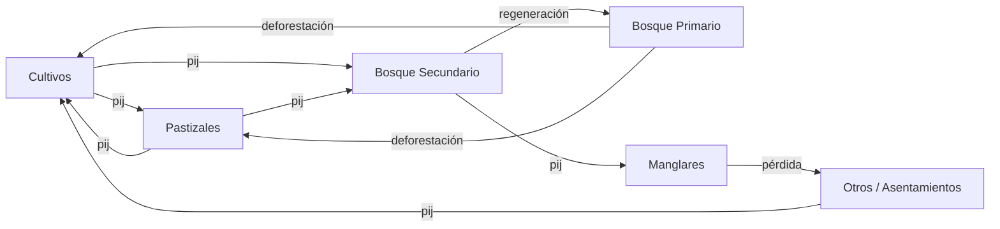

# AFOLU: Agricultura, Silvicultura y Otros Usos de la Tierra

<SectorCard sector="afolu" />

Bienvenido a la Parte III. AFOLU es el más extenso e intrincado de los cuatro sectores de emisiones de SISEPUEDE: acopla un modelo de uso del suelo de Markov en tiempo discreto con una demanda agrícola y ganadera responsiva, dinámicas de carbono en el suelo con rezagos plurianuales, y una red de flujos biogénicos de CH₄ y N₂O. Internamente, el sector está representado por la clase `AFOLU` en `sisepuede/models/afolu.py`, un módulo de ~5,500 líneas que orquesta seis subsectores.

## Los seis subsectores de AFOLU

SISEPUEDE descompone AFOLU en seis subsectores estrechamente acoplados. Cada uno cuenta con su propia rutina `_initialize_subsector_vars_*` y su propia tabla de atributos, pero se proyectan conjuntamente porque la demanda, el área y los flujos de biomasa cruzan las fronteras entre subsectores en cada paso temporal.

| Código | Nombre | Cubre |
|---|---|---|
| **AGRC** | Agricultura | Producción de cultivos, residuos, cultivo de arroz (CH₄), N₂O por fertilización, factores de combustión de cultivos |
| **LVST** | Ganadería | Poblaciones animales, fermentación entérica (CH₄), demanda de pastoreo, comercio derivado de ganadería |
| **LNDU** | Uso del suelo | Matrices de transición de Markov entre clases de uso del suelo, reasignación LURF, emisiones por cambio de uso del suelo |
| **FRST** | Silvicultura | Existencias de carbono en biomasa por clase forestal (primario, secundario, manglares), flujos de captura y deforestación |
| **LSMM** | Manejo de Estiércol Ganadero | CH₄ y N₂O del estiércol según sistema de manejo, recuperación de biogás |
| **SOIL** | Manejo de Suelos | Reservorios de carbono orgánico del suelo (SOC), N₂O directo/indirecto de suelos manejados |

No existe un subsector separado de "residuos agrícolas/ganaderos"; los flujos de residuos se reparten entre **AGRC** (residuos de cultivos quemados o dejados en campo) y **LSMM** (estiércol). El subsector de Manejo de Estiércol Ganadero cumple ese rol.

## El modelo de Markov de uso del suelo

LNDU es la columna vertebral estructural de AFOLU. La tierra se particiona en un conjunto reducido de categorías (cultivos, pastizales, bosque primario, bosque secundario, manglares, humedales, asentamientos, otros). Entre periodos consecutivos, el área se mueve entre categorías según una **matriz anual de probabilidad de transición** `pij`, donde la entrada `(i, j)` es la probabilidad de que una hectárea actualmente en la clase `i` esté en la clase `j` el siguiente año.

SISEPUEDE utiliza dos variantes de esta matriz:

1. **Matriz de transición no ajustada** — la matriz exógena leída desde la plantilla de entrada (campos `lndu_prob_transition_X_to_Y`). Codifica la trayectoria "natural" o de nivel de escenario del uso del suelo antes de cualquier respuesta endógena.
2. **Matriz de transición ajustada** — la matriz efectivamente aplicada en cada paso temporal, después de reescalar las filas para que el área realizada en cultivos y pastizales coincida con la demanda endógena de AGRC y LVST.

Matemáticamente, si `x_t` es el vector de áreas de tierra entre categorías en el tiempo `t`, entonces:

$$ x_{t+1} = x_t^\top \cdot P_t $$

donde `P_t` es la matriz de transición (posiblemente variable en el tiempo) para ese año. El código implementa esto en `AFOLU.project_land_use()` (línea 4566) y lo integra con la demanda en `AFOLU.project_integrated_land_use()` (línea 4124).

## LURF — el Factor de Reasignación de Uso del Suelo

La matriz de Markov es exógena, pero **la demanda de cultivos y la demanda ganadera son endógenas**: responden al PIB, al PIB per cápita, a la población y al comercio dentro del mismo paso temporal. Esto crea un problema de consistencia: la matriz exógena `pij` puede enviar (digamos) 2 Mha hacia cultivos, pero la demanda endógena puede requerir solo 1.5 Mha. ¿Cuál señal prevalece?

La respuesta de SISEPUEDE es el **Factor de Reasignación de Uso del Suelo**, denotado η y restringido al intervalo unitario η ∈ [0, 1]. Se almacena como el campo de variable `lndu_reallocation_factor` y se aplica por paso temporal.

Conceptualmente:

- **η = 0** → la matriz de transición exógena es vinculante. La tierra se mueve exactamente como prescribe `pij`, y cualquier exceso o déficit relativo a la demanda endógena se absorbe mediante cambios de rendimiento, importaciones o demanda insatisfecha. Este es el régimen "dominado por escenario".
- **η = 1** → la demanda endógena es vinculante. La matriz de transición se reescala fila por fila para que las áreas realizadas de cultivos y pastizales coincidan exactamente con las áreas requeridas para satisfacer la demanda doméstica de cultivos y ganadería a los rendimientos prevalentes. Este es el régimen "dominado por la demanda".
- **0 < η < 1** → una combinación convexa. La matriz ajustada está ponderada por η entre la matriz exógena no ajustada y la matriz totalmente reconciliada con la demanda.

LURF es la perilla más importante de AFOLU para reconciliar narrativas de escenario top-down (p. ej. "reforestación de 3 Mha para 2050") con la demanda de commodities bottom-up. Establecer η demasiado alto puede hacer matemáticamente inalcanzables las metas de reforestación; establecerlo demasiado bajo puede llevar a oscilaciones implausibles de rendimiento o importaciones. En la práctica, las calibraciones país suelen usar η ≈ 0.5–0.8.

La implementación reside dentro del bucle de proyección integrada y se propaga a través de todos los cálculos dependientes del área aguas abajo (existencias de biomasa, carbono del suelo, residuos).

## Demanda responsiva de cultivos y ganadería

La demanda en AFOLU no es una trayectoria fija. El método `project_agrc_lvst_integrated_demands()` (línea 3763) y su auxiliar `project_per_capita_demand()` (línea 4075) calculan la demanda doméstica de cada clase de cultivo y cada clase de ganado en función de:

- **Población** — un multiplicador directo sobre la demanda per cápita.
- **PIB y PIB per cápita** — escalamiento dirigido por elasticidades. Los commodities elásticos al ingreso (carne, lácteos) escalan más rápido que los básicos (cereales, tubérculos).
- **Comercio** — importaciones y exportaciones netas por commodity, que generan una brecha entre producción y consumo.

Las poblaciones ganaderas `lvst_pop_*` se resuelven luego de manera inversa a partir de la demanda de carne/leche/huevo y de los factores de productividad. Estas poblaciones alimentan directamente los cálculos de LSMM (estiércol) y de fermentación entérica.

## Fermentación entérica, estiércol, arroz, residuos, fertilizantes

Las rutas de emisión de AFOLU siguen las Directrices del IPCC 2006 + el Refinamiento 2019:

- **Fermentación entérica (CH₄)** — factores de emisión por cabeza por clase de ganado, aplicados a las poblaciones LVST. El ganado bovino domina.
- **Manejo de estiércol (CH₄ + N₂O)** — LSMM divide el estiércol entre sistemas de manejo (pastura, almacenamiento sólido, lodo líquido, digestores anaerobios). La recuperación de biogás se rastrea mediante `lsmm_recovered_biogas` y `lsmm_rf_biogas`.
- **Cultivo de arroz (CH₄)** — `agrc_yf_yield_rice` alimenta el CH₄ de arrozales inundados con factores de escalamiento por manejo del agua y enmiendas orgánicas.
- **Residuos de cultivos** — AGRC calcula la masa de residuos por cultivo a partir de rendimientos e índices de cosecha, luego la divide entre quemados / dejados en campo / removidos. La combustión utiliza `modvar_agrc_combustion_factor`.
- **N₂O por fertilizantes y suelos manejados** — SOIL calcula el N₂O directo por insumos sintéticos + orgánicos de N y el N₂O indirecto por volatilización y lixiviación, según los valores por defecto Tier 1 del IPCC salvo que se sobrescriban.

## Carbono orgánico del suelo con rezagos temporales

El SOC no es instantáneo. Cuando la tierra transita entre clases, o cuando cambia el manejo (p. ej. labranza convencional → labranza cero), la existencia de carbono del suelo se mueve hacia un nuevo estado estacionario **a lo largo de 20 años** por convención del IPCC. SISEPUEDE representa esto con reservorios rezagados que abarcan LNDU, AGRC y LVST: cada hectárea-año carga una memoria de su estado previo, y las emisiones/remociones se liberan linealmente a lo largo del horizonte de transición.

Por eso las salidas de AFOLU en los primeros años de una simulación pueden verse "pegajosas": la respuesta del SOC a un escenario de cambio de uso del suelo solo se materializa plenamente ~dos décadas después.

## Silvicultura: primario, secundario, manglares

FRST rastrea el carbono en biomasa por clase forestal: `$CAT-FOREST$` típicamente incluye `primary`, `secondary` y `mangroves`. Cada clase tiene su propia:

- Densidad de biomasa (sobre + bajo el suelo)
- Tasa de captura (captura neta anual de carbono por hectárea)
- Factor de emisión por cosecha / deforestación

Las transiciones **hacia** bosque secundario (desde abandono de cultivos o pastizales) son la principal palanca de reforestación. Las transiciones **fuera** del bosque primario son deforestación, con la existencia completa de biomasa liberada como CO₂ (más pulsos de CH₄/N₂O por quema si aplica). Los manglares se modelan por separado debido a su densidad de carbono por hectárea desproporcionada y a sus impulsores de pérdida distintos. Los productos forestales recolectados se contabilizan en `project_harvested_wood_products()` (línea 4650).

## Métodos clave de `AFOLU`

| Método | Línea | Rol |
|---|---|---|
| `project()` | 5180 | Punto de entrada de alto nivel invocado por `SISEPUEDEModels`. Ejecuta el pipeline completo de AFOLU para todos los periodos. |
| `project_integrated_land_use()` | 4124 | Acopla el uso del suelo de Markov con la demanda endógena AGRC/LVST mediante LURF. |
| `project_land_use()` | 4566 | Aplica la matriz de transición (ajustada) para producir los vectores de área del siguiente periodo. |
| `project_agrc_lvst_integrated_demands()` | 3763 | Resuelve la demanda doméstica de cultivos y ganadería dados PIB, población, comercio. |
| `project_per_capita_demand()` | 4075 | Escalamiento per cápita de demanda dirigido por elasticidades. |
| `project_harvested_wood_products()` | 4650 | Contabilidad del reservorio de carbono HWP según IPCC Tier 1. |

Todos estos toman el DataFrame de entrada en formato ancho producido en la Fase 5 del pipeline de ejecución y devuelven arreglos que eventualmente se ensamblan en `MODEL_OUTPUT`.

<Quiz>
  <Question q="¿Qué controla el Factor de Reasignación de Uso del Suelo (LURF) η ∈ [0,1]?">
    - [ ] La proporción de tierra de cultivo que puede ser irrigada.
    - [x] El balance entre la matriz exógena de transición de Markov y la demanda endógena de cultivos/ganadería al fijar las áreas realizadas de uso del suelo.
    - [ ] La fracción de biomasa forestal liberada como CO₂ tras la deforestación.
    - [ ] La elasticidad de la demanda ganadera respecto al PIB per cápita.
  </Question>
  <Question q="¿Cuál de los siguientes NO es uno de los seis subsectores AFOLU de SISEPUEDE?">
    - [ ] AGRC
    - [ ] LSMM
    - [ ] SOIL
    - [x] WASO (residuos sólidos)
  </Question>
  <Question q="¿Por qué las respuestas del carbono orgánico del suelo (SOC) ante un cambio de uso del suelo se ven 'pegajosas' en los primeros años de una simulación?">
    - [ ] Porque el SOC se calcula solo cada 10 años.
    - [x] Porque la metodología del IPCC distribuye las transiciones de SOC a lo largo de un horizonte de ~20 años, por lo que los cambios de existencias se acumulan lentamente en reservorios rezagados compartidos entre LNDU, AGRC y LVST.
    - [ ] Porque el solver de Julia almacena en caché el SOC entre corridas.
    - [ ] Porque el SOC se trata como exógeno hasta 2050.
  </Question>
</Quiz>
