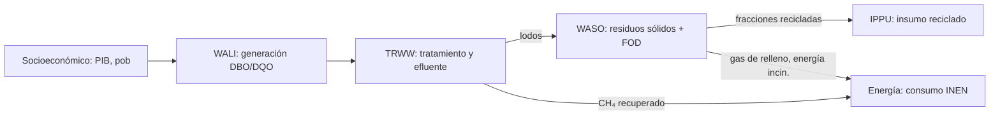

<SectorCard sector="ce" />

# Economía Circular: Residuos y Aguas Residuales

El sector de **Economía Circular** en SISEPUEDE es un dominio de emisiones compacto pero consecuente: captura las emisiones de metano y óxido nitroso provenientes de la forma en que las sociedades disponen de aquello que ya no quieren. A pesar de representar una fracción menor de las emisiones totales que AFOLU o Energía en la mayoría de los países, los residuos y las aguas residuales tienen un impacto desproporcionado porque el CH₄ tiene un GWP100 de ~27–30 (AR6 WG1 Cap.7, Tabla 7.SM.7) y las emisiones de los rellenos sanitarios persisten durante décadas después del depósito. El sector está implementado en `sisepuede/models/circular_economy.py` como la clase `CircularEconomy`, y sigue las **Directrices del IPCC 2006 Volumen 5 (Residuos)** con el Refinamiento 2019.

Este módulo recorre los tres subsectores — **Residuos Líquidos (WALI)**, **Tratamiento de Aguas Residuales (TRWW)** y **Residuos Sólidos (WASO)** —, explica el orden de ejecución, introduce el modelo de Decaimiento de Primer Orden (FOD) para rellenos sanitarios, y muestra cómo los flujos de reciclaje retroalimentan a IPPU.

---

## Subsectores de un vistazo

| Subsector | Código | Alcance | Gases principales |
|---|---|---|---|
| Residuos Líquidos | `wali` | Generación de aguas residuales domésticas e industriales (cargas de DBO/DQO) | CH₄, N₂O |
| Tratamiento de Aguas Residuales | `trww` | Rutas de tratamiento (aerobio, anaerobio, séptico, letrina, sin tratar) | CH₄, N₂O |
| Residuos Sólidos | `waso` | Disposición de RSU + RSI: relleno sanitario, basurero abierto, compostaje, digestión anaerobia, incineración, reciclaje | CH₄, N₂O, CO₂ |
| Energía Industrial (traslape) | `inen` | Energía recuperada del gas de relleno / incineración enrutada al sector Energía | — |

INEN no es propiamente un subsector de Economía Circular —reside en Consumo de Energía— pero CircularEconomy **emite variables consumidas por INEN**, notablemente la `Fracción de Gas de Relleno Sanitario Recuperado para Energía` (`modvar_waso_frac_landfill_gas_ch4_to_energy`) y las fracciones de recuperación energética por incineración para RSU y RSI. Estas cierran el ciclo al convertir los subproductos del sector residuos en un insumo de combustible para INEN.

---

## Orden de ejecución: WALI → TRWW → WASO (→ INEN)

`CircularEconomy.project(df_ce_trajectories)` (línea 2204) ejecuta los subsectores en un orden fijo dictado por dependencias físicas:

En código, `project()` invoca:

1. `model_socioeconomic.project()` — extrae los escalares de PIB y población que impulsan las cargas per cápita de DBO y por PIB de DQO.
2. `project_waste_liquid(...)` (línea 981) — ejecuta **WALI y TRWW conjuntamente**. Calcula los residuos orgánicos totales (TOW) a partir de la DBO doméstica y la DQO industrial, los distribuye entre rutas de tratamiento, y aplica los factores de emisión de CH₄/N₂O. El lodo producido durante el tratamiento es una salida lateral.
3. Extrae `modvar_trww_sludge_produced` mediante `get_optional_or_integrated_standard_variable()` y lo concatena al frame de entrada para WASO.
4. `project_waste_solid(...)` (línea 1573) — ejecuta WASO con el lodo como flujo adicional de residuo, luego aplica el modelo FOD para rellenos sanitarios.
5. `merge_output_df_list(...)` y `add_subsector_emissions_aggregates(...)` ensamblan la salida en formato ancho.

Nótese una pequeña asimetría respecto a la abreviatura de la docstring de AFOLU: WALI y TRWW están **implementados dentro del mismo método** (`project_waste_liquid`) porque la carga orgánica (WALI) y el enrutamiento del tratamiento (TRWW) son numéricamente inseparables: los factores de emisión de TRWW multiplican directamente el TOW generado por WALI. El curso menciona `project_wali()` / `project_trww()` conceptualmente; en la práctica son una sola función de Python.

---

## WALI: Generación de Residuos Líquidos

WALI calcula dos flujos paralelos:

- **Aguas residuales domésticas** — impulsadas por la carga per cápita de DBO (`modvar_wali_bod_per_capita`), un factor de corrección por descargas industriales (`modvar_wali_bod_correction`) y la población. La DBO (Demanda Bioquímica de Oxígeno) es el proxy por defecto del IPCC para la carga orgánica doméstica.
- **Aguas residuales industriales** — impulsadas por la DQO por unidad de PIB (`modvar_wali_cod_per_gdp`) desagregada por categoría industrial. La DQO (Demanda Química de Oxígeno) es el valor por defecto del IPCC para flujos industriales porque captura mejor los compuestos orgánicos no biodegradables.

La capacidad máxima de producción de CH₄ de cada flujo se establece mediante `modvar_wali_max_bod_capac` y `modvar_wali_max_cod_capac` (Bo en notación del IPCC; por defecto ~0.6 kg CH₄/kg DBO, 0.25 kg CH₄/kg DQO). Los parámetros de coemisión de fósforo (`modvar_wali_param_p_per_bod`, `..._p_per_cod`) se rastrean para la contabilidad de eutrofización aunque no contribuyen a los totales de GEI.

---

## TRWW: Tratamiento de Aguas Residuales

El tratamiento toma el TOW generado por WALI y lo asigna entre rutas: lodo activado aerobio, laguna anaerobia, fosa séptica, letrina, alcantarilla abierta, descarga sin tratar. Cada ruta tiene un **Factor de Corrección de Metano** (MCF, `modvar_trww_mcf`) ∈ [0,1] según IPCC 2006 Vol 5 Cap.6 Tabla 6.3: 0 para plantas aerobias bien gestionadas, hasta 0.8 para lagunas anaerobias.

CH₄ por ruta:

$$
E_{CH_4} = (TOW - S) \cdot B_o \cdot MCF - R
$$

donde `S` es el lodo removido y `R` es el metano recuperado enrutado a energía. El N₂O se calcula por separado a partir de la **carga de nitrógeno del efluente** usando `modvar_trww_ef_n2o_wastewater_treatment` y un factor de efluente (valor por defecto del IPCC de 0.005 kg N₂O-N / kg N para efluente). El código expone `modvar_trww_emissions_n2o_treatment` (interno de la planta) y `modvar_trww_emissions_n2o_effluent` (cuerpo receptor aguas abajo) por separado, una distinción útil que muchos inventarios nacionales colapsan.

El lodo producido (`modvar_trww_sludge_produced`) sale de TRWW y entra a WASO como una categoría adicional de residuo, honrando el principio de balance de masa de que los sólidos del agua residual eventualmente terminan en un relleno sanitario, una pila de compostaje o un incinerador.

---

## WASO: Residuos Sólidos y el modelo de Decaimiento de Primer Orden

WASO es el más grande de los tres subsectores y donde se origina la mayor parte de las emisiones del sector CE. `project_waste_solid()` maneja:

1. **Generación de residuos** — RSU per cápita (Residuos Sólidos Urbanos) y RSI por PIB (Residuos Sólidos Industriales) por categoría de residuo (alimentos, papel, madera, textiles, plásticos, metales, vidrio, hule, otros).
2. **Asignación de rutas** — reciclados, compostados, digeridos anaeróbicamente, incinerados, dispuestos en relleno, en basurero abierto. Las fracciones de reciclaje se especifican por material, p. ej. `waso_frac_recycled_paper`, `waso_frac_recycled_metal`. El residual no reciclado se divide entre incineración / relleno / basurero abierto mediante `modvars_waso_frac_non_recyled_pathways`.
3. **Emisiones**:
   - Compostaje: CH₄ y N₂O (`modvar_waso_ef_n2o_compost`, con captura de CH₄ por quemado `modvar_waso_frac_ch4_flared_composting`).
   - Digestión anaerobia: CH₄ con recuperación de biogás (`modvar_waso_frac_biogas`).
   - Incineración: CO₂ fósil (de plásticos/hule/textiles) + N₂O (`modvar_waso_ef_n2o_incineration`); las fracciones de recuperación energética dividen RSU vs RSI.
   - Relleno sanitario: **Decaimiento de Primer Orden** (ver abajo).
   - Basurero abierto: FOD aplicado con `modvar_waso_mcf_open_dumping_average` (típicamente 0.4–0.8 dependiendo de la profundidad).

### El modelo FOD

Los rellenos sanitarios no emiten el año en que el residuo es depositado: emiten a lo largo de décadas conforme el carbono orgánico se descompone anaeróbicamente. El método `CircularEconomy.fod()` (línea 562) implementa el Decaimiento de Primer Orden de IPCC 2006 Vol 5 Cap.3:

$$
DDOCm_{decomposed,t} = DDOCm_{accumulated,t-1} \cdot (1 - e^{-k})
$$

donde:
- `DDOCm` = masa de Carbono Orgánico Degradable Descomponible = residuo × DOC × DOCf (el argumento `vec_ddocm_factors`, línea 578).
- `k` = tasa de decaimiento por categoría de residuo (lenta para madera ~0.03 año⁻¹, rápida para alimentos ~0.185 año⁻¹ en climas tropicales húmedos).
- `MCF` (`vec_mcf`) pondera las emisiones por la calidad de manejo del relleno, variable en el tiempo para representar transiciones de basureros abiertos a rellenos sanitarios ingenierizados.

El CH₄ emitido equivale a `DDOCm_decomposed · F · 16/12`, donde `F` es la fracción de CH₄ en el gas de relleno (por defecto 0.5). La clase de excepción `FODError` (línea 19) protege contra discordancias de forma entre el arreglo de residuos por tiempo, los factores por categoría y el vector MCF variable en el tiempo.

El gas de relleno recuperado (`modvar_waso_frac_landfill_gas_ch4_to_energy`) se sustrae de la emisión neta y se exporta como fuente de combustible a INEN.

---

## Acoplamiento intersectorial

La retroalimentación CircularEconomy → IPPU es uno de los enlaces intersectoriales más claros de SISEPUEDE. La producción de material virgen de IPPU (cemento, acero, aluminio, plásticos, vidrio, papel) se reduce en la fracción reciclada producida en WASO. En `SISEPUEDEModels` (`sisepuede/manager/sisepuede_models.py`), IPPU corre **después** de CircularEconomy específicamente para poder leer `modvar_waso_waste_total_recycled` y las fracciones recicladas por material, escalando hacia abajo los factores de emisión de producción virgen en consecuencia.

Esto significa: un transformador que incrementa `waso_frac_recycled_paper` reduce las emisiones de proceso de IPPU en pulpa y papel sin ninguna palanca explícita del lado de IPPU. Téngase esto presente al componer estrategias: el doble conteo es fácil de introducir al combinar transformadores de reciclaje WASO con transformadores de reducción virgen IPPU que asumen la tasa de reciclaje de línea base.

---

## Resumen de métodos clave

| Método | Línea del archivo | Rol |
|---|---|---|
| `CircularEconomy.project()` | 2204 | Orquesta WALI+TRWW y luego WASO; agrega totales por subsector |
| `project_waste_liquid()` | 981 | WALI + TRWW conjuntos; devuelve TOW, emisiones de tratamiento, lodo |
| `project_waste_solid()` | 1573 | WASO incluyendo el modelo FOD para rellenos sanitarios |
| `fod()` | 562 | Kernel FOD del IPCC (decaimiento DDOCm, k por categoría, MCF variable en el tiempo) |
| `project_protein_consumption()` | 865 | Alimenta la carga doméstica de N para el N₂O de aguas residuales |

---

<Quiz>
  <Question prompt="¿Por qué SISEPUEDE corre CircularEconomy antes que IPPU en SISEPUEDEModels?">
    <Choice correct>IPPU lee las fracciones de material reciclado de la salida de WASO para escalar hacia abajo los factores de emisión de producción virgen.</Choice>
    <Choice>IPPU depende del N₂O de aguas residuales para la contabilidad de producción de fertilizantes.</Choice>
    <Choice>El orden es arbitrario; cualquier orden produce la misma salida.</Choice>
    <Choice>IPPU necesita el metano de relleno como insumo de proceso.</Choice>
  </Question>
  <Question prompt="En el modelo FOD para rellenos sanitarios, ¿qué representa el MCF (Factor de Corrección de Metano)?">
    <Choice>La fracción del gas de relleno que es CH₄ versus CO₂.</Choice>
    <Choice correct>El grado en que el sitio de disposición promueve condiciones anaerobias — 1.0 para rellenos anaerobios manejados, menor para basureros abiertos poco profundos.</Choice>
    <Choice>La constante de tasa de decaimiento k para cada categoría de residuo.</Choice>
    <Choice>La masa de carbono orgánico descomponible por tonelada de residuo.</Choice>
  </Question>
  <Question prompt="¿Por qué WALI y TRWW se implementan en un solo método, `project_waste_liquid()`, en lugar de por separado?">
    <Choice>Accidente histórico; serán divididos en una refactorización futura.</Choice>
    <Choice>Las emisiones de WALI ocurren solo dentro de las plantas de tratamiento.</Choice>
    <Choice correct>El TOW generado por WALI es numéricamente inseparable de la asignación de rutas TRWW y los factores de emisión basados en MCF; dividirlos duplicaría los arreglos de asignación.</Choice>
    <Choice>TRWW no produce emisiones propias.</Choice>
  </Question>
</Quiz>
