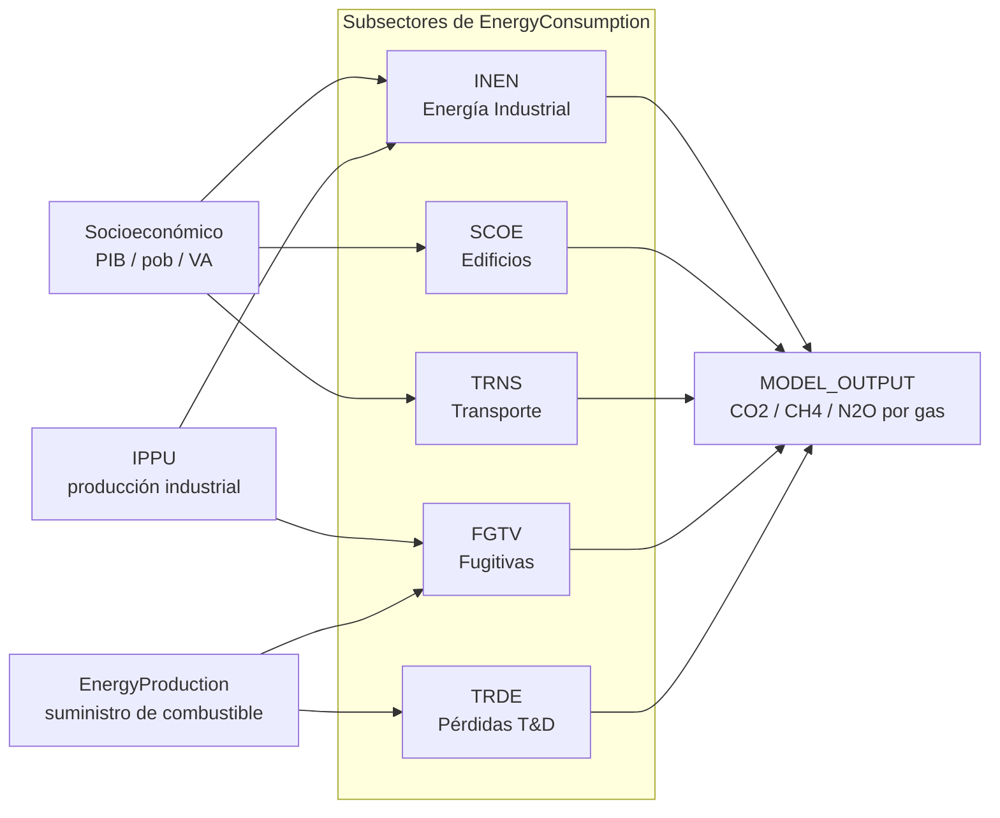

<SectorCard sector="energy" />

# Consumo de Energía: Subsectores del Lado de la Demanda

La clase `EnergyConsumption` (`sisepuede/models/energy_consumption.py`) es la mitad del lado de la demanda del sistema energético de SISEPUEDE. Mientras que `EnergyProduction` (Módulo 10) resuelve un programa lineal de Julia/NeMo-Mod para la mezcla de suministro de electricidad y combustibles, `EnergyConsumption` calcula **cuánta energía útil necesita cada sector**, **qué combustibles la entregan**, y las **emisiones directas de combustión** que resultan.

Ejecuta cinco pipelines de subsector orquestados por `EnergyConsumption.project()`, que despacha a su vez a:

- `project_fugitive_emissions()` — **FGTV**
- `project_industrial_energy()` — **INEN**
- `project_scoe()` — **SCOE**
- `project_transportation()` + `project_transportation_demand()` — **TRNS / TRDE**
- `project_ccsq()` — energía de captura de carbono (auxiliar, no es uno de los cinco subsectores de demanda)

Los cinco comparten un patrón estructural común: un **impulsor de actividad** (extraído de `Socioeconomic`, `AFOLU`, `IPPU` o `CircularEconomy`) se multiplica por una **intensidad energética**, luego se desagrega entre combustibles mediante un **vector simplex de mezcla de combustibles**, y finalmente se convierte a emisiones mediante factores de combustión indexados por `enfu`.

## Los cinco subsectores de un vistazo



## La mezcla de combustibles como simplex

La idea estructural más importante en `EnergyConsumption` es que **las mezclas de combustibles son variables simplex**: para cualquier categoría que utiliza energía `c`, las fracciones de demanda satisfechas por cada combustible `f` deben cumplir

$$\sum_{f \in \mathrm{enfu}} \mathrm{frac\_fuel\_consumed}_{c,f} = 1, \quad \mathrm{frac} \in [0,1].$$

Cada una de estas familias de fracciones se declara como un único `variable_trajectory_group` en el archivo de plantilla, de modo que **`SamplingUnit`** (Módulo 7) las perturba conjuntamente sobre el simplex —nunca de manera independiente. Ejemplos:

- `inen_frac_fuel_consumed_cement_natural_gas`, `inen_frac_fuel_consumed_cement_coal`, `inen_frac_fuel_consumed_cement_electricity`, … → suman 1 a través de `enfu` para la industria del `cement`.
- `scoe_frac_heat_en_residential_electricity`, `scoe_frac_heat_en_residential_natural_gas`, … → mezcla de combustibles para calefacción residencial.
- `trns_fuel_fraction_road_light_electricity`, `trns_fuel_fraction_road_light_gasoline`, `trns_fuel_fraction_road_light_diesel`, … → mezcla de combustibles para transporte vial ligero.

Cuando se construye un transformador como `tx_trns_electrify_road_light`, se está **desplazando masa sobre este simplex** — incrementando la fracción de electricidad mientras se decrementan las demás proporcionalmente. El auxiliar `_baselib_energy` contiene las rutinas de renormalización utilizadas por la biblioteca de transformadores para que, sin importar cuántas fracciones se perturben, la restricción del simplex se preserve antes de que el DataFrame llegue siquiera a `EnergyConsumption.project()`.

## INEN — Energía Industrial

`project_industrial_energy()` (línea 2757) calcula la demanda de energía para cada categoría industrial en `$CAT-INDUSTRY$` (cemento, químicos, hierro_acero, papel, vidrio, alimentos, textiles, …). Existen dos regímenes:

1. **Industrias enlazadas con IPPU** (cemento, hierro_acero, químicos, papel, …): el tonelaje de producción física proviene directamente de la salida del modelo `IPPU` — típicamente `ippu_produced_tonne_cement`, `ippu_produced_tonne_iron_steel`, etc. INEN multiplica esto por `inen_en_prod_intensity_factor_{industry}_{fuel}` para obtener la demanda de energía específica por combustible (TJ/tonelada de producto).
2. **Industrias por valor agregado** (otra_industria, minería, construcción): la demanda escala con el valor agregado de la industria proveniente de `Socioeconomic` (`econ_va_{industry}_mmm_usd`) multiplicado por `inen_energy_demand_intensity_factor_{industry}`.

En ambos regímenes, la demanda energética por categoría resultante se divide entre combustibles por el simplex `inen_frac_fuel_consumed_{industry}_{fuel}`, luego se multiplica por los factores de emisión por combustión (`enfu_ef_combustion_stationary_co2`, `_ch4`, `_n2o`) de la tabla de atributos de combustibles. INEN también **reporta la demanda de combustible de regreso** a `EnergyProduction` para que la adecuación del suministro de combustible aguas abajo sea verificada.

## SCOE — Combustión Estacionaria y Otra Energía (Edificios)

`project_scoe()` (línea 3149) cubre edificios comerciales y residenciales. Los impulsores de actividad provienen de `Socioeconomic`:

- Residencial: `gnrl_occupancy_{cat}` × superficie ocupada per cápita × población.
- Comercial: valor agregado sectorial × superficie comercial por MMM USD.

Cuatro servicios de uso final se modelan explícitamente: **calefacción**, **cocción**, **iluminación** y **electrodomésticos/otros**. Cada uno tiene su propia intensidad (`scoe_consumpinit_energy_per_hh_heat`, `scoe_consumpinit_energy_per_hh_cook`, …) y su propio simplex de mezcla de combustibles. La calefacción y la cocción son los servicios dominantes en emisiones directas (gas natural, GLP, biomasa); la iluminación y los electrodomésticos son efectivamente electricidad pura, por lo que sus emisiones se atribuyen aguas arriba a `EnergyProduction`.

El subsector también impone **derivas de eficiencia** mediante `scoe_eff_heat_en_{cat}_{fuel}` — p. ej. un transformador de caldera de condensación incrementa el coeficiente de eficiencia sobre `natural_gas` para calefacción residencial, reduciendo los TJ por hogar sin cambiar la fracción de mezcla de combustibles.

## TRNS — Transporte

`project_transportation()` (línea 3543) es el subsector estructuralmente más complejo, organizado como un tensor **modo × tecnología vehicular × combustible**.

- **Modos** (`$CAT-TRANSPORTATION$`): `road_light`, `road_heavy_freight`, `road_heavy_passenger`, `rail_freight`, `rail_passenger`, `aviation`, `water_borne`, `public`.
- **Tecnologías vehiculares** (`$CAT-TRANSPORTATION-DEMAND$` / registro vehicular): composición de flota por modo.
- **Combustibles** (`enfu`): gasolina, diésel, electricidad, hidrógeno, gas_natural, biocombustibles, queroseno, fuel_oil.

La demanda (`project_transportation_demand()`, línea 4134) se calcula primero en unidades de servicio — pasajero-km (`trns_vehdist_pkm_lightduty`, `trns_vehdist_pkm_public`) y tonelada-km (`trns_vehdist_tkm_road_heavy_freight`, `trns_vehdist_tkm_rail_freight`) — impulsada por la población, las elasticidades de PIB/cápita y la intensidad del PIB en carga.

La demanda de servicio se convierte luego a energía mediante:

1. Un simplex de **partición modal** (qué fracción de pkm va a vial ligero vs. público vs. ferrocarril).
2. Un simplex de **mezcla de combustibles** por modo (`trns_fuel_fraction_road_light_{fuel}`).
3. Un **consumo específico de combustible** `trns_average_vehicle_energy_consumption_{mode}_{fuel}` en MJ/vkm — el coeficiente de eficiencia.

El término de eficiencia es lo que aprovechan los transformadores de electrificación: un tren motriz eléctrico tiene aproximadamente un tercio de los MJ/vkm que un equivalente de combustión interna, por lo que desplazar masa simplex hacia electricidad reduce la demanda final de energía **y** lleva a cero el CO₂/CH₄/N₂O directo de tubo de escape de `enfu_ef_combustion_mobile_*` para esa fracción.

## FGTV — Emisiones Fugitivas

`project_fugitive_emissions()` (línea 2408) maneja las emisiones que escapan *antes* de la combustión: venteo/quema/fugas de petróleo y gas, y metano de minería de carbón. La actividad es del **lado del suministro**: extrae los volúmenes de producción de combustible desde las estimaciones de producción `enfu` (calculadas por `project_enfu_production_and_demands()` en la línea 1959, que reconcilia la demanda de INEN + SCOE + TRNS + sector eléctrico con la producción doméstica e importaciones).

Campos de variables centrales:

- `entc_ef_fugitive_fuel_ch4_{fuel}`, `entc_ef_fugitive_fuel_co2_{fuel}` — factores fugitivos por unidad para gas_natural, petróleo, carbón.
- `entc_frac_{fuel}_flared`, `entc_frac_{fuel}_vented` — partición entre quema y venteo para gas asociado de petróleo y gas.

Aquí es exactamente donde interviene el transformador `TFR:FGTV:INC_GAS_RECOVERY`: reduce la fracción de gas venteado y redirige el metano capturado al flujo de suministro de `natural_gas`. El metano de la minería de carbón se maneja en una rama separada impulsada por `enfu_production_frac_coal_surface` vs. subterráneo, con el factor de CH4 subterráneo aproximadamente un orden de magnitud mayor.

## TRDE — Transmisión y Distribución

TRDE es el subsector más delgado: pérdidas de redes de electricidad y gas, modeladas como un sobrecosto fraccional sobre la energía entregada. `trde_loss_frac_electricity_transmission` y `trde_loss_frac_natural_gas_distribution` se aplican durante `project_enfu_production_and_demands()` para que la demanda de combustible pasada a `EnergyProduction` esté incrementada por las pérdidas. Las emisiones directas atribuibles a TRDE (SF6 de equipo de conmutación, CH4 fugitivo de tuberías de distribución) se añaden de regreso desde tablas pequeñas de FE.

## El orquestador

`EnergyConsumption.project()` (línea 4299) corre los subsectores en el orden:

```python
# 1. resolver impulsores de demanda desde modelos aguas arriba (Socioeconomic, IPPU)
# 2. INEN, SCOE, TRNS → demanda final de combustible por combustible
# 3. project_enfu_production_and_demands() → reconciliar demanda vs. suministro
# 4. FGTV (necesita suministro), TRDE (necesita volúmenes entregados)
# 5. CCSQ (energía de captura de carbono), concatenar salidas
```

Como el paso 3 reconcilia demanda y suministro, ejecutar `EnergyConsumption` de forma autónoma reportará importaciones/exportaciones como residuales; ejecutarlo dentro de `SISEPUEDEModels.project()` (Módulo 5) pasa la demanda de combustible reconciliada al LP de NeMo-Mod, que resuelve la mezcla eléctrica que la atiende.

<Quiz>
  <Question>
    ¿Qué restricción debe satisfacer toda familia de variables `inen_frac_fuel_consumed_{industry}_{fuel}`, y por qué se impone a nivel de `SamplingUnit` en lugar de en cada fracción individual?
    <Answer correct>
      Deben sumar 1 a través de todos los combustibles para cada industria (restricción simplex). Perturbar cada fracción de manera independiente bajo LHS rompería la restricción, por lo que todas las fracciones de la mezcla comparten un `variable_trajectory_group` y se perturban conjuntamente.
    </Answer>
    <Answer>
      Cada una debe ser menor que 0.5; el tope evita que un solo combustible domine.
    </Answer>
    <Answer>
      Sin restricción — cada fracción se muestrea independientemente y luego se normaliza después de que el modelo corre.
    </Answer>
  </Question>
  <Question>
    ¿Qué modelo aguas arriba provee el tonelaje de producción física que INEN utiliza para calcular la demanda de energía de la industria del cemento?
    <Answer>
      `Socioeconomic`, vía valor agregado.
    </Answer>
    <Answer correct>
      `IPPU`, vía `ippu_produced_tonne_cement`.
    </Answer>
    <Answer>
      `EnergyProduction`, vía la salida del LP de NeMo-Mod.
    </Answer>
  </Question>
  <Question>
    ¿Por qué `project_fugitive_emissions()` debe ejecutarse *después* de `project_enfu_production_and_demands()` dentro de `EnergyConsumption.project()`?
    <Answer>
      Porque las emisiones de FGTV dependen del PIB, que se calcula en ese paso.
    </Answer>
    <Answer correct>
      Porque FGTV es impulsada por la producción de combustible y los volúmenes de suministro, los cuales solo se reconcilian (demanda + pérdidas T&D + importaciones/exportaciones) dentro de `project_enfu_production_and_demands()`.
    </Answer>
    <Answer>
      No lo hace — FGTV corre primero para que el gas quemado pueda entrar al flujo de suministro.
    </Answer>
  </Question>
</Quiz>
