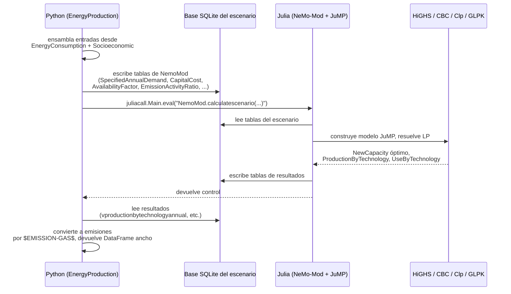

<SectorCard sector="energy" />

# Producción de Energía: el Programa Lineal en Julia/NeMo-Mod

Cualquier otro modelo sectorial en SISEPUEDE es, en su núcleo, un motor de contabilidad: multiplicar una actividad por un factor de emisión, aplicar una refinación de las Directrices del IPCC 2006, sumar a través de categorías. `EnergyProduction` es distinto. La generación eléctrica — a diferencia de los hornos de cemento, la fermentación entérica o el metano de rellenos sanitarios — no es una cantidad que pueda leerse de una hoja de cálculo. Es el *resultado de una decisión de despacho* tomada contra un portafolio de plantas generadoras, cada una con su propio costo de combustible, eficiencia, restricciones de rampa y factor de disponibilidad. No se puede derivar la matriz de generación a partir de actividad × factor; hay que **resolverla**.

Por eso `EnergyProduction` (`sisepuede/models/energy_production.py`) es un envoltorio delgado de Python alrededor de un **Programa Lineal** completo escrito en Julia. El LP es resuelto por [**NeMo-Mod**](https://sei-international.github.io/NemoMod.jl/stable/) (Next-generation Energy Modeling system for Optimization), un modelo de código abierto de expansión de capacidad y despacho desarrollado por el Stockholm Environment Institute, que a su vez se construye sobre la formulación de referencia OSeMOSYS y el lenguaje de modelado algebraico JuMP.

---

## Por qué la electricidad necesita un LP, no una tabla de factores

Considere lo que el despachador debe decidir cada hora de cada año del horizonte de proyección:

- **Qué plantas operan** (compromiso de unidades a nivel agregado)
- **Cuánto genera cada planta** (sujeto a factores de disponibilidad, límites de combustible)
- **Si construir nueva capacidad** (expansión de capacidad — inversión endógena)
- **Cuánto importar/exportar** a través de interconexiones regionales
- **Cuánto almacenamiento cargar/descargar**

Todo esto está acoplado. Construya más solar y desplaza el despacho térmico; retire carbón y puede necesitar pico-plantas de gas; agregue un precio al carbono y el orden de mérito se reordena. Ningún enfoque IPCC Tier-1/2/3 puede capturar esto — las emisiones dependen de la *solución de un problema de optimización* cuyo objetivo es el costo mínimo descontado del sistema sujeto a ecuaciones de balance de demanda, capacidad y restricciones de política.

NeMo-Mod maneja **expansión de capacidad y despacho en el mismo LP**. Las variables de decisión incluyen `NewCapacity[technology, year]`, `TotalCapacityAnnual[technology, year]` y `RateOfActivity[region, time_slice, technology, mode, year]`, todas sujetas a ecuaciones de balance de demanda referenciadas a la proyección de demanda eléctrica de SISEPUEDE.

---

## El portafolio tecnológico

Las entradas a NeMo-Mod describen cada tecnología en las tablas de atributos bajo `$CAT-TECHNOLOGY$`. El portafolio abarca:

| Clase | Tecnologías |
|---|---|
| **Térmica fósil** | Carbón (pulverizado, supercrítico), ciclo combinado de gas natural (NGCC), turbinas de gas pico, petróleo/diésel, combustión de biomasa |
| **Térmica con CCS** | Carbón+CCS, gas+CCS, biomasa+CCS (BECCS, neto-negativa) |
| **Renovable** | Solar PV (utility, distribuida), solar de concentración, eólica terrestre, eólica marina, hidro de pasada y de embalse, geotérmica, mareomotriz, undimotriz |
| **Nuclear** | LWR convencional, variantes SMR |
| **Almacenamiento / flexibilidad** | Hidro bombeada, almacenamiento por baterías, turbinas de hidrógeno |
| **Producción de combustibles** | Minería de carbón, refinación de petróleo, procesamiento de gas, GNL, amoniaco, electrólisis de hidrógeno — cada una con sus propias emisiones fugitivas/de proceso |

Note la última fila. `EnergyProduction` cubre **más que el sector eléctrico**: también computa emisiones de la **producción de combustibles** (fugitivas de minería de carbón, combustión en refinerías, procesamiento de GN, vías de producción de hidrógeno). Por eso el docstring de la clase dice: *"calculate emissions from electricity generation and fuel production."*

---

## El handshake con SQLite

Python y Julia son runtimes distintos con espacios de memoria distintos. SISEPUEDE evita mover DataFrames a través de la frontera FFI usando **SQLite como medio de intercambio**:



Cada escenario obtiene una base SQLite fresca poblada con el esquema completo de NeMo-Mod: `REGION`, `TECHNOLOGY`, `FUEL`, `EMISSION`, `YEAR`, `TIMESLICE`, más las tablas de parámetros (`CapitalCost`, `VariableCost`, `FixedCost`, `OperationalLife`, `AvailabilityFactor`, `CapacityFactor`, `EmissionActivityRatio`, `SpecifiedAnnualDemand`, `SpecifiedDemandProfile`, `ReserveMarginTagTechnology`, etcétera). Después de que `NemoMod.calculatescenario(...)` retorna, el lado Python consulta tablas de resultados que comienzan con `v` (de *variable*), como `vproductionbytechnologyannual` y `vnewcapacity`, y las pliega de regreso al esquema canónico de salida en formato ancho de SISEPUEDE.

---

## PyJulia / juliacall: un proceso Julia por corrida

SISEPUEDE usa **juliacall** (del ecosistema `PythonCall.jl` / `juliapkg`) en lugar del antiguo PyJulia. El puente se inicializa una vez, cerca del inicio de `EnergyProduction.__init__`:

```python
import juliapkg
juliapkg.require_julia("1.10.4")
# ...resolve environment at sisepuede/julia/pyjuliapkg/...
from juliacall import Main as julia_main
```

Importan dos propiedades:

1. **El runtime de Julia persiste durante toda la vida del proceso Python.** Iniciar Julia cuesta varios segundos de calentamiento JIT — se paga una vez, y luego cada llamada subsecuente a `NemoMod.calculatescenario` reutiliza los métodos compilados. Esto es crítico dentro de `SISEPUEDEExperimentalManager`, que puede llamar al LP cientos de veces para distintos valores de `primary_id`.
2. **El entorno de Julia está fijado.** `sisepuede/julia/Project.toml` lista el conjunto de dependencias — NemoMod 2.2, JuMP 1.27, HiGHS, CBC, Clp, GLPK, Ipopt, SQLite, PythonCall 0.9.25 — y `Manifest.toml` bloquea las versiones exactas. `juliapkg` reproduce este entorno en la primera importación, así que cada usuario de SISEPUEDE resuelve el LP idéntico.

El solver predeterminado es **HiGHS** (código abierto, simplex/punto interior rápido), con CBC/Clp/GLPK como respaldo; Ipopt se incluye para la extensión no lineal ocasional. Un `_SOLVER_OPTION_HIGHS_USER_BOUND_SCALE` ajustable por el usuario puede pasarse para problemas numéricamente rígidos.

---

## Las pérdidas de transmisión retroalimentan a Energy Consumption

`EnergyProduction` no modela la demanda — la demanda viene **desde** `EnergyConsumption` (SCOE, INEN, TRNS, TRDE, FGTV) y desde los drivers `Socioeconomic`. Pero una vez que el LP está resuelto, las *pérdidas* incurridas en generación y transmisión deben contabilizarse en algún lugar. SISEPUEDE rutea las pérdidas de transmisión y distribución de regreso al subsector **TRDE (Transmission, Distribution, and Exchange)** de Energy Consumption. Esto cierra el ciclo: EnergyConsumption demanda electricidad → EnergyProduction despacha plantas → las pérdidas implícitas de T&D fluyen de regreso a la contabilidad de TRDE. La demanda efectiva que el LP ve en la siguiente iteración del análisis de sensibilidad es entonces la demanda bruta incluyendo el autoconsumo y las pérdidas.

---

## `EnergyProduction.project()` en el pipeline de ejecución

Dentro de `SISEPUEDEModels.project()` (ver `sisepuede/manager/sisepuede_models.py`), Energy Production es llamado en **cuarto** lugar, después de Socioeconomic, AFOLU y CircularEconomy, y **antes** de que EnergyConsumption finalice:

1. `Socioeconomic.project()` — PIB, población, valor agregado
2. `AFOLU.project()` — oferta de biomasa, potenciales bioenergéticos
3. `CircularEconomy.project()` — contribuciones de RSU-a-energía
4. **`EnergyProduction.project()`** — resuelve el LP, devuelve la matriz de generación y emisiones
5. `EnergyConsumption.project()` — finaliza emisiones de uso final y TRDE
6. `IPPU.project()` — procesos industriales, tomando fracciones recicladas de CircularEconomy

El método `project()` mismo (línea 10641 de `energy_production.py`) acepta el DataFrame en formato ancho, escribe el SQLite del escenario, invoca a Julia, lee resultados y devuelve el DataFrame de emisiones referenciado por `$EMISSION-GAS$` × `$CAT-TECHNOLOGY$`.

---

## Archivos que vale la pena conocer

| Ruta | Rol |
|---|---|
| `sisepuede/models/energy_production.py` | Envoltorio Python: ensamblaje de entradas, escritura SQLite, invocación de Julia, cosecha de resultados |
| `sisepuede/julia/Project.toml` | Manifiesto del paquete Julia (NemoMod, JuMP, HiGHS, ...) |
| `sisepuede/julia/Manifest.toml` | Versiones de dependencias bloqueadas |
| `sisepuede/julia/call_nemomod.jl` | Punto de entrada llamado desde Python — envuelve `NemoMod.calculatescenario` |
| `sisepuede/julia/setup_analysis.jl` | Configuración Julia a nivel de escenario |
| `sisepuede/julia/setup_runs.jl` | Configuración Julia por corrida |
| `sisepuede/julia/support_functions.jl` | Auxiliares: selección de solver, logging, extracción de resultados |
| `sisepuede/julia/pyjuliapkg/meta.json` | Metadatos del entorno de juliapkg |

---

## Cuestionario

<Quiz>

**1. ¿Por qué SISEPUEDE usa un programa lineal para la generación eléctrica en lugar de factores de emisión?**

- [ ] Porque la Refinación 2019 del IPCC obliga a optimización para el sector eléctrico
- [x] Porque la matriz de generación es el resultado de una decisión de despacho + expansión de capacidad, no un producto fijo de actividad × factor
- [ ] Porque Python es demasiado lento para multiplicar matrices
- [ ] Porque los factores de emisión para plantas eléctricas no están publicados

**2. ¿Cómo intercambian Python y Julia datos de escenario en SISEPUEDE?**

- [ ] Vía una API REST sobre localhost
- [ ] Vía buffers de memoria NumPy compartidos
- [x] Vía una base SQLite — Python escribe las tablas de entrada de NeMo-Mod, Julia las lee, resuelve y escribe de regreso las tablas de resultados `v*`
- [ ] Vía DataFrames de pandas serializados con pickle a través de stdout

**3. ¿Qué le aporta `juliacall` (de PythonCall.jl) a SISEPUEDE comparado con generar un subproceso `julia` fresco por escenario?**

- [ ] Menor uso de memoria
- [ ] Acceso a solvers GPU
- [x] El runtime de Julia se mantiene caliente durante la vida del proceso Python, así que el calentamiento JIT se paga una vez y los métodos compilados de NemoMod se reutilizan a través de cientos de corridas `primary_id`
- [ ] Traducción automática de excepciones de Python a Julia

</Quiz>
</content>
</invoke>