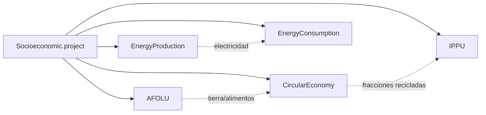

# Socioeconómico: PIB, Población y Drivers

<SectorCard sector="socio" />

El modelo Socioeconómico es el módulo más pequeño de SISEPUEDE — su clase principal, `Socioeconomic` en `sisepuede/models/socioeconomic.py`, tiene bastante menos de 500 líneas y emite **cero gases de efecto invernadero**. Y sin embargo, todos los demás modelos del framework dependen de él. Socioeconomic es la capa de *drivers*: produce las trayectorias demográficas y macroeconómicas que los cuatro sectores de emisiones convierten en demanda de alimentos, generación de residuos, flotas vehiculares, superficie construida y producción industrial.

Si AFOLU, Circular Economy, Energy e IPPU son los motores de la contabilidad de emisiones de SISEPUEDE, Socioeconómico es el acelerador.

## No es un sector de emisiones — Es un modelo de drivers

Abra `sisepuede/models/socioeconomic.py` y no encontrará arreglos `emissions_*`, ni multiplicadores GWP, ni búsquedas de factores IPCC. La clase solo declara dos subsectores, ambos marcados como **no emisores**:

| Código | Subsector | Propósito |
|---|---|---|
| **ECON** | Económico | PIB (real, agregado o por sector) y PIB per cápita |
| **GNRL** | General | Población (por subgrupo), hogares, tasa de ocupación, área de la región, escalares de cambio climático, tope opcional de emisiones |

El docstring del módulo es explícito:

> *"Use Socioeconomic to calculate key drivers of emissions that are shared across SISEPUEDE emissions models and sectors/subsectors. Includes model variables for the following model subsectors (non-emission): Economic (ECON), General (GNRL)."*

Como Socioeconomic no produce emisiones propias, no aparece en los totales por sector de `MODEL_OUTPUT`. Pero sus salidas se escriben en el mismo DataFrame en formato ancho que luego se pasa a AFOLU, CE, Energy e IPPU — por eso tiene que ejecutarse **primero**.

## Por qué se ejecuta primero

Recuerde el orden fijo de ejecución de `SISEPUEDEModels.project()`:



Cada sector aguas abajo lee al menos uno de: `gnrl_pop_total`, `econ_gdp`, `econ_gdp_per_capita`, `gnrl_num_hh` o `gnrl_occ_rate`. Si Socioeconomic no ha escrito aún estas columnas en el DataFrame de trayectorias, la primera extracción de variable en AFOLU lanzará un `KeyError` desde `check_df_fields`. Ejecutar Socioeconomic primero no es una decisión estilística — es una dependencia de datos dura.

## Lo que `project()` realmente computa

El método `Socioeconomic.project()` (línea 282 de `socioeconomic.py`) es corto y se lee casi como pseudocódigo. Dado un DataFrame de entrada `df_se_trajectories` que contiene trayectorias exógenas de **PIB** y de **subpoblaciones**, computa:

### 1. Población total

```python
vec_pop = np.sum(
    self.model_attributes.extract_model_variable(
        df_se_trajectories,
        self.modvar_gnrl_subpop,
        return_type = "array_base",
    ),
    axis = 1,
)
```

`gnrl_subpop` puede estar desagregada por edad, sexo, urbano/rural u otras categorías definidas en la tabla de atributos `$CAT-GNRL$` — Socioeconomic simplemente suma a través del eje de subpoblación para producir una sola serie `gnrl_pop_total`.

### 2. PIB per cápita

```python
vec_gdp_per_capita = np.nan_to_num(vec_gdp / vec_pop, nan=0.0, posinf=0.0)
vec_gdp_per_capita *= self.model_attributes.get_variable_unit_conversion_factor(
    self.modvar_econ_gdp,
    self.modvar_econ_gdp_per_capita,
    "monetary",
)
```

La llamada de conversión de unidades es crítica: `econ_gdp` puede expresarse en millones de USD constantes mientras que `econ_gdp_per_capita` es USD constantes per cápita; `ModelAttributes` resuelve la escala para que las elasticidades aguas abajo vean las magnitudes correctas.

### 3. Tasas de crecimiento anual

```python
vec_rates_gdp           = vec_gdp[1:]/vec_gdp[0:-1] - 1
vec_rates_gdp_per_capita = vec_gdp_per_capita[1:]/vec_gdp_per_capita[0:-1] - 1
```

Estos vectores de tasas *no* se escriben en el DataFrame público de salida. Se devuelven en un segundo DataFrame, `df_se_internal_shared_variables`, que `SISEPUEDEModels` mantiene en alcance y alimenta a las proyecciones impulsadas por elasticidad en AFOLU y Circular Economy.

### 4. Ocupación de hogar y conteo de hogares

```python
vec_gnrl_growth_occrate = sf.project_growth_scalar_from_elasticity(
    vec_rates_gdp_per_capita,
    vec_gnrl_elast_occrate_to_gdppc,
    False, "standard",
)
vec_gnrl_occrate = vec_gnrl_init_occrate[0] * vec_gnrl_growth_occrate
vec_gnrl_num_hh   = np.round(vec_pop / vec_gnrl_occrate).astype(int)
```

El número de hogares es endógeno: depende de la tasa de ocupación inicial, una elasticidad al PIB per cápita y la trayectoria de población. Conforme las economías crecen, los hogares se reducen (menor ocupación), por lo que el conteo de hogares crece más rápido que la población — exactamente el patrón que impulsa la superficie residencial y los residuos por hogar en los sectores Energy y CE.

## Cómo cada sector aguas abajo usa estos drivers

| Sector | Drivers consumidos | Efecto |
|---|---|---|
| **AFOLU** | `econ_gdp_per_capita`, `gnrl_pop_total`, tasas de crecimiento | Demanda per cápita de alimentos (calorías, proteína, fracción de carne roja); demanda de ganado y cultivos escala con población × demanda per cápita; balances comerciales responsivos al PIB |
| **Circular Economy** | `gnrl_pop_total`, `gnrl_num_hh`, `econ_gdp_per_capita` | Generación per cápita de RSU, volúmenes de aguas residuales y composición de residuos por hogar |
| **Energy** | `econ_gdp` (sectorial), `gnrl_num_hh`, `econ_gdp_per_capita` | La producción industrial impulsa la demanda de energía de INEN; la superficie escala con los hogares; la propiedad vehicular y los km recorridos en TRNS escalan con el PIB per cápita |
| **IPPU** | `econ_gdp` (industrial), `gnrl_pop_total` | La demanda de cemento, acero, químicos y productos con HFC escala con el PIB sectorial y la población |

## Ajustes de comercio

SISEPUEDE no resuelve un equilibrio de comercio global, pero *sí* permite que las importaciones netas de cada región de cultivos, productos ganaderos y bienes industriales respondan a la demanda doméstica. El mecanismo es una **elasticidad de las importaciones netas al PIB per cápita**, codificada en variables específicas del sector (p. ej., `agrc_elast_*_imports_to_gdppc`, `lvst_elast_*_imports_to_gdppc`). Estas elasticidades viven en las tablas de atributos de AFOLU e IPPU, pero se *evalúan* contra `vec_rates_gdp_per_capita` que produce Socioeconomic. Sin Socioeconomic, no hay respuesta comercial.

## Entradas opcionales que vale la pena notar

Algunas variables de modelo `gnrl_*` están declaradas pero solo se usan si se pueblan:

- `gnrl_emission_limit_ch4`, `gnrl_emission_limit_co2`, `gnrl_emission_limit_n2o` — topes anuales de emisiones contra los cuales el reporteo aguas abajo puede comparar.
- `gnrl_climate_change_hydropower_availability` — un escalar de cambio climático aplicado a los factores de capacidad hidroeléctrica en EnergyProduction.
- `gnrl_frac_eating_red_meat` — anula la división de demanda ganadera de AFOLU cuando está presente.
- `gnrl_area_of_region` — el denominador para reporteo normalizado por área; no es lo mismo que las áreas de uso de suelo, que son rastreadas endógenamente por LNDU.

## La convención de retorno de dos DataFrames

Cuando se llama con `project_for_internal=True` (el predeterminado dentro de `SISEPUEDEModels`), `project()` devuelve una tupla:

```
(df_se_trajectories, df_se_internal_shared_variables)
```

El primero es la tabla aumentada de trayectorias que se pasa a todos los sectores aguas abajo. El segundo lleva las tasas de crecimiento por período cuya última fila es `NaN` (las tasas se definen entre períodos consecutivos, así que una entrada de `T` períodos produce `T-1` filas de tasas). Trate el frame interno como privado al pipeline integrado — no es una columna de `MODEL_OUTPUT`.

<Quiz>
  <Question q="¿Por qué Socioeconomic siempre se ejecuta primero en el pipeline integrado de SISEPUEDE?">
    - [ ] Porque es el sector computacionalmente más costoso y se beneficia de correr sobre caché frío.
    - [x] Porque cada sector aguas abajo lee población, PIB, PIB per cápita o conteo de hogares del DataFrame de trayectorias, y esas columnas deben existir antes de que AFOLU/CE/Energy/IPPU se ejecuten.
    - [ ] Porque el solver de Julia requiere salidas socioeconómicas para inicializar NeMo-Mod.
    - [ ] Porque la metodología del IPCC obliga a un orden fijo de sectores.
  </Question>
  <Question q="¿Cómo se produce el conteo de hogares `gnrl_num_hh` dentro de `Socioeconomic.project()`?">
    - [ ] Leído directamente del template de entrada como una trayectoria exógena.
    - [ ] Estimado a partir de una regresión sobre la generación de residuos per cápita.
    - [x] Computado endógenamente como `population / occupancy_rate`, donde la tasa de ocupación evoluciona desde un valor inicial vía una elasticidad al PIB per cápita.
    - [ ] Igualado a `population / 4` como predeterminado global.
  </Question>
  <Question q="¿Qué dos subsectores de modelo posee la clase `Socioeconomic`?">
    - [ ] ENRG y TRNS
    - [ ] AGRC y LVST
    - [x] ECON (Económico) y GNRL (General) — ambos marcados como no emisores.
    - [ ] ECON e IPPU
  </Question>
</Quiz>
</content>
</invoke>