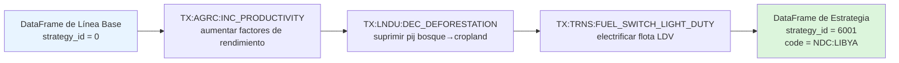

# Estrategias: Componiendo Transformaciones

En el Módulo 13 vimos que una **transformación** es una palanca de política individual y parametrizada — un callable que toma un DataFrame de entrada de línea base y devuelve un DataFrame modificado. Sin embargo, una trayectoria real de descarbonización casi nunca es una sola palanca. Es un *paquete*: mejorar la productividad de cultivos **y** detener la deforestación **y** electrificar el transporte ligero **y** sustituir el calor industrial de baja temperatura por renovables. SISEPUEDE captura ese concepto de empaquetado con la clase **`Strategy`**.

Una **estrategia** es un conjunto ordenado de transformaciones aplicadas a la base de datos de entrada de línea base. Se identifica por un `strategy_id` entero y un `strategy_code` legible por humanos. La estrategia `0` está reservada para la **línea base** (el código `BASE`) — sin transformaciones aplicadas, la plantilla de entrada inalterada fluyendo directamente a los modelos sectoriales.

## Dónde Viven las Estrategias en el Código

Tres archivos forman la maquinaria de estrategias, todos bajo `sisepuede/transformers/`:

| Archivo | Rol |
|---|---|
| `transformations.py` | Registro `Transformations` — carga cada YAML/CSV de transformación y las expone por código |
| `strategies.py` | Clase `Strategy` (compone transformaciones) y colección `Strategies` |
| `transformers.py` | La biblioteca de funciones de transformer subyacentes que las transformaciones parametrizan |

El propio registro de estrategias es una tabla de atributos. Los dos archivos relevantes en `sisepuede/attributes/` son:

- **`attribute_dim_strategy_id.csv`** — el mapa canónico `strategy_id → strategy_code`, con descripciones y el puntero `baseline_strategy_id`.
- **`attribute_strategy_code.csv`** — una *matriz de pertenencia* ancha: una fila por estrategia, una columna por código de transformación `TX:*`, con banderas `1`/`0` mostrando qué transformaciones pertenecen a cada estrategia.

Una vista recortada de `attribute_dim_strategy_id.csv`:

```csv
strategy_id,strategy,strategy_code,baseline_strategy_id,Description
0,Baseline NDP,BASE,1,Base assumptions to which all transformations are applied
1001,AGRC: All transformations,AGRC:ALL,0,All agricultural transformations
1005,AGRC: Improve crop productivity,AGRC:INC_PRODUCTIVITY,0,Increase crop yield factors by 20%
...
```

Los IDs de estrategia son deliberadamente dispersos (1001, 1002, 1003, …) para que los bloques sectoriales o temáticos de estrategias sean fáciles de escanear visualmente.

## Cómo `Strategy` Compone Transformaciones

La clase `Strategy` (`sisepuede/transformers/strategies.py`, línea 61) se construye a partir de tres cosas: un `strategy_id`, una lista de códigos de transformación y una referencia al registro `Transformations`. Internamente, `_initialize_function()` resuelve cada código en su callable subyacente y los envuelve en una única función compuesta:

```python
def function_out(**kwargs):
    out = kwargs.get("df_input")
    for f in func:                  # func = [t.function for t in transformations]
        out = f(df_input = out, strat = self.id_num)
    return out
```

Esa es la regla de composición completa. Cada transformación recibe la **salida** de la transformación anterior como su entrada. No hay merging, ni diffing, ni resolución de conflictos — la estrategia es literalmente `f_n ∘ … ∘ f_2 ∘ f_1(df_baseline)`.

### El Orden Importa

Como las transformaciones se encadenan secuencialmente, el ordenamiento es semánticamente significativo siempre que dos transformaciones toquen el **mismo campo de variable**. Algunos ejemplos:

- `TX:LNDU:DEC_DEFORESTATION` seguido por `TX:LNDU:INC_REFORESTATION` reforestará *encima de* una matriz de deforestación ya reducida — la transformación de reforestación ve una matriz `pij` donde los flujos bosque→cropland ya han sido suprimidos.
- `TX:AGRC:INC_PRODUCTIVITY` seguido por `TX:AGRC:DEC_EXPORTS` reduce las exportaciones contra una línea base de mayor rendimiento, así que las hectáreas absolutas ahorradas difieren del orden inverso.
- Para transformaciones no superpuestas (p.ej., `TX:WASO:INC_RECYCLING` y `TX:TRNS:FUEL_SWITCH_LIGHT_DUTY`) el orden es irrelevante — tocan campos de variables disjuntos.

En la práctica, el orden en `attribute_strategy_code.csv` sigue el orden de columnas de esa tabla (alfabético por código de transformación). Para la gran mayoría de las estrategias eso es benigno porque la mayoría de las transformaciones apuntan a campos disjuntos. Cuando *no* es benigno, deberías definir la estrategia explícitamente en código y fijar el orden.

## El Pipeline de Composición



El DataFrame de salida tiene la misma forma que la línea base — mismas regiones, mismos periodos de tiempo, mismos campos de variables — pero con columnas seleccionadas reescritas por las transformaciones encadenadas.

## Patrones Comunes de Estrategias

Mirando `attribute_strategy_code.csv` (la matriz de pertenencia), recurren cuatro grandes familias de estrategias en cada implementación nacional:

1. **`BASE`** — `strategy_id = 0`. Sin transformaciones. Siempre presente.
2. **Estrategias de palanca única** — un solo `1` en la fila. Usadas para curvas de costos marginales de abatimiento y análisis de sensibilidad tipo tornado. P.ej. `AGRC:DEC_CH4_RICE`, `LNDU:INC_REFORESTATION`, `FGTV:INC_GAS_RECOVERY`.
3. **Paquetes sectoriales** — toda transformación en un sector activada. Ejemplos ya en el repositorio: `AF:ALL` (todo AFOLU), `EN:ALL` (toda energía), `CE:ALL` (toda economía circular), `IPPU:ALL`. Estos son los bloques de construcción para `EN:BUNDLE_EFFICIENCY`, `EN:BUNDLE_FUEL_SWITCH`, etc.
4. **Estrategias de trayectoria** — narrativas completas de descarbonización transversales a sectores. Las estrategias específicas de país de NDC y Net-Zero se construyen aquí, típicamente apilando los paquetes sectoriales y superponiendo un pequeño número de palancas específicas del país.

El sufijo `_PLUR` en muchos códigos de estrategia (p.ej. `AGRC:ALL_PLUR`) indica que la estrategia también activa `TX:LNDU:PLUR` — *Reasignación Parcial de Uso de Suelo* (Partial Land Use Reallocation) — que permite al modelo de uso de suelo de Markov absorber cambios endógenos en demanda de cropland reequilibrando la matriz `pij` en lugar de mantenerla fija.

## Registrando una Nueva Estrategia

Supongamos que quieres registrar una estrategia "detener flaring + recuperar gas" estilo Libia. Se requieren dos ediciones:

**1. Agregar una fila a `attribute_dim_strategy_id.csv`:**

```csv
6020,FGTV: Stop flaring and recover gas,FGTV:STOP_FLARE_RECOVER,0,Combined flaring reduction and gas recovery
```

**2. Agregar una fila a `attribute_strategy_code.csv`** con `1` en las columnas `TX:FGTV:DEC_LEAKS`, `TX:FGTV:INC_FLARE` y `TX:FGTV:INC_GAS_RECOVERY`, y `0` en todas las demás. El orden de los encabezados del archivo de matriz dicta el orden de llamada en tiempo de ejecución.

La clase de colección `Strategies` autodescubre la nueva fila al instanciarse, construye la función compuesta, y la estrategia queda direccionable por `strategy_id = 6020` en todo el flujo posterior. No se requiere edición de Python para una estrategia que reutiliza transformaciones existentes — solo cuando además necesitas una *nueva* transformación cambia `transformations.py`.

## Cómo se Conectan las Estrategias al Diseño Experimental

Las estrategias son uno de los tres ejes del diseño experimental de SISEPUEDE (Fase 4 en el mapa de la base de código):

```
primary_id  ↔  (design_id, strategy_id, future_id)
```

`OrderedDirectProductTable` (en `sisepuede/data_management/ordered_direct_product_table.py`) codifica el producto cartesiano de diseños × estrategias × futuros en un único `primary_id` entero. Para cada `primary_id`, `generate_scenario_database_from_primary_key()` (en `sisepuede/manager/sisepuede.py`, línea 1581) decodifica la estrategia de regreso a su objeto `Strategy`, llama a su función compuesta sobre la línea base perturbada, y alimenta el resultado a `SISEPUEDEModels.project()`.

Esto significa que una corrida típica de 5 estrategias × 1000 futuros produce 5,000 `primary_id`s por región — cada estrategia se evalúa contra la misma muestra de Hipercubo Latino de futuros de incertidumbre, que es exactamente lo que hace de SISEPUEDE un marco DMDU (Toma de Decisiones bajo Incertidumbre Profunda) en lugar de una herramienta de proyección determinística.

En el siguiente módulo veremos en detalle la capa de diseño experimental: cómo se generan las muestras LHS para **palancas** (L) y **incertidumbres exógenas** (X), cómo se combinan con las estrategias para formar `primary_id`, y cómo los cuatro diseños canónicos (línea base, solo X, solo L, completo) particionan el espacio de análisis.

<Quiz>
  <Question prompt="La estrategia 0 en SISEPUEDE siempre corresponde a:">
    <Choice correct>La línea base (sin transformaciones aplicadas)</Choice>
    <Choice>La estrategia Net-Zero</Choice>
    <Choice>La primera estrategia NDC registrada</Choice>
    <Choice>Un placeholder inválido que debe omitirse</Choice>
  </Question>
  <Question prompt="¿Por qué importa a veces el orden de las transformaciones dentro de una estrategia?">
    <Choice>Porque SISEPUEDE cachea las transformaciones y solo se aplica la primera</Choice>
    <Choice correct>Porque cada transformación opera sobre la salida de la anterior, así que dos transformaciones que toquen el mismo campo de variable pueden producir resultados distintos según el orden</Choice>
    <Choice>Porque la cadena de Markov es no conmutativa solo para estrategias AFOLU</Choice>
    <Choice>El orden nunca importa; las transformaciones siempre se mergean aditivamente</Choice>
  </Question>
  <Question prompt="¿Qué dos archivos de atributos juntos registran una nueva estrategia?">
    <Choice>attribute_cat_strategy.csv y strategy_yaml.csv</Choice>
    <Choice>strategy_definitions.csv y primary_id_map.csv</Choice>
    <Choice correct>attribute_dim_strategy_id.csv (id/código/descripción) y attribute_strategy_code.csv (matriz de pertenencia de transformaciones)</Choice>
    <Choice>Solo attribute_dim_strategy_id.csv — la matriz de pertenencia se genera automáticamente</Choice>
  </Question>
</Quiz>
