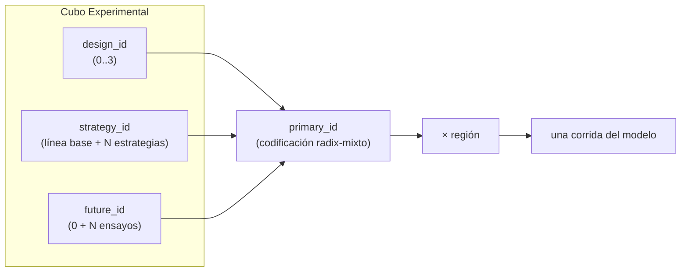
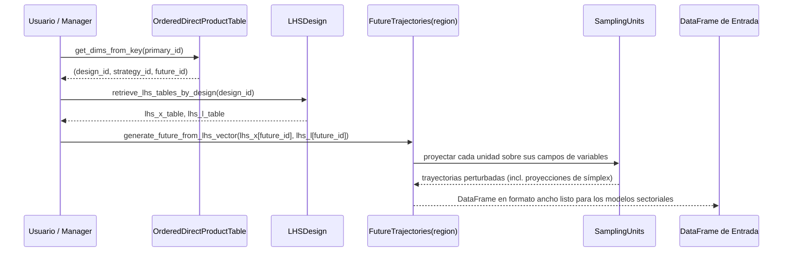

# Módulo 15 — Diseño Experimental: LHS, Estrategias y Futuros

Bienvenido a la **Parte V — Toma de Decisiones bajo Incertidumbre Profunda (DMDU)**. Los módulos anteriores te enseñaron lo que SISEPUEDE *calcula* — el esquema de variables, los modelos sectoriales y los transformers que componen estrategias de política. Este módulo te enseña lo que SISEPUEDE *ejecuta*: un diseño experimental estructurado que combina elecciones de política con miles de futuros plausibles, de modo que las decisiones puedan someterse a pruebas de estrés en lugar de optimizarse para un solo pronóstico.

## 1. ¿Por qué DMDU?

La planificación climática, energética y de uso de suelo en un horizonte de 30–50 años enfrenta **incertidumbre profunda** — un régimen en el que los tomadores de decisiones no pueden ponerse de acuerdo, y los analistas no pueden estimar de manera creíble, sobre las distribuciones de probabilidad de parámetros clave (costos tecnológicos, crecimiento del PIB, sensibilidad climática, productividad de la tierra). El análisis costo-beneficio tradicional colapsa estas incertidumbres en estimaciones puntuales y produce una única política "óptima". DMDU en cambio pregunta: **¿qué decisiones se desempeñan aceptablemente a través del rango más amplio de futuros plausibles?**

El linaje metodológico que SISEPUEDE hereda de RAND — Robust Decision Making (RDM), Scenario Discovery, Many-Objective Robust Decision Making — comparte un requisito operativo: un **gran ensamble** de corridas del modelo que multiplica de manera cruzada *lo que elegimos* (estrategias, palancas) con *lo que no controlamos* (incertidumbres exógenas). La maquinaria de diseño experimental de SISEPUEDE existe para generar, indexar y reproducir ese ensamble eficientemente.

## 2. El Diseño Tridimensional

Cada corrida de SISEPUEDE se identifica de forma única por una tupla a lo largo de tres ejes ortogonales, evaluada para cada región:



- **`design_id`** — selecciona *qué* incertidumbres se perturban (ver §4).
- **`strategy_id`** — selecciona *qué* paquete de política de transformers se aplica. Definido en `ATTRIBUTE_STRATEGY`. `strategy_id = 0` es la línea base.
- **`future_id`** — selecciona *qué* fila de la muestra LHS se usa para perturbar entradas. `future_id = 0` es la línea base determinística (sin perturbación).
- **`region`** — país/región; se mantiene *fuera* de `primary_id` porque la misma (design, strategy, future) es significativa entre regiones.

La cardinalidad es multiplicativa: 4 diseños × 5 estrategias × 1,000 futuros × 33 regiones = **660,000 corridas**. Sin un índice compacto, esta combinatoria se vuelve inmanejable.

## 3. `primary_id` y `OrderedDirectProductTable`

Archivo: `sisepuede/data_management/ordered_direct_product_table.py`.

En lugar de materializar un DataFrame índice de 660k filas, SISEPUEDE codifica el producto (design × strategy × future) como un **entero de radix mixto**. Cada eje se convierte en un "dígito" con su propia base igual a la cardinalidad de esa dimensión. La codificación es exactamente análoga a cómo un reloj codifica (horas, minutos, segundos) en segundos totales, excepto que las bases son arbitrarias.

Dos métodos potencian todas las búsquedas en O(n_dims):

- `get_key_value(design_id=..., strategy_id=..., future_id=...) -> primary_id`
- `get_dims_from_key(primary_id) -> dict`

La región se excluye de este producto. Las filas de salida se direccionan en la base de datos como `(region, primary_id)`. Esto significa que las muestras LHS son **compartidas entre regiones** — `future_id = 47` perturba los mismos factores en las mismas magnitudes en cada país, lo cual es esencial para análisis de robustez transversales a países.

## 4. La Convención de Cuatro Diseños

La tabla `ATTRIBUTE_DESIGN` contiene exactamente cuatro filas por convención:

| `design_id` | `vary_x` | `vary_l` | Significado |
|---:|:---:|:---:|---|
| 0 | 0 | 0 | **Línea base** — sin perturbación; equivalente a ejecutar estrategias determinísticas |
| 1 | 1 | 0 | **Solo X** — varía incertidumbres exógenas, mantiene los efectos de palanca en la intención de diseño |
| 2 | 0 | 1 | **Solo L** — varía la efectividad de las palancas, mantiene fijo el mundo exógeno |
| 3 | 1 | 1 | **Incertidumbre completa** — ambos perturbados (experimento típico de robustez) |

Esta partición factorial es lo que hace que las salidas de SISEPUEDE sean *diagnosticables*. Comparando el diseño 1 vs 3 aíslas cuánto del rango en emisiones proviene de la incertidumbre de política (L); comparando 2 vs 3 aíslas la incertidumbre exógena (X). Cada fila también lleva parámetros de transformación lineal `(m, b, inf, sup)` aplicados a los sorteos LHS crudos en [0,1] (ver §6).

## 5. LHS vía pyDOE2 — Dos Muestras Separadas

Archivo: `sisepuede/data_management/lhs_design.py`.

La clase `LHSDesign` posee el muestreo. En la inicialización conoce `n_factors_x`, `n_factors_l`, y `n_trials`. Cuando se llama a `generate_lhs()` invoca `pyDOE2.lhs()` **dos veces**:

```python
arr_lhs_x = pyd.lhs(n_factors_x, samples=n_trials, ...)  # exogenous
arr_lhs_l = pyd.lhs(n_factors_l, samples=n_trials, ...)  # lever effects
```

Ambos arreglos tienen forma `(n_trials, n_factors)` con valores en `[0, 1]`. Las dos muestras son independientes — el Muestreo de Hipercubo Latino garantiza cobertura marginal estratificada del intervalo unitario de cada factor, pero X y L se muestrean por separado para que un "futuro" (sorteo X) y una "realización de palanca" (sorteo L) puedan combinarse o mantenerse fijos independientemente por diseño.

`future_id = 0` está reservado como la línea base determinística y *no* se sortea de la muestra — corresponde a todos los factores en su valor nominal (sin perturbación aplicada).

Las semillas aleatorias se incrementan en uno por cada tabla LHS generada, asegurando reproducibilidad mientras se mantienen los sorteos X y L decorrelacionados.

## 6. Escalamiento Lineal por Diseño

Los sorteos LHS crudos viven en `[0, 1]`. Para convertirlos en perturbaciones significativas para el modelo, la fila de diseño aplica una **transformación lineal recortada** factor por factor:

$$
y = \max\bigl(\min(m \cdot x + b,\ \text{sup}),\ \text{inf}\bigr)
$$

Los cuatro parámetros vienen de las columnas de `ATTRIBUTE_DESIGN`: `linear_transform_l_m`, `linear_transform_l_b`, `linear_transform_l_inf`, `linear_transform_l_sup` (y campos análogos para X). Cuando un diseño tiene `vary_l = 0`, los sorteos L se colapsan a una constante (típicamente 1.0) sin importar la fila LHS subyacente — así es como el diseño 1 ("Solo X") suprime la variación de efectos de palanca mientras todavía consume un `future_id`.

`LHSDesign.retrieve_lhs_tables_by_design(design_id)` devuelve las tablas L y X post-transformación como `pd.DataFrame`s indexados por `future_id`, listos para ser consumidos aguas abajo.

## 7. `SamplingUnit` — Clasificación X vs L

Archivo: `sisepuede/data_management/sampling_unit.py`.

Una **`SamplingUnit`** es el objetivo atómico de perturbación: una trayectoria de variable (o un grupo restringido, como un símplex de mezcla de combustibles). Cada unidad declara:

- `variable_trajectory_group_type` — que clasifica la unidad como **L** (efecto de palanca) o **X** (incertidumbre exógena).
- `variable_trajectory_group` — un entero que ata variables que **deben moverse en concierto**. El caso canónico es un símplex: un vector de fracciones (p.ej., participación de electricidad de solar/eólica/gas/...) que debe sumar 1 en cada paso de tiempo. Todos los miembros de un símplex comparten el mismo entero de grupo y consumen un *único* factor LHS; la lógica interna de la unidad proyecta el sorteo escalar sobre la superficie restringida.
- `field_trajgroup_no_vary_q` — una bandera que excluye la unidad del muestreo por completo (variables degeneradas o no soportadas).

La clasificación importa porque determina si la unidad lee su magnitud de perturbación de `arr_lhs_x` o `arr_lhs_l`, y por tanto qué bandera `vary_*` en el diseño la controla.

## 8. `FutureTrajectories` y Materialización de Entradas

Se construye un objeto `FutureTrajectories` **por región**. Posee todos los `SamplingUnit`s para esa región, atados a su posición en `arr_lhs_x` / `arr_lhs_l`. Su método central es:

```python
df_input = future_trajectories.generate_future_from_lhs_vector(
    lhs_x = vec_x,   # one row of the X table
    lhs_l = vec_l,   # one row of the L table
)
```

Esto produce el DataFrame de entrada en formato ancho (filas = periodos de tiempo, columnas = campos de variables) que los modelos sectoriales consumen. La materialización es *perezosa*: los DataFrames de entrada se generan bajo demanda a partir de los vectores fila de LHS en lugar de almacenarse — esto es lo que mantiene tratable en disco un experimento de 660k corridas.

El punto de entrada de orquestación es `SISEPUEDE.generate_scenario_database_from_primary_key(primary_id, region)` en `sisepuede/manager/sisepuede.py` (alrededor de la línea 1581):



El mismo `primary_id` siempre reproduce el mismo DataFrame de entrada — dadas las mismas plantillas base y la misma semilla aleatoria.

## 9. Juntándolo Todo

Un experimento típico de robustez para un equipo país luce así:

1. Definir estrategias en `ATTRIBUTE_STRATEGY` — cada estrategia es una composición de transformers (Módulo 14).
2. Elegir `n_trials` (comúnmente 1,000 para producción, 50–100 para prototipado).
3. Usar las 4 filas de diseño estándar para que los diagnósticos de Solo X y Solo L estén disponibles.
4. Ejecutar el manager del experimento; SISEPUEDE itera `(region, primary_id)` y escribe resultados en `MODEL_OUTPUT`.
5. Posprocesar: el scenario discovery sobre el ensamble resultante identifica los futuros en los que una estrategia dada falla (o tiene éxito) — el fundamento de los módulos DMDU subsecuentes.

El siguiente módulo desarma el `SISEPUEDEExperimentalManager` de extremo a extremo, incluyendo paralelización, fragmentación por primary-id y semántica de escritura a la base de datos.

<Quiz>
  <Question
    question="En la convención de 4 diseños de SISEPUEDE, ¿qué diseño aísla la incertidumbre exógena manteniendo fijos los efectos de palanca?"
    options={[
      "design_id = 0 (línea base)",
      "design_id = 1 (Solo X)",
      "design_id = 2 (Solo L)",
      "design_id = 3 (incertidumbre completa)"
    ]}
    correctIndex={1}
    explanation="design_id = 1 tiene vary_x = 1 y vary_l = 0: las incertidumbres exógenas se perturban vía arr_lhs_x mientras los efectos de palanca se mantienen en su valor nominal."
  />
  <Question
    question="¿Por qué arr_lhs_x y arr_lhs_l se generan como DOS llamadas separadas a pyDOE2.lhs() en lugar de una muestra combinada?"
    options={[
      "pyDOE2 no puede generar muestras con más de 50 factores a la vez.",
      "Para que los sorteos exógenos y de efecto de palanca puedan ser incluidos o suprimidos independientemente por las banderas vary_x / vary_l de cada fila de diseño.",
      "Para reducir a la mitad la huella de memoria de la matriz LHS.",
      "Porque el Muestreo de Hipercubo Latino no soporta más de un tipo de variable."
    ]}
    correctIndex={1}
    explanation="Muestras X y L independientes permiten que las filas de diseño activen factorialmente qué fuente de incertidumbre está activa — habilitando diseños diagnósticos como Solo X (1) y Solo L (2)."
  />
  <Question
    question="¿Cómo codifica primary_id (design_id, strategy_id, future_id)?"
    options={[
      "Como un hash SHA-256 de los tres IDs.",
      "Como una cadena separada por comas almacenada en la base de datos de salida.",
      "Como un entero de radix mixto donde cada eje usa su propia cardinalidad como base.",
      "Como un UUID asignado aleatoriamente en tiempo de ejecución."
    ]}
    correctIndex={2}
    explanation="OrderedDirectProductTable codifica el cubo como un entero de radix mixto para que las búsquedas en cualquier dirección (key → dims, dims → key) sean O(n_dims) sin materializar la tabla completa de productos."
  />
  <Question
    question="¿Qué significa cuando varias SamplingUnits comparten el mismo entero variable_trajectory_group?"
    options={[
      "Son duplicados y una se ignora en tiempo de ejecución.",
      "Forman un conjunto restringido (p.ej., un símplex de fracciones de mezcla de combustibles) y consumen un único factor LHS que se proyecta sobre la superficie de restricción.",
      "Pertenecen al mismo modelo sectorial.",
      "Comparten una semilla aleatoria pero por lo demás son independientes."
    ]}
    correctIndex={1}
    explanation="Enteros de grupo compartidos marcan variables que deben moverse en concierto bajo una restricción. El caso canónico es un símplex (fracciones que suman 1); el grupo consume un factor LHS y la unidad proyecta el sorteo escalar sobre la superficie restringida."
  />
</Quiz>
